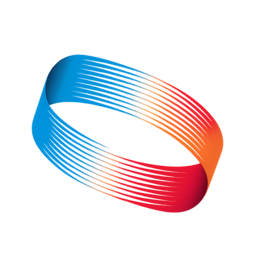

<p align="center">
  
  <br>
  <h1 align="center">HelixScreen</h1>
  <p align="center"><strong>A modern touch interface for Klipper 3D printers</strong></p>
  <p align="center"><a href="https://helixscreen.org">helixscreen.org</a></p>
</p>

<p align="center">
  <a href="https://github.com/prestonbrown/helixscreen/actions/workflows/build.yml"></a>
  <a href="https://github.com/prestonbrown/helixscreen/actions/workflows/quality.yml"></a>
  <a href="https://www.gnu.org/licenses/gpl-3.0"></a>
  <a href="https://lvgl.io/"></a>
  
  <a href="https://github.com/prestonbrown/helixscreen/releases"></a>
  <a href="https://discord.gg/RZCT2StKhr"></a>
</p>

Your printer can do way more than your current touchscreen lets you. Bed mesh visualization, input shaper graphs, multi-material management, print history — it's all trapped in a browser tab. HelixScreen puts it at your fingertips.

Fast, beautiful, and frugal enough to run on hardware you already own — your printer's onboard SoC, a Raspberry Pi from a drawer, or anything newer.

Run it right on your printer, or on a separate device — a spare Pi, a mini PC, even your desktop — as a remote screen pointed at your printer's Moonraker over the network. Great for a floor-standing printer with a screen up on your desk.

---

**Quick Links:** [Website](https://helixscreen.org) · [Features](#features) · [Screenshots](#screenshots) · [Installation](#installation) · [User Guide](docs/user/USER_GUIDE.md) · [FAQ](#faq) · [Contributing](CONTRIBUTING.md) · [Changelog](CHANGELOG.md) · [Discord](https://discord.gg/RZCT2StKhr)

---

## Why HelixScreen?

- **Customizable dashboard** — Multi-page grid with drag-to-reposition, edge resize, and 30+ widgets including temperature graphs, fan arcs, and power toggles
- **Every feature at your fingertips** — 30+ panels, 20+ overlays, 20+ modals, 300+ XML layouts
- **~15MB RAM on embedded targets, ~75MB disk** — sips memory on a Creality K1 or Flashforge AD5M; a few times more on 64-bit Pi, still well under what other touchscreen UIs need. Your printer's onboard SoC or an older Pi is plenty — no need to buy new hardware.
- **80+ printers in the database** — Auto-detects your hardware and configures itself
- **Multi-material ready** — AFC, Happy Hare, ACE, AD5X IFS, CFS, Snapmaker U1, tool changers, Spoolman
- **Exclude objects** — Tap-to-exclude overhead map view with object outlines during prints
- **Looks great** — Light/dark themes with 17 presets, responsive layouts, GPU-accelerated blur
- **First-run wizard** — Guided setup discovers your printer's capabilities
- **9 languages** — English, German, Spanish, French, Italian, Japanese, Portuguese, Russian, and Chinese

<details>
<summary><strong>Technical comparison</strong></summary>

| Feature | HelixScreen | GuppyScreen | KlipperScreen |
|---------|-------------|-------------|---------------|
| UI Framework | LVGL 9 XML | LVGL 8 C | GTK 3 (Python) |
| Declarative UI | Full XML with reactive bindings | C only | Python only |
| RAM Usage | ~15MB (32-bit) | ~15-20MB | ~50MB |
| Disk Size | ~75-115MB | ~60-80MB | ~50MB |
| Multi-Material | 7 backends | Limited | Basic |
| Printer Database | 80+ models | — | Manual config |
| Display Layouts | Auto-detecting (480x320 to 1024x600; ultrawide/portrait alpha) | Fixed | Configurable |
| Internationalization | 9 languages | — | 40+ languages |
| Status | Pre-1.0, actively developed | Inactive | Mature (maintenance) |
| Language | C++17 | C | Python 3 |

</details>

## Screenshots

### Home Panel


### Print File Browser


### Bed Mesh Visualization


<details>
<summary><strong>More screenshots</strong></summary>

### Controls Panel


### Motion Controls


### AMS / Filament Management


### Input Shaper Results


### PID Tuning


### Settings


### First-Run Wizard


</details>

See [docs/devel/GALLERY.md](docs/devel/GALLERY.md) for the full gallery.

## Features

**Dashboard** — Customizable multi-page grid with drag-to-reposition, edge resize, and a catalog of 30+ widgets. Temperature graphs, fan arcs, power toggles, camera feeds, active spool, favorite macros — add what matters, hide what doesn't. Per-breakpoint layout persistence.

**Printer Control** — Print management with G-code preview, motion controls, temperature presets with per-material overrides, multi-fan control, Z-offset, speed/flow tuning, live filament consumption tracking, power device management.

**Multi-Material** — 7 filament system backends: AFC (Box Turtle, ViViD), Happy Hare (ERCF, 3MS, Tradrack, Night Owl), ACE (Anycubic ACE Pro), AD5X IFS, Creality CFS, Snapmaker U1 (with RFID spool recognition), and tool changers. Multi-unit and multi-backend support. Full Spoolman integration with spool creation wizard.

**Visualization** — 3D G-code layer preview with memory-aware geometry budgets, 3D bed mesh with async rendering, print thumbnails, frequency response charts, unified temperature graph.

**Calibration** — Input shaper with frequency response charts, PID tuning with live graph, MPC calibration (Kalico), belt tension tuning, bed mesh, screws tilt adjust, Z-offset, firmware retraction, probe management.

**Integrations** — HelixPrint plugin, power devices with quick-toggle, print history, timelapse (Moonraker plugin), exclude objects with tap-to-exclude map view, LED control (5 backends), sound alerts (SDL/PWM/M300), Bluetooth label printing (Brother QL/PT, Niimbot, MakeID).

**Display** — Auto-detecting layout system (480x320 through 1024x600; ultrawide and portrait orientations are **alpha** — see below), display rotation (0/90/180/270) with auto-detection, light/dark themes with 17 presets and live theme editor, GPU-accelerated backdrop blur, screensavers.

**System** — First-run wizard with guided hardware discovery, 80+ printer models with auto-detection, 9 languages, opt-in crash reporting with debug bundles, KIAUH installer, versioned config migration.

## Supported Platforms

| Platform | Architecture | Status |
|----------|-------------|--------|
| Raspberry Pi 3/4/5, CM4, Zero 2 W (64-bit) | aarch64 | Tested |
| Raspberry Pi 3/4 (32-bit) | armhf | Tested |
| BTT Pad / CB1 / CB2 / Manta | aarch64 | Tested |
| Creality K1 / K1C / K1 Max | MIPS32 | Tested |
| Creality K2 Pro / K2 Plus / K2 SE | ARM (musl) | Tested |
| Creality Sonic Pad | armhf | Tested |
| Flashforge AD5M / AD5M Pro | armv7-a | Tested |
| Flashforge AD5X | MIPS32 | Tested |
| Snapmaker U1 (SnapSwap toolchanger) | aarch64 | Tested³ |
| QIDI Q2, Max 4 | aarch64 | Supported¹ |
| Sovol SV06 / SV08 | Pi build | Tested |
| Elegoo Centauri Carbon | armv7-a | Tested² |
| x86 Mini PC (Debian) | x86_64 | Tested |
| macOS / Linux desktop | x86_64 / ARM64 | Development / CI |
| Android phone / tablet | arm64 / x86_64 | Experimental⁴ |

¹ QIDI models with Linux framebuffer displays (Q2, Max 4) only. Stock firmware runs standard Moonraker and works directly; community firmware like [FreeDi](https://github.com/Phil1988/FreeDi), [53Aries/Q2-Firmware](https://github.com/53Aries/Q2-Firmware), or [FreeQIDI](https://github.com/Phil1988/FreeQIDI) is optional. Older models (X-Smart 3, X-Plus 3, X-Max 3, Q1 Pro, Plus 4) ship with QIDI's MKS PI smart-panel (a TJC serial HMI that *is* the UI; TJC is the Chinese OEM that Nextion licenses globally) and are **not compatible for on-device install** without a screen replacement — see [QIDI_SUPPORT.md → Display Compatibility](docs/devel/printers/QIDI_SUPPORT.md#display-compatibility) for why. Remote-control mode works on all six QIDI models regardless.

² Elegoo Centauri Carbon requires the community [OpenCentauri COSMOS](https://github.com/OpenCentauri/cosmos) firmware ([docs](https://docs.opencentauri.cc/klipper-conversion/cosmos/cosmos/); stock Elegoo firmware has no SSH, Klipper, or Moonraker). Ships with factory white-balance calibration for the 4.3" panel.

³ Snapmaker U1 needs SSH access. Stock firmware (1.2+) provides it via the **Root access** option in printer settings; the community [PAXX Extended Firmware](https://github.com/paxx12-snapmaker-u1/SnapmakerU1-Extended-Firmware) enables SSH by default and is the easiest path. Tested on PAXX 1.3.x/1.4.x; the stock-firmware path is unverified on a real stock device. Reinstall HelixScreen after any firmware update — it resets system files and the stock screen returns until you reinstall.

⁴ Android is a **remote** client only. It monitors and controls a printer over your network and does not replace a printer's own panel. Needs Android 9.0 or newer, and runs in landscape. Not on Google Play yet, so you install the APK yourself from a [GitHub release](https://github.com/prestonbrown/helixscreen/releases/latest). See [Android app](docs/user/INSTALL.md#android-app-experimental).

## Installation

> **Run these commands on whatever machine will drive the display.**
> For an on-printer screen, that's your printer's host — SSH into your Raspberry Pi, BTT board, or (for all-in-one printers like Creality K1/K2, Flashforge AD5M/Pro) directly into the printer.
> For a **remote screen** on a separate device (a spare Pi, mini PC, etc.), run them there instead, then point it at your printer's Moonraker (IP + port `7125`) in the setup wizard. See [Remote screen setup](docs/user/INSTALL.md#remote-screen-setup-run-on-a-separate-device).

**One-line install:**
```bash
curl -sSL https://raw.githubusercontent.com/prestonbrown/helixscreen/main/scripts/install.sh | sh
```

The installer auto-detects your platform, downloads the correct binary, sets up the service, and launches the first-run wizard. To update:
```bash
curl -sSL https://raw.githubusercontent.com/prestonbrown/helixscreen/main/scripts/install.sh | sh -s -- --update
```

To install or roll back to a specific release (e.g. a last-known-good version), pass `--version` with the tag:
```bash
curl -sSL https://raw.githubusercontent.com/prestonbrown/helixscreen/main/scripts/install.sh | sh -s -- --version v0.99.111
```

Add `--clean` to wipe HelixScreen's settings and start fresh (it asks for confirmation first; your Klipper/Moonraker config and G-code are untouched). Combine the two to reinstall a specific version with default settings: `--clean --version v0.99.111`.

Also available through [KIAUH](https://github.com/dw-0/kiauh) as an extension.

**Flashforge AD5M/Pro:** We provide a [ready-made firmware image](https://github.com/prestonbrown/ff5m) (Forge-X fork with HelixScreen pre-configured) — just flash from a USB drive. Or install manually on an existing Forge-X/Klipper Mod setup.

**Android (experimental):** There is an Android build for watching and controlling a printer from a phone or tablet. It is not on Google Play yet, so download the APK from the [latest release](https://github.com/prestonbrown/helixscreen/releases/latest) and install it. `helixscreen-android-arm64-v<VERSION>.apk` covers essentially any modern phone or tablet. Nothing gets installed on the printer; the app just needs to reach Moonraker on your network. See [Android app](docs/user/INSTALL.md#android-app-experimental).

See the [Installation Guide](docs/user/INSTALL.md) for detailed instructions, display configuration, and troubleshooting.

## Development

**Want to contribute? Start at [CONTRIBUTING.md](CONTRIBUTING.md)** — it routes you by what you want to do. New contributors follow a marked path: onboarding (environment + build + a 15-minute mental model) → an annotated first contribution → the per-subsystem architecture guide.

The short version, if you just want to see it run:

```bash
# Check/install dependencies
make check-deps && make install-deps

# Build
make -j

# Run with mock printer (no hardware needed) — 'S' takes a screenshot;
# -v (INFO), -vv (DEBUG), -vvv (TRACE) for logging
./build/bin/helix-screen --test -vv

# Run tests
make test-run
```

XML layouts hot-reload by default on native builds — edit `ui_xml/*.xml`, save, watch the running UI update live.

**Test suite:** 5,000+ test cases across 600+ test files covering printer state, UI components, XML parsing, multi-material, and more.

For the daily-workflow reference (run flags, logging, config, IDE setup), see [docs/devel/DEVELOPMENT.md](docs/devel/DEVELOPMENT.md).

## FAQ

**How is this different from GuppyScreen/KlipperScreen?**
More features, far lower RAM use (~15MB on embedded targets vs ~50MB for KlipperScreen), and actively developed. The lighter footprint means the printer you have or a Pi you've owned for years is plenty — no need to chase new SBC hardware. See the [comparison table](#why-helixscreen).

**Can I run HelixScreen on a separate device instead of on my printer?**
Yes. Install it on any supported Linux device — a spare Pi, a mini PC, even your desktop — and enter your printer's IP in the wizard's Moonraker step. This is ideal when the printer is on the floor and you want the screen at your desk. Point it at Moonraker (port `7125`), not Mainsail/Fluidd. See [Remote screen setup](docs/user/INSTALL.md#remote-screen-setup-run-on-a-separate-device).

**Which printers are supported?**
Any Klipper + Moonraker printer. 80+ models in the auto-detection database spanning Voron, Creality, QIDI, Anycubic, Flashforge, Sovol, RatRig, FLSUN, Elegoo, Prusa, Snapmaker, and more. The wizard auto-discovers your printer's capabilities even if it's not in the database.

**What screen sizes are supported?**
800x480 and 1024x600 are the well-tested landscape sizes; 480x320 runs but is tight in places. Display rotation (0/90/180/270) with auto-detection.

**Ultrawide (e.g. 1920x440) and portrait (e.g. 480x800) are alpha at best.** The layout engine detects both and sizes the grid from the screen, and both get their own home dashboard layout. Portrait also covers Print Status, Print Tune, Motion, Bed Mesh and the temperature graph; ultrawide covers nothing beyond the dashboard. Every other panel falls back to the standard landscape layout and will look stretched or cramped. It will run — don't expect it to look right everywhere. Both are wide open for contributions; see the [UI Contributor Guide](docs/devel/UI_CONTRIBUTOR_GUIDE.md).

**What multi-material systems work?**
AFC (Box Turtle, ViViD), Happy Hare (ERCF, 3MS, Tradrack, Night Owl), ACE (Anycubic ACE Pro), AD5X IFS, Creality CFS, Snapmaker U1 (with RFID spool recognition), and tool changers (viesturz/klipper-toolchanger). Full Spoolman integration for spool management.

See [docs/user/FAQ.md](docs/user/FAQ.md) for the full FAQ.

## Troubleshooting

| Issue | Solution |
|-------|----------|
| SDL2 or build tools missing | `make install-deps` |
| Submodule empty | `git submodule update --init --recursive` |
| Can't connect to Moonraker | Check IP/port in settings.json |
| Wizard not showing | Delete settings.json to trigger it |
| Display upside down | Set rotation in settings or check `panel_orientation` in `/proc/cmdline` |

See [docs/user/TROUBLESHOOTING.md](docs/user/TROUBLESHOOTING.md) for more solutions, or open a [GitHub issue](https://github.com/prestonbrown/helixscreen/issues).

## Documentation

### User Guides
| Guide | Description |
|-------|-------------|
| [Installation](docs/user/INSTALL.md) | Setup for Pi, Sonic Pad, K1, K2, AD5M, AD5X, QIDI |
| [User Guide](docs/user/USER_GUIDE.md) | Using HelixScreen — panels, overlays, settings |
| [Configuration](docs/user/CONFIGURATION.md) | All settings with examples |
| [Upgrading](docs/user/UPGRADING.md) | Version upgrade instructions |
| [FAQ](docs/user/FAQ.md) | Common questions |
| [Troubleshooting](docs/user/TROUBLESHOOTING.md) | Problem solutions |
| [Telemetry & Privacy](docs/user/TELEMETRY.md) | What data is collected (opt-in) |

### Developer Guides
| Guide | Description |
|-------|-------------|
| [Development](docs/devel/DEVELOPMENT.md) | Daily workflow: run flags, logging, config, IDE setup |
| [Architecture](docs/devel/ARCHITECTURE.md) | Whole-app model + guide to the 15 architecture chapters |
| [LVGL9 XML Guide](docs/devel/LVGL9_XML_GUIDE.md) | XML syntax reference |
| [UI Contributor Guide](docs/devel/UI_CONTRIBUTOR_GUIDE.md) | Breakpoints, tokens, colors, widgets |
| [Changelog](CHANGELOG.md) | Release history |
| [Roadmap](https://github.com/prestonbrown/helixscreen/issues) | Feature timeline (labeled issues) |

## Community

**[Join the HelixScreen Discord](https://discord.gg/RZCT2StKhr)** — Get help, share your setup, request features, and follow development.

**Also discussed in:**
- [FuriousForging Discord](https://discord.gg/Cg4yas4V) — #mods-and-projects ([jump to HelixScreen topic](https://discord.com/channels/1323351124069191691/1444485365376352276))
- [VORONDesign Discord](https://discord.gg/voron) — #voc_works ([jump to HelixScreen topic](https://discord.com/channels/460117602945990666/1468467369407156346))

### Co-Maintainers Wanted

We're looking for co-maintainers to help grow HelixScreen! You can contribute broadly across the project or own a specific area that interests you:

- **Printer support** — Maintain builds and testing for specific platforms (Creality, QIDI, Flashforge, etc.)
- **Multi-material backends** — Own a filament system integration (AFC, Happy Hare, ACE, CFS, etc.)
- **UI/UX** — Help design and implement panels, overlays, and responsive layouts
- **Localization** — Maintain translations for your language
- **Documentation** — Keep guides accurate and help new users get started
- **Testing & CI** — Expand the test suite and maintain build infrastructure

If you're interested, join the [Discord](https://discord.gg/RZCT2StKhr) and introduce yourself, or open a [GitHub Discussion](https://github.com/prestonbrown/helixscreen/discussions).

**Bug Reports & Feature Requests:** [GitHub Issues](https://github.com/prestonbrown/helixscreen/issues) — please include your printer model and logs (`helix-screen -vv`) when reporting bugs.

## License

GPL v3 — See [LICENSE](LICENSE) for details. Third-party components and their licenses are listed
in [COPYRIGHT](COPYRIGHT).

One exception: **[`lib/helix-xml/`](lib/helix-xml/) is MIT**, not GPL. It is a permanent fork of the
declarative XML UI engine that shipped inside LVGL core until v9.5 removed it and moved it to the
commercial LVGL Pro. We forked from the last MIT commit (`a15dcbeb5`, 2026-01-26) and keep our own
contributions to it under MIT so the engine stays usable as a standalone library. See
[`lib/helix-xml/README.md`](lib/helix-xml/README.md).

## Acknowledgments

**Inspired by:** [GuppyScreen](https://github.com/ballaswag/guppyscreen) (general architecture, LVGL-based approach), [KlipperScreen](https://github.com/KlipperScreen/KlipperScreen) (feature inspiration)

**Built with:** [LVGL 9.5](https://lvgl.io/), [Klipper](https://www.klipper3d.org/), [Moonraker](https://github.com/Arksine/moonraker), [libhv](https://github.com/ithewei/libhv), [spdlog](https://github.com/gabime/spdlog), [SDL2](https://www.libsdl.org/), and `helix-xml` (our MIT fork of LVGL's XML engine)

**AI-Assisted Development:** Built with [Claude Code](https://github.com/anthropics/claude-code) by [Anthropic](https://www.anthropic.com/)
