# Architecture

The 15-minute mental model, then a routing table into the chapter series in
[`architecture/`](architecture/README.md) — one subsystem per chapter, about an
hour each.

## The whole app in one paragraph

HelixScreen follows one pattern everywhere — **XML → Subjects → C++**: layout
and styling live in `ui_xml/*.xml`, loaded and instantiated at runtime by our
`lib/helix-xml/` engine fork; printer data lives in C++ behind named reactive
slots (`lv_subject_t`); XML widgets bind to those subjects by name, so one C++
value change updates every bound widget with no widget code at all. The
contract: **data lives in C++, appearance lives in XML, subjects connect
them.** Background threads (WebSocket, HTTP, Bluetooth) never touch LVGL —
everything funnels through `UpdateQueue` to the main thread.

```mermaid
graph TB
    subgraph External["External Services"]
        MR["Moonraker (Klipper API)"]
        SP["Spoolman (Filament DB)"]
        GH["GitHub Releases"]
        TEL["telemetry.helixscreen.org"]
        REL["releases.helixscreen.org"]
    end
    subgraph App["Application (main.cpp → Application::run)"]
        subgraph Display["Display Layer"]
            DM["DisplayManager<br/>LVGL + DRM/fbdev/SDL auto-detect"]
            TM["ThemeManager<br/>design tokens"]
            LM["LayoutManager<br/>breakpoints"]
        end
        subgraph UI["UI Layer"]
            NAV["NavigationManager<br/>panel/overlay stack"]
            PANELS["6 root panels"]
            OVERLAYS["~60 overlay classes"]
            MODALS["41 modal XMLs"]
            XMLW["ui_xml/*.xml<br/>232 top-level + 96 components"]
        end
        subgraph State["State Layer"]
            PS["PrinterState<br/>get_printer_state()<br/>13 domains, ~120 subjects"]
            AS["AmsState<br/>per-filament-system backends"]
            TS["ToolState<br/>multi-tool tracking"]
            SM["SettingsManager"]
            SENSORS["7 sensor managers<br/>temp/humidity/width/probe/<br/>accel/color/filament"]
        end
        subgraph Comms["Communication Layer"]
            MC["MoonrakerClient<br/>WebSocket + JSON-RPC"]
            MA["MoonrakerAPI<br/>10 sub-APIs"]
            MM["MoonrakerManager<br/>owner + mock switch"]
            DISC["PrinterDiscovery +<br/>PrinterDetector (static class)"]
        end
        subgraph Periph["Peripherals & Remote"]
            BT["libhelix-bluetooth.so<br/>dlopen, BlueZ via BusThread"]
            CAM["CameraStream<br/>decode thread"]
            RCS["RemoteControlServer<br/>helix-screen ctl socket"]
            NET["WiFiManager +<br/>EthernetManager"]
            LBL["Label printers<br/>QL/Phomemo/Niimbot/MakeID"]
        end
        subgraph System["System Layer"]
            CFG["Config"]
            UQ["UpdateQueue<br/>thread-safe bridge"]
            SND["SoundManager"]
            UC["UpdateChecker"]
            CR["CrashReporter"]
            TLM["TelemetryManager"]
            LED["LedController"]
            PLG["PluginManager"]
        end
        subgraph Lifecycle["Lifecycle"]
            SSR["StaticSubjectRegistry"]
            SPR["StaticPanelRegistry"]
            SI["SubjectInitializer"]
        end
    end
    MC <-->|"WebSocket, JSON-RPC 2.0"| MR
    MA -->|"HTTP file ops"| MR
    AS -->|"REST"| SP
    UC --> GH & REL
    TLM & CR --> TEL
    BT --> LBL
    NET -->|"status subjects"| PS
    MC --> MM --> PS
    PS --> AS
    PS --> TS
    PS --> SENSORS
    MA --> MC
    PS -->|"subjects"| XMLW
    AS -->|"subjects"| XMLW
    SM -->|"subjects"| XMLW
    CAM -->|"frames"| XMLW
    XMLW --> PANELS
    XMLW --> OVERLAYS
    XMLW --> MODALS
    NAV --> PANELS
    NAV --> OVERLAYS
    RCS -->|"drives"| NAV
    MC -->|"queue_update()"| UQ
    UQ -->|"main thread"| PS
    DM --> TM & LM
    TM -->|"tokens"| XMLW
    CFG --> SM
    SND --> MC
    LED --> MA
    PLG --> MA
```

## Design Philosophy

HelixScreen is a **local touchscreen** UI — users are physically present at the printer. This fundamentally differs from web UIs (Mainsail/Fluidd) designed for remote monitoring.

**We prioritize:**
- Tactile controls optimized for touch
- At-a-glance information for the user standing at the machine
- Calibration workflows (PID, Z-offset, screws tilt, input shaper)
- Real-time tuning (speed, flow, firmware retraction)

**Lower priority for this form factor:**
- Job queue (requires manual print removal between jobs)
- System stats (CPU/memory) — not diagnosing remote issues
- Remote access/monitoring features

Don't copy features from web UIs just because "competitors have it" — evaluate whether it makes sense for a local touchscreen.

## Pick your subsystem

| I want to... | Read |
|--------------|------|
| change a screen's layout/controls | [ch. 01 — Declarative UI](architecture/01-declarative-ui.md) |
| add or observe printer data | [ch. 02 — Subjects & data flow](architecture/02-subjects-dataflow.md) |
| write background-thread code | [ch. 03 — Threading & lifetime](architecture/03-threading-lifetime.md) |
| talk to Moonraker | [ch. 04 — Moonraker integration](architecture/04-moonraker.md) |
| find which singleton owns some state | [ch. 05 — Printer state & singletons](architecture/05-printer-state.md) |
| support a printer model or gate on a capability | [ch. 06 — Discovery & capabilities](architecture/06-discovery-capabilities.md) |
| support a filament system | [ch. 07 — Filament & AMS](architecture/07-filament-ams.md) |
| add a screen, overlay, or modal | [ch. 08 — Panels, overlays & modals](architecture/08-panels-navigation.md) |
| add a home-screen widget | [ch. 09 — Home panel widgets](architecture/09-home-widgets.md) |
| change colors, spacing, or theming | [ch. 10 — Theme, tokens & layout](architecture/10-theme-tokens-layout.md) |
| change boot or shutdown ordering | [ch. 11 — Startup & shutdown](architecture/11-startup-shutdown.md) |
| work on updates, sound, LED, telemetry, plugins | [ch. 12 — System services](architecture/12-system-services.md) |
| add a peripheral or remote-control the UI | [ch. 13 — Peripherals & remote](architecture/13-peripherals.md) |
| make HelixScreen run on a new board | [ch. 14 — Build & platforms](architecture/14-build-platforms.md) |
| pay down tech debt | [ch. 15 — Known debt](architecture/15-known-debt.md) |
| work on the G-code viewer, preview download/parse, or object picking | [ch. 16 — G-code pipeline](architecture/16-gcode-pipeline.md) |

## The rules with teeth

New UI code is declarative, class-based, and token-styled: no
`lv_obj_add_event_cb()` in panels (XML `<event_cb>` instead), no imperative
show/hide or `lv_label_set_text()` (subject bindings instead), no C++ styling
with hex literals (design tokens instead), and vendor knowledge stays behind
one capability module instead of leaking into generic code. The full rule
table with the sanctioned exceptions lives in the root [`CLAUDE.md`](../../CLAUDE.md); chapter 01
explains why the engine makes these rules cheap to follow, and chapter 15 maps
the remaining imperative-UI debt and the ratchet gate that keeps it shrinking.

## Deep dives that are not chapters

- [THREADING.md](THREADING.md) — the single source of truth for cross-thread
  rules, object lifetime, and the symptom index
- [MOONRAKER_ARCHITECTURE.md](MOONRAKER_ARCHITECTURE.md) — wire-level client
  internals, HTTP execution lanes, mock design
- [LVGL9_XML_GUIDE.md](LVGL9_XML_GUIDE.md) — complete XML syntax and binding
  reference
- [DEVELOPER_QUICK_REFERENCE.md](DEVELOPER_QUICK_REFERENCE.md) — copy-paste
  code patterns ("how", where the chapters are "why")
- [REVIEW_RUBRIC.md](REVIEW_RUBRIC.md) — what to check in review, and which
  crash families the gates already cover
- [CHAMBER_HEATER.md](CHAMBER_HEATER.md) — the chamber-heater backend
  registry: how integrated (K2-style) and external-appliance (Panda Breath /
  DragonBreath) heaters are discovered, diagnosed, and ceiling-capped behind
  one interface
