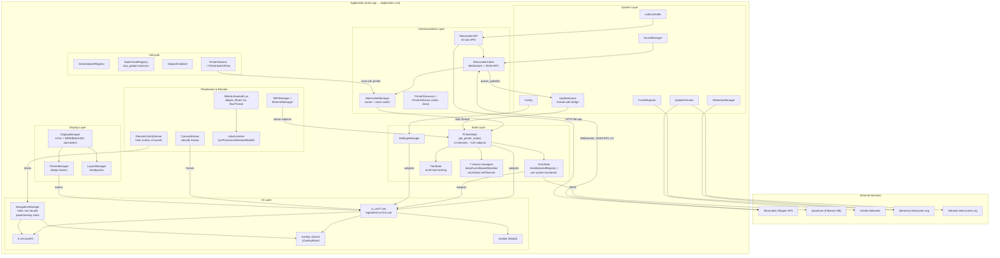

# Architecture

The 15-minute mental model, then a routing table into the chapter series in
[`architecture/`](architecture/README.md) - one subsystem per chapter, about an
hour each.

## The whole app in one paragraph

HelixScreen follows one pattern everywhere - **XML → Subjects → C++**: layout
and styling live in `ui_xml/*.xml`, loaded and instantiated at runtime by our
`lib/helix-xml/` engine fork; printer data lives in C++ behind named reactive
slots (`lv_subject_t`); XML widgets bind to those subjects by name, so one C++
value change updates every bound widget with no widget code at all. The
contract: **data lives in C++, appearance lives in XML, subjects connect
them.** Background threads (WebSocket, HTTP, Bluetooth) never touch LVGL -
everything funnels through `UpdateQueue` to the main thread. One
`PrinterSession` owns everything that belongs to the connected printer, so a
printer switch tears that scope down and rebuilds it without restarting the
process.

```mermaid
graph TB
    subgraph External["External Services"]
        MR["Moonraker (Klipper API)"]
        SP["Spoolman (Filament DB)"]
        GH["GitHub Releases"]
        TEL["telemetry.helixscreen.org"]
        REL["releases.helixscreen.org"]
    end
    subgraph App["Application (main.cpp → Application::run)"]
        subgraph Display["Display Layer"]
            DM["DisplayManager<br/>LVGL + DRM/fbdev/SDL auto-detect"]
            TM["ThemeManager<br/>design tokens"]
            LM["LayoutManager<br/>breakpoints"]
        end
        subgraph UI["UI Layer"]
            NAV["NavigationManager<br/>helix::nav facade<br/>panel/overlay stack"]
            PANELS["6 root panels"]
            OVERLAYS["overlay classes<br/>(OverlayBase)"]
            MODALS["modals (Modal)"]
            XMLW["ui_xml/*.xml<br/>registered on first use"]
        end
        subgraph State["State Layer"]
            PS["PrinterState<br/>get_printer_state()<br/>13 domains, ~120 subjects"]
            AS["AmsState<br/>AmsBackendRegistry +<br/>per-system backends"]
            TS["ToolState<br/>multi-tool tracking"]
            SM["SettingsManager"]
            SENSORS["7 sensor managers<br/>temp/humidity/width/probe/<br/>accel/load cell/filament"]
        end
        subgraph Comms["Communication Layer"]
            MC["IMoonrakerClient<br/>WebSocket + JSON-RPC"]
            MA["IMoonrakerAPI<br/>10 sub-APIs"]
            MM["MoonrakerManager<br/>owner + mock switch"]
            DISC["PrinterDiscovery +<br/>PrinterDetector (static class)"]
        end
        subgraph Periph["Peripherals & Remote"]
            BT["libhelix-bluetooth.so<br/>dlopen, BlueZ via BusThread"]
            CAM["CameraStream<br/>decode thread"]
            RCS["RemoteControlServer<br/>helix-screen ctl socket"]
            NET["WiFiManager +<br/>EthernetManager"]
            LBL["Label printers<br/>QL/Phomemo/Niimbot/MakeID"]
        end
        subgraph System["System Layer"]
            CFG["Config"]
            UQ["UpdateQueue<br/>thread-safe bridge"]
            SND["SoundManager"]
            UC["UpdateChecker"]
            CR["CrashReporter"]
            TLM["TelemetryManager"]
            LED["LedController"]
        end
        subgraph Lifecycle["Lifecycle"]
            SSR["StaticSubjectRegistry"]
            SPR["StaticPanelRegistry<br/>lazy_global instances"]
            SI["SubjectInitializer"]
            SES["PrinterSession<br/>+ PrinterSwitchFlow"]
        end
    end
    MC <-->|"WebSocket, JSON-RPC 2.0"| MR
    MA -->|"HTTP file ops"| MR
    AS -->|"REST"| SP
    UC --> GH & REL
    TLM & CR --> TEL
    BT --> LBL
    NET -->|"status subjects"| PS
    MC --> MM --> PS
    SES -->|"owns per printer"| MM
    PS --> AS
    PS --> TS
    PS --> SENSORS
    MA --> MC
    PS -->|"subjects"| XMLW
    AS -->|"subjects"| XMLW
    SM -->|"subjects"| XMLW
    CAM -->|"frames"| XMLW
    XMLW --> PANELS
    XMLW --> OVERLAYS
    XMLW --> MODALS
    NAV --> PANELS
    NAV --> OVERLAYS
    RCS -->|"drives"| NAV
    MC -->|"queue_update()"| UQ
    UQ -->|"main thread"| PS
    DM --> TM & LM
    TM -->|"tokens"| XMLW
    CFG --> SM
    SND --> MC
    LED --> MA
```

## Design Philosophy

HelixScreen is a **local touchscreen** UI - users are physically present at the printer. This fundamentally differs from web UIs (Mainsail/Fluidd) designed for remote monitoring.

**We prioritize:**
- Tactile controls optimized for touch
- At-a-glance information for the user standing at the machine
- Calibration workflows (PID, Z-offset, screws tilt, input shaper)
- Real-time tuning (speed, flow, firmware retraction)

**Lower priority for this form factor:**
- Job queue (requires manual print removal between jobs)
- System stats (CPU/memory) - not diagnosing remote issues
- Remote access/monitoring features

Don't copy features from web UIs just because "competitors have it" - evaluate whether it makes sense for a local touchscreen.

## Names you meet on day one

Each of these is the one sanctioned way to do its job; the chapter in brackets
explains it.

- **`register_xml_callbacks({{"on_x", handler}, ...})`** publishes a class's XML
  event callbacks as one table. An entry is a static function or a captureless
  lambda that reaches its owner through `user_data` or a `get_global_*()`
  accessor. [01]
- **`helix::ui::find_required(root, name, owner)` / `find_optional(root, name)`**
  look a widget up by name. Required names are checked against every layout
  variant by a gate; never index children. [01]
- **`get_printer_state().<domain>_state()`**: `PrinterState` is a facade over
  domain components (`temperature_state()`, `print_state()`, `fan_state()`,
  `network_state()`, ...), each owning its subjects. [02, 05]
- **`observe<int>(subject, this, handler, lifetime)`** is how C++ observes a
  subject. The `SubjectLifetime` argument is required: pass the one the
  subject's accessor handed you, so the guard learns when a dynamic subject
  dies. [02, 03]
- **`lifetime_.bg_cb()` / `tok.defer()`** carry background work back to the
  main thread behind an `AsyncLifetimeGuard`. [03]
- **`helix::lazy_global<T>(name, args...)`** is the body of every
  `get_global_*()` accessor: built on first use, destroyed by
  `StaticPanelRegistry` at shutdown and on a printer switch. [03, 08]
- **`helix::nav::push_overlay()` / `go_back()` / `register_overlay()`**
  (`ui_nav.h`) is the navigation facade; include `ui_nav_manager.h` only for
  the rest of `NavigationManager`. [08]
- **`IMoonrakerAPI` / `IMoonrakerClient` and the ten `I*API` sub-APIs** are the
  only Moonraker types consumer code names; the concretes live behind
  `MoonrakerManager`. Synthetic status goes through `make_status_notification()`
  so it travels the same path as a live frame. [04]

## Pick your subsystem

| I want to... | Read |
|--------------|------|
| change a screen's layout/controls | [ch. 01 - Declarative UI](architecture/01-declarative-ui.md) |
| add or observe printer data | [ch. 02 - Subjects & data flow](architecture/02-subjects-dataflow.md) |
| write background-thread code | [ch. 03 - Threading & lifetime](architecture/03-threading-lifetime.md) |
| talk to Moonraker, or change the `--test` mock printer | [ch. 04 - Moonraker integration](architecture/04-moonraker.md) |
| find which singleton owns some state | [ch. 05 - Printer state & singletons](architecture/05-printer-state.md) |
| support a printer model or gate on a capability | [ch. 06 - Discovery & capabilities](architecture/06-discovery-capabilities.md) |
| add or read a printer sensor (temperature, humidity, width, probe, load cell) | [ch. 06 - Discovery & capabilities](architecture/06-discovery-capabilities.md) |
| support a filament system | [ch. 07 - Filament & AMS](architecture/07-filament-ams.md) |
| add a screen, overlay, or modal | [ch. 08 - Panels, overlays & modals](architecture/08-panels-navigation.md) |
| add a home-screen widget | [ch. 09 - Home panel widgets](architecture/09-home-widgets.md) |
| change colors, spacing, or theming | [ch. 10 - Theme, tokens & layout](architecture/10-theme-tokens-layout.md) |
| change boot or shutdown ordering, or what a printer switch rebuilds | [ch. 11 - Startup & shutdown](architecture/11-startup-shutdown.md) |
| work on updates, sound, LED, telemetry, plugins | [ch. 12 - System services](architecture/12-system-services.md) |
| add a peripheral or remote-control the UI | [ch. 13 - Peripherals & remote](architecture/13-peripherals.md) |
| make HelixScreen run on a new board | [ch. 14 - Build & platforms](architecture/14-build-platforms.md) |
| pay down tech debt | [ch. 15 - Known debt](architecture/15-known-debt.md) |
| work on the G-code viewer, the print-status preview, or object picking | [ch. 16 - G-code pipeline](architecture/16-gcode-pipeline.md) |
| work on the ESP32 (BTT K-Touch) firmware | [ch. 17 - ESP32 firmware](architecture/17-esp32-firmware.md) |

## The rules with teeth

New UI code is declarative, class-based, and token-styled: no
`lv_obj_add_event_cb()` in panels (XML `<event_cb>` instead), no imperative
show/hide or `lv_label_set_text()` (subject bindings instead), no C++ styling
with hex literals (design tokens instead), and vendor knowledge stays behind
one capability module instead of leaking into generic code. The rules with
their sanctioned exceptions live in
[`.claude/rules/declarative-ui.md`](../../.claude/rules/declarative-ui.md) and
[`.claude/rules/vendor-abstraction.md`](../../.claude/rules/vendor-abstraction.md),
summarized in the root [`CLAUDE.md`](../../CLAUDE.md); chapter 01
explains why the engine makes these rules cheap to follow, and chapter 15 maps
the remaining imperative-UI debt and the ratchet gate that keeps it shrinking.

## Deep dives that are not chapters

- [THREADING.md](THREADING.md) - the single source of truth for cross-thread
  rules, object lifetime, and the symptom index
- [MOONRAKER_ARCHITECTURE.md](MOONRAKER_ARCHITECTURE.md) - wire-level client
  internals, HTTP execution lanes, mock design
- [LVGL9_XML_GUIDE.md](LVGL9_XML_GUIDE.md) - complete XML syntax and binding
  reference
- [DEVELOPER_QUICK_REFERENCE.md](DEVELOPER_QUICK_REFERENCE.md) - copy-paste
  code patterns ("how", where the chapters are "why")
- [REVIEW_RUBRIC.md](REVIEW_RUBRIC.md) - what to check in review, and which
  crash families the gates already cover
- [CHAMBER_HEATER.md](CHAMBER_HEATER.md) - the chamber-heater backend
  registry: how integrated (K2-style) and external-appliance (Panda Breath /
  DragonBreath) heaters are discovered, diagnosed, and ceiling-capped behind
  one interface
