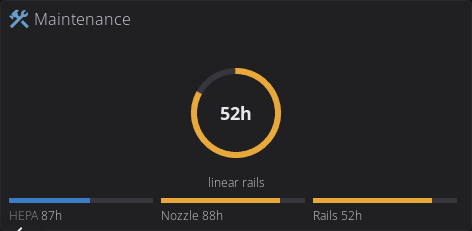
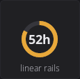
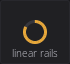
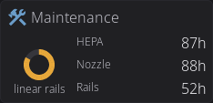
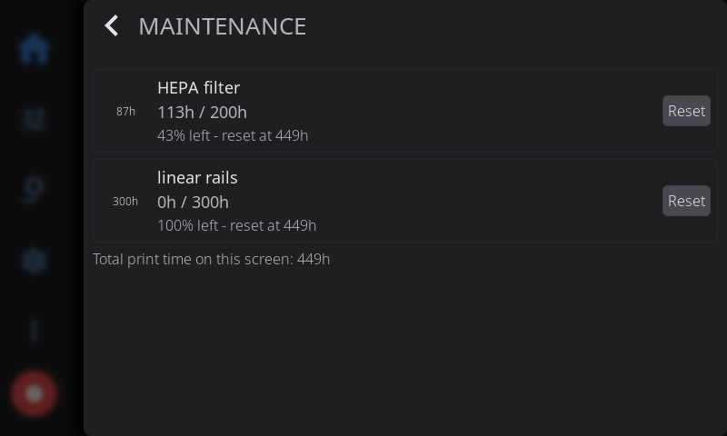

# Your First Plugin: a Maintenance Widget

This tutorial builds a real home-screen widget for HelixScreen: hour meters
for consumable parts (a HEPA filter, a nozzle, linear rails) shown as a ring
gauge that adapts to whatever size the user gives it. Everything here runs
against the mock printer; nothing touches a real machine.

The finished plugin ships in the repository at
`examples/plugins/maintenance-meter`, and the plugin API reference is
[PLUGIN_DEVELOPMENT.md](PLUGIN_DEVELOPMENT.md). This page is the story of
building it: every step is the code that made it work and the reason it is
built that way.



## What we are building

A consumables meter answers one question at a glance: how close is the part
I maintain to needing service? The ring shows the proportion of the interval
spent, the color moves from the theme primary to warning at 75 percent and
danger at due, and the number inside is hours left. The detail overlay shows
every meter with its history line and a reset button.

The widget is one component that adapts to its size, and that is the design
bar for every home widget, plugin or core:

- Home pages are unlimited and users resize widgets freely, so a widget is
  never designed around scarce space. One adaptive widget, not several
  fixed ones.
- Content grows progressively as the tile grows, when the extra pixels
  carry extra information: the smallest cell shows one ring, two columns
  add a row per meter, two rows add a bar strip under the ring.
- Text that must be centered is a label, never canvas-drawn text. The
  drawing API has no font metrics; LVGL centers a label exactly.
- The tile is a glance. The tap opens the detail.

## The plugin system in one minute

A plugin is a folder of Lua and XML that runs on the screen in its own
sandboxed Lua 5.4 state. There is no compilation: edit a file, save, and a
native dev build reloads the plugin within about a second.

Three ideas carry the whole system:

- **Subjects** are the plugin output. Lua registers named values
  (`helix.subject.int`, `helix.subject.string`), XML binds to them
  (`bind_text`), and the UI updates when they change. A plugin never
  touches a widget directly.
- **The canvas** draws. A `plugin_canvas` element in XML is an empty
  surface; Lua stages lines, arcs, rects and text into a display list and
  commits it, and the widget replays that list in its own draw event. Lua
  never runs during rendering.
- **Permissions** gate the dangerous calls. This plugin asks for none until
  it persists data; everything it needs here (subjects, canvas, widget
  hooks, the mock printer state) is permission-free.

## Step 0: the edit-save-watch loop

Run HelixScreen from a checkout with a plugin directory attached:

```sh
mkdir -p my-plugins/maintenance-meter
HELIX_PLUGIN_DIR=$PWD/my-plugins ./build/bin/helix-screen --test -vv
```

`--test` runs the mock printer. `HELIX_PLUGIN_DIR` replaces the printer
plugin source with your folder while it is set, and saving any file in the
plugin reloads it in about a second. Keep a terminal on the log: every
plugin line is tagged `[plugin maintenance-meter]`, including the reason a
load was rejected.

A new plugin is not enabled by itself. Settings > Plugins shows it after
the first load; enabling it asks for consent only when it requests
permissions. Then add the tile from the home panel edit mode: long-press
any tile, the plus button in the navbar opens the widget catalog, and the
plugin tile sits under the Plugins category. A tile needs free cells; if
the page is full, add a page. The saved placement survives the plugin being
disabled or absent and returns when it loads again.

## Step 1: the manifest

`manifest.json` describes the plugin to the screen:

```json
{
  "id": "maintenance-meter",
  "name": "Maintenance Meters",
  "version": "0.1.0",
  "author": "HelixScreen",
  "description": "Hour meters for consumables as an adaptive home tile.",
  "permissions": [],
  "widgets": [
    {
      "id": "maintenance-meter__tile",
      "name": "Maintenance",
      "icon": "wrench",
      "component": "maintenance-meter__tile",
      "colspan": 1,
      "rowspan": 1,
      "max_colspan": 4,
      "max_rowspan": 2
    }
  ],
  "settings": [
    { "key": "filter_interval_h", "type": "int", "label": "HEPA filter interval (h)",
      "min": 0, "max": 2000, "default": 200 },
    { "key": "nozzle_interval_h", "type": "int", "label": "Nozzle interval (h)",
      "min": 0, "max": 2000, "default": 500 },
    { "key": "rails_interval_h", "type": "int", "label": "Linear rails interval (h)",
      "min": 0, "max": 2000, "default": 300 }
  ]
}
```

The decisions worth copying:

- **The id is lowercase with hyphens** (`^[a-z][a-z0-9-]{1,31}$`, never an
  underscore), and the folder name must equal it. Everything the plugin
  registers is `<id>__<name>` with a double underscore: component files,
  widget ids, subjects, object names in XML. App names use single
  underscores, so the double underscore is both the proof a name belongs to
  a plugin and the limit of what it can reach.
- **One widget, authored at 1x1, resizable to 4x2.** `colspan` and
  `rowspan` are the authored size; `max_colspan` and `max_rowspan` bound
  what the user may drag it to. Authored small with a real maximum is the
  adaptive design bar: the widget earns information as it grows, so the
  smallest placement is valid and the largest is a dashboard.
- **Settings are declared, not coded.** Each entry becomes one row of a
  generated settings screen, stored and validated by the host. An int
  interval is a slider; 0 means the meter hides. No plugin code runs to
  present or persist configuration, and that is the point: config UI is a
  solved problem the plugin inherits.
- **Permissions start empty.** Nothing in this tile needs one: subjects,
  the canvas, widget hooks and printer state are free. The `storage`
  permission arrives with the pass that persists elapsed hours, and the
  consent dialog will then show exactly one line, because consent tracks
  what the plugin actually does.

## Step 2: the tile skeleton

One XML file per component, under `ui/`, named
`maintenance-meter__tile.xml`. The skeleton that everything else hangs on:

```xml
<component>
  <view extends="lv_obj"
        width="100%" height="100%" clickable="true" style_pad_all="#space_sm"
        style_pad_gap="#space_xs" flex_flow="column" scrollable="false">
    <event_cb trigger="clicked" callback="plugin_event"
              user_data="maintenance-meter__open"/>
    <lv_obj name="maintenance-meter__header" width="100%" height="content"
            flex_flow="row" style_pad_all="0" style_pad_gap="#space_xxs"
            style_flex_cross_place="center" scrollable="false"
            style_bg_opa="0" style_border_width="0">
      <bind_flag_if_eq subject="maintenance-meter__compact" flag="hidden"
                       ref_value="1"/>
      <icon name="maintenance-meter__glyph" src="wrench" size="sm" variant="secondary"/>
      <text_small name="maintenance-meter__title" text="Maintenance"/>
    </lv_obj>
    <lv_obj name="maintenance-meter__body" width="100%" flex_grow="1"
            flex_flow="column" style_pad_all="0" style_pad_gap="#space_xxs"
            scrollable="false" style_bg_opa="0" style_border_width="0">
      <lv_obj name="maintenance-meter__dial_row" width="100%" flex_grow="1"
              flex_flow="row" style_pad_all="0" style_pad_gap="#space_xs"
              scrollable="false" style_bg_opa="0" style_border_width="0">
        <lv_obj name="maintenance-meter__dial_zone" flex_grow="1" height="100%"
                scrollable="false" style_pad_all="0" style_bg_opa="0"
                style_border_width="0">
          <plugin_canvas name="maintenance-meter__gauge"
                         width="100%" height="100%"/>
          <lv_label name="maintenance-meter__big"
                    bind_text="maintenance-meter__big_value"
                    align="center" style_text_font="#font_body_bold"
                    style_text_color="#text">
            <bind_flag_if_eq subject="maintenance-meter__inner" flag="hidden"
                             ref_value="0"/>
          </lv_label>
          <lv_label name="maintenance-meter__name"
                    bind_text="maintenance-meter__big_name"
                    align="bottom_mid" style_text_font="#font_xs"
                    style_text_color="#text_muted"/>
        </lv_obj>
        <lv_obj name="maintenance-meter__list_zone" flex_flow="column" flex_grow="2"
                height="100%" style_pad_all="0" style_pad_gap="#space_xxs"
                style_flex_main_place="space_around" scrollable="false"
                style_bg_opa="0" style_border_width="0">
          <bind_flag_if_eq subject="maintenance-meter__list_zone" flag="hidden"
                           ref_value="0"/>
          <lv_obj width="100%" height="content" flex_flow="row" style_pad_all="0"
                  style_flex_main_place="space_between" scrollable="false"
                  style_bg_opa="0" style_border_width="0">
            <bind_flag_if_eq subject="maintenance-meter__m1_on" flag="hidden"
                             ref_value="0"/>
            <text_xs name="maintenance-meter__l1_name"
                     bind_text="maintenance-meter__l1_name"/>
            <lv_label name="maintenance-meter__l1_hours"
                      bind_text="maintenance-meter__l1_hours"
                      style_text_font="#font_small" style_text_color="#text"/>
          </lv_obj>
          <!-- rows two and three repeat the same shape -->
        </lv_obj>
      </lv_obj>
      <lv_obj name="maintenance-meter__bars_zone" width="100%" height="30"
              scrollable="false" style_pad_all="0" style_bg_opa="0"
              style_border_width="0">
        <bind_flag_if_eq subject="maintenance-meter__bars" flag="hidden"
                         ref_value="0"/>
        <plugin_canvas name="maintenance-meter__bars"
                       width="100%" height="100%"/>
      </lv_obj>
    </lv_obj>
  </view>
</component>
```

Read it bottom up, because the structure is the whole trick:

- **The tap is an event, not a callback.** The only callback a plugin may
  name is `plugin_event`, and `user_data` carries the target: here
  `maintenance-meter__open`, meaning "run the Lua handler registered as
  `open`". The host strips the id prefix; Lua never sees it. This is also
  how a settings `action` row reaches the plugin.
- **The list zone is one row per meter**, hidden until the tile is two
  columns wide (`list_zone`), each row carrying a per-meter visibility
  binding (`m1_on` - an interval of 0 hides that meter everywhere) and two
  bound labels: the short name and the hours left.
- **The dial zone exists for the labels.** `plugin_canvas` fills the zone,
  and the two labels are absolutely positioned over it: the value with
  `align="center"`, the meter name with `align="bottom_mid"`. A label
  centers itself in the zone exactly, in every theme and font; canvas text
  cannot, because the sandbox has no font metrics. Everything the plugin
  draws centered, it draws as a label.
- **The ring is always centered in the dial zone** because the Lua drawing
  centers on the canvas, and the canvas is the zone. The moment the ring
  is nudged off center to make room for something else, the centered label
  stops being centered in the ring; the bars strip below is a separate
  zone with its own canvas for exactly that reason.
- **Visibility is bound, not imperative.** `bind_flag_if_eq` ties each
  structural piece to an int subject: the header hides on a narrow tile
  (`compact`), the value hides when the ring is too small for it
  (`inner`), the bars strip shows only at two rows or taller (`bars`).
  Lua never touches a widget; it sets a subject and the XML reacts.
- **Styling is tokens.** `#space_sm`, `#font_xs`, `#text_muted` come from
  the theme, so the tile re-skins with the rest of the screen and adapts
  to the screen's size class. A hex color would freeze both. The full
  token list lives in the UI contributor guide, linked from
  [PLUGIN_DEVELOPMENT.md](PLUGIN_DEVELOPMENT.md).

## Step 3: drawing the ring

The ring is two arcs: a full gray circle in the theme border color, and a
colored sweep for the fraction of the interval spent.

```lua
local function ring(c, cx, cy, r, f, col, width)
    width = width or 6
    c:arc(cx, cy, r, 0, 360, { color = "border", width = width })
    if f <= 0.005 then return end
    local total = math.floor(360 * f + 0.5)
    local drawn, a = 0, 270
    while drawn < total do
        local step = math.min(10, total - drawn)
        local b = a + step
        local na, nb = a % 360, b % 360
        if nb == 0 then nb = 360 end
        if nb > na then
            c:arc(cx, cy, r, math.max(0, na - 1), math.min(360, nb + 1),
                  { color = col, width = width })
        else
            c:arc(cx, cy, r, math.max(0, na - 1), 360,
                  { color = col, width = width })
            c:arc(cx, cy, r, 0, math.min(360, nb + 1),
                  { color = col, width = width })
        end
        a, drawn = b, drawn + step
    end
end
```

Why it is written this way:

- **The sweep is 10-degree segments, one degree of overlap each.** The arc
  draw path only agrees with itself when both angles sit in `[0, 360]` and
  the start is below the end; a single arc asked for a start below zero
  renders a different arc than requested. Segments with normalized angles
  draw identically everywhere, and the one-degree overlap closes the
  hairline seam between neighbors.
- **Colors are tokens, again.** `"border"`, `"primary"`, `"warning"`,
  `"danger"` resolve at draw time, so a theme switch is just the next
  repaint and dark and light themes both work without a line of plugin
  code.
- **The state color is a threshold on the fraction** - primary below 75
  percent spent, warning from 75, danger at due - and the same function
  feeds the ring, the bars and the overlay, so the three never disagree.

The commit model matters here: every staged primitive is charged against
the plugin memory cap, `commit()` publishes the whole list to every live
canvas of that name, and the widget replays the list in its own draw
event. A list is rebuilt whole, never patched; re-rendering means staging
a fresh list from current state and committing it.

`ring()` is only useful once something calls it with real coordinates.
The bridge is three lines - a canvas handle acquired by short name (the
same name the XML declares, minus the id prefix), a size callback that
fires once after first layout and on every real resize, and one render
function that stages and commits:

```lua
local gauge = helix.canvas("gauge")

local function render()
    local c = gauge
    local w, hgt = c:size()
    if w > 8 and hgt > 8 then
        local r = math.floor(math.min(w, hgt * 0.66) / 2) - 6
        if r < 12 then r = 12 end
        local m = worst()
        ring(c, math.floor(w / 2), math.floor(hgt / 2), r,
             frac(m), state_color(m))
    end
    c:commit()
end

gauge:on_size(function() render() end)
```

The guard on `c:size()` matters: before the first layout the canvas
reports zero, and drawing into a zero box is wasted staging. The full
plugin's render also derives the inner-text floor and the stroke width
from `r` here - the radius is the one number every sizing decision keys
on.

## Step 4: text is labels

The number inside the ring and the meter name under it are the two labels
from step 2, bound to subjects Lua maintains:

```lua
local big_value = helix.subject.string("big_value", "--")
local big_name = helix.subject.string("big_name", "")
```

Two rules:

- **Centered text is a label.** Canvas text is positioned by pixel offset
  against a font the sandbox cannot measure; a label with `align="center"`
  is positioned by the layout engine that owns the font. The ring center
  and the label center are the same point because the canvas fills the
  zone and both center on it.
- **When the number does not fit, drop it; never relocate it.** Below a
  radius floor the ring cannot hold the number, and a bare `52h` with no
  identity is worse than no number at all: the caption stays the meter
  name, the ring carries the proportion, and the exact hours are one tap
  away in the overlay. `inner` is the subject that hides the label, set
  from the radius the drawing just computed:

```lua
local RADIUS_FLOOR = 24
inner:set(r >= RADIUS_FLOOR and 1 or 0)
```

## Step 5: the size ladder

`helix.widget` registers hooks for the declared tile; `on_size` receives
cells and pixels every time the tile is placed or resized:

```lua
helix.widget("tile", {
    on_size = function(cols, rows, w, h)
        compact:set(w < 190 and 1 or 0)
        if cols >= 2 and rows == 1 then
            list_zone:set(1)   -- a row per meter beside the dial
            bars_visible:set(0)
        elseif rows >= 2 then
            list_zone:set(0)
            bars_visible:set(1) -- per-meter bars under the dial
        else
            list_zone:set(0)
            bars_visible:set(0)
        end
        render()
    end,
})
```

The ladder, and the reasoning behind each rung:

| Tile | Content |
|---|---|
| 1x1 | ring, name caption |
| 2 cols, 1 row | dial plus one name/hours row per meter |
| 2 rows or taller | dial plus a bar per meter in the strip below |

- **Tier on pixels, not just cells.** A micro-resolution 2x1 tile is
  narrower than a medium 1x1; thresholds like the header's 190px width
  key on the pixels the hook reports, so the same code behaves correctly
  at every screen size the fleet has.
- **The stroke scales with the ring** - 6px at a dashboard radius, 4 and
  3 as the ring shrinks - so a 70px micro cell does not carry a band
  sized for a 4x2 tile.
- **One render function, one commit.** Every path ends in `render()`,
  which rebuilds the whole display list from current state. There is no
  incremental patching and no stale pixels to reason about.







## Step 6: the overlay

The tap opens one of the plugin's own components full-screen:

```lua
helix.ui.on("open", function()
    helix.ui.overlay("maintenance-meter__detail", { title = "Maintenance" })
end)
```

The overlay component is a stack of `ui_card` rows, one per meter. Each
card repeats the dial pattern at a fixed size - a 56x56 zone with the ring
canvas full-bleed and the hours-left label centered over it - beside a
static name and two bound labels, plus its own reset button. The reset
button passes an argument through `user_data` with a colon:

```xml
<lv_button name="maintenance-meter__btn_filter" height="content"
           style_pad_all="#space_xs">
  <event_cb trigger="clicked" callback="plugin_event"
            user_data="maintenance-meter__reset:filter"/>
  <lv_label text="Reset HEPA" style_text_font="#font_small"
            style_text_color="#text"/>
</lv_button>
```

```lua
helix.ui.on("reset", function(arg)
    for _, m in ipairs(METERS) do
        if m.key == arg then
            helix.ui.confirm("Reset " .. m.name,
                             string.format("Start a new %dh interval?", m.interval), {
                confirm_text = "Reset",
                on_confirm = function()
                    m.used = 0.0
                    m.reset_at = total_h
                    m.notified = false
                    save_state()
                    redraw_all()
                    helix.ui.toast(m.name .. " meter reset", "success")
                end,
            })
            return
        end
    end
end)
```

The handler receives `filter` as its `arg`. A reset discards the hours
the user has accrued, so it asks first; `on_confirm` is the only place the
zero lands. The stamp it records is the screen's total print hours, not a
wall date: the sandbox has no clock, and hours-of-printing is the clock
this plugin keeps anyway - the note line reads "reset at 449h".



## Step 7: real data

Everything so far drew from canned numbers. The finished plugin replaces
them with state that accrues, persists, and reacts to settings - and the
substitutions are small because the subjects already carry the UI.

**The store.** One key holds the whole state, and the manifest's
`permissions` grows to `["storage"]` - the consent dialog then shows
exactly one line, because consent tracks what the plugin actually does.
An update that adds a permission parks the plugin at *needs approval*
until the user re-enables it; that is the system working, not a failure.

```lua
local function load_state()
    local saved = helix.storage.get("state")
    if type(saved) ~= "table" then return end
    total_h = tonumber(saved.total_h) or 0.0
    local stored = saved.meters
    if type(stored) ~= "table" then return end
    for _, m in ipairs(METERS) do
        local s = stored[m.key]
        if type(s) == "table" then
            m.used = tonumber(s.used) or 0.0
            m.reset_at = s.reset_at
            m.notified = s.notified == true
        end
    end
end
```

Every field is validated on load with a fallback, because the store is
user-editable bytes on disk: a hand-edited file, an older version's
shape, or a truncated write must degrade to defaults, never fault.

**Accrual.** The printer state arrives by watch, the clock by timer; a
tick while printing adds one interval to every enabled meter and the
screen total:

```lua
local printing = false
helix.printer.watch("print_state", function(v)
    printing = (v == "printing")
end)

local function tick()
    if not printing then return end
    total_h = total_h + TICK_H
    for _, m in ipairs(METERS) do
        if enabled(m) then
            m.used = m.used + TICK_H
            if not m.notified and m.used >= m.interval then
                m.notified = true
                helix.ui.toast(m.name .. " due - " .. m.interval .. "h reached", "warning")
            end
        end
    end
    save_state()
    redraw_all()
end

helix.timer.every(TICK_MS, tick)
```

The `notified` latch is what makes the toast polite: crossing the
interval announces once, and only a reset re-arms it. The store write
rides the host's debounce (about half a second, one write per burst), so
a tick-a-minute cadence is one small write per minute.

**Settings drive behavior.** An interval change re-derives everything the
meter feeds, and an interval of 0 hides that meter everywhere - its list
row and overlay card both carry a visibility binding to a per-meter
subject:

```lua
for i, m in ipairs(METERS) do
    helix.settings.on_change(m.setting, function(v)
        m.interval = v or 0
        redraw_all()
    end)
end
```

```xml
<bind_flag_if_eq subject="maintenance-meter__m2_on" flag="hidden" ref_value="0"/>
```

With `m_on[i]:set(enabled(m) and 1 or 0)` inside `redraw_all`, the same
subject hides the row on the tile and the card in the overlay, and the
worst-meter ring re-picks among the meters that remain.

## Where to go from here

The full API - permissions, limits, the sandbox, debugging - is
[PLUGIN_DEVELOPMENT.md](PLUGIN_DEVELOPMENT.md). The second example,
`examples/plugins/led-effects`, shows the `gcode` permission and live
Klipper subscriptions driving a toggle tile; the temperature sparkline
in `examples/plugins/temp-spark` is the canvas deep-dive; and
`examples/plugins/print-watcher` shows `helix.http` notifications, an
overlay that controls its own settings through `helix.settings.set`, and a
translation pack under `i18n/`. Beyond that:
`helix.moonraker.on_agent_event` is the channel to a companion process on
the printer itself.
