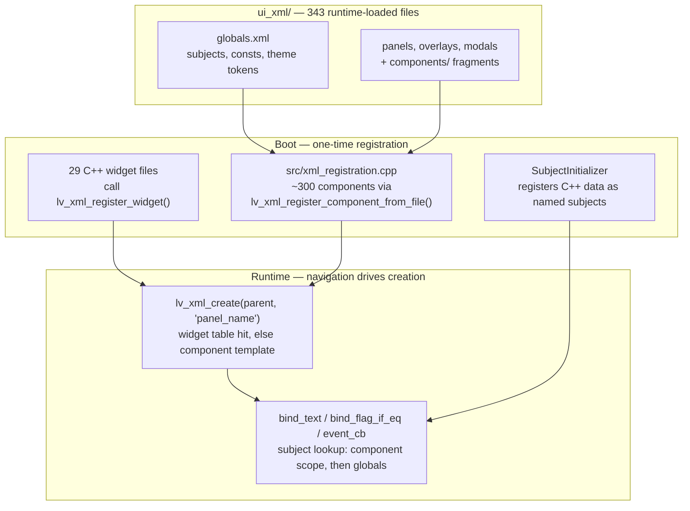
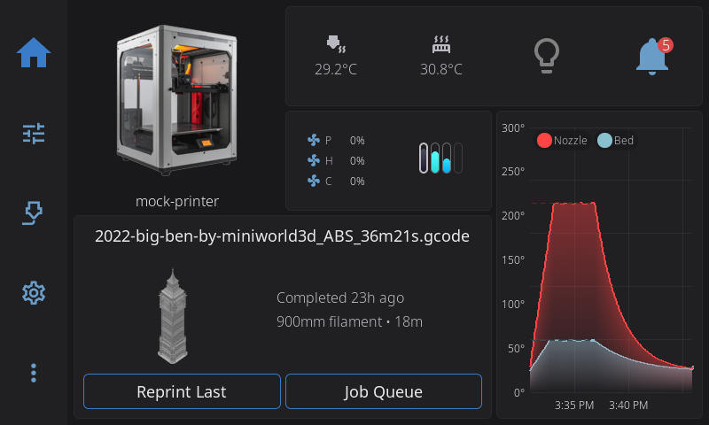

# 01 — Declarative UI

HelixScreen builds every screen the same way: an XML file describes the widget tree, C++ owns the data, and named reactive slots ("subjects") connect the two. A small XML engine — `lib/helix-xml/`, our own MIT-licensed fork of the engine LVGL removed in 9.5 — parses those files at runtime and instantiates real LVGL widgets from them, so editing a layout never requires recompiling. The contract to hold in your head is one line: **data lives in C++, appearance lives in XML, subjects connect them.**

The engine resolves three questions at runtime: *what widgets exist* (C++ registration), *what components exist* (XML file registration), and *where bindings find their data* (scope-ordered subject lookup). Everything else in this chapter is those three answers plus the lint gate that keeps new code declarative.



## Key files

| File | Role |
|------|------|
| [`src/xml_registration.cpp`](../../../src/xml_registration.cpp) | Registers every XML component file at boot; registers global event callbacks |
| [`src/application/application.cpp`](../../../src/application/application.cpp) | Startup ordering: widgets → XML components → subjects → root layout |
| [`src/application/subject_initializer.cpp`](../../../src/application/subject_initializer.cpp) | Creates subjects and publishes C++ state into them |
| [`src/application/xml_hot_reloader.cpp`](../../../src/application/xml_hot_reloader.cpp) | `HELIX_HOT_RELOAD` live re-registration and active-view rebuild |
| [`ui_xml/globals.xml`](../../../ui_xml/globals.xml) | The `globals` scope: consts, theme tokens, XML-declared subjects |
| [`ui_xml/overlay_panel.xml`](../../../ui_xml/overlay_panel.xml) | Reusable wrapper component most overlay panels extend |
| [`ui_xml/history_dashboard_panel.xml`](../../../ui_xml/history_dashboard_panel.xml) | A representative panel: consts, styles, bindings, event callbacks |
| [`ui_xml/app_layout.xml`](../../../ui_xml/app_layout.xml) | Root layout, created once at startup |
| [`src/ui/ui_card.cpp`](../../../src/ui/ui_card.cpp) | Representative custom widget (one of the 29 `lv_xml_register_widget` files) |
| `lib/helix-xml/src/xml/lv_xml.c` | Engine core: create dispatch, subject lookup, binding elements |
| `lib/helix-xml/src/xml/lv_xml_component.c` | Component registration, scopes, instantiation |
| `lib/helix-xml/src/xml/lv_xml_expr.c` | Integer expression evaluator behind `cond="..."` and `<subject_expr>` |
| [`scripts/check_imperative_ui.py`](../../../scripts/check_imperative_ui.py) | The ratchet gate counting imperative-UI violations |

## How it works

Four mechanics carry the load: the file-to-widget pipeline (including live editing), binding resolution, the shared subject namespace, and the custom-widget layer where app code meets the engine.

### From XML file to live widget

At boot, `Application` runs the phases in a fixed order (phase numbers and lines from [`src/application/application.cpp`](../../../src/application/application.cpp)):

1. Phase 7 — `register_widgets()` (`:1757`): registers the first 13 C++ widget types so the engine knows tags like `ui_card` and `ui_button`.
2. Phase 8a — translations, before any UI exists.
3. Phase 8b — rotation probe and layout-manager init, so per-display XML variant directories are known.
4. Phase 8c — `register_xml_components()` (`:1790`): registers every XML component file.
5. Phase 9a — subject initialization, so every binding can resolve.
6. Finally `lv_xml_create(m_screen, "app_layout", nullptr)` (`:1973`) instantiates the root layout.

`register_xml_components()` in [`src/xml_registration.cpp:303`](../../../src/xml_registration.cpp#L303) walks roughly 300 `register_xml("file.xml")` calls. Each resolves the path through `LayoutManager::resolve_xml_path()` ([`src/layout_manager.cpp:101`](../../../src/layout_manager.cpp#L101)) — which prefers a per-display variant subdirectory when one is active — prefixes an LVGL filesystem drive letter, and hands it to `lv_xml_register_component_from_file()`. The result is a table of component templates: named XML fragments like

```xml
<component>
  <consts>
    <!-- Layout dimensions for side-by-side stats + chart -->
    <percentage name="stats_section_width" value="55%"/>
    <percentage name="chart_section_width" value="43%"/>
  </consts>
  <view name="history_dashboard_panel" extends="overlay_panel" title="Print History" title_tag="Print History">
    <!-- child widgets, bindings, event callbacks -->
  </view>
</component>
```

(excerpted from [`ui_xml/history_dashboard_panel.xml:9`](../../../ui_xml/history_dashboard_panel.xml#L9); comments removed). A template is not yet widgets — just a parsed definition waiting to be instantiated. On ESP-class targets the registration sweep yields periodically ([`boot_yield.h`](../../../include/boot_yield.h)) so the watchdog never fires mid-sweep.

Creation happens later, on demand. When navigation needs a panel, its owner calls `lv_xml_create(parent, "history_dashboard_panel", attrs)` ([`src/ui/ui_panel_history_dashboard.cpp:226`](../../../src/ui/ui_panel_history_dashboard.cpp#L226)). The engine (`lib/helix-xml/src/xml/lv_xml.c:438`) first looks the name up in the widget-processor table — the built-in `lv_label`/`lv_slider` types plus our custom `ui_*` widgets. If that misses, it looks up a registered component scope and instantiates the template: recursively creating child widgets, applying attributes, and resolving bindings as it goes.

Components compose. A panel's `<view extends="overlay_panel">` inherits a registered wrapper template ([`ui_xml/overlay_panel.xml`](../../../ui_xml/overlay_panel.xml), registered at [`src/xml_registration.cpp:443`](../../../src/xml_registration.cpp#L443)) instead of a bare `lv_obj`; the `extends` link is resolved at instantiation time through the same widget/component tables (`lib/helix-xml/src/xml/lv_xml_component.c:200`). A component file may also declare `<consts>` — named values visible to that component's bindings and styles — which is where per-panel colors and sizes live when they are not global theme tokens.

Widget naming follows a three-level precedence, set in the engine at `lib/helix-xml/src/xml/lv_xml.c:514`: an explicit `name="..."` at the instantiation site wins; otherwise a `name` the component set on its own `<view>` root is kept; otherwise the object gets a default `<component>_#`. (Older docs claimed `<view name>` never propagated and unnamed instances were unfindable — our fork fixed that; an instance-site name that displaces a `<view>` name now logs a one-time warning, `lib/helix-xml/src/xml/lv_xml.c:473`.)

That boot-time registration is also what makes live editing work.

**Nothing above is compiled in.** `ui_xml/` files are read from disk at startup, so an XML edit takes effect on the next launch with no `make` needed. With `HELIX_HOT_RELOAD=1` you do not even relaunch: `XmlHotReloader` ([`src/application/xml_hot_reloader.cpp`](../../../src/application/xml_hot_reloader.cpp)) polls `ui_xml/` every 500 ms on a background thread, well-formedness-checks changed files with expat (no LVGL state touched off the main thread), re-registers changed components, and rebuilds the active panel/overlay/modal in place via `NavigationManager::rebuild_active_views()`. Invalid XML — mid-write truncation, syntax errors — is silently skipped; the existing UI stays live and the next poll retries. Hot reload defaults ON for native dev builds and OFF for cross-compiled release builds; `HELIX_HOT_RELOAD={0,1}` overrides either way ([`src/system/runtime_config.cpp:80`](../../../src/system/runtime_config.cpp#L80)). Three components are exempt because C++ extends their scopes after registration — `globals`, `color_picker`, `color_swatch_grid` ([`src/application/xml_hot_reloader.cpp:38`](../../../src/application/xml_hot_reloader.cpp#L38)) — a fresh registration of those would lose theme tokens and breakpoint constants. Editing [`globals.xml`](../../../ui_xml/globals.xml) therefore still needs a relaunch.

One trap follows directly from runtime loading: the XML and the binary can drift. XML referencing a widget that this binary never registered produces an unknown-element path, not a build error (`lib/helix-xml/src/xml/lv_xml.c:530`). If a layout change "does nothing", confirm the binary actually contains the C++ side of what the XML uses.

### How bindings reach data

Two binding vocabularies exist, and both end at the same lookup.

- **Attributes on real widgets**: `bind_text="my_subject"` on a label, `bind_value` on a slider, `bind_style` for reactive styling. The attribute is applied when the widget is created and subscribes the widget to the subject:

  ```xml
  <text_small name="status_message" bind_text="bed_status" style_text_align="left"/>
  ```

- **Standalone binding elements** placed as children of the widget they target — flag/state/style conditionals with comparison variants:

  ```xml
  <bind_flag_if_eq subject="buf_show_espooler" flag="hidden" ref_value="0"/>
  <bind_style_if_ge name="pad_standard" subject="ui_breakpoint" ref_value="1"/>
  ```

  (`bind_style*` targets a named style instead of a raw property — the style itself is declared elsewhere in the file. Both examples are verbatim from [`ui_xml/components/buffer_status_modal.xml:53`](../../../ui_xml/components/buffer_status_modal.xml#L53) and [`ui_xml/setting_group_header.xml:29`](../../../ui_xml/setting_group_header.xml#L29).)

  These are implemented as pseudo-widgets registered by the engine itself (`lib/helix-xml/src/xml/lv_xml.c:281` — names like `lv_obj-bind_flag_if_eq`), which is why they appear in the widget table but never in layouts as `lv_*` tags. At audit time the tree uses them heavily: 489 `<bind_flag_if_eq>` elements, 207 `<bind_flag_if_not_eq>`, 173 `<bind_state_if_eq>`, and 619 `bind_text=` attribute sites.

Every binding resolves its subject through `lv_xml_get_subject()` (`lib/helix-xml/src/xml/lv_xml.c:759`): first the current component's scope, then the global `globals` scope. A miss is not an error — the engine logs `No subject was found with name "..."` at WARN and the binding stays dead, which surfaces as a blank or frozen widget rather than a crash. That log line is the first thing to grep for when a bound value does not show up.

Events flow the other direction through the same registration idea: XML declares `<event_cb trigger="clicked" callback="on_thing_clicked"/>`, and C++ publishes the implementation with `lv_xml_register_event_cb()` (see the global registrations in [`src/xml_registration.cpp:326`](../../../src/xml_registration.cpp#L326)).

Structural conditionals avoid building both branches: `<if cond="expr">...</if>` / `<else>` builds only the matching side, and `<repeat count="4">` clones a fragment with the loop index available as bare `$i` or embedded `${i}` (`lib/helix-xml/src/xml/lv_xml.c:1137` and `:1121`). A `count` that names a subject rebuilds the fragment when that subject changes. Compound conditions stay in XML too — `<subject_expr name="x" expr="a or b gt c"/>` derives a new subject from existing ones via the integer-only evaluator in `lib/helix-xml/src/xml/lv_xml_expr.c`. Do not hand-write a C++ observer to combine subjects; the evaluator already does it.

**A preset button, end to end.** One button in [`ui_xml/temp_graph_overlay.xml:170`](../../../ui_xml/temp_graph_overlay.xml#L170) exercises every vocabulary above at once:

```xml
<ui_button name="preset_1" width="48%" bind_text="preset_material_0_name">
  <event_cb trigger="clicked" callback="on_temp_graph_preset_clicked"/>
</ui_button>
```

- `ui_button` is a custom widget: one of the 29 files calling `lv_xml_register_widget`, wired up in `Application::register_widgets()`.
- `bind_text="preset_material_0_name"` resolves at creation against the globals scope. The subject is registered from C++ in [`src/system/preset_materials.cpp`](../../../src/system/preset_materials.cpp):

  ```cpp
  static constexpr const char* NAME_SUBJECTS[PRESET_COUNT] = {
      "preset_material_0_name", "preset_material_1_name", "preset_material_2_name",
      "preset_material_3_name"};
  // ...
  lv_subject_init_string(&s.name_subjects[i], s.name_bufs[i].data(), nullptr,
                         s.name_bufs[i].size(), s.name_bufs[i].data());
  lv_xml_register_subject(nullptr, NAME_SUBJECTS[i], &s.name_subjects[i]);
  ```

  (verbatim from [`src/system/preset_materials.cpp:115`](../../../src/system/preset_materials.cpp#L115); the null scope means globals). When preset names load from settings, C++ writes the subject once and every bound button across every panel updates.

- `<event_cb ... callback="on_temp_graph_preset_clicked"/>` resolves the name against C++ registrations — here the startup table in [`src/xml_registration.cpp:589`](../../../src/xml_registration.cpp#L589):

  ```cpp
  lv_xml_register_event_cb(nullptr, "on_temp_graph_preset_clicked",
                           TempGraphOverlay::on_temp_graph_preset_clicked);
  ```

  The handler at [`src/ui/ui_overlay_temp_graph.cpp:716`](../../../src/ui/ui_overlay_temp_graph.cpp#L716) receives the click with the button's user data.

Three files, no direct references between them. The XML names a subject and a callback; C++ publishes both by name; the engine ties them at instantiation. This is the shape essentially every interactive element in the app takes.

The overlay those three files produce, as the user meets it — the preset buttons bottom-right are the excerpt's `preset_1`/`preset_2`/`preset_3` widgets, their labels ("PLA", "PETG", "ABS") arriving through the `preset_material_*` subjects that [`preset_materials.cpp`](../../../src/system/preset_materials.cpp) registers (the red banner + card under the chart is the chamber-diagnostics surface from [`components/chamber_diagnostics_card.xml`](../../../ui_xml/components/chamber_diagnostics_card.xml)):



### The globals scope: where subjects live

The `globals` component is not a screen. Its scope is the app-wide namespace every binding falls back to. [`ui_xml/globals.xml`](../../../ui_xml/globals.xml) (844 lines) declares the theme-token consts (`<color>`, `<px>`, `<str>`) and a first wave of XML-owned subjects (106 `<string>` declarations at audit time). The bulk of the namespace is registered from C++ after that: `lv_xml_register_subject(nullptr, name, &subject)` — a null scope means globals — from subject initializers across the tree ([`src/application/subject_initializer.cpp`](../../../src/application/subject_initializer.cpp) sequences them; [`src/printer/ams_state.cpp`](../../../src/printer/ams_state.cpp) alone registers 39).

Components can declare subjects of their own in a `<subjects>` block (e.g. [`ui_xml/hidden_network_modal.xml:31`](../../../ui_xml/hidden_network_modal.xml#L31)); those live in the component scope and shadow same-named globals — see the gotcha below.

The ownership split matters at teardown: XML-declared subjects are owned by the scope and die with it, while C++-registered subjects are *borrowed* — the scope stores the pointer but never frees it (the hot reloader relies on this; see `lib/helix-xml/src/xml/lv_xml.c:782` for the same split in explicit unregistration). Practically: declare a subject in [`globals.xml`](../../../ui_xml/globals.xml) when only XML writes it, register from C++ when C++ owns the storage.

### Custom widgets and the engine that runs them

The widget-processor table is not only built-ins. Twenty-nine files under `src/` call `lv_xml_register_widget()` to teach the engine new tags — the visual vocabulary of the app: `ui_card`, `ui_button`, `ui_dialog`, `ui_icon`, `ui_markdown`, `ui_spinner`, `ui_switch`, `ui_text_input`, `ui_temp_display`, `ui_carousel`, `helix_sparkline`, canvas widgets like `ui_bed_mesh` and `ui_gcode_viewer`, and more (full list: `rg -l 'lv_xml_register_widget' src/`). Each file pairs a *create* handler (runs once per instance, sets defaults) with an *apply* handler (runs on attribute application, may run again). [`src/ui/ui_card.cpp`](../../../src/ui/ui_card.cpp) is the cleanest example and a tour stop below.

The engine those 29 files register into stopped being LVGL's code in v9.5. `lib/helix-xml/` is a permanent hard fork, extracted from LVGL at commit `a15dcbeb5` — the last tree (v9.4.0-358) that still contained the XML engine before v9.5 removed it from core. It is MIT-licensed, lives in its own repository (prestonbrown/helix-xml), and upstream is us: there is no LVGL-side upstream to track. Engine changes are committed directly in the submodule, then the bumped pointer is committed here; the `patches/*.patch` workflow applies only to third-party submodules, never to this one. Because LVGL now sells an XML-based product (LVGL Pro / SquareLine), there is a clean-room rule for anything their commercial offering also has — read [`HELIX_XML_FORK.md`](../HELIX_XML_FORK.md) (listed below) before touching the engine.

## Patterns & gotchas

- **The rules are a ratchet.** New code must be fully declarative — no `lv_obj_add_event_cb()`, no `lv_label_set_text()` on XML-owned widgets, no imperative visibility flips, no C++ styling. The tree still carries 380 known violations, tracked in prestonbrown/helixscreen#1140. Run `scripts/check_imperative_ui.py --list` to see them by category (visibility 145, text 95, style 72, event 68 at audit time). The count may fall, never rise. Existing imperative sites are debt, not precedent. Chapter 15 covers the payoff plan.
- **Name every component instantiation.** Instance names beat `<view>` names, but a `<view name>` is shared by *every* instance of the component — fine for a singleton panel, useless for a repeated row. `lv_obj_find_by_name()` (1100+ call sites) is the only sanctioned lookup; child-index access breaks the moment a layout changes.
- **A dead binding is a WARN, not an error.** Misspelled subject names surface as `No subject was found with name` in the log. Debug with `-vv` and grep for that line before suspecting the data layer.
- **Inline style attributes override `bind_style`.** If a widget has both `style_bg_color="..."` and a `bind_style` targeting the same property, use two `bind_style` elements instead — the inline attribute wins and the binding looks broken.
- **Component-local subjects shadow globals.** Lookup checks the component scope first (`lib/helix-xml/src/xml/lv_xml.c:759`), so a component-local `<subject name="...">` declaration (see [`ui_xml/hidden_network_modal.xml:31`](../../../ui_xml/hidden_network_modal.xml#L31)) with the same name as a globals subject silently wins inside that component. If a bound value is stuck at a strange default, check for a same-named local declaration before blaming the C++ side.
- **Choose visibility mechanics by cost.** `<bind_flag_if_eq flag="hidden">` toggles an *already-built* subtree — right for cheap show/hide. `<if cond="...">` builds only the matching branch — right when the subtree is expensive to create (a whole card, an alternate layout). Do not build both and hide one.
- **Expression word forms, not operators.** `cond` and `<subject_expr>` use word forms (`or`, `and`, `gt`, `lt`) because `&&` and `<` need XML escaping; the evaluator is integer-only, so string formatting stays in C++ formatters.
- **C++ may not touch LVGL from background threads, and subject writes count.** `lv_subject_set_*()` fires observers that call widget APIs. Background code routes through `ui_queue_update()`. Chapter 3 and [`THREADING.md`](../THREADING.md) own the details; the rule is absolute here because the XML engine's observers run on whatever thread sets the subject.
- **Custom widgets are the sanctioned escape hatch.** The 29 files calling `lv_xml_register_widget` implement widget *types*; there is no XML beneath them to bind to, so imperative code inside them is correct by definition (see [`src/ui/ui_card.cpp:26`](../../../src/ui/ui_card.cpp#L26)). If your genuinely un-declarative site does not fit an escape hatch, annotate it `// DECLARATIVE_OK: <reason>` so audits skip it.

## Going deeper

- [`../LVGL9_XML_GUIDE.md`](../LVGL9_XML_GUIDE.md) — the full XML syntax: every widget, flex layout, styles, observer cleanup in DELETE handlers, structural conditionals, `<repeat>`.
- [`../LVGL9_XML_ATTRIBUTES_REFERENCE.md`](../LVGL9_XML_ATTRIBUTES_REFERENCE.md) — complete attribute reference, binding and style properties per widget.
- [`../HELIX_XML_FORK.md`](../HELIX_XML_FORK.md) — fork origin and licensing, why there is no upstream, the clean-room rule, feature-gap analysis vs LVGL's commercial engine.
- [`../UI_CONTRIBUTOR_GUIDE.md`](../UI_CONTRIBUTOR_GUIDE.md) — breakpoints, design tokens, colors: the layout-level conventions this chapter does not cover.
- [`../CONTRIBUTOR_GOTCHAS.md`](../CONTRIBUTOR_GOTCHAS.md) — symptom-indexed silent-failure traps ("if you see X, you forgot Y") for XML, translations, and subjects.
- [`../THREADING.md`](../THREADING.md) — the threading rules that bind every subject write (chapter 3 summarizes; this is the source of truth).

## Guided code tour

Read in this order; about 25 minutes total.

1. [`ui_xml/temp_graph_overlay.xml:54`](../../../ui_xml/temp_graph_overlay.xml#L54) — a whole live overlay in ~450 lines. Notice the orthogonal `<styles>` pairs driven by `bind_style_if cond=`, the structural `<if>` branches for portrait/landscape and the chamber-diagnostics card, `bind_text` on preset buttons (line 170), and the shared component instantiation (`<chamber_diagnostics_card/>`).
2. [`ui_xml/overlay_panel.xml:7`](../../../ui_xml/overlay_panel.xml#L7) — the wrapper component those panels extend: positioning, header, and the content slot convention.
3. [`src/xml_registration.cpp:287`](../../../src/xml_registration.cpp#L287) — the `register_xml()` helper: path resolution, the LVGL drive-letter prefix, and the ESP boot-yield. Then skim `register_xml_components()` at [`src/xml_registration.cpp:303`](../../../src/xml_registration.cpp#L303) to feel the size of the sweep.
4. [`src/application/application.cpp:1810`](../../../src/application/application.cpp#L1810) — `register_widgets()` (the first wave of C++ widget registrations), then `:1790` `register_xml_components()` and its hot-reloader wiring, and finally `:1973` the single `lv_xml_create` that instantiates the root layout. This is the whole boot ordering in four stops.
5. `lib/helix-xml/src/xml/lv_xml.c:438` — `lv_xml_create`: widget-processor table first, component scope second. Then `:514` — the name-precedence rules and the default `<component>_#` fallback.
6. `lib/helix-xml/src/xml/lv_xml.c:759` — `lv_xml_get_subject`: the component-scope-then-globals walk, and the WARN on miss you will grep for.
7. `lib/helix-xml/src/xml/lv_xml.c:281` — the `bind_*` pseudo-widget registrations; the entire binding-element vocabulary in ~25 lines.
8. [`src/ui/ui_card.cpp:26`](../../../src/ui/ui_card.cpp#L26) — one custom widget end to end: the create handler (runs once), theme style attach, and `ui_card_register()` at [`src/ui/ui_card.cpp:64`](../../../src/ui/ui_card.cpp#L64) calling `lv_xml_register_widget("ui_card", ...)`.
9. [`src/application/xml_hot_reloader.cpp:38`](../../../src/application/xml_hot_reloader.cpp#L38) — the non-reloadable component list and why; read down through the polling loop for the expat pre-check and the silent-skip behavior.
