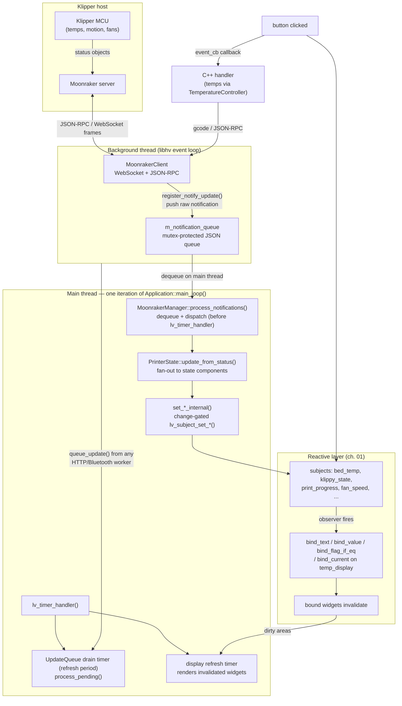

# 02 — Subjects & Data Flow

Chapter 01 covered the XML side of the declarative contract; this chapter covers the data side. A **subject** is an `lv_subject_t` — a named reactive value (int, string, or pointer) owned by a C++ state class and registered where XML bindings can find it. Writing a subject with `lv_subject_set_*()` stores the value and synchronously fires every observer attached to it; XML bindings are just observers that write into widgets, so one call updates every bound label, bar, and flag on every visible panel. All printer data moves through this one pipe: WebSocket JSON → main-thread state classes → subjects → observers → invalidated widgets → next render.

The hard part is not the pipe, it is the thread boundary. Moonraker traffic arrives on a libhv event-loop thread, and LVGL is strictly single-threaded — so everything below is organized around two bridges: a mutex-protected notification queue that hands JSON to the main thread, and the `UpdateQueue` that lets any background worker schedule main-thread work.



## Key files

| File | Role |
|------|------|
| [`src/application/moonraker_manager.cpp`](../../../src/application/moonraker_manager.cpp) | Owns the client/API; queues WebSocket notifications for the main thread and dispatches them |
| [`src/printer/printer_state.cpp`](../../../src/printer/printer_state.cpp) | The printer data model: `update_from_status()` fan-out and the `set_*()` → `set_*_internal()` marshalling pattern |
| [`include/ui_update_queue.h`](../../../include/ui_update_queue.h) | `UpdateQueue` and `queue_update()` — the any-thread-to-main-thread bridge |
| [`src/application/application.cpp`](../../../src/application/application.cpp) | The main loop ordering (notifications, then `lv_timer_handler()`) and startup subject init |
| [`src/application/subject_initializer.cpp`](../../../src/application/subject_initializer.cpp) | `SubjectInitializer` — sequences every `init_subjects()` in dependency phases |
| [`include/state/subject_macros.h`](../../../include/state/subject_macros.h) | `INIT_SUBJECT_INT` / `INIT_SUBJECT_STRING` / `INIT_SUBJECT_INT_VOLATILE` |
| [`include/state/volatile_subjects.h`](../../../include/state/volatile_subjects.h) | `VolatileSubjects` — reset table for Klippy-volatile subjects |
| [`include/observer_factory.h`](../../../include/observer_factory.h) | `observe_int_sync<Panel>()` and friends; the sanctioned way C++ observes subjects |
| [`include/ui_observer_guard.h`](../../../include/ui_observer_guard.h) | `ObserverGuard` (RAII observer cleanup) and `SubjectLifetime` (dynamic-subject death signal) |
| [`include/static_subject_registry.h`](../../../include/static_subject_registry.h) | Self-registered subject cleanup; guarantees deinit before `lv_deinit()` |
| [`src/printer/printer_temperature_state.cpp`](../../../src/printer/printer_temperature_state.cpp) | Representative state component: `bed_temp` and friends |
| `lib/lvgl/src/core/lv_observer.c` | The upstream subject engine: set, notify-if-changed, observer list |

## How it works

### From WebSocket to subject

Moonraker pushes status as JSON-RPC notifications (`notify_status_update` carrying changed Klipper status objects). The WebSocket frame lands on the libhv event-loop thread inside `MoonrakerClient`; HelixScreen's registered callback ([`src/application/moonraker_manager.cpp#register_callbacks`](../../../src/application/moonraker_manager.cpp#L617)) does exactly one thing and returns:

```cpp
// Register notification callback to queue updates for main thread
m_client->register_notify_update([this, alive](const json& notification) {
    if (!alive->load())
        return;

    std::lock_guard<std::mutex> lock(m_notification_mutex);
    m_notification_queue.push(notification);
});
```

(verbatim from [`src/application/moonraker_manager.cpp#register_callbacks`](../../../src/application/moonraker_manager.cpp#L617); the `alive` flag is the manager's destruction guard). Connection-state changes ride the same queue as synthesized `_connection_state` marker objects (`:260`). Nothing on that thread touches LVGL.

The dequeue happens on the main thread. `Application::main_loop()` ([`src/application/application.cpp#main_loop`](../../../src/application/application.cpp#L4032), entered once from `run()`) iterates: heartbeat and input housekeeping, `check_timeouts()`, then `process_notifications()` ([`src/application/application.cpp#main_loop`](../../../src/application/application.cpp#L4177)), and only then `lv_timer_handler()` (`:4136`) where rendering happens. `MoonrakerManager::process_notifications()` ([`src/application/moonraker_manager.cpp#process_notifications`](../../../src/application/moonraker_manager.cpp#L252)) drains the whole queue each pass: `_connection_state` markers go to `PrinterState::set_printer_connection_state()`, while `notify_status_update` frames are unpacked — Klipper `eventtime` and the cached-snapshot marker are read out alongside the status object — and handed to the state model:

```cpp
const double eventtime = (params.size() > 1 && params[1].is_number())
                             ? params[1].get<double>()
                             : 0.0;
const bool from_cached_snapshot =
    notification.value(helix::CACHED_SNAPSHOT_MARKER, false);
get_printer_state().update_from_status(params[0], eventtime,
                                       from_cached_snapshot);
helix::ToolState::instance().update_from_status(params[0]);
```

(verbatim from [`src/application/moonraker_manager.cpp#process_notifications`](../../../src/application/moonraker_manager.cpp#L312)). The freshness pair matters: `eventtime` is monotonic per connection, so a stale replayed snapshot cannot overwrite a newer live reading. One correction to older docs: `PrinterState::update_from_notification()` ([`src/printer/printer_state.cpp#update_from_notification`](../../../src/printer/printer_state.cpp#L355)) exists and does the same unpacking plus main-thread deferral, but the production dispatch path calls `update_from_status()` directly — the manager's own comment notes `update_from_notification` "is not wired up here"; only tests call it.

`update_from_status()` ([`src/printer/printer_state.cpp#update_from_notification`](../../../src/printer/printer_state.cpp#L386)) takes `state_mutex_` and fans out to a dozen state components — `temperature_state_`, `motion_state_`, `print_domain_`, `fan_state_`, LED, exclude-object, sensors. Each component parses its slice of the JSON and writes subjects through small setters that are change-gated: `PrinterNetworkState::set_klippy_state_internal()` ([`src/printer/printer_network_state.cpp#set_klippy_state_internal`](../../../src/printer/printer_network_state.cpp#L109)) returns early if `lv_subject_get_int()` already equals the new value, and only otherwise calls `lv_subject_set_int()`. That matters because of how the subject engine behaves: `lv_subject_set_int()` (`lib/lvgl/src/core/lv_observer.c#lv_subject_set_int`) stores the previous and current value, then notifies **only if changed**. Equal-value writes are silent no-ops — which is why `PrinterTemperatureState` explicitly calls `lv_subject_notify()` when a temperature is unchanged ([`src/printer/printer_temperature_state.cpp#update_from_status`](../../../src/printer/printer_temperature_state.cpp#L373)) to force observers to re-run.

The full worked path for one value: `heater_bed.temperature` arrives in a delta frame → `PrinterTemperatureState::update_from_status()` converts to decidegrees (all temps are stored ×10 for 0.1 °C resolution) → `lv_subject_set_int(&bed_temp_, temp_deci)` fires observers → the `bind_current="bed_temp"` on a `<temp_display>` ([`ui_xml/temp_graph_overlay.xml#"size=\"lg\" show_target=\"true\" bind_current=\"bed_temp\" bind_target=\"bed_target\""`](../../../ui_xml/temp_graph_overlay.xml#L250), [`ui_xml/portrait/print_status_panel.xml#bed_temp`](../../../ui_xml/portrait/print_status_panel.xml#L123)) updates the widget → the widget invalidates → the next refresh-timer pass repaints it. No panel code participated.

A second, smaller intake exists: RPC replies and webhooks events (Klippy ready/shutdown notifications, `printer.info` seeds) arrive as callbacks on the WebSocket thread and go through the public setters, which marshal themselves. `PrinterState::set_klippy_state()` ([`src/printer/printer_state.cpp#set_klippy_state`](../../../src/printer/printer_state.cpp#L685)) wraps `helix::async::call_method(this, &PrinterState::set_klippy_state_internal, state)` — a `queue_update()` wrapper from [`include/async_helpers.h`](../../../include/async_helpers.h) — while `set_printer_connection_state()` (`:651`) uses `async_lifetime_.defer()`, the same deferral with a generation guard so callbacks queued after teardown are dropped. AMS data does not flow through `PrinterState` at all: `AmsState` is fed by its own backend events (`sync_from_backend()`, [`include/ams_state.h#sync_from_backend`](../../../include/ams_state.h#L1379)).

### The UpdateQueue bridge

`UpdateQueue` ([`include/ui_update_queue.h#helix::ui`](../../../include/ui_update_queue.h#L94)) is a mutex-protected `std::queue` of tagged callbacks plus an LVGL timer created in `init()` that fires on the display refresh period (`:119`). Any thread calls `helix::ui::queue_update(fn)` (`:603`); the main thread executes the callbacks in `process_pending()` (`:441`) when the drain timer fires inside `lv_timer_handler()`.

Why not `lv_async_call()`? Two reasons, both visible in the header. First, ordering: `lv_async_call` runs its callbacks from the refresh cycle, which only fires when LVGL decides to render — if nothing invalidates the display, queued work never runs. The drain timer fires on the refresh period instead, so queued work lands within a frame. Second, safety: because callbacks run on the main thread inside the timer walk, they are strictly serialized with rendering and with every other timer — a queued `lv_subject_set_*()` can never interleave with an in-progress render, which is what prevents LVGL's "invalidate during rendering" assertion. One nuance the old diagram overstated: LVGL 9 timers have no priority field; ready timers run in creation order, and the display refresh timer is created at display creation, *before* `update_queue_init()` ([`src/application/display_manager.cpp#init`](../../../src/application/display_manager.cpp#L397)). The real guarantee is same-thread serialization plus the refresh period landing work within a frame — not a strict drains-before-render ordering in a same-tick collision.

The queue earns its keep in diagnostics and teardown:

- Every callback carries a **tag**; the currently-running and last-four completed tags are registered with the crash handler (`:127`), so a crash inside or shortly after `process_pending()` names the guilty subsystem in crash.txt.
- **Exceptions are swallowed and logged** (`:452`) — one bad callback cannot take down the batch — with a counter so tests can tell "ran" from "threw" (#1212).
- `queue_update(widget, ...)` overloads wrap the callback in an `lv_obj_is_valid()` guard so async work that outlives its widget is dropped, not crashed (`:709`).
- `ScopedFreeze` (`:249`) buffers enqueues during a drain-and-destroy window and splices them back on thaw, closing the race where a background thread queues work against a widget being deleted.
- Explicit `shutdown()` drains; the destructor deliberately does **not** — at static-destruction time the objects those callbacks reference are already gone (`:380`).
- `helix::ui::run_on_main(tag, fn)` (`:591`) runs inline when already on the main thread and queues otherwise — put it at a subsystem's public boundary rather than wrapping each internal call site (#960).

At audit time `queue_update(` appears at 302 call sites under `src/` and `include/`; `helix::ui::async_call()` is the drop-in same-signature replacement for `lv_async_call()` (`:676`). PrinterState's setters are the canonical pattern the AGENTS.md threading rules point at: background code never writes a subject, it queues the write.

### Subject lifecycle: init, register, reset, deinit

Subjects exist so bindings can resolve at creation time (chapter 01), so the order at boot is fixed: register XML components ([`src/application/application.cpp#run`](../../../src/application/application.cpp#L750)), initialize subjects (`:747`), and only then `lv_xml_create(m_screen, "app_layout", nullptr)` (`:1973`). `SubjectInitializer` ([`src/application/subject_initializer.cpp`](../../../src/application/subject_initializer.cpp)) sequences the sweep in dependency phases — core globals → `PrinterState` → AMS/filament → navigation (registered after PrinterState precisely so reverse-order deinit clears its observers first) → panels → observers last (`init_core_and_state()` through `init_post()`). A soft restart for printer switching re-runs the same sequence; `Application::init_printer_state()` re-arms the UpdateQueue before subject init so background callbacks already have a working queue ([`src/application/application.cpp#tear_down_printer_state`](../../../src/application/application.cpp#L4925)).

Most subjects are initialized through the macros in [`include/state/subject_macros.h`](../../../include/state/subject_macros.h): `INIT_SUBJECT_INT(name, default, subjects, register_xml)` (`:65`) initializes the `name_` member, registers it with the owning `SubjectManager` for cleanup, and registers it with the XML engine via `helix::xml::register_subject_in_current_scope()`. `INIT_SUBJECT_STRING` (`:100`) is the same for string subjects, which is where the naming convention bites: the macro expects a `char name_buf_[]` member, because LVGL string subjects **copy into a caller-owned fixed buffer** — the subject does not own its storage. `PrinterTemperatureState` registers its fixed subjects by hand instead (`lv_xml_register_subject(nullptr, "bed_temp", &bed_temp_)`, [`src/printer/printer_temperature_state.cpp#register_xml_subjects`](../../../src/printer/printer_temperature_state.cpp#L141)) because the same names are re-registered when dynamic extruders are rebuilt. Tree-wide at audit: 184 `INIT_SUBJECT_*` invocation sites across 17 files under `src/`, plus 226 direct `lv_xml_register_subject()` call sites — the old diagram's "50+ more subjects" was off by roughly an order of magnitude.

Cleanup is self-registered, never external: the last lines of `PrinterState::init_subjects()` are

```cpp
subjects_initialized_ = true;

// Self-register cleanup — ensures deinit runs before lv_deinit()
StaticSubjectRegistry::instance().register_deinit("PrinterState",
                                                  [this]() { deinit_subjects(); });
```

(verbatim from [`src/printer/printer_state.cpp#init_subjects`](../../../src/printer/printer_state.cpp#L322)). At shutdown, `StaticPanelRegistry::destroy_all()` runs first, then `StaticSubjectRegistry::deinit_all()`, then `lv_deinit()` — panels are gone before the subjects their observers point at die ([`include/static_subject_registry.h`](../../../include/static_subject_registry.h#L24)). `deinit_subjects()` itself ([`src/printer/printer_state.cpp#deinit_subjects`](../../../src/printer/printer_state.cpp#L134)) expires the class's `SubjectLifetime` token *before* tearing anything down, so surviving `ObserverGuard`s skip `lv_observer_remove()` on observer lists that `lv_subject_deinit()` is about to free.

One wrinkle deserves its own macro: Moonraker sends **delta** status (changed fields only), so a subject fed by a delta-only field keeps its last value across a Klipper restart — and when that stale value gates behavior, it is a live bug (a cached `idle_timeout` state made a restarted, idle printer look busy for a whole session, #1129). `INIT_SUBJECT_INT_VOLATILE` ([`include/state/subject_macros.h#INIT_SUBJECT_INT_VOLATILE`](../../../include/state/subject_macros.h#L129)) additionally records the subject and its default in a `VolatileSubjects` table; `PrinterState::set_klippy_state_internal()` — the single chokepoint for every Klippy state change ([`src/printer/printer_state.cpp#set_klippy_state_if_unseeded_internal`](../../../src/printer/printer_state.cpp#L711)) — resets them on any genuine transition, both directions (`:725`). Current membership is three subjects in [`src/printer/printer_calibration_state.cpp#init_subjects`](../../../src/printer/printer_calibration_state.cpp#L42) (`manual_probe_active`, `manual_probe_z_position`, `idle_timeout_printing`); the membership rules and why the reset is edge-triggered live in [`THREADING.md`](../THREADING.md) §5.

### Observing subjects from C++

XML bindings are one kind of observer; C++ code attaches the other kind through the factories in [`include/observer_factory.h`](../../../include/observer_factory.h). The default choice is `observe_int_sync<Panel>()` (`:332`). The real shape it appears in — `FanStackWidget` binding a dynamic per-fan subject — is the whole pattern in one place:

```cpp
SubjectLifetime lifetime;
lv_subject_t* subject = printer_state_.get_fan_speed_subject(fan_name, lifetime);
if (!subject)
    return {};

auto token = lifetime_.token();
auto guard = helix::ui::observe_int_sync<FanStackWidget>(
    subject, this,
    [token, on_update](FanStackWidget* /*self*/, int speed) {
        if (token.expired())
            return;
        on_update(speed);
    },
    lifetime);
```

(verbatim from [`src/ui/panel_widgets/fan_stack_widget.cpp#lifetime`](../../../src/ui/panel_widgets/fan_stack_widget.cpp#L693), `bind_fan_observer()`). Note the two lifetimes in play: the `SubjectLifetime` handed to the factory tracks the *subject's* death (fans are rediscovered on reconnect), while the widget's own `lifetime_.token()` guards the deferred lambda against the *widget* dying before it runs.

Two things the factory does for you that a hand-rolled `lv_subject_add_observer` does not. First, it **defers the handler through `queue_update()`** (`:371`), so the body runs after the current subject-notification batch completes — a handler that reassigns a guard or destroys a widget mid-batch is the re-entrancy crash family (#82, #174). Second, it copies the handler and panel pointer into the deferred lambda with a weak alive token, so the panel dying between queue and execute is a no-op, not a use-after-free. `observe_string`, `observe_int_immediate` (only when the callback provably never mutates observer lifecycle), and domain wrappers like `observe_connection_state` / `observe_print_state` round out the set. Every factory returns an `ObserverGuard` — RAII removal on destruction; `reset()` for cleanup, never `release()` (#579).

The trap the defaulted parameter hides: the factories take `const SubjectLifetime& lifetime = {}`. `SubjectLifetime` is a `shared_ptr<bool>` ([`include/ui_observer_guard.h`](../../../include/ui_observer_guard.h#L34)) that dynamic-subject owners — per-fan, per-sensor, per-extruder — flip to `false` before destroying the subject. **If you fetch a lifetime from an accessor, you must hand it to the `observe_*` call.** Omitting it compiles silently; the guard then has no token, never learns the subject died, and its `reset()` calls `lv_observer_remove()` on freed memory (#705). That is why accessors come in pairs — `get_bed_temp_subject()` and `get_bed_temp_subject(SubjectLifetime&)` ([`include/printer_state.h#"lv_subject_t* get_bed_temp_subject() {"`](../../../include/printer_state.h#L364)) — the second assigns the owner's token into your copy. Fetching the token and dropping it is the exact shape the lint gates and [`THREADING.md`](../THREADING.md) §5 exist to catch.

## Patterns & gotchas

- **Never write a subject from a background thread.** `lv_subject_set_*()` fires observers that call widget APIs; from the libhv/HTTP/DBus threads that is LVGL off-thread. Queue the write: `queue_update(tag, fn)`, `run_on_main()` at subsystem boundaries, or the `set_*()` wrapper pattern in [`printer_state.cpp`](../../../src/printer/printer_state.cpp). [`THREADING.md`](../THREADING.md) is the source of truth; the gates [`check_l081_anti_pattern.py`](../../../scripts/check_l081_anti_pattern.py) and friends police the TOCTOU shapes around it.
- **Equal-value sets do not notify.** `lv_subject_set_int()` notifies only on change (`lib/lvgl/src/core/lv_observer.c#lv_subject_set_int`); if observers must re-run on an unchanged value, call `lv_subject_notify()` explicitly (the bed-temp pattern, [`src/printer/printer_temperature_state.cpp#update_from_status`](../../../src/printer/printer_temperature_state.cpp#L373)).
- **A fetched `SubjectLifetime` must reach the `observe_*` call.** The defaulted 4th parameter makes forgetting it compile. Corollary: use the `(name, lifetime)` accessor overloads, and dynamic subjects (fans, sensors, extruders) always need one.
- **String subjects copy into a fixed buffer you own.** Size the `name_buf_` for the worst case; long values truncate, silently.
- **Delta-status staleness is behavioral, not cosmetic.** If a subject's source field stops being sent on Klipper restart and its stale value gates anything, it belongs in `INIT_SUBJECT_INT_VOLATILE` — membership rules in [`THREADING.md`](../THREADING.md) §5.
- **Every `init_subjects()` self-registers its `deinit_subjects()`** with `StaticSubjectRegistry`. External registration is the fragile pattern the registry header explicitly forbids.
- **Reverse flow goes through controllers, not raw API calls.** A click that changes a temperature must call `TemperatureController::set_target()` — the single authority for target sends — never `MoonrakerAPI::set_temperature()` directly (lint-enforced).
- **`bind_int` does not exist.** Integer values reach widgets via `bind_value` (30 sites) on sliders/bars, `bind_text` on formatted strings, and `bind_current`/`bind_target` on `temp_display` (37 sites). The old data-flow diagram listed a `bind_int` element; it is not in the engine's vocabulary.
- **Ordering claims: trust serialization, not per-tick ordering.** Notifications are dispatched before `lv_timer_handler()`, and the UpdateQueue drains inside it every millisecond — but do not write code that depends on drain-before-render within a single tick.

## Going deeper

- [`../THREADING.md`](../THREADING.md) — the single source of truth this chapter summarizes: §5 subject lifecycle, the L081 TOCTOU mechanisms, `AsyncLifetimeGuard` generations, the dynamic-subject source table.
- [`../MOONRAKER_ARCHITECTURE.md`](../MOONRAKER_ARCHITECTURE.md) — the network layer in detail: client lifecycle, subscriptions, RPC error ownership.
- [`../LVGL9_XML_GUIDE.md`](../LVGL9_XML_GUIDE.md) — the binding vocabulary from the XML side, including observer cleanup in DELETE handlers.
- [`../CONTRIBUTOR_GOTCHAS.md`](../CONTRIBUTOR_GOTCHAS.md) — symptom-indexed traps ("if you see X, you forgot Y") for subjects and XML bindings.
- [`01-declarative-ui.md`](01-declarative-ui.md) — the previous chapter: how bindings resolve subjects by scope at creation time, and the lint gate keeping new code declarative.
- [`03-threading-lifetime.md`](03-threading-lifetime.md) — the next chapter: the guard family behind dynamic-subject safety, and the widget-memory RAII wrappers (`lvgl_make_unique`) in its supporting rules.

## Guided code tour

Read in this order; about 25 minutes total.

1. [`src/application/moonraker_manager.cpp#register_callbacks`](../../../src/application/moonraker_manager.cpp#L616) — `register_notify_update`: the entire background-thread obligation, one mutex-protected push. Then walk down to `:252` `process_notifications()` and notice the two payload shapes (`_connection_state` marker vs `notify_status_update`) and the direct `update_from_status()` call at `:316`.
2. [`src/application/application.cpp#main_loop`](../../../src/application/application.cpp#L4174) — the main-loop strip from `check_timeouts()` through `process_notifications()` (`:4107`) to `lv_timer_handler()` (`:4136`). This is the ordering the mermaid diagram encodes.
3. [`src/printer/printer_state.cpp#update_from_notification`](../../../src/printer/printer_state.cpp#L386) — `update_from_status()`: the `state_mutex_` lock and the fan-out to state components. Then `:651` and `:659` for the two marshalling flavors (`async_lifetime_.defer` vs `helix::async::call_method`), and `:711` `set_klippy_state_internal()` — the chokepoint that also resets Klippy-volatile subjects.
4. [`src/printer/printer_network_state.cpp#set_klippy_state_internal`](../../../src/printer/printer_network_state.cpp#L109) — a complete setter: change detection, `lv_subject_set_int()`, side effects only on transition.
5. [`src/printer/printer_temperature_state.cpp#update_from_status`](../../../src/printer/printer_temperature_state.cpp#L368) — the decidegrees convention, the explicit `lv_subject_notify()` on equal values, and (at `:139`) the hand registration of `bed_temp`/`bed_target` that dynamic rebuilds re-run.
6. `lib/lvgl/src/core/lv_observer.c#lv_subject_set_int` — `lv_subject_set_int()`: prev/current storage and `lv_subject_notify_if_changed`. Ten lines that explain half of this chapter's gotchas.
7. [`include/ui_update_queue.h#helix::ui`](../../../include/ui_update_queue.h#L94) — the `UpdateQueue` class: timer creation at `:119`, tagged `process_pending()` at `:441`, `ScopedFreeze` at `:249`, and the widget-safe overloads at the bottom of the file.
8. [`include/state/subject_macros.h#INIT_SUBJECT_INT`](../../../include/state/subject_macros.h#L65) — `INIT_SUBJECT_INT` and friends, including the `name_`/`name_buf_` convention; `:129` for the volatile variant.
9. [`src/printer/printer_state.cpp#init_subjects`](../../../src/printer/printer_state.cpp#L297) — the tail of `init_subjects()`: macro use, then the `StaticSubjectRegistry::register_deinit` self-registration at `:324`.
10. [`src/application/subject_initializer.cpp#init_core_subjects`](../../../src/application/subject_initializer.cpp#L294) — `init_core_subjects()` and the phase comments; skim the ordering rationale (navigation after PrinterState, observers last).
11. [`include/observer_factory.h#helix::ui`](../../../include/observer_factory.h#L332) — `observe_int_sync`: the deferral, the alive token, and the load-bearing comment about why the synchronous body has no defense against a freed context.
12. [`include/ui_observer_guard.h`](../../../include/ui_observer_guard.h#L34) — the `SubjectLifetime` contract and `ObserverGuard::reset()`; the file header names the dynamic-subject owners.
13. [`src/printer/printer_calibration_state.cpp#init_subjects`](../../../src/printer/printer_calibration_state.cpp#L42) — the three `INIT_SUBJECT_INT_VOLATILE` subjects and the table they land in.
