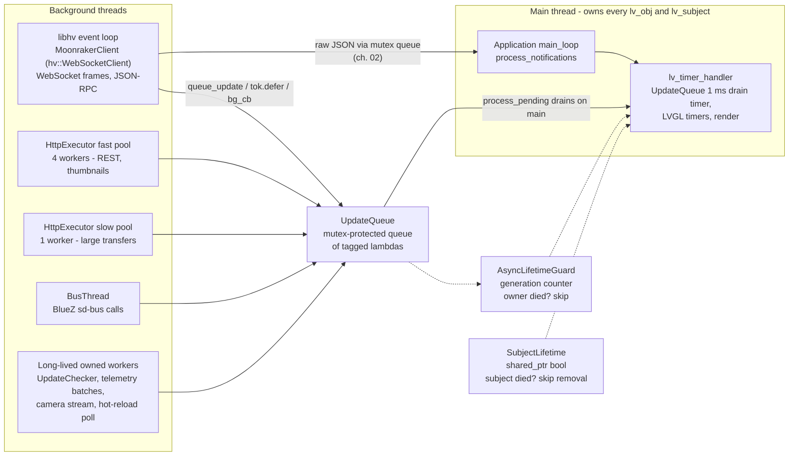

# 03 — Threading & Lifetime

Chapter 02 followed one temperature reading from WebSocket JSON to a repainted label; this chapter is about the boundary that reading crossed. HelixScreen runs one LVGL main thread that owns every widget, subject, and observer, plus a fixed set of background threads — the libhv WebSocket loop, two HTTP worker pools, a DBus thread, and a handful of long-lived workers. Background code never touches LVGL directly; it schedules main-thread work through a single queue. The other half of the title is the mirror problem: panels close and state objects die while their async work is still in flight, so two small guards — a generation counter for callbacks, a shared death flag for subjects — turn late work into silent no-ops instead of use-after-frees.

Every rule below is summarized, not invented: [`../THREADING.md`](../THREADING.md) is the single source of truth, and each section points at the chapter of it that holds the full argument. What this chapter adds is the map — which thread you are on, which guard you need, and which lint gate fires if you guess wrong.



## Key files

| File | Role |
|------|------|
| [`docs/devel/THREADING.md`](../THREADING.md) | Single source of truth: every rule here in full, plus enforcement layers, shutdown ordering, symptom index |
| [`include/ui_update_queue.h`](../../../include/ui_update_queue.h) | `UpdateQueue` and `queue_update()` — the only sanctioned thread crossing |
| [`include/async_lifetime_guard.h`](../../../include/async_lifetime_guard.h) | `AsyncLifetimeGuard`, `LifetimeToken`, `bg_cb()` — the callback-lifetime guard |
| [`include/ui_observer_guard.h`](../../../include/ui_observer_guard.h) | `ObserverGuard`, `SubjectLifetime` — observer cleanup and subject-death tracking |
| [`include/observer_factory.h`](../../../include/observer_factory.h) | `observe_int_sync<T>()` and friends; the factories whose 4th parameter carries the lifetime |
| [`include/ui_utils.h`](../../../include/ui_utils.h) | `safe_delete_deferred()`, `safe_clean_children()`, `safe_delete_subtree()` — deferred deletion |
| [`include/ui_timer_guard.h`](../../../include/ui_timer_guard.h) | `LvglTimerGuard` RAII and `lv_timer_cancel_safe()` |
| [`include/http_executor.h`](../../../include/http_executor.h) | `HttpExecutor::fast()` (4 workers) / `slow()` (1 worker) process-wide pools |
| [`src/bluetooth/bt_bus_thread.h`](../../../src/bluetooth/bt_bus_thread.h) | `BusThread` — single-threaded owner of the BlueZ sd-bus connection |
| [`src/printer/printer_state.cpp`](../../../src/printer/printer_state.cpp) | The `set_*()` → `set_*_internal()` marshalling exemplar |
| [`src/api/wifi_manager.cpp`](../../../src/api/wifi_manager.cpp) | Reference integration: parse on the background thread, marshal to main |
| [`scripts/check_l081_anti_pattern.py`](../../../scripts/check_l081_anti_pattern.py) | Gate: bare `tok.expired()` followed by `this` access on a background thread |
| [`scripts/check_timer_destructor_cancel.py`](../../../scripts/check_timer_destructor_cancel.py) | Gate: raw `lv_timer_t*` cancelled in `cleanup()` must also be cancelled in the destructor |

## How it works

Four mechanics, one per subsection: know which thread you are on, cross back through one queue, and carry a guard when your work might outlive its owner (`AsyncLifetimeGuard`) or its subject (`SubjectLifetime`).

Everything else — deletion rules, timers, shutdown ordering — follows from those four.

### The thread inventory

There is exactly one thread that may call `lv_*` anything: the main thread, which enters `Application::main_loop()` ([`src/application/application.cpp:4079`](../../../src/application/application.cpp#L4079)) and never leaves it until shutdown. Everything else is background:

- **The libhv event loop.** `MoonrakerClient` extends `hv::WebSocketClient` ([`include/moonraker_client.h:78`](../../../include/moonraker_client.h#L78)), and libhv runs the socket's event loop on its own thread. Every WebSocket frame, JSON-RPC reply, and connection-state callback arrives there. This is the thread that produces almost all printer data.
- **`HttpExecutor` pools.** Two process-wide executors ([`include/http_executor.h:87`](../../../include/http_executor.h#L87)): `fast()` with 4 workers for status/REST/thumbnail traffic that deserves burst parallelism, `slow()` with 1 worker so a multi-minute upload cannot head-of-line-block a quick request. `submit()` from any thread, `run_sync()` when a result is needed now (never from inside a worker on a single-worker lane — self-deadlock).
- **`BusThread`.** BlueZ DBus is not thread-safe either; [`src/bluetooth/bt_bus_thread.h`](../../../src/bluetooth/bt_bus_thread.h) is a single worker thread that exclusively owns the `sd_bus*` connection. All sd-bus calls go through `submit()`/`run_sync()`.
- **Long-lived owned workers.** `UpdateChecker` runs `worker_thread_` ([`src/system/update_checker.cpp:2581`](../../../src/system/update_checker.cpp#L2581), joined in the destructor at `:691`) and `download_thread_` (`:1341`); `TelemetryManager` spawns a per-batch `send_thread_` ([`src/system/telemetry_manager.cpp:936`](../../../src/system/telemetry_manager.cpp#L936), joined at `:463`); the camera stream and the XML hot-reload poller each own one. Fifty-two files under `src/` mention `std::thread` — every spawn is either joined in its owner's destructor, bounded-then-detached as described below, or wrapped in the try/catch form described next.
- **One worker is deliberately not joined: `UpdateChecker::download_thread_`.** It can be parked inside libhv's synchronous `requests::downloadFile()`, whose `req->timeout` is 3600 seconds and which exposes no abort hook — its progress callback returns `void`. Joining it on the LVGL thread froze the touchscreen, and joining it at teardown hung shutdown for the same hour. `reap_download_thread()` ([`src/system/update_checker.cpp:1351`](../../../src/system/update_checker.cpp#L1351)) waits a bounded time for the worker to finish — 1s from `shutdown()` (`:764`), 250ms from the destructor (`:697`) — then **detaches** and lets it die with the process, the same escape hatch `HttpExecutor::stop()` takes for the same reason. `shutting_down_` is set first, so the detached worker bails at its next check (`:1486`) without touching a subject, the mutex, or the UpdateQueue.

One correction to the old threading diagram: it listed `CrashReporter` as a utility-thread owner. It owns no thread — [`src/system/crash_reporter.cpp`](../../../src/system/crash_reporter.cpp) spawns nothing; its uploads ride existing paths (on Android, a JNI bridge to Java's `HttpURLConnection`, [`crash_reporter.cpp:917`](../../../src/system/crash_reporter.cpp#L917)).

The rule that keeps the inventory from growing recklessly: **no `std::thread(...).detach()` for one-shot work.** On the 32-bit targets (AD5M, CC1, MIPS32) `pthread_create` returns `EAGAIN` under thread exhaustion, the `std::thread` constructor throws, and propagation through an LVGL C frame aborts the process (#724, #837). Before adding any thread, grep for an existing pool covering the domain — [`THREADING.md`](../THREADING.md) §8 has the workload-to-executor table. Detached *spawns* remain legitimate in exactly one shape: wrapped in `try/catch (std::system_error)` with a toast and error callback, the pattern used for RFCOMM/USB/QR work that has no pool. Detaching an *already-running* thread as a teardown escape hatch is a different operation — no `pthread_create` is involved — and is what `reap_download_thread()` and `HttpExecutor::stop()` do above.

The heuristic for everything else: if you are in a callback from libhv, an `HttpExecutor`, `BusThread`, or any `std::thread`, you are on a background thread, and the rest of this chapter applies. The codebase itself makes the same distinction at runtime: `main()` records the main thread's id once (`internal::set_main_thread_id()`, [`include/async_lifetime_guard.h:63`](../../../include/async_lifetime_guard.h#L63)) and `internal::on_main_thread()` (`:68`) answers the question conservatively (it returns true during early init, before any thread exists to be wrong about) — that is the predicate behind the anti-pattern detector below.

### One bridge: the `UpdateQueue` contract

Chapter 02 covered the data-flow view — the notification queue that hands raw JSON to `process_notifications()` ([`application.cpp:4201`](../../../src/application/application.cpp#L4201)) before `lv_timer_handler()` (`:4136`) runs. The `UpdateQueue` is the general-purpose sibling: any thread enqueues a tagged lambda with `helix::ui::queue_update()`; a 1 ms LVGL timer created in `init()` ([`include/ui_update_queue.h:119`](../../../include/ui_update_queue.h#L119)) drains `process_pending()` (`:441`) on the main thread inside `lv_timer_handler()`.

The safety property is same-thread serialization: because the drain runs inside LVGL's timer walk, a queued `lv_subject_set_*()` can never interleave with an in-progress render — that is what prevents LVGL's "invalidate during rendering" assertion, which on embedded targets is an infinite loop rather than a crash. One correction absorbed from the old diagram: it called the drain "HIGHEST PRIORITY, runs first". LVGL 9 timers have no priority field; the real guarantees are the 1 ms period (work lands within a frame) and creation-order precedence over the later-created refresh timer. Trust the serialization, not per-tick ordering claims.

The queue earns trust in the details: tags register with the crash handler so a crash names the guilty callback; exceptions in one callback are swallowed and logged so a batch cannot be lost to a single bad lambda; widget-guarded overloads drop work whose widget died; `ScopedFreeze` (`:249`) buffers enqueues across a drain-and-destroy window and splices them back on thaw. Canonical producer pattern: `PrinterState`'s public setters marshal themselves —

```cpp
void PrinterState::set_printer_connection_state(int state, const char* message) {
    // Thread-safe wrapper: defer LVGL subject updates to main thread
    std::string msg = message ? message : "";
    async_lifetime_.defer("PrinterState::set_printer_connection_state", [this, state, msg]() {
        set_printer_connection_state_internal(state, msg.c_str());
    });
}
```

(verbatim from [`src/printer/printer_state.cpp:670`](../../../src/printer/printer_state.cpp#L670)). `set_klippy_state()` (`:659`) uses the `helix::async::call_method()` flavor — same queue, less ceremony. Chapter 02 dissects both.

### Guard one: `AsyncLifetimeGuard` — callbacks that outlive their owner

A modal fires an HTTP request; the user dismisses the modal; the reply arrives on an executor thread and the callback touches freed memory. `AsyncLifetimeGuard` ([`include/async_lifetime_guard.h:237`](../../../include/async_lifetime_guard.h#L237)) makes that a no-op. The guard owns a `shared_ptr<atomic<uint64_t>>` generation counter; `token()` (`:257`) snapshots it into a copyable `LifetimeToken`; `invalidate()` — called on dismissal and again by the destructor — bumps the counter, expiring every outstanding token. Tokens hold their own `shared_ptr` to the counter, never a pointer to the owner, so they stay safe to use while the owner is being destroyed.

Two sanctioned forms, from THREADING.md §2:

- **Short: `lifetime_.bg_cb(tag, fn)`** (`:329`) returns a callable to hand straight to HTTP/WebSocket APIs; the body always runs on the main thread after a generation re-check. About 90 call sites under `src/` use it; the whole shape is two lines ([`src/printer/detection_manager.cpp:26`](../../../src/printer/detection_manager.cpp#L26)):

  ```cpp
  client_->add_connected_observer("DetectionManager::refresh_capabilities",
                                  lifetime_.bg_cb("DetectionManager::on_connected",
                                                  [this]() { refresh_capabilities(); }));
  ```

- **Long: `tok.defer(tag, fn)`** (`:165`) when there is real background-side work — parse into locals on the executor thread, defer only the mutation.

What is banned is the form between them: a bare `if (tok.expired()) return;` on a background thread followed by touching `this`. The owner can die between check and access — the L081 TOCTOU race (#707). Defense is layered: the lint gate [`scripts/check_l081_anti_pattern.py`](../../../scripts/check_l081_anti_pattern.py) fails the commit; a runtime detector inside `LifetimeToken::expired()` (`:115`) reports the callsite once per thread; strict mode (`HELIX_STRICT_BG_THREAD_CHECK=1`, on by default in `HelixTestFixture`) aborts so tests fail. Release builds compile the abort out — a detector hit on a user device is telemetry, not a crash.

Details that matter in review: `lifetime_.defer()` reads `this->lifetime_`, so it is main-thread-only — from a background thread it is exactly the #707 race, use `tok.defer()`. All defer paths check the generation *before* enqueueing, so a callback whose owner already died never even occupies a queue slot. And every skip increments a per-tag counter drained by telemetry as `async_lifetime_skips` — a hot tag there is the early signal that an owner is repeatedly dying with pending work (#1165).

Who has a guard already: `Modal` ([`include/ui_modal.h:97`](../../../include/ui_modal.h#L97)) and `OverlayBase` ([`include/overlay_base.h:88`](../../../include/overlay_base.h#L88)) ship with `lifetime_` members and invalidate them in `hide()`/`cleanup()`. Standalone classes declare `helix::AsyncLifetimeGuard lifetime_;` — 101 files reference the type at audit time.

### Guard two: `SubjectLifetime` — observers that outlive their subject

The mirrored problem: dynamic subjects (per-fan, per-sensor, per-extruder) are destroyed and recreated when hardware is rediscovered, and an `ObserverGuard` still holding an observer pointer into the dead subject's list would call `lv_observer_remove()` on freed memory in its `reset()` (#705).

`SubjectLifetime` ([`include/ui_observer_guard.h:40`](../../../include/ui_observer_guard.h#L40)) is deliberately dumber than the generation counter: a `shared_ptr<bool>` whose *value*, not its refcount, signals death. Before destroying a subject, the owner writes `*lifetime = false` and only then deinits; `ObserverGuard::reset()` (`:123`) treats an expired pointer *or* a false value as "observer already freed, skip removal":

```cpp
bool subject_dead = false;
if (has_alive_token_) {
    auto locked = alive_token_.lock();
    subject_dead = !locked || !*locked;
}
```

(verbatim from [`include/ui_observer_guard.h:136`](../../../include/ui_observer_guard.h#L136)). The value check is what makes it work with multiple token holders — the refcount can stay above zero while every holder learns the subject died.

The trap is the API shape: the `observe_*` factories take the lifetime as a **defaulted 4th parameter**, so fetching a token from an accessor and forgetting to hand it over compiles silently — the guard never learns the subject died. The rule: if you fetch a `SubjectLifetime`, you pass it to the `observe_*` call. Chapter 02's "Observing subjects from C++" section walks the full `FanStackWidget` example, including the paired `(name, lifetime)` accessor overloads that assign the owner's own token into your copy.

`ObserverGuard` also carries a second safety: the invalidation epoch (`:110`). Observers created before a soft-restart teardown had their subjects freed by `StaticSubjectRegistry::deinit_all()`; each guard compares its creation epoch against the current one (`:150`) to decide whether removal is safe. The shutdown ordering that makes all of this hold — panels destroyed, then subjects deinitialized, then `lv_deinit()` — is `Application::shutdown()` territory and THREADING.md §7 owns it.

## Patterns & gotchas

The five invariants below are the whole chapter compressed. Each fails silently at compile time and crashes later, usually on a customer's printer; each row links the deep dive.

| # | Rule | Crash family | Gate | Deep dive |
|---|------|--------------|------|-----------|
| 1 | Never touch LVGL from a background thread — `lv_subject_set_*()` counts, it fires observers | Assertion loop mid-render, app hangs | review | §1 |
| 2 | Never bare `if (tok.expired()) return;` then touch `this` on a background thread — use `bg_cb` / `tok.defer` | TOCTOU use-after-free (#707) | [`check_l081_anti_pattern.py`](../../../scripts/check_l081_anti_pattern.py) + runtime detector | §2 |
| 3 | Never delete widgets synchronously inside a queued callback | SIGSEGV in `lv_event_mark_deleted` (#776, #190, #80) | review | §3 |
| 4 | A fetched `SubjectLifetime` must reach the `observe_*` factory | Use-after-free on reconnect (#705) | review | §5 |
| 5 | A raw `lv_timer_t*` cancelled in `cleanup()` must also be cancelled in the destructor | Armed timer on a freed `this` (#1173) | [`check_timer_destructor_cancel.py`](../../../scripts/check_timer_destructor_cancel.py) | §10 |

Supporting rules that trip contributors:

- **Sync deletion inside any queued callback is banned** — and "queued callback" includes `defer`, `bg_cb`, and the observer factories, since they all route through `UpdateQueue`. Replace the inner deletion: `safe_delete_deferred()` ([`include/ui_utils.h:200`](../../../include/ui_utils.h#L200)), `lv_obj_delete_async()`, `safe_clean_children()` (`:284`), `safe_delete_subtree()` (`:345`). The replacements ride LVGL's own async list, which genuinely runs outside our drain.
- **`lifetime_.defer` does not escape the batch.** It queues through `queue_update()` like everything else; the generation guard protects `this`, not the batch contents. Comments claiming otherwise are wrong — fix them.
- **Timers: prefer `LvglTimerGuard`** ([`include/ui_timer_guard.h:33`](../../../include/ui_timer_guard.h#L33)) for new code. For a raw `lv_timer_t*`, share one `cancel_*_timer()` helper between `cleanup()` and the destructor and cancel with `lv_timer_cancel_safe()` (`:18`) — it neuters the timer instead of unlinking it, safe from a destructor and from inside `lv_timer_handler` (#750, #751). The exemplar, [`src/ui/ui_screensaver.cpp:174`](../../../src/ui/ui_screensaver.cpp#L174), is four lines:

  ```cpp
  FlyingToasterScreensaver::~FlyingToasterScreensaver() {
      // ... rationale comment citing #750, #751, #1173 ...
      cancel_timer();
  }
  void FlyingToasterScreensaver::cancel_timer() {
      if (m_tick_timer) {
          helix::ui::lv_timer_cancel_safe(m_tick_timer);
          m_tick_timer = nullptr;
      }
  }
  ```

  (condensed from [`src/ui/ui_screensaver.cpp:174`](../../../src/ui/ui_screensaver.cpp#L174); the comment explains why the manager not stopping the active screensaver first makes dtor cancellation mandatory). The gate accepts a `// TIMER_DTOR_OK: <reason>` annotation for `LifetimeToken`-guarded timer callbacks.
- **`ObserverGuard::reset()`, never `release()`**, in normal cleanup — `release()` leaks the observer context and corrupts rendering; it exists only for pre-deinit registry callbacks (#579, seventeen reports).
- **Custom-widget state memory is RAII-wrapped, never raw `lv_malloc`/`lv_free`.** Build state with `lvgl_make_unique<T>()` ([`include/ui_widget_memory.h`](../../../include/ui_widget_memory.h)) and hand ownership to the widget via `release()` into `user_data`; the `LV_EVENT_DELETE` callback re-wraps the raw pointer in an `lvgl_unique_ptr<T>` on entry so an early return or exception cannot leak it. Nested buffers use `lvgl_make_unique_array<T>(n)` (`:127`). Reference shapes: [`src/ui/ui_jog_pad.cpp`](../../../src/ui/ui_jog_pad.cpp) (flat struct on `user_data`), [`src/ui/ui_step_progress.cpp`](../../../src/ui/ui_step_progress.cpp) (nested per-item arrays).
- **No new detached `std::thread` spawns.** Grep for an existing pool first (`HttpExecutor::fast()/slow()`, `BusThread`); a fresh detached spawn reintroduces the `EAGAIN` abort on the smallest device you ship to. The one sanctioned shape is the try/catch spawn with a toast, and only for domains with no pool.
- **Background-thread heuristics have teeth:** `HelixTestFixture` opts into strict mode, so a new L081 instance fails the test suite, not the field.
- **When something crashes, do not guess —** [`THREADING.md`](../THREADING.md) §12 is a symptom→cause→fix index for exactly these families ("SIGSEGV in `lv_event_mark_deleted`", "app hangs, stops answering pings", ...). Check it before debugging from scratch.

## Going deeper

- [`../THREADING.md`](../THREADING.md) — the single source of truth this chapter summarizes: the L081 TOCTOU mechanisms and their three enforcement layers, `ScopedFreeze` drain-and-destroy semantics, shutdown registry ordering, the dynamic-subject source table, Klippy-volatile membership rules, and the full symptom index.
- [`02-subjects-dataflow.md`](02-subjects-dataflow.md) — the same boundary from the data side: the notification queue, the marshalling setter pattern, and the observer-factory worked examples.
- [`../MOONRAKER_ARCHITECTURE.md`](../MOONRAKER_ARCHITECTURE.md) — § "HTTP Work Execution (HttpExecutor)": lane discipline and the submit/run_sync contract in full.
- [`../PLUGIN_DEVELOPMENT.md`](../PLUGIN_DEVELOPMENT.md) § "Threading Model" — the same rules restated for plugin authors, whose event callbacks arrive on background threads by default.
- [`../REVIEW_RUBRIC.md`](../REVIEW_RUBRIC.md) — which crash families the automated gates already cover, so review effort goes where the gates are blind.

## Guided code tour

Read in this order; about 25 minutes total.

1. [`include/ui_update_queue.h:94`](../../../include/ui_update_queue.h#L94) — the `UpdateQueue` class: timer creation in `init()` (`:119`), the tagged drain `process_pending()` (`:441`), `ScopedFreeze` (`:249`). The comments on "why not `lv_async_call`" are the design argument in three lines.
2. [`include/async_lifetime_guard.h:115`](../../../include/async_lifetime_guard.h#L115) — `LifetimeToken::expired()` with the background-thread detector inline; then `:165` `defer()` and its pre-enqueue generation check (the doomed-callback drop), and `:354` `bg_cb()` — read the doc comment for the short-form/long-form tradeoff.
3. [`src/printer/detection_manager.cpp:26`](../../../src/printer/detection_manager.cpp#L26) — the two-line `bg_cb` in the wild: an observer registered with a marshalled callback, nothing else to it.
4. [`src/printer/printer_state.cpp:670`](../../../src/printer/printer_state.cpp#L670) — `set_printer_connection_state()` (defer through the guard), then `:659` `set_klippy_state()` (`call_method` flavor). The whole marshalling-setter pattern in twenty lines.
5. [`include/ui_observer_guard.h:40`](../../../include/ui_observer_guard.h#L40) — the `SubjectLifetime` contract in the doc comment; then `reset()` (`:123`) with its two death checks: token value (`:137`) and invalidation epoch (`:150`).
6. [`src/api/wifi_manager.cpp:869`](../../../src/api/wifi_manager.cpp#L869) — `handle_scan_complete`: parse on the backend thread, `queue_update` the mutation. THREADING.md's other reference integration.
7. [`include/http_executor.h:33`](../../../include/http_executor.h#L33) — the class comment: why the pools exist (EAGAIN history), the stop-timeout-detach semantics, and the self-wait deadlock warning on `run_sync`.
8. [`src/bluetooth/bt_bus_thread.h:19`](../../../src/bluetooth/bt_bus_thread.h#L19) — `BusWork` and the single-thread sd-bus ownership contract, including the null-bus idle-worker defense.
9. [`include/ui_utils.h:96`](../../../include/ui_utils.h#L96) — the comment explaining why `safe_delete` (`:102`) is unsafe inside queued callbacks, then the deferred family at `:200`, `:284`, `:345`.
10. [`include/ui_timer_guard.h:18`](../../../include/ui_timer_guard.h#L18) — `lv_timer_cancel_safe()`: five lines that neuter instead of unlink; then `LvglTimerGuard` (`:33`).
11. [`src/ui/ui_screensaver.cpp:174`](../../../src/ui/ui_screensaver.cpp#L174) — a real shared-cancel helper called from both teardown paths, with the #750/#751/#1173 rationale written out in the comment.
12. [`scripts/check_l081_anti_pattern.py`](../../../scripts/check_l081_anti_pattern.py) and [`scripts/check_timer_destructor_cancel.py`](../../../scripts/check_timer_destructor_cancel.py) — read only the header comments: exactly what each gate flags and the approved shapes. Five minutes that will save a review round-trip.
