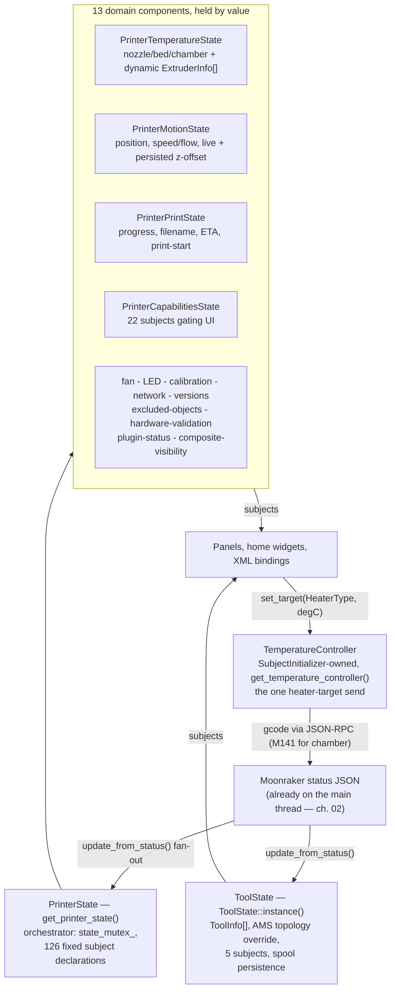

# 05 — Printer State & the Singleton Map

Every fact the UI shows about the printer lives in one object graph rooted at `PrinterState`, a Meyers singleton reached through `get_printer_state()`. It is not a god class: the header delegates to thirteen domain components (temperature, motion, print, capabilities, ...) held by value, each owning the LVGL subjects for exactly one concern. Around it orbit two satellites with different jobs and different access patterns — `ToolState` (a classic `::instance()` singleton for multi-tool tracking) and `TemperatureController` (owned by `SubjectInitializer`, and the only code allowed to send a heater target). This chapter covers the decomposition, the two satellites, and the regenerated map of every global in the tree: 76 `::instance()` singletons plus four other access shapes, and which of them register with the two shutdown registries.

Chapter 02 covered the subject machinery itself — init macros, observer factories, the `SubjectInitializer` phase ordering — so this chapter stays on the map: which class owns which data, and how you are allowed to reach it.

## Key files

| File | Role |
|------|------|
| [`include/printer_state.h`](../../../include/printer_state.h) | `PrinterState` orchestrator; the 13 domain members live at the bottom of the class |
| [`src/printer/printer_state.cpp`](../../../src/printer/printer_state.cpp) | `init_subjects()` / `deinit_subjects()` fan-out, `update_from_status()`, setter marshalling |
| [`include/tool_state.h`](../../../include/tool_state.h) | `ToolState` singleton: `ToolInfo`, AMS topology override, Spoolman spool assignments |
| [`include/temperature_controller.h`](../../../include/temperature_controller.h) | The single authority for heater target sends |
| [`include/app_globals.h`](../../../include/app_globals.h) | Access to every published global: printer state, API/client, controller, histories |
| [`src/application/subject_initializer.cpp`](../../../src/application/subject_initializer.cpp) | Boot-time init phases; owns `TemperatureController` and `TemperatureService` |
| [`include/static_subject_registry.h`](../../../include/static_subject_registry.h) | Subject-deinit ordering; mandates the self-registration pattern |
| [`include/static_panel_registry.h`](../../../include/static_panel_registry.h) | Panel/overlay destruction ordering |
| [`include/ui_panel_singleton_macros.h`](../../../include/ui_panel_singleton_macros.h) | `DEFINE_GLOBAL_PANEL` — the global-panel idiom behind every `get_global_*_panel()` |

## How it works

### One orchestrator, thirteen domains

`PrinterState` ([`include/printer_state.h:185`](../../../include/printer_state.h#L185)) keeps its historical public API but holds the implementation as thirteen domain components by value ([`include/printer_state.h:2252`](../../../include/printer_state.h#L2252)-2295): `temperature_state_`, `motion_state_`, `led_state_component_`, `fan_state_`, `print_domain_`, `capabilities_state_`, `plugin_status_state_`, `calibration_state_`, `hardware_validation_state_`, `composite_visibility_state_`, `network_state_`, `versions_state_`, `excluded_objects_state_`. Callers never touch a domain directly — `PrinterState` forwards. Each domain follows the same shape: `init_subjects(bool register_xml)`, `deinit_subjects()`, `update_from_status()`, change-gated setters.

| Domain | Owns (from its header) |
|--------|------------------------|
| `PrinterTemperatureState` | Nozzle/bed/chamber temps + targets (decidegrees), dynamic per-extruder `ExtruderInfo` map |
| `PrinterMotionState` | Position, speed/flow, homed axes, kinematic envelope, live + persisted z-offset |
| `PrinterPrintState` | Print progress, state, filename, layers, ETA, print-start phases (34 subjects — the largest) |
| `PrinterCapabilitiesState` | Hardware/firmware capability subjects gating UI feature visibility (22 subjects) |
| `PrinterFanState` | Fan speeds and wizard-configured fan role assignments |
| `PrinterCalibrationState` | PID / Z-offset calibration runs, bed mesh status, the Klippy-volatile subjects |
| `PrinterNetworkState` | Moonraker connectivity, Klippy state, hostname |
| `PrinterVersionsState` | Klipper, MCU, Moonraker software versions |
| `PrinterLedState` | LED channel/brightness/on-off subjects |
| `PrinterExcludedObjectsState` | Klipper `EXCLUDE_OBJECT` state |
| `PrinterHardwareValidationState` | Hardware health-check results (11 subjects) |
| `PrinterPluginStatusState` | HelixPrint plugin status gating |
| `PrinterCompositeVisibilityState` | The aggregate `has_any_preprint_options` visibility subject |

Across the fourteen headers (orchestrator + domains) there are 126 fixed `lv_subject_t` declarations at the v0.99.115 audit (the count moves almost every release — treat it as an order of magnitude, not a constant), plus heap-allocated dynamic subjects created at runtime (per-extruder `ExtruderInfo`, rediscovered fans and sensors). The old singleton map's "~50 subjects" was undercounted by half even before counting dynamics.

Lifecycle is a fan-out, not fourteen registrations. `PrinterState::init_subjects()` ([`src/printer/printer_state.cpp:196`](../../../src/printer/printer_state.cpp#L196)) calls each domain's `init_subjects(register_xml)` in a fixed order, then self-registers **one** cleanup entry (`"PrinterState"`) with `StaticSubjectRegistry`. `deinit_subjects()` ([`printer_state.cpp:133`](../../../src/printer/printer_state.cpp#L133)) runs the mirror: invalidate the `AsyncLifetimeGuard` (drops setter callbacks still queued on the UpdateQueue), unregister the per-printer cache invalidator from `PrinterCacheRegistry`, flip the `SubjectLifetime` death token **before** tearing anything down (so surviving `ObserverGuard`s skip removal on soon-to-be-freed observer lists), then deinit all thirteen domains plus the orchestrator's own three subjects (`active_printer_name_`, `multi_printer_enabled_`, `z_offset_can_save_`). Domains never register themselves — the old monolithic ARCHITECTURE.md's claim that "each domain registers with StaticSubjectRegistry" was stale; the single orchestrator entry covers them.

### Reading print state: typed accessors, not hand-cast ints

`PrinterPrintState` publishes the job's state on two axes that are **not** interchangeable: the raw wire state (`print_state_enum`, `PrintJobState` — what `print_stats.state` reported) and the derived lifecycle (`print_lifecycle`, `PrintState` — the wire state folded with the app-side preparing window; [`../PRINT_STATE_MACHINE.md`](../PRINT_STATE_MACHINE.md) has the whole machine). Reading either subject by hand is a trap: `lv_subject_get_int()` returns `int`, so the cast-to-enum compiles against whichever subject you happened to name. The two enums share numbering only at index 0 — `STANDBY=0 PRINTING=1 PAUSED=2 COMPLETE=3` versus `Idle=0 Preparing=1 Printing=2 Paused=3` — meaning a COMPLETE job read through the wrong enum answers Paused, and a PRINTING one answers Preparing. That exact mistake shipped twice during the v0.99.115 lifecycle migration (`ams_backend_ad5x_ifs`, `power_device_state`), silently both times until a test caught it.

The rule: pull values through the typed accessors — `get_print_job_state()` and `get_print_lifecycle()` ([`include/printer_print_state.h:676`](../../../include/printer_print_state.h#L676)-704) — and observe through the matching factory: `observe_print_state()` (deferred), `observe_print_state_immediate()` (fires in the same turn), and `observe_print_lifecycle()` for the derived subject ([`include/observer_factory.h:668`](../../../include/observer_factory.h#L668), `:691`, `:722`). Each factory hard-casts for you and takes the same defaulted fourth `SubjectLifetime` parameter as every other `observe_*` (ch. 02) — both subjects belong to `PrinterState`, so any observer that can outlive it must pass one.

### The satellites: ToolState and TemperatureController

`ToolState` ([`include/tool_state.h:78`](../../../include/tool_state.h#L78)) is a standalone `::instance()` singleton because tools span domains: a tool has a temperature (extruder mapping), a filament source (AMS backend slot), and a Spoolman identity. It owns five subjects — `active_tool`, `tool_count`, `tools_version` (UI rebuild trigger), `tool_badge_text`, `show_tool_badge` — the last two feeding the `nozzle_icon` component's tool badge. Two facts trip contributors:

- `tool_count() != extruder_count()`. When an AMS backend pushes a `ToolTopology` override (`set_ams_topology()`), `tools_` expands to one entry per filament **slot**, so a 4-slot AMS on a single-hotend printer reports 4 tools and 1 extruder. `is_multi_tool()` answers "show multi-tool controls?"; `has_multiple_extruders()` answers "does this printer physically have several hotends?" — the badge test, not the controls test.
- Spool assignments are persisted by identity, not weight (`assign_spool()` → the tool_spools JSON + Moonraker DB); the whole weight-churn saga is documented in [`07-filament-ams.md`](07-filament-ams.md) ("Spool assignment: identity is durable, weight is cache").

Like `PrinterState`, `ToolState` is fed `update_from_status()` on the main thread (ch. 02) and hands out a `SubjectLifetime` via `get_subjects_lifetime()` ([`include/tool_state.h:199`](../../../include/tool_state.h#L199)) that long-lived observers must pass to their `observe_*` call.

`TemperatureController` ([`include/temperature_controller.h:65`](../../../include/temperature_controller.h#L65)) is deliberately **not** a singleton. `SubjectInitializer` constructs it in `init_panel_subjects()` ([`src/application/subject_initializer.cpp:347`](../../../src/application/subject_initializer.cpp#L347)), holds the `unique_ptr`, and publishes the raw pointer as a shared resource on `PanelWidgetManager`; `get_temperature_controller()` ([`include/app_globals.h:79`](../../../include/app_globals.h#L79)) looks it up and returns `nullptr` before init. It resolves Klipper heater names (`Nozzle` → active extruder, `Bed` → `heater_bed`, `Chamber` → discovered name), applies `configfile` `max_temp` limits to the keypad range and preset visibility, owns the preset model, and provides the standard failure toast. It holds no widgets or subjects — toasts go through `NOTIFY_*`, which keeps it unit-testable. The rule is absolute: any UI that sets a temperature calls `set_target()` ([`temperature_controller.h:99`](../../../include/temperature_controller.h#L99)) — raw `MoonrakerAPI::set_temperature()` from view code fails the build via the lint gate in [`tests/shell/test_code_lint.bats`](../../../tests/shell/test_code_lint.bats). Chamber specifics (M141 routing, decidegree precision) are in [`../MULTI_EXTRUDER_TEMPERATURE.md`](../MULTI_EXTRUDER_TEMPERATURE.md) § "Chamber Heating (M141)"; error-ownership of a failed send is in [`../RPC_ERROR_OWNERSHIP.md`](../RPC_ERROR_OWNERSHIP.md).

### The singleton census: five access shapes, 76 `::instance()` classes

"HelixScreen has 40+ singletons" (the old map) is now half the story. The tree has **76 classes with a `static X& instance()` (or pointer) declaration** in `include/`, plus four other shapes worth knowing before you grep:

1. **Meyers `::instance()` singletons** — the 76 in the table below.
2. **`get_printer_state()`** ([`include/app_globals.h:149`](../../../include/app_globals.h#L149)) — same Meyers technique, free-function spelling; there is no `PrinterState::instance()`.
3. **Published pointers** — get/set pairs in [`app_globals.h`](../../../include/app_globals.h) for objects owned elsewhere and published as globals (nullable!): `MoonrakerManager` (Application-owned, `set_moonraker_manager()` in [`src/application/application.cpp:2080`](../../../src/application/application.cpp#L2080)), `IMoonrakerClient` / `IMoonrakerAPI` (owned by MoonrakerManager behind interfaces), `JobQueueState`, `PrintHistoryManager`, `TemperatureHistoryManager`.
4. **`Config::get_instance()`** ([`include/config.h:562`](../../../include/config.h#L562)) — static-member-pointer spelling of the same idea.
5. **Not singletons at all** — `PrinterDetector` is a static utility class (`PrinterDetector::auto_detect()` etc.; no `instance()` exists), and panels/overlays are global **instances** behind `get_global_*_panel()` accessors created by `DEFINE_GLOBAL_PANEL` ([`include/ui_panel_singleton_macros.h:74`](../../../include/ui_panel_singleton_macros.h#L74)) — each registering its destruction with `StaticPanelRegistry`.

| Singleton | Header | Role |
|-----------|--------|------|
| **Printer & job state** | | |
| `ToolState` | [`tool_state.h`](../../../include/tool_state.h) | Multi-tool tracking, AMS topology, spool assignments |
| `AmsState` | [`ams_state.h`](../../../include/ams_state.h) | Multi-backend filament-system state (ch. 07) |
| `TimelapseState` | [`timelapse_state.h`](../../../include/timelapse_state.h) | Timelapse recording + render progress |
| `PrintControlButtons` | [`print_control_buttons.h`](../../../include/print_control_buttons.h) | Shared pause/resume/stop subjects + callbacks |
| `PowerDeviceState` | [`power_device_state.h`](../../../include/power_device_state.h) | Moonraker power-device state |
| `PerformanceState` | [`performance_state.h`](../../../include/performance_state.h) | Per-metric ring buffers (~60 s history) |
| `SensorState` | [`sensor_state.h`](../../../include/sensor_state.h) | Discovered Moonraker sensor metadata |
| **Sensor managers** | | |
| `TemperatureSensorManager` | [`temperature_sensor_manager.h`](../../../include/temperature_sensor_manager.h) | `temperature_sensor` / `temperature_fan` objects |
| `HumiditySensorManager` | [`humidity_sensor_manager.h`](../../../include/humidity_sensor_manager.h) | BME280, HTU21D, SHT3X, AHT10/20/20-F |
| `WidthSensorManager` | [`width_sensor_manager.h`](../../../include/width_sensor_manager.h) | Filament width sensors (TSL1401CL, Hall) |
| `ProbeSensorManager` | [`probe_sensor_manager.h`](../../../include/probe_sensor_manager.h) | Native Klipper probe sensors |
| `AccelSensorManager` | [`accel_sensor_manager.h`](../../../include/accel_sensor_manager.h) | ADXL345, LIS2DW, LIS3DH, MPU9250, ICM20948 |
| `ColorSensorManager` | [`color_sensor_manager.h`](../../../include/color_sensor_manager.h) | TD-1 color sensors |
| `FilamentSensorManager` | [`filament_sensor_manager.h`](../../../include/filament_sensor_manager.h) | Filament sensor discovery + runout state; owns the bypass⇄runout arming policy (`on_bypass_active_changed`) |
| `DetectionManager` | [`detection_manager.h`](../../../include/detection_manager.h) | Detection-source registry + policy dispatch |
| **Filament & spools** | | |
| `SpoolmanManager` | [`spoolman_manager.h`](../../../include/spoolman_manager.h) | Spoolman polling, circuit breaker, identity cache |
| `FilamentConsumptionTracker` | [`filament_consumption_tracker.h`](../../../include/filament_consumption_tracker.h) | Per-spool filament consumption accounting |
| `PostOpCooldownManager` | [`post_op_cooldown_manager.h`](../../../include/post_op_cooldown_manager.h) | Cooldown after load/unload/swap operations |
| **Settings & config** | | |
| `SettingsManager` | [`settings_manager.h`](../../../include/settings_manager.h) | Persistent settings root |
| `SystemSettingsManager` | [`system_settings_manager.h`](../../../include/system_settings_manager.h) | System-level settings slice |
| `AudioSettingsManager` | [`audio_settings_manager.h`](../../../include/audio_settings_manager.h) | Completion alerts, sound settings |
| `DisplaySettingsManager` | [`display_settings_manager.h`](../../../include/display_settings_manager.h) | Time format, animations toggle |
| `InputSettingsManager` | [`input_settings_manager.h`](../../../include/input_settings_manager.h) | Input/scroll settings |
| `SafetySettingsManager` | [`safety_settings_manager.h`](../../../include/safety_settings_manager.h) | Safety settings |
| `MaterialSettingsManager` | [`material_settings_manager.h`](../../../include/material_settings_manager.h) | Preset materials |
| `LabelPrinterSettingsManager` | [`label_printer_settings.h`](../../../include/label_printer_settings.h) | Label printer settings |
| `Config` † | [`config.h`](../../../include/config.h) | JSON config, RFC 6901 pointers (`get_instance()`) |
| **Navigation & chrome** | | |
| `NavigationManager` | [`ui_nav_manager.h`](../../../include/ui_nav_manager.h) | Panel/overlay stack (ch. 08) |
| `ModalStack` | [`ui_modal.h`](../../../include/ui_modal.h) | Dialog stacking |
| `KeyboardManager` | [`ui_keyboard_manager.h`](../../../include/ui_keyboard_manager.h) | Global keyboard handling |
| `NotificationManager` | [`ui_notification_manager.h`](../../../include/ui_notification_manager.h) | Active notifications, badge state |
| `NotificationHistory` | [`ui_notification_history.h`](../../../include/ui_notification_history.h) | Notification history |
| `ToastManager` | [`ui_toast_manager.h`](../../../include/ui_toast_manager.h) | Toast lifecycle |
| `ScreensaverManager` | [`screensaver.h`](../../../include/screensaver.h) | Screensaver |
| `LockManager` | [`lock_manager.h`](../../../include/lock_manager.h) | PIN storage, lock state, auto-lock |
| `LockScreenOverlay` | [`ui_lock_screen.h`](../../../include/ui_lock_screen.h) | Full-screen PIN entry |
| `FirstRunTour` | [`first_run_tour.h`](../../../include/first_run_tour.h) | First-run tour overlay |
| `EmergencyStopOverlay` | [`ui_emergency_stop.h`](../../../include/ui_emergency_stop.h) | E-Stop overlay |
| `PrinterStatusIcon` | [`ui_printer_status_icon.h`](../../../include/ui_printer_status_icon.h) | Status icon state for XML |
| **Dev overlays** | | |
| `UiOverlayPerformance` | [`ui_overlay_performance.h`](../../../include/ui_overlay_performance.h) | CPU/memory + per-MCU load overlay |
| `MemoryStatsOverlay` | [`ui_panel_memory_stats.h`](../../../include/ui_panel_memory_stats.h) | Memory stats overlay |
| **Display & rendering** | | |
| `DisplayManager` ‡ | [`display_manager.h`](../../../include/display_manager.h) | LVGL display init + lifecycle |
| `ThemeManager` | [`theme_manager.h`](../../../include/theme_manager.h) | Design tokens, breakpoints, themes |
| `LayoutManager` | [`layout_manager.h`](../../../include/layout_manager.h) | Breakpoint detection (sm/md/lg) |
| `PrinterImageManager` | [`printer_image_manager.h`](../../../include/printer_image_manager.h) | Printer model image cache |
| `ThumbnailProcessor` | [`thumbnail_processor.h`](../../../include/thumbnail_processor.h) | Background thumbnail pre-scaling |
| `CjkFontManager` | [`cjk_font_manager.h`](../../../include/cjk_font_manager.h) | CJK font loading |
| `PageScrollAutoInject` | [`page_scroll_auto_inject.h`](../../../include/page_scroll_auto_inject.h) | Page-scroll chevron auto-attach |
| **Background work & caches** | | |
| `UpdateQueue` | [`ui_update_queue.h`](../../../include/ui_update_queue.h) | Any-thread → main-thread bridge (ch. 02) |
| `MemoryMonitor` | [`memory_monitor.h`](../../../include/memory_monitor.h) | Memory sampling + pressure thresholds |
| `StreamingPolicy` | [`streaming_policy.h`](../../../include/streaming_policy.h) | When to use streaming operations |
| `MacroParamCache` | [`macro_param_cache.h`](../../../include/macro_param_cache.h) | Macro parameter knowledge cache |
| `StandardMacros` | [`standard_macros.h`](../../../include/standard_macros.h) | Semantic-op → printer macro mapping |
| `ThermalRateManager` | [`thermal_rate_model.h`](../../../include/thermal_rate_model.h) | EMA thermal heating-rate model |
| `SubjectDebugRegistry` | [`subject_debug_registry.h`](../../../include/subject_debug_registry.h) | Subject registry for debugging |
| `PrinterCacheRegistry` | [`printer_cache_registry.h`](../../../include/printer_cache_registry.h) | Per-printer cache invalidation on switch |
| **Network & remote** | | |
| `RemoteControlServer` | [`remote_control_server.h`](../../../include/remote_control_server.h) | `helix-screen ctl` Unix-socket JSON-RPC server |
| `RemotePointer` | [`remote_pointer.h`](../../../include/remote_pointer.h) | `ctl`-driven pointer input device |
| `BluetoothLoader` | [`bluetooth_loader.h`](../../../include/bluetooth_loader.h) | Bluetooth subsystem loader |
| **System, update & crash** | | |
| `UpdateChecker` | [`system/update_checker.h`](../../../include/system/update_checker.h) | Async release checks |
| `CrashReporter` | [`system/crash_reporter.h`](../../../include/system/crash_reporter.h) | Crash detection + delivery |
| `CrashHistory` | [`system/crash_history.h`](../../../include/system/crash_history.h) | Persistent crash-submission history |
| `CrashErrorLogSink` | [`system/crash_error_log_sink.h`](../../../include/system/crash_error_log_sink.h) | spdlog sink capturing errors into crashes |
| `TelemetryManager` | [`system/telemetry_manager.h`](../../../include/system/telemetry_manager.h) | Opt-in anonymous telemetry |
| `PendingStartupWarnings` | [`pending_startup_warnings.h`](../../../include/pending_startup_warnings.h) | Warnings queued pre-UI, shown later |
| `UpgradeBanner` | [`upgrade_banner.h`](../../../include/upgrade_banner.h) | Dismissible 1.0 upgrade banner |
| `UpgradeNudge` | [`upgrade_nudge.h`](../../../include/upgrade_nudge.h) | Upgrade nudge coordination |
| `TipsManager` | [`tips_manager.h`](../../../include/tips_manager.h) | Printing tips |
| **Plugins** | | |
| `PluginRegistry` | [`plugin_registry.h`](../../../include/plugin_registry.h) | Service locator for plugin-to-plugin calls |
| `EventDispatcher` | [`plugin_events.h`](../../../include/plugin_events.h) | Plugin event system |
| `InjectionPointManager` | [`injection_point_manager.h`](../../../include/injection_point_manager.h) | Plugin UI injection points |
| **LED** | | |
| `LedController` | [`led/led_controller.h`](../../../include/led/led_controller.h) | LED hardware interface (5 backends) |
| `LedAutoState` | [`led/led_auto_state.h`](../../../include/led/led_auto_state.h) | Auto-state lighting rules |
| **Widget & lifecycle infrastructure** | | |
| `PanelWidgetManager` | [`panel_widget_manager.h`](../../../include/panel_widget_manager.h) | Home-widget registry + shared resources |
| `StaticSubjectRegistry` | [`static_subject_registry.h`](../../../include/static_subject_registry.h) | Subject deinit ordering |
| `StaticPanelRegistry` | [`static_panel_registry.h`](../../../include/static_panel_registry.h) | Panel destruction ordering |

† different spelling, same idea. ‡ `DisplayManager::instance()` returns a **pointer** (null before `Application` creates the display), unlike the reference-returning rest.

The eight singletons the old map missed entirely: `PostOpCooldownManager`, `RemoteControlServer`, `AudioSettingsManager`, `PrinterCacheRegistry`, `FilamentConsumptionTracker`, `CrashHistory`, `UpgradeBanner` — all verified `::instance()` — and `MoonrakerManager`, which is **not** `::instance()` at all (Application-owned, published pointer). The old map also listed `PrinterDetector` under capabilities; it is a static class, no instance exists.

### Registries: who cleans up what, and when

Two singletons exist to kill the others cleanly. `StaticSubjectRegistry` ([`include/static_subject_registry.h:50`](../../../include/static_subject_registry.h#L50)) holds `deinit` callbacks; `StaticPanelRegistry` ([`include/static_panel_registry.h:34`](../../../include/static_panel_registry.h#L34)) holds `destroy` callbacks. `Application::shutdown()` runs them in a fixed order — `StaticPanelRegistry::destroy_all()`, then `StaticSubjectRegistry::deinit_all()`, then `lv_deinit()` — so panels (and their observers) die before the subjects those observers point at.

Which registry a global joins is decided by what it owns, and the registration is always self-serve:

- **Subject-owning singletons** (`PrinterState`, `AmsState`, `ToolState`, `SettingsManager`, `TimelapseState`, `LedController`, `PrintControlButtons`, the sensor managers, ...) self-register `deinit_subjects()` in the last lines of their own `init_subjects()`. The registry header makes this mandatory: registration lives next to initialization so the pair cannot drift, and external registration (e.g. from `SubjectInitializer`) is called out as the fragile pattern that causes shutdown crashes.
- **Global panels and overlays** register a destroy callback (which resets their `unique_ptr`) at creation, inside the `get_global_*_panel()` accessor — that is exactly what `DEFINE_GLOBAL_PANEL` expands to. Reverse creation order destroys them while spdlog and LVGL are still alive; `clear()` wipes stale entries during soft restart (printer switch).
- **Everything else** — singletons with no LVGL subjects (`TemperatureController`, `CrashHistory`, `RemoteControlServer`, ...) — registers with neither and relies on plain destruction ordering.

Registration order is load-bearing: `SubjectInitializer` initializes `NavigationManager` **after** `PrinterState` precisely so reverse-order deinit clears NavigationManager's observers on PrinterState subjects before those subjects die (the comment at [`src/application/subject_initializer.cpp:250`](../../../src/application/subject_initializer.cpp#L250)-252).

## Patterns & gotchas

- **Check the access shape before adding a `::instance()` call.** Five shapes exist (census above). In particular `get_moonraker_api()` and friends return `nullptr` early in boot — panels must tolerate that (the `DEFINE_GLOBAL_PANEL_WITH_STATE` doc notes panels fetch the API lazily, never cache it in a constructor).
- **`DisplayManager::instance()` is the odd pointer.** Reference-returning habit will write `DisplayManager::instance().foo()` and not compile — or worse, dereference without a null check before display creation.
- **Never send a heater target except through `TemperatureController::set_target()`.** Lint-enforced ([`tests/shell/test_code_lint.bats`](../../../tests/shell/test_code_lint.bats)); the controller's own `->set_temperature()` is the sole sanctioned RPC.
- **Do not add `StaticSubjectRegistry` registration inside a domain class.** `PrinterState` registers once and its `deinit_subjects()` fans out to all thirteen. A second registration would deinit a domain twice.
- **`deinit_subjects()` expires the lifetime token first**, then unregisters the cache invalidator, then tears down — keep that order if you ever touch it; surviving observers depend on the token flipping before the observer lists free (ch. 03).
- **New global panel? Use the macros.** `DEFINE_GLOBAL_PANEL` / `DEFINE_GLOBAL_PANEL_WITH_STATE` ([`include/ui_panel_singleton_macros.h`](../../../include/ui_panel_singleton_macros.h)) get the `StaticPanelRegistry` wiring right by construction; hand-rolled globals are how shutdown crashes happen.
- **`Preparing` is not a sub-state of Moonraker's PRINTING.** `PrinterPrintState` owns the window between the user committing to a job and the printer reporting it (`begin_preparing()` / `retire_preparing()`), because a host-side pre-start block runs *before* the printer is handed the job and `print_stats` describes the PREVIOUS job for its whole duration. Two guards deliberately yield to a live preparing job: the phase-update stale guard and the `print_active -> 0` safety reset. Do not re-tighten either to "only while printing" — see [`../PRINT_STATE_MACHINE.md`](../PRINT_STATE_MACHINE.md) § "The preparing job".
- **`begin_preparing()` is synchronous, unlike its neighbours.** `set_print_start_state()` defers because WebSocket callbacks call it; a button press is already on the main thread, and the previous job's outcome must be cleared before any observer can paint a `Preparing` state next to the finished job's numbers.
- **A new session-scoped member on `PrinterPrintState` must also be cleared in `PrinterPrintStateTestAccess::reset_extra()`** ([`tests/test_helpers/printer_state_test_access.h`](../../../tests/test_helpers/printer_state_test_access.h)). Members that survive `reset_for_new_print()` by design — `printer_reports_layers_`, `preparing_job_` — leak across tests sharing the singleton, and the failure surfaces in whatever unrelated test runs next in that shard, not in yours. Adding `preparing_job_` without this turned three *AMS* shards red while every AMS test passed in isolation.
- **Counting rule for the census:** `rg 'static\s+\w+(&|\*)\s+instance\s*\(' include/ --glob '*.h'` → 76 at audit time. If you add singleton number 77, this chapter's count is stale — update it.

## Going deeper

- [`02-subjects-dataflow.md`](02-subjects-dataflow.md) — the other half of this chapter: subject init macros, observer factories, the `SubjectInitializer` phases, UpdateQueue internals.
- [`03-threading-lifetime.md`](03-threading-lifetime.md) — the `SubjectLifetime` / `AsyncLifetimeGuard` contracts that `deinit_subjects()` and ToolState's spool callbacks rely on.
- [`04-moonraker.md`](04-moonraker.md) — where the status JSON feeding `update_from_status()` comes from, and who owns the client/API pair.
- [`../MULTI_EXTRUDER_TEMPERATURE.md`](../MULTI_EXTRUDER_TEMPERATURE.md) § "Chamber Heating (M141)" — chamber routing and decidegree precision; [`../RPC_ERROR_OWNERSHIP.md`](../RPC_ERROR_OWNERSHIP.md) — who reports a failed heater send. ToolInfo and the tool lifecycle: the ToolState section above.
- [`../TOOL_ABSTRACTION.md`](../TOOL_ABSTRACTION.md) — the ToolState deep dive: tool-to-backend mapping, DetectState semantics.
- [`../MULTI_EXTRUDER_TEMPERATURE.md`](../MULTI_EXTRUDER_TEMPERATURE.md) — `ExtruderInfo` and dynamic extruder subjects.
- [`../PRINT_STATE_MACHINE.md`](../PRINT_STATE_MACHINE.md) — the print lifecycle state machine behind `PrinterPrintState`.

## Guided code tour

Read in this order; about 25 minutes total.

1. [`include/printer_state.h:185`](../../../include/printer_state.h#L185) — the `PrinterState` class doc, then jump to `:2252` and read the thirteen domain members: plain by-value composition, no pointers, no inheritance.
2. [`src/printer/printer_state.cpp:196`](../../../src/printer/printer_state.cpp#L196) — `init_subjects()`: the ordered domain fan-out, and the single `StaticSubjectRegistry::register_deinit("PrinterState", ...)` at the end. Then `:133` `deinit_subjects()` for the mirror image — guard invalidation, cache unregistration, token expiry, reverse fan-out.
3. [`include/printer_temperature_state.h:64`](../../../include/printer_temperature_state.h#L64) — a representative domain: 8 fixed subjects, the dynamic `ExtruderInfo` map (`:38`), and `update_from_status()` (`:88`).
4. [`include/printer_motion_state.h:38`](../../../include/printer_motion_state.h#L38) — a second domain: kinematic envelope, speed/flow, live + persisted z-offset subjects.
5. [`include/tool_state.h:78`](../../../include/tool_state.h#L78) — ToolState: the five subjects, `ToolTopology` override (`:67`), `extruder_count()` vs `tool_count()` (`:124`), and `get_subjects_lifetime()` (`:199`) with its death-signal contract.
6. [`include/temperature_controller.h:65`](../../../include/temperature_controller.h#L65) — the controller: `resolved_name()`, `keypad_range()`, `SendOptions` (`:43`), and `set_target()` (`:99`) — the one send.
7. [`include/app_globals.h:76`](../../../include/app_globals.h#L76) — the published-global family: `get_temperature_controller()`, the get/set pairs, and `get_printer_state()` at `:149`.
8. [`src/application/subject_initializer.cpp:473`](../../../src/application/subject_initializer.cpp#L473) — where the controller is constructed and registered as a `PanelWidgetManager` shared resource; scroll up to `:308` for the PrinterState init phase and its ordering comments.
9. [`include/static_subject_registry.h:50`](../../../include/static_subject_registry.h#L50) — the registry, and the header comment that makes self-registration mandatory.
10. [`include/static_panel_registry.h:34`](../../../include/static_panel_registry.h#L34) — the panel registry: reverse-order destroy, `is_destroying_all()`, `clear()` for soft restart.
11. [`include/ui_panel_singleton_macros.h:74`](../../../include/ui_panel_singleton_macros.h#L74) — `DEFINE_GLOBAL_PANEL` and the `WITH_STATE` variant: the entire panel-singleton idiom in two macros.
