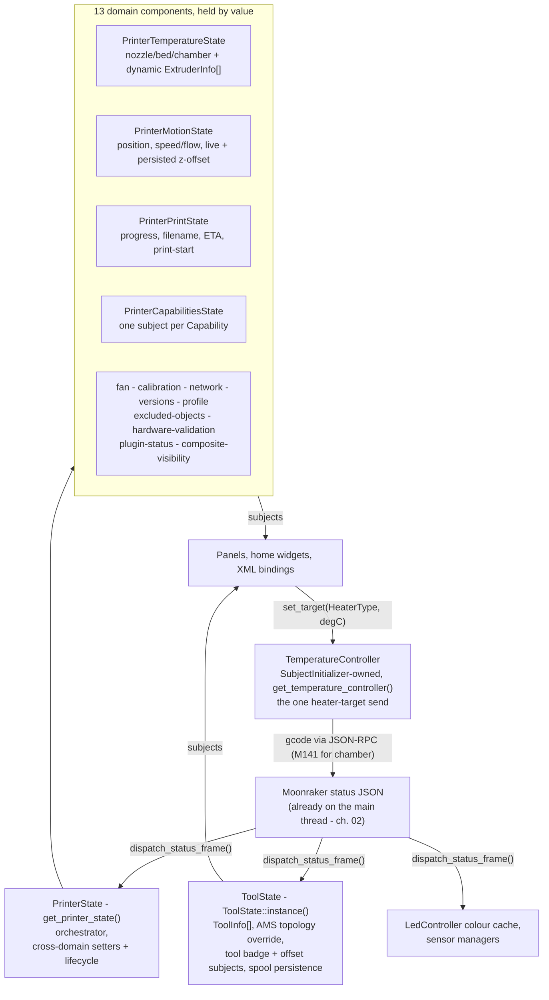

# 05 - Printer State & the Singleton Map

Every fact the UI shows about the printer lives in one object graph rooted at `PrinterState`, a Meyers singleton reached through `get_printer_state()`. It is not a god class: it holds thirteen domain components (temperature, motion, print, capabilities, ...) by value, each owning the LVGL subjects for exactly one concern, and callers reach a domain through its accessor (`temperature_state()`, `print_state()`, ...). Around it orbit two satellites with different jobs and different access patterns - `ToolState` (a classic `::instance()` singleton for multi-tool tracking) and `TemperatureController` (owned by `SubjectInitializer`, and the only code allowed to send a heater target). This chapter covers the decomposition, the two satellites, and the map of every global in the tree: 74 `::instance()` singletons plus four other access shapes, and which of them register with the two shutdown registries.

Chapter 02 covered the subject machinery itself - init macros, observer factories, the `SubjectInitializer` phase ordering - so this chapter stays on the map: which class owns which data, and how you are allowed to reach it.

```mermaid
flowchart TB
    MR["Moonraker status JSON<br/>(already on the main thread - ch. 02)"]
    UI["Panels, home widgets, XML bindings"]

    PS["PrinterState - get_printer_state()<br/>orchestrator,<br/>cross-domain setters + lifecycle"]

    subgraph DOM["13 domain components, held by value"]
        D1["PrinterTemperatureState<br/>nozzle/bed/chamber + dynamic ExtruderInfo[]"]
        D2["PrinterMotionState<br/>position, speed/flow, live + persisted z-offset"]
        D3["PrinterPrintState<br/>progress, filename, ETA, print-start"]
        D4["PrinterCapabilitiesState<br/>one subject per Capability"]
        D5["fan - calibration - network - versions - profile<br/>excluded-objects - hardware-validation<br/>plugin-status - composite-visibility"]
    end

    TS["ToolState - ToolState::instance()<br/>ToolInfo[], AMS topology override,<br/>tool badge + offset subjects, spool persistence"]
    TC["TemperatureController<br/>SubjectInitializer-owned, get_temperature_controller()<br/>the one heater-target send"]

    MR -->|"dispatch_status_frame()"| PS
    PS --> DOM
    MR -->|"dispatch_status_frame()"| TS
    MR -->|"dispatch_status_frame()"| OTH["LedController colour cache,<br/>sensor managers"]
    DOM -->|"subjects"| UI
    TS -->|"subjects"| UI
    UI -->|"set_target(HeaterType, degC)"| TC
    TC -->|"gcode via JSON-RPC (M141 for chamber)"| MR
```

## Key files

| File | Role |
|------|------|
| [`include/printer_state.h`](../../../include/printer_state.h) | `PrinterState` orchestrator; the 13 domain members live at the bottom of the class |
| [`src/printer/printer_state.cpp`](../../../src/printer/printer_state.cpp) | `init_subjects()` / `deinit_subjects()` fan-out, `update_from_status()` for its own domains, `set_hardware()`, setter marshalling |
| [`src/printer/status_dispatch.cpp`](../../../src/printer/status_dispatch.cpp) | `dispatch_status_frame()`: hands one status frame to `PrinterState`, `ToolState`, the LED controller and the sensor managers |
| [`include/tool_state.h`](../../../include/tool_state.h) | `ToolState` singleton: `ToolInfo`, AMS topology override, Spoolman spool assignments |
| [`include/temperature_controller.h`](../../../include/temperature_controller.h) | The single authority for heater target sends |
| [`include/app_globals.h`](../../../include/app_globals.h) | Access to every published global: printer state, API/client, controller, histories |
| [`src/application/subject_initializer.cpp`](../../../src/application/subject_initializer.cpp) | Boot-time init phases; owns `TemperatureController` and `TemperatureService` |
| [`include/static_subject_registry.h`](../../../include/static_subject_registry.h) | Subject-deinit ordering; mandates the self-registration pattern |
| [`include/static_panel_registry.h`](../../../include/static_panel_registry.h) | Panel/overlay destruction ordering, and `helix::lazy_global<T>()`: the global-panel idiom behind every `get_global_*_panel()` |

## How it works

### One orchestrator, thirteen domains

`PrinterState` (`include/printer_state.h#PrinterState`) holds thirteen domain components by value: `temperature_state_`, `motion_state_`, `fan_state_`, `print_domain_`, `capabilities_state_`, `plugin_status_state_`, `calibration_state_`, `hardware_validation_state_`, `composite_visibility_state_`, `network_state_`, `versions_state_`, `excluded_objects_state_`, `profile_state_`. Each has one accessor named after it (`temperature_state()`, `print_state()` for `print_domain_`, ...), const and non-const, and callers reach the domain's subjects and queries through it. What stays on `PrinterState` is what spans domains or threads: the setters the WebSocket thread calls (they defer through `async_lifetime_`), `update_from_status()`, `set_hardware()`, the blocking-operation predicates, `set_printer_type_sync()` and its cross-domain follow-ups, and init/deinit. Cross-domain work that does not need the orchestrator's state lives in free functions that take the domains as arguments: `chamber::apply_resolution()` ([`include/chamber_heater_assignment.h#"void apply_resolution("`](../../../include/chamber_heater_assignment.h)), called from `set_hardware()`, resolves the chamber sensor and heater and writes the temperature domain, the capability flags and the `TemperatureController`. Each domain follows the same shape: `init_subjects(bool register_xml)`, `deinit_subjects()`, `update_from_status()`, change-gated setters.

| Domain | Owns (from its header) |
|--------|------------------------|
| `PrinterTemperatureState` | Nozzle/bed/chamber temps + targets (decidegrees), chamber-heater diagnostics, dynamic per-extruder `ExtruderInfo` map |
| `PrinterMotionState` | Position, speed/flow, homed axes, kinematic envelope, live + persisted z-offset |
| `PrinterPrintState` | Print progress, state, filename, layers, ETA, print-start phases (the largest domain) |
| `PrinterCapabilitiesState` | One subject per `Capability` enum value, gating UI feature visibility (ch. 06) |
| `PrinterFanState` | Fan speeds and wizard-configured fan role assignments |
| `PrinterCalibrationState` | PID / Z-offset calibration runs, bed mesh status, the Klippy-volatile subjects |
| `PrinterNetworkState` | Moonraker connectivity, Klippy state, hostname |
| `PrinterVersionsState` | Klipper, MCU, Moonraker software versions |
| `PrinterExcludedObjectsState` | Klipper `EXCLUDE_OBJECT` state |
| `PrinterHardwareValidationState` | Hardware health-check results |
| `PrinterPluginStatusState` | HelixPrint plugin status gating |
| `PrinterCompositeVisibilityState` | The aggregate `has_any_preprint_options` visibility subject |
| `PrinterProfileState` | Printer type, its pre-print option set and z-offset calibration strategy (`printer_type`, `z_offset_can_save`) |

Across the fourteen headers (orchestrator + domains) there are well over a hundred fixed subjects, a count that moves almost every release, plus heap-allocated dynamic subjects created at runtime (per-extruder `ExtruderInfo`, rediscovered fans and sensors).

Status frames do not go to `PrinterState` alone. `dispatch_status_frame()` ([`src/printer/status_dispatch.cpp#dispatch_status_frame`](../../../src/printer/status_dispatch.cpp)), called on the main thread from `MoonrakerManager`, hands each frame to `PrinterState::update_from_status()`, then `ToolState`, the LED controller's strip-colour cache and every sensor manager through `for_each_sensor_manager()`; `dispatch_status()` is the same hand-off for a one-off `printer.objects.query` result. `PrinterState::update_from_status()` updates only its own domains, so a new consumer of status joins the dispatch rather than growing a call inside `PrinterState`.

Lifecycle is a fan-out, not thirteen registrations. `PrinterState::init_subjects()` ([`src/printer/printer_state.cpp#init_subjects`](../../../src/printer/printer_state.cpp)) calls each domain's `init_subjects(register_xml)` in a fixed order, then self-registers **one** cleanup entry (`"PrinterState"`) with `StaticSubjectRegistry`. `deinit_subjects()` ([`src/printer/printer_state.cpp#deinit_subjects`](../../../src/printer/printer_state.cpp)) runs the mirror: drop its own `StaticSubjectRegistry` entry, invalidate the `AsyncLifetimeGuard` (drops setter callbacks still queued on the UpdateQueue), unregister the per-printer cache invalidator from `PrinterCacheRegistry`, flip the `SubjectLifetime` death token **before** tearing anything down (so surviving `ObserverGuard`s skip removal on soon-to-be-freed observer lists), then deinit all thirteen domains plus the orchestrator's own subject (`active_printer_name_`). Domains never register themselves; the single orchestrator entry covers them. The destructor also drops the registry entry, so a per-test `PrinterState` cannot leave a dangling deinit callback behind.

### Reading print state: typed accessors, not hand-cast ints

`PrinterPrintState` publishes the job's state on two axes that are **not** interchangeable: the raw wire state (`print_state_enum`, `PrintJobState` - what `print_stats.state` reported) and the derived lifecycle (`print_lifecycle`, `PrintState` - the wire state folded with the app-side preparing window; [`../PRINT_STATE_MACHINE.md`](../PRINT_STATE_MACHINE.md) has the whole machine). Reading either subject by hand is a trap: `lv_subject_get_int()` returns `int`, so the cast-to-enum compiles against whichever subject you happened to name. The two enums share numbering only at index 0 - `STANDBY=0 PRINTING=1 PAUSED=2 COMPLETE=3` versus `Idle=0 Preparing=1 Printing=2 Paused=3` - meaning a COMPLETE job read through the wrong enum answers Paused, and a PRINTING one answers Preparing, with nothing to flag it.

The rule: pull values through the typed accessors - `get_print_job_state()` and `get_print_lifecycle()` ([`include/printer_print_state.h#get_print_job_state`](../../../include/printer_print_state.h), `include/printer_print_state.h#get_print_lifecycle`) - and observe through the matching factory: `observe_print_state()` (deferred), `observe_print_state(..., Dispatch::Immediate)` (fires in the same turn), and `observe_print_lifecycle()` for the derived subject ([`include/observer_factory.h#observe_print_state`](../../../include/observer_factory.h), `include/observer_factory.h#observe_print_lifecycle`). Each factory hard-casts for you and takes the same required fourth `SubjectLifetime` parameter as `observe<V>` (ch. 02) - both subjects belong to `PrinterState`, so any observer that can outlive it must pass one.

### The satellites: ToolState and TemperatureController

`ToolState` ([`include/tool_state.h#ToolState`](../../../include/tool_state.h)) is a standalone `::instance()` singleton because tools span domains: a tool has a temperature (extruder mapping), a filament source (AMS backend slot), and a Spoolman identity. Its subjects are `active_tool`, `tool_count`, `tools_version` (UI rebuild trigger), `tool_badge_text` and `show_tool_badge` (the `nozzle_icon` component's tool badge), plus the per-tool offset family (`per_tool_{x,y,z}_supported`, `any_tool_offset_dirty`). Two facts trip contributors:

- `tool_count() != extruder_count()`. When an AMS backend pushes a `ToolTopology` override (`set_ams_topology()`), `tools_` expands to one entry per filament **slot**, so a 4-slot AMS on a single-hotend printer reports 4 tools and 1 extruder. `is_multi_tool()` answers "show multi-tool controls?"; `has_multiple_extruders()` answers "does this printer physically have several hotends?" - the badge test, not the controls test.
- Spool assignments are persisted by identity, not weight (`assign_spool()` → the tool_spools JSON + Moonraker DB); why weights are a cache is in [`07-filament-ams.md`](07-filament-ams.md) ("Spool assignment: identity is durable, weight is cache").

Like `PrinterState`, `ToolState` is fed `update_from_status()` on the main thread (ch. 02) and hands out a `SubjectLifetime` via `get_subjects_lifetime()` ([`include/tool_state.h#get_subjects_lifetime`](../../../include/tool_state.h)) that long-lived observers must pass to their `observe_*` call.

`TemperatureController` ([`include/temperature_controller.h#TemperatureController`](../../../include/temperature_controller.h)) is deliberately **not** a singleton. `SubjectInitializer` constructs it in `init_panel_subjects()` ([`src/application/subject_initializer.cpp#init_panel_subjects`](../../../src/application/subject_initializer.cpp)), holds the `unique_ptr`, and publishes the raw pointer as a shared resource on `PanelWidgetManager`; `get_temperature_controller()` ([`include/app_globals.h#get_temperature_controller`](../../../include/app_globals.h)) looks it up and returns `nullptr` before init. It resolves Klipper heater names (`Nozzle` → active extruder, `Bed` → `heater_bed`, `Chamber` → discovered name), applies `configfile` `max_temp` limits to the keypad range and preset visibility, owns the preset model, and provides the standard failure toast. It holds no widgets or subjects - toasts go through `NOTIFY_*`, which keeps it unit-testable. The rule is absolute: any UI that sets a temperature calls `set_target()` (`include/temperature_controller.h#"void set_target(HeaterType type,"`) - raw `MoonrakerAPI::set_temperature()` from view code fails the build via the lint gate in [`tests/shell/test_code_lint.bats`](../../../tests/shell/test_code_lint.bats). Chamber specifics (M141 routing, decidegree precision) are in [`../MULTI_EXTRUDER_TEMPERATURE.md`](../MULTI_EXTRUDER_TEMPERATURE.md) § "Chamber Heating (M141)"; error-ownership of a failed send is in [`../RPC_ERROR_OWNERSHIP.md`](../RPC_ERROR_OWNERSHIP.md).

### The singleton census: five access shapes, 74 `::instance()` classes

The tree has **74 classes with a `static X& instance()` (or pointer) declaration** in `include/`, plus four other shapes worth knowing before you grep:

1. **Meyers `::instance()` singletons** - the 74 in the table below, which also lists the two † classes from shape 4.
2. **`get_printer_state()`** ([`include/app_globals.h#get_printer_state`](../../../include/app_globals.h)) - same Meyers technique, free-function spelling; there is no `PrinterState::instance()`.
3. **Published pointers** - get/set pairs in [`app_globals.h`](../../../include/app_globals.h) for objects owned elsewhere and published as globals (nullable!): `MoonrakerManager` (owned by `PrinterSession`, itself an `Application` member; `set_moonraker_manager()` in [`src/application/printer_session.cpp#init_moonraker`](../../../src/application/printer_session.cpp)), `IMoonrakerClient` / `IMoonrakerAPI` (owned by MoonrakerManager behind interfaces), `JobQueueState`, `PrintHistoryManager`, `TemperatureHistoryManager`.
4. **`Config::get_instance()`** ([`include/config.h#get_instance`](../../../include/config.h)) and `TipsManager::get_instance()`: static-member-pointer spelling of the same idea.
5. **Not singletons at all** - `CrashReporter`, `UpgradeBanner` and `RemoteControlServer` are plain `Application` members, handed by reference to the code that needs them (`PrinterSession::Host`, `CrashReportModal`). `PrinterDetector` is a static utility class (`PrinterDetector::auto_detect()` etc.; no `instance()` exists), and panels/overlays are global **instances** behind `get_global_*_panel()` accessors built on `helix::lazy_global<T>()` (`include/static_panel_registry.h#"T& lazy_global(const char* name"`) - each registering its destruction with `StaticPanelRegistry`.

| Singleton | Header | Role |
|-----------|--------|------|
| **Printer & job state** | | |
| `ToolState` | [`tool_state.h`](../../../include/tool_state.h) | Multi-tool tracking, AMS topology, spool assignments |
| `AmsState` | [`ams_state.h`](../../../include/ams_state.h) | Multi-backend filament-system state (ch. 07) |
| `TimelapseState` | [`timelapse_state.h`](../../../include/timelapse_state.h) | Timelapse recording + render progress |
| `PrintControlButtons` | [`print_control_buttons.h`](../../../include/print_control_buttons.h) | Shared pause/resume/stop subjects + callbacks |
| `PowerDeviceState` | [`power_device_state.h`](../../../include/power_device_state.h) | Moonraker power-device state |
| `PerformanceState` | [`performance_state.h`](../../../include/performance_state.h) | Per-metric ring buffers (~60 s history) |
| `SensorState` | [`sensor_state.h`](../../../include/sensor_state.h) | Discovered Moonraker sensor metadata |
| `AbortManager` | [`abort_manager.h`](../../../include/abort_manager.h) | Print cancellation with progressive escalation |
| **Sensor managers** | | |
| `TemperatureSensorManager` | [`temperature_sensor_manager.h`](../../../include/temperature_sensor_manager.h) | `temperature_sensor` / `temperature_fan` objects |
| `HumiditySensorManager` | [`humidity_sensor_manager.h`](../../../include/humidity_sensor_manager.h) | BME280, HTU21D, SHT3X, AHT10/20/20-F |
| `WidthSensorManager` | [`width_sensor_manager.h`](../../../include/width_sensor_manager.h) | Filament width sensors (TSL1401CL, Hall) |
| `ProbeSensorManager` | [`probe_sensor_manager.h`](../../../include/probe_sensor_manager.h) | Native Klipper probe sensors |
| `AccelSensorManager` | [`accel_sensor_manager.h`](../../../include/accel_sensor_manager.h) | ADXL345, LIS2DW, LIS3DH, MPU9250, ICM20948 |
| `FilamentSensorManager` | [`filament_sensor_manager.h`](../../../include/filament_sensor_manager.h) | Filament sensor discovery + runout state; owns the bypass⇄runout arming policy (`on_bypass_active_changed`) |
| `DetectionManager` | [`detection_manager.h`](../../../include/detection_manager.h) | Detection-source registry + policy dispatch |
| `LoadCellManager` | [`load_cell_manager.h`](../../../include/load_cell_manager.h) | `load_cell` sensors (a sensor manager) |
| **Filament & spools** | | |
| `SpoolmanManager` | [`spoolman_manager.h`](../../../include/spoolman_manager.h) | Spoolman polling, circuit breaker, identity cache |
| `FilamentConsumptionTracker` | [`filament_consumption_tracker.h`](../../../include/filament_consumption_tracker.h) | Per-spool filament consumption accounting |
| `PostOpCooldownManager` | [`post_op_cooldown_manager.h`](../../../include/post_op_cooldown_manager.h) | Cooldown after load/unload/swap operations |
| `LaneSourceStore` | [`lane_source_store.h`](../../../include/lane_source_store.h) | Per-lane source records (ch. 07); reached only through its two funnels |
| `AfcMessageDedup` | [`system/afc_message_dedup.h`](../../../include/system/afc_message_dedup.h) | Per-printer seed so a restart does not re-toast a latched AFC error |
| **Settings & config** | | |
| `SettingsManager` | [`settings_manager.h`](../../../include/settings_manager.h) | Persistent settings root |
| `SystemSettingsManager` | [`system_settings_manager.h`](../../../include/system_settings_manager.h) | System-level settings slice |
| `AudioSettingsManager` | [`audio_settings_manager.h`](../../../include/audio_settings_manager.h) | Completion alerts, sound settings |
| `DisplaySettingsManager` | [`display_settings_manager.h`](../../../include/display_settings_manager.h) | Time format, animations toggle |
| `InputSettingsManager` | [`input_settings_manager.h`](../../../include/input_settings_manager.h) | Input/scroll settings |
| `SafetySettingsManager` | [`safety_settings_manager.h`](../../../include/safety_settings_manager.h) | Safety settings |
| `MaterialSettingsManager` | [`material_settings_manager.h`](../../../include/material_settings_manager.h) | Preset materials |
| `LabelPrinterSettingsManager` | [`label_printer_settings.h`](../../../include/label_printer_settings.h) | Label printer settings |
| `Config` † | [`config.h`](../../../include/config.h) | JSON config, RFC 6901 pointers (`get_instance()`) |
| **Navigation & chrome** | | |
| `NavigationManager` | [`ui_nav_manager.h`](../../../include/ui_nav_manager.h) | Panel/overlay stack (ch. 08) |
| `ModalStack` | [`ui_modal.h`](../../../include/ui_modal.h) | Dialog stacking |
| `KeyboardManager` | [`ui_keyboard_manager.h`](../../../include/ui_keyboard_manager.h) | Global keyboard handling |
| `NotificationManager` | [`ui_notification_manager.h`](../../../include/ui_notification_manager.h) | Active notifications, badge state |
| `NotificationHistory` | [`ui_notification_history.h`](../../../include/ui_notification_history.h) | Notification history |
| `ToastManager` | [`ui_toast_manager.h`](../../../include/ui_toast_manager.h) | Toast lifecycle |
| `ScreensaverManager` | [`screensaver.h`](../../../include/screensaver.h) | Screensaver |
| `LockManager` | [`lock_manager.h`](../../../include/lock_manager.h) | PIN storage, lock state, auto-lock |
| `LockScreenOverlay` | [`ui_lock_screen.h`](../../../include/ui_lock_screen.h) | Full-screen PIN entry |
| `FirstRunTour` | [`first_run_tour.h`](../../../include/first_run_tour.h) | First-run tour overlay |
| `EmergencyStopOverlay` | [`ui_emergency_stop.h`](../../../include/ui_emergency_stop.h) | E-Stop overlay |
| `PrinterStatusIcon` | [`ui_printer_status_icon.h`](../../../include/ui_printer_status_icon.h) | Status icon state for XML |
| **Dev overlays** | | |
| `UiOverlayPerformance` | [`ui_overlay_performance.h`](../../../include/ui_overlay_performance.h) | CPU/memory + per-MCU load overlay |
| `MemoryStatsOverlay` | [`ui_panel_memory_stats.h`](../../../include/ui_panel_memory_stats.h) | Memory stats overlay |
| **Display & rendering** | | |
| `DisplayManager` ‡ | [`display_manager.h`](../../../include/display_manager.h) | LVGL display init + lifecycle |
| `ThemeManager` | [`theme_manager.h`](../../../include/theme_manager.h) | Design tokens, breakpoints, themes |
| `LayoutManager` | [`layout_manager.h`](../../../include/layout_manager.h) | Breakpoint detection (sm/md/lg) |
| `PrinterImageManager` | [`printer_image_manager.h`](../../../include/printer_image_manager.h) | Printer model image cache |
| `ThumbnailProcessor` | [`thumbnail_processor.h`](../../../include/thumbnail_processor.h) | Background thumbnail pre-scaling |
| `CjkFontManager` | [`cjk_font_manager.h`](../../../include/cjk_font_manager.h) | CJK font loading |
| `PageScrollAutoInject` | [`page_scroll_auto_inject.h`](../../../include/page_scroll_auto_inject.h) | Page-scroll chevron auto-attach |
| **Background work & caches** | | |
| `UpdateQueue` | [`ui_update_queue.h`](../../../include/ui_update_queue.h) | Any-thread → main-thread bridge (ch. 02) |
| `MemoryMonitor` | [`memory_monitor.h`](../../../include/memory_monitor.h) | Memory sampling + pressure thresholds |
| `MacroParamCache` | [`macro_param_cache.h`](../../../include/macro_param_cache.h) | Macro parameter knowledge cache |
| `MacroParamDefaults` | [`macro_param_defaults.h`](../../../include/macro_param_defaults.h) | Per-printer saved macro parameter defaults |
| `StandardMacros` | [`standard_macros.h`](../../../include/standard_macros.h) | Semantic-op → printer macro mapping |
| `ThermalRateManager` | [`thermal_rate_model.h`](../../../include/thermal_rate_model.h) | EMA thermal heating-rate model |
| `SubjectDebugRegistry` | [`subject_debug_registry.h`](../../../include/subject_debug_registry.h) | Subject registry for debugging |
| `PrinterCacheRegistry` | [`printer_cache_registry.h`](../../../include/printer_cache_registry.h) | Per-printer cache invalidation on switch |
| `BeltLiveData` | [`belt_live_data.h`](../../../include/belt_live_data.h) | Belt-tension live traces, main thread only |
| **Network & remote** | | |
| `RemotePointer` | [`remote_pointer.h`](../../../include/remote_pointer.h) | `ctl`-driven pointer input device |
| `BluetoothLoader` | [`bluetooth_loader.h`](../../../include/bluetooth_loader.h) | Bluetooth subsystem loader |
| `WifiLinkMonitor` | [`wifi_link_monitor.h`](../../../include/wifi_link_monitor.h) | 30 s WiFi link poll, independent of the screen shown |
| **System, update & crash** | | |
| `UpdateChecker` | [`system/update_checker.h`](../../../include/system/update_checker.h) | Async release checks |
| `CrashHistory` | [`system/crash_history.h`](../../../include/system/crash_history.h) | Persistent crash-submission history |
| `CrashErrorLogSink` | [`system/crash_error_log_sink.h`](../../../include/system/crash_error_log_sink.h) | spdlog sink capturing errors into crashes |
| `TelemetryManager` | [`system/telemetry_manager.h`](../../../include/system/telemetry_manager.h) | Opt-in anonymous telemetry |
| `PendingStartupWarnings` | [`pending_startup_warnings.h`](../../../include/pending_startup_warnings.h) | Warnings queued pre-UI, shown later |
| `UpgradeNudge` | [`upgrade_nudge.h`](../../../include/upgrade_nudge.h) | Upgrade nudge coordination |
| `TipsManager` † | [`tips_manager.h`](../../../include/tips_manager.h) | Printing tips (`get_instance()`) |
| `SoundManager` | [`sound_manager.h`](../../../include/sound_manager.h) | Audio feedback over the synth engine |
| **LED** | | |
| `LedController` | [`led/led_controller.h`](../../../include/led/led_controller.h) | LED hardware interface (5 backends) |
| `LedAutoState` | [`led/led_auto_state.h`](../../../include/led/led_auto_state.h) | Auto-state lighting rules |
| **Widget & lifecycle infrastructure** | | |
| `PanelWidgetManager` | [`panel_widget_manager.h`](../../../include/panel_widget_manager.h) | Home-widget registry + shared resources |
| `StaticSubjectRegistry` | [`static_subject_registry.h`](../../../include/static_subject_registry.h) | Subject deinit ordering |
| `StaticPanelRegistry` | [`static_panel_registry.h`](../../../include/static_panel_registry.h) | Panel destruction ordering |

† different spelling, same idea. ‡ `DisplayManager::instance()` returns a **pointer** (null before `Application` creates the display), unlike the reference-returning rest.

### Registries: who cleans up what, and when

Two singletons exist to kill the others cleanly. `StaticSubjectRegistry` ([`include/static_subject_registry.h#StaticSubjectRegistry`](../../../include/static_subject_registry.h)) holds `deinit` callbacks; `StaticPanelRegistry` ([`include/static_panel_registry.h#StaticPanelRegistry`](../../../include/static_panel_registry.h)) holds `destroy` callbacks. One ordered teardown, `PrinterSession::teardown_printer_scope()` ([`src/application/printer_session.cpp#teardown_printer_scope`](../../../src/application/printer_session.cpp)), runs them for both a printer switch and process exit: `helix::nav::shutdown()`, then `StaticPanelRegistry::destroy_all()`, then `StaticSubjectRegistry::deinit_all()`; on exit `Application::shutdown()` then resets the display, which calls `lv_deinit()`. Panels (and their observers) die before the subjects those observers point at.

Which registry a global joins is decided by what it owns, and the registration is always self-serve:

- **Subject-owning singletons** (`PrinterState`, `AmsState`, `ToolState`, `SettingsManager`, `TimelapseState`, `LedController`, `PrintControlButtons`, the sensor managers, ...) self-register `deinit_subjects()` in the last lines of their own `init_subjects()`. The registry header makes this mandatory: registration lives next to initialization so the pair cannot drift, and external registration (e.g. from `SubjectInitializer`) is called out as the fragile pattern that causes shutdown crashes.
- **Global panels and overlays** register a destroy callback (which resets their `unique_ptr`) at creation, inside the `get_global_*_panel()` accessor - that is exactly what `helix::lazy_global<T>()` does. Reverse creation order destroys them while spdlog and LVGL are still alive. On a printer switch `helix::ui::destroy_static_panels()` wraps `destroy_all()` and frees the overlay roots it hands back; the next session's first access builds a fresh instance.
- **Everything else** - singletons with no LVGL subjects (`TemperatureController`, `CrashHistory`, ...) - registers with neither and relies on plain destruction ordering.

Registration order is load-bearing: `SubjectInitializer` initializes `NavigationManager` **after** `PrinterState` precisely so reverse-order deinit clears NavigationManager's observers on PrinterState subjects before those subjects die (the comment at [`src/application/subject_initializer.cpp#init_core_and_state`](../../../src/application/subject_initializer.cpp)).

## Patterns & gotchas

- **Check the access shape before adding a `::instance()` call.** Five shapes exist (census above). In particular `get_moonraker_api()` and friends return `nullptr` early in boot - panels must tolerate that: fetch the API lazily, never cache it in a constructor.
- **`DisplayManager::instance()` is the odd pointer.** Reference-returning habit will write `DisplayManager::instance().foo()` and not compile - or worse, dereference without a null check before display creation.
- **Never send a heater target except through `TemperatureController::set_target()`.** Lint-enforced ([`tests/shell/test_code_lint.bats`](../../../tests/shell/test_code_lint.bats)); the controller's own `->set_temperature()` is the sole sanctioned RPC.
- **Never compose a keypad ceiling at a call site.** `effective_keypad_max()` ([`include/temperature_controller.h#TemperatureController`](../../../include/temperature_controller.h)) is the only composition of `ensure_limits()` + `keypad_range()`; every temperature-input surface derives its ceiling from it through the null-safe `keypad_ceiling()` face or `TemperatureService::custom_keypad_max()`, never the primitives, so no two input surfaces can disagree about the ceiling.
- **Do not add `StaticSubjectRegistry` registration inside a domain class.** `PrinterState` registers once and its `deinit_subjects()` fans out to all thirteen. A second registration would deinit a domain twice.
- **`deinit_subjects()` expires the lifetime token before any domain tears down.** Registrations and the setter guard go first, then the token flips, then the domains deinit. Keep that order if you touch it: surviving observers depend on the token flipping before the observer lists free (ch. 03).
- **New global panel? Use `helix::lazy_global<T>(name)`** ([`include/static_panel_registry.h`](../../../include/static_panel_registry.h)). It gets the `StaticPanelRegistry` wiring right by construction; hand-rolled globals are how shutdown crashes happen. An instance that owns state outside itself (a cached widget tree, a registered responder) uses `lazy_global_with_teardown<T>(name, teardown)`, whose teardown runs before the instance is freed. A `StaticSubjectRegistry` deinit callback peeks with `lazy_global_if_exists<T>()` so it never rebuilds a destroyed panel.
- **`Preparing` is not a sub-state of Moonraker's PRINTING.** `PrinterPrintState` owns the window between the user committing to a job and the printer reporting it (`begin_preparing()` / `retire_preparing()`), because a host-side pre-start block runs *before* the printer is handed the job and `print_stats` describes the PREVIOUS job for its whole duration. Two guards deliberately yield to a live preparing job: the phase-update stale guard and the `print_active -> 0` safety reset. Do not re-tighten either to "only while printing" - see [`../PRINT_STATE_MACHINE.md`](../PRINT_STATE_MACHINE.md) § "The preparing job".
- **`begin_preparing()` is synchronous, unlike its neighbours.** `set_print_start_state()` defers because WebSocket callbacks call it; a button press is already on the main thread, and the previous job's outcome must be cleared before any observer can paint a `Preparing` state next to the finished job's numbers.
- **A new session-scoped member on `PrinterPrintState` must also be cleared in `PrinterPrintStateTestAccess::reset_extra()`** ([`tests/test_helpers/printer_state_test_access.h`](../../../tests/test_helpers/printer_state_test_access.h)). Members that survive `reset_for_new_print()` by design - `printer_reports_layers_`, `preparing_job_` - leak across tests sharing the singleton, and the failure surfaces in whatever unrelated test runs next in that shard, not in yours.
- **Counting rule for the census:** `rg -l 'static\s+\w+(&|\*)\s+instance\s*\(' include/ --glob '*.h' | wc -l` gives 74. If you add singleton number 75, add its row and update the count.

## Going deeper

- [`02-subjects-dataflow.md`](02-subjects-dataflow.md) - the other half of this chapter: subject init macros, observer factories, the `SubjectInitializer` phases, UpdateQueue internals.
- [`03-threading-lifetime.md`](03-threading-lifetime.md) - the `SubjectLifetime` / `AsyncLifetimeGuard` contracts that `deinit_subjects()` and ToolState's spool callbacks rely on.
- [`04-moonraker.md`](04-moonraker.md) - where the status JSON feeding `update_from_status()` comes from, and who owns the client/API pair.
- [`../MULTI_EXTRUDER_TEMPERATURE.md`](../MULTI_EXTRUDER_TEMPERATURE.md) § "Chamber Heating (M141)" - chamber routing and decidegree precision; [`../RPC_ERROR_OWNERSHIP.md`](../RPC_ERROR_OWNERSHIP.md) - who reports a failed heater send. ToolInfo and the tool lifecycle: the ToolState section above.
- [`../TOOL_ABSTRACTION.md`](../TOOL_ABSTRACTION.md) - the ToolState deep dive: tool-to-backend mapping, DetectState semantics.
- [`../MULTI_EXTRUDER_TEMPERATURE.md`](../MULTI_EXTRUDER_TEMPERATURE.md) - `ExtruderInfo` and dynamic extruder subjects.
- [`../PRINT_STATE_MACHINE.md`](../PRINT_STATE_MACHINE.md) - the print lifecycle state machine behind `PrinterPrintState`.

## Guided code tour

Read in this order; about 25 minutes total.

1. [`include/printer_state.h#PrinterState`](../../../include/printer_state.h) - the `PrinterState` class doc, then jump to `include/printer_state.h#temperature_state_` and read the thirteen domain members: plain by-value composition, no pointers, no inheritance.
2. [`src/printer/printer_state.cpp#init_subjects`](../../../src/printer/printer_state.cpp) - `init_subjects()`: the ordered domain fan-out, and the single `StaticSubjectRegistry::register_deinit("PrinterState", ...)` at the end. Then `src/printer/printer_state.cpp#deinit_subjects` for the mirror image - guard invalidation, cache unregistration, token expiry, domain fan-out. Then [`src/printer/status_dispatch.cpp#dispatch_status_frame`](../../../src/printer/status_dispatch.cpp): the whole status fan-out in a dozen lines.
3. [`include/printer_temperature_state.h#PrinterTemperatureState`](../../../include/printer_temperature_state.h) - a representative domain: fixed nozzle/bed/chamber subjects, the dynamic `ExtruderInfo` map (`include/printer_temperature_state.h#ExtruderInfo`), and `update_from_status()` (`include/printer_temperature_state.h#update_from_status`).
4. [`include/printer_motion_state.h#PrinterMotionState`](../../../include/printer_motion_state.h) - a second domain: kinematic envelope, speed/flow, live + persisted z-offset subjects.
5. [`include/tool_state.h#ToolState`](../../../include/tool_state.h) - ToolState: its subjects, `ToolTopology` override (`include/tool_state.h#ToolTopology`), `extruder_count()` vs `tool_count()` (`include/tool_state.h#ToolState/tool_count`), and `get_subjects_lifetime()` (`include/tool_state.h#get_subjects_lifetime`) with its death-signal contract.
6. [`include/temperature_controller.h#TemperatureController`](../../../include/temperature_controller.h) - the controller: `resolved_name()`, `keypad_range()`, `SendOptions` (`include/temperature_controller.h#SendOptions`), and `set_target()` (`include/temperature_controller.h#"set_target(HeaterType type,"`) - the one send.
7. [`include/app_globals.h`](../../../include/app_globals.h) - the published-global family: `get_temperature_controller()`, the get/set pairs, and `get_printer_state()` at `include/app_globals.h#get_printer_state`.
8. [`src/application/subject_initializer.cpp#init_panel_subjects`](../../../src/application/subject_initializer.cpp) - where the controller is constructed and registered as a `PanelWidgetManager` shared resource; scroll up to `src/application/subject_initializer.cpp#init_printer_state_subjects` for the PrinterState init phase and its ordering comments.
9. [`include/static_subject_registry.h#StaticSubjectRegistry`](../../../include/static_subject_registry.h) - the registry, and the header comment that makes self-registration mandatory.
10. [`include/static_panel_registry.h#StaticPanelRegistry`](../../../include/static_panel_registry.h) - the panel registry: reverse-order destroy, `is_destroying_all()`, and the orphaned overlay roots `destroy_all()` hands back.
11. `include/static_panel_registry.h#"T& lazy_global(const char* name"` - `lazy_global`, `lazy_global_with_teardown` and `lazy_global_if_exists`: the entire panel-singleton idiom in three templates.
