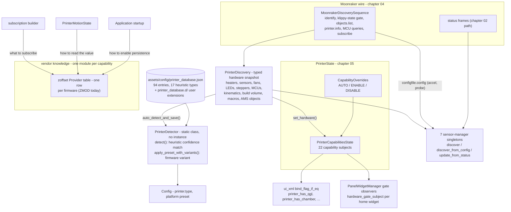

# 06 — Discovery, Capabilities & Vendor Abstraction

Before the UI can show anything useful, HelixScreen must answer three questions about the machine it is attached to: which hardware exists, which model is it, and what does its firmware actually do. This chapter is the pipeline that answers them — `MoonrakerDiscoverySequence` (chapter 04) produces a typed `PrinterDiscovery` snapshot, `PrinterDetector` matches that snapshot against a data-driven printer database to name the model, and `PrinterCapabilitiesState` turns the result into 22 LVGL subjects that gate the whole interface. Layered over that pipeline is the project's strictest architectural rule — a vendor name may appear in exactly one module per capability — with `helix::zoffset` as the reference implementation every new abstraction should imitate.

## Key files

| File | Role |
|------|------|
| [`include/printer_discovery.h`](../../../include/printer_discovery.h) | `PrinterDiscovery`: the typed hardware snapshot and `parse_objects()` classification |
| [`include/moonraker_discovery_sequence.h`](../../../include/moonraker_discovery_sequence.h) | The 8-step async discovery flow that fills the snapshot (wire details in ch. 04) |
| [`include/printer_detector.h`](../../../include/printer_detector.h) | `PrinterDetector`: static detection + every printer-database lookup |
| [`src/printer/printer_detector.cpp`](../../../src/printer/printer_detector.cpp) | Two-phase database load (bundled + user extensions), heuristic matching |
| [`assets/config/printer_database.json`](../../../assets/config/printer_database.json) | The bundled printer database — 94 entries, pure data |
| [`config/printer_database.d/README.md`](../../../config/printer_database.d/README.md) | User-extension format: add, override, or disable printers without recompiling |
| [`include/printer_capabilities_state.h`](../../../include/printer_capabilities_state.h) | The 22 capability subjects that gate UI visibility |
| [`include/capability_overrides.h`](../../../include/capability_overrides.h) | Three-state user overrides (auto/enable/disable) applied on top of detection |
| [`include/sensor_registry.h`](../../../include/sensor_registry.h) | `ISensorManager` interface (three discovery sources) + `SensorRegistry` |
| [`src/sensors/sensor_registry.cpp`](../../../src/sensors/sensor_registry.cpp) | Registry implementation — unwired in production (see below) |
| [`include/temperature_sensor_manager.h`](../../../include/temperature_sensor_manager.h) | Representative sensor manager: singleton, dynamic per-sensor subjects |
| [`src/printer/printer_discovery.cpp`](../../../src/printer/printer_discovery.cpp) | Production discovery fan-out into five sensor managers |
| [`include/z_offset_persistence.h`](../../../include/z_offset_persistence.h) | The vendor-rule reference shape: capability questions, no vendor names |
| [`src/printer/z_offset_persistence.cpp`](../../../src/printer/z_offset_persistence.cpp) | The `Provider` table — all firmware knowledge in one place |
| [`include/printer_state.h`](../../../include/printer_state.h) | `ZOffsetCalibrationStrategy` enum: capability-dispatched calibration flows |
| [`src/ui/panel_widget_manager.cpp`](../../../src/ui/panel_widget_manager.cpp) | `setup_gate_observers()`: home widgets reacting to capability subjects |
| [`docs/devel/Z_OFFSET_PERSISTENCE.md`](../Z_OFFSET_PERSISTENCE.md) | Deep dive: why the idle z-offset reading lies, the one-row recipe |

## How it works

### From object list to printer identity

Chapter 04 ended the wire story at `MoonrakerDiscoverySequence`; this chapter starts at its output. The sequence classifies `printer.objects.list` into `PrinterDiscovery` ([`include/printer_discovery.h:41`](../../../include/printer_discovery.h#L41)) — a by-value snapshot holding heaters, sensors, fans, LEDs, steppers, MCUs, kinematics, build volume, macro names, and AMS/filament-system objects — guarded by a mutex and handed out as a copy via `hardware()` ([`include/moonraker_discovery_sequence.h:104`](../../../include/moonraker_discovery_sequence.h#L104)). Two consumers meet it during startup: `PrinterState::set_hardware()` ([`src/application/application.cpp:3043`](../../../src/application/application.cpp#L3043)) pushes the snapshot into state, and `PrinterDetector::auto_detect_and_save()` ([`src/application/application.cpp:3221`](../../../src/application/application.cpp#L3221)) tries to name the printer.

Not everything waits for Klippy. When the klippy-state gate rejects the full sequence (Moonraker up, Klipper not ready), a *partial* discovery still runs: power devices and Moonraker-hosted sensors need only Moonraker, so their capability subjects light up before Klipper answers (`discover_power_devices()` and `discover_sensors()`, [`include/moonraker_discovery_sequence.h:231`](../../../include/moonraker_discovery_sequence.h#L231)-239). Expect capability state to be provisional until the full sequence completes.

Detection is a confidence match against the database. `PrinterDetector` is a static utility class — every method is `static`, there is no `instance()` (chapter 05's census put it outside the singleton shapes). `detect()` ([`include/printer_detector.h:111`](../../../include/printer_detector.h#L111)) builds a `PrinterHardwareData` fingerprint from the snapshot and runs every heuristic of every database entry against it: `sensor_match`, `fan_match`/`fan_combo`, `hostname_match`, `macro_match`, `mcu_match`, `board_match`, `cpu_arch_match`, `kinematics_match`, `stepper_count`, `tool_count`, `build_volume_range`, `object_exists`, `led_match`, and their `*_exclude` inverses — 17 types in the live database.

Each heuristic carries its own confidence; the winning entry is the one with the best combined score, with `match_count` and `best_single_confidence` ([`include/printer_detector.h:23`](../../../include/printer_detector.h#L23)) as tiebreakers. The result also keeps the runner-up model and its confidence, so the setup wizard can margin-gate — offer a manual choice when the top two scores are too close. Confidence >= 70 counts as high. One heuristic type is second-class on purpose: `is_corroborating_only()` ([`src/printer/printer_detector.cpp:391`](../../../src/printer/printer_detector.cpp#L391)) marks `build_volume_range` as evidence that may support an identification but never establish one — a bed size is shared by dozens of printers (at 215-235mm, up to 15 database windows cover the same point), so a printer whose only match is its volume scores 0 and is not identified at all.

Because detection only runs when `printer.type` is empty — `auto_detect_and_save()` self-guards ([`src/application/application.cpp:3209`](../../../src/application/application.cpp#L3209)) — a user's manual pick is never silently overwritten on reconnect. And a win is not automatically a save: `auto_detect_and_save()` persists nothing below `AUTOSAVE_MIN_CONFIDENCE` (85, [`include/printer_detector.h:608`](../../../include/printer_detector.h#L608)). The runtime path used to write whatever scored above zero, and since a non-empty saved type short-circuits detection forever, a single weak guess became permanent — a custom rig whose only FlashForge-ish signal was an LED named `chamber_light` scored 55 and shipped as a FlashForge Adventurer 5M Pro. Below the bar the decline is logged and the type is left empty for the user to choose, so a later reconnect with a fuller discovery snapshot gets another chance instead of being locked out. In the other direction, when a saved type exists and a fresh detection lands on a *different* model with at least `MISMATCH_MIN_CONFIDENCE` (70, [`include/printer_detector.h:563`](../../../include/printer_detector.h#L563)), a one-time prompt offers Re-identify (launches the wizard's identify step) or Keep current — declining persists a flag and is final for that saved type, because a heavily modified printer can legitimately outvote a 70% heuristic.

Manual picking runs off the same database: `get_list_options()`/`get_list_names()` build the wizard's printer roller (entries missing `show_in_list` default to true; the five entries that set it `false` — non-printer addons like KAMP and Klicky — are excluded, and "Custom/Other" plus "Unknown" are always appended), and the kinematics-filtered overloads ([`include/printer_detector.h:208`](../../../include/printer_detector.h#L208)) narrow it to, say, delta printers only. Whatever path sets the type, `PrinterState::set_printer_type()` ([`src/printer/printer_state.cpp:1161`](../../../src/printer/printer_state.cpp#L1161)) updates the image and type-derived capabilities (like `has_purge_line`) so the home panel reflects it immediately.

The database itself is pure data, loaded in two phases ([`src/printer/printer_detector.cpp:75`](../../../src/printer/printer_detector.cpp#L75) and `:100`): the bundled [`assets/config/printer_database.json`](../../../assets/config/printer_database.json) (resolved at runtime through `find_readable`, [`include/data_root_resolver.h:115`](../../../include/data_root_resolver.h#L115)), then user extensions from `printer_database.d/*.json` in the writable config dir, which can add printers, override bundled entries by id, or disable them ([`config/printer_database.d/README.md`](../../../config/printer_database.d/README.md) documents the format for users). Adding a printer model requires no recompile; adding a new heuristic *type* does.

Beyond identification, the same JSON feeds a family of static capability lookups — `get_z_offset_calibration_strategy()`, `get_probe_type()`, `get_bed_mesh_calibrate_gcode()`, `get_print_start_profile()`, `get_print_start_default_phases()`, `get_console_filter_patterns()`, `get_toolhead_style()`, `get_pre_print_option_set()`, `screws_tilt_direction_override()` — each answering one question so callers never switch on a vendor string. Memory-wise, `compact_database()` ([`include/printer_detector.h:466`](../../../include/printer_detector.h#L466)) strips the heuristic arrays once detection is done; `reload()` plus `LoadStatus` (`:375`) re-read everything and report what loaded, which is how the settings UI surfaces extension-file errors.

One wrinkle worth knowing: `apply_preset_with_variants()` ([`include/printer_detector.h:192`](../../../include/printer_detector.h#L192)) re-fingerprints the object list for firmware variants — a FlashForge AD5M running the ZMOD mod gets the `_zmod` preset variant instead of the stock one — and both the auto-detect and the wizard's manual pick route through it so they cannot disagree.

### Capability subjects, and how they gate the UI

`PrinterState::set_hardware()` ([`src/printer/printer_state.cpp:764`](../../../src/printer/printer_state.cpp#L764)) is where discovery becomes UI state. It stores the snapshot, feeds `CapabilityOverrides` (`:768`), then calls `PrinterCapabilitiesState::set_hardware(discovery, overrides)` (`:772`), which writes the 22 integer subjects listed at [`include/printer_capabilities_state.h:370`](../../../include/printer_capabilities_state.h#L370) — `printer_has_qgl`, `printer_has_probe`, `printer_has_heater_bed`, `printer_has_led`, `printer_has_spoolman`, `printer_has_chamber`, `printer_bed_moves`, and so on. All are plain 0/1 integers registered for XML binding, which is why the gating below costs nothing per frame: a flip is one subject write, and observers do the rest.

Overrides are three-state per capability ([`include/capability_overrides.h:19`](../../../include/capability_overrides.h#L19)): `AUTO` keeps the detected value, `ENABLE`/`DISABLE` force it, because users know things auto-detection cannot (a chamber macro that never names "chamber", a speaker wired outside Klipper). Only the seven capabilities with `capability::` constants ([`include/capability_overrides.h:31`](../../../include/capability_overrides.h#L31)) are overridable — the rest are hard detections.

Some capabilities arrive later than hardware discovery: Spoolman presence, webcam config, the timelapse plugin, power-device and Moonraker-sensor counts come from separate async Moonraker queries. Their setters marshal through `helix::ui::queue_update()` behind an `AsyncLifetimeGuard` ([`include/printer_capabilities_state.h:344`](../../../include/printer_capabilities_state.h#L344)) so a late answer cannot write a freed subject (#1165, #1146) — the chapter 03 lifetime rules applied mechanically.

Gating then happens in two layers. Static XML binds hide rows and controls directly: `<bind_flag_if_eq subject="printer_has_qgl" flag="hidden" ref_value="0"/>` ([`ui_xml/motion_panel.xml:172`](../../../ui_xml/motion_panel.xml#L172); same pattern for `printer_has_chamber` at [`ui_xml/filament_panel.xml:108`](../../../ui_xml/filament_panel.xml#L108)). Nothing in C++ needs to know those rows exist — the subject flip does the hiding.

Home-panel widgets gate dynamically, because which widgets exist is itself data. Each `PanelWidgetDef` may name a `hardware_gate_subject` ([`include/panel_widget_registry.h:51`](../../../include/panel_widget_registry.h#L51)), and `PanelWidgetManager::setup_gate_observers()` ([`src/ui/panel_widget_manager.cpp:1295`](../../../src/ui/panel_widget_manager.cpp#L1295)) observes every distinct gate subject with `observe_int_sync`, coalescing flips into one queued rebuild per tick — so when AMS hardware is discovered mid-session, the AMS widget appears without a restart. Two details make the UX stable rather than twitchy: gate state is part of the widget-instance key, so a gated-to-ungated transition is detected as a *change* and forces the rebuild ([`src/ui/panel_widget_manager.cpp:342`](../../../src/ui/panel_widget_manager.cpp#L342)), and placeholder cards for hardware-gated widgets are laid out from the first frame so the grid does not jump when gates fire during discovery (`:708`). Gated widgets are placed but dimmed with a reason hint (`hardware_gate_hint`, e.g. "Requires AMS or MMU hardware") rather than removed. Chapter 09 owns the full home-widget story; the point here is the direction of the dependency: widget definitions name a *capability subject*, never a printer model or vendor.

### The sensor framework: three sources, seven managers

The sensor framework extends discovery beyond "one subject per capability" to discovered collections of sensors. The interface is `ISensorManager` ([`include/sensor_registry.h:22`](../../../include/sensor_registry.h#L22)), and its shape encodes the fact that sensors are visible in three different places: `discover()` reads the Klipper object list (humidity, probe, width, filament sensors), `discover_from_config()` reads `configfile.config` keys (accelerometers, which expose no `get_status` and therefore never appear in status), and `discover_from_moonraker()` reads Moonraker-side info (TD-1 color sensors). Each arm defaults to no-op; a manager implements only the sources it uses. `update_from_status()` is the pure-virtual live-data arm, and `load_config()`/`save_config()` give every manager a slot in the user's sensor settings.

The same chapter's capability model has one vendor-knowledge border for chamber heaters: `PrinterDiscovery`'s chamber-heater scoring lambda consults the `helix::chamber::` backend registry ([`include/chamber_heater_backend.h`](../../../include/chamber_heater_backend.h)) instead of matching keywords alone, so an appliance-named heater such as `heater_generic dragonbreath` auto-detects at confidence 95 — below a printer-native `heater_generic chamber` (100), above ENCLOSURE/CAVITY — and the winning backend carries the rest: which status object holds diagnostics, the filter-fan pin, a fault-reset gcode, and a conservative target ceiling when `configfile` is silent. Everything downstream (capability subjects, `chamber_heater_*` diagnostics subjects, the temp-graph overlay's diagnostics card) speaks capability names only; vendor names never leave the backend `.cpp` files. Full design, the add-a-backend recipe, and the ceiling/arbitration rules: [CHAMBER_HEATER.md](../CHAMBER_HEATER.md).

Seven managers implement the interface, all singletons: `TemperatureSensorManager`, `HumiditySensorManager`, `WidthSensorManager`, `ProbeSensorManager`, `AccelSensorManager`, `ColorSensorManager` (namespace `helix::sensors`), and `FilamentSensorManager` (namespace `helix`). Each owns dynamic per-sensor subjects — created at discovery, wrapped with a `SubjectLifetime` so observers die safely ([`include/temperature_sensor_manager.h:64`](../../../include/temperature_sensor_manager.h#L64)) — and values are stored as decidegrees to stay integer-subject-compatible. Which discovery arms each manager actually uses, from the live call sites:

| Manager | Source(s) | Discovers |
|---------|-----------|-----------|
| `FilamentSensorManager` | `discover()` | Filament sensors + runout state (feeds ch. 07's backends) |
| `TemperatureSensorManager` | `discover()` | `temperature_sensor` / `temperature_fan` objects (chamber, MCU, host; extruders and bed stay in `PrinterState`) |
| `HumiditySensorManager` | `discover()` | BME280, HTU21D, SHT3X, AHT10/AHT20 |
| `WidthSensorManager` | `discover()` | Filament width sensors (TSL1401CL, Hall) |
| `ProbeSensorManager` | `discover()` + `discover_from_config()` | Native Klipper probes — objects list at connect, config sections on `configfile.config` refresh |
| `AccelSensorManager` | `discover_from_config()` only | ADXL345, LIS2DW, LIS3DH, MPU9250, ICM20948 — no `get_status`, so config is the only place they exist |
| `ColorSensorManager` | `discover_from_moonraker()` | TD-1 color sensors |

The threading split is therefore enforced by convention, not by the registry: `discover*()` and `load_config()` touch subjects and run on the main thread only; `update_from_status()` is the thread-safe arm (mutex plus `queue_update`). Consumers follow the same direct pattern — the Settings > Sensors overlay reads managers straight from [`ui_settings_sensors.cpp`](../../../src/ui/ui_settings_sensors.cpp) (18 call sites), the thermistor home widget observes per-sensor subjects, and telemetry reports per-category counts. None of them go through a registry either; the interface's value today is the *contract* (category name, three discover arms, config round-trip), not polymorphic dispatch.

One disambiguation that saves a wrong turn: these managers are not Moonraker's own sensor list. `server.sensors.list` (the partial-discovery query above) populates the separate `SensorState` singleton (chapter 05's census) and the `sensor_count` capability subject; the seven managers here consume *Klipper* objects, config, and status. Same word "sensor", two different universes.

### The vendor rule: one module per capability

Everything above feeds one discipline, stated in the root CLAUDE.md and enforced in review: **a vendor, firmware, or mod name may appear in one module per capability; generic code asks that module a capability question and never names the vendor.** "Generic code" means anything whose job is not "support vendor X" — `PrinterState`, the subscription builder, `Application` startup, panels, formatters.

The test is mechanical: *adding a second firmware with the same capability must touch exactly one file.* If it would touch the status parser and the subscription builder and startup, the abstraction is missing.

Concretely, the three call sites that would each have grown a `zmod` branch instead ask one question each:

| Generic call site | Asks | A vendor branch here would have been |
|-------------------|------|--------------------------------------|
| subscription builder ([`src/api/moonraker_discovery_sequence.cpp:1468`](../../../src/api/moonraker_discovery_sequence.cpp#L1468)) | `zoffset::required_status_objects(hw)` | `if (hw.has_macro("SAVE_ZMOD_DATA")) subs["save_variables"] = nullptr;` |
| status parser ([`src/printer/printer_motion_state.cpp:206`](../../../src/printer/printer_motion_state.cpp#L206)) | `zoffset::read_persisted_offset_microns(status)` | `zmod::parse_persisted_z_offset(status)` |
| `Application` startup ([`src/application/application.cpp:3068`](../../../src/application/application.cpp#L3068)) | `zoffset::persistence_enable_gcode(hw)` | `api->execute_gcode("SAVE_ZMOD_DATA LOAD_ZOFFSET=1")` |

All firmware knowledge lives in one anonymous-namespace `Provider` table ([`src/printer/z_offset_persistence.cpp:13`](../../../src/printer/z_offset_persistence.cpp#L13), table at `:69`): `{name, detect_macro, status_objects, enable_gcode, read}`. Three rows exist today — ZMOD (`SAVE_ZMOD_DATA`), Forge-X (`SET_MOD`), and Helper-Script's save-zoffset (the `SET_GCODE_OFFSET` wrapper object). Adding the next firmware is one more row and zero call-site changes; [`docs/devel/Z_OFFSET_PERSISTENCE.md`](../Z_OFFSET_PERSISTENCE.md) documents the recipe and the relative-vs-absolute `SET_GCODE_OFFSET` trap. Two details worth copying: the reader matches *by schema, not by detected firmware* ([`src/printer/z_offset_persistence.cpp:94`](../../../src/printer/z_offset_persistence.cpp#L94) — the status path has no discovery snapshot to hand, and a printer without the firmware simply never carries the keys), and naming follows the capability, never the vendor — the subjects are `persisted_z_offset` and the predicate `firmware_persists_z_offset`, not `zmod_z_offset`.

Vendor dispatch that already works this way is pattern, not exception:

- **`AmsBackend*`** — one concrete class per filament system (Happy Hare, AFC, ACE, CFS, AD5X IFS, Snapmaker, QIDI, tool changer) behind a pure-virtual interface with `create()`/`create_auto()` factories ([`include/ams_backend.h:59`](../../../include/ams_backend.h#L59)). `AmsState` consumes only the interface and the `AmsType` enum; the vendor names in its header appear solely in comments. Chapter 07 covers the backend zoo.
- **`ZOffsetCalibrationStrategy`** ([`include/printer_state.h:184`](../../../include/printer_state.h#L184)) — `PROBE_CALIBRATE` / `FIRMWARE_MANAGED` / `ENDSTOP`. The *database* names the strategy per printer (`z_offset_calibration_strategy` field, returned by `get_z_offset_calibration_strategy()` as a string the caller maps to the enum, auto-detecting when empty); generic code switches on the capability enum ([`z_offset_utils.h`](../../../include/z_offset_utils.h)'s `is_auto_saved()`, `apply_and_save()`). Adding a printer with a new calibration behavior is a DB row, not a diff through the calibration panels.
- **`PrinterDetector` lookups** — the data-driven arm: `get_probe_type()`, `get_toolhead_style()`, `screws_tilt_direction_override()`, and friends answer capability questions straight out of JSON, so no consumer learns a vendor name.

When a vendor branch in generic code is genuinely unavoidable, annotate it `// VENDOR_OK: <reason>` — the escape hatch exists, and at audit time the tree uses it zero times, which is the healthy state.

## Patterns & gotchas

- **Detection is best-effort and self-guarded.** `auto_detect_and_save()` runs only when `printer.type` is empty; a manual wizard pick survives reconnects. Don't add code that re-runs detection unconditionally.
- **Never cache capability or database lookups across a reconnect.** Reconnect re-runs discovery and re-subscribes (chapter 04); per-printer caches must go through `PrinterCacheRegistry` or be re-derived.
- **Adding a printer model is data; adding a heuristic type is code.** New models go in [`printer_database.json`](../../../assets/config/printer_database.json) or a user extension file — no rebuild. A new `type` field value needs [`printer_detector.cpp`](../../../src/printer/printer_detector.cpp) support.
- **`compact_database()` is one-shot and destructive to heuristics.** After it runs, `reload()` is the only way to get detection data back — relevant to any code that re-detects after startup.
- **Sensor `discover*()` runs on the main thread; only `update_from_status()` is thread-safe.** The registry does not enforce this for you — production never constructs it; convention and the queue do.
- **Don't route new sensor wiring through `SensorRegistry` expecting it to work.** No production code instantiates it (only its own unit tests do). Call the manager singletons directly as the tree does, or wire the registry as a deliberate change — the interface (`ISensorManager`) is real and all seven managers implement it.
- **Capability subjects name capabilities, never vendors.** `printer_has_probe`, not `printer_has_bltouch`. A vendor-named subject reachable from generic code is review-blocking even when the call site looks clean.
- **Overrides cover seven capabilities only** ([`include/capability_overrides.h:31`](../../../include/capability_overrides.h#L31)). A new overridable capability needs a `capability::` constant plus settings UI — not every subject is overridable by design.
- **The one-file test beats style opinions.** Before adding a vendor branch anywhere, ask: "where does the *second* firmware's edit land?" If the answer is not "the same file," build the provider table first (copy the `zoffset` shape, including the schema-read trick where the hot path lacks a discovery snapshot).
- **Exclusion heuristics exist.** `hostname_exclude`, `macro_exclude`, `kinematics_exclude` subtract confidence — the extension README does not list them, but the engine honors them; use one when a fingerprint is "this host, but not that mod."
- **The `is_*_printer()` helpers read the saved `printer.type` string, not live discovery** (`is_voron_printer()`, `is_creality_k1()`, `is_pfa_printer()`, ... at [`include/printer_detector.h:466`](../../../include/printer_detector.h#L466)+). They exist for rendering picks (toolhead style) and are timing-unsafe if treated as live capability answers early in boot — a fresh install has not written `printer.type` yet, and the CFS backend's K1-vs-K2 dialect check relies on Config being populated from a prior run (#1053 documented why that migration is a won't-do).
- **Sensor manager namespaces differ.** Six managers live in `helix::sensors`; `FilamentSensorManager` predates the framework and lives in `helix` — include the right header before wondering why the qualified name does not resolve.
- **Snapshot `hardware()`, don't reference it.** The accessor returns a by-value copy under a mutex ([`include/moonraker_discovery_sequence.h:104`](../../../include/moonraker_discovery_sequence.h#L104)); mutations go through `modify_hardware()`. Holding a reference into the sequence's internals races the reconnect path.
- **Prefer `auto_detect(discovery)` over hand-building fingerprints.** `detect()` takes a `PrinterHardwareData` you would have to assemble yourself; the wrapper ([`include/printer_detector.h:410`](../../../include/printer_detector.h#L410)) does the conversion and is the only path production uses.
- **Roller indexes are API-computed, never arithmetic.** `get_list_options()` is cached after first build, "Custom/Other" and "Unknown" are always appended last, and `find_list_index()` falls back to the Unknown index ([`include/printer_detector.h:200`](../../../include/printer_detector.h#L200)-240) — index math against a stale list snapshot drifts the moment the database grows.

## Going deeper

- [`../Z_OFFSET_PERSISTENCE.md`](../Z_OFFSET_PERSISTENCE.md) — the full firmware-persisted z-offset story: why the idle reading lies, the `persisted_z_offset` subjects, the relative-vs-absolute `SET_GCODE_OFFSET` rule, and the one-row recipe for adding a firmware.
- [`../FILAMENT_MANAGEMENT.md`](../FILAMENT_MANAGEMENT.md) — the AMS backend zoo (`AmsBackend*` implementations) chapter 07 will summarize: AFC, Happy Hare, ACE, CFS, AD5X IFS, tool changers.
- [`04-moonraker.md`](04-moonraker.md) — the wire half of discovery: the sequence's klippy-state gate, narrowed subscriptions, reconnect behavior.
- [`05-printer-state.md`](05-printer-state.md) — the thirteen `PrinterState` domains these capabilities land in, and the singleton census that puts `PrinterDetector` outside the `::instance()` world.
- [`02-subjects-dataflow.md`](02-subjects-dataflow.md) — the subject machinery (`SubjectManager`, dynamic subjects, observer factories) the sensor managers and capability subjects are built on.
- Chapter 09 owns the full `PanelWidgetDef`/gate-observer mechanics previewed here.

## Guided code tour

Read in this order; about 30 minutes total.

1. [`include/moonraker_discovery_sequence.h:22`](../../../include/moonraker_discovery_sequence.h#L22) — the 8-step discovery timeline comment; you can see where chapter 04's wire story ends and this chapter's begins.
2. [`include/printer_discovery.h:41`](../../../include/printer_discovery.h#L41) — the class doc listing everything one snapshot holds; skim `parse_objects()` at `:52` far enough to see the chamber-heater scoring lambdas (backend-registry consult plus object-type tiebreak).
3. [`include/printer_detector.h:93`](../../../include/printer_detector.h#L93) — the static class; read `detect()`'s contract at `:111`, then `apply_preset_with_variants()` at `:192` for the firmware-variant trick, and `LoadStatus` at `:375`.
4. [`assets/config/printer_database.json`](../../../assets/config/printer_database.json) — open the head and read one full entry (start with the first, FlashForge AD5M): id, name, preset, heuristics with confidences, capability fields.
5. [`config/printer_database.d/README.md:64`](../../../config/printer_database.d/README.md#L64) — the user-extension contract and the heuristic-type table users see (11 of the 17 live types — note the exclusions are missing).
6. [`src/printer/printer_detector.cpp:75`](../../../src/printer/printer_detector.cpp#L75) — the two-phase load: `find_readable("printer_database.json")`, then the `printer_database.d` merge at `:100`-161.
7. [`src/application/application.cpp:3209`](../../../src/application/application.cpp#L3209) — the self-guard comment, then the `auto_detect_and_save()` call at `:3171`; scroll up to `:2970` for `set_hardware()` on the same path.
8. [`include/printer_capabilities_state.h:370`](../../../include/printer_capabilities_state.h#L370) — all 22 subjects in one block; then `set_hardware()`'s contract at `:59` and the `AsyncLifetimeGuard` comment at `:328`.
9. [`include/capability_overrides.h:19`](../../../include/capability_overrides.h#L19) — `OverrideState` three-state logic and the seven `capability::` constants at `:31`.
10. [`ui_xml/motion_panel.xml:172`](../../../ui_xml/motion_panel.xml#L172) — capability gating in XML: `bind_flag_if_eq` on `printer_has_qgl` (and `printer_has_z_tilt` at `:149`).
11. [`src/ui/panel_widget_manager.cpp:1295`](../../../src/ui/panel_widget_manager.cpp#L1295) — `setup_gate_observers()`: one observer per distinct gate subject, coalesced rebuild; cross-reference the gate check at `:128`-137.
12. [`include/sensor_registry.h:22`](../../../include/sensor_registry.h#L22) — `ISensorManager`'s three discovery arms with their source comments; `SensorRegistry` at `:60`, knowing production never constructs it.
13. [`src/printer/printer_discovery.cpp:105`](../../../src/printer/printer_discovery.cpp#L105)-131 — the production discovery fan-out: filament, temperature, probe, humidity, width managers, called straight from `parse_objects()`.
14. [`src/printer/printer_state.cpp:625`](../../../src/printer/printer_state.cpp#L625)-633 — the status fan-out to all seven managers — the sensor framework's live-data path.
15. [`include/z_offset_persistence.h:32`](../../../include/z_offset_persistence.h#L32)-62 — the whole vendor abstraction: five functions, none naming a firmware in its signature.
17. [`include/printer_state.h:184`](../../../include/printer_state.h#L184) — `ZOffsetCalibrationStrategy`: capability-named dispatch for calibration flows, the enum counterpart of the provider table.
18. [`include/z_offset_utils.h:26`](../../../include/z_offset_utils.h#L26) — the enum's consumers: `is_auto_saved()` at `:18`, then `apply_and_save()` at `:76` taking the API and the strategy — generic calibration code that never learns which printer it is talking to.
