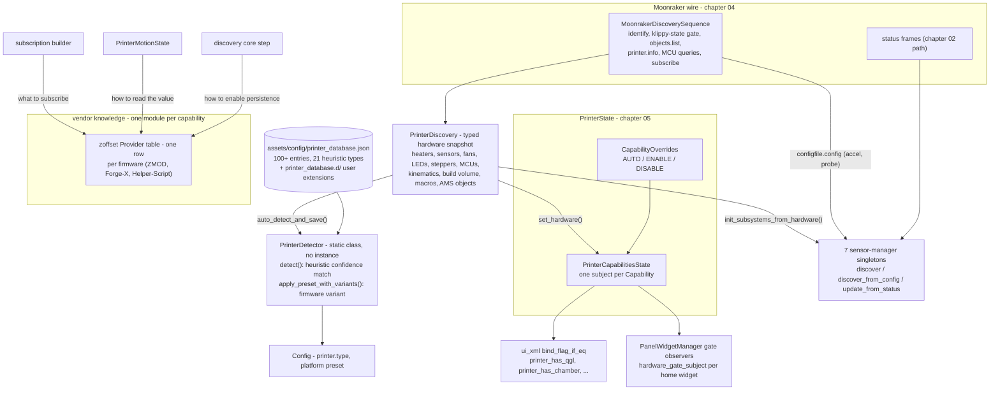

# 06 - Discovery, Capabilities & Vendor Abstraction

Before the UI can show anything useful, HelixScreen must answer three questions about the machine it is attached to: which hardware exists, which model is it, and what does its firmware actually do. This chapter is the pipeline that answers them - `MoonrakerDiscoverySequence` (chapter 04) produces a typed `PrinterDiscovery` snapshot, `PrinterDetector` matches that snapshot against a data-driven printer database to name the model, and `PrinterCapabilitiesState` turns the result into one integer subject per `Capability`, the flags that gate the whole interface. Layered over that pipeline is the project's strictest architectural rule - a vendor name may appear in exactly one module per capability - with `helix::zoffset` as the reference implementation every new abstraction should imitate.

```mermaid
flowchart TB
    subgraph WIRE["Moonraker wire - chapter 04"]
        SEQ["MoonrakerDiscoverySequence<br/>identify, klippy-state gate, objects.list,<br/>printer.info, MCU queries, subscribe"]
        ST["status frames (chapter 02 path)"]
    end

    PD["PrinterDiscovery - typed hardware snapshot<br/>heaters, sensors, fans, LEDs, steppers, MCUs,<br/>kinematics, build volume, macros, AMS objects"]
    DET["PrinterDetector - static class, no instance<br/>detect(): heuristic confidence match<br/>apply_preset_with_variants(): firmware variant"]
    DB[("assets/config/printer_database.json<br/>100+ entries, 21 heuristic types<br/>+ printer_database.d/ user extensions")]
    CFG["Config - printer.type, platform preset"]

    subgraph STATE["PrinterState - chapter 05"]
        CAP["PrinterCapabilitiesState<br/>one subject per Capability"]
        OVR["CapabilityOverrides<br/>AUTO / ENABLE / DISABLE"]
    end

    UIXML["ui_xml bind_flag_if_eq<br/>printer_has_qgl, printer_has_chamber, ..."]
    GATES["PanelWidgetManager gate observers<br/>hardware_gate_subject per home widget"]
    MGR["7 sensor-manager singletons<br/>discover / discover_from_config / update_from_status"]

    subgraph VENDOR["vendor knowledge - one module per capability"]
        ZO["zoffset Provider table - one row<br/>per firmware (ZMOD, Forge-X, Helper-Script)"]
    end

    ASK1["subscription builder"]
    ASK2["PrinterMotionState"]
    ASK3["discovery core step"]

    SEQ --> PD
    PD -->|"auto_detect_and_save()"| DET
    DB --> DET
    DET --> CFG
    PD -->|"set_hardware()"| CAP
    OVR --> CAP
    CAP --> UIXML
    CAP --> GATES
    PD -->|"init_subsystems_from_hardware()"| MGR
    SEQ -->|"configfile.config (accel, probe)"| MGR
    ST --> MGR
    ASK1 -->|"what to subscribe"| ZO
    ASK2 -->|"how to read the value"| ZO
    ASK3 -->|"how to enable persistence"| ZO
```

## Key files

| File | Role |
|------|------|
| [`include/printer_discovery.h`](../../../include/printer_discovery.h) | `PrinterDiscovery`: the typed hardware snapshot and `parse_objects()` classification |
| [`include/moonraker_discovery_sequence.h`](../../../include/moonraker_discovery_sequence.h) | The 8-step async discovery flow that fills the snapshot (wire details in ch. 04) |
| [`include/printer_detector.h`](../../../include/printer_detector.h) | `PrinterDetector`: static detection + every printer-database lookup |
| [`src/printer/printer_detector.cpp`](../../../src/printer/printer_detector.cpp) | Two-phase database load (bundled + user extensions), heuristic matching |
| [`assets/config/printer_database.json`](../../../assets/config/printer_database.json) | The bundled printer database, pure data |
| [`config/printer_database.d/README.md`](../../../config/printer_database.d/README.md) | User-extension format: add, override, or disable printers without recompiling |
| [`include/printer_capabilities_state.h`](../../../include/printer_capabilities_state.h) | The `Capability` enum and the subjects that gate UI visibility |
| [`src/printer/printer_capabilities_state.cpp`](../../../src/printer/printer_capabilities_state.cpp) | `CAPABILITY_DEFS`: each capability's XML subject name and default, in enum order |
| [`include/capability_overrides.h`](../../../include/capability_overrides.h) | Three-state user overrides (auto/enable/disable) applied on top of detection |
| [`include/temperature_sensor_manager.h`](../../../include/temperature_sensor_manager.h) | Representative sensor manager: singleton, dynamic per-sensor subjects |
| [`src/printer/printer_discovery_parse.cpp`](../../../src/printer/printer_discovery_parse.cpp) | `parse_objects()`: object classification, chamber-heater scoring, the AMS detection ladder |
| [`src/printer/printer_discovery.cpp`](../../../src/printer/printer_discovery.cpp) | `init_subsystems_from_hardware()`: the fan-out into AMS backends, six sensor managers, extruders and LEDs |
| [`src/application/discovery_steps_core.cpp`](../../../src/application/discovery_steps_core.cpp) | The ordered discovery-complete steps every build runs: `set_hardware`, z-offset persistence, auto-detect, safety limits |
| [`include/z_offset_persistence.h`](../../../include/z_offset_persistence.h) | The vendor-rule reference shape: capability questions, no vendor names |
| [`src/printer/z_offset_persistence.cpp`](../../../src/printer/z_offset_persistence.cpp) | The `Provider` table - all firmware knowledge in one place |
| [`include/printer_profile_state.h`](../../../include/printer_profile_state.h) | Printer type and what it decides, incl. the `ZOffsetCalibrationStrategy` enum |
| [`src/ui/panel_widget_manager.cpp`](../../../src/ui/panel_widget_manager.cpp) | `setup_gate_observers()`: home widgets reacting to capability subjects |
| [`docs/devel/Z_OFFSET_PERSISTENCE.md`](../Z_OFFSET_PERSISTENCE.md) | Deep dive: why the idle z-offset reading lies, the one-row recipe |

## How it works

### From object list to printer identity

Chapter 04 ended the wire story at `MoonrakerDiscoverySequence`; this chapter starts at its output. The sequence classifies `printer.objects.list` into `PrinterDiscovery` ([`include/printer_discovery.h#PrinterDiscovery`](../../../include/printer_discovery.h)) - a by-value snapshot holding heaters, sensors, fans, LEDs, steppers, MCUs, kinematics, build volume, macro names, and AMS/filament-system objects - guarded by a mutex and handed out as a copy via `hardware()` ([`include/moonraker_discovery_sequence.h#hardware`](../../../include/moonraker_discovery_sequence.h)). Two hand-offs follow, both wired once for every build by `wire_discovery()` ([`src/application/session_wiring.cpp#wire_discovery`](../../../src/application/session_wiring.cpp)) and both queued to the main thread. When the object list is classified, `init_subsystems_from_hardware()` ([`src/printer/printer_discovery.cpp#init_subsystems_from_hardware`](../../../src/printer/printer_discovery.cpp)) builds what the hardware implies: AMS backends (chapter 07), the sensor managers, per-extruder subjects and the LED controller. When discovery completes, an ordered table of steps runs ([`src/application/discovery_steps_core.cpp#discovery_core_steps`](../../../src/application/discovery_steps_core.cpp)): `set_hardware_step` pushes the snapshot into `PrinterState::set_hardware()`, and `auto_detect_printer_step` calls `PrinterDetector::auto_detect_and_save()` to name the printer. The table's order is the contract, because later steps read what earlier ones stored; desktop runs a tail table ([`src/application/discovery_steps.cpp`](../../../src/application/discovery_steps.cpp)) after it.

Not everything waits for Klippy. When the klippy-state gate rejects the full sequence (Moonraker up, Klipper not ready), a *partial* discovery still runs: power devices and Moonraker-hosted sensors need only Moonraker, so their capability subjects light up before Klipper answers (`discover_power_devices()` and `discover_sensors()`, [`include/moonraker_discovery_sequence.h#discover_power_devices`](../../../include/moonraker_discovery_sequence.h)). Expect capability state to be provisional until the full sequence completes.

Detection is a confidence match against the database. `PrinterDetector` is a static utility class - every method is `static`, there is no `instance()` (chapter 05's census put it outside the singleton shapes). `detect()` ([`include/printer_detector.h#detect`](../../../include/printer_detector.h)) builds a `PrinterHardwareData` fingerprint from the snapshot and runs every heuristic of every database entry against it: `sensor_match`, `fan_match`/`fan_combo`, `hostname_match`, `macro_match`, `mcu_match`, `board_match`, `cpu_arch_match`, `kinematics_match`, `stepper_count`, `tool_count`, `build_volume_range`, `object_exists`, `led_match`, their `*_exclude` inverses, and the `*_required` absence forms - 21 types in the live database. Every lookup reads the database's `printers` array through one helper, `database_printers()` in `printer_detector.cpp`, which answers null when the database failed to load.

Each heuristic carries its own confidence; the winning entry is the one with the best combined score, with `match_count` and `best_single_confidence` ([`include/printer_detector.h#PrinterDetectionResult`](../../../include/printer_detector.h)) as tiebreakers. The result also keeps the *runner-up* - the best-scoring candidate naming a different machine than the winner, so that two entries picturing the same printer (a CFS option, a firmware variant) do not count against each other - and the winner's lead over it gates both places detection acts. Confidence >= 70 counts as high. One heuristic type is second-class on purpose: `is_corroborating_only()` ([`src/printer/printer_detector.cpp`](../../../src/printer/printer_detector.cpp)) marks `build_volume_range` as evidence that may support an identification but never establish one - a bed size is shared by dozens of printers (at 215-235mm, up to 15 database windows cover the same point), so a printer whose only match is its volume scores 0 and is not identified at all. The corroborating grade is not volume-only: any heuristic carries it where an entry authors class-level evidence (a chamber sensor, an MCU claimed by several models, a vendor-string hostname), and corroborating matches add nothing to the match bonus, so they support through `match_count` and separator opt-ins alone.

Because detection only runs when `printer.type` is empty - `auto_detect_and_save()` self-guards ([`src/application/discovery_steps_core.cpp#auto_detect_printer_step`](../../../src/application/discovery_steps_core.cpp)) - a user's manual pick is never silently overwritten on reconnect. And a win is not automatically a save: `auto_detect_and_save()` persists nothing below `AUTOSAVE_MIN_CONFIDENCE` (85, [`include/printer_detector.h#AUTOSAVE_MIN_CONFIDENCE`](../../../include/printer_detector.h)), and nothing that fails to lead the runner-up by `DETECT_MIN_MARGIN` ([`include/printer_detector.h#DETECT_MIN_MARGIN`](../../../include/printer_detector.h)). That lead is measured on the score *before* the 100 ceiling, which otherwise flattens a real gap between two strong candidates into an apparent tie. The margin exists because a non-empty saved type short-circuits detection forever, so a guess weak enough to save would become permanent. Below the bar the decline is logged and the type is left empty for the user to choose, so a later reconnect with a fuller discovery snapshot gets another chance instead of being locked out. When the decline is a tie, `PrinterDetectionResult::contenders` (`include/printer_detector.h#PrinterDetectionResult/contenders`) names the machines the winner does not lead, one per pictured machine, and the wizard's identify step opens on exactly those with nothing selected: Next waits for a pick, and leaving without one saves no type. In the other direction, when a saved type exists and a fresh detection lands on a *different* model, clears `MISMATCH_MIN_CONFIDENCE` ([`include/printer_detector.h#MISMATCH_MIN_CONFIDENCE`](../../../include/printer_detector.h)) and leads its nearest rival by the same margin, a one-time prompt offers Choose Model (launches the wizard's identify step, a picker over every model) or Keep current - declining persists a flag and is final for that saved type, because a heavily modified printer can legitimately outvote a heuristic. Contradicting a type the user chose is a stronger claim than filling an empty one, so that bar is the auto-save bar rather than a second constant free to drift below it.

Manual picking runs off the same database: `get_list_options()`/`get_list_names()` build the wizard's printer roller (entries missing `show_in_list` default to true; the five entries that set it `false` - non-printer addons like KAMP and Klicky - are excluded, and "Custom/Other" plus "Unknown" are always appended), and the kinematics-filtered overloads ([`include/printer_detector.h#PrinterDetector`](../../../include/printer_detector.h)) narrow it to, say, delta printers only. Whatever path sets the type, `PrinterState::set_printer_type_sync()` (`src/printer/printer_state.cpp#set_printer_type_internal`) hands it to `PrinterProfileState`, which owns the type, its pre-print option set and z-offset strategy, then applies the cross-domain follow-ups (probe-type override, `printer_has_purge_line`, bed drying, visibility) so the home panel reflects it immediately.

The database itself is pure data, loaded in two phases ([`src/printer/printer_detector.cpp#load`](../../../src/printer/printer_detector.cpp) and `src/printer/printer_detector.cpp#merge_user_extensions`): the bundled [`assets/config/printer_database.json`](../../../assets/config/printer_database.json) (resolved at runtime through `find_readable`, [`include/data_root_resolver.h#find_readable`](../../../include/data_root_resolver.h)), then user extensions from `printer_database.d/*.json` in the writable config dir, which can add printers, override bundled entries by id, or disable them ([`config/printer_database.d/README.md`](../../../config/printer_database.d/README.md) documents the format for users). Adding a printer model requires no recompile; adding a new heuristic *type* does.

Beyond identification, the same JSON feeds a family of static capability lookups - `get_z_offset_calibration_strategy()`, `hide_manual_z_calibration()`, `get_probe_type()`, `get_bed_mesh_calibrate_gcode()`, `get_print_start_profile()`, `get_print_start_default_phases()`, `get_console_filter_patterns()`, `get_toolhead_style()`, `get_pre_print_option_set()`, `screws_tilt_direction_override()` - each answering one question so callers never switch on a vendor string. Memory-wise, `compact_database()` ([`include/printer_detector.h#compact_database`](../../../include/printer_detector.h)) strips the heuristic arrays once detection is done; `reload()` plus `LoadStatus` (`include/printer_detector.h#LoadStatus`) re-read everything and report what loaded, which is how the settings UI surfaces extension-file errors.

One wrinkle worth knowing: `apply_preset_with_variants()` ([`include/printer_detector.h#PrinterDetector`](../../../include/printer_detector.h)) re-fingerprints the object list for firmware variants - a FlashForge AD5M running the ZMOD mod gets the `_zmod` preset variant instead of the stock one - and both the auto-detect and the wizard's manual pick route through it so they cannot disagree.

### Capability subjects, and how they gate the UI

`PrinterState::set_hardware()` ([`src/printer/printer_state.cpp#set_hardware`](../../../src/printer/printer_state.cpp)) is where discovery becomes UI state. It stores the snapshot, feeds `CapabilityOverrides` (`src/printer/printer_state.cpp#set_hardware/"capability_overrides_.set_hardware(discovery_);"`), then calls `PrinterCapabilitiesState::set_hardware(discovery, overrides)` (`src/printer/printer_state.cpp#set_hardware/"capabilities_state_.set_hardware(discovery_, capability_overrides_);"`), which writes the capability subjects: one per value of the `Capability` enum ([`include/printer_capabilities_state.h#Capability`](../../../include/printer_capabilities_state.h)), named and defaulted by the `CAPABILITY_DEFS` table in `printer_capabilities_state.cpp`, and reached in C++ through `subject(Capability)`. They include `printer_has_qgl`, `printer_has_probe`, `printer_has_heater_bed`, `printer_has_led`, `printer_has_spoolman`, `printer_has_chamber`, `printer_bed_moves`, and so on. All are plain 0/1 integers registered for XML binding, which is why the gating below costs nothing per frame: a flip is one subject write, and observers do the rest.

Overrides are three-state per capability ([`include/capability_overrides.h#OverrideState`](../../../include/capability_overrides.h)): `AUTO` keeps the detected value, `ENABLE`/`DISABLE` force it, because users know things auto-detection cannot (a chamber macro that never names "chamber", a speaker wired outside Klipper). Only the seven capabilities with `capability::` constants ([`include/capability_overrides.h#BED_MESH`](../../../include/capability_overrides.h)) are overridable - the rest are hard detections.

Some capabilities arrive later than hardware discovery: Spoolman presence, webcam config, the timelapse plugin, power-device and Moonraker-sensor counts come from separate async Moonraker queries. Their setters marshal through `helix::ui::queue_update()` behind an `AsyncLifetimeGuard` ([`include/printer_capabilities_state.h#PrinterCapabilitiesState`](../../../include/printer_capabilities_state.h)) so a late answer cannot write a freed subject (#1165, #1146) - the chapter 03 lifetime rules applied mechanically. An answer that arrives before `init_subjects()` has run is latched (`pending_capability_values_`) and replayed when the subjects are created, rather than lost.

Gating then happens in two layers. Static XML binds hide rows and controls directly: `<bind_flag_if_eq subject="printer_has_qgl" flag="hidden" ref_value="0"/>` ([`ui_xml/motion_panel.xml#right_column/btn_qgl`](../../../ui_xml/motion_panel.xml); same pattern for `printer_has_chamber` at [`ui_xml/filament_panel.xml#chamber_section`](../../../ui_xml/filament_panel.xml)). Nothing in C++ needs to know those rows exist: the subject flip does the hiding.

Home-panel widgets gate dynamically, because which widgets exist is itself data. Each `PanelWidgetDef` may name a `hardware_gate_subject` ([`include/panel_widget_registry.h#hardware_gate_subject`](../../../include/panel_widget_registry.h)), and `PanelWidgetManager::setup_gate_observers()` ([`src/ui/panel_widget_manager.cpp#setup_gate_observers`](../../../src/ui/panel_widget_manager.cpp)) observes every distinct gate subject with `observe<int>`, coalescing flips into one queued rebuild per tick - so when AMS hardware is discovered mid-session, the AMS widget appears without a restart. Two details make the UX stable rather than twitchy: gate state is part of the widget-instance key, so a gated-to-ungated transition is detected as a *change* and forces the rebuild ([`src/ui/panel_widget_manager.cpp#populate_widgets`](../../../src/ui/panel_widget_manager.cpp)), and placeholder cards for hardware-gated widgets are laid out from the first frame so the grid does not jump when gates fire during discovery (`src/ui/panel_widget_manager.cpp#populate_widgets/"hardware-gated widgets appear from the first frame"`). Gated widgets are placed but dimmed with a reason hint (`hardware_gate_hint`, e.g. "Requires AMS or MMU hardware") rather than removed. Chapter 09 owns the full home-widget story; the point here is the direction of the dependency: widget definitions name a *capability subject*, never a printer model or vendor.

### The sensor framework: two sources, seven managers

The sensor framework extends discovery beyond "one subject per capability" to discovered collections of sensors. Each category has its own singleton manager, and the managers share a method vocabulary rather than an interface: sensors are visible in two different places, so `discover()` reads the Klipper object list (humidity, probe, width, temperature, load cells) and `discover_from_config()` reads `configfile.config` keys (accelerometers, which expose no `get_status` and therefore never appear in status). A manager implements only the sources it uses. `update_from_status()` is the live-data arm.

The same chapter's capability model has one vendor-knowledge border for chamber heaters: `PrinterDiscovery`'s chamber-heater scoring lambda consults the `helix::chamber::` backend registry ([`include/chamber_heater_backend.h`](../../../include/chamber_heater_backend.h)) instead of matching keywords alone, so an appliance-named heater such as `heater_generic dragonbreath` auto-detects at confidence 95 - below a printer-native `heater_generic chamber` (100), above ENCLOSURE/CAVITY - and the winning backend carries the rest: which status object holds diagnostics, the filter-fan pin, a fault-reset gcode, and a conservative target ceiling when `configfile` is silent. Everything downstream (capability subjects, `chamber_heater_*` diagnostics subjects, the temp-graph overlay's diagnostics card) speaks capability names only; vendor names never leave the backend `.cpp` files. Full design, the add-a-backend recipe, and the ceiling/arbitration rules: [CHAMBER_HEATER.md](../CHAMBER_HEATER.md).

Seven managers, all singletons: `TemperatureSensorManager`, `HumiditySensorManager`, `WidthSensorManager`, `ProbeSensorManager`, `AccelSensorManager`, `LoadCellManager` (namespace `helix::sensors`), and `FilamentSensorManager` (namespace `helix`). `helix::sensors::for_each_sensor_manager()` (`include/sensor_managers.h#helix::sensors`) is the one list of them; subject init and the status fan-out both iterate it. Each owns dynamic per-sensor subjects - created at discovery, wrapped with a `SubjectLifetime` so observers die safely ([`include/temperature_sensor_manager.h#"struct DynamicIntSubject {"`](../../../include/temperature_sensor_manager.h)) - and values are stored as fixed-point integers to stay integer-subject-compatible (temperatures as decidegrees). The full per-manager story is [`../SENSOR_MANAGEMENT.md`](../SENSOR_MANAGEMENT.md). Which discovery arms each manager actually uses, from the live call sites:

| Manager | Source(s) | Discovers |
|---------|-----------|-----------|
| `FilamentSensorManager` | `discover_sensors()` | Filament sensors + runout state (feeds ch. 07's backends) |
| `LoadCellManager` | `discover()` | `load_cell` objects |
| `TemperatureSensorManager` | `discover()` | `temperature_sensor` / `temperature_fan` objects (chamber, MCU, host; extruders and bed stay in `PrinterState`) |
| `HumiditySensorManager` | `discover()` | BME280, HTU21D, SHT3X, AHT10/AHT20 |
| `WidthSensorManager` | `discover()` | Filament width sensors (TSL1401CL, Hall) |
| `ProbeSensorManager` | `discover()` + `discover_from_config()` | Native Klipper probes - objects list at connect, config sections on `configfile.config` refresh |
| `AccelSensorManager` | `discover_from_config()` only | ADXL345, LIS2DW, LIS3DH, MPU9250, ICM20948 - no `get_status`, so config is the only place they exist |

Discovery is wired directly: `init_subsystems_from_hardware()` calls six managers' `discover()` / `discover_sensors()` itself, with an empty list clearing the previous printer's sensors on a switch ([`src/printer/printer_discovery.cpp#init_subsystems_from_hardware`](../../../src/printer/printer_discovery.cpp)); the discovery sequence's `configfile.config` step queues `ProbeSensorManager` and `AccelSensorManager` `discover_from_config()` to the main thread ([`src/api/moonraker_discovery_sequence.cpp#continue_discovery_objects`](../../../src/api/moonraker_discovery_sequence.cpp) - accel sensors appear *only* there); and status frames fan out to all of them through `for_each_sensor_manager()` from `dispatch_status_frame()` ([`src/printer/status_dispatch.cpp#dispatch_status_frame`](../../../src/printer/status_dispatch.cpp), chapter 05). The mock seeds the same managers directly ([`src/api/moonraker_client_mock.cpp#populate_capabilities`](../../../src/api/moonraker_client_mock.cpp), `src/api/moonraker_client_mock.cpp#populate_capabilities/"hw.parse_objects(mock_objects);"`), so `--test` exercises identical code paths.

Inside each manager, one `SensorCollection` per sensor kind ([`include/sensor_collection.h`](../../../include/sensor_collection.h)) holds the discovered configs in order and the runtime state keyed by Klipper name, under the manager's own mutex. The threading split is enforced by convention: `discover*()` and `load_config()` touch subjects and run on the main thread only; `update_from_status()` is the thread-safe arm (mutex plus `queue_update`). Consumers follow the same direct pattern - the Settings > Devices > Sensors overlay reads managers straight from [`ui_settings_sensors.cpp`](../../../src/ui/ui_settings_sensors.cpp), the thermistor home widget observes per-sensor subjects, and telemetry reports per-category counts.

One disambiguation that saves a wrong turn: these managers are not Moonraker's own sensor list. `server.sensors.list` (the partial-discovery query above) populates the separate `SensorState` singleton (chapter 05's census) and the `sensor_count` capability subject; the managers here consume *Klipper* objects, config, and status. Same word "sensor", two different universes.

### The vendor rule: one module per capability

Everything above feeds one discipline, stated in the root CLAUDE.md and enforced in review: **a vendor, firmware, or mod name may appear in one module per capability; generic code asks that module a capability question and never names the vendor.** "Generic code" means anything whose job is not "support vendor X" - `PrinterState`, the subscription builder, the discovery steps, panels, formatters.

The test is mechanical: *adding a second firmware with the same capability must touch exactly one file.* If it would touch the status parser, the subscription builder and the discovery steps, the abstraction is missing.

Concretely, the three call sites that would each have grown a `zmod` branch instead ask one question each:

| Generic call site | Asks | A vendor branch here would have been |
|-------------------|------|--------------------------------------|
| subscription builder ([`src/api/moonraker_discovery_sequence.cpp#build_subscription_objects`](../../../src/api/moonraker_discovery_sequence.cpp)) | `zoffset::required_status_objects(hw)` | `if (hw.has_macro("SAVE_ZMOD_DATA")) subs["save_variables"] = nullptr;` |
| status parser ([`src/printer/printer_motion_state.cpp#update_from_status`](../../../src/printer/printer_motion_state.cpp)) | `zoffset::read_persisted_offset_microns(status)` | `zmod::parse_persisted_z_offset(status)` |
| discovery core step ([`src/application/discovery_steps_core.cpp#zoffset_persistence_step`](../../../src/application/discovery_steps_core.cpp)) | `zoffset::persistence_enable_gcode(hw)` | `api->execute_gcode("SAVE_ZMOD_DATA LOAD_ZOFFSET=1")` |

The reference shape answering them is `helix::zoffset` ([`include/z_offset_persistence.h`](../../../include/z_offset_persistence.h) - a compact header with no classes exported). The problem it owns: some firmwares keep the authoritative z-offset in their own storage and zero the live `gcode_move` value between prints, so reading Klipper's idle offset is a lie about what the next print will apply. The module's public surface is free functions - the three questions above (declared at [`include/z_offset_persistence.h#required_status_objects`](../../../include/z_offset_persistence.h), `include/z_offset_persistence.h#read_persisted_offset_microns`, `include/z_offset_persistence.h#persistence_enable_gcode`), plus `firmware_persists_z_offset()`, `persistence_provider_name()` (which the discovery sequence uses to log what matched), and the enable-once bookkeeping the discovery step uses (`claim_persistence_enable()`, `status_refutes_persistence()`) ([`src/api/moonraker_discovery_sequence.cpp#complete_discovery_subscription`](../../../src/api/moonraker_discovery_sequence.cpp)). Nothing in a signature names a firmware; nothing outside the module needs to know one exists.

All firmware knowledge lives in one anonymous-namespace `Provider` table ([`src/printer/z_offset_persistence.cpp#Provider`](../../../src/printer/z_offset_persistence.cpp), table at `src/printer/z_offset_persistence.cpp#providers`): `{name, detect_macro, status_objects, enable_gcode, read}`. Three rows exist today - ZMOD (`SAVE_ZMOD_DATA`), Forge-X (`SET_MOD`), and Helper-Script's save-zoffset (the `SET_GCODE_OFFSET` wrapper object). Adding the next firmware is one more row and zero call-site changes; [`docs/devel/Z_OFFSET_PERSISTENCE.md`](../Z_OFFSET_PERSISTENCE.md) documents the recipe and the relative-vs-absolute `SET_GCODE_OFFSET` trap. Two details worth copying: the reader matches *by schema, not by detected firmware* ([`src/printer/z_offset_persistence.cpp#helix::zoffset`](../../../src/printer/z_offset_persistence.cpp) - the status path has no discovery snapshot to hand, and a printer without the firmware simply never carries the keys), and naming follows the capability, never the vendor - the subjects are `persisted_z_offset` and the predicate `firmware_persists_z_offset`, not `zmod_z_offset`.

Vendor dispatch that already works this way is pattern, not exception:

- **`AmsBackend*`** - one concrete class per filament system (Happy Hare, AFC, ACE, CFS, AD5X IFS, Snapmaker, QIDI, OpenAMS, tool changer) behind a pure-virtual interface with `create()` factories ([`include/ams_backend.h`](../../../include/ams_backend.h)). `AmsState` consumes only the interface and the `AmsType` enum. Chapter 07 covers the backend zoo.
- **`ZOffsetCalibrationStrategy`** (`include/printer_profile_state.h#ZOffsetCalibrationStrategy`) - `PROBE_CALIBRATE` / `FIRMWARE_MANAGED` / `ENDSTOP`. The *database* names the strategy per printer (`z_offset_calibration_strategy` field, returned by `get_z_offset_calibration_strategy()` as a string the caller maps to the enum, auto-detecting when empty); generic code switches on the capability enum ([`z_offset_utils.h`](../../../include/z_offset_utils.h)'s `is_auto_saved()`, `apply_and_save()`). Adding a printer with a new calibration behavior is a DB row, not a diff through the calibration panels.
- **`PrinterDetector` lookups** - the data-driven arm: `get_probe_type()`, `get_toolhead_style()`, `screws_tilt_direction_override()`, and friends answer capability questions straight out of JSON, so no consumer learns a vendor name.

When a vendor branch in generic code is genuinely unavoidable, annotate it `// VENDOR_OK: <reason>`. Its uses today are the vendor borders themselves (each chamber-heater backend file) and the mock, which simulates vendor hardware on purpose; a `VENDOR_OK` anywhere else needs a reason a reviewer would accept.

## Patterns & gotchas

- **Detection is best-effort and self-guarded.** `auto_detect_and_save()` runs only when `printer.type` is empty; a manual wizard pick survives reconnects. Don't add code that re-runs detection unconditionally.
- **Never cache capability or database lookups across a reconnect.** Reconnect re-runs discovery and re-subscribes (chapter 04); per-printer caches must go through `PrinterCacheRegistry` or be re-derived.
- **Adding a printer model is data; adding a heuristic type is code.** New models go in [`printer_database.json`](../../../assets/config/printer_database.json) or a user extension file - no rebuild. A new `type` field value needs [`printer_detector.cpp`](../../../src/printer/printer_detector.cpp) support.
- **A new entry has to be distinguishable on its own fingerprint.** [`tests/unit/test_printer_database_distinguishability.cpp`](../../../tests/unit/test_printer_database_distinguishability.cpp) replays every `show_in_list` entry's own heuristics through `detect()` and fails when a different machine wins or ties, so a second entry that re-authors a sibling's evidence cannot land silently. Collisions the shipped database already carries are listed there and ratcheted: remove the entry from the list in the change that separates it.
- **`compact_database()` is one-shot and destructive to heuristics.** After it runs, `reload()` is the only way to get detection data back - relevant to any code that re-detects after startup.
- **Sensor `discover*()` runs on the main thread; only `update_from_status()` is thread-safe.** Nothing enforces this for you; convention and the queue do.
- **Capability subjects name capabilities, never vendors.** `printer_has_probe`, not `printer_has_bltouch`. A vendor-named subject reachable from generic code is review-blocking even when the call site looks clean.
- **Overrides cover seven capabilities only** ([`include/capability_overrides.h#BED_MESH`](../../../include/capability_overrides.h)). A new overridable capability needs a `capability::` constant plus settings UI - not every subject is overridable by design.
- **The one-file test beats style opinions.** Before adding a vendor branch anywhere, ask: "where does the *second* firmware's edit land?" If the answer is not "the same file," build the provider table first (copy the `zoffset` shape, including the schema-read trick where the hot path lacks a discovery snapshot).
- **Exclusion heuristics exist.** `hostname_exclude`, `macro_exclude`, `kinematics_exclude` subtract confidence - the extension README does not list them, but the engine honors them; use one when a fingerprint is "this host, but not that mod." `led_required` (and `sensor_required`/`fan_required`/`object_required`) is the absence form: the entry's machine always carries the pattern, so a *reported* list that lacks it rules the entry out, while an unreported list (`PrinterHardwareData::objects_reported` false) never does - that is what separates a plain FlashForge 5M from the Pro, whose only extra hardware is the chamber light.
- **The `is_*_printer()` helpers read the saved `printer.type` string, not live discovery** (`is_creality_k1()`, `is_creality_k2()`, ... at [`include/printer_detector.h#is_creality_k1`](../../../include/printer_detector.h)). They exist for rendering picks (toolhead style) and are timing-unsafe if treated as live capability answers early in boot - a fresh install has not written `printer.type` yet, and the CFS backend's K1-vs-K2 dialect check relies on Config being populated from a prior run (#1053 documented why that migration is a won't-do).
- **Sensor manager namespaces differ.** Six managers live in `helix::sensors`; `FilamentSensorManager` lives in `helix` - include the right header before wondering why the qualified name does not resolve.
- **Snapshot `hardware()`, don't reference it.** The accessor returns a by-value copy under a mutex ([`include/moonraker_discovery_sequence.h#hardware`](../../../include/moonraker_discovery_sequence.h)); mutations go through `modify_hardware()`. Holding a reference into the sequence's internals races the reconnect path.
- **Prefer `auto_detect(discovery)` over hand-building fingerprints.** `detect()` takes a `PrinterHardwareData` you would have to assemble yourself; the wrapper ([`include/printer_detector.h#PrinterDetector`](../../../include/printer_detector.h)) does the conversion and is the only path production uses.
- **Roller indexes are API-computed, never arithmetic.** `get_list_options()` is cached after first build, "Custom/Other" and "Unknown" are always appended last, and `find_list_index()` falls back to the Unknown index ([`include/printer_detector.h#PrinterDetector`](../../../include/printer_detector.h)) - index math against a stale list snapshot drifts the moment the database grows.

## Going deeper

- [`../Z_OFFSET_PERSISTENCE.md`](../Z_OFFSET_PERSISTENCE.md) - the full firmware-persisted z-offset story: why the idle reading lies, the `persisted_z_offset` subjects, the relative-vs-absolute `SET_GCODE_OFFSET` rule, and the one-row recipe for adding a firmware.
- [`../FILAMENT_MANAGEMENT.md`](../FILAMENT_MANAGEMENT.md) - the AMS backend zoo (`AmsBackend*` implementations) chapter 07 will summarize: AFC, Happy Hare, ACE, CFS, AD5X IFS, tool changers.
- [`04-moonraker.md`](04-moonraker.md) - the wire half of discovery: the sequence's klippy-state gate, narrowed subscriptions, reconnect behavior.
- [`05-printer-state.md`](05-printer-state.md) - the thirteen `PrinterState` domains these capabilities land in, and the singleton census that puts `PrinterDetector` outside the `::instance()` world.
- [`02-subjects-dataflow.md`](02-subjects-dataflow.md) - the subject machinery (`SubjectManager`, dynamic subjects, observer factories) the sensor managers and capability subjects are built on.
- Chapter 09 owns the full `PanelWidgetDef`/gate-observer mechanics previewed here.

## Guided code tour

Read in this order; about 30 minutes total.

1. [`include/moonraker_discovery_sequence.h#helix`](../../../include/moonraker_discovery_sequence.h) - the 8-step discovery timeline comment; you can see where chapter 04's wire story ends and this chapter's begins.
2. [`include/printer_discovery.h#PrinterDiscovery`](../../../include/printer_discovery.h) - the class doc listing everything one snapshot holds; then skim `parse_objects()` at [`src/printer/printer_discovery_parse.cpp#parse_objects`](../../../src/printer/printer_discovery_parse.cpp) far enough to see the chamber-heater scoring (backend-registry consult plus object-type tiebreak).
3. [`include/printer_detector.h#PrinterDetector`](../../../include/printer_detector.h) - the static class; read `detect()`'s contract at `include/printer_detector.h#detect`, then `apply_preset_with_variants()` at `include/printer_detector.h#PrinterDetector/"apply_preset_with_variants"` for the firmware-variant trick, and `LoadStatus` at `include/printer_detector.h#LoadStatus`.
4. [`assets/config/printer_database.json`](../../../assets/config/printer_database.json) - open the head and read one full entry (start with the first, FlashForge AD5M): id, name, preset, heuristics with confidences, capability fields.
5. [`config/printer_database.d/README.md#"Optional Fields"`](../../../config/printer_database.d/README.md) - the user-extension contract and the heuristic-type table users see (a subset of the live types: the exclusions and the `*_required` forms are missing).
6. [`src/printer/printer_detector.cpp#load`](../../../src/printer/printer_detector.cpp) - the two-phase load: `find_readable("printer_database.json")`, then the `printer_database.d` merge at `src/printer/printer_detector.cpp#merge_user_extensions`, and `database_printers()`, the one reader of the `printers` array.
7. [`src/application/discovery_steps_core.cpp#discovery_core_steps`](../../../src/application/discovery_steps_core.cpp) - the ordered step table; then `auto_detect_printer_step` (`src/application/discovery_steps_core.cpp#auto_detect_printer_step`) with its self-guard comment, and `set_hardware_step` (`src/application/discovery_steps_core.cpp#set_hardware_step`) for `set_hardware()` on the same path.
8. [`include/printer_capabilities_state.h#Capability`](../../../include/printer_capabilities_state.h) - the `Capability` enum, every capability in one block; the matching subject names are `CAPABILITY_DEFS` in `src/printer/printer_capabilities_state.cpp`. Then `set_hardware()`'s contract at `include/printer_capabilities_state.h#set_hardware` and the `AsyncLifetimeGuard` comment at `include/printer_capabilities_state.h#PrinterCapabilitiesState/"AsyncLifetimeGuard::defer()"`.
9. [`include/capability_overrides.h#OverrideState`](../../../include/capability_overrides.h) - `OverrideState` three-state logic and the seven `capability::` constants at `include/capability_overrides.h#BED_MESH`.
10. [`ui_xml/motion_panel.xml#right_column/btn_qgl`](../../../ui_xml/motion_panel.xml): capability gating in XML, `bind_flag_if_eq` on `printer_has_qgl` (and `printer_has_z_tilt` at `ui_xml/motion_panel.xml#right_column/btn_z_tilt`).
11. [`src/ui/panel_widget_manager.cpp#setup_gate_observers`](../../../src/ui/panel_widget_manager.cpp) - `setup_gate_observers()`: one observer per distinct gate subject, coalesced rebuild; cross-reference the gate check at `src/ui/panel_widget_manager.cpp#compute_visible_widget_ids`.
12. [`src/printer/printer_discovery.cpp#init_subsystems_from_hardware`](../../../src/printer/printer_discovery.cpp) - the production discovery fan-out: AMS, then the filament, temperature, load-cell, probe, humidity and width managers.
13. [`src/printer/status_dispatch.cpp#dispatch_status_frame`](../../../src/printer/status_dispatch.cpp) - the status fan-out to every sensor manager - the sensor framework's live-data path.
14. [`include/z_offset_persistence.h#helix::zoffset`](../../../include/z_offset_persistence.h) - the whole vendor abstraction: free functions, none naming a firmware in its signature.
15. [`src/printer/z_offset_persistence.cpp#Provider`](../../../src/printer/z_offset_persistence.cpp) - the `Provider` table (three rows, at `src/printer/z_offset_persistence.cpp#providers`), then the schema-read rationale at `src/printer/z_offset_persistence.cpp#read_persisted_offset_microns/"Read by schema rather than by detected firmware"`; finish with the call sites: [`src/api/moonraker_discovery_sequence.cpp#build_subscription_objects`](../../../src/api/moonraker_discovery_sequence.cpp), [`src/printer/printer_motion_state.cpp#update_from_status`](../../../src/printer/printer_motion_state.cpp), [`src/application/discovery_steps_core.cpp#zoffset_persistence_step`](../../../src/application/discovery_steps_core.cpp).
16. `include/printer_profile_state.h#ZOffsetCalibrationStrategy` - `ZOffsetCalibrationStrategy`: capability-named dispatch for calibration flows, the enum counterpart of the provider table.
17. [`include/z_offset_utils.h#helix::zoffset`](../../../include/z_offset_utils.h) - the enum's consumers: `is_auto_saved()` at `include/z_offset_utils.h#is_auto_saved`, then `apply_and_save()` at `include/z_offset_utils.h#helix::zoffset/"void apply_and_save(IMoonrakerAPI* api, helix::ui::SaveConfigWatch& save_watch,"` taking the API and the strategy - generic calibration code that never learns which printer it is talking to.
