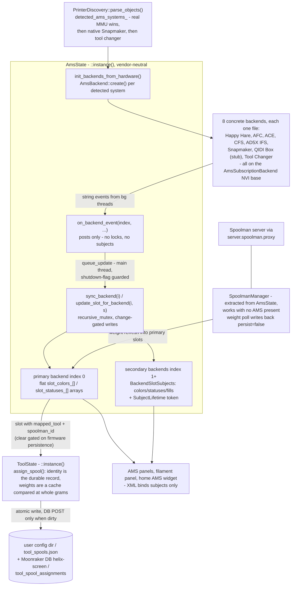

# 07 — Filament & AMS

Multi-filament support is one coordinator, many systems: `AmsState` (a `::instance()` singleton from chapter 05's census) owns a vector of `AmsBackend` objects — one concrete class per filament system — and never names a vendor outside comments. Backends subscribe to their own Moonraker objects and emit string events from background threads; `AmsState` marshals those to the main thread, reads backend state under its recursive mutex, and writes change-gated LVGL subjects.

Two neighbors complete the picture. Spool *identity* — which Spoolman spool sits on which tool — deliberately lives one door down in `ToolState`, persisted by identity rather than weight, so it survives restarts and works on printers with no filament-changer hardware at all. And Spoolman itself is a separate manager, not a backend. This chapter is the first hour: the contract, the event pipeline, and the persistence rules. Every per-backend protocol detail belongs to the deep dive.

Chapter 02 owns the subject machinery and chapter 03 the threading contracts this subsystem applies; neither is re-explained here. What chapter 05 said about `ToolState` as a singleton satellite still holds — this chapter covers only its filament half.

## Key files

| File | Role |
|------|------|
| [`include/ams_backend.h`](../../../include/ams_backend.h) | The pure-virtual `AmsBackend` contract: lifecycle, events, state queries, capability flags, `create()` factories |
| [`include/ams_subscription_backend.h`](../../../include/ams_subscription_backend.h) | `AmsSubscriptionBackend`: the NVI base all real backends derive from — final entry points, `do_*` hooks, subscription ownership, the one-in-flight op claim |
| [`include/ams_types.h`](../../../include/ams_types.h) | `AmsType` enum (8 systems + `NONE`) — the only vendor taxonomy generic code sees |
| [`include/ams_state.h`](../../../include/ams_state.h) | `AmsState` singleton: `backends_` vector, `BackendSlotSubjects`, ~92 fixed subjects |
| [`src/printer/ams_state.cpp`](../../../src/printer/ams_state.cpp) | Backend creation, event routing, subject sync, the ToolState spool bridge |
| [`src/printer/ams_backend.cpp`](../../../src/printer/ams_backend.cpp) | `AmsBackend::create(AmsType, ...)` — the one switch mapping enum to class |
| [`include/tool_state.h`](../../../include/tool_state.h) | `ToolInfo`, spool-assignment API (`assign_spool`, save/load, `SubjectLifetime`) |
| [`src/printer/tool_state.cpp`](../../../src/printer/tool_state.cpp) | Identity-not-weight persistence, atomic JSON save, Moonraker DB round-trip |
| [`include/spoolman_manager.h`](../../../include/spoolman_manager.h) | `SpoolmanManager`: weight polling, circuit breaker, identity cache — no AMS required |
| [`include/ams_error.h`](../../../include/ams_error.h) | `AmsError`/`AmsResult`: the immediate refusal-or-accepted answer every backend op returns |
| [`include/filament_op_dispatch.h`](../../../include/filament_op_dispatch.h) | The tier planner deciding which UI surface owns a filament operation |
| [`include/printer_discovery.h`](../../../include/printer_discovery.h) | `detected_ams_systems()` and the detection-priority ladder |
| [`docs/devel/FILAMENT_MANAGEMENT.md`](../FILAMENT_MANAGEMENT.md) | The deep dive: every backend's protocol, op dispatch, endless spool, errors |

## How it works

### The contract: interface, NVI base, eight concretes

`AmsBackend` ([`include/ams_backend.h:59`](../../../include/ams_backend.h#L59)) is the vendor-neutral surface: `start()`/`stop()` lifecycle, a string-event system (`EVENT_STATE_CHANGED`, `EVENT_SLOT_CHANGED`, `EVENT_LOAD_COMPLETE`, ... at `:72`-80), state queries, filament operations, and a set of default capability questions — `manages_active_spool()` (`:191`), `tracks_weight_locally()` (`:205`), `has_firmware_spool_persistence()` (`:2004`), `publish_external_spool_lane()` (`:1410`), and the static `sensor_belongs_to_backend()` dispatcher (`:2191`) that keeps each backend's filament-sensor name patterns in its own file (#1054).

No real backend implements the interface directly: all eight derive from `AmsSubscriptionBackend` ([`include/ams_subscription_backend.h:33`](../../../include/ams_subscription_backend.h#L33)), a non-virtual-interface base that makes `start()`/`stop()` and the load/unload/select/change operations `final` and dispatches to `do_*` hooks. That base is where shared discipline lives — it owns the `SubscriptionGuard` for the backend's Moonraker subscription (`:323`) and runs the print-active gate *plus a test-and-set in-flight claim* in the public entry points, so a backend cannot ship without the gate (one did, `180a71c7d`) and two surfaces cannot start concurrent ops on the same backend.

The eight concrete classes, one file each:

| Backend | File | System |
|---------|------|--------|
| `AmsBackendHappyHare` | [`include/ams_backend_happy_hare.h:43`](../../../include/ams_backend_happy_hare.h#L43) | Happy Hare MMU (mmu object, MMU_GATE_MAP) |
| `AmsBackendAfc` | [`include/ams_backend_afc.h:143`](../../../include/ams_backend_afc.h#L143) | AFC-Klipper-Add-On (lanes, hubs, `lane_data`) |
| `AmsBackendAce` | [`include/ams_backend_ace.h:46`](../../../include/ams_backend_ace.h#L46) | Anycubic ACE Pro (ValgACE/BunnyACE/DuckACE) |
| `AmsBackendCfs` | [`include/ams_backend_cfs.h:127`](../../../include/ams_backend_cfs.h#L127) | Creality Filament System (K2, RS-485 boxes) |
| `AmsBackendAd5xIfs` | [`include/ams_backend_ad5x_ifs.h:88`](../../../include/ams_backend_ad5x_ifs.h#L88) | FlashForge AD5X Intelligent Filament Switching |
| `AmsBackendSnapmaker` | [`include/ams_backend_snapmaker.h:68`](../../../include/ams_backend_snapmaker.h#L68) | Snapmaker U1 native SnapSwap |
| `AmsBackendQidi` | [`include/ams_backend_qidi.h:48`](../../../include/ams_backend_qidi.h#L48) | QIDI Box (PLUS4/Q2/MAX4) — a stub, per its own header |
| `AmsBackendToolChanger` | [`include/ams_backend_toolchanger.h:50`](../../../include/ams_backend_toolchanger.h#L50) | viesturz/klipper-toolchanger |

`AmsType` ([`include/ams_types.h:42`](../../../include/ams_types.h#L42)) enumerates them plus `NONE`. The single place an `AmsType` becomes a class is `AmsBackend::create(AmsType, api, client)` ([`src/printer/ams_backend.cpp:625`](../../../src/printer/ams_backend.cpp#L625)); mock mode (`RuntimeConfig::should_mock_ams()`) short-circuits to `AmsBackendMock`. This is the vendor rule from chapter 06 working as dispatch: `AmsState`'s header contains vendor names *only in comments*, and a ninth system means one new subclass plus one enum value, factory case, and detection entry — no edits to generic code.

Detection feeding that factory is a priority ladder in `PrinterDiscovery::parse_objects()` ([`include/printer_discovery.h:52`](../../../include/printer_discovery.h#L52)): a real MMU (Happy Hare, AFC, AD5X IFS, CFS, ACE, QIDI Box) always wins, then native Snapmaker hardware, then a standalone tool changer. `parse_objects()` ends by calling `AmsState::instance().init_backend_from_hardware()` directly ([`src/printer/printer_discovery.cpp:101`](../../../src/printer/printer_discovery.cpp#L101)); `init_backends_from_hardware()` ([`src/printer/ams_state.cpp:721`](../../../src/printer/ams_state.cpp#L721)) skips mock mode, skips if backends already exist, creates and `start()`s one backend per detected system, then syncs immediately so the `ams_slot_count` gate lights up without waiting for the first async event (`:762`).

Commands flow out through the same contract, asynchronously. UI surfaces do not call a backend's `do_*` hooks; they go through the NVI entry points (`load_filament(slot)`, `unload_filament(slot)`, `select_slot`, `change_tool`), which return an `AmsError` immediately — the refusal, not the outcome — while the real result arrives later as `EVENT_LOAD_COMPLETE` / `EVENT_UNLOAD_COMPLETE` / `EVENT_ERROR`. Four dispatch surfaces share the ladder (filament panel, AMS operation sidebar, mid-print runout dialog, idle runout dialog); which one owns a given operation is tiered by [`include/filament_op_dispatch.h:9`](../../../include/filament_op_dispatch.h#L9), and that ladder is the deep dive's job, not this chapter's. Cooldowns after load/unload/swap live in `PostOpCooldownManager` (chapter 05's census).

The capability questions are where per-system behavior differences surface — and they can be *state*, not just static flags:

| Capability question | True for | What generic code does with it |
|---------------------|----------|-------------------------------|
| `manages_active_spool()` | AFC, AD5X IFS (always); Happy Hare when its Spoolman mode is not OFF | Skip the direct `set_active_spool` push — the firmware calls Spoolman itself (#644) |
| `tracks_weight_locally()` | AFC | Don't overwrite slot weights from Spoolman polling — the backend's own count is fresher |
| `has_firmware_spool_persistence()` | Happy Hare (MMU_GATE_MAP SPOOLID), AFC (SET_SPOOL_ID) | ToolState may clear assignments when a slot loses its spool; otherwise ToolState is the source of truth and the sync reverses |
| `publish_external_spool_lane()` (overridden) | CFS, AD5X IFS, AFC, Happy Hare | On the bypass-engage edge and every external-spool identity change, `AmsState` asks every backend to publish the extern spool as the lane one past its last slot in the shared `lane_data` namespace (OrcaSlicer picks it up as an extra tray). The override builds the record via one shared helper (`helix::ams::publish_external_lane`); backends with no bypass keep the default no-op. Which store it goes through differs — see FILAMENT_MANAGEMENT.md § "Bypass companions" |

### Bypass transitions notify, layers own the policy

The `any_bypass_active()` edge in `sync_from_backend()` (the same edge that
bumps `slots_version_` for the pre-print check) is a *notification bus*, not
an implementation site. It makes exactly two calls, and neither policy lives
in the AMS layer: `FilamentSensorManager::on_bypass_active_changed()` (the
sensor layer arms/restores RUNOUT-role sensors at the firmware level) and
`publish_external_spool_lane()` on each backend (the capability question
above). The vendor/layering rule from the repo root applies in full — no
backend implements the sensor policy, and the sensor manager never names a
filament system.

### Events in: queue first, lock and write on the main thread

Backends emit events from background threads (their Moonraker subscriptions fire on libhv). The whole safety story is that `on_backend_event()` ([`src/printer/ams_state.cpp:2233`](../../../src/printer/ams_state.cpp#L2233)) touches neither the mutex nor a subject: it only posts a `helix::ui::queue_update()` lambda whose body — already on the main thread — checks `s_shutdown_flag`, then calls `sync_backend(index)` or `update_slot_for_backend(index, slot)`, which take the recursive mutex and write subjects (`:1284`, `:1322`). The mutex still matters because background threads call thread-safe `AmsState` queries (`get_backend()`, `backend_count()`, ...) concurrently with main-thread syncs. After every sync the queued body bumps `ams_data_revision_` so code waiting for backend data to land can re-read (`:2257`).

Routing is by captured index: `add_backend()` ([`src/printer/ams_state.cpp:786`](../../../src/printer/ams_state.cpp#L786)) registers a lambda that closes over the backend's position in `backends_` (`:784`), so events from concurrent systems cannot cross wires.

Event coarsening is deliberate: `STATE_CHANGED`, op completions, errors, and attention all trigger a full backend sync; `SLOT_CHANGED` parses a slot index for a one-slot update and *falls back to a full sync* when it cannot — the old drop-the-event behavior left the UI stale whenever a backend forgot to pass the index (`:2096`-2109).

Subject storage is two-shaped:

- **Backend 0** writes the flat arrays every single-backend XML binding already knows — `slot_colors_[i]`, `slot_statuses_[i]`, `slot_fills_[i]`, plus string and live-state families — inside `sync_from_backend()` ([`src/printer/ams_state.cpp:1459`](../../../src/printer/ams_state.cpp#L1459), per-slot loop at `:1698`).
- **Backends at index 1+** get a `BackendSlotSubjects` struct ([`include/ams_state.h:1675`](../../../include/ams_state.h#L1675)) allocated at `add_backend()` time — dynamic `colors`/`statuses`/`fills` vectors sized to the backend's slot count. These subjects are destroyed on backend rediscovery, so the struct carries a `SubjectLifetime` token and the token-taking accessor overloads (`get_slot_color_subject(backend, slot, lifetime)` at `:1071`) hand it out; an observer that skips the token is chapter 03 bug #705 waiting.

Both paths write change-gated — every value is compared before `lv_subject_set_*` fires, and a material-name delta additionally bumps `slots_version_` because the panel's material label has no direct binding (#1065). The fixed subject set (roughly 92 members in the header, capped at `MAX_SLOTS = 16` and `MAX_UNITS = 8`) splits into families the UI binds:

| Family | Members (subject names) | Consumed by |
|--------|--------------------------|-------------|
| System identity | `ams_type`, `ams_system_name`, `ams_system_logo`, `ams_slot_count` | Home AMS widget gate, AMS panel header |
| Backend selector | `backend_count`, `active_backend`, `ams_data_revision` | Multi-system selector UI, data-wait code |
| Per-slot state (x16) | color, status, fill, remaining, material, segment, toolhead-present, active-loaded | Slot cards, `ams_slot` widget, filament-path canvas |
| Current line | `current_slot`, `ams_current_tool`, `ams_filament_loaded`, `ams_filament_runout`, `current_color` | Filament panel, runout dialog |
| Operation progress | `ams_action`, `ams_action_detail`, `ams_operation_phase`, `toolchange_step` | Step bar, action prompts |
| Toolchange narration | `toolchange_visible`, `ams_current_toolchange`, `ams_number_of_toolchanges`, `toolchange_text` | Print-status toolchange banner |
| Path canvas feed | `path_topology`, `path_active_slot`, `path_filament_segment`, `path_error_segment`, `path_anim_progress` | Filament-path canvas (its own doc) |
| Dryer / environment | `dryer_*`, per-unit `ams_unit_<i>_*` temp + humidity | AMS unit cards, dryer overlay |
| Endless spool | `ams_endless_state`, `ams_endless_text` | Endless-spool status line |

The AMS panel itself is nothing but bindings over those subjects — slot cards reading the per-slot family, the header reading the system-identity family, the action buttons calling backend ops through the dispatch ladder:

One end-to-end sequence ties the pieces together. The user taps a slot; a dispatch surface (tiered per [`include/filament_op_dispatch.h:9`](../../../include/filament_op_dispatch.h#L9)) lands on a backend op. The NVI entry point — say `change_tool(n)` — passes the print-active gate, claims the in-flight slot, and calls the backend's `do_change_tool`, which sends G-code through the API (chapter 04). The firmware acts; the backend's Moonraker subscription fires on libhv, and the backend emits `EVENT_TOOL_CHANGED`. `on_backend_event()` posts; the queued body runs `sync_backend(0)` under the mutex, change-gating every subject write, bumping `ams_data_revision_`, and — if the tool-to-slot mapping moved — `tool_map_version_` so the gcode preview recolors. No panel code ran; the subjects did the work.

Observers get lifetime protection at two scopes, mirroring how the subjects die. Per-slot (and per-unit) subjects of secondary backends die on rediscovery, so their token-taking accessors hand out the struct's token; the *whole* fixed set dies together in `deinit_subjects()`, so long-lived outside observers — `PrintStatusPanel` watches `get_current_color_subject()` and `get_tool_map_version_subject()` to recolor the gcode preview — must pass `get_subjects_lifetime()` ([`include/ams_state.h:802`](../../../include/ams_state.h#L802)) to their `observe_*` call. A few accessors are documented exceptions with static lifetime (e.g. `get_active_tool_port_present_subject()`, [`include/ams_state.h:811`](../../../include/ams_state.h#L811)-819) and need no token; the accessor's doc comment says which world it is in.

### Which head prints tool N: attachment is not routing

Two questions look like one and are not:

- **Attachment** — which slot physically holds which spool. `AmsSystemInfo::tool_to_slot_map`.
  Read by the Load/Unload slot resolver and the persisted tool-map ledger.
- **Routing** — which head will actually print logical tool `N` for the current print.
  `AmsBackend::get_tool_mapping()`.

On most backends they are the same vector, and `get_tool_mapping()` simply returns the
physical map — a filament system routes whichever lane it selects to its one nozzle, so
the map *is* the routing. On a tool changer they come apart: a Snapmaker U1 has four
permanently-attached spools (so attachment is trivially identity) while the firmware
routes logical tools onto heads through its own table, which is how a file sliced for
`T0`/`T2` prints from whichever heads hold the matching filament.

Anything asking "what color is tool N" must ask the routing question, and must ask it
through `get_tool_mapping()` rather than reaching for a firmware field — that accessor is
where the vendor knowledge stops. Reading the attachment map instead is not a subtle
error: on the U1 it is trivially identity, so it answers confidently and wrongly, and a
2-color print rendered with its two colors exactly swapped. `AmsState::routed_tool_colors()`
is the one consumer, and `FilamentMapper::routed_tool_colors()` the one place the color
math lives.

A backend that has no routing of its own returns an empty vector, which callers must read
as "no opinion" and never as identity — see the U1's idle table in
[FILAMENT_BACKEND_SNAPMAKER_U1.md](../FILAMENT_BACKEND_SNAPMAKER_U1.md) for why that
distinction is load-bearing.

### Can this printer honor the pick: three questions, one spelling each

Routing says which head prints tool N *today*. Whether the user can CHANGE that is a
separate axis, and it is three questions, not one. Each has exactly one spelling, and
generic code asks it through [`include/ams_remap.h`](../../../include/ams_remap.h) rather than assembling an answer:

| Question | Ask | Backend declares |
|---|---|---|
| Can the user's tool→lane pick be carried out at all, right now? | `helix::printer::can_remap(backend)` | `get_remap_strategy()` + `remap_ready()` |
| Does the route write a table that outlives the send? | `helix::printer::remap_is_persistent(strategy)` | (derived from the strategy) |
| Does this backend own a tool→slot table for `ToolState` to adopt? | `backend.owns_tool_mapping_table()` | that virtual |

`remap_ready()` is the axis worth understanding, because nothing modelled it for a long
time. A backend can be BUILT to remap and not be able to yet: AD5X IFS declares
`RemapStrategy::Native` unconditionally, but until the `_IFS_VARS` macro is discovered,
`set_tool_mapping()` writes local state the firmware replays nothing from, so the user's
pick is dropped in silence. Readiness lives in that one virtual — a second gate anywhere
else is how the answers drifted apart before.

The third question is not the first two, and the Snapmaker U1 is where they part company:
it carries out every pick the user makes, through its pre-print
`SET_PRINT_EXTRUDER_MAP` send, and owns no tool→slot table — its four extruders are
independent, so `ToolState`'s extruder enumeration is the correct model and an AMS
topology would be a fiction. `build_ams_topology()` therefore asks about the table, never
about remap capability.

`requires_preprint_send()` stays separate from all three on purpose. It answers a
print-start sequencing question — the U1's pre-send is always-on, even with no remap, to
suppress a spurious-feed runout — and folding it back into the strategy would re-conflate
sequencing with capability.

**When adding a firmware:** declare `get_remap_strategy()`, add `remap_ready()` only if
discovery gates it, and `owns_tool_mapping_table()` only if you own a table. One file.
[`tests/unit/test_remap_strategy.cpp`](../../../tests/unit/test_remap_strategy.cpp) pins every backend's answers, so a forgotten
declaration fails a test instead of shipping a silent contradiction.

### Spool assignment: identity is durable, weight is cache

Which spool is mounted where is *not* AMS state. `sync_from_backend()` bridges for every slot with a `mapped_tool` ([`src/printer/ams_state.cpp:1854`](../../../src/printer/ams_state.cpp#L1854)-1871): a slot with `spoolman_id > 0` calls `ToolState::assign_spool()`.

A slot that lost its spool calls `clear_spool()` **only when the backend reports `has_firmware_spool_persistence()`** — for backends without it (tool changer), ToolState is the source of truth and the sync runs the other way, populating empty slots from ToolState so assignments loaded at startup reach the slot UI. The one-slot path (`update_slot()`, `:1968`-1974) applies the same firmware-persistence gate to its assign-and-save, without the clear or reverse-populate branches.

`ToolState::assign_spool()` ([`src/printer/tool_state.cpp:619`](../../../src/printer/tool_state.cpp#L619)) splits the record in two. Identity (spool id + name) is the durable half: a change sets `spool_dirty_` and logs at info. Weights are a cache — firmware reports them as continuous floats, and the code comment preserves the war story (`:641`): an exact compare on bundle L53W5PKG meant 590 rewrites of the JSON, 590 Moonraker DB POSTs and 590 panel rebuilds in one session. `same_displayed_weight()` (`:617`) compares at whole grams — `std::lround(a) == std::lround(b)`, against the last *stored* value so a slow slide fires once per gram — and a weight-only change bumps `tools_version_` for UI refresh while never marking the record dirty.

Persistence (`save_spool_assignments()`, `:801`) always writes local JSON first — atomic tmp-file-plus-rename, after resolving the installer's symlink so the first save does not replace the link with a file (`:704`-759) — then fire-and-forgets a DB POST to namespace `helix-screen`, key `tool_spool_assignments`.

Loading prefers the DB and falls back to the local file, seeding the DB on the way; both callback arms marshal through `AsyncLifetimeGuard::bg_cb` (#1165) and re-sync `AmsState` so slot subjects reflect what loaded (`:818`-859). On device the file is `<user-config-dir>/tool_spools.json`; the directory comes from `helix::get_user_config_dir()`, overridable only by an explicit `set_config_dir()` pin ([`include/tool_state.h:172`](../../../include/tool_state.h#L172)).

### Spoolman without AMS

Spoolman integration is deliberately *not* a backend. `SpoolmanManager` ([`include/spoolman_manager.h:64`](../../../include/spoolman_manager.h#L64), [`src/printer/spoolman_manager.cpp`](../../../src/printer/spoolman_manager.cpp)) was extracted from `AmsState` so printers with zero filament-changer hardware still get spool tracking. Its charter, from the header:

- periodic weight polling via `lv_timer`, with refcounted start/stop;
- a circuit breaker that suppresses error toasts while Spoolman is unreachable;
- a Spoolman availability observer that auto-stops polling when the service disappears;
- a transient identity cache (with negative caching for deleted spools) feeding the filament display-name resolver.

Its weight refresh writes back into the primary backend's slots with `set_slot_info(..., persist=false)` ([`spoolman_manager.cpp:426`](../../../src/printer/spoolman_manager.cpp#L426)-434) — `persist=true` would emit G-code, the firmware would report the new weight, and the poll would loop forever. All Spoolman RPC goes through `server.spoolman.proxy` via the `MoonrakerSpoolmanAPI` sub-API (chapter 04); the spool browser/wizard UI ([`src/ui/ui_panel_spoolman.cpp`](../../../src/ui/ui_panel_spoolman.cpp), [`src/ui/ui_spool_wizard.cpp`](../../../src/ui/ui_spool_wizard.cpp)) talks to that API, not to `AmsState`.

One trap the interface answers: pushing "active spool" to Spoolman is gated on `manages_active_spool()` ([`src/printer/ams_state.cpp:3055`](../../../src/printer/ams_state.cpp#L3055)-3063). AFC, for instance, updates Spoolman itself when HelixScreen sends its native spool command — calling Spoolman directly would update the widget while bypassing the firmware's own state (#644).

For debugging, every class in this chapter logs under a stable tag: `[AMS State]` for the coordinator, `[ToolState]` for assignments, `[SpoolmanAPI]` for Spoolman RPC, and one backend tag per system (`backend_log_tag()`, e.g. `[AMS AFC]` at [`include/ams_backend_afc.h:508`](../../../include/ams_backend_afc.h#L508), `[AMS HappyHare]` at [`include/ams_backend_happy_hare.h:301`](../../../include/ams_backend_happy_hare.h#L301)). A `-vv` run makes the whole event pipeline visible — creation, events, queued syncs, and spool saves each leave a line.

## Patterns & gotchas

- **Never name a filament system outside its backend file.** Generic code sees `AmsBackend*` and `AmsType`. If a new feature would need `if (type == AmsType::AFC)`, the answer is a capability question on the interface (`manages_active_spool()`, `tracks_weight_locally()`, `has_firmware_spool_persistence()`, ...) — the one-file test from chapter 06.
- **Observing secondary-backend subjects requires the lifetime token.** `BackendSlotSubjects` are dynamic — destroyed in `clear_backends()`/rediscovery. Use the `SubjectLifetime`-taking accessor overloads; the plain ones are for one-frame reads on the main thread.
- **Do not write subjects from backend-event context.** The event path queues *before* touching anything ([`ams_state.cpp:2205`](../../../src/printer/ams_state.cpp#L2205)); the queued body is where mutex + subjects happen. A shortcut around `queue_update` reintroduces the bg-thread LVGL crash family (chapter 03).
- **Don't "fix" the gram threshold.** Weight churn marking the record dirty is the L53W5PKG regression reborn; weights are re-fetched on connect, so persisting them buys nothing. Compare via `same_displayed_weight()` or not at all.
- **Save and load are deliberately asymmetric.** Save writes the local JSON first (fast, reliable) and fire-and-forgets the DB POST; load prefers the DB and falls back to the file, seeding the DB on failure ([`tool_state.cpp:858`](../../../src/printer/tool_state.cpp#L858)-916). The file is the recovery path, not the primary — don't reorder them.
- **`tools_version_` (ToolState) and `slots_version_` (AmsState) are different clocks.** The first bumps on tool/spool data changes (including weight-only); the second on slot card data. Binding a rebuild to the wrong one yields either twitchy or stale UI.
- **Clearing a spool assignment is conditional, and the condition is OWNERSHIP.** Forward-clear when the LANE owns the assignment; tool changers, where each tool owns its own spool, get the *reverse* sync instead ([`ams_state.cpp:1863`](../../../src/printer/ams_state.cpp#L1863), `:1830`). Clearing unconditionally destroys the just-loaded assignment. The question is `supports_per_tool_spool_assignment()`, not `has_firmware_spool_persistence()` — the latter asks whether *firmware* remembers the spool id, which CFS and AD5X IFS answer no to while keeping identity in our own `lane_data` override store. Gating on it put those two in the tool-changer branch, so a lane the user cleared was refilled from ToolState on the very next poll.
- **Slot and unit subjects are capped**: `MAX_SLOTS = 16`, `MAX_UNITS = 8` ([`include/ams_state.h:127`](../../../include/ams_state.h#L127), `:77`). Units past the cap render cards bound to always-off placeholder subjects rather than missing names — extend the constants consciously, not casually.
- **`AmsState` init is discovery-driven and idempotent.** `init_backends_from_hardware()` self-guards against double init and mock mode; don't add a second construction path. Mock AMS (`--test`) is `AmsBackendMock`, driven by `RuntimeConfig::should_mock_ams()`.
- **Backend ops go through the NVI entry points, never `do_*` directly.** The entry point is what enforces the print-active gate and the one-in-flight claim ([`include/ams_subscription_backend.h:53`](../../../include/ams_subscription_backend.h#L53)-70); calling a `do_*` hook bypasses both.
- **Event names are plain strings — a typo compiles.** `EVENT_*` are `constexpr const char*` and `on_backend_event()` is an if/else chain ([`ams_state.cpp:2233`](../../../src/printer/ams_state.cpp#L2233)-2257); a misspelled name falls through every branch with nothing but the entry trace log. If a new event does nothing, check the spelling first.
- **`clear_backends()` is a wider reset than it looks.** It unregisters the per-slot `FilamentConsumptionTracker` sinks *before* stopping backends (they flush on the way out, [`ams_state.cpp:859`](../../../src/printer/ams_state.cpp#L859)-868), resets runout edge state, and drops ToolState's AMS topology (`:883`) so stale tool pills vanish between backend disappearance and the next reconnect.
- **Some XML subject names are not the member names.** Most subjects register under their member spelling (`tool_map_version`), but a few manual registrations add a prefix — member `filament_loaded_` binds as `ams_filament_loaded` ([`ams_state.cpp:258`](../../../src/printer/ams_state.cpp#L258)-266). When an XML binding reports "No subject was found", check the `lv_xml_register_subject` call, not the header.
- **Multiple systems are possible but not user-configurable.** The `backends_` vector exists for combinations like a tool changer whose heads feed from an AFC; the detection ladder decides membership. Don't hand-register backends outside `init_backends_from_hardware()`.

## Going deeper

- [`../FILAMENT_MANAGEMENT.md`](../FILAMENT_MANAGEMENT.md) — everything this chapter defers: the four-surface filament-op dispatch ladder, endless spool, error channels, `lane_data` slot-metadata persistence, UI panels, and the per-backend leaf docs (`FILAMENT_BACKEND_*.md`) for each backend's protocol and topology.
- [`../TOOL_ABSTRACTION.md`](../TOOL_ABSTRACTION.md) — the ToolState deep dive: `ToolInfo` fields, `DetectState`, tool discovery from `tool T*` objects, backend_index/backend_slot mapping.
- [`../FILAMENT_SLOT_METADATA.md`](../FILAMENT_SLOT_METADATA.md) + [`../../specs/filament_slots.md`](../../specs/filament_slots.md) — the user-editable slot metadata store and its public wire format (the OrcaSlicer-facing `lane_data` contract).
- [`06-discovery-capabilities.md`](06-discovery-capabilities.md) — the detection half: how `detected_ams_systems_` is populated and how the AMS home widget gates on `ams_slot_count`.
- [`03-threading-lifetime.md`](03-threading-lifetime.md) — the contracts this chapter applies mechanically: `queue_update`, `SubjectLifetime`, `AsyncLifetimeGuard`.
- [`05-printer-state.md`](05-printer-state.md) — where ToolState sits in the singleton map, and the `tool_count != extruder_count` topology override.
- [`../CREALITY_CFS_INTERNALS.md`](../CREALITY_CFS_INTERNALS.md) — a full reverse-engineering reference for one backend (CFS), useful as a model for what a backend's own doc looks like.

## Guided code tour

Read in this order; about 30 minutes total.

1. [`include/ams_types.h:42`](../../../include/ams_types.h#L42) — the `AmsType` enum: nine values, the entire vendor taxonomy generic code may see.
2. [`include/ams_backend.h:59`](../../../include/ams_backend.h#L59) — the interface: the event constants at `:72`-80, then the capability defaults `manages_active_spool()` at `:191`, `tracks_weight_locally()` at `:205`, and `has_firmware_spool_persistence()` at `:2004`; finish with the factory declarations at `:2210`-2239.
3. [`include/ams_subscription_backend.h:33`](../../../include/ams_subscription_backend.h#L33) — the NVI base: read the class doc's must-override/may-override contract, then the filament-op entry points (`:63`-70) whose comment explains the in-flight claim and the gate a backend once shipped without.
4. [`include/ams_backend_afc.h:143`](../../../include/ams_backend_afc.h#L143) — one real backend: skim its section layout (SlotRegistry state, `do_*` overrides, capability answers) as the shape all eight share; note `manages_active_spool()` at `:184` and `has_firmware_spool_persistence()` at `:351`.
5. [`include/printer_discovery.h:593`](../../../include/printer_discovery.h#L593) — the detection-priority ladder that fills `detected_ams_systems_`, then [`src/printer/printer_discovery.cpp:101`](../../../src/printer/printer_discovery.cpp#L101) where parse_objects hands off to AmsState.
6. [`src/printer/ams_state.cpp:721`](../../../src/printer/ams_state.cpp#L721) — `init_backends_from_hardware()`: mock skip, double-init guard, the create-start loop, the immediate sync at `:769`.
7. [`src/printer/ams_state.cpp:786`](../../../src/printer/ams_state.cpp#L786) — `add_backend()`: the captured-index event lambda at `:784`, secondary-subject allocation at `:797`, consumption-sink registration at `:802`.
8. [`src/printer/ams_state.cpp:2233`](../../../src/printer/ams_state.cpp#L2233) — `on_backend_event()`: queue-only body, shutdown-flag guard, the SLOT_CHANGED parse-or-full-sync fallback; then follow one queued call into `sync_backend()` at `:1284`.
9. [`include/ams_state.h:1675`](../../../include/ams_state.h#L1675) — `BackendSlotSubjects` and its lifetime-token comment; glance at the storage members at `:1558`-1560 (mutex, `backends_`, `secondary_slot_subjects_`).
10. [`src/printer/ams_state.cpp:1854`](../../../src/printer/ams_state.cpp#L1854) — the ToolState bridge: forward assign, the firmware-persistence-gated clear, and the reverse sync for tool-changer backends below it.
11. [`src/printer/tool_state.cpp:612`](../../../src/printer/tool_state.cpp#L612) — `same_displayed_weight()` (the whole-gram compare) and the L53W5PKG comment at `:641`; then `assign_spool()` at `:624` for the identity/weight split, and the save path at `:704` (atomic write, symlink resolution) and `:801` (local-first, DB fire-and-forget).
12. [`src/printer/spoolman_manager.cpp:362`](../../../src/printer/spoolman_manager.cpp#L362) — the `persist=false` weight write-back and the feedback-loop comment; then [`include/spoolman_manager.h:22`](../../../include/spoolman_manager.h#L22)-64 for the manager's charter (poll, breaker, identity cache, no-AMS operation).
13. [`include/ams_state.h:802`](../../../include/ams_state.h#L802) — the two-scope lifetime doc (`get_subjects_lifetime()` vs the per-slot tokens) with its PrintStatusPanel example; the best single comment on when observers need a token.
14. [`include/filament_op_dispatch.h:9`](../../../include/filament_op_dispatch.h#L9) — the tier enum and header comment framing the four-dispatch-surface question; stop here — the ladder itself is FILAMENT_MANAGEMENT.md territory.
