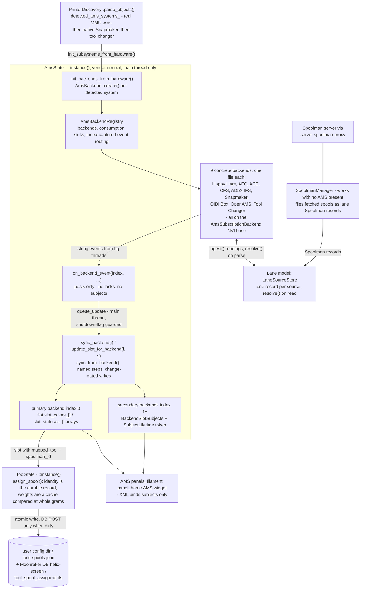

# 07 - Filament & AMS

Multi-filament support is one coordinator, many systems: `AmsState` (a `::instance()` singleton from chapter 05's census) owns a registry of `AmsBackend` objects, one concrete class per filament system, and never names a vendor. Backends subscribe to their own Moonraker objects and emit string events from background threads; `AmsState` marshals those to the main thread, reads backend state there, and writes change-gated LVGL subjects.

Two neighbors complete the picture. Spool *identity* (which Spoolman spool sits on which tool) lives one door down in `ToolState`, persisted by identity rather than weight, so it survives restarts and works on printers with no filament-changer hardware at all. Spoolman itself is a separate manager, not a backend. Under all of it sits the lane model: every reading about a lane is filed as a per-source record and resolved on read.

This chapter is the map: the contract, the event pipeline, the lane model and the persistence rules. Per-backend protocols, the filament-op dispatch ladder, endless spool, dryers and the add-a-backend recipe belong to [`../FILAMENT_MANAGEMENT.md`](../FILAMENT_MANAGEMENT.md) and the `FILAMENT_BACKEND_*.md` leaves. Chapter 02 owns the subject machinery and chapter 03 the threading contracts applied here.

```mermaid
flowchart TB
    PO["PrinterDiscovery::parse_objects()<br/>detected_ams_systems_ - real MMU wins,<br/>then native Snapmaker, then tool changer"]

    subgraph AMS["AmsState - ::instance(), vendor-neutral, main thread only"]
        INIT["init_backends_from_hardware()<br/>AmsBackend::create() per detected system"]
        REG["AmsBackendRegistry<br/>backends, consumption sinks, index-captured event routing"]
        EV["on_backend_event(index, ...)<br/>posts only - no locks, no subjects"]
        SYNC["sync_backend(i) / update_slot_for_backend(i, s)<br/>sync_from_backend(): named steps, change-gated writes"]
        B0["primary backend index 0<br/>flat slot_colors_[] / slot_statuses_[] arrays"]
        B1["secondary backends index 1+<br/>BackendSlotSubjects + SubjectLifetime token"]
    end

    CONC["9 concrete backends, one file each:<br/>Happy Hare, AFC, ACE, CFS, AD5X IFS, Snapmaker,<br/>QIDI Box, OpenAMS, Tool Changer<br/>- all on the AmsSubscriptionBackend NVI base"]

    LANE["Lane model: LaneSourceStore<br/>one record per source, resolve() on read"]

    TS["ToolState - ::instance()<br/>assign_spool(): identity is the durable record,<br/>weights are a cache compared at whole grams"]
    PERSIST[("user config dir / tool_spools.json<br/>+ Moonraker DB helix-screen /<br/>tool_spool_assignments")]

    SM["SpoolmanManager - works with no AMS present<br/>files fetched spools as lane Spoolman records"]
    SPOOL["Spoolman server via<br/>server.spoolman.proxy"]

    UI["AMS panels, filament panel, home AMS widget<br/>- XML binds subjects only"]

    PO -->|"init_subsystems_from_hardware()"| INIT
    INIT --> REG
    REG --> CONC
    CONC -->|"string events from bg threads"| EV
    CONC <-->|"ingest() readings, resolve() on parse"| LANE
    EV -->|"queue_update - main thread,<br/>shutdown-flag guarded"| SYNC
    SYNC --> B0
    SYNC --> B1
    B0 --> UI
    B1 --> UI
    B0 -->|"slot with mapped_tool + spoolman_id"| TS
    TS -->|"atomic write, DB POST only when dirty"| PERSIST
    SM -->|"Spoolman records"| LANE
    SPOOL --- SM
```

## Key files

| File | Role |
|------|------|
| [`include/ams_backend.h`](../../../include/ams_backend.h) | The `AmsBackend` contract: lifecycle, events, state queries, `BackendTraits`, capability virtuals, `create()` factories |
| [`include/ams_subscription_backend.h`](../../../include/ams_subscription_backend.h) | `AmsSubscriptionBackend`: the NVI base every real backend derives from - final entry points, `do_*` hooks, subscription ownership, the one-in-flight op claim, resync |
| [`include/ams_types.h`](../../../include/ams_types.h) | `AmsType` enum (9 systems + `NONE`): the only vendor taxonomy generic code sees |
| [`src/printer/ams_backend.cpp`](../../../src/printer/ams_backend.cpp) | `AmsBackend::create(AmsType, ...)`: the one switch mapping enum to class |
| [`include/ams_state.h`](../../../include/ams_state.h) | `AmsState` singleton: thread-safety note, `BackendSlotSubjects`, the fixed subject set |
| [`src/printer/ams_state.cpp`](../../../src/printer/ams_state.cpp) | Backend creation, event routing, `sync_from_backend()` and its steps, the ToolState spool bridge |
| `src/printer/ams_state_*.cpp` | The rest of `AmsState`, one file per concern: `subjects`, `tool_mapping`, `external_spool`, `dryer`, `clog`, `buffer` |
| [`include/ams_backend_registry.h`](../../../include/ams_backend_registry.h) | `AmsBackendRegistry`: the backend list, consumption sinks, and the queries safe off the main thread |
| [`include/ams_runout_grace.h`](../../../include/ams_runout_grace.h) | `RunoutGrace`: post-unload and per-slot windows during which an empty sensor is not a runout |
| [`include/ams_remap.h`](../../../include/ams_remap.h) | `can_remap()` / `remap_is_persistent()`: the remap questions generic code asks |
| [`include/tool_state.h`](../../../include/tool_state.h) | `ToolInfo`, spool-assignment API (`assign_spool`, save/load, `SubjectLifetime`) |
| [`src/printer/tool_state.cpp`](../../../src/printer/tool_state.cpp) | Identity-not-weight persistence, atomic JSON save, Moonraker DB round-trip |
| [`include/spoolman_manager.h`](../../../include/spoolman_manager.h) | `SpoolmanManager`: weight polling, circuit breaker, identity cache, lane filing - no AMS required |
| [`include/ams_error.h`](../../../include/ams_error.h) | `AmsError`/`AmsResult`: the immediate refusal-or-accepted answer every backend op returns |
| [`include/filament_op_dispatch.h`](../../../include/filament_op_dispatch.h) | The tier planner deciding which UI surface owns a filament operation |
| [`src/printer/printer_discovery_parse.cpp`](../../../src/printer/printer_discovery_parse.cpp) | `register_detected_ams_systems()`: the detection-priority ladder |
| [`include/ams_environment_zone.h`](../../../include/ams_environment_zone.h) | `EnvironmentZone`: the filament-box model every backend's environment hardware collapses into ([`../FILAMENT_ENVIRONMENT_ZONES.md`](../FILAMENT_ENVIRONMENT_ZONES.md)) |
| [`include/lane_observation.h`](../../../include/lane_observation.h) | `Observation` and `ObservationSource`: one reading from one source, every field optional |
| [`include/lane_sources.h`](../../../include/lane_sources.h) | `LaneSources`: one `Observation` slot per source, whole-record replacement on `apply()` |
| [`include/lane_resolver.h`](../../../include/lane_resolver.h) / [`src/printer/lane_resolver.cpp`](../../../src/printer/lane_resolver.cpp) | `ResolvedLane` and `resolve()`: the precedence table as code |
| [`include/lane_source_store.h`](../../../include/lane_source_store.h) | `LaneId` and the lane address space; `ingest()` and `commit_slot_edit()`, the two funnels into the store |
| [`include/lane_translation.h`](../../../include/lane_translation.h) / [`src/printer/lane_translation.cpp`](../../../src/printer/lane_translation.cpp) | Turning a human edit or a stored `lane_data` record into an `Observation`; the field roster and authorship rules |

## How it works

### The contract: interface, NVI base, nine concretes

`AmsBackend` ([`include/ams_backend.h`](../../../include/ams_backend.h)) is the vendor-neutral surface: `start()`/`stop()` lifecycle, a string-event system (`EVENT_STATE_CHANGED`, `EVENT_SLOT_CHANGED`, `EVENT_LOAD_COMPLETE`, ... starting at `include/ams_backend.h#EVENT_STATE_CHANGED`), state queries, filament operations, and capability questions. The constant ones are fields of one `BackendTraits` struct (`include/ams_backend.h#BackendTraits`): each backend declares a `constexpr kTraits` and the named predicates read it, so the mock's personas copy the real answers instead of restating them. The ones that depend on state stay virtuals (`manages_active_spool()`, `supports_per_tool_spool_assignment()`, `get_remap_strategy()`, ...). The static `sensor_belongs_to_backend()` dispatcher (`src/printer/ams_backend.cpp#sensor_belongs_to_backend`) keeps each backend's filament-sensor name patterns in its own file (#1054).

No real backend implements the interface directly: all nine derive from `AmsSubscriptionBackend` ([`include/ams_subscription_backend.h#AmsSubscriptionBackend`](../../../include/ams_subscription_backend.h)), a non-virtual-interface base that makes `start()`/`stop()` and the load/unload/select/change operations `final` and dispatches to `do_*` hooks. That base is where shared discipline lives: it owns the `SubscriptionGuard` for the backend's Moonraker subscription (`include/ams_subscription_backend.h#subscription_`) and runs the print-active gate *plus a test-and-set in-flight claim* in the public entry points, so no backend can skip the gate and two surfaces cannot start concurrent ops on the same backend.

| Backend | File | System |
|---------|------|--------|
| `AmsBackendHappyHare` | [`include/ams_backend_happy_hare.h`](../../../include/ams_backend_happy_hare.h) | Happy Hare MMU (mmu object, MMU_GATE_MAP) |
| `AmsBackendAfc` | [`include/ams_backend_afc.h`](../../../include/ams_backend_afc.h) | AFC-Klipper-Add-On (lanes, hubs, `lane_data`) |
| `AmsBackendAce` | [`include/ams_backend_ace.h`](../../../include/ams_backend_ace.h) | Anycubic ACE Pro (ValgACE/BunnyACE/DuckACE) |
| `AmsBackendCfs` | [`include/ams_backend_cfs.h`](../../../include/ams_backend_cfs.h) | Creality Filament System (K1 and K2 families) |
| `AmsBackendAd5xIfs` | [`include/ams_backend_ad5x_ifs.h`](../../../include/ams_backend_ad5x_ifs.h) | FlashForge AD5X Intelligent Filament Switching |
| `AmsBackendSnapmaker` | [`include/ams_backend_snapmaker.h`](../../../include/ams_backend_snapmaker.h) | Snapmaker U1 native SnapSwap |
| `AmsBackendQidi` | [`include/ams_backend_qidi.h`](../../../include/ams_backend_qidi.h) | QIDI Box (PLUS4/Q2/MAX4) |
| `AmsBackendOpenAms` | [`include/ams_backend_openams.h`](../../../include/ams_backend_openams.h) | klipper_openams through its `oams_manager` API |
| `AmsBackendToolChanger` | [`include/ams_backend_toolchanger.h`](../../../include/ams_backend_toolchanger.h) | viesturz/klipper-toolchanger, and multi-hotend printers with no filament system |

Each has a leaf doc (`FILAMENT_BACKEND_*.md`). The Snapmaker, Happy Hare and CFS backends parse each status frame into a struct of optionals before taking their lock, then apply it in named steps; [`../FILAMENT_MANAGEMENT.md`](../FILAMENT_MANAGEMENT.md) § "Status Frame Shape" has the pattern.

`AmsType` ([`include/ams_types.h#AmsType`](../../../include/ams_types.h)) enumerates them plus `NONE`. The single place an `AmsType` becomes a class is `AmsBackend::create(AmsType, api, client)` ([`src/printer/ams_backend.cpp#"std::unique_ptr<AmsBackend> AmsBackend::create(AmsType detected_type, IMoonrakerAPI* api,"`](../../../src/printer/ams_backend.cpp)); mock mode (`RuntimeConfig::should_mock_ams()`) short-circuits to `AmsBackendMock`. This is chapter 06's vendor rule working as dispatch: a tenth system means one new subclass plus one enum value, factory case and detection entry, with no edits to generic code.

Detection feeding that factory is a priority ladder, `PrinterDiscovery::register_detected_ams_systems()` ([`src/printer/printer_discovery_parse.cpp#register_detected_ams_systems`](../../../src/printer/printer_discovery_parse.cpp)): a real MMU (Happy Hare, AFC, AD5X IFS, CFS, ACE, QIDI Box, OpenAMS) always wins, then native Snapmaker hardware, then a tool changer or several hotends with nothing managing them. `init_subsystems_from_hardware()` ([`src/printer/printer_discovery.cpp#init_subsystems_from_hardware`](../../../src/printer/printer_discovery.cpp)) hands the snapshot to `AmsState::init_backend_from_hardware()`, whose `init_backends_from_hardware()` ([`src/printer/ams_state.cpp#init_backends_from_hardware`](../../../src/printer/ams_state.cpp)) skips mock mode, skips if backends already exist, creates and `start()`s one backend per detected system, then syncs immediately so the `ams_slot_count` gate lights up without waiting for the first async event.

Commands flow out through the same contract, asynchronously. UI surfaces call the NVI entry points (`load_filament(slot)`, `unload_filament(slot)`, `select_slot`, `change_tool`), which return an `AmsError` immediately (the refusal, not the outcome) while the real result arrives later as `EVENT_LOAD_COMPLETE` / `EVENT_UNLOAD_COMPLETE` / `EVENT_ERROR`. Which UI surface owns a given operation is tiered by [`include/filament_op_dispatch.h#helix::ui`](../../../include/filament_op_dispatch.h); that ladder is FILAMENT_MANAGEMENT.md § "Filament Op Dispatch". Cooldowns after load/unload/swap live in `PostOpCooldownManager` (chapter 05's census).

A few capability questions shape generic code directly:

| Capability question | True for | What generic code does with it |
|---------------------|----------|-------------------------------|
| `manages_active_spool()` | AFC, AD5X IFS (always); Happy Hare when its Spoolman mode is not OFF | Skip the direct `set_active_spool` push: the firmware calls Spoolman itself (#644) |
| `supports_per_tool_spool_assignment()` | Tool changers | Each tool owns its spool, so ToolState is the source of truth and the spool sync runs ToolState -> slot |
| `has_firmware_spool_persistence()` | Happy Hare (MMU_GATE_MAP SPOOLID), AFC (SET_SPOOL_ID) | Firmware remembers the spool id; for every other backend `AmsState` saves ToolState's assignments itself |
| `publish_external_spool_lane()` (overridden) | CFS, AD5X IFS, AFC, Happy Hare | On the bypass-engage edge and every external-spool identity change, publish the extern spool as the lane one past the last slot in the shared `lane_data` namespace (OrcaSlicer picks it up as an extra tray) |

The `any_bypass_active()` edge in `sync_from_backend()` is a notification bus, not an implementation site: it calls `FilamentSensorManager::on_bypass_active_changed()` (the sensor layer arms or restores RUNOUT-role sensors) and `publish_external_spool_lane()` on each backend. No backend implements the sensor policy, and the sensor manager never names a filament system; FILAMENT_MANAGEMENT.md § "Bypass companions" has the detail.

### Events in: queue first, write on the main thread

Backends emit events from background threads (their Moonraker subscriptions fire on libhv). `on_backend_event()` ([`src/printer/ams_state.cpp#on_backend_event`](../../../src/printer/ams_state.cpp)) touches neither a lock nor a subject: it only posts a `helix::ui::queue_update()` lambda whose body, already on the main thread, checks the shutdown flag, then calls `sync_backend(index)` (`src/printer/ams_state.cpp#sync_backend`) or `update_slot_for_backend(index, slot)` (`src/printer/ams_state.cpp#update_slot_for_backend`), and finally bumps `ams_data_revision` so code waiting for backend data can re-read.

`AmsState`'s own state is main-thread only and has no lock. Each method checks its thread: an off-main call aborts under strict UI checks (unit tests, `--test`) and otherwise logs and files an `ams_off_main` anomaly once. `get_backend()` hands out a raw pointer and is main-thread only too. The few queries background threads make (`backend_count()`, `primary_type()`, `any_filament_batch_in_flight()`, `is_filament_operation_active()`, the unload grace) answer from `AmsBackendRegistry` ([`include/ams_backend_registry.h#AmsBackendRegistry`](../../../include/ams_backend_registry.h)), `RunoutGrace` ([`include/ams_runout_grace.h#RunoutGrace`](../../../include/ams_runout_grace.h)) or an atomic, each with its own guard. The registry's mutex is held across calls into a backend, so the lock order is registry -> `AmsBackend::mutex_`.

Routing is by captured index: `add_backend()` stamps the backend's index and hands it to `AmsBackendRegistry::add()` ([`src/printer/ams_backend_registry.cpp#add`](../../../src/printer/ams_backend_registry.cpp)), which registers an event lambda closing over that index, so events from concurrent systems cannot cross wires.

Event coarsening is deliberate: `STATE_CHANGED`, op completions, errors and attention trigger a full backend sync; `SLOT_CHANGED` parses a slot index for a one-slot update and falls back to a full sync when it cannot, so a backend that forgets the index still refreshes the UI (`src/printer/ams_state.cpp#"else if (event == AmsBackend::EVENT_SLOT_CHANGED) {"`).

`sync_from_backend()` ([`src/printer/ams_state.cpp#sync_from_backend`](../../../src/printer/ams_state.cpp)) runs as named steps in a fixed order (`sync_system_subjects`, `sync_tool_topology`, `sync_filament_runout`, `sync_bypass`, `sync_tool_routing`, `sync_tool_spools`, `sync_unit_environment`, ...); the step declarations in `ams_state.h` document the order. Subject storage is two-shaped:

- **Backend 0** writes the flat arrays every single-backend XML binding knows (`slot_colors_[i]`, `slot_statuses_[i]`, `slot_fills_[i]`, plus string and live-state families), per-slot change-gated in `write_slot_subjects()` (`src/printer/ams_state.cpp#write_slot_subjects`).
- **Backends at index 1+** get a `BackendSlotSubjects` struct ([`include/ams_state.h#AmsState`](../../../include/ams_state.h)) allocated at `add_backend()` time: dynamic `colors`/`statuses`/`fills`/`lane_states`/`has_errors`/`severities`/`materials` vectors sized to the backend's slot count. `clear_backends()` destroys them, on rediscovery and inside `deinit_subjects()`, flipping the struct's own `SubjectLifetime` token first (`src/printer/ams_state_subjects.cpp#"void AmsState::BackendSlotSubjects::deinit() {"`).

Every per-slot accessor with a `SubjectLifetime&` out-param hands out a live token for the subject it returns (#1700). Backend 0 and the single-slot overloads return `get_subjects_lifetime()` (`include/ams_state.h#get_subjects_lifetime`), which `deinit_subjects()` flips; a secondary backend returns its `BackendSlotSubjects` token, which `clear_backends()` flips; a nullptr return comes with an empty token. Everything else registered with `subjects_` (per-unit subjects, the rest of the fixed set) dies in `deinit_subjects()`, so its long-lived observers pass `get_subjects_lifetime()` directly: `PrintStatusPanel` watching `get_current_color_subject()` and `get_tool_map_version_subject()` to recolor the gcode preview is the usual case.

Writes are change-gated: every value is compared before `lv_subject_set_*` fires, and a material-name delta additionally bumps `slots_version_`, because container-level consumers re-read material through `refresh_slots()` (#1065). The fixed set (about a hundred members, capped at `MAX_SLOTS = 16` and `MAX_UNITS = 16`) splits into families:

| Family | Members (subject names) | Consumed by |
|--------|--------------------------|-------------|
| System identity | `ams_type`, `ams_system_name`, `ams_system_logo`, `ams_slot_count`, `ams_is_tool_changer`, `ams_is_filament_system` | Home AMS widget gate, AMS panel header |
| Backend selector | `backend_count`, `active_backend`, `ams_data_revision` | Multi-system selector UI, data-wait code |
| Per-slot state (x16) | `ams_slot_<n>_*`: color, status, fill, remaining, material, lane state, toolhead-present, active-loaded | Slot cards, `ams_slot` widget, filament-path canvas |
| Current line | `current_slot`, `ams_current_tool`, `ams_filament_loaded`, `ams_filament_runout`, `current_color` | Filament panel, runout dialog |
| Operation progress | `ams_action`, `ams_action_detail`, `ams_operation_phase`, `toolchange_step` | Step bar, action prompts |
| Toolchange narration | `toolchange_visible`, `ams_current_toolchange`, `ams_number_of_toolchanges`, `toolchange_text` | Print-status toolchange banner |
| Path canvas feed | `path_topology`, `path_filament_segment` | Filament-path canvas ([`../FILAMENT_PATH_CANVAS.md`](../FILAMENT_PATH_CANVAS.md)) |
| Dryer / environment | `dryer_*`, per-unit `ams_unit_<i>_*` and `ams_env_ind_<i>_*` | AMS unit card badges, environment detail overlay |
| Buffer / clog | `buffer_*`, `clog_meter_*` | Filament Buffer widget and modal, clog bar |
| Endless spool | `ams_endless_state`, `ams_endless_text` | Endless-spool status line |

The AMS panel itself is nothing but bindings over those subjects:

One end-to-end sequence ties the pieces together. The user taps a slot; a dispatch surface lands on a backend op. The NVI entry point, say `change_tool(n)`, passes the print-active gate, claims the in-flight slot, and calls the backend's `do_change_tool`, which sends G-code through the API (chapter 04). The firmware acts; the backend's subscription fires on libhv, and the backend emits `EVENT_TOOL_CHANGED`. `on_backend_event()` posts; the queued body runs `sync_backend(0)` on the main thread, change-gating every subject write, bumping `ams_data_revision`, and, if the tool-to-slot mapping moved, `tool_map_version` so the gcode preview recolors. No panel code ran; the subjects did the work.

### Which head prints tool N: attachment is not routing

Two questions look like one and are not. **Attachment** is which slot physically holds which spool (`AmsSystemInfo::tool_to_slot_map`), read by the Load/Unload slot resolver and the persisted tool-map ledger. **Routing** is which head will actually print logical tool `N` for the current print (`AmsBackend::get_tool_mapping()`).

On most backends they are the same vector: a filament system routes whichever lane it selects to its one nozzle. On a tool changer they come apart. A Snapmaker U1 has four permanently-attached spools (attachment is trivially identity) while the firmware routes logical tools onto heads through its own table. Anything asking "what color is tool N" must ask the routing question through `get_tool_mapping()`; reading the attachment map instead answers confidently and wrongly on the U1, rendering a 2-color print with its colors swapped. `AmsState::routed_tool_colors()` is the one consumer and `FilamentMapper::routed_tool_colors()` the one place the color math lives. A backend with no routing of its own returns an empty vector, which callers read as "no opinion", never as identity ([`../FILAMENT_BACKEND_SNAPMAKER_U1.md`](../FILAMENT_BACKEND_SNAPMAKER_U1.md) explains why that matters).

Whether the user can *change* the routing is three separate questions, each with one spelling in [`include/ams_remap.h`](../../../include/ams_remap.h):

| Question | Ask | Backend declares |
|---|---|---|
| Can the user's tool->lane pick be carried out at all, right now? | `helix::printer::can_remap(backend)` | `get_remap_strategy()` + `remap_ready()` |
| Does the route write a table that outlives the send? | `helix::printer::remap_is_persistent(strategy)` | (derived from the strategy) |
| Does this backend own a tool->slot table for `ToolState` to adopt? | `backend.owns_tool_mapping_table()` | that virtual |

`remap_ready()` is the one to understand: a backend can be built to remap and not be able to yet. AD5X IFS declares `RemapStrategy::Native` unconditionally, but until the `_IFS_VARS` macro is discovered, `set_tool_mapping()` writes local state the firmware replays nothing from. The U1 shows why the third question is separate: it carries out every pick through its pre-print `SET_PRINT_EXTRUDER_MAP` send and owns no tool->slot table, so `build_ams_topology()` asks about the table, never about remap capability. `requires_preprint_send()` stays out of all three: it is a print-start sequencing question. A new firmware declares `get_remap_strategy()`, adds `remap_ready()` only if discovery gates it, and `owns_tool_mapping_table()` only if it owns a table; [`tests/unit/test_remap_strategy.cpp`](../../../tests/unit/test_remap_strategy.cpp) pins every backend's answers.

### The overview draws one model: units, hub, buffer, toolhead

Every multi-filament overview is one or more chains `units -> hub -> buffer -> toolhead`. A hub joins the paths of every unit sharing a non-empty `AmsUnit::hub_id` (an OpenAMS lane); a unit without one is its own hub. Buffer and hub are 1:1, and a buffer box is what `ams_detail_buffer_box(info, unit)` gives the hub's first unit, so overview and unit view agree. `ams_draw::compute_system_tool_layout()` (`src/ui/ams_drawing_utils.cpp`) derives `hub_groups`; `src/ui/ui_system_path_plan.cpp` plans one hub box per group for several toolheads and one combiner for a single toolhead. Toolhead badges name the extruder, never a filament group.

### Spool assignment: identity is durable, weight is cache

Which spool is mounted where is *not* AMS state. `sync_tool_spools()` ([`src/printer/ams_state.cpp#sync_tool_spools`](../../../src/printer/ams_state.cpp)) bridges every slot with a `mapped_tool`: a slot with `spoolman_id > 0` calls `ToolState::assign_spool()`. A slot that lost its spool calls `clear_spool()` only when the lane owns the assignment, that is when the backend answers `supports_per_tool_spool_assignment()` false; on a tool changer the sync runs the other way, populating empty slots from ToolState so assignments loaded at startup reach the slot UI. Saving is a separate question: when the backend lacks `has_firmware_spool_persistence()`, nothing else will remember the assignment, so `AmsState` saves ToolState's dirty assignments itself. The one-slot path (`update_slot()`, `src/printer/ams_state.cpp#update_slot`) assigns and saves under the same rule, without the clear or reverse branches.

`ToolState::assign_spool()` (`src/printer/tool_state.cpp#assign_spool`) splits the record in two. Identity (spool id + name) is the durable half: a change sets `spool_dirty_` and logs at info. Weights are a cache: firmware reports them as continuous floats, and an exact compare rewrote the JSON, POSTed to the DB and rebuilt panels on every report (`src/printer/tool_state.cpp#"L53W5PKG meant 590 rewrites of tool_spools.json,"`). `same_displayed_weight()` (`src/printer/tool_state.cpp#same_displayed_weight`) compares at whole grams against the last *stored* value, so a slow slide fires once per gram, and a weight-only change bumps `tools_version_` for UI refresh while never marking the record dirty.

Persistence (`save_spool_assignments()`, `src/printer/tool_state.cpp#save_spool_assignments`) writes local JSON first (atomic tmp-file-plus-rename, after resolving the installer's symlink so the first save does not replace the link with a file, `src/printer/tool_state.cpp#save_spool_json`), then fire-and-forgets a DB POST to namespace `helix-screen`, key `tool_spool_assignments`. Loading prefers the DB and falls back to the local file, seeding the DB on the way; both callback arms marshal through `AsyncLifetimeGuard::bg_cb` (#1165) and re-sync `AmsState` (`src/printer/tool_state.cpp#load_spool_assignments`). The file is `<user-config-dir>/tool_spools.json`, holding one assignment set per printer under `printers.<printer id>`, so a printer whose DB is empty never loads another printer's spools; a file without `printers` is the single-printer layout, adopted by the first printer that loads it.

### Lane identity by source: one record per observer, resolved on read

The lane model carries *where* each of a lane's values came from instead of re-deriving it from the values. Every backend files its readings into it, the edit path files a person's declarations into it, and every backend's parse ends by reading back out of it, so the precedence argument is settled in one place.

`Observation` ([`include/lane_observation.h#"struct Observation"`](../../../include/lane_observation.h)) is one reading from one source. Every field is a `std::optional`, so "this source said nothing about the material" and "this source reports the material as blank" are different states, which no sentinel check can tell apart. The only constructor is `explicit Observation(ObservationSource)`. Whether a frame is the echo of HelixScreen's own write is answered per backend family (`AmsBackend::own_write_expectation`, `SlotFingerprintTracker::expect_any_of`, `helix::ams::OwnWriteEchoes` in `include/lane_echo.h#OwnWriteEchoes`), not by a field.

`ObservationSource` ([`include/lane_observation.h#ObservationSource`](../../../include/lane_observation.h)) has six values. `Sensed` is real hardware, which reports presence and motion and never a spool identity. The other five carry identity or a measurement: `Spoolman`, `LocalUser` (a human editing in HelixScreen), `VendorCache` (firmware-persisted metadata on the current frame), `Metered` (the consumption meter) and `Remembered` (our own stored record from before this session). `Remembered` is the weakest identity rung: a backend replaces its `VendorCache` record whole on every parse, so a stored value filed there would be erased by the first frame that is silent about it; filed one rung down, it stands exactly where firmware says nothing.

`LaneSources` ([`include/lane_sources.h#"struct LaneSources {"`](../../../include/lane_sources.h)) holds one optional `Observation` per source. `apply()` replaces that source's record whole, so a field a source stops reporting stops contributing and no two writers share a destination; `drop()` discards one source's record. `resolve()` ([`src/printer/lane_resolver.cpp#resolve`](../../../src/printer/lane_resolver.cpp)) folds the sources into a `ResolvedLane`, the values a surface paints. It is pure, and its result is never stored back. Within each ladder a source that did not observe a field leaves the weaker source's value standing:

| Fields | Ranked weakest to strongest | Why that order |
|--------|-----------------------------|----------------|
| `present` | `Sensed`, and nothing else | Identity is never evidence of presence: a vendor cache remembering the last spool would resurrect an emptied lane. No sensed reading resolves to not present |
| Identity: material, brand, spool name, catalog id, Spoolman ids, product name | `Remembered`, `VendorCache`, `LocalUser`, `Spoolman` | A linked spool's own record is the most specific statement about what is on the lane |
| Colour: `color_rgb` with `color_name` | `Remembered`, `VendorCache`, `Spoolman`, `LocalUser` | The one exception: the spool record says what the vendor sells, the user's pick says what is loaded right now. The name travels with the value |
| Weight: remaining, total | `LocalUser`, `Metered`, `Spoolman` | Spoolman owns consumption for a spool assigned from it; an unlinked lane has only the meter |

**Two funnels, and a private writer behind them.** `ingest()` ([`include/lane_source_store.h#ingest`](../../../include/lane_source_store.h)) is the one way a machine reading reaches the store, and it replaces that source's record whole, so a guard that withholds a field *retracts* the reading. `commit_slot_edit()` (`include/lane_source_store.h#commit_slot_edit`) is the one way a human edit does, and it amends the user's record field by field; it is called from `AmsBackend::commit_user_edit` (`src/printer/ams_backend.cpp#commit_user_edit`) once the backend has accepted the edit. Each refuses the other's source. `LaneSourceStore::write()` (`include/lane_source_store.h#LaneSourceStore/write`) is private with exactly those two friends, and [`tests/shell/test_code_lint.bats`](../../../tests/shell/test_code_lint.bats) fails the build on a third friend, a loosened access specifier, or a `LaneSourceStore::instance()` outside the funnels' own file.

**Authorship.** A persisted record carries a declared set, `DeclaredFields` ([`include/filament_slot_override.h#"class DeclaredFields {"`](../../../include/filament_slot_override.h)), naming the fields its user stated: one bit per row of `FIELD_ROSTER` ([`src/printer/lane_translation.cpp#"constexpr auto FIELD_ROSTER"`](../../../src/printer/lane_translation.cpp)), the one list both translations walk, keyed on the wire by field name (`helix_declared`). The rules that keep it honest all live in `lane_translation.cpp`:

- A record declares what an edit *moved*, not what it carried: `user_edit_observation()` ([`src/printer/lane_translation.cpp#user_edit_observation`](../../../src/printer/lane_translation.cpp)) compares the two snapshots, so firmware-sourced values seeded into the editor are not claimed (#965). On a Spoolman-linked lane the spool's own identity is never the person's to move (`keep_spool_owned_identity()`).
- Authorship accumulates: `amend_authorship()` merges this edit's declarations onto the record's, and a prior declaration survives only while the value it stood over does.
- A deliberate clear is a declaration for the fields the set covers, and survives a restart through `sources_from_record()`. The `helix_locked_color` / `helix_locked_material` keys are written from their two bits for readers that predate the set; `declared_fields_on_load()` reads them only on an unlinked record, beside a value.
- Where firmware keeps colour and material itself (`firmware_stores_color_and_material()`, earned per machine by the tool changer with Z-Mod's material source), `commit_user_edit` strips them from the declaration; the write still goes to firmware, whose echo files it as `VendorCache`.

How a stored record is split into sources on load is [`../FILAMENT_SLOT_METADATA.md`](../FILAMENT_SLOT_METADATA.md) § "Merge policy".

**A lane id is a block, not a slot index.** `lane_id_for(backend_index, slot)` (`include/lane_source_store.h#lane_id_for`) gives each registered backend its own block of `LANES_PER_BACKEND` ids, with the bypass (`BYPASS_LANE_ID`) and the direct-drive tools in reserved blocks above, so coexisting backends cannot file onto one another's lanes. `AmsBackend::lane_id()` is the accessor every producer uses, and it answers `INVALID_LANE_ID` until `AmsState::add_backend` has stamped the index. A pair naming no lane is dropped by both funnels with a warning latched per funnel per lane.

**What each producer's firmware states.** Every backend builds its records from the values its parse just read, never from the `SlotInfo` `apply_resolved_lane()` has already rewritten, or a person's choice would be filed as something the machine reported:

| Backend | `Sensed` presence from | `VendorCache` identity | Other |
|---------|------------------------|------------------------|-------|
| AFC | `prep` / `load` / `tool_loaded`, when a frame carries one | `color_rgb`, `material`, `spool_name`, `brand`, `spoolman_id` | `Metered`: remaining and total weight |
| Happy Hare | `gate_status`, when the gate is not "unknown" | `color_rgb`, `material`, `spool_name`, `spoolman_id` | |
| CFS | the bay's parsed status | `color_rgb`, `material`, `brand`, `product_name`, `spoolman_id` | |
| Snapmaker | `filament_detect.state` | `color_rgb`, `material`, `brand`, `product_name`, `total_weight_g` | |
| QIDI Box | the slot state word, once every writer of status has run | `color_rgb`, `material`, `brand` | |
| ACE | the hub's occupancy status, when the frame states one | `color_rgb`, `material` | |
| AD5X IFS | port presence, once a port sensor has spoken | `color_rgb`, `material` | |
| Tool changer | the dock, plus the carriage tool | none | |
| Mock | the simulated slot status | `color_rgb`, `material` | |

OpenAMS reports no identity at all and files nothing from its parse: its lanes are what the stored record, edits and Spoolman say ([`../FILAMENT_BACKEND_OPENAMS.md`](../FILAMENT_BACKEND_OPENAMS.md)). One consequence to read straight off the table: on an ACE or an AD5X, brand and spool name have no firmware source, so a value there came from an edit, Spoolman or another tool writing the shared record. `catalog_id`, `color_name` and `spoolman_vendor_id` are filed by no backend.

**Resync and the read path.** `AmsSubscriptionBackend::request_resync()` ([`src/printer/ams_subscription_backend.cpp#request_resync`](../../../src/printer/ams_subscription_backend.cpp)) re-reads the store a backend names in `lane_record_store()` and files what classifies as `Remembered`, but only where `firmware_publishes_lane_identity()` (`include/ams_subscription_backend.h#firmware_publishes_lane_identity`, default true) is false, which today means the tool changer and OpenAMS: a lane whose firmware states its own identity would have the re-read retracted by the next frame. Every backend's parse ends by laying the resolved identity, presence and weights onto its `SlotInfo` (`include/ams_backend.h#AmsBackend/apply_resolved_lane`), so what a user sees is what `resolve()` ranked. [`tests/unit/test_lane_resolver.cpp`](../../../tests/unit/test_lane_resolver.cpp) pins the ladders and [`tests/unit/test_lane_backend_observations.cpp`](../../../tests/unit/test_lane_backend_observations.cpp) what each producer files. Open questions are prestonbrown/helixscreen#1632.

### Spoolman without AMS

Spoolman integration is deliberately *not* a backend. `SpoolmanManager` ([`include/spoolman_manager.h#SpoolmanManager`](../../../include/spoolman_manager.h), [`src/printer/spoolman_manager.cpp`](../../../src/printer/spoolman_manager.cpp)) gives printers with no filament-changer hardware spool tracking too. Its charter, from the header:

- periodic weight polling via `lv_timer`, with refcounted start/stop;
- a circuit breaker that suppresses error toasts while Spoolman is unreachable;
- a Spoolman availability observer that auto-stops polling when the service disappears;
- a transient identity cache (with negative caching for deleted spools) feeding the filament display-name resolver;
- each fetched spool record, filed as its lane's `Spoolman` record through `ingest()` (`SpoolmanManager::file_spool_on_lane`), so an edit made on the Spoolman server reaches the lane. A "not found" answer drops that record; an unreachable server leaves it standing.

Its weight refresh ([`src/printer/spoolman_manager.cpp#refresh_spoolman_weights`](../../../src/printer/spoolman_manager.cpp)) files through the same path, and nothing is written back to a slot: a slot write would restate identity to firmware, the firmware would report it back, and the poll would loop. The external (bypass) spool is a lane too: its Spoolman record, meter and edits file on `BYPASS_LANE_ID`, and `AmsState::get_external_spool_info()` folds `resolve(BYPASS_LANE_ID)` over the stored binding for every reader. All Spoolman RPC goes through `server.spoolman.proxy` via the `MoonrakerSpoolmanAPI` sub-API (chapter 04); the spool browser/wizard UI ([`src/ui/ui_panel_spoolman.cpp`](../../../src/ui/ui_panel_spoolman.cpp), [`src/ui/ui_spool_wizard.cpp`](../../../src/ui/ui_spool_wizard.cpp)) talks to that API, not to `AmsState`.

Pushing "active spool" to Spoolman happens only for the loaded lane, and only when the backend does not answer `manages_active_spool()` ([`src/printer/ams_state.cpp#"if (api_ && slot_info.spoolman_id > 0 &&"`](../../../src/printer/ams_state.cpp)). AFC, for instance, updates Spoolman itself when HelixScreen sends its native spool command; calling Spoolman directly would update the widget while bypassing the firmware's own state (#644).

For debugging, every class here logs under a stable tag: `[AMS State]` for the coordinator, `[ToolState]` for assignments, `[SpoolmanAPI]` for Spoolman RPC, and one tag per backend from `backend_log_tag()` (e.g. `[AMS AFC]`, `[AMS HappyHare]`). A `-vv` run shows the whole pipeline: creation, events, queued syncs and spool saves each leave a line.

## Patterns & gotchas

- **Never name a filament system outside its backend file.** Generic code sees `AmsBackend*` and `AmsType`. If a feature would need `if (type == AmsType::AFC)`, the answer is a capability question (a `BackendTraits` field or a virtual); that is chapter 06's one-file test.
- **A lane record enters through one of two funnels, and a producer's record is replaced whole.** `helix::ams::ingest()` for a machine reading, `helix::ams::commit_slot_edit()` for a human edit. Build the record from the values the parse just read, never from a `SlotInfo` `apply_resolved_lane()` has rewritten. Leaving a field out of an `ingest()` retracts it; it does not leave the last reading standing.
- **Observing any per-slot subject requires the lifetime token.** Use the `SubjectLifetime`-taking accessor overloads; the plain overloads are for one-frame reads on the main thread.
- **Do not write subjects from backend-event context.** The event path queues before touching anything; the queued body is where subjects are written. A shortcut around `queue_update` reintroduces the bg-thread LVGL crash family (chapter 03).
- **Do not call `AmsState` off the main thread** except for the documented registry and `RunoutGrace` queries. Tests and `--test` abort on it; a release build files an `ams_off_main` anomaly.
- **Don't "fix" the gram threshold.** Weights are re-fetched on connect, so persisting them buys nothing. Compare via `same_displayed_weight()` or not at all.
- **Save and load are deliberately asymmetric.** Save writes the local JSON first and fire-and-forgets the DB POST; load prefers the DB and falls back to the file, seeding the DB (`src/printer/tool_state.cpp#save_spool_assignments_if_dirty`). The file is the recovery path, not the primary.
- **`tools_version_` (ToolState) and `slots_version_` (AmsState) are different clocks.** The first bumps on tool/spool data changes (including weight-only); the second on slot card data. Binding a rebuild to the wrong one yields twitchy or stale UI.
- **Clearing a spool assignment is a question of OWNERSHIP.** The gate is `supports_per_tool_spool_assignment()`, not `has_firmware_spool_persistence()`: CFS and AD5X IFS answer no to firmware persistence while keeping identity in our own `lane_data` store, and gating the clear on it would refill a lane the user cleared from ToolState on the next poll.
- **Slot and unit subjects are capped**: `MAX_SLOTS = 16`, `MAX_UNITS = 16` ([`include/ams_state.h#MAX_SLOTS`](../../../include/ams_state.h), `include/ams_state.h#MAX_UNITS`, taken from `AMS_MAX_UNITS` in `include/ams_types.h`, which also bounds the path canvas). Units past the cap bind to always-off placeholder subjects; extend the constants consciously.
- **`AmsState` init is discovery-driven and idempotent.** `init_backends_from_hardware()` self-guards against double init and mock mode; don't add a second construction path or hand-register backends. Mock AMS (`--test`) is `AmsBackendMock`, driven by `RuntimeConfig::should_mock_ams()`.
- **Backend ops go through the NVI entry points, never `do_*` directly.** The entry point enforces the print-active gate and the one-in-flight claim; calling a `do_*` hook bypasses both.
- **Event names are plain strings, so a typo compiles.** `EVENT_*` are `constexpr const char*` and `on_backend_event()` is an if/else chain; a misspelled name falls through every branch with nothing but the entry trace log.
- **`clear_backends()` is a wider reset than it looks.** `AmsBackendRegistry::clear()` ([`src/printer/ams_backend_registry.cpp#clear`](../../../src/printer/ams_backend_registry.cpp)) unregisters the per-slot `FilamentConsumptionTracker` sinks before unlinking and stopping backends (they flush on the way out and read their backend to do it); `AmsState` then returns every backend subject to its default, closing the home widget gates, and drops ToolState's AMS topology (`src/printer/tool_state.cpp#clear_ams_topology`).
- **Some XML subject names are not the member names.** Member `filament_loaded_` binds as `ams_filament_loaded` ([`src/printer/ams_state_subjects.cpp#init_subjects`](../../../src/printer/ams_state_subjects.cpp)). When a binding reports "No subject was found", check the registration call, not the header.

## Going deeper

- [`../FILAMENT_MANAGEMENT.md`](../FILAMENT_MANAGEMENT.md) - everything this chapter defers: status-frame parsing, the filament-op dispatch ladder, endless spool, dryers, error channels, `lane_data` persistence, UI panels, mock modes, adding a backend.
- `../FILAMENT_BACKEND_*.md` - one leaf per backend: protocol, data sources, G-code, topology, capability table.
- [`../FILAMENT_ENVIRONMENT_ZONES.md`](../FILAMENT_ENVIRONMENT_ZONES.md) - filament boxes: how per-backend environment hardware becomes one `EnvironmentZone`, and the tabs-or-list rule.
- [`../FILAMENT_SLOT_METADATA.md`](../FILAMENT_SLOT_METADATA.md) + [`../../specs/filament_slots.md`](../../specs/filament_slots.md) - the slot metadata store, how a stored record splits into lane sources, and the public `lane_data` wire format.
- [`../TOOL_ABSTRACTION.md`](../TOOL_ABSTRACTION.md) - the ToolState deep dive: `ToolInfo`, `DetectState`, tool discovery, backend_index/backend_slot mapping.
- [`06-discovery-capabilities.md`](06-discovery-capabilities.md) - the detection half, and how the AMS home widget gates on `ams_slot_count`.
- [`03-threading-lifetime.md`](03-threading-lifetime.md) - `queue_update`, `SubjectLifetime`, `AsyncLifetimeGuard`.
- [`05-printer-state.md`](05-printer-state.md) - where ToolState sits in the singleton map, and the `tool_count != extruder_count` topology override.
- [`../printer-research/CREALITY_CFS_K1_INTERNALS.md`](../printer-research/CREALITY_CFS_K1_INTERNALS.md) - a full reverse-engineering reference for one backend (CFS on K1).
- [`../printer-research/CREALITY_CFS_K2_INTERNALS.md`](../printer-research/CREALITY_CFS_K2_INTERNALS.md) - the K2 CFS protocol reference.

## Guided code tour

Read in this order; about 30 minutes total.

1. [`include/ams_types.h#AmsType`](../../../include/ams_types.h) - the `AmsType` enum: ten values, the entire vendor taxonomy generic code may see.
2. [`include/ams_backend.h`](../../../include/ams_backend.h) - the event constants at `include/ams_backend.h#EVENT_STATE_CHANGED`, the constant capabilities in `include/ams_backend.h#BackendTraits`, the virtual `manages_active_spool()` at `include/ams_backend.h#manages_active_spool`, and the factories from `create()` (`include/ams_backend.h#"static std::unique_ptr<AmsBackend> create(AmsType detected_type"`) through `create_mock()` (`include/ams_backend.h#create_mock`).
3. [`include/ams_subscription_backend.h#AmsSubscriptionBackend`](../../../include/ams_subscription_backend.h) - the NVI base: the must-override/may-override contract, then the filament-op entry points, whose comment (`include/ams_subscription_backend.h#"The gate is a CLAIM, not a test:"`) explains the in-flight claim.
4. [`include/ams_backend_afc.h#AmsBackendAfc`](../../../include/ams_backend_afc.h) - one real backend: its section layout as the shape all nine share; `manages_active_spool()` at `include/ams_backend_afc.h#manages_active_spool` and its constant answers in `include/ams_backend_afc.h#"static constexpr BackendTraits kTraits"`.
5. [`src/printer/printer_discovery_parse.cpp#register_detected_ams_systems`](../../../src/printer/printer_discovery_parse.cpp) - the detection ladder; then [`src/printer/printer_discovery.cpp#init_subsystems_from_hardware`](../../../src/printer/printer_discovery.cpp), where discovery hands off to AmsState.
6. [`src/printer/ams_state.cpp#init_backends_from_hardware`](../../../src/printer/ams_state.cpp) - mock skip, double-init guard, the create-start loop, the immediate sync.
7. [`src/printer/ams_state.cpp#add_backend`](../../../src/printer/ams_state.cpp) - `add_backend()`: registration in [`src/printer/ams_backend_registry.cpp#add`](../../../src/printer/ams_backend_registry.cpp) (the captured-index event lambda, one consumption sink per slot), then secondary-subject allocation (`src/printer/ams_state.cpp#"BackendSlotSubjects subs;"`).
8. [`src/printer/ams_state.cpp#on_backend_event`](../../../src/printer/ams_state.cpp) - queue-only body, shutdown guard, the SLOT_CHANGED parse-or-full-sync fallback; follow one queued call into `sync_backend()` (`src/printer/ams_state.cpp#sync_backend`).
9. [`include/ams_state.h#AmsState`](../../../include/ams_state.h) - the thread-safety note in the class comment, `BackendSlotSubjects` and its lifetime-token comment, then the storage members `registry_` (`include/ams_state.h#registry_`), `runout_grace_` (`include/ams_state.h#runout_grace_`) and `secondary_slot_subjects_` (`include/ams_state.h#secondary_slot_subjects_`).
10. [`src/printer/ams_state.cpp#sync_from_backend`](../../../src/printer/ams_state.cpp) - the named steps in order; then `sync_tool_spools()` (`src/printer/ams_state.cpp#sync_tool_spools`) for the ToolState bridge: forward assign, the ownership-gated clear, the reverse sync, the persistence-gated save.
11. [`src/printer/tool_state.cpp#same_displayed_weight`](../../../src/printer/tool_state.cpp) - the whole-gram compare; then `assign_spool()` (`src/printer/tool_state.cpp#assign_spool`), `save_spool_json` (`src/printer/tool_state.cpp#save_spool_json`) and `save_spool_assignments` (`src/printer/tool_state.cpp#save_spool_assignments`).
12. [`src/printer/spoolman_manager.cpp#refresh_spoolman_weights`](../../../src/printer/spoolman_manager.cpp) - the re-fetch loop that files each spool as its lane's `Spoolman` record; then [`include/spoolman_manager.h#SpoolmanManager`](../../../include/spoolman_manager.h) for the charter.
13. [`include/ams_state.h#get_subjects_lifetime`](../../../include/ams_state.h) - the two-scope lifetime doc with its PrintStatusPanel example: the best single comment on when observers need a token.
14. [`include/lane_source_store.h#ingest`](../../../include/lane_source_store.h) - the lane model's entrance: the two funnels, the blocked address space, and the friend list guarding `LaneSourceStore::write` (`include/lane_source_store.h#LaneSourceStore/write`). Then the widest producer, [`src/printer/ams_backend_afc.cpp#parse_afc_stepper`](../../../src/printer/ams_backend_afc.cpp), and the narrowest, `src/printer/ams_backend_toolchanger.cpp#refresh_slot_statuses_locked`, which files presence and nothing else.
