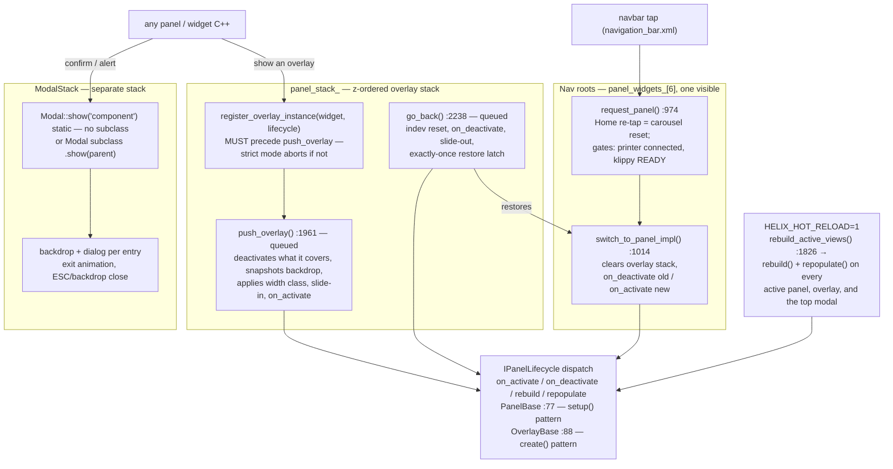
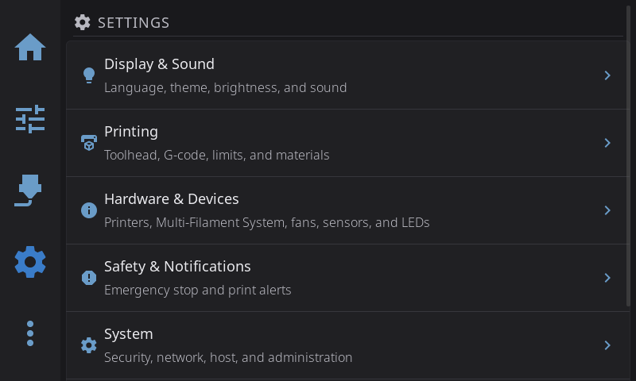
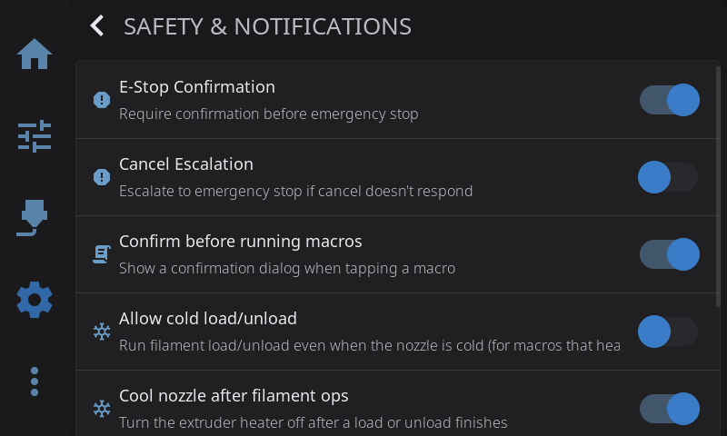
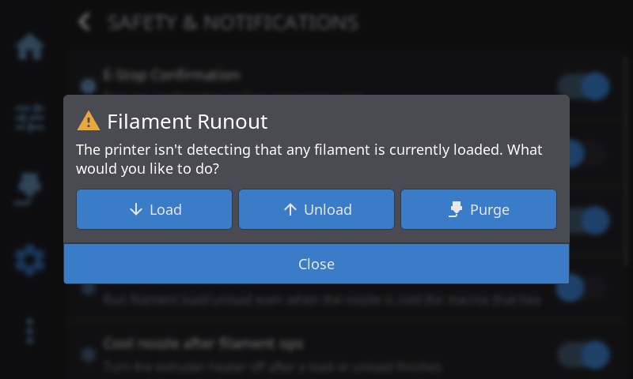

# 08 — Panels, overlays, modals & navigation

Every screen in HelixScreen is one of three surfaces. Six root panels (`helix::PanelId`) sit in the app layout behind the navbar, exactly one visible; overlays are (near-)full-screen layers pushed onto a z-ordered stack that `NavigationManager` — a `::instance()` singleton from chapter 05's census — owns; modals are dialogs on a completely separate stack (`ModalStack`) with their own backdrops. A C++ class (`PanelBase` / `OverlayBase` / `Modal` subclass) owns data and lifecycle, XML owns appearance, and `NavigationManager` dispatches `on_activate()` / `on_deactivate()` at every transition. The one rule with teeth: `on_deactivate()` is the teardown — a dismissed overlay's `cleanup()` does not run until shutdown (#943).

How many of each (recounted 2026-08-20, method included so you can re-run it):

| Surface | Count | Method |
|---------|-------|--------|
| Nav-root panels | 6 | `helix::PanelId` ([`include/ui_nav_manager.h:34`](../../../include/ui_nav_manager.h#L34)) — matches the six panel children of [`ui_xml/app_layout.xml:18`](../../../ui_xml/app_layout.xml#L18)-28 |
| `PanelBase` subclasses | 14 | `rg -l '^class \w+ : public PanelBase' include src -g '*.h'` minus the base header — 6 roots + 8 pushed as overlays or dev-only (AMS, AMS Overview, notification history, power, plus test/glyphs/gcode-test/step-test) |
| `OverlayBase` subclasses | 59 | `rg -l '^class \w+ : public OverlayBase' include src -g '*.h'` |
| `Modal` subclasses | 30 | `rg 'class \w+ : public Modal \{' include src -g '*.{h,cpp}'` minus the doc comment in [`include/ui_modal.h`](../../../include/ui_modal.h) |
| XML overlay/modal/panel files | 45 / 41 / 38 | `ls ui_xml | grep -c overlay` (and `modal`, `_panel`) out of ~230 top-level XML files plus ~100 in `ui_xml/components/` |
| `src/ui` file prefixes | 30 / 11 / 8 | `ls src/ui/ui_panel_*.cpp`, `ui_overlay_*.cpp`, `ui_modal*.cpp` + `src/ui/modals/` — the prefix spread is itself evidence of the naming trap |

Filename counts are the trap, in both directions: [`console_panel.xml`](../../../ui_xml/console_panel.xml), [`bed_mesh_panel.xml`](../../../ui_xml/bed_mesh_panel.xml), and [`ams_panel.xml`](../../../ui_xml/ams_panel.xml) are *overlays* (their C++ classes derive from `OverlayBase`), while only 11 of the 59 overlay classes live in `src/ui/ui_overlay_*.cpp` files — the rest are spread across `ui_panel_*.cpp`, `ui_settings_*.cpp`, and feature files. The C++ base class is the taxonomy; the filename is not. The old UI-layer diagram implied ~30 overlays and ~11 modals by its node census; both were roughly half of today's tree.

Scope boundaries: chapter 01 owns the XML engine — how a file becomes widgets and how bindings resolve — so this chapter starts at "the widget tree exists." Chapter 03 owns the queueing and deferred-deletion rules the navigation bodies apply mechanically. Home-screen widgets take the `PanelWidget` path instead (chapter 09 of this series). Modal internals below the API — `ui_dialog` rendering, animation details — belong to [`docs/devel/MODAL_SYSTEM.md`](../MODAL_SYSTEM.md).

## Key files

| File | Role |
|------|------|
| [`include/ui_nav_manager.h`](../../../include/ui_nav_manager.h) | `NavigationManager` singleton: `PanelId`, `set_active`, `request_panel`, `push_overlay`, `go_back`, registration maps, strict-check API |
| [`ui_xml/app_layout.xml`](../../../ui_xml/app_layout.xml) | The root layout: navbar plus the six panel children, by name — what `PanelFactory` later finds |
| [`src/ui/ui_nav_manager.cpp`](../../../src/ui/ui_nav_manager.cpp) | The stack mechanics, lifecycle dispatch, backdrop management, width classes, hot-reload rebuild |
| [`include/panel_lifecycle.h`](../../../include/panel_lifecycle.h) | `IPanelLifecycle` — the lifecycle interface NavigationManager dispatches against, incl. `rebuild()` and `repopulate()` |
| [`include/ui_panel_base.h`](../../../include/ui_panel_base.h) | `PanelBase` — dependency-injected base for the six roots (`init_subjects` → `setup`) |
| [`include/overlay_base.h`](../../../include/overlay_base.h) | `OverlayBase` — base for overlays (`init_subjects` → `create`), `destroy_overlay_ui()` |
| [`include/ui_modal.h`](../../../include/ui_modal.h) | `Modal` + `ModalStack` + `modal_show_confirmation()` / `modal_show_alert()` helpers |
| [`include/ui/ui_lazy_panel_helper.h`](../../../include/ui/ui_lazy_panel_helper.h) | `lazy_create_and_push_overlay()` / `lazy_push_overlay()` — the cached-open pattern most call sites use |
| [`include/panel_factory.h`](../../../include/panel_factory.h) | Boot wiring: finds the six XML panels, runs `setup()`, registers instances, ESP deferred build |
| [`src/application/subject_initializer.cpp`](../../../src/application/subject_initializer.cpp) | Calls the roots' `init_subjects()` before any XML is created — the ordering that makes bindings resolve |
| [`include/static_panel_registry.h`](../../../include/static_panel_registry.h) | Destroy hooks for the function-local overlay/panel singletons (`get_*_overlay()` accessors) |
| [`src/application/xml_hot_reloader.cpp`](../../../src/application/xml_hot_reloader.cpp) | Poll + re-register side of hot reload (chapter 01 covers it); rebuild side is `rebuild_active_views()` |
| [`include/overlay_class.h`](../../../include/overlay_class.h) | `OverlayClass` + `resolve_overlay_is_destination()` — push-time width resolution (#1178) |
| [`src/ui/ui_settings_safety.cpp`](../../../src/ui/ui_settings_safety.cpp) | Overlay exemplar: singleton accessor, `create()`, `show()` with the register/push pairing |
| [`docs/devel/MODAL_SYSTEM.md`](../MODAL_SYSTEM.md) | The modal deep dive this chapter summarizes |

## How it works

### Two stacks: NavigationManager's overlays, ModalStack's dialogs

`NavigationManager` keeps `panel_stack_`, a `vector<lv_obj_t*>` in z-order whose slot 0 is always the active root panel; every entry above it is an overlay ([`include/ui_nav_manager.h:721`](../../../include/ui_nav_manager.h#L721)).

The same screen three states later, as the user meets the stacks (mock `--test` instance): a root panel; the safety overlay pushed on top of it — the exemplar open path from [`ui_settings_safety.cpp`](../../../src/ui/ui_settings_safety.cpp), shown below; and the runout modal, which lives on `ModalStack` and dims *everything* beneath it, overlay included, without `NavigationManager` knowing anything changed:

A push is always queued through `helix::ui::queue_update()`. `push_overlay()` ([`src/ui/ui_nav_manager.cpp:1961`](../../../src/ui/ui_nav_manager.cpp#L1961)) validates the widget pointer survived the deferral, rejects duplicates, deactivates whatever it covers (the root panel for the first overlay, the previous overlay otherwise), snapshots the frozen backdrop *before* hiding, resolves the width class, shows with slide-in, then calls `on_activate()`. `go_back()` (`:2238`) resets in-flight pointer input (`lv_indev_reset`), calls `on_deactivate()` on the closing overlay *before* the animation, pops, and re-activates the restored view exactly once via the `restore_activation_pending_` latch — `on_activate()` handlers are not all idempotent, so a double fire is a real bug.

Two entry points to the roots differ in one load-bearing way. `set_active(PanelId)` swaps the base panel *underneath* whatever is stacked, while `request_panel()` ([`include/ui_nav_manager.h:195`](../../../include/ui_nav_manager.h#L195)) is the whole navbar-tap decision — the Home re-tap carousel reset, connection and Klippy-ready gating (`BlockedDisconnected`, `BlockedKlippyNotReady`), and the stack-clearing switch.

`helix-screen ctl navigate` and a finger both land here, differing only in queued-vs-inline dispatch. Overlays that must survive navbar switches — `PrintStatusPanel`, the print in progress — register with the third argument `persistent = true` ([`src/ui/ui_panel_print_status.cpp:1272`](../../../src/ui/ui_panel_print_status.cpp#L1272)); a navbar switch clears `overlay_instances_` but preserves `persistent_overlay_instances_`, and `resolve_overlay_lifecycle()` self-heals the main map from it on the next push.

The stack is defensive at its edges. Every pushed widget gets an `LV_EVENT_DELETE` hook (`scrub_deleted_widget`, [`src/ui/ui_nav_manager.cpp:1678`](../../../src/ui/ui_nav_manager.cpp#L1678)): if any path deletes a tracked widget without going through `go_back()`, the hook erases it from every widget-keyed map before the memory frees, so `panel_stack_.back()` can never dereference a corpse (bundle ZW6ATWSL). The base panels and the app layout are hooked too, through the same `ensure_delete_hook()` ([`include/ui_nav_manager.h:632`](../../../include/ui_nav_manager.h#L632)): `set_panels()` hooks every `panel_widgets_` slot (`:1466`) and `set_app_layout()` hooks `app_layout_widget_` (`:1232`). That half is new — before 882edde88 the scrub only ever fired for pushed widgets, so a deleted base panel left a stale `panel_widgets_` entry that `handle_active_panel_change()` wrote flags through from a queued UpdateQueue callback (reproduced as an `EXC_BAD_ACCESS` in `lv_obj_add_flag`); the "never dereference a corpse" claim is true for base panels only since that fix.

Connection loss is the other edge: a CONNECTED→DISCONNECTED transition clears the overlay stack and bounces to Home — except when `mark_disconnect_expected()` armed its one-shot, so backgrounding the Android app and reconnecting keeps your place (#1245).

The dismiss-backdrop that dims behind the first overlay deserves its own paragraph because it is not what it looks like. It is a frozen *snapshot* of the screen taken before anything is hidden — not a live view — so anything outside the overlay stops tracking: `refresh_overlay_backdrop()` (`:1744`) re-takes it when a setting whose effect lands in the navbar (the printer-switcher badge) is toggled from inside an overlay. A tap on that backdrop while the on-screen keyboard is up dismisses only the keyboard: keyboard visibility is latched at `LV_EVENT_PRESSED`, because LVGL's click-focus DEFOCUS hides the keyboard before CLICKED fires (`take_backdrop_keyboard_dismiss()`, [`include/ui_nav_manager.h:497`](../../../include/ui_nav_manager.h#L497)).

Two presentation details ride on the same stack. `push_overlay_zoom_from(root, rect)` ([`include/ui_nav_manager.h:401`](../../../include/ui_nav_manager.h#L401)) opens with a zoom animation from the tapped card's screen rectangle and plays the reverse on pop — the source rect is remembered per overlay for exactly that. Transitions are uniformly 200 ms slide / 250 ms zoom with `nav_forward` / `nav_back` sounds, so the stack feels like one system rather than per-overlay improvisation. And `overlay_stack_names()` (`:364`) exposes the stack bottom-to-top as widget names; that is what the `helix-screen ctl` breadcrumb and the remote-control UI read to tell you where you are.

Modals are not on this stack at all. `Modal::show("component_name")` creates a C++ backdrop plus dialog from an XML component and tracks the pair in `ModalStack` ([`include/ui_modal.h:298`](../../../include/ui_modal.h#L298)) — its own z-ordered stack with entrance/exit animations, backdrop-click and ESC handling, and an `exiting` flag so a second `hide()` during the exit animation is ignored. An overlay can therefore sit under a modal under another modal without `NavigationManager` knowing anything changed.

### The lifecycle contract, and why `on_deactivate()` is the teardown

Both base classes implement `IPanelLifecycle` ([`include/panel_lifecycle.h:32`](../../../include/panel_lifecycle.h#L32)): `on_activate()` when visible, `on_deactivate()` when hidden, `rebuild()` for hot reload, `repopulate()` to re-apply imperative content after a rebuild, `is_destination()` for width. The contract is asymmetric on purpose: `on_deactivate()` fires *before* the hiding animation starts and on every dismiss path; `on_activate()` fires after the panel is visible, and implementations must tolerate repeated calls.

Construction is two-phase in both bases. Subjects first — `init_subjects()` must run before `lv_xml_create()` or every binding logs "No subject was found" — then XML: `PanelBase::setup(panel, parent)` wires the already-created widget tree ([`include/ui_panel_base.h:123`](../../../include/ui_panel_base.h#L123)), `OverlayBase::create(parent)` does the `lv_xml_create` itself and returns the root ([`include/overlay_base.h:119`](../../../include/overlay_base.h#L119)). Both bases ship the same guards for the subject half: `init_subjects_guarded()` makes double-init a warning instead of a re-registration, and `deinit_subjects_base()` pairs it at shutdown; `init_subjects()` implementations self-register their deinit with `StaticSubjectRegistry` so shutdown order cannot leak observers. `PanelBase` additionally injects its dependencies — every root receives `PrinterState&` and an `IMoonrakerAPI*` it may later swap via `set_api()` on reconnect.

For the six roots this order lives in boot. `SubjectInitializer` runs each panel's `init_subjects()` ([`src/application/subject_initializer.cpp:351`](../../../src/application/subject_initializer.cpp#L351)-369) before the single root `lv_xml_create`, then `PanelFactory::setup_panels()` ([`src/application/panel_factory.cpp:129`](../../../src/application/panel_factory.cpp#L129)) finds the six widgets by name, runs `setup()`, and `activate_initial_panel()` fires the first `on_activate()` (`:142`). For everything else it happens lazily at first open (below).

The rule from #943: `NavigationManager::go_back()` calls `on_deactivate()` when an overlay is dismissed — it does **not** call `cleanup()`. For a persistent/singleton overlay, `cleanup()` runs only at app shutdown. Anything a `show()` turns on that must turn back off when the user leaves — re-enabling a temporarily disabled touch transform, restoring global state, releasing a resource — belongs in `on_deactivate()`. The original bug: the touch-calibration overlay disabled the affine transform in `show()` and re-enabled it only in `cleanup()`, so an aborted recalibration left touch broken until reboot. Make `on_deactivate()` the authoritative teardown and keep `cleanup()` idempotent so it is safe when both run. The same reasoning covers `suspend_active()` / `resume_active()`: DisplayManager calls them when the screensaver starts and stops, so timers pause without a dismiss — suspend is deliberately idempotent and tracks its own state.

The whole contract in one table:

| Hook | Fired by | Put there |
|------|----------|-----------|
| `init_subjects()` | boot (roots) or lazy first open | create subjects; each panel self-registers its deinit with `StaticSubjectRegistry` |
| `register_callbacks()` | right after, same paths | `lv_xml_register_event_cb` handlers |
| `setup()` / `create()` | `PanelFactory` boot / lazy open | find widgets by name, wire what XML cannot |
| `on_activate()` | after the surface is visible | start timers, refresh data — and stay idempotent |
| `on_deactivate()` | before every hide, dismiss, suspend | **the teardown** — release what `show()` grabbed |
| `destroy_overlay_ui()` | destroy-on-close callback (opt-in) | frees the widget tree only; subjects and state survive |
| `rebuild()` + `repopulate()` | XML hot reload only | re-create the tree; re-apply imperative content |
| `cleanup()` | shutdown (and nothing else) | idempotent backstop, not the main path |

### Lazy open, destroy-on-close, and the pairing rule

Almost nothing but the six roots is built at boot. The standard open path is `lazy_create_and_push_overlay()` ([`include/ui/ui_lazy_panel_helper.h:65`](../../../include/ui/ui_lazy_panel_helper.h#L65)): on first access it runs `init_subjects()` + `register_callbacks()` + `create()`, caches the root widget, and registers a close callback if `destroy_on_close` is set; on every access — including later re-opens — it re-registers with `NavigationManager` and pushes. The re-registration on every push is the fix for UMAX4U2G: a navbar switch had cleared the registration map, so a cached panel re-opened later was invisible to lifecycle machinery. A `PanelBase` subclass can ride the same helper — [`ui_panel_home.cpp:818`](../../../src/ui/ui_panel_home.cpp#L818) opens the AMS panel this way — which is why "PanelBase subclass" and "shown as an overlay" overlap.

The pairing rule: every `push_overlay(root)` must be preceded by `register_overlay_instance(root, lifecycle)` — normally in the same function, three lines apart (see `show()` in [`src/ui/ui_settings_safety.cpp:135`](../../../src/ui/ui_settings_safety.cpp#L135)-138).

An unregistered push means `on_deactivate()` never fires on dismiss, and state leaks exactly like #943. Dev/test builds opt into the crash instead of the warning: `HELIX_STRICT_OVERLAY_CHECK=1` (or `set_overlay_registration_strict(true)`, which `HelixTestFixture` sets) aborts on an unregistered push; release builds compile the check out. Intentionally lifecycle-less overlays — keypad, factory reset — register with a *null* lifecycle to say so.

Memory pressure is handled at close, not at push: `destroy_on_close=true` registers a callback that runs `OverlayBase::destroy_overlay_ui()` ([`include/overlay_base.h:229`](../../../include/overlay_base.h#L229)), which frees the widget tree (400-800 KB per overlay) via `safe_delete_deferred()` while the C++ object and its subjects survive; the next open re-creates widgets from XML. The ESP32 port goes further: `set_deferred_panel_builder()` ([`include/ui_nav_manager.h:255`](../../../include/ui_nav_manager.h#L255)) lets even the six roots be built on first navigation (`PanelFactory::build_deferred_panel()`), inert on desktop where all panels are resident. The deferred path paints a loading scrim before the multi-second create, guards against the builder re-entering itself, and tears the scrim down only at the outermost transition — a switch can cascade into `handle_active_panel_change`, and only the outermost call owns the scrim.

One end-to-end sequence ties it together. The user taps a Settings row: the settings panel's click handler calls `get_safety_settings_overlay().show(screen)` ([`src/ui/ui_settings_safety.cpp:113`](../../../src/ui/ui_settings_safety.cpp#L113)). `show()` initializes subjects on first use, lazily creates the widget tree, registers the instance with NavigationManager, and pushes. Inside the queued push body, the Settings root panel gets `on_deactivate()` (it is now covered), the snapshot backdrop is adopted, the width class is resolved, the overlay slides in, and the overlay's `on_activate()` seeds its toggles from the managers. The user changes a toggle — an XML event callback writes the setting — and presses Back: `go_back()` resets in-flight input, runs the overlay's `on_deactivate()`, slides out, pops, and re-activates Settings exactly once. No panel code drove any of the transitions; both sides only implemented the hooks.

Who owns the C++ objects? Almost every overlay and non-root panel is a function-local singleton — `get_safety_settings_overlay()` constructs on first use and registers a destroy hook with `StaticPanelRegistry` ([`src/ui/ui_settings_safety.cpp:35`](../../../src/ui/ui_settings_safety.cpp#L35)-42), which runs during `Application::shutdown()` after `NavigationManager::shutdown()` has deactivated everything. A couple of special surfaces (the emergency-stop overlay, the first-run tour) live outside the base classes entirely with their own `instance()` accessors and manage their own visibility; do not copy them as patterns — they predate this stack.

XML hot reload closes the loop on the same lifecycle hooks: with `HELIX_HOT_RELOAD=1` the poller (chapter 01) re-registers changed components, then `NavigationManager::rebuild_active_views()` ([`src/ui/ui_nav_manager.cpp:1826`](../../../src/ui/ui_nav_manager.cpp#L1826)) walks the active panel, every registered overlay (both maps), and the top modal, calling `rebuild()` — which re-runs `create()`/`setup()`, re-keys the registration maps off the old widget, and async-deletes the old tree — followed by `repopulate()` where a view keeps imperative content (dropdown lists, in-progress edits) that XML alone cannot restore.

### Modals: three tiers of effort

Tier 1, no subclass and no custom XML: `modal_show_confirmation()` / `modal_show_alert()` ([`include/ui_modal.h:463`](../../../include/ui_modal.h#L463), `:481`) configure severity, button text, and callbacks on the shared `modal_dialog` component. This is the right answer for "are you sure?" moments — [`src/ui/ui_panel_macros.cpp`](../../../src/ui/ui_panel_macros.cpp) uses it for macro confirmation — and it is one call: title, message, severity, confirm text, two callbacks. Tier 2, custom XML, no subclass: `Modal::show("print_cancel_confirm_modal")` returns a dialog pointer; wire buttons by name and `Modal::hide(dialog)` later; `ModalGuard` ([`include/ui/ui_modal_guard.h`](../../../include/ui/ui_modal_guard.h)) gives that pointer RAII. Tier 3, subclass: extend `Modal`, implement the two pure virtuals `get_name()` (logging) and `component_name()` (the XML component), override `on_show()`/`on_ok()`/`on_cancel()` and the extra button hooks as needed — the hook ladder runs `on_tertiary()` through `on_senary()` because runout guidance grew to five buttons.

[`include/ui_info_qr_modal.h`](../../../include/ui_info_qr_modal.h) + [`src/ui/ui_info_qr_modal.cpp`](../../../src/ui/ui_info_qr_modal.cpp) are the whole subclass pattern in 42 + 62 lines: constructor takes a `Config`, `show_modal(parent)` forwards the fields as XML attributes, `on_show()` wires the OK button and builds the QR, and `on_hide()` schedules its own deletion via `helix::ui::async_call` — the self-deleting-subclass idiom for modals created on demand. Base-class helpers do the rest of the wiring: `wire_ok_button()` / `wire_cancel_button()` find buttons by name and route their clicks to the virtual hooks, and `find_widget()` reaches into the dialog by widget name. [`docs/devel/MODAL_SYSTEM.md`](../MODAL_SYSTEM.md) owns all of this in depth, including `ui_dialog`, `modal_button_row`, and why `ModalStack` records an owner.

Choosing between a modal and an overlay is a design question with a fixed answer: an overlay is a place the user navigated to and will return from (it goes on the history stack, gets a back affordance, a width class); a modal interrupts for a decision (it dims everything, ignores history, and resolves to a callback). Confirmation of a destructive action, a warning, a quick input — modal. A screen with content — overlay. When a "modal" starts needing scroll, its own navigation, or lifecycle teardown, it has become an overlay and should be moved.

## Patterns & gotchas

- **Register before push, every push.** `register_overlay_instance(root, this)` then `push_overlay(root)`. Cached overlays must re-register on re-open (navbar switches clear the map); the lazy helper does this for you — hand-rolled opens forget (UMAX4U2G).
- **`on_deactivate()` is the teardown.** `go_back()` never calls `cleanup()`; for singleton overlays `cleanup()` is shutdown-only. #943 is the canonical postmortem. Keep `cleanup()` idempotent anyway.
- **Strict overlay checking is the gate.** `HELIX_STRICT_OVERLAY_CHECK=1` aborts on unregistered pushes; `HelixTestFixture` enables it, so a forgotten pairing fails tests, not production. Null lifecycle is the opt-out for intentional lifecycle-less overlays.
- **`set_active()` vs `request_panel()`.** `set_active()` swaps the root underneath the stack; `request_panel()` is the navbar-tap semantics including gating and stack clearing. Programmatic navigation should almost always be `request_panel()` — and check its `PanelRequest` return; a `BlockedDisconnected` is a silent no-op otherwise.
- **Ask `is_panel_on_top()` before a deferred `go_back()`.** By the time your queued callback runs, the user may have navigated on; a blind `go_back()` pops whatever they are looking at now (#1221).
- **Filename tells you nothing.** [`ui_panel_print_status.h`](../../../include/ui_panel_print_status.h) is an `OverlayBase`; [`src/ui/ui_settings_safety.cpp`](../../../src/ui/ui_settings_safety.cpp) holds an overlay; only the base class matters. Same for XML: overlay screens are named `*_panel.xml`.
- **Component names must match filenames.** `get_xml_component_name()` / `component_name()` return the `ui_xml/` filename without `.xml` ([`include/ui_panel_base.h:137`](../../../include/ui_panel_base.h#L137)); a mismatch is the "panel created but empty" silent failure — the create succeeds, no component by that name exists. The six roots have a second name dependency: `PanelFactory::PANEL_NAMES` ([`include/panel_factory.h:34`](../../../include/panel_factory.h#L34)) must match the widget names in [`ui_xml/app_layout.xml:18`](../../../ui_xml/app_layout.xml#L18)-28 or boot fails to find the panels.
- **`persistent = true` is for overlays that outlive a navbar switch.** Only the print-status family uses it today. It changes what survives a navbar switch, *not* what survives a disconnect — `clear_overlay_stack()` hides every overlay, persistent included; the registration maps survive both paths, so the overlay re-opens with its lifecycle intact either way.
- **Width class is resolved at push time, not in XML.** Destinations render full width, transient layers gapped with the backdrop showing ([`include/overlay_class.h:32`](../../../include/overlay_class.h#L32)); drill-downs inherit. Long-dwell screens (AMS, Print Status) override `is_destination()` so they are full width from every entry point (#1178). `reapply_overlay_widths()` after resolution changes; `set_overlay_width_unmanaged()` for deliberate oddballs like the widget catalog.
- **Destroy-on-close frees the tree, not the class.** Subjects survive `destroy_overlay_ui()`; widgets do not. Override `on_ui_destroyed()` to null cached child pointers or the next `create()` will chase stale ones.
- **`Modal` has both a static and an instance `show()`.** Static for XML-only, subclass instance when you need `on_ok()` logic. An instance-backed modal is hidden, never rebuilt, by hot reload — re-creating it from XML would skip `on_show()` wiring ([`include/ui_modal.h:132`](../../../include/ui_modal.h#L132)).
- **A second `hide()` during a modal's exit animation is a no-op.** `ModalStack` marks the entry `exiting` and ignores further hides; teardown after `lv_anim_delete_all()` also validity-checks each backdrop because an exit that never completed leaves an entry whose screen may already be gone.
- **All navigation entry points queue.** `push_overlay`/`go_back` run their bodies inside `queue_update`; an LVGL event callback must not navigate synchronously mid-render. The widget you pushed is re-validated inside the queued body — capture raw pointers freely, but expect the skip.
- **Shutdown ordering is fixed.** `Application::shutdown()` calls `NavigationManager::shutdown()` ([`src/application/application.cpp:5025`](../../../src/application/application.cpp#L5025)) before `StaticPanelRegistry::destroy_all()`, deactivating the visible surface first; overlays check `is_shutting_down()` and skip destructive actions (e.g. ABORT) on the way out.
- **Connection loss clears the stack.** A disconnect pops every overlay and returns to Home. Code that reconnects on the user's behalf (printer switching, app resume) must call `mark_disconnect_expected()` *before* triggering the disconnect, or the UI loses its place (#1245).
- **Never delete an overlay root out-of-band and assume the manager notices.** The `LV_EVENT_DELETE` scrub hook catches it — that is the safety net, not license: a hand-rolled teardown still owes `unregister_overlay_instance()` for anything it did not delete.
- **`on_activate()` must be idempotent, and must not navigate.** The restore latch exists because handlers are not all idempotent (PrintSelectPanel's print-last counter, the first-run tour); and a re-entrant navigation from inside `on_activate()` is the case the latch explicitly clears before dispatching to avoid.
- **Width is re-applied, not remembered in pixels.** Overlays cache their root widget across resolution changes (rotation, Android nav-bar insets — #941); `reapply_overlay_widths()` re-derives widths from freshly-registered theme constants. Call it after `theme_manager_refresh_layout_constants()`, never hand-set an overlay width (#1178).
- **`push_overlay(root, false)` — the `hide_previous` variant — is for see-through stacking.** Exactly two call sites use it: the on-screen keypad ([`src/ui/ui_component_keypad.cpp:164`](../../../src/ui/ui_component_keypad.cpp#L164), a transparent overlay over the content being edited) and the widget catalog ([`src/ui/ui_widget_catalog_overlay.cpp:394`](../../../src/ui/ui_widget_catalog_overlay.cpp#L394), which keeps the home grid visible behind the catalog so you can drag a widget out of the list). Both are function-based overlays registered with a null lifecycle; both stay visible over what they cover.
- **Every open is telemetry.** `push_overlay` reports the overlay name to telemetry and the crash handler (`overlay+` breadcrumb) as one of lifecycle-name / `anon` (registered null) / `unreg` (never registered). Seeing `unreg` in a debug bundle is this chapter's pairing rule being violated in the wild.
- **The test fixture polices this chapter.** `HelixTestFixture` enables strict overlay checking and clears `ModalStack` between tests, so a forgotten registration or a leaked modal fails the suite rather than production. If an overlay test aborts with `STRICT MODE: push_overlay(...)`, the fix is a `register_overlay_instance` call, not disabling the check.

## Going deeper

- [`../MODAL_SYSTEM.md`](../MODAL_SYSTEM.md) — the modal deep dive: `ui_dialog` internals, `modal_button_row`, ModalGuard, dynamic-content and many-button patterns, ModalStack animation details.
- [`01-declarative-ui.md`](01-declarative-ui.md) — the other half of this layer: XML file to live widget, bindings, and the hot-reload poller itself.
- [`03-threading-lifetime.md`](03-threading-lifetime.md) — why every navigation body is queued, why deletion is deferred, and the `AsyncLifetimeGuard` both base classes carry.
- [`../YOUR_FIRST_CONTRIBUTION.md`](../YOUR_FIRST_CONTRIBUTION.md) — annotated walkthrough of building a real settings overlay end to end, including the XML side this chapter skips.
- [`../DEVELOPER_QUICK_REFERENCE.md`](../DEVELOPER_QUICK_REFERENCE.md) — copy-paste snippets for the modal tiers and overlay show/hide.
- [`../HELIXCTL.md`](../HELIXCTL.md) — driving the live stack from outside: `ctl navigate`, `ctl click`, and why a pinned socket is mandatory.
- [`../CONTRIBUTOR_GOTCHAS.md`](../CONTRIBUTOR_GOTCHAS.md) — symptom-indexed traps; several entries ("No subject was found", empty panel) are this chapter's rules failing in specific ways.

## Guided code tour

Read in this order; about 30 minutes total.

1. [`include/ui_nav_manager.h:34`](../../../include/ui_nav_manager.h#L34) — `PanelId`: six roots; the enum order matches `app_layout.xml` child order.
2. [`include/ui_nav_manager.h:302`](../../../include/ui_nav_manager.h#L302) — `register_overlay_instance()` and its doc, then the strict-mode contract at `:320`; skim the rest of the API surface nearby: `push_overlay` `:389`, `go_back` `:450`, `is_panel_on_top` `:475`, `suspend_active` `:341`.
3. [`ui_xml/app_layout.xml:18`](../../../ui_xml/app_layout.xml#L18) — the six panel children and the navbar; everything else in the app is pushed on top of this.
4. [`include/panel_lifecycle.h:32`](../../../include/panel_lifecycle.h#L32) — `IPanelLifecycle`: the dispatch contract, plus `rebuild()` `:61`, `is_destination()` `:83`, `repopulate()` `:107` — the three hooks beyond activate/deactivate.
5. [`include/ui_panel_base.h:77`](../../../include/ui_panel_base.h#L77) — `PanelBase`: dependency injection, two-phase init, observer RAII. Note `setup()` at `:123` and the component-name contract at `:137`.
6. [`include/overlay_base.h:88`](../../../include/overlay_base.h#L88) — `OverlayBase`: same two-phase shape with `create()` at `:119`; then `destroy_overlay_ui()` at `:229` and the destroy-on-close choreography in its doc.
7. [`src/ui/ui_settings_safety.cpp:113`](../../../src/ui/ui_settings_safety.cpp#L113) — `SafetySettingsOverlay::show()`: the exemplar open path. Register at `:135`, push at `:138`. Then the singleton accessor at `:35` with its `StaticPanelRegistry` destroy hook — how overlay lifetimes are usually owned.
8. [`src/ui/ui_nav_manager.cpp:1961`](../../../src/ui/ui_nav_manager.cpp#L1961) — `push_overlay()`'s queued body: pointer re-validation, duplicate guard, the unregistered-push warning/abort, deactivate-what-it-covers, backdrop snapshot before hide, width application, slide-in, `on_activate()`.
9. [`src/ui/ui_nav_manager.cpp:2238`](../../../src/ui/ui_nav_manager.cpp#L2238) — `go_back()`: indev reset, `on_deactivate()` before animation, the exactly-once restore latch, backdrop teardown.
10. [`src/ui/ui_nav_manager.cpp:974`](../../../src/ui/ui_nav_manager.cpp#L974) — `request_panel()`: the gating states (`PanelRequest` at [`include/ui_nav_manager.h:176`](../../../include/ui_nav_manager.h#L176)) and how `ctl navigate` shares it.
11. [`src/ui/ui_nav_manager.cpp:1014`](../../../src/ui/ui_nav_manager.cpp#L1014) — `switch_to_panel_impl()`: the stack-clearing switch underneath, the queue-vs-inline dispatch question.
12. [`src/ui/ui_nav_manager.cpp:1678`](../../../src/ui/ui_nav_manager.cpp#L1678) — `scrub_deleted_widget()` and `adopt_overlay_backdrop()` at `:1728`: the self-healing bookkeeping and the snapshot backdrop; skim `refresh_overlay_backdrop()` at `:1744` for when a snapshot goes stale.
13. [`include/ui/ui_lazy_panel_helper.h:65`](../../../include/ui/ui_lazy_panel_helper.h#L65) — `lazy_create_and_push_overlay()`: first-open init, destroy-on-close, and the re-register-on-every-push comment (UMAX4U2G). Glance at the simpler `lazy_push_overlay()` at `:160`.
14. [`src/ui/ui_panel_home.cpp:818`](../../../src/ui/ui_panel_home.cpp#L818) — a `PanelBase` subclass (AMS) opened as an overlay through the same dance by hand; compare with what the helper automates.
15. [`src/application/panel_factory.cpp:129`](../../../src/application/panel_factory.cpp#L129) — `setup_panels()`: boot wiring, the ESP deferred-builder registration at `:139`, `activate_initial_panel()` at `:142`.
16. [`src/application/subject_initializer.cpp:351`](../../../src/application/subject_initializer.cpp#L351) — the roots' `init_subjects()` calls, before any `lv_xml_create` — the ordering that makes bindings resolve.
17. [`src/ui/ui_panel_print_status.cpp:1272`](../../../src/ui/ui_panel_print_status.cpp#L1272) — persistent registration, third argument `true`: the one overlay family that survives navbar switches.
18. [`include/ui_modal.h:74`](../../../include/ui_modal.h#L74) — `Modal`: static `show()` at `:101` vs instance `show()` at `:147`, the pure virtuals at `:185`, `ModalStack` at `:298`, helpers at `:463`.
19. [`include/ui_info_qr_modal.h:11`](../../../include/ui_info_qr_modal.h#L11) — the 42-line subclass; then [`src/ui/ui_info_qr_modal.cpp:14`](../../../src/ui/ui_info_qr_modal.cpp#L14) for `show_modal()`, `on_show()` wiring, and the self-deleting `on_hide()` at `:30`.
20. [`src/ui/ui_nav_manager.cpp:1826`](../../../src/ui/ui_nav_manager.cpp#L1826) — `rebuild_active_views()`: how hot reload reaches every live surface through the same lifecycle interface; end on [`include/overlay_class.h:56`](../../../include/overlay_class.h#L56) for the push-time width rule.
