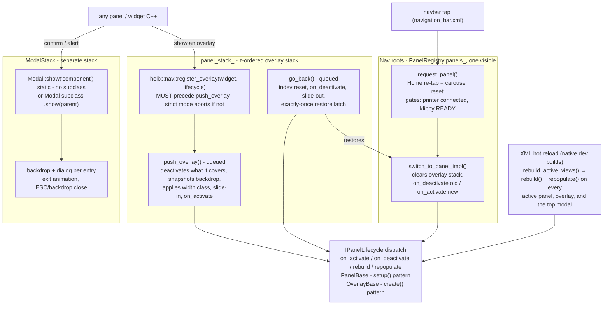
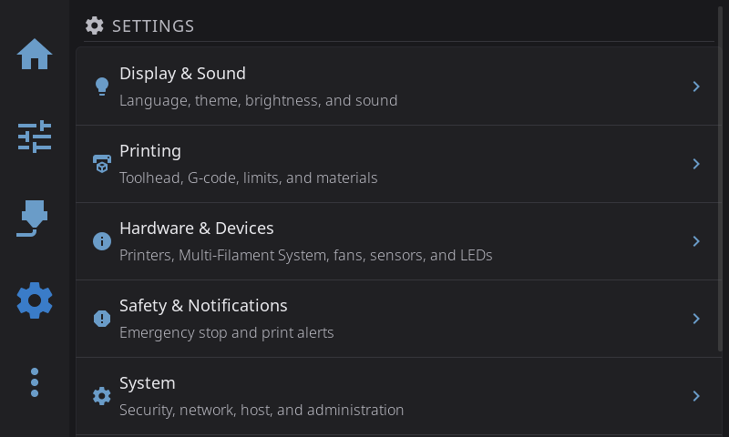
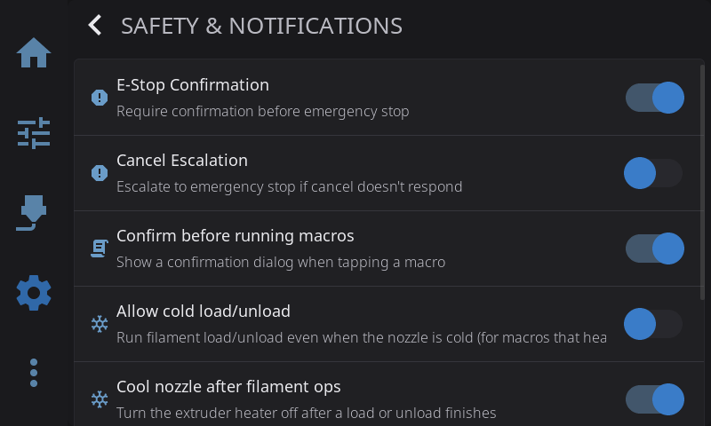
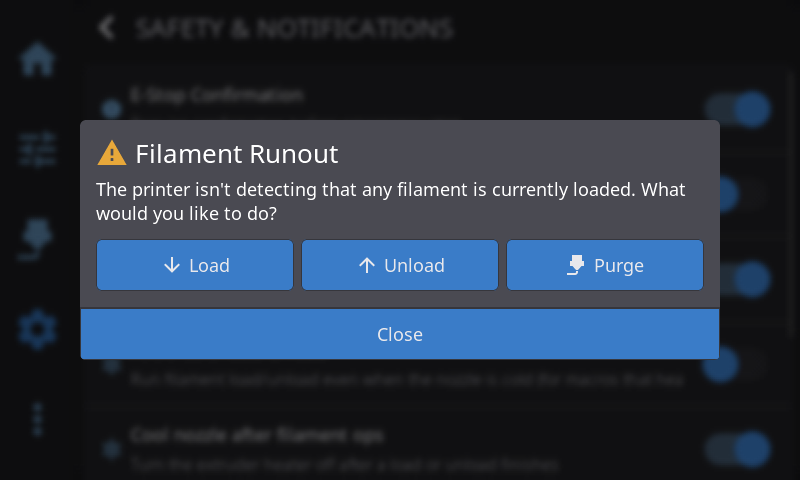

# 08 - Panels, overlays, modals & navigation

Every screen in HelixScreen is one of three surfaces. Six root panels (`helix::PanelId`) sit in the app layout behind the navbar, exactly one visible; overlays are (near-)full-screen layers pushed onto a z-ordered stack that `NavigationManager` - a `::instance()` singleton from chapter 05's census - owns; modals are dialogs on a completely separate stack (`ModalStack`) with their own backdrops. A C++ class (`PanelBase` / `OverlayBase` / `Modal` subclass) owns data and lifecycle, XML owns appearance, and `NavigationManager` dispatches `on_activate()` / `on_deactivate()` at every transition. The one rule with teeth: `on_deactivate()` is the teardown - a dismissed overlay's `cleanup()` does not run until shutdown (#943).

How many of each, with the command that counts it so you can re-run it:

| Surface | Count | Method |
|---------|-------|--------|
| Nav-root panels | 6 | `helix::PanelId` ([`include/ui_nav.h#PanelId`](../../../include/ui_nav.h)) - matches the six panel children of [`ui_xml/app_layout.xml#panel_container`](../../../ui_xml/app_layout.xml) |
| `PanelBase` subclasses | 11 | `rg -l '^class \w+ : public PanelBase' include src -g '*.h'` - 6 roots + 5 pushed as overlays or dev-only (AMS, AMS Overview, notification history, power, glyphs) |
| `OverlayBase` subclasses | 71 | `rg -l '^class \w+ : public OverlayBase' include src -g '*.h'` |
| `Modal` subclasses | 33 | `rg 'class \w+ : public Modal \{' include src -g '*.{h,cpp}'` minus the doc comment in [`include/ui_modal.h`](../../../include/ui_modal.h) |
| XML overlay/modal/panel files | 56 / 43 / 34 | `ls ui_xml | grep -c overlay` (and `modal`, `_panel`) out of ~250 top-level XML files plus ~130 in `ui_xml/components/` |
| `src/ui` file prefixes | 29 / 12 / 10 | `ls src/ui/ui_panel_*.cpp`, `ui_overlay_*.cpp`, `ui_modal*.cpp` + `src/ui/modals/` - the prefix spread is itself evidence of the naming trap |

Filename counts are the trap, in both directions: [`console_panel.xml`](../../../ui_xml/console_panel.xml), [`bed_mesh_panel.xml`](../../../ui_xml/bed_mesh_panel.xml), and [`ams_panel.xml`](../../../ui_xml/ams_panel.xml) are pushed as *overlays* (the first two classes derive from `OverlayBase`; `AmsPanel` is a `PanelBase` opened by hand), while only 11 of the 71 overlay classes live in `src/ui/ui_overlay_*.cpp` files - the rest are spread across `ui_panel_*.cpp`, `ui_settings_*.cpp`, and feature files. The C++ base class is the taxonomy; the filename is not.

Scope boundaries: chapter 01 owns the XML engine - how a file becomes widgets and how bindings resolve - so this chapter starts at "the widget tree exists." Chapter 03 owns the queueing and deferred-deletion rules the navigation bodies apply mechanically. Home-screen widgets take the `PanelWidget` path instead (chapter 09 of this series). Modal internals below the API - `ui_dialog` rendering, animation details - belong to [`docs/devel/MODAL_SYSTEM.md`](../MODAL_SYSTEM.md).

```mermaid
flowchart TB
    NAV["navbar tap (navigation_bar.xml)"]

    subgraph ROOTS["Nav roots - PanelRegistry panels_, one visible"]
        RP["request_panel()<br/>Home re-tap = carousel reset;<br/>gates: printer connected, klippy READY"]
        SWITCH["switch_to_panel_impl()<br/>clears overlay stack,<br/>on_deactivate old / on_activate new"]
    end

    subgraph STACK["panel_stack_ - z-ordered overlay stack"]
        REG["helix::nav::register_overlay(widget, lifecycle)<br/>MUST precede push_overlay -<br/>strict mode aborts if not"]
        PUSH["push_overlay() - queued<br/>deactivates what it covers, snapshots backdrop,<br/>applies width class, slide-in, on_activate"]
        BACK["go_back() - queued<br/>indev reset, on_deactivate, slide-out,<br/>exactly-once restore latch"]
    end

    subgraph MODALS["ModalStack - separate stack"]
        MSHOW["Modal::show('component') static - no subclass<br/>or Modal subclass .show(parent)"]
        MSTACK["backdrop + dialog per entry<br/>exit animation, ESC/backdrop close"]
    end

    LIFE["IPanelLifecycle dispatch<br/>on_activate / on_deactivate / rebuild / repopulate<br/>PanelBase - setup() pattern<br/>OverlayBase - create() pattern"]

    HOT["XML hot reload (native dev builds)<br/>rebuild_active_views() →<br/>rebuild() + repopulate() on every<br/>active panel, overlay, and the top modal"]

    NAV --> RP
    RP --> SWITCH
    UI["any panel / widget C++"] -->|"show an overlay"| REG --> PUSH
    UI -->|"confirm / alert"| MSHOW --> MSTACK
    BACK -->|"restores"| SWITCH
    PUSH --> LIFE
    BACK --> LIFE
    SWITCH --> LIFE
    HOT --> LIFE
```

## Key files

| File | Role |
|------|------|
| [`include/ui_nav.h`](../../../include/ui_nav.h) | `PanelId`, and the `helix::nav` facade: the push/back/register/close calls most callers need, without the `NavigationManager` class |
| [`include/ui_nav_manager.h`](../../../include/ui_nav_manager.h) | `NavigationManager` singleton: `set_active`, `request_panel`, `push_overlay`, `go_back`, registration maps, strict-check API |
| [`include/ui_nav_panel_registry.h`](../../../include/ui_nav_panel_registry.h) | `PanelRegistry`: the six root widgets (self-clearing `WidgetRef` slots), their instances and the lazy builder |
| [`include/ui_nav_backdrop.h`](../../../include/ui_nav_backdrop.h) | `OverlayBackdrop`: the dismiss backdrop behind the overlay stack, snapshot or dim layer |
| [`include/ui_navbar_button.h`](../../../include/ui_navbar_button.h) | `NavbarButton`: the E-stop and spools-on-bed buttons kept over navbar slots, above every backdrop |
| [`ui_xml/app_layout.xml`](../../../ui_xml/app_layout.xml) | The root layout: navbar plus the six panel children, by name - what `PanelFactory` later finds |
| [`src/ui/ui_nav_manager.cpp`](../../../src/ui/ui_nav_manager.cpp) | The stack mechanics, lifecycle dispatch, backdrop management, width classes, hot-reload rebuild |
| [`include/panel_lifecycle.h`](../../../include/panel_lifecycle.h) | `IPanelLifecycle` - the lifecycle interface NavigationManager dispatches against, incl. `rebuild()` and `repopulate()` |
| [`include/ui_panel_base.h`](../../../include/ui_panel_base.h) | `PanelBase` - dependency-injected base for the six roots (`init_subjects` → `setup`) |
| [`include/overlay_base.h`](../../../include/overlay_base.h) | `OverlayBase` - base for overlays (`init_subjects` → `create`), `destroy_overlay_ui()` |
| [`include/ui_modal.h`](../../../include/ui_modal.h) | `Modal` + `ModalStack` + `modal_confirm()` / `modal_alert()` helpers |
| [`include/panel_factory.h`](../../../include/panel_factory.h) | Boot wiring: finds the six XML panels, runs `setup()`, registers instances, ESP deferred build |
| [`src/application/subject_initializer.cpp`](../../../src/application/subject_initializer.cpp) | Calls the roots' `init_subjects()` before any XML is created - the ordering that makes bindings resolve |
| [`include/static_panel_registry.h`](../../../include/static_panel_registry.h) | `lazy_global<T>()` and the destroy hooks behind every `get_*_overlay()` accessor |
| [`src/application/xml_hot_reloader.cpp`](../../../src/application/xml_hot_reloader.cpp) | Poll + re-register side of hot reload (chapter 01 covers it); rebuild side is `rebuild_active_views()` |
| [`include/overlay_class.h`](../../../include/overlay_class.h) | `OverlayClass` + `resolve_overlay_is_destination()` - push-time width resolution (#1178) |
| [`src/ui/ui_settings_safety.cpp`](../../../src/ui/ui_settings_safety.cpp) | Overlay exemplar: singleton accessor, `create()`, `show()` with the register/push pairing |
| [`docs/devel/MODAL_SYSTEM.md`](../MODAL_SYSTEM.md) | The modal deep dive this chapter summarizes |

## How it works

### Two stacks: NavigationManager's overlays, ModalStack's dialogs

`NavigationManager` keeps `panel_stack_`, a `vector<lv_obj_t*>` in z-order whose slot 0 is always the active root panel; every entry above it is an overlay ([`include/ui_nav_manager.h#panel_stack_`](../../../include/ui_nav_manager.h)).

The same screen three states later, as the user meets the stacks (mock `--test` instance): a root panel; the safety overlay pushed on top of it - the exemplar open path from [`ui_settings_safety.cpp`](../../../src/ui/ui_settings_safety.cpp), shown below; and the runout modal, which lives on `ModalStack` and dims *everything* beneath it, overlay included, without `NavigationManager` knowing anything changed:

Most callers never touch the class: [`include/ui_nav.h`](../../../include/ui_nav.h) declares the `helix::nav` facade (`push_overlay`, `go_back`, `close_overlay`, `register_overlay`, `on_close`, `set_active`, `is_on_top`, `is_showing`, `shutdown`, ...), each a forward to `NavigationManager::instance()`, so a view includes one small header instead of the manager's. Inside, `NavigationManager` delegates the pieces that are not the stack: `PanelRegistry` holds the six root widgets and instances, `OverlayBackdrop` owns the dismiss backdrop, `PrinterBadgeMenu` the navbar's printer badge, and two `NavbarButton`s the navbar E-stop and spools-on-bed button.

A push is always queued through `helix::ui::queue_update()`. `push_overlay()` ([`src/ui/ui_nav_manager.cpp#"NavigationManager::push_overlay("`](../../../src/ui/ui_nav_manager.cpp)) validates the widget pointer survived the deferral, rejects duplicates, deactivates whatever it covers (the root panel for the first overlay, the previous overlay otherwise), snapshots the frozen backdrop *before* hiding, resolves the width class, shows with slide-in, then calls `on_activate()`. `go_back()` (`src/ui/ui_nav_manager.cpp#"NavigationManager::go_back("`) resets in-flight pointer input (`lv_indev_reset`), calls `on_deactivate()` on the closing overlay *before* the animation, pops, and re-activates the restored view exactly once via the `restore_activation_pending_` latch - `on_activate()` handlers are not all idempotent, so a double fire is a real bug.

Two entry points to the roots differ in one load-bearing way. `set_active(PanelId)` swaps the base panel *underneath* whatever is stacked, while `request_panel()` ([`include/ui_nav_manager.h#request_panel`](../../../include/ui_nav_manager.h)) is the whole navbar-tap decision - the Home re-tap carousel reset, connection and Klippy-ready gating (`BlockedDisconnected`, `BlockedKlippyNotReady`), and the stack-clearing switch.

`helix-screen ctl navigate` and a finger both land here, differing only in the `SwitchDispatch` argument (`Queued` or `Inline`). Overlays that must survive navbar switches - `PrintStatusPanel`, the print in progress - register with the third argument `persistent = true` ([`src/ui/ui_panel_print_status.cpp#push_overlay`](../../../src/ui/ui_panel_print_status.cpp)); a navbar switch clears `overlay_instances_` but preserves `persistent_overlay_instances_`, and `resolve_overlay_lifecycle()` self-heals the main map from it on the next push.

The print-status header's Files button is a programmatic `request_panel()` caller of exactly this kind: it queues a switch to `PrintSelect` mid-print ([`src/ui/ui_panel_print_status.cpp#handle_files_click`](../../../src/ui/ui_panel_print_status.cpp)) so the file list and detail views stay reachable while the persistent registration above keeps the print-status overlay collecting underneath the swap; starting a print from there stays blocked by `print_select_can_print`, with `print_select_blocked_reason` naming why (#1395).

The header's Camera button is the other header action: gated in XML on `printer_has_webcam and moonraker_is_remote and platform_extras_available`, it opens the standalone fullscreen camera overlay. `moonraker_is_remote` is the one live subject for "this screen is not on the printer's host" (published by `MoonrakerManager` from the actual websocket endpoint, computed by `helix::is_moonraker_on_same_host()`); UI that needs the answer binds the subject rather than re-parsing the configured host.

The stack is defensive at its edges. Every pushed widget gets an `LV_EVENT_DELETE` hook (`scrub_deleted_widget`, [`src/ui/ui_nav_manager.cpp#scrub_deleted_widget`](../../../src/ui/ui_nav_manager.cpp)): if any path deletes a tracked widget without going through `go_back()`, the hook erases it from every widget-keyed map before the memory frees, so `panel_stack_.back()` can never dereference a corpse. The base panels and the app layout are hooked too, through the same `ensure_delete_hook()` ([`include/ui_nav_manager.h#ensure_delete_hook`](../../../include/ui_nav_manager.h)): `set_panels()` hooks every `PanelRegistry` slot (`src/ui/ui_nav_manager.cpp#set_panels`) and `set_app_layout()` hooks the app layout (`src/ui/ui_nav_manager.cpp#set_app_layout`). The registry's slots and the app-layout handle are `WidgetRef`s, which clear themselves when LVGL deletes the widget, so a queued callback that runs after a base panel died reads null rather than freed memory.

Connection loss is the other edge: a CONNECTED→DISCONNECTED transition clears the overlay stack and bounces to Home - except when `mark_disconnect_expected()` armed its one-shot, so backgrounding the Android app and reconnecting keeps your place (#1245). Switching printers does not go through this path: `PrinterSwitchFlow` ([`include/printer_switch_flow.h`](../../../include/printer_switch_flow.h)) decides the config and the restart order, and the restart tears navigation down with the rest of the printer scope (`helix::nav::shutdown()` in `PrinterSession::teardown_printer_scope()`), then lands Home.

The dismiss-backdrop that dims behind the first overlay deserves its own paragraph because it is not what it looks like. `OverlayBackdrop` ([`include/ui_nav_backdrop.h#OverlayBackdrop`](../../../include/ui_nav_backdrop.h)) owns it. It is a frozen *snapshot* of the screen taken before anything is hidden - not a live view - so anything outside the overlay stops tracking: `refresh_overlay_backdrop()` (`src/ui/ui_nav_manager.cpp#refresh_overlay_backdrop`) re-takes it, into the buffer it already owns, when a setting whose effect lands in the navbar (the printer-switcher badge, a theme or mode switch that changes the palette) is toggled from inside an overlay. On the ESP32, and anywhere a snapshot has once failed to allocate, the backdrop is instead a translucent dim layer over the live navbar (`create_dim_layer()`, `src/ui/backdrop_blur.cpp#create_dim_layer`): it costs no frame buffer, never goes stale, and leaves the base panel drawn beside a transient first overlay (a destination overlay still hides it). A tap on that backdrop while the on-screen keyboard is up dismisses only the keyboard: keyboard visibility is latched at `LV_EVENT_PRESSED`, because LVGL's click-focus DEFOCUS hides the keyboard before CLICKED fires (`take_backdrop_keyboard_dismiss()`, [`include/ui_nav_manager.h#take_backdrop_keyboard_dismiss`](../../../include/ui_nav_manager.h)).

Two presentation details ride on the same stack. Transitions are uniformly a 200 ms slide with `nav_forward` / `nav_back` sounds, so the stack feels like one system rather than per-overlay improvisation; on the limited display tiers overlays open and close without the slide and fade, and an expensive build paints a "Loading..." pill first (`helix::nav::build_under_loading_pill()`). And `overlay_stack_names()` (`src/ui/ui_nav_manager.cpp#overlay_stack_names`) exposes the stack bottom-to-top as widget names; that is what the `helix-screen ctl` breadcrumb and the remote-control UI read to tell you where you are.

Modals are not on this stack at all. `Modal::show("component_name")` creates a C++ backdrop plus dialog from an XML component and tracks the pair in `ModalStack` ([`include/ui_modal.h#ModalStack`](../../../include/ui_modal.h)) - its own z-ordered stack with entrance/exit animations, backdrop-click and ESC handling, and an `exiting` flag so a second `hide()` during the exit animation is ignored. An overlay can therefore sit under a modal under another modal without `NavigationManager` knowing anything changed.

### The lifecycle contract, and why deactivation is the teardown

Both base classes implement `IPanelLifecycle` ([`include/panel_lifecycle.h#IPanelLifecycle`](../../../include/panel_lifecycle.h)): `on_activate()` when visible, `on_deactivate(reason)` when hidden, `rebuild()` for hot reload, `repopulate()` to re-apply imperative content after a rebuild, `is_destination()` for width. The contract is asymmetric on purpose: deactivation fires *before* the hiding animation starts and on every dismiss path; `on_activate()` fires after the panel is visible, and implementations must tolerate repeated calls.

Deactivation is a template method, not a virtual a view overrides. `ViewLifecycleBase` - the shared base under both `PanelBase` and `OverlayBase` ([`include/panel_lifecycle.h#ViewLifecycleBase`](../../../include/panel_lifecycle.h)) - makes `on_deactivate(DeactivateReason)` `final`. It calls the protected hook `on_deactivating(reason)`, then invalidates the screen-scoped guard. A view overrides the hook and makes no base call, so the invalidation cannot be skipped by forgetting one.

Two things come out of that base, and both are part of the contract:

- **The reason.** `DeactivateReason` is `NavigateAway`, `Shutdown`, `Rebuild` or `Suspended` ([`include/panel_lifecycle.h#DeactivateReason`](../../../include/panel_lifecycle.h)), so a view never has to ask `NavigationManager::is_shutting_down()` which kind of hide this is. `ZOffsetCalibrationPanel` is the case that needs it - a run in progress is aborted only on `NavigateAway`, because shutdown and hot-reload take the UI out from under a probe the printer is still executing. `Suspended` (screensaver, display sleep, app backgrounded) must stop timers and polling but must not cancel in-flight work: the view gets `on_activate()` again on wake.
- **Two lifetime guards.** `lifetime_` is screen-scoped: every deactivation invalidates it, so it holds work whose result only matters while the view is on screen. `object_lifetime_` is object-scoped: it survives deactivation and dies at `cleanup()`/destruction, for work the view owes the machine rather than the screen. A callback parked there must be safe to run off screen - it may touch members, but must not assume any widget is visible.

Construction is two-phase in both bases. Subjects first - `init_subjects()` must run before `lv_xml_create()` or every binding logs "No subject was found" - then XML: `PanelBase::setup(panel, parent)` wires the already-created widget tree ([`include/ui_panel_base.h#PanelBase`](../../../include/ui_panel_base.h)), `OverlayBase::create(parent)` does the `lv_xml_create` itself and returns the root ([`include/overlay_base.h#OverlayBase`](../../../include/overlay_base.h)). Both bases ship the same guards for the subject half: `init_subjects_guarded()` makes double-init a warning instead of a re-registration, and `deinit_subjects_base()` pairs it at shutdown; `init_subjects()` implementations self-register their deinit with `StaticSubjectRegistry` so shutdown order cannot leak observers. `PanelBase` additionally injects its dependencies - every root receives `PrinterState&` and an `IMoonrakerAPI*` it may later swap via `set_api()` on reconnect.

For the six roots this order lives in boot. `SubjectInitializer` runs each panel's `init_subjects()` ([`src/application/subject_initializer.cpp#init_panel_subjects`](../../../src/application/subject_initializer.cpp)) before the single root `lv_xml_create`, then `PanelFactory::setup_panels()` ([`src/application/panel_factory.cpp#setup_panels`](../../../src/application/panel_factory.cpp)) finds the six widgets by name (on the ESP32 firmware only `home` exists at boot and the other five are built on first navigation, [`src/application/panel_factory.cpp#find_panels`](../../../src/application/panel_factory.cpp)), runs `setup()`, and `activate_initial_panel()` fires the first `on_activate()` (`src/application/panel_factory.cpp#"nav.activate_initial_panel();"`). For everything else it happens lazily at first open (below).

The rule from #943: `NavigationManager::go_back()` deactivates an overlay when it is dismissed - it does **not** call `cleanup()`. For a persistent/singleton overlay, `cleanup()` runs only at app shutdown. Anything a `show()` turns on that must turn back off when the user leaves - re-enabling a temporarily disabled touch transform, restoring global state, releasing a resource - belongs in `on_deactivating()`. A transform disabled in `show()` and re-enabled only in `cleanup()` stays disabled for the rest of the session if the user backs out. Make `on_deactivating()` the authoritative teardown and keep `cleanup()` idempotent so it is safe when both run. The same reasoning covers `suspend_active()` / `resume_active()`: the screensaver, display sleep and Android backgrounding call them, delivering `DeactivateReason::Suspended`, so timers pause without a dismiss - suspend is deliberately idempotent and tracks its own state.

The whole contract in one table:

| Hook | Fired by | Put there |
|------|----------|-----------|
| `init_subjects()` | boot (roots) or lazy first open | create subjects; each panel self-registers its deinit with `StaticSubjectRegistry` |
| `register_callbacks()` | right after, same paths | `lv_xml_register_event_cb` handlers |
| `setup()` / `create()` | `PanelFactory` boot / lazy open | find widgets by name, wire what XML cannot |
| `on_activate()` | after the surface is visible | start timers, refresh data - and stay idempotent |
| `on_deactivating(reason)` | before every hide, dismiss, suspend | **the teardown** - release what `show()` grabbed. The base invalidates `lifetime_` after it returns |
| `destroy_overlay_ui()` | destroy-on-close callback (opt-in) | frees the widget tree only; subjects and state survive |
| `rebuild()` + `repopulate()` | XML hot reload only | re-create the tree; re-apply imperative content |
| `cleanup()` | shutdown (and nothing else) | idempotent backstop, not the main path |

### Lazy open, destroy-on-close, and the pairing rule

Almost nothing but the six roots is built at boot. The standard open path is `OverlayBase::show()` (`src/ui/overlay_base.cpp#show`), called on the overlay's `lazy_global<T>` accessor: on first access it runs `init_subjects()`, then `register_callbacks()` + `create()` whenever there is no live tree, keeps the root in `overlay_root_` (the one place it lives), and registers a close callback if `destroy_on_close()` is true. Every caller opening the same singleton reaches that one root. The fan and LED control overlays open through `helix::open_fan_control_overlay()` / `helix::open_led_control_overlay()`. On every access, including later re-opens, `show()` re-registers with `NavigationManager` and pushes: a navbar switch clears the registration map, so a cached overlay that skipped the re-registration would be invisible to the lifecycle machinery. A `PanelBase` subclass has no `show()`, so [`src/ui/ui_panel_ams_overview.cpp#navigate_to_ams_panel`](../../../src/ui/ui_panel_ams_overview.cpp) opens the AMS panel through the same steps by hand, which is why "PanelBase subclass" and "shown as an overlay" overlap.

The pairing rule: every `push_overlay(root)` must be preceded by `register_overlay_instance(root, lifecycle)` (spelled `helix::nav::register_overlay()` through the facade) - normally in the same function, one line apart (`OverlayBase::show()` does exactly this at [`src/ui/overlay_base.cpp#show`](../../../src/ui/overlay_base.cpp)).

An unregistered push means `on_deactivate()` never fires on dismiss, and state leaks exactly like #943. Dev/test builds opt into the crash instead of the warning: `HELIX_STRICT_OVERLAY_CHECK=1` (or `set_overlay_registration_strict(true)`, which `HelixTestFixture` sets) aborts on an unregistered push; release builds compile the check out. Intentionally lifecycle-less overlays - keypad, factory reset - register with a *null* lifecycle to say so.

Memory pressure is handled at close, not at push: `destroy_on_close=true` registers a callback that runs `OverlayBase::destroy_overlay_ui()` ([`include/overlay_base.h#"void destroy_overlay_ui(lv_obj_t*& cached_panel)"`](../../../include/overlay_base.h)), which frees the widget tree (400-800 KB per overlay) via `safe_delete_deferred()` while the C++ object and its subjects survive; the next open re-creates widgets from XML. The ESP32 port goes further: `set_deferred_panel_builder()` ([`include/ui_nav_manager.h#set_deferred_panel_builder`](../../../include/ui_nav_manager.h)) lets even the six roots be built on first navigation (`PanelFactory::build_deferred_panel()`), inert on desktop where all panels are resident. The deferred path paints a loading scrim before the multi-second create, guards against the builder re-entering itself, and tears the scrim down only at the outermost transition - a switch can cascade into `handle_active_panel_change`, and only the outermost call owns the scrim.

One end-to-end sequence ties it together. The user taps a Settings row: the settings panel's row handler, `nav_row<get_safety_settings_overlay>()` ([`src/ui/ui_panel_settings.cpp#"Getter().show(settings_screen())"`](../../../src/ui/ui_panel_settings.cpp)), calls `get_safety_settings_overlay().show(screen)`. `show()` initializes subjects on first use, lazily creates the widget tree, registers the instance with NavigationManager, and pushes. Inside the queued push body, the Settings root panel gets `on_deactivate()` (it is now covered), the snapshot backdrop is adopted, the width class is resolved, the overlay slides in, and the overlay's `on_activate()` seeds its toggles from the managers. The user changes a toggle - an XML event callback writes the setting - and presses Back: `go_back()` resets in-flight input, runs the overlay's `on_deactivate()`, slides out, pops, and re-activates Settings exactly once. No panel code drove any of the transitions; both sides only implemented the hooks.

Who owns the C++ objects? Almost every overlay and non-root panel is a `helix::lazy_global<T>()` instance - `get_safety_settings_overlay()` constructs on first use and registers a destroy hook with `StaticPanelRegistry` ([`include/ui_settings_safety.h#get_safety_settings_overlay`](../../../include/ui_settings_safety.h)), which runs in `PrinterSession::teardown_printer_scope()` after `helix::nav::shutdown()` has deactivated everything, on a printer switch as well as at exit. An overlay that owns state outside itself uses `lazy_global_with_teardown<T>()` to release it first. A couple of special surfaces (the emergency-stop overlay, the first-run tour) live outside the base classes entirely with their own `instance()` accessors and manage their own visibility; do not copy them as patterns.

XML hot reload closes the loop on the same lifecycle hooks: on native dev builds (or with `HELIX_HOT_RELOAD=1`) the poller (chapter 01) re-registers changed components, then `NavigationManager::rebuild_active_views()` ([`src/ui/ui_nav_manager.cpp#rebuild_active_views`](../../../src/ui/ui_nav_manager.cpp)) walks the active panel, every registered overlay (both maps), and the top modal, calling `rebuild()` - which re-runs `create()`/`setup()`, re-keys the registration maps and the widget's `panel_stack_` entry off the old widget (a main panel's as well as an overlay's, via `src/ui/ui_nav_manager.cpp#replace_panel_widget`, #1294), and async-deletes the old tree - followed by `repopulate()` where a view keeps imperative content (dropdown lists, in-progress edits) that XML alone cannot restore. A root a caller cached before the rebuild stays usable: once it is freed, `register_overlay_instance()`, `register_overlay_close_callback()` and `push_overlay()` resolve it to the overlay's rebuilt root (#1729).

### Modals: three tiers of effort

Tier 1, no subclass and no custom XML: `modal_confirm()` / `modal_alert()` ([`include/ui_modal.h#helix::ui`](../../../include/ui_modal.h), [`include/ui_modal.h#helix::ui`](../../../include/ui_modal.h)) configure severity, button text, and callbacks on the shared `modal_dialog` component. This is the right answer for most "are you sure?" moments - [`src/ui/ui_panel_macros.cpp`](../../../src/ui/ui_panel_macros.cpp) uses it for macro confirmation - and it is one call: title, message, severity, confirm text, callback, options struct (cancel callback, dismissal report, owner token). Tier 2, custom XML, no subclass: `Modal::show("print_cancel_confirm_modal")` returns a dialog pointer; wire buttons by name and `Modal::hide(dialog)` later; `ModalGuard` ([`include/ui/ui_modal_guard.h`](../../../include/ui/ui_modal_guard.h)) gives that pointer RAII. Tier 3, subclass: extend `Modal`, implement the two pure virtuals `get_name()` (logging) and `component_name()` (the XML component), override `on_show()`/`on_ok()`/`on_cancel()` and the extra button hooks as needed - the hook ladder runs `on_tertiary()` through `on_senary()` because runout guidance grew to five buttons.

The ladder measures effort, not safety. Tier 1 is backed by an internal `ConfirmationModal`
instance, so its teardown, disarm and `on_hide()` all run: pass `on_dismiss` (and
`owner_token` when the capture can outlive its owner) and a close by backdrop tap, ESC or
hot-reload rebuild reports back. Tier 2's bare `Modal::show()` still pushes with **no
owner**, so nothing observes that close at all - a tier-2 dialog whose caller holds a
re-entry guard or a pending flag needs tier 3. [`MODAL_SYSTEM.md`](../MODAL_SYSTEM.md) has the full rule.

[`include/ui_info_qr_modal.h`](../../../include/ui_info_qr_modal.h) + [`src/ui/ui_info_qr_modal.cpp`](../../../src/ui/ui_info_qr_modal.cpp) are the whole subclass pattern in 42 + 62 lines: constructor takes a `Config`, `show_modal(parent)` forwards the fields as XML attributes, `on_show()` wires the OK button and builds the QR, and `show_owned()` hands the instance to `ModalStack::assume_ownership()`, which frees it after the dialog closes: the owned-subclass idiom for modals created on demand. Base-class helpers do the rest of the wiring: `wire_ok_button()` / `wire_cancel_button()` find buttons by name and route their clicks to the virtual hooks, and `find_widget()` reaches into the dialog by widget name. [`docs/devel/MODAL_SYSTEM.md`](../MODAL_SYSTEM.md) owns all of this in depth, including `ui_dialog`, `modal_button_row`, and why `ModalStack` records an owner.

Choosing between a modal and an overlay is a design question with a fixed answer: an overlay is a place the user navigated to and will return from (it goes on the history stack, gets a back affordance, a width class); a modal interrupts for a decision (it dims everything, ignores history, and resolves to a callback). Confirmation of a destructive action, a warning, a quick input - modal. A screen with content - overlay. When a "modal" starts needing scroll, its own navigation, or lifecycle teardown, it has become an overlay and should be moved.

## Patterns & gotchas

- **Register before push, every push.** `helix::nav::register_overlay(root, this)` then `helix::nav::push_overlay(root)`. Cached overlays must re-register on re-open (navbar switches clear the map); `OverlayBase::show()` does this for you - hand-rolled opens forget.
- **`on_deactivate()` is the teardown.** `go_back()` never calls `cleanup()`; for singleton overlays `cleanup()` is shutdown-only. #943 is the canonical postmortem. Keep `cleanup()` idempotent anyway.
- **Strict overlay checking is the gate.** `HELIX_STRICT_OVERLAY_CHECK=1` aborts on unregistered pushes; `HelixTestFixture` enables it, so a forgotten pairing fails tests, not production. Null lifecycle is the opt-out for intentional lifecycle-less overlays.
- **`set_active()` vs `request_panel()`.** `set_active()` swaps the root underneath the stack; `request_panel()` is the navbar-tap semantics including gating and stack clearing. Programmatic navigation should almost always be `request_panel()` - and check its `PanelRequest` return; a `BlockedDisconnected` is a silent no-op otherwise.
- **Ask `is_panel_on_top()` before a deferred `go_back()`.** By the time your queued callback runs, the user may have navigated on; a blind `go_back()` pops whatever they are looking at now (#1221).
- **Filename tells you nothing.** [`ui_panel_print_status.h`](../../../include/ui_panel_print_status.h) is an `OverlayBase`; [`src/ui/ui_settings_safety.cpp`](../../../src/ui/ui_settings_safety.cpp) holds an overlay; only the base class matters. Same for XML: overlay screens are named `*_panel.xml`.
- **Component names must match filenames.** `get_xml_component_name()` / `component_name()` return the `ui_xml/` filename without `.xml` ([`include/ui_panel_base.h#PanelBase`](../../../include/ui_panel_base.h)); a mismatch is the "panel created but empty" silent failure - the create succeeds, no component by that name exists. The six roots have a second name dependency: `PanelFactory::PANEL_NAMES` ([`include/panel_factory.h#PanelFactory`](../../../include/panel_factory.h)) must match the widget names in [`ui_xml/app_layout.xml#panel_container`](../../../ui_xml/app_layout.xml) or boot fails to find the panels.
- **`persistent = true` is for overlays that outlive a navbar switch.** The print-status overlay and the temperature graph overlay (`TempGraphOverlay::before_show()`) use it. It changes what survives a navbar switch, *not* what survives a disconnect - `clear_overlay_stack()` hides every overlay, persistent included; the registration maps survive both paths, so the overlay re-opens with its lifecycle intact either way.
- **Width class is resolved at push time, not in XML.** Destinations render full width, transient layers gapped with the backdrop showing ([`include/overlay_class.h#OverlayClass`](../../../include/overlay_class.h)); drill-downs inherit. Long-dwell screens (AMS, Print Status) override `is_destination()` so they are full width from every entry point (#1178). `reapply_overlay_widths()` after resolution changes; `set_overlay_width_unmanaged()` for deliberate oddballs like the widget catalog.
- **Destroy-on-close frees the tree, not the class.** Subjects survive `destroy_overlay_ui()`; widgets do not. Override `on_ui_destroyed()` to null cached child pointers or the next `create()` will chase stale ones.
- **`Modal` has both a static and an instance `show()`.** Static for XML-only, subclass instance when you need `on_ok()` logic. An instance-backed modal is hidden, never rebuilt, by hot reload - re-creating it from XML would skip `on_show()` wiring ([`include/ui_modal.h#rebuild_top`](../../../include/ui_modal.h)).
- **The E-stop lives on the navbar, above every backdrop.** While a job holds the machine (`estop_visible`), a screen-level `navbar_estop` sits over the navbar's transparent `nav_estop_slot`; while spools are latched on the bed (`bed_drying_state`), a `navbar_drying` button sits over `nav_drying_slot` the same way. Both are `NavbarButton`s (`src/ui/ui_navbar_button.cpp#create`). Every screen-level backdrop or overlay goes up through `helix::ui::bring_to_front()` (`include/ui_effects.h#bring_to_front`), which keeps them in front, and sweeps over the screen's children skip them via `helix::ui::is_screen_chrome()`. Beside a side navbar the E-stop moves up to clear the on-screen keyboard; under a portrait bottom navbar the keyboard covers it. Screens that cover the navbar carry their own E-stop (lock screen, fullscreen camera). Anything on `lv_layer_top` is above it: the lock screen by design, and the busy overlay ("Preparing print...") during host-side G-code rewriting, when the printer is still idle.
- **A second `hide()` during a modal's exit animation is a no-op.** `ModalStack` marks the entry `exiting` and ignores further hides; teardown after `lv_anim_delete_all()` also validity-checks each backdrop because an exit that never completed leaves an entry whose screen may already be gone.
- **All navigation entry points queue.** `push_overlay`/`go_back` run their bodies inside `queue_update`; an LVGL event callback must not navigate synchronously mid-render. The widget you pushed is re-validated inside the queued body - capture raw pointers freely, but expect the skip.
- **Teardown ordering is fixed.** `PrinterSession::teardown_printer_scope()` ([`src/application/printer_session.cpp#teardown_printer_scope`](../../../src/application/printer_session.cpp)) calls `helix::nav::shutdown()` before the panel registry is destroyed, deactivating the visible surface first, for both a printer switch and process exit; views see `DeactivateReason::Shutdown` and skip destructive actions (e.g. ABORT) on the way out.
- **Connection loss clears the stack.** A disconnect pops every overlay and returns to Home. Code that disconnects on the user's behalf and expects to come back to the same screen (Android app resume) must call `mark_disconnect_expected()` *before* triggering the disconnect, or the UI loses its place (#1245).
- **Never delete an overlay root out-of-band and assume the manager notices.** The `LV_EVENT_DELETE` scrub hook catches it - that is the safety net, not license: a hand-rolled teardown still owes `unregister_overlay_instance()` for anything it did not delete.
- **`on_activate()` must be idempotent, and must not navigate.** The restore latch exists because handlers are not all idempotent; and a re-entrant navigation from inside `on_activate()` is the case the latch explicitly clears before dispatching to avoid.
- **Overlays slide in horizontally, from the right, in every orientation.** `overlay_animate_slide_in()` (`src/ui/ui_nav_manager.cpp#"NavigationManager::overlay_animate_slide_in("`) animates `translate_x` from the overlay's own width to 0, portrait included. Vertical sheet motion is for modals and pickers, never overlays.
- **Width is re-applied, not remembered in pixels.** Overlays cache their root widget across resolution changes (rotation, Android nav-bar insets - #941); `reapply_overlay_widths()` re-derives widths from freshly-registered theme constants. Call it after `theme_manager_refresh_layout_constants()`, never hand-set an overlay width (#1178).
- **`push_overlay(root, false)` - the `hide_previous` variant - is for see-through stacking.** Exactly two call sites use it: the on-screen keypad ([`src/ui/ui_component_keypad.cpp#ui_keypad_show`](../../../src/ui/ui_component_keypad.cpp), a transparent overlay over the content being edited) and the widget catalog ([`src/ui/ui_widget_catalog_overlay.cpp#show`](../../../src/ui/ui_widget_catalog_overlay.cpp), which keeps the home grid visible behind the catalog so you can drag a widget out of the list). Both are function-based overlays registered with a null lifecycle; both stay visible over what they cover.
- **Every open is telemetry.** `push_overlay` reports the overlay name to telemetry and the crash handler (`overlay+` breadcrumb) as one of lifecycle-name / `anon` (registered null) / `unreg` (never registered). Seeing `unreg` in a debug bundle is this chapter's pairing rule being violated in the wild.
- **The test fixture polices this chapter.** `HelixTestFixture` enables strict overlay checking and clears `ModalStack` between tests, so a forgotten registration or a leaked modal fails the suite rather than production. If an overlay test aborts with `STRICT MODE: push_overlay(...)`, the fix is a `register_overlay_instance` call, not disabling the check.

## Going deeper

- [`../MODAL_SYSTEM.md`](../MODAL_SYSTEM.md) - the modal deep dive: `ui_dialog` internals, `modal_button_row`, ModalGuard, dynamic-content and many-button patterns, ModalStack animation details.
- [`01-declarative-ui.md`](01-declarative-ui.md) - the other half of this layer: XML file to live widget, bindings, and the hot-reload poller itself.
- [`03-threading-lifetime.md`](03-threading-lifetime.md) - why every navigation body is queued, why deletion is deferred, and the `AsyncLifetimeGuard` both base classes carry.
- [`../YOUR_FIRST_CONTRIBUTION.md`](../YOUR_FIRST_CONTRIBUTION.md) - annotated walkthrough of building a real settings overlay end to end, including the XML side this chapter skips.
- [`../DEVELOPER_QUICK_REFERENCE.md`](../DEVELOPER_QUICK_REFERENCE.md) - copy-paste snippets for the modal tiers and overlay show/hide.
- [`../HELIXCTL.md`](../HELIXCTL.md) - driving the live stack from outside: `ctl navigate`, `ctl click`, and why a pinned socket is mandatory.
- [`../CONTRIBUTOR_GOTCHAS.md`](../CONTRIBUTOR_GOTCHAS.md) - symptom-indexed traps; several entries ("No subject was found", empty panel) are this chapter's rules failing in specific ways.

## Guided code tour

Read in this order; about 30 minutes total.

1. [`include/ui_nav.h#PanelId`](../../../include/ui_nav.h) - `PanelId`: six roots; the enum order matches `app_layout.xml` child order. Below it, the `helix::nav` facade (`include/ui_nav.h#helix::nav`): the calls most views make.
2. [`include/ui_nav_manager.h#NavigationManager`](../../../include/ui_nav_manager.h) - `register_overlay_instance()` and its doc, then the strict-mode contract at `include/ui_nav_manager.h#"set_overlay_registration_strict"`; skim the rest of the API surface nearby: `push_overlay` `include/ui_nav_manager.h#push_overlay`, `go_back` `include/ui_nav_manager.h#go_back`, `is_panel_on_top` `include/ui_nav_manager.h#"is_panel_on_top"`, `suspend_active` `include/ui_nav_manager.h#suspend_active`. The members at the bottom show what the class delegates: `panels_` (`PanelRegistry`), `backdrop_` (`OverlayBackdrop`), `printer_badge_`, and the two `NavbarButton`s.
3. [`ui_xml/app_layout.xml`](../../../ui_xml/app_layout.xml) - the navbar and the six panel children, which are the shell's whole content; everything else in the app is pushed on top of this.
4. [`include/panel_lifecycle.h#IPanelLifecycle`](../../../include/panel_lifecycle.h) - `IPanelLifecycle`: the dispatch contract, plus `rebuild()` `include/panel_lifecycle.h#rebuild`, `is_destination()` `include/panel_lifecycle.h#is_destination`, `repopulate()` `include/panel_lifecycle.h#repopulate` - the three hooks beyond activate/deactivate.
5. [`include/ui_panel_base.h#PanelBase`](../../../include/ui_panel_base.h) - `PanelBase`: dependency injection, two-phase init, observer RAII. Note `setup()` at `include/ui_panel_base.h#PanelBase/setup` and the component-name contract at `include/ui_panel_base.h#"get_xml_component_name() const = 0"`.
6. [`include/overlay_base.h#OverlayBase`](../../../include/overlay_base.h) - `OverlayBase`: same two-phase shape with `create()` at `include/overlay_base.h#"virtual lv_obj_t* create(lv_obj_t* parent)"`; then `destroy_overlay_ui()` at `include/overlay_base.h#"void destroy_overlay_ui(lv_obj_t*& cached_panel)"` and the destroy-on-close choreography in its doc.
7. [`include/ui_settings_safety.h#get_safety_settings_overlay`](../../../include/ui_settings_safety.h) - the singleton accessor (`lazy_global`) whose overlay is destroyed through `StaticPanelRegistry`: how overlay lifetimes are usually owned. Its open path is the settings row's `nav_row<get_safety_settings_overlay>()` at `src/ui/ui_panel_settings.cpp#"Getter().show(settings_screen())"` into `OverlayBase::show()`: register at `src/ui/overlay_base.cpp#"helix::nav::register_overlay(overlay_root_, this)"`, push at `src/ui/overlay_base.cpp#"helix::nav::push_overlay(overlay_root_)"`.
8. [`src/ui/ui_nav_manager.cpp#"NavigationManager::push_overlay("`](../../../src/ui/ui_nav_manager.cpp) - `push_overlay()`'s queued body: pointer re-validation, duplicate guard, the unregistered-push warning/abort, deactivate-what-it-covers, backdrop snapshot before hide, width application, slide-in, `on_activate()`.
9. [`src/ui/ui_nav_manager.cpp#"NavigationManager::go_back("`](../../../src/ui/ui_nav_manager.cpp) - `go_back()`: indev reset, `on_deactivate()` before animation, the exactly-once restore latch, backdrop teardown.
10. [`src/ui/ui_nav_manager.cpp#request_panel`](../../../src/ui/ui_nav_manager.cpp) - `request_panel()`: the gating states (`PanelRequest` at [`include/ui_nav_manager.h#PanelRequest`](../../../include/ui_nav_manager.h)) and how `ctl navigate` shares it.
11. [`src/ui/ui_nav_manager.cpp#switch_to_panel_impl`](../../../src/ui/ui_nav_manager.cpp) - `switch_to_panel_impl()`: the stack-clearing switch underneath, the queue-vs-inline dispatch question.
12. [`src/ui/ui_nav_manager.cpp#scrub_deleted_widget`](../../../src/ui/ui_nav_manager.cpp) - `scrub_deleted_widget()` and `adopt_overlay_backdrop()` at `src/ui/ui_nav_manager.cpp#adopt_overlay_backdrop`: the self-healing bookkeeping and the snapshot backdrop; skim `refresh_overlay_backdrop()` at `src/ui/ui_nav_manager.cpp#refresh_overlay_backdrop` for when a snapshot goes stale.
13. [`src/ui/overlay_base.cpp#show`](../../../src/ui/overlay_base.cpp) - `OverlayBase::show()`: first-open init, destroy-on-close, and the register-then-push pair it runs on every open.
14. [`src/ui/ui_panel_ams_overview.cpp#navigate_to_ams_panel`](../../../src/ui/ui_panel_ams_overview.cpp) - a `PanelBase` subclass (AMS) opened as an overlay through the same dance by hand; compare with what `OverlayBase::show()` automates.
15. [`src/application/panel_factory.cpp#setup_panels`](../../../src/application/panel_factory.cpp) - `setup_panels()`: boot wiring, the ESP deferred-builder registration at `src/application/panel_factory.cpp#"set_deferred_panel_builder"`, `activate_initial_panel()` at `src/application/panel_factory.cpp#"NavigationManager::instance().activate_initial_panel()"`.
16. [`src/application/subject_initializer.cpp#init_panel_subjects`](../../../src/application/subject_initializer.cpp) - the roots' `init_subjects()` calls, before any `lv_xml_create` - the ordering that makes bindings resolve.
17. [`src/ui/ui_panel_print_status.cpp#push_overlay`](../../../src/ui/ui_panel_print_status.cpp) - persistent registration, third argument `true`: an overlay that survives navbar switches.
18. [`include/ui_modal.h#"class Modal {"`](../../../include/ui_modal.h) - `Modal`: static `show()` at `include/ui_modal.h#"static lv_obj_t* show"` vs instance `show()` at `include/ui_modal.h#"bool show(lv_obj_t* parent"`, the pure virtuals at `include/ui_modal.h#"get_name() const = 0"`, `ModalStack` at `include/ui_modal.h#ModalStack`, helpers at `include/ui_modal.h#animate_entrance`.
19. [`include/ui_info_qr_modal.h#"class InfoQrModal : public Modal {"`](../../../include/ui_info_qr_modal.h) - the 42-line subclass; then [`src/ui/ui_info_qr_modal.cpp#show_modal`](../../../src/ui/ui_info_qr_modal.cpp) for `show_modal()`, `on_show()` wiring, and `show_owned()` (`src/ui/ui_info_qr_modal.cpp#show_owned`) handing the instance to `ModalStack` for its lifetime.
20. [`src/ui/ui_nav_manager.cpp#rebuild_active_views`](../../../src/ui/ui_nav_manager.cpp) - `rebuild_active_views()`: how hot reload reaches every live surface through the same lifecycle interface; end on [`include/overlay_class.h#resolve_overlay_is_destination`](../../../include/overlay_class.h) for the push-time width rule.
