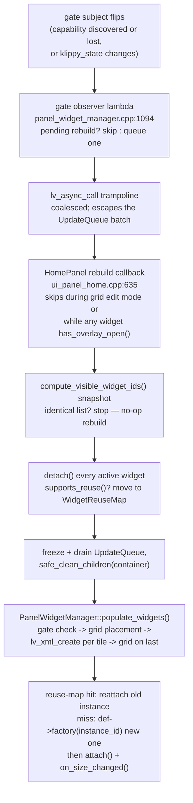
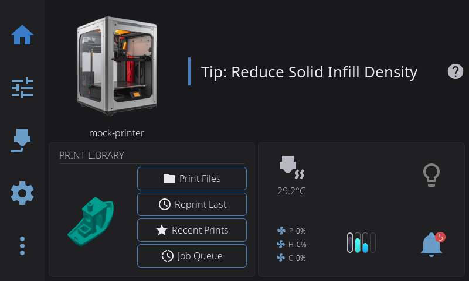

# 09 — Home panel widgets

The home panel is not one hardcoded screen: it is a grid of independently developed "widgets" — fan speeds, temperatures, camera, macros, and 30-odd more — each pairing an XML component (appearance) with an optional C++ `PanelWidget` subclass (behavior). `PanelWidgetManager`, a `::instance()` singleton, owns the whole lifecycle: it reads the user's saved layout from disk, decides which widgets the connected hardware earns, places them on a responsive grid, and creates/attaches each one. When hardware, config, or the user in edit mode invalidates the layout, the LVGL tree is torn down and rebuilt — but C++ widget instances are recycled through that churn so expensive state (a live camera stream) never restarts.

Counts, recounted 2026-08-20 (method included so you can re-run it):

| What | Count | Method |
|------|-------|--------|
| Widget defs in the registry | 38 (37 + `camera` behind `HELIX_HAS_CAMERA`) | rows of `s_widget_defs` ([`src/ui/panel_widget_registry.cpp:55`](../../../src/ui/panel_widget_registry.cpp#L55)) |
| `PanelWidget` subclasses | 31 | `rg -l 'public PanelWidget' include src -g '*.h'` — 28 in `src/ui/panel_widgets/`, plus `favorite_macro`, `power_device`, `preheat` headers in `include/` |
| XML components | 41 | `ls ui_xml/components/panel_widget_*.xml \| wc -l` |
| Factory-less (pure XML) defs | 4 | `ams`, `filament`, `notifications`, `firmware_restart` — no `register_*` call in `init_widget_registrations()` |
| Hardware-gated defs | 12 (11 distinct gate subjects) | defs with a non-null `hardware_gate_subject` in the table below |
| Multi-instance defs (`base_id:N`) | 6 | `power_device`, `fan_stack`, `fan`, `thermistor`, `temp_graph`, `favorite_macro` (`multi_instance = true`) |

One class can serve several defs: `HeaterTempWidget` is instantiated three ways with different configs (`temperature`, `bed_temperature`, `chamber_temperature`, [`src/ui/panel_widgets/heater_temp_widget.cpp:75`](../../../src/ui/panel_widgets/heater_temp_widget.cpp#L75)-86). And two implementations live outside `panel_widgets/` entirely ([`src/ui/widgets/power_device_widget.cpp`](../../../src/ui/widgets/power_device_widget.cpp), [`src/ui/widgets/favorite_macro_widget.cpp`](../../../src/ui/widgets/favorite_macro_widget.cpp)) — the registry does not care where the factory lives.

## Key files

| File | Role |
|------|------|
| [`include/panel_widget.h`](../../../include/panel_widget.h) | `PanelWidget` base class — the widget contract — plus `PANEL_WIDGET_TILE_FLAG` and the LVGL user-flag ledger |
| [`include/panel_widget_registry.h`](../../../include/panel_widget_registry.h) | `PanelWidgetDef` (id, icon, spans, gate subject, factory) + registry free functions |
| [`src/ui/panel_widget_registry.cpp`](../../../src/ui/panel_widget_registry.cpp) | The 38-row def table; `init_widget_registrations()` wiring; multi-instance `:N` suffix resolution |
| [`include/panel_widget_manager.h`](../../../include/panel_widget_manager.h) | `PanelWidgetManager` singleton API: populate, gate observers, rebuild callbacks, shared resources |
| [`src/ui/panel_widget_manager.cpp`](../../../src/ui/panel_widget_manager.cpp) | The coordinator: config load, gate checks, grid placement, tile creation, attach, reuse, coalesced rebuilds |
| [`include/panel_widget_config.h`](../../../include/panel_widget_config.h) | `PanelWidgetConfig` / `PanelWidgetEntry` — per-printer layout JSON (pages, enabled flags, grid positions, per-widget config) |
| [`src/ui/ui_panel_home.cpp`](../../../src/ui/ui_panel_home.cpp) | `HomePanel` — page carousel, per-page containers, the rebuild callback that feeds the reuse map |
| `src/ui/panel_widgets/` | 28 of the widget implementations (one class per file pair, headers alongside) |
| [`src/ui/panel_widgets/fan_stack_widget.cpp`](../../../src/ui/panel_widgets/fan_stack_widget.cpp) | The richest widget: version-observer rebinding, two XML components, edit-mode configure picker |
| [`src/ui/panel_widgets/camera_widget.cpp`](../../../src/ui/panel_widgets/camera_widget.cpp) | The reuse rationale: MJPEG stream that must survive LVGL tree rebuilds |
| [`include/grid_edit_mode.h`](../../../include/grid_edit_mode.h) | Drag-to-rearrange edit mode; consumes widget IDs via `lv_obj_set_name` and drives rebuilds |
| [`src/ui/page_scroll_auto_inject.cpp`](../../../src/ui/page_scroll_auto_inject.cpp) | First consumer of `PANEL_WIDGET_TILE_FLAG`: page-level tree walks stop at a tile |

## How it works

### The contract: PanelWidget, the registry, and factories

`PanelWidget` ([`include/panel_widget.h:32`](../../../include/panel_widget.h#L32)) is a small interface with one load-bearing idea: the C++ object outlives the LVGL objects it wires. Hooks, in call order:

- `init_subjects()` — create LVGL subjects *before* `lv_xml_create()`; registered per-widget-def as a `SubjectInitFn` in the registry and fired once by `PanelWidgetManager::init_widget_subjects()` (idempotent, [`panel_widget_manager.cpp:42`](../../../src/ui/panel_widget_manager.cpp#L42)).
- `set_config(json)` — per-widget config from the saved layout, after factory creation, before `get_component_name()` / `attach()`.
- `get_component_name()` — defaults to `panel_widget_<id>`; override to pick between XML layouts (fan stack vs carousel, [`fan_stack_widget.cpp:102`](../../../src/ui/panel_widgets/fan_stack_widget.cpp#L102)).
- `attach(widget_obj, parent_screen)` — wire observers, animations, callbacks onto the freshly created XML tree; may be called repeatedly on the *same* instance as rebuilds hand it new trees. `parent_screen` is for lazily creating overlays.
- `detach()` — release observers, null every LVGL pointer. For reusable widgets this must be lightweight (below).
- `on_activate()` / `on_deactivate()` — page/carousel visibility changes; fired by `HomePanel`, not the manager.
- `on_size_changed(colspan, rowspan, width_px, height_px)` — adapt content to the cell; called by the manager right after every `attach()` ([`panel_widget_manager.cpp:925`](../../../src/ui/panel_widget_manager.cpp#L925)), including on reused instances.
- `supports_reuse()` — default `true`; the reuse-map pass-through (below). `has_overlay_open()` — rebuilds must not run while a widget displays a fullscreen overlay, or `detach()` would destroy it mid-display. `has_edit_configure()` / `on_edit_configure()` — the gear button in grid edit mode. `save_widget_config(json)` — persist config through the manager (needs `panel_id_`, set by the manager before attach). `record_interaction()` — telemetry ping from event callbacks.

The registry is a plain vector of `PanelWidgetDef` structs ([`panel_widget_registry.cpp:55`](../../../src/ui/panel_widget_registry.cpp#L55)) — display metadata (name, icon, description for the widget catalog), grid geometry (default/min/max spans, half-cell support), the hardware gate subject, and two function pointers: `factory(instance_id)` and `init_subjects`. A def with `factory == nullptr` is a pure-XML widget: its `ui_xml/components/panel_widget_<id>.xml` does everything through subject bindings, and the manager creates it without any C++ instance. Four defs live that way today — `ams`, `filament`, `notifications`, and `firmware_restart`.

Factories are installed at runtime, never by static initializers: `init_widget_registrations()` ([`panel_widget_registry.cpp:147`](../../../src/ui/panel_widget_registry.cpp#L147)) explicitly calls each widget's `register_*_widget()` function once, on first `init_widget_subjects()` — file-scope self-registration is banned in the table's comment to avoid static-initialization-order fiasco, because factories capture runtime singletons (`get_printer_state()`) and shared resources. Each `register_*` function also registers its XML event callbacks (`lv_xml_register_event_cb`) at the same moment, before any XML is parsed — an XML file referencing an unregistered callback name silently does nothing. The factory signature takes an `instance_id` string: multi-instance defs get clones addressed as `fan_stack:1`, `thermistor:2`, and `find_widget_def()` strips the `:N` suffix to find the base def ([`panel_widget_registry.cpp:110`](../../../src/ui/panel_widget_registry.cpp#L110)).

The catalog itself, as the registry defines it (gate subjects from the def table; "—" means always available):

| Widget ID | C++ class | Gate subject |
|-----------|-----------|--------------|
| `printer_image` | `PrinterImageWidget` | — |
| `print_status` | `PrintStatusWidget` | — |
| `shutdown` | `ShutdownWidget` | `platform_host_power_supported` |
| `lock` | `LockWidget` | — |
| `power_device` | `PowerDeviceWidget` (`src/ui/widgets/`) | `power_device_count` |
| `network` | `NetworkWidget` | — |
| `firmware_restart` | *pure XML* (auto-injected) | — |
| `tool_switcher` | `ToolSwitcherWidget` | — |
| `led` | `LedWidget` | `led_controllable` |
| `led_controls` | `LedControlsWidget` | `led_controllable` |
| `fan_stack` | `FanStackWidget` | — |
| `fan` | `FanWidget` | — |
| `temperature` | `HeaterTempWidget` (nozzle config) | — |
| `nozzle_temps` | `NozzleTempsWidget` | — |
| `bed_temperature` | `HeaterTempWidget` (bed config) | — |
| `chamber_temperature` | `HeaterTempWidget` (chamber config) | `printer_has_chamber` |
| `temp_stack` | `TempStackWidget` | — |
| `thermistor` | `ThermistorWidget` | `temp_sensor_count` |
| `temp_graph` | `TempGraphWidget` | — |
| `preheat` | `PreheatWidget` | — |
| `ams` | *pure XML* (mini-status width propagated by the manager) | `ams_slot_count` |
| `bypass` | `BypassWidget` | `ams_supports_bypass` |
| `active_spool` | `ActiveSpoolWidget` | — |
| `filament` | *pure XML* | `filament_sensor_count` |
| `humidity` | `HumidityWidget` | `humidity_sensor_count` |
| `width_sensor` | `WidthSensorWidget` | `width_sensor_count` |
| `favorite_macro` | `FavoriteMacroWidget` (`src/ui/widgets/`) | — |
| `macros` | `MacrosWidget` | — |
| `motion` | `MotionWidget` | — |
| `clock` | `ClockWidget` | — |
| `control_buttons` | `ControlButtonsWidget` | — |
| `job_queue` | `JobQueueWidget` | — |
| `tips` | `TipsWidget` | — |
| `clog_detection` | `ClogDetectionWidget` | `clog_meter_mode` |
| `print_stats` | `PrintStatsWidget` | — |
| `gcode_console` | `GcodeConsoleWidget` | — |
| `camera` | `CameraWidget` — `HELIX_HAS_CAMERA` builds only | — |
| `notifications` | *pure XML* | — |

That catalog, rendered — the stock grid a fresh mock instance builds from [`assets/config/default_layout.json`](../../../assets/config/default_layout.json) anchors: the print-library and status tiles anchor the top, everything else auto-places below them:

### populate_widgets(): from saved layout to attached grid

`PanelWidgetManager::populate_widgets(panel_id, container, page_index, reuse)` ([`panel_widget_manager.cpp:92`](../../../src/ui/panel_widget_manager.cpp#L92)) is the single build path; `HomePanel::populate_page()` is its only caller of note.

1. **Resolve slots.** For each enabled entry in the page's `PanelWidgetConfig`, look up the def, check its hardware gate subject (`gate && lv_subject_get_int(gate) == 0` → widget renders dimmed at 40% opacity with a slash badge, but stays placed). Acquire the C++ instance: reuse map first, then `def->factory(entry.id)`; either way `set_panel_id` + `set_config` + `get_component_name` follow. Each widget is built inside its own try/catch — a malformed config or throwing factory skips one tile, not the dashboard (`:149`-171).
2. **Short-circuit.** Compare the ordered, gate-suffixed widget ID list (`"fan_stack"` vs `"fan_stack~gated"`) against the cached one from the previous populate; if identical and the container still has children, return without touching anything (`:222`-246). Gate state is part of the key precisely so a gated→ungated transition rebuilds and attaches the instance.
3. **Place.** Anchored widgets (explicit col/row in config) are placed first with their spans clamped to the grid; the rest are auto-placed by `GridLayout` — authored spans first, and if not everyone fits, a minimum-first pass that grows survivors into leftover cells (`run_auto_pass`, `:456`). A widget that cannot fit the grid *at all* is disabled with a notification; a widget that fits but finds no free cell is only evicted from its position and stays enabled (`disable_unplaceable` vs `evict_for_full_grid`, `:370`-430 — the distinction and its history are #1216's). Positions are written back and persisted, but never a span that was shrunk to fit this screen, and never a layout computed while Klipper is not READY (`firmware_restart` occupies a cell then, `:589`-639).
4. **Create and attach.** Card backgrounds are laid first (merged rectangles behind adjacent 1×1 tiles), then per placed widget: `lv_xml_create(container, component_name)`, `lv_obj_set_grid_cell`, `lv_obj_set_name(widget_id)` — that name is how grid edit mode identifies tiles — `lv_obj_add_flag(widget, PANEL_WIDGET_TILE_FLAG)`, and finally `attach()` + `on_size_changed()` unless the widget is gated. The grid layout itself is activated *last*, after all children exist: a child whose `attach()` synchronously forces layout over a half-built grid walked off a freed descriptor and SIGSEGV'd (#983, `:951`-962).

`HomePanel` owns the page dimension: a carousel of per-page containers (`build_carousel`, [`ui_panel_home.cpp:148`](../../../src/ui/ui_panel_home.cpp#L148)), each populated independently, with `on_activate()`/`on_deactivate()` fanned to the active page's widgets on page change (`:527`).

One widget enters the list from outside the config entirely: when Moonraker is connected but Klipper is not READY — and the transition is not an expected restart, the same window the status icon consults — `populate_widgets()` injects `firmware_restart` as the first slot so a restart button is always reachable during a shutdown or a stuck startup ([`panel_widget_manager.cpp:183`](../../../src/ui/panel_widget_manager.cpp#L183)-220). Injection is suppressed until the connection has actually reported state (the subject defaults to SHUTDOWN, which once flashed the widget on every launch), and a layout computed while a widget is injected is never persisted — it is not the user's arrangement.

### Rebuilds: gate observers, the reuse map, and why the camera survives

Three forces rebuild the grid, all converging on `HomePanel::populate_widgets()` ([`ui_panel_home.cpp:620`](../../../src/ui/ui_panel_home.cpp#L620)):

- **Gate observers.** `setup_gate_observers(panel_id, rebuild_cb)` ([`panel_widget_manager.cpp:1019`](../../../src/ui/panel_widget_manager.cpp#L1019)) subscribes, per panel, to every distinct `hardware_gate_subject` in the registry plus `klippy_state` — so a newly gated widget type (or any future one) is picked up without editing the manager. A firing does not rebuild inline: the observer lambda sets a `pending` flag on a stable per-panel `GateRebuildSlot` and queues exactly one `lv_async_call` trampoline (`:1085`-1119). Coalescing matters twice over — N gates flipping in one tick used to produce N `populate_page` calls whose accumulated async deletes corrupted LVGL's event list on memory-tight hardware (L081 family), and `lv_async_call` is what escapes the UpdateQueue batch (chapter 03). The HomePanel callback adds two guards before rebuilding: skip while grid edit mode is active (its overlay pointers would be cleaned mid-edit), and skip while any widget returns `has_overlay_open()` ([`ui_panel_home.cpp:635`](../../../src/ui/ui_panel_home.cpp#L635)-653).
- **Config changes.** `notify_config_changed(panel_id)` marks the cached `PanelWidgetConfig` dirty and fires the registered rebuild callback — the settings toggle and the widget catalog use this. Note the cache: `get_widget_config()` loads once, and callers that mutate layout JSON directly must route through `notify_config_changed()` or the cache serves stale data forever (#804).
- **Edit mode / pages.** `GridEditMode`'s rearrange callback and page add/delete call `populate_widgets()` directly.

The reuse dance happens in `HomePanel::populate_page()` ([`ui_panel_home.cpp:457`](../../../src/ui/ui_panel_home.cpp#L457)-492): `detach()` every active widget on the page; ones returning `supports_reuse()` move into a `WidgetReuseMap` (id → `unique_ptr<PanelWidget>`); the LVGL tree is cleaned via `safe_clean_children` under an UpdateQueue freeze+drain (gate observers arrive through the queue — a synchronous `lv_obj_clean` batched with sibling deletes corrupts the event list, #776/#834); then `populate_widgets()` receives the map, and each widget either gets its old instance re-`attach()`ed to the fresh tree ("Reusing widget instance" in the debug log, [`panel_widget_manager.cpp:155`](../../../src/ui/panel_widget_manager.cpp#L155)) or built from its factory.

The contract that makes this safe ([`include/panel_widget.h:87`](../../../include/panel_widget.h#L87)-94): `detach()` clears LVGL pointers and observers only; the destructor does full cleanup; `attach()` must work on a previously detached instance. The motivating case is `CameraWidget` ([`camera_widget.cpp:162`](../../../src/ui/panel_widgets/camera_widget.cpp#L162)-175): its MJPEG stream thread keeps running across rebuilds, and frame callbacks arriving in the detach→reattach gap find `camera_image_ == nullptr` and no-op — pointers die, state doesn't. Background threads surviving the gap is exactly the chapter 03 lifetime discipline; alive guards stay valid across `detach()` by design.

One trap the recycle path sets: `on_size_changed()` always fires after a re-`attach()`, so size-derived state *is* re-applied — but only if the widget actually applies it. A stateful early-return inside `on_size_changed` (`if (mode == last_mode_) return;`) skips the apply on a recycled instance whose size didn't change, and the fresh XML component sits at its defaults. Either re-apply from `attach()` too, or key the early-return on something the new tree invalidates.

### Version-observer self-binding: widgets rebind themselves

Interactive widgets do not wait for anyone to tell them hardware landed. In `attach()` they observe a **version subject** — an integer that bumps whenever the relevant hardware list changes — and on every bump call their own `bind_*()` method, which resets the per-item observers and rebuilds them against the current list. Reconnection and rediscovery re-bind automatically; no panel-level dispatch exists (the old `HomePanel::reload_from_config()` loop was removed in favor of this).

- `FanStackWidget`: `setup_common_observers()` subscribes to `printer_state_.get_fans_version_subject()`; each bump calls `bind_fans()` ([`fan_stack_widget.cpp:345`](../../../src/ui/panel_widgets/fan_stack_widget.cpp#L345)), which re-classifies the primary part/hotend/aux fans and rebinds one speed observer per fan via `bind_fan_observer()` (`:653`) — `SubjectLifetime` + the widget's lifetime token, the observer-factory pattern from chapter 02.
- `LedWidget`: observes `LedController`'s `led_config_version` in `attach()`; each bump calls `bind_led()` against the currently selected strips ([`led_widget.cpp:75`](../../../src/ui/panel_widgets/led_widget.cpp#L75)).
- `PowerDeviceWidget`: the same shape keyed on `power_device_count` instead of a version counter — the count itself changes on discovery ([`src/ui/widgets/power_device_widget.cpp:167`](../../../src/ui/widgets/power_device_widget.cpp#L167)).

Two subtleties both widget families hit. First, `observe_int_sync` defers its initial fire-on-add through `queue_update` — and `populate_widgets()` runs under an UpdateQueue freeze, so that initial fire can be dropped entirely. Widgets therefore read the current value explicitly after binding: `bind_fan_observer()` calls `on_update(lv_subject_get_int(subject))` itself ([`fan_stack_widget.cpp:673`](../../../src/ui/panel_widgets/fan_stack_widget.cpp#L673)-675), and `LedWidget::attach()` calls `bind_led()` directly rather than waiting ([`led_widget.cpp:82`](../../../src/ui/panel_widgets/led_widget.cpp#L82)-86). Second, every observer callback must re-check the lifetime token (`token.expired()`) before touching `this` — detach invalidates the token, and a queued callback may be the very thing being drained.

## Patterns & gotchas

- **LVGL user-flag ledger — check before claiming a bit.** Four bits exist; three are taken:

  | Flag | Owner | Meaning |
  |------|-------|---------|
  | `LV_OBJ_FLAG_USER_1` | [`src/ui/ui_dialog.cpp:58`](../../../src/ui/ui_dialog.cpp#L58) | "inside a dialog", read up the parent chain by [`theme_manager.cpp:2257`](../../../src/ui/theme_manager.cpp#L2257) for elevated-surface input styling |
  | `LV_OBJ_FLAG_USER_2` | *free* | reachable from XML (`flag_to_enum` maps `user_1`/`user_2` only, `lib/helix-xml/src/xml/parsers/lv_xml_obj_parser.c:1315`), so prefer it for anything a binding should toggle |
  | `LV_OBJ_FLAG_USER_3` | [`include/panel_widget.h:28`](../../../include/panel_widget.h#L28) | `PANEL_WIDGET_TILE_FLAG` — home widget tile root |
  | `LV_OBJ_FLAG_USER_4` | [`src/ui/ui_sound_preview_overlay.cpp:165`](../../../src/ui/ui_sound_preview_overlay.cpp#L165) | suppress the button tap sound, read in [`ui_button.cpp:373`](../../../src/ui/ui_button.cpp#L373) |

  `USER_3` over `USER_2` is deliberate: XML cannot reach it, so no binding can clear it. The mark is set at the one creation site ([`panel_widget_manager.cpp:881`](../../../src/ui/panel_widget_manager.cpp#L881)) so page-level tree walks can stop at a tile — `PageScrollAutoInject` is the consumer ([`../PAGE_SCROLL_BUTTONS.md`](../PAGE_SCROLL_BUTTONS.md)). A flag is a global namespace: [`ui_ams_detail.cpp`](../../../src/ui/ui_ams_detail.cpp) once reused `USER_1` as a private guard and its grid started reading as a dialog; an idempotent remove-before-add callback needs no bit at all ([`ui_ams_detail.cpp:408`](../../../src/ui/ui_ams_detail.cpp#L408) keeps the story).
- **Register factories and XML callbacks in `register_*_widget()`, never at static init.** SIOF; the registry's `init_widget_registrations()` exists to sequence this. An XML `event_cb` referencing a never-registered callback is a silent no-op.
- **A reused instance re-runs `set_config`, `attach`, and `on_size_changed` — nothing else.** Anything applied imperatively outside those three (or a subject binding) goes stale on the recycled component. And `attach()` must tolerate being called on a detached instance with null pointers cleared.
- **`populate_widgets()` returns `{}` for conditions other than failure**: a re-entrant call while `populating_`, or the unchanged-list short-circuit. By the time the manager returns empty, `HomePanel` has *already* detached widgets and cleaned the container — which is why `HomePanel` runs its own snapshot comparison *before* tearing anything down ([`ui_panel_home.cpp:447`](../../../src/ui/ui_panel_home.cpp#L447)) instead of relying on the manager's.
- **Never re-read gate subjects after populate and cache the result** — late-arriving capability flips get baked into the cache and the next rebuild short-circuits with the widget stuck gated. `HomePanel` snapshots IDs once at entry for exactly this reason ([`ui_panel_home.cpp:436`](../../../src/ui/ui_panel_home.cpp#L436)-454).
- **Mutating layout JSON behind the manager's back?** You owe it a `notify_config_changed(panel_id)` — otherwise the cached `PanelWidgetConfig` never reloads (#804). Printer switches are handled for you: `PrinterCacheRegistry` invalidation calls `clear_all_panel_configs()` because layouts live under `/printers/<active>/panel_widgets/<panel>`.
- **`save_widget_config()` silently warns and no-ops without a `panel_id`** — it is set by the manager before attach, so don't call it from a constructor.
- **Multi-instance IDs carry a `:N` suffix** (`fan_stack:1`). Config, telemetry, and logging see the full ID; the registry strips it for def lookup. Anything keyed on "the" widget ID must decide which it means.
- **Don't fight the grid activation order.** Children first, `lv_obj_set_grid_dsc_array` last, one `lv_obj_update_layout` after — the half-built-grid crash (#983) is the reason, and it re-appears the moment an `attach()` forces layout early.
- **`on_size_changed` tiers should key on pixels, not spans** — the same span is a different physical width on every panel size; `FanStackWidget` derives compact-vs-normal from `width_px` against `widget_size::w_normal()` ([`fan_stack_widget.cpp:227`](../../../src/ui/panel_widgets/fan_stack_widget.cpp#L227)-254).
- **XML event callbacks recover the instance via `user_data`.** `attach()` stores `this` on the tile root (`lv_obj_set_user_data`); the static callback reads it back, and `panel_widget_from_event<T>()` ([`include/panel_widget.h:134`](../../../include/panel_widget.h#L134)) is the checked helper. Never set `user_data` on a `ui_button` — it owns its `UiButtonData` there; [`led_widget.cpp:55`](../../../src/ui/panel_widgets/led_widget.cpp#L55) carries the warning.
- **The camera widget is compiled only with `HELIX_HAS_CAMERA`** — its def, registration, and component all sit behind the same guard; a platform without camera support must keep all three consistent.

## Going deeper

- [`../LAYOUT_SYSTEM.md`](../LAYOUT_SYSTEM.md) — the grid itself: `GridLayout` track math, half-cell tracks, breakpoint column counts, `assets/config/panel_widgets/<preset>/` seed layouts, and span authoring for new widgets.
- [`../PAGE_SCROLL_BUTTONS.md`](../PAGE_SCROLL_BUTTONS.md) — the `PANEL_WIDGET_TILE_FLAG` consumer in full: why the chevron gutter must not descend into a tile.
- [`02-subjects-dataflow.md`](02-subjects-dataflow.md) — the subject/observer machinery every widget binds with (`observe_int_sync`, `SubjectLifetime`, observer RAII).
- [`03-threading-lifetime.md`](03-threading-lifetime.md) — why the rebuild path freezes and drains the UpdateQueue, why deletes are deferred, and the lifetime-token checks in every callback here.
- [`06-discovery-capabilities.md`](06-discovery-capabilities.md) — where the gate subjects (`power_device_count`, `led_controllable`, `ams_slot_count`, …) come from and who bumps them.
- [`../PRINT_CONTROL_BUTTONS.md`](../PRINT_CONTROL_BUTTONS.md) — one widget end to end: owned subjects, a pure view function, and the optimistic pending-action machine behind `control_buttons`.
- [`../MACROS_PANEL.md`](../MACROS_PANEL.md) — the macros side of the home grid: macro discovery, parameter handling, and the `macros` / `favorite_macro` widgets.
- [`../CONTRIBUTOR_GOTCHAS.md`](../CONTRIBUTOR_GOTCHAS.md) — symptom-indexed traps; the "No subject was found" and empty-widget entries are this chapter's ordering rules failing in specific ways.
- [`08-panels-navigation.md`](08-panels-navigation.md) — `HomePanel` as a root panel: the carousel, hot-reload `rebuild()`, and how the home panel integrates with navigation.

## Guided code tour

Read in this order; about 30 minutes total.

1. [`include/panel_widget.h:14`](../../../include/panel_widget.h#L14) — the `PANEL_WIDGET_TILE_FLAG` doc comment and the user-flag ledger, then the class at `:32`: read the hooks in order, and note which say "called before XML" vs "after".
2. [`include/panel_widget_registry.h:20`](../../../include/panel_widget_registry.h#L20) — `PanelWidgetDef`: every field is a decision the manager or the catalog makes somewhere.
3. [`src/ui/panel_widget_registry.cpp:55`](../../../src/ui/panel_widget_registry.cpp#L55) — the def table itself: spot the gate subjects, the span triples (min/default/max), the `multi_instance` column, and the `HELIX_HAS_CAMERA` guard; then `init_widget_registrations()` at `:147` and the `:N` suffix strip in `find_widget_def()` at `:110`.
4. [`src/ui/panel_widget_manager.cpp:92`](../../../src/ui/panel_widget_manager.cpp#L92) — `populate_widgets()` top to bottom once: slot resolution and the per-widget try/catch (`:149`), the `~gated` short-circuit key (`:222`), `safe_clean_children` + `LV_LAYOUT_NONE` (`:248`-266), the two auto-place policies (`:456`), the write-back rules (`:589`), and the create/attach loop with the tile flag at `:881` and grid-last activation at `:960`.
5. [`src/ui/panel_widget_manager.cpp:1019`](../../../src/ui/panel_widget_manager.cpp#L1019) — `setup_gate_observers()`: the registry walk for distinct gate subjects, the `GateRebuildSlot` coalescing (queue once, `pending` until the trampoline runs), and `clear_gate_observers()` canceling in-flight rebuilds at `:1128`.
6. [`src/ui/ui_panel_home.cpp:415`](../../../src/ui/ui_panel_home.cpp#L415) — `populate_page()`: the ID snapshot, reuse-map extraction (`:457`), freeze+drain+`safe_clean_children` (`:477`), and the gate-observer registration with its edit-mode and overlay guards at `:635`.
7. [`include/panel_widget_config.h:15`](../../../include/panel_widget_config.h#L15) — `PanelWidgetEntry` (`has_grid_position`, col/row/span, per-widget config JSON) and the `PanelWidgetConfig` API around it: pages, `set_widget_config`, and the preset-seed loader at `:185`.
8. [`src/ui/panel_widgets/motion_widget.cpp:16`](../../../src/ui/panel_widgets/motion_widget.cpp#L16) — the whole 64-line widget: factory, XML callback registration, `attach`/`detach`, a lazy overlay open. This is the minimum viable `PanelWidget`.
9. [`src/ui/panel_widgets/fan_stack_widget.cpp:36`](../../../src/ui/panel_widgets/fan_stack_widget.cpp#L36) — the factory + callback registration; then `attach_stack` at `:137` (cache pointers by name, then bind), `bind_fans` at `:345`, `bind_fan_observer` at `:653` (note the manual initial-value read at `:675`), and the version observer in `setup_common_observers` at `:694`.
10. [`src/ui/panel_widgets/led_widget.cpp:46`](../../../src/ui/panel_widgets/led_widget.cpp#L46) — `attach()` through `bind_led()` at `:109`: the second instance of the version-observer pattern, plus the comment at `:55` about `ui_button` owning its `user_data` — why `lv_obj_set_user_data` on a button is a bug.
11. [`src/ui/panel_widgets/camera_widget.cpp:162`](../../../src/ui/panel_widgets/camera_widget.cpp#L162) — `detach()`: the lightweight contract in action — observers and pointers out, stream alive; frame callbacks no-op on null until re-attach. Glance at `:412` for the detached-thread leak trade-off (#624).
12. [`src/ui/widgets/power_device_widget.cpp:167`](../../../src/ui/widgets/power_device_widget.cpp#L167) — the count-subject variant of self-binding, and a widget whose implementation lives outside `panel_widgets/`.
13. [`src/ui/panel_widgets/heater_temp_widget.cpp:75`](../../../src/ui/panel_widgets/heater_temp_widget.cpp#L75) — one class, three defs: the shared `register_heater_temp_widget()` helper and config-selected instantiation.
14. [`include/grid_edit_mode.h`](../../../include/grid_edit_mode.h) — the other half of the layout story: how tiles get dragged, and the rebuild callback that ends every rearrange. End here; the grid internals are [`../LAYOUT_SYSTEM.md`](../LAYOUT_SYSTEM.md).
