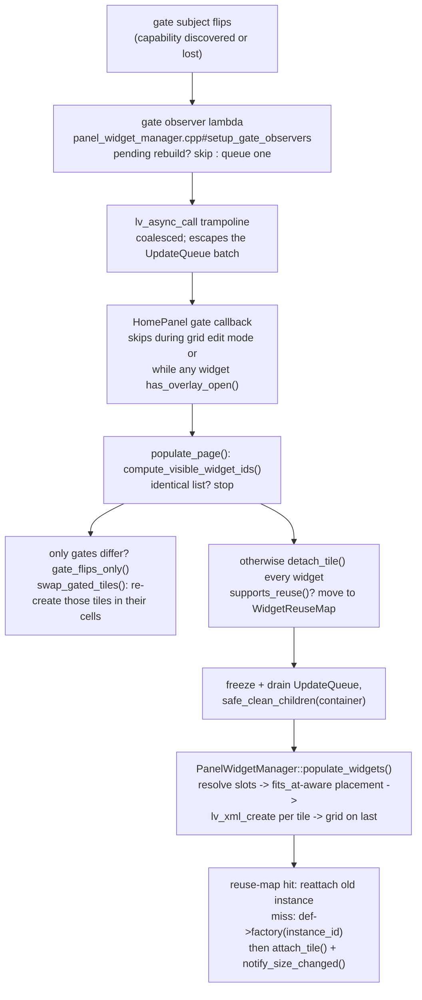
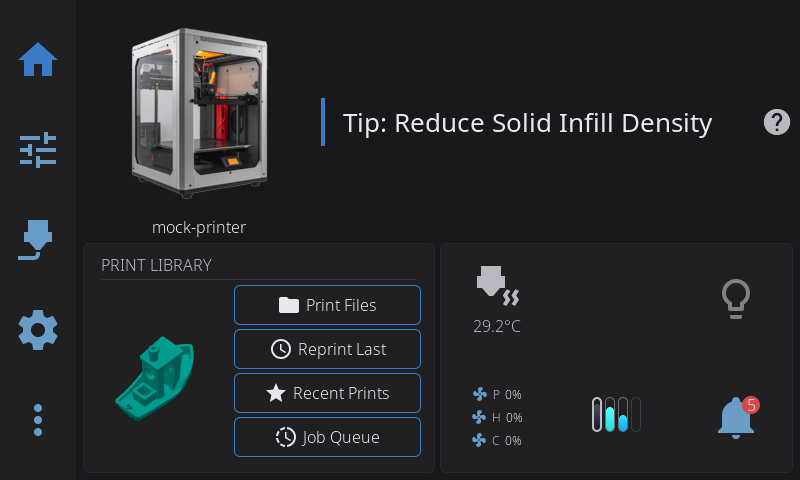

# 09 - Home panel widgets

The home panel is not one hardcoded screen: it is a grid of independently developed "widgets" (fan speeds, temperatures, camera, macros and 30-odd more), each pairing an XML component (appearance) with a C++ `PanelWidget` subclass (behavior and sizing). `PanelWidgetManager`, a `::instance()` singleton, owns the lifecycle: it reads the user's saved layout from disk, decides which widgets the connected hardware earns, places them on a responsive grid, and creates and attaches each one. When hardware, config, or the user in edit mode changes the layout, the manager does the least work that change needs: a gate flip re-creates only the flipped tiles, a move re-seats the built tiles in place, and only an id-list change tears the page down. Even then C++ instances are recycled, so expensive state (a live camera stream) never restarts.

Counts, recounted 2026-10-09 (method included so you can re-run it):

| What | Count | Method |
|------|-------|--------|
| Built-in widget defs | 39 (38 + `camera` behind `HELIX_HAS_CAMERA`) | rows of `s_widget_defs` (`src/ui/panel_widget_registry.cpp#"s_widget_defs = {"`) |
| `PanelWidget` subclasses | 33, counting the `TiledPanelWidget` base; plus `LuaPanelWidget` for plugin tiles | `rg -l 'public (Tiled)?PanelWidget' include src -g '*.h' -g '*.cpp'` |
| XML components | 42 | `ls ui_xml/components/panel_widget_*.xml \| wc -l` |
| Factory-less (pure XML) defs | 1 | `ams`; `register_tile_widgets()` gives every other def without a class a sizing-only `TileWidget` |
| Hardware-gated defs | 13 (13 distinct gate subjects) | defs with a non-null `hardware_gate_subject` in the table below |
| Multi-instance defs (`base_id:N`) | 7 | `power_device`, `led`, `fan_stack`, `fan`, `thermistor`, `temp_graph`, `favorite_macro` (`multi_instance = true`) |

One class can serve several defs: `HeaterTempWidget` is instantiated three ways with different configs (`temperature`, `bed_temperature`, `chamber_temperature`, `src/ui/panel_widgets/heater_temp_widget.cpp#register_heater_temp_widget`). Two implementations live outside `panel_widgets/` ([`src/ui/widgets/power_device_widget.cpp`](../../../src/ui/widgets/power_device_widget.cpp), [`src/ui/widgets/favorite_macro_widget.cpp`](../../../src/ui/widgets/favorite_macro_widget.cpp)), and plugin tiles come from `src/plugin/`: the registry does not care where the factory lives.

```mermaid
flowchart TB
    GATE["gate subject flips<br/>(capability discovered or lost)"]
    OBS["gate observer lambda<br/>panel_widget_manager.cpp#setup_gate_observers<br/>pending rebuild? skip : queue one"]
    ASYNC["lv_async_call trampoline<br/>coalesced; escapes the UpdateQueue batch"]
    CB["HomePanel gate callback<br/>skips during grid edit mode or<br/>while any widget has_overlay_open()"]
    SNAP["populate_page(): compute_visible_widget_ids()<br/>identical list? stop"]
    FLIP["only gates differ? gate_flips_only()<br/>swap_gated_tiles(): re-create those tiles in their cells"]
    DET["otherwise detach_tile() every widget<br/>supports_reuse()? move to WidgetReuseMap"]
    CLEAN["freeze + drain UpdateQueue,<br/>safe_clean_children(container)"]
    POP["PanelWidgetManager::populate_widgets()<br/>resolve slots -> fits_at-aware placement -><br/>lv_xml_create per tile -> grid on last"]
    RE["reuse-map hit: reattach old instance<br/>miss: def->factory(instance_id)<br/>then attach_tile() + notify_size_changed()"]
    GATE --> OBS --> ASYNC --> CB --> SNAP --> FLIP
    SNAP --> DET --> CLEAN --> POP --> RE
```

## Key files

| File | Role |
|------|------|
| [`include/panel_widget.h`](../../../include/panel_widget.h) | `PanelWidget` base class (the widget contract), `PANEL_WIDGET_TILE_FLAG` and the LVGL user-flag ledger |
| [`include/panel_widget_registry.h`](../../../include/panel_widget_registry.h) | `PanelWidgetDef` (id, icon, spans, gate subject, factory), `RuntimeWidgetDef` for plugin tiles, registry free functions |
| [`src/ui/panel_widget_registry.cpp`](../../../src/ui/panel_widget_registry.cpp) | The built-in def table, catalog categories, runtime (plugin) def slots, `init_widget_registrations()`, `:N` suffix resolution |
| [`include/panel_widget_manager.h`](../../../include/panel_widget_manager.h) | `PanelWidgetManager` singleton API: populate, gate-flip swap, in-place re-seat, gate observers, rebuild callbacks, shared resources |
| [`src/ui/panel_widget_manager.cpp`](../../../src/ui/panel_widget_manager.cpp) | The coordinator: config load, gate checks, grid placement, tile creation, attach, reuse, coalesced rebuilds |
| [`src/ui/panel_widgets/tiled_panel_widget.h`](../../../src/ui/panel_widgets/tiled_panel_widget.h), [`tile_sizing.h`](../../../src/ui/panel_widgets/tile_sizing.h) | The adaptive-sizing base most icon tiles derive from: a per-instance `TileSizing` that measures content, answers `fits_at()` and publishes the layout verdict as subjects |
| [`src/ui/panel_widgets/tile_widget.cpp`](../../../src/ui/panel_widgets/tile_widget.cpp) | `TileWidget` and `register_tile_widgets()`: sizing-only instances for tiles with no class of their own |
| [`include/panel_widget_config.h`](../../../include/panel_widget_config.h) | `PanelWidgetConfig` / `PanelWidgetEntry`: per-printer layout JSON (pages, enabled flags, grid positions, per-widget config) |
| [`src/ui/ui_panel_home.cpp`](../../../src/ui/ui_panel_home.cpp) | `HomePanel`: page carousel, per-page containers, the rebuild and re-seat paths that feed the manager |
| `src/ui/panel_widgets/` | Most widget implementations (one class per file pair, headers alongside) plus the shared layout helpers |
| [`src/ui/panel_widgets/fan_stack_widget.cpp`](../../../src/ui/panel_widgets/fan_stack_widget.cpp) | Version-observer rebinding, two XML components, edit-mode configure picker |
| [`src/ui/panel_widgets/camera_widget.cpp`](../../../src/ui/panel_widgets/camera_widget.cpp) | The reuse rationale: MJPEG stream that must survive LVGL tree rebuilds |
| [`src/plugin/lua_panel_widget.cpp`](../../../src/plugin/lua_panel_widget.cpp) | `LuaPanelWidget`: forwards the lifecycle to a plugin's `helix.widget` hooks ([`../PLUGIN_DEVELOPMENT.md`](../PLUGIN_DEVELOPMENT.md)) |
| [`include/grid_edit_mode.h`](../../../include/grid_edit_mode.h) | Drag-to-rearrange edit mode; identifies tiles by `lv_obj_set_name` and commits through relayout or rebuild callbacks |
| [`src/ui/page_scroll_auto_inject.cpp`](../../../src/ui/page_scroll_auto_inject.cpp) | Consumer of `PANEL_WIDGET_TILE_FLAG`: page-level tree walks stop at a tile |

## How it works

### The contract: PanelWidget, the registry, and factories

`PanelWidget` (`include/panel_widget.h#PanelWidget`) has one load-bearing idea: the C++ object outlives the LVGL objects it wires. Hooks, in call order:

- Constructor: anything whose subject *names* the XML binds to (a `TileSizing`) is built here, because the parser permanently skips a binding whose subject does not exist yet. `xml_attrs()` hands those per-instance names to `lv_xml_create()`.
- `init_subjects()`: type-wide subjects, registered per def as a `SubjectInitFn` and fired once by `PanelWidgetManager::init_widget_subjects()` (`src/ui/panel_widget_manager.cpp#init_widget_subjects`).
- `set_config(json)`: per-widget config from the saved layout, after factory creation, before `get_component_name()` and attach.
- `get_component_name()`: defaults to `panel_widget_<id>`; override to pick between XML layouts (`src/ui/panel_widgets/fan_stack_widget.cpp#get_component_name`).
- `fits_at(width_px, height_px)`: whether the widget can draw its identifying content in that box. Placement and edit mode's resize clamp both ask before granting a span; it must be monotonic. `TiledPanelWidget` answers it from its `TileSizing`.
- `attach(widget_obj, parent_screen)`: wire observers, animations and callbacks onto the fresh tree. The manager never calls it directly: `attach_tile()` binds the root (the `user_data` back-pointer `panel_widget_from_event<T>` reads) and then calls it, so it runs again on the *same* instance each time a rebuild hands it a new tree.
- `detach()`: release observers, null every LVGL pointer; reached through `detach_tile()`. For reusable widgets this must be lightweight (below).
- `on_size_changed(colspan, rowspan, width_px, height_px)`: adapt content to the cell. The manager calls `notify_size_changed()`, which records the grant first, so a widget whose contents arrive later (tools discovered, sensors registering) can call `relayout_for_granted_size()` after its own rebuild.
- `on_activate()` / `on_deactivate()`: page and carousel visibility, fired by `HomePanel`. `on_edit_mode_exited()`: re-apply any runtime clickability after edit mode restores `CLICKABLE`.
- `supports_reuse()` (default `true`), `has_overlay_open()` (rebuilds must not run while a widget shows a fullscreen overlay), `has_edit_configure()` / `on_edit_configure()` (the gear in edit mode), `save_widget_config(json)` (needs `panel_id_`, set by the manager before attach), `record_interaction()` (telemetry), and `install_delete_hook()` / `on_hooked_root_deleted()` for a tree deleted raw rather than through detach.

The registry is a vector of `PanelWidgetDef` structs (`src/ui/panel_widget_registry.cpp#"s_widget_defs = {"`): display metadata for the widget catalog (name, icon, description, `WidgetCategory`), grid geometry in tracks (default/min/max spans, half-cell support; a track is half a cell), the hardware gate subject and hint, and two function slots, `factory(instance_id)` and `init_subjects`. `get_all_widget_defs()` appends active plugin defs (`register_runtime_widget_def()`, called by `PluginHost` for each widget a plugin's manifest declares) under the `Plugins` category, and `runtime_widget_generation()` changes whenever that set does. A def with `factory == nullptr` is a pure-XML widget the manager creates with no C++ instance; `ams` is the only one, and the manager pushes its mini-status width by hand (`src/ui/panel_widget_manager.cpp#announce_tile_size`).

Factories are installed at runtime, never by static initializers: `init_widget_registrations()` (`src/ui/panel_widget_registry.cpp#init_widget_registrations`) calls each widget's `register_*_widget()` once, on first `init_widget_subjects()`, because factories capture runtime singletons (`get_printer_state()`) and shared resources. Each `register_*` function also registers its XML event callbacks at the same moment, before any XML is parsed: an XML file referencing an unregistered callback name silently does nothing. `register_tile_widgets()` runs last so it only claims tiles no class took. Multi-instance defs get clones addressed as `fan_stack:1`, `thermistor:2`, and `find_widget_def()` strips the `:N` suffix to find the base def (`src/ui/panel_widget_registry.cpp#find_widget_def`).

The built-in catalog (gate subjects from the def table; "-" means always available):

| Widget ID | C++ class | Gate subject |
|-----------|-----------|--------------|
| `printer_image` | `PrinterImageWidget` | - |
| `print_status` | `PrintStatusWidget` | - |
| `shutdown` | `ShutdownWidget` | `platform_host_power_supported` |
| `lock` | `TileWidget` (sizing only) | - |
| `power_device` | `PowerDeviceWidget` (`src/ui/widgets/`) | `power_device_count` |
| `network` | `NetworkWidget` | - |
| `firmware_restart` | `TileWidget` (sizing only) | - |
| `tool_switcher` | `ToolSwitcherWidget` | - |
| `led` | `LedWidget` | `led_controllable` |
| `led_controls` | `LedControlsWidget` | `led_has_devices` |
| `fan_stack` | `FanStackWidget` | - |
| `fan` | `FanWidget` | - |
| `temperature` | `HeaterTempWidget` (nozzle config) | - |
| `nozzle_temps` | `NozzleTempsWidget` | - |
| `bed_temperature` | `HeaterTempWidget` (bed config) | - |
| `chamber_temperature` | `HeaterTempWidget` (chamber config) | `printer_has_chamber` |
| `temp_stack` | `TempStackWidget` | - |
| `thermistor` | `ThermistorWidget` | `temp_sensor_count` |
| `temp_graph` | `TempGraphWidget` | - |
| `preheat` | `PreheatWidget` | - |
| `ams` | *pure XML* (mini-status width set by the manager) | `ams_slot_count` |
| `bypass` | `BypassWidget` | `ams_supports_bypass` |
| `active_spool` | `ActiveSpoolWidget` | - |
| `filament` | `FilamentSensorWidget` | `filament_sensor_count` |
| `humidity` | `TileWidget` (sizing only) | `humidity_sensor_count` |
| `width_sensor` | `TileWidget` (sizing only) | `width_sensor_count` |
| `favorite_macro` | `FavoriteMacroWidget` (`src/ui/widgets/`) | - |
| `macros` | `MacrosWidget` | - |
| `motion` | `MotionWidget` | - |
| `clock` | `ClockWidget` | - |
| `control_buttons` | `ControlButtonsWidget` | - |
| `job_queue` | `JobQueueWidget` | - |
| `tips` | `TipsWidget` | - |
| `clog_detection` | `ClogDetectionWidget` (the FlowGuard bar) | `clog_meter_mode` |
| `filament_buffer` | `FilamentBufferWidget` | `buffer_present` |
| `print_stats` | `PrintStatsWidget` | - |
| `gcode_console` | `GCodeConsoleWidget` | - |
| `camera` | `CameraWidget`, `HELIX_HAS_CAMERA` builds only | - |
| `notifications` | `TileWidget` (sizing only) | - |

That catalog, rendered: the stock grid a fresh mock instance builds from the [`assets/config/default_layout.json`](../../../assets/config/default_layout.json) anchors, with the print-library and status tiles at the top and everything else auto-placed below:

### populate_widgets(): from saved layout to attached grid

`PanelWidgetManager::populate_widgets(panel_id, container, page_index, reuse)` (`src/ui/panel_widget_manager.cpp#populate_widgets`) is the full build path; `HomePanel::populate_page()` is its caller of note.

1. **Resolve slots.** For each enabled entry in the page's `PanelWidgetConfig`, `resolve_slot()` looks up the def, checks its gate subject (0 means the tile renders at 40% opacity with a type icon and badge, but keeps its cell), and takes the C++ instance from the reuse map or `def->factory(entry.id)`; `set_panel_id` + `set_config` + `get_component_name` follow. A throwing factory or malformed config skips one tile, not the dashboard (`src/ui/panel_widget_manager.cpp#"configuration failed"`).
2. **Short-circuit.** The ordered, gate-suffixed ID list (`"fan_stack"` vs `"fan_stack~gated"`) is compared with the one cached from the previous populate; identical with children present means return `{}` untouched (`src/ui/panel_widget_manager.cpp#"Widget list unchanged"`).
3. **Place.** Every `TileSizing` is first handed the measured track geometry. Anchored widgets (explicit col/row) are placed first, their spans clamped to the grid and then grown until `fits_at()` accepts (`grow_span_to_fit`); the rest are auto-placed by `GridLayout`, authored spans first and, if not everyone fits, a minimum-first pass that grows survivors into leftover cells (`src/ui/panel_widget_manager.cpp#"run_auto_pass = [&]"`). A widget that cannot fit the grid at all is disabled with a notification; one that fits but finds no free cell is only evicted from its position (`disable_unplaceable` vs `evict_for_full_grid`, #1216). Positions are written back, but never a span shrunk or grown for this screen, and never a layout computed while a connected printer reports Klipper not READY (`src/ui/panel_widget_manager.cpp#"Never persist a layout computed"`).
4. **Create and attach.** Card backgrounds are laid first (merged rectangles behind adjacent tiles), then per placed widget: `lv_xml_create(container, component_name, xml_attrs())`, `lv_obj_set_grid_cell`, `lv_obj_set_name(widget_id)` (how edit mode identifies tiles), `PANEL_WIDGET_TILE_FLAG`, the gated treatment or `attach_tile()`, and `announce_tile_size()`. The grid layout is activated *last*, after all children exist: an `attach()` that forces layout over a half-built grid walks a freed descriptor (#983, `src/ui/panel_widget_manager.cpp#"lv_obj_set_layout(container, LV_LAYOUT_GRID);"`). Grid descriptor arrays are owned per container (`install_grid_descriptors`), because LVGL stores the raw pointers.

`HomePanel` owns the page dimension: a carousel of per-page containers (`src/ui/ui_panel_home.cpp#build_carousel`), each populated independently, with `on_activate()`/`on_deactivate()` fanned to the active page's widgets on page change (`src/ui/ui_panel_home.cpp#on_page_changed`). The carousel is built in `finalize_setup()`, after the first-run wizard, so a fresh install never persists a layout computed before its hardware was discovered.

### Rebuilds: four paths, from cheapest to full

Every page build costs seconds of UI thread on slow boards, so `HomePanel` picks the narrowest path the change allows:

- **Gate observers.** `setup_gate_observers(panel_id, rebuild_cb)` (`src/ui/panel_widget_manager.cpp#setup_gate_observers`) subscribes to every distinct `hardware_gate_subject` in the registry, so a new gated widget needs no manager edit. A firing does not rebuild inline: it sets `pending` on a stable per-panel `GateRebuildSlot` and queues one `lv_async_call` trampoline, so N gates flipping in one tick give one rebuild, and the rebuild escapes the UpdateQueue batch (chapter 03). HomePanel's callback skips while grid edit mode is active or any widget has an overlay open (`src/ui/ui_panel_home.cpp#setup_widget_gate_observers`), then calls `populate_page()` on every page. There, `gate_flips_only()` recognises a change that only flips gates and `swap_gated_tiles()` re-creates just those tiles in the cells they hold; anything else falls through to a full populate.
- **Config changes.** `notify_config_changed(panel_id)` marks the cached `PanelWidgetConfig` dirty and fires the registered rebuild callback (settings toggle, widget catalog). HomePanel first tries `reseat_widgets()`: if every page holds the same widgets with the same config and only placement differs, `reseat_tiles()` moves the built tiles in place; otherwise it repopulates. `get_widget_config()` loads once, so code that mutates layout JSON directly must route through `notify_config_changed()` or the cache serves stale data (#804). A plugin loading or unloading widget defs calls `notify_widget_defs_changed()`, which reloads every layout and queues each panel's rebuild through its gate slot.
- **Edit mode.** A committed move, swap or resize goes through `GridEditMode`'s relayout callback to `relayout_tiles()`, which re-seats the touched tiles and tells a resized one its new span through `notify_size_changed()`; when it refuses (a tile with no placed entry, a span this grid had to change, a resized widget that cannot draw at its new size), the rebuild callback runs `populate_widgets()` on the next tick. A change to the page set rebuilds the whole carousel through `HomePanel::on_edit_pages_changed`, landing where `helix::page_set_landing()` says. [`../HOME_EDIT_MODE.md`](../HOME_EDIT_MODE.md) has the page lifecycle.
- **Full populate.** `HomePanel::populate_page()` (`src/ui/ui_panel_home.cpp#populate_page`) calls `detach_tile()` on every widget on the page; ones returning `supports_reuse()` move into a `WidgetReuseMap` (id to `unique_ptr<PanelWidget>`); the tree is cleaned with `safe_clean_children` under an UpdateQueue freeze+drain (a synchronous `lv_obj_clean` batched with sibling deletes corrupts the event list, #776/#834); then `populate_widgets()` receives the map, and each widget either gets its old instance re-attached to the fresh tree ("Reusing widget instance" in the debug log) or is built from its factory. A changed `runtime_widget_generation()` always takes this path, since the factories behind unchanged ids now build for a different plugin runtime.

The contract that makes reuse safe (`include/panel_widget.h#PanelWidget/supports_reuse`): `detach()` clears LVGL pointers and observers only; the destructor does full cleanup; `attach()` must work on a previously detached instance. The motivating case is `CameraWidget` (`src/ui/panel_widgets/camera_widget.cpp#detach`): its MJPEG stream keeps running across rebuilds, and frame callbacks arriving in the detach-to-reattach gap find `camera_image_ == nullptr` and no-op. `LuaPanelWidget` opts out, because a plugin reload can leave an instance speaking for a dead runtime.

One trap the recycle path sets: size is re-announced after every re-attach, but only applied if the widget actually applies it. A stateful early-return inside `on_size_changed` (`if (mode == last_mode_) return;`) skips the apply on a recycled instance whose size did not change, and the fresh XML component sits at its defaults. Either re-apply from `attach()` too, or key the early-return on something the new tree invalidates.

### Version-observer self-binding: widgets rebind themselves

Interactive widgets do not wait for anyone to tell them hardware landed. In `attach()` they observe a **version subject** (an integer that bumps whenever the relevant hardware list changes) and on every bump call their own `bind_*()` method, which resets the per-item observers and rebuilds them against the current list. Reconnection and rediscovery re-bind automatically; there is no panel-level dispatch.

- `FanStackWidget`: `setup_common_observers()` subscribes to `printer_state_.fan_state().get_fans_version_subject()`; each bump calls `bind_fans()` (`src/ui/panel_widgets/fan_stack_widget.cpp#bind_fans`), which re-classifies the part/hotend/aux fans and rebinds one speed observer per fan via `bind_fan_observer()` with `SubjectLifetime` and the widget's lifetime token (chapter 02).
- `LedWidget`: observes `LedController`'s config version and state version subjects in `attach()`; a config bump calls `bind_led()` against the currently selected strips (`src/ui/panel_widgets/led_widget.cpp#attach`).
- `PowerDeviceWidget`: in "all devices" mode the same shape keyed on the `PowerDeviceCount` capability subject, since the count itself changes on discovery (`src/ui/widgets/power_device_widget.cpp#attach`).

Two subtleties both families hit. First, `observe<int>` defers its initial fire through `queue_update`, and `populate_widgets()` runs under an UpdateQueue freeze, so that fire can be late or dropped. Widgets read the current value explicitly after binding: `bind_fan_observer()` calls `on_update(lv_subject_get_int(subject))` itself, and `LedWidget::attach()` calls `bind_led()` directly. Second, every observer callback re-checks the lifetime token (`token.expired()`) before touching `this`: detach invalidates the token, and a queued callback may be the very thing being drained.

## Patterns & gotchas

- **LVGL user-flag ledger: check before claiming a bit.** Four bits exist; three are taken:

  | Flag | Owner | Meaning |
  |------|-------|---------|
  | `LV_OBJ_FLAG_USER_1` | *free* | reachable from XML like `USER_2` |
  | `LV_OBJ_FLAG_USER_2` | `include/ui_utils.h#EDIT_CLICK_SUPPRESSED_FLAG` | objects whose `CLICKABLE` edit mode removed, so it restores exactly those |
  | `LV_OBJ_FLAG_USER_3` | `include/panel_widget.h#PANEL_WIDGET_TILE_FLAG` | home widget tile root |
  | `LV_OBJ_FLAG_USER_4` | `src/ui/ui_sound_preview_overlay.cpp#populate_buttons` | suppress the button tap sound, read in `src/ui/ui_button.cpp#button_clicked_sound_cb` |

  helix-xml's `flag_to_enum()` maps only `user_1`/`user_2` for `<bind_flag_if_*>`, so `USER_3` is the one no binding can clear. The tile mark is set at the one creation site so page-level tree walks can stop at a tile; `PageScrollAutoInject` is the consumer ([`../PAGE_SCROLL_BUTTONS.md`](../PAGE_SCROLL_BUTTONS.md)). A flag is a global namespace, so never borrow one as a private guard; an idempotent remove-before-add callback needs no bit at all (`src/ui/ui_ams_detail.cpp#ams_detail_update_tray`).
- **Register factories and XML callbacks in `register_*_widget()`, never at static init.** `init_widget_registrations()` exists to sequence this. An XML `event_cb` referencing a never-registered callback is a silent no-op.
- **Subjects a tile's XML binds to exist before `lv_xml_create()`.** Per-instance ones come from the constructor through `xml_attrs()`; registering them in `attach()` leaves the binding permanently skipped with nothing in the log.
- **A reused instance re-runs `set_config`, `attach`, and the size announcement, nothing else.** Anything applied imperatively outside those (or a subject binding) goes stale on the recycled component. `attach()` must tolerate a detached instance with cleared pointers.
- **A widget that rebuilds its own children after the grid sized it** calls `relayout_for_granted_size()` at the end of that rebuild, or the new objects keep their XML defaults (#1490). An override of `on_size_changed()` works from its parameters, not the `granted_*()` accessors.
- **`fits_at()` must be monotonic.** The clamp walks outward and takes the first accepting span.
- **`populate_widgets()` returns `{}` for conditions other than failure**: a re-entrant call while `populating_`, or the unchanged-list short-circuit. By then `HomePanel` has already detached widgets and cleaned the container, which is why `populate_page()` runs its own snapshot comparison before tearing anything down.
- **Never re-read gate subjects after populate and cache the result.** A capability flip that arrives mid-build gets baked into the cache and the next rebuild short-circuits with the widget stuck gated. `populate_page()` snapshots IDs once at entry for this reason.
- **Mutating layout JSON behind the manager's back?** You owe it a `notify_config_changed(panel_id)` (#804). Printer switches are handled for you: the manager registers a `PrinterCacheRegistry` invalidator that calls `clear_all_panel_configs()`, because layouts live under `/printers/<active>/panel_widgets/<panel>`. In crash-loop safe mode layout edits are refused (`PanelWidgetManager::refuse_layout_edit`).
- **`save_widget_config()` warns and no-ops without a `panel_id`**: it is set by the manager before attach, so don't call it from a constructor. A save also bumps `widget_config_saves()`, which makes the next config rebuild repopulate instead of re-seating.
- **Renaming or re-polarizing a per-widget config key needs two migrations.** The parser's own tolerant fallback (`favorite_macro_config_from_json`) covers configs that never reach a versioned migration (preset assets under `assets/config/panel_widgets/<preset>/`, hand-edited files, an imported widget config), while a `migrate_vN_to_vN+1` in [`src/system/config_migrations.cpp`](../../../src/system/config_migrations.cpp) sheds the old key from the user's settings. `migrate_v22_to_v23` is the worked example: per-widget config sits four levels deep under `printers/<id>/panel_widgets/<panel>/pages[]/widgets[]/config`, and the migration descends it by hand.
- **Multi-instance IDs carry a `:N` suffix** (`fan_stack:1`). Config, telemetry and logging see the full ID; the registry strips it for def lookup.
- **Don't fight the grid activation order.** Children first, grid layout last (#983).
- **The camera widget is compiled only with `HELIX_HAS_CAMERA`**: its def, registration and component sit behind the same guard.

## Going deeper

- [`../PANEL_WIDGET_GUIDE.md`](../PANEL_WIDGET_GUIDE.md) - authoring a widget: registry def, class, XML, and the measured-layout pattern.
- [`../LAYOUT_SYSTEM.md`](../LAYOUT_SYSTEM.md) - the grid itself: `GridLayout` track math, half-cell tracks, breakpoint column counts, preset seed layouts, span authoring.
- [`../HOME_EDIT_MODE.md`](../HOME_EDIT_MODE.md) - edit mode: the session over a page, grab and click rules, the events that end a gesture, cross-page drag and the page lifecycle.
- [`../PAGE_SCROLL_BUTTONS.md`](../PAGE_SCROLL_BUTTONS.md) - the `PANEL_WIDGET_TILE_FLAG` consumer: why the chevron gutter must not descend into a tile.
- [`../PLUGIN_DEVELOPMENT.md`](../PLUGIN_DEVELOPMENT.md) - plugin-declared widgets and their Lua hooks.
- [`02-subjects-dataflow.md`](02-subjects-dataflow.md) - the subject/observer machinery every widget binds with.
- [`03-threading-lifetime.md`](03-threading-lifetime.md) - why the rebuild path freezes and drains the UpdateQueue, why deletes are deferred, and the lifetime-token checks.
- [`06-discovery-capabilities.md`](06-discovery-capabilities.md) - where the gate subjects come from and who bumps them.
- [`../PRINT_CONTROL_BUTTONS.md`](../PRINT_CONTROL_BUTTONS.md) - one widget end to end: owned subjects, a pure view function, the optimistic pending-action machine behind `control_buttons`.
- [`../MACROS_PANEL.md`](../MACROS_PANEL.md) - the `macros` / `favorite_macro` widgets.
- [`../CONTRIBUTOR_GOTCHAS.md`](../CONTRIBUTOR_GOTCHAS.md) - symptom-indexed traps; "No subject was found" and empty-widget entries are this chapter's ordering rules failing.
- [`08-panels-navigation.md`](08-panels-navigation.md) - `HomePanel` as a root panel and how it integrates with navigation.

## Guided code tour

Read in this order; about 30 minutes total.

1. `include/panel_widget.h#PANEL_WIDGET_TILE_FLAG`: the flag ledger, then `include/panel_widget.h#PanelWidget`: read the hooks in order and note which run before XML creation and which after.
2. `include/panel_widget_registry.h#PanelWidgetDef`: every field is a decision the manager or the catalog makes somewhere.
3. `src/ui/panel_widget_registry.cpp#"s_widget_defs = {"`: the span triples, gate subjects, `multi_instance` column and the `HELIX_HAS_CAMERA` guard; then `init_widget_registrations()`, `get_all_widget_defs()` and `find_widget_def()` in the same file.
4. `src/ui/panel_widgets/tiled_panel_widget.h#"class TiledPanelWidget"` and `src/ui/panel_widgets/tile_sizing.h#"class TileSizing {"`: how most tiles size themselves, and why the sizing is built in the constructor.
5. `src/ui/panel_widget_manager.cpp#populate_widgets`: once top to bottom; `resolve_slot`, the `~gated` short-circuit key, the `fits_at` grow on anchors, the two auto-place policies, the write-back rules, the create/attach loop, grid-last activation.
6. `src/ui/panel_widget_manager.cpp#setup_gate_observers`: the registry walk, the `GateRebuildSlot` coalescing, and `clear_gate_observers()` canceling in-flight rebuilds.
7. `src/ui/ui_panel_home.cpp#populate_page`: the ID snapshot, the gate-flip swap, reuse-map extraction, freeze+drain+`safe_clean_children`; then `reseat_widgets()` and `relayout_edit_page()` beside it.
8. `include/panel_widget_config.h#PanelWidgetEntry` and the `PanelWidgetConfig` API around it: pages, `set_widget_config`, the preset-seed loader (`include/panel_widget_config.h#try_populate_from_preset_seed`).
9. `src/ui/panel_widgets/motion_widget.cpp#register_motion_widget`: the whole 59-line widget, the minimum viable `PanelWidget`.
10. `src/ui/panel_widgets/fan_stack_widget.cpp#register_fan_stack_widget`: then `attach_stack`, `bind_fans`, `bind_fan_observer` (note the manual initial-value read), and the version observer in `setup_common_observers`.
11. `src/ui/panel_widgets/led_widget.cpp#attach` through `bind_led()`: the second instance of the version-observer pattern.
12. `src/ui/panel_widgets/camera_widget.cpp#detach`: the lightweight contract in action, stream alive, pointers out.
13. `src/plugin/plugin_host.cpp#"bool PluginHost::load(PluginInfo& info)"`: how a manifest's widgets become runtime defs with a `LuaPanelWidget` factory.
14. [`include/grid_edit_mode.h`](../../../include/grid_edit_mode.h): the other half of the layout story; end here, and continue in [`../LAYOUT_SYSTEM.md`](../LAYOUT_SYSTEM.md) and [`../HOME_EDIT_MODE.md`](../HOME_EDIT_MODE.md).
