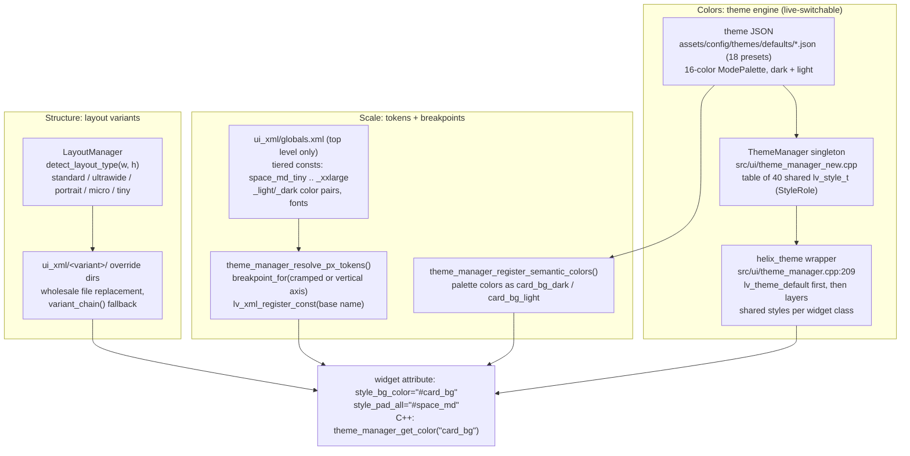
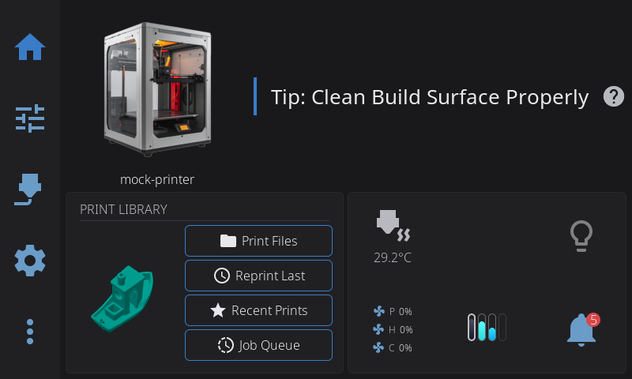
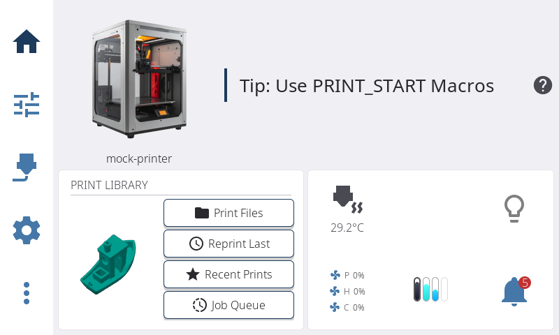

# 10 — Theme, tokens & layout

Every appearance value in HelixScreen resolves through one of two indirections: a **theme** (a named 16-color palette, switchable dark/light at runtime without recreating widgets) or a **token** (a named constant that resolves differently per screen size). A third system cuts across both: `LayoutManager` classifies the display's aspect ratio and swaps whole XML files from `ui_xml/<variant>/` directories. Themes control colors, tokens control scale, layouts control structure — three independent axes that combine freely, and together they are the reason one codebase renders acceptably from a 480x272 Ender panel to a 4K desktop window.

Counts, recounted 2026-08-17 (method included so you can re-run it):

| What | Count | Method |
|------|-------|--------|
| Theme presets shipped | 18 | `ls assets/config/themes/defaults/*.json \| wc -l` (nord, dracula, gruvbox, …) |
| Shared styles in the theme table | 40 | `StyleRole` entries before `COUNT` ([`include/theme_manager.h:71`](../../../include/theme_manager.h#L71)) |
| `theme_manager_get_color()` call sites | 409 | `rg -c 'theme_manager_get_color\(' src include \| awk -F: '{s+=$2} END {print s}'` |
| Breakpoint tiers | 7 | `UiBreakpoint` ([`include/ui_breakpoint.h:26`](../../../include/ui_breakpoint.h#L26)): Micro..XXLarge |
| Layout variants | 7 | `LayoutType` ([`include/layout_manager.h:10`](../../../include/layout_manager.h#L10)): standard, ultrawide, portrait, micro, micro_portrait, tiny, tiny_portrait |
| Variant dirs with files | 2 | `find ui_xml -maxdepth 1 -type d`: `micro/` (4 files), `portrait/` (4 files); `micro_portrait/` exists empty |
| globals.xml | 844 lines | `wc -l ui_xml/globals.xml` — tiered consts + illustration colors, no semantic palette |
| Top-level XML files the token scanner reads | 230 | `ls ui_xml/*.xml \| wc -l` — globals.xml plus 229 more, alphabetical last-wins |
| Hardcoded-color lint baseline | 34 | `HEX_BASELINE` in [`scripts/quality-checks.sh`](../../../scripts/quality-checks.sh) (ratchets down only) |

## Key files

| File | Role |
|------|------|
| [`include/theme_manager.h`](../../../include/theme_manager.h) | The whole public surface: `StyleRole`, `ThemeManager`, and every `theme_manager_*` free function |
| [`src/ui/theme_manager_new.cpp`](../../../src/ui/theme_manager_new.cpp) | `ThemeManager` singleton — the shared-style table and palette state |
| [`src/ui/theme_manager.cpp`](../../../src/ui/theme_manager.cpp) | Free functions: token discovery/registration, the `helix_theme` LVGL wrapper, `theme_manager_apply_theme()` |
| [`src/ui/style_configs.cpp`](../../../src/ui/style_configs.cpp) | 40 `configure_*` functions — one per `StyleRole`, writing palette colors into its style |
| [`include/ui_breakpoint.h`](../../../include/ui_breakpoint.h) | The canonical 7-tier breakpoint ladder (`Micro`..`XXLarge`) and `breakpoint_for()` |
| [`ui_xml/globals.xml`](../../../ui_xml/globals.xml) | Tiered `<px>`/`<str>`/`<color>` consts — the `globals` scope every `#token` resolves against |
| [`src/ui/theme_loader.cpp`](../../../src/ui/theme_loader.cpp) | JSON theme loading: user themes dir first, then the 18 shipped defaults |
| [`include/layout_manager.h`](../../../include/layout_manager.h) + [`src/layout_manager.cpp`](../../../src/layout_manager.cpp) | Aspect-ratio classification, `--layout` override, `resolve_xml_path()` / `variant_chain()` |
| [`assets/config/default_layout.json`](../../../assets/config/default_layout.json) | Home-grid anchor placements, keyed by layout variant then breakpoint |
| [`src/system/display_settings_manager.cpp`](../../../src/system/display_settings_manager.cpp) | Dark-mode toggle + theme selection; persists `/dark_mode` and `/display/theme` |
| [`src/generated/theme_token_table.cpp`](../../../src/generated/theme_token_table.cpp) | Compile-time token snapshot (ESP32); parity-gated by [`tests/unit/test_theme_token_table.cpp`](../../../tests/unit/test_theme_token_table.cpp) |
| [`src/ui/ui_theme_editor_overlay.cpp`](../../../src/ui/ui_theme_editor_overlay.cpp) | Live theme editor: previews via `theme_manager_apply_theme()`, saves user theme JSONs |
| [`scripts/check_responsive_token_scope.py`](../../../scripts/check_responsive_token_scope.py) | Gate: tiered tokens must live in top-level `ui_xml/*.xml` only |
| [`scripts/check_variant_parity.py`](../../../scripts/check_variant_parity.py) | Gate: variant XML must keep the base file's widget names, bindings, callbacks |

## How it works

### Tokens: two registries and one lookup rule

XML refers to a token by name — `style_pad_all="#space_md"`, `style_bg_color="#card_bg"` — and both writers and readers go through the same resolution:

- **Tiered px/str consts** (`space_md_tiny` … `space_md_xxlarge`) live in [`ui_xml/globals.xml`](../../../ui_xml/globals.xml) and any other **top-level** `ui_xml/*.xml` file — 230 of them at audit time, scanned in alphabetical order with **last-wins** precedence, so [`ams_tokens.xml`](../../../ui_xml/ams_tokens.xml) (and any file sorting after [`globals.xml`](../../../ui_xml/globals.xml)) can override a globals token by re-declaring its tiers. At startup and again on rotation, `theme_manager_resolve_px_tokens()` ([`src/ui/theme_manager.cpp:1085`](../../../src/ui/theme_manager.cpp#L1085)) picks the variant for the live display and registers it under the base name (`space_md`) via `lv_xml_register_const()`. C++ reads the same value with `theme_manager_get_spacing("space_md")` / `theme_manager_get_font("font_body")`.
- **Semantic palette colors** (`card_bg`, `primary`, `danger`, …) are *not* in globals.xml. They come from the active theme JSON: `theme_manager_register_semantic_colors()` ([`src/ui/theme_manager.cpp:1490`](../../../src/ui/theme_manager.cpp#L1490)) registers each palette slot as `name`, `name_light`, and `name_dark` consts. A second pass, `theme_manager_register_color_pairs()`, auto-discovers hand-authored `xxx_light`/`xxx_dark` pairs from top-level XML (e.g. `filament_idle_light/dark` in globals.xml).
- **One lookup rule for C++:** `theme_manager_get_color("card_bg")` for tokens — it tries `{base}_light`/`{base}_dark` and falls back to the bare name ([`src/ui/theme_manager.cpp:2575`](../../../src/ui/theme_manager.cpp#L2575)). `theme_manager_parse_hex_color()` parses a hex *literal* only; feeding it a token name returns black. 409 call sites in `src/` + `include/` follow this split, and two ratcheting gates keep it honest: [`scripts/quality-checks.sh`](../../../scripts/quality-checks.sh) fails on `lv_color_hex(0x…)` above a baseline (34, exemptions for theme_manager itself and procedural renderers), and [`scripts/check_hardcoded_pixels.py`](../../../scripts/check_hardcoded_pixels.py) caps raw pixel literals in XML (162).

The resolver's completeness rule: a token needs the full `_small`/`_medium`/`_large` triplet to register at all — anything shorter is an incomplete set, left unregistered rather than guessed at (`theme_manager_validate_constant_sets()` warns about these). The outer tiers (`_micro`, `_tiny`, `_xlarge`, `_xxlarge`) are optional and fall back inward toward `_small`/`_large` when absent. One token has its own ladder: `nav_width` keys off horizontal resolution (with vertical-resolution and ultrawide exceptions) via `nav_width_suffix()`, because the nav bar is the widget whose width tracks the *long* axis. Overlay geometry is *computed* from tokens at push time rather than declared — `compute_overlay_widths()` / `compute_overlay_heights()` ([`include/theme_manager.h:177`](../../../include/theme_manager.h#L177)) spend nav-bar space and the transient-gap on whichever axis the nav bar occupies, landscape or portrait.

Discovery is deliberately **top-level-only**: `theme_manager_find_xml_files()` skips subdirectories, so a responsive token declared in `ui_xml/components/` or `ui_xml/portrait/` never registers, and every `#token` referencing it silently resolves to nothing (#1211). Recursing would be worse — alphabetical last-wins would let a portrait-only `nav_width_small` shadow the base token globally. [`scripts/check_responsive_token_scope.py`](../../../scripts/check_responsive_token_scope.py) makes the constraint loud instead of silent.

Follow one attribute end to end — `style_pad_all="#space_md"` on a card:

1. globals.xml declares the ladder: `space_md_tiny=6`, `space_md_small=8`, `space_md_medium=10`, `space_md_large=12`, `space_md_xlarge=16`, `space_md_xxlarge=20` ([`ui_xml/globals.xml:63`](../../../ui_xml/globals.xml#L63)). No bare `space_md` exists anywhere in XML — the base name is C++-registered only.
2. At startup, `theme_manager_resolve_px_tokens()` scans every top-level `ui_xml/*.xml` for those suffixed names, computes the cramped-axis suffix for the live display (an 800x480 panel → min dim 480 → `Medium` → `"_medium"`), and registers `space_md = 10`.
3. The XML parser resolves `#space_md` against the `globals` scope at widget-creation time — an unknown const is an LV_LOG_WARN and the property is *silently skipped*, which is why typo'd token names produce unstyled widgets rather than errors.
4. On rotation the same resolver runs again with the new geometry and `lv_xml_update_const()` swaps the value in place; already-created widgets pick it up on their next layout pass.
5. C++ that needs the same number calls `theme_manager_get_spacing("space_md")` — same registry, same answer, never a parallel constant.

This is the token mandate from chapter 01 made concrete: colors via `theme_manager_get_color("card_bg")` (never `lv_color_hex(0x…)`), spacing via `#space_*` attributes (never raw integers), typography via the font tokens (`font_heading`/`font_body`/`font_small` — or the `<text_heading>`/`<text_body>`/`<text_small>` widgets that carry them). A hardcoded value works on the panel it was tuned on and is wrong on every other size; a token is the only value that survives the 480x272-to-4K range this app ships on. The exceptions are measured layout and computed fonts in C++ (`decide_nozzle_layout()`-style code that must pixel-measure at runtime) — see chapter 01's structural-exceptions table.

Typography rides the same machinery with one extra indirection: font tokens are tiered `<string>` consts whose values are *font names* — `font_heading_small=noto_sans_20`, `font_heading_medium=noto_sans_26`, … ([`ui_xml/globals.xml:371`](../../../ui_xml/globals.xml#L371)). `theme_manager_register_responsive_fonts()` ([`src/ui/theme_manager.cpp:1316`](../../../src/ui/theme_manager.cpp#L1316)) discovers them from top-level XML with the same required-triplet rule and registers the base name; `theme_manager_get_font("font_heading")` returns the `lv_font_t*`, and `theme_manager_size_to_font_token()` maps the xs/sm/md/lg size vocabulary onto the token names. The `<text_heading>`/`<text_body>`/`<text_small>` widgets (chapter 01) are thin wrappers over these tokens.

All of these consts live in the `globals` scope — the app-wide namespace every binding falls back to (chapter 01 covers the scope system and its XML-declared vs C++-registered ownership split). A token name is therefore also a subject of the naming rule: one flat namespace, first-write-wins, so collisions with widget or subject names are silent.

On ESP32 the XML files ship as a read-only frogfs image, so tokens are compiled in: [`src/generated/theme_token_table.cpp`](../../../src/generated/theme_token_table.cpp) (regenerate with `make regen-tokens` from [`scripts/gen_theme_tokens.py`](../../../scripts/gen_theme_tokens.py)) is the table, enabled by [`theme_token_table_runtime.cpp`](../../../src/ui/theme_token_table_runtime.cpp) (`HELIX_TOKEN_TABLE=1` forces it on elsewhere), and a unit test fails the build if the compiled table drifts from what the runtime scanner would parse. Every other platform parses XML live — editing [`ui_xml/globals.xml`](../../../ui_xml/globals.xml) and relaunching adjusts tokens without a rebuild.

### The theme engine: shared styles + the `helix_theme` wrapper

A theme is a JSON file with `dark` and/or `light` 16-color `ModePalette`s plus non-color properties (border radius/width, shadow). The 16 slots are semantic and fixed — `screen_bg`, `overlay_bg`, `card_bg`, `elevated_bg`, `border`, `text`, `text_muted`, `text_subtle`, `primary`, `secondary`, `tertiary`, `info`, `success`, `warning`, `danger`, `focus` ([`include/theme_loader.h:54`](../../../include/theme_loader.h#L54)) — which is exactly the set `theme_manager_get_color()` can resolve. A theme cannot invent new color names; it fills the slots. [`theme_loader.cpp`](../../../src/ui/theme_loader.cpp) loads by name — the user's config dir `themes/` first, then `assets/config/themes/defaults/`. The active name comes from `/display/theme` in settings.json, overridable with the `HELIX_THEME` env var for testing and screenshots ([`src/ui/theme_manager.cpp:1682`](../../../src/ui/theme_manager.cpp#L1682)). Single-mode themes are legal; `ThemeModeSupport` records which.

Two cooperating pieces apply it, both behind [`theme_manager.h`](../../../include/theme_manager.h):

- **`ThemeManager`** ([`src/ui/theme_manager_new.cpp`](../../../src/ui/theme_manager_new.cpp)) owns a fixed table of 40 shared `lv_style_t` objects, one per `StyleRole` (`Card`, `ButtonPrimary`, `SeverityDanger`, …), each configured by a `configure_*` function in [`style_configs.cpp`](../../../src/ui/style_configs.cpp). Widgets add these styles *by reference* — nobody copies palette colors into private styles.
- **The `helix_theme` wrapper** ([`src/ui/theme_manager.cpp:209`](../../../src/ui/theme_manager.cpp#L209)) is the bridge into LVGL's own theming. Its apply callback (`helix_theme_apply`, [`src/ui/theme_manager.cpp:562`](../../../src/ui/theme_manager.cpp#L562)) runs for every widget created: first it calls through to `lv_theme_default_init()`'s theme for base padding and tracks, then layers the appropriate shared styles per widget class — buttons get `Button` + `Pressed` + `Focused`, textareas get `InputBg`, sliders get track/indicator/knob styles, dropdowns get contrast-selected list styling. `theme_manager_init()` (called from `Application`, [`src/application/application.cpp:1617`](../../../src/application/application.cpp#L1617)) wires it up with `lv_theme_set_apply_cb()`.

Live switching is the payoff, and `theme_manager_apply_theme(theme, dark)` is the single entry point ([`src/ui/theme_manager.cpp:1966`](../../../src/ui/theme_manager.cpp#L1966)). The sequence, in order:

1. Capture the old palette, then build **color swap maps** (old value → new value) for the container colors — used later to fix widgets whose inline styles baked literal colors at parse time.
2. `theme_update_colors()` reconfigures the 40 shared styles and both stored palettes in `ThemeManager`.
3. Re-register the XML consts: semantic colors, theme properties, discovered `_light`/`_dark` pairs — plus `lv_xml_update_const()` for values that differ per mode (`border_radius` from the theme's size-index × breakpoint, `overlay_shadow_opa`).
4. `lv_obj_report_style_change()` cascades the shared-style change to every widget that added one.
5. `theme_manager_refresh_widget_tree()` + `theme_apply_current_palette_to_tree()` walk the tree, consulting the swap maps, to re-style what inline XML styles had baked.
6. Bump the generation counter (`theme_manager_get_changed_subject()`) so observers — the settings toggle, the editor preview — re-evaluate.

No widget is recreated. The theme editor overlay ([`src/ui/ui_theme_editor_overlay.cpp`](../../../src/ui/ui_theme_editor_overlay.cpp)) drives the same entry point for live previews while editing.

The same home panel under `theme_manager_apply_theme()` in both modes — identical XML, identical tokens, only the palette swapped (these are `--dark` / `--light` captures from the screenshot pipeline):

A few colors are *computed* from the palette rather than named by it: `theme_get_knob_color()` picks the more saturated of primary/tertiary for switch and slider handles, `theme_get_accent_color()` the more saturated of primary/secondary for icon accents, and `theme_manager_get_contrast_color(bg)` returns text from whichever palette contrasts with the given background. One rotating palette exists outside the theme entirely: `theme_manager_get_object_palette_color(index)` cycles the fixed `object_color_1..8` consts so the same excluded object keeps the same color across the map, list, and 3D brackets.

The user-facing controls live in Settings → Display: `DisplaySettingsManager` ([`src/system/display_settings_manager.cpp:394`](../../../src/system/display_settings_manager.cpp#L394)) guards against requesting a mode the theme lacks, persists `/dark_mode` and `/display/theme` to settings.json, and disables the toggle outright for single-mode themes (a dark-only theme also force-switches the mode and hides the control). It publishes `settings_dark_mode` and `settings_dark_mode_available` subjects for the settings UI to bind; `Application` calls its `on_theme_changed()` once after both theme and settings are up so the toggle reflects what the loaded theme actually supports ([`src/application/application.cpp:850`](../../../src/application/application.cpp#L850)).

### Two responsive axes: breakpoints scale values, variants swap files

They are easy to conflate because both key off screen geometry. They are independent systems:

| | Breakpoints | Layout variants |
|---|---|---|
| Keyed by | narrow-axis (or vertical) resolution | aspect ratio |
| Lives in | [`include/ui_breakpoint.h`](../../../include/ui_breakpoint.h) | [`src/layout_manager.cpp`](../../../src/layout_manager.cpp) |
| Changes | token *values*, font sizes, the `ui_breakpoint` subject | which XML *files* load, the anchor table |
| Example trigger | 800x480 → `Medium` → `space_md=10` | 480x800 portrait → `ui_xml/portrait/` |
| Forced for testing | not overridable (geometry is truth) | `--layout <type>` / `/display/layout` |

**Breakpoints** ([`include/ui_breakpoint.h`](../../../include/ui_breakpoint.h)) are a 7-tier ladder — `Micro` ≤272, `Tiny` ≤390, `Small` ≤460, `Medium` ≤550, `Large` ≤700, `XLarge` ≤1000, `XXLarge` above — selected by `breakpoint_for()` from one of two scalars: `responsive_dimension()` (the *cramped* axis, `min(w,h)`) for fonts, horizontal padding, column counts; `responsive_vertical_dimension()` for row-height tokens (#1209). On landscape and square displays the two scalars are equal; only portrait sees a difference. Concretely, a 480x800 portrait panel classifies its cramped axis (480 → `Medium`) for most tokens but its vertical axis (800 → `XLarge`) for height tokens — rows get roomy while columns stay compact, which is exactly what a tall screen wants. Which tokens follow the vertical axis is one explicit list, `theme_manager_token_uses_vertical_axis()` ([`include/theme_manager.h:391`](../../../include/theme_manager.h#L391)) — not a `_height` naming convention — and every registration site consults it rather than keeping a copy. `theme_manager_get_breakpoint_suffix()` ([`src/ui/theme_manager.cpp:910`](../../../src/ui/theme_manager.cpp#L910)) turns a tier into the `_small`-style suffix the token resolver uses. The current tier is also published as the `ui_breakpoint` int subject so XML can react structurally: `<bind_flag_if_eq subject="ui_breakpoint" flag="hidden" ref_value="0"/>` hides something at Micro only. **The enum values are the XML `ref_value` contract — do not renumber them.**

**Layout variants** ([`src/layout_manager.cpp`](../../../src/layout_manager.cpp)) classify aspect ratio into `STANDARD`, `ULTRAWIDE` (>2.5:1), `PORTRAIT` (<0.8:1), `MICRO`/`TINY` (max dim ≤480, split at min dim 272), and the `*_PORTRAIT` subclasses (`detect_layout_type`, [`src/layout_manager.cpp:111`](../../../src/layout_manager.cpp#L111)). `LayoutManager::resolve_xml_path()` returns the first `ui_xml/<variant>/<file>` that exists along `variant_chain()` (e.g. `tiny_portrait` → `portrait` → base `ui_xml/`), falling back to the base file — a variant overrides only what genuinely differs. In the tree today: `portrait/` carries `app_layout.xml`, `navigation_bar.xml`, `print_status_panel.xml`, `print_tune_panel.xml`; `micro/` carries `controls_panel.xml`, `header_bar.xml`, and the two theme-editor overlays. `--layout <type>` (or `/display/layout` in settings.json) forces a variant for testing. The same `variant_chain()` keys more than XML: it also selects the home-grid anchor table, so a portrait panel cannot land on landscape anchors (#1216).

**Rotation couples the two systems, with an ordering trap.** The theme initializes at startup phase 6, but `LayoutManager` does not resolve until phase 8b — so the early orientation seed uses `detect_layout_type()` directly, and `theme_manager_refresh_orientation()` re-publishes the `ui_is_portrait` subject once the (possibly overridden) layout is known. On a resize/rotation, `theme_manager_refresh_layout_constants()` recomputes every token for the new geometry via `lv_xml_update_const()` — update, not register, because `lv_xml_register_const()` is first-write-wins and would silently keep the boot-time value.

### The home grid: anchors keyed by variant × breakpoint

The home panel's widget grid (chapter 09 covers the widget lifecycle) gets its default placement from [`assets/config/default_layout.json`](../../../assets/config/default_layout.json). Placement is two-dimensional: a base `anchors` table keyed by widget id, with per-breakpoint placements (`tiny`/`small`/`medium`/`large`/`xlarge` as `col`/`row`/`colspan`/`rowspan`), plus a `variants` table keyed exactly like the `ui_xml/` override dirs and resolved most-specific-first through `variant_chain()`. Missing tiers fall back toward the middle of the ladder (`micro→tiny→small`, `xxlarge→xlarge→large`) — which is why the landscape table defines no `micro` or `xxlarge` rows at all.

The two tables answer different geometry. Landscape grid dimensions come from the breakpoint ladder; portrait fixes columns from the cramped axis (`cols = clamp(width/160, 2, 16)`) while rows vary with height (`rows = clamp(height/120, 3, 16)` — 480x800 is 3×6, 320x1480 is 2×12). Because the column count is what a breakpoint pins down, every portrait anchor starts at column 0 and spans the full width; the placement code clamps the colspan to whatever columns exist, degrading a wide anchor into a full-width band instead of leaving a gap beside it. Rows stay in the top of the shortest grid each tier can produce so auto-placed widgets always have room below.

`PanelWidgetConfig::build_default_grid()` ([`src/system/panel_widget_config.cpp:536`](../../../src/system/panel_widget_config.cpp#L536)) reads the file through `helix::find_readable()` at runtime — a user's config-dir copy wins over the shipped asset, so layouts are editable on-device without a rebuild. Widgets not listed in any table are auto-placed after the anchored ones.

## Patterns & gotchas

Editing this subsystem rarely needs C++. The workflows, in increasing order of ceremony:

- **Token value** — edit the tier in [`ui_xml/globals.xml`](../../../ui_xml/globals.xml) (or the owning top-level XML), relaunch. No rebuild; XML loads at runtime. Note globals.xml is exempt from `HELIX_HOT_RELOAD` live reloading (C++ extends its scope after registration), so it is relaunch-even-under-hot-reload.
- **Colors of an existing theme** — edit the theme JSON (user copy in the config dir wins), or use the theme editor overlay in Settings; both apply live via `theme_manager_apply_theme()`.
- **New theme** — copy any JSON from `assets/config/themes/defaults/` into the config dir's `themes/`, fill the 16 slots, select it in Settings → Display. No C++; [`THEME_CONTRIBUTOR_GUIDE.md`](../THEME_CONTRIBUTOR_GUIDE.md) has the schema.
- **New token** — add the full `_small`/`_medium`/`_large` triplet (plus optional outer tiers) to a *top-level* XML file, relaunch, then reference `#name`. Run `make regen-tokens` if you care about the ESP32 compiled table.
- **New layout variant file** — create `ui_xml/<variant>/<file>`, keep every widget name / subject binding / callback the base file has (parity gate), test with `--layout <variant>`.
- **Testing across sizes** — run with `-s/--size <preset>` (micro, tiny, small, medium, large, xlarge presets from [`include/theme_manager.h:288`](../../../include/theme_manager.h#L288)); combined with `--layout` this covers the geometry matrix without hardware.

The traps, in rough order of how often they bite:

- **Never pre-declare a base token in XML.** `lv_xml_register_const()` is first-write-wins and silently ignores duplicates, so a hand-written `<px name="space_md" value="8"/>` makes the responsive registration a no-op — the token goes static. Declare only the tiered variants; the base name is registered from C++.
- **The same ordering bites styles:** globals.xml is parsed *before* `theme_manager_init()` registers base `#space_*`/color consts, so a `<style>` in globals.xml referencing one registers empty (the property is silently skipped). Put such styles in the consuming component's own `<styles>` block — components parse after theme init.
- **A tiered px token without the full `_small`/`_medium`/`_large` triplet never registers** — the resolver skips rather than guesses. `theme_manager_validate_constant_sets()` surfaces these; run it (or the unit tests) after adding tokens.
- **Responsive tokens are top-level-only** ([`scripts/check_responsive_token_scope.py`](../../../scripts/check_responsive_token_scope.py), #1211); **variant overrides replace files wholesale** and must keep their wiring identical to the base ([`scripts/check_variant_parity.py`](../../../scripts/check_variant_parity.py) compares widget names, subject bindings, and callbacks; [`scripts/check_variant_content_drift.py`](../../../scripts/check_variant_content_drift.py) catches a variant drifting from a base it once matched). All three run in [`scripts/quality-checks.sh`](../../../scripts/quality-checks.sh).
- **Tokens vs hex in C++:** `theme_manager_get_color()` resolves names (with `_light`/`_dark` selection); `theme_manager_parse_hex_color()` is for literal `#RRGGBB` strings only. The hex-count and hardcoded-pixel gates ratchet — never add to the baselines.
- **Token names are global and last-wins.** A tiered const re-declared in a later top-level file silently overrides globals.xml, and a token name colliding with anything else in the `globals` scope is equally silent. Prefix component-specific tokens (`ams_*`, `spool_*`) the way the existing files do.
- **Never hand-roll breakpoint thresholds.** `if (res <= 460)` chains drift from the ladder; use `breakpoint_for(res)` / `responsive_pick()` so the tier boundaries live in exactly one place ([`include/ui_breakpoint.h:56`](../../../include/ui_breakpoint.h#L56)).
- **`ui_breakpoint` ref_values are enum ordinals.** XML compares against them numerically; renumbering `UiBreakpoint` breaks every such binding invisibly.
- **Theme changes are cheap; palette lookups are not cached** — `theme_manager_get_color()` does string lookups against the const registry. Fine for setup code and observers; do not call it per-frame (canvas renderers read `ThemeManager::instance().current_palette()` instead).
- **Deinit order:** `theme_manager_deinit()` must run before `lv_deinit()` or observer teardown crashes ([`include/theme_manager.h:333`](../../../include/theme_manager.h#L333)).
- **Overlay geometry is orientation-dependent and applied at push time.** Landscape puts the nav bar on the leading edge as a vertical strip; portrait puts it along the bottom ([`ui_xml/portrait/navigation_bar.xml`](../../../ui_xml/portrait/navigation_bar.xml)). `ui_set_overlay_geometry()` ([`include/theme_manager.h:773`](../../../include/theme_manager.h#L773)) is the sole writer — the overlay's width (or, in portrait, height and alignment) is computed from tokens when it is pushed, not baked into its XML.
- **`HELIX_THEME` overrides config at load, silently.** The settings dropdown reads the *active* theme's filename, so it displays the env-forced theme correctly, but the settings.json value is untouched — a test run with `HELIX_THEME` set is not representative of what the device will load tomorrow.
- **Inline XML colors are baked at parse time.** A `style_bg_color="#card_bg"` resolves once when the widget is created; a later theme switch does not re-resolve it. That is why `apply_theme` keeps swap maps and walks the tree — and why new code should rely on shared styles and bindings rather than baking colors. Input widgets styled by the wrapper have their own wrinkle: on elevated surfaces (dialogs, raised cards) the wrapper overrides them to `overlay_bg` for contrast (`is_on_elevated_surface`, [`src/ui/theme_manager.cpp:2252`](../../../src/ui/theme_manager.cpp#L2252)).
- **A theme fills 16 fixed slots; it cannot add tokens.** New semantic colors mean new `ModePalette` slots, which ripple through every theme JSON — reach for an explicit `_light`/`_dark` const pair in top-level XML first; those auto-register without any C++ changes.

## Going deeper

- [`../THEME_SYSTEM.md`](../THEME_SYSTEM.md) — the theme engine internals in full: the `StyleRole`/configure-function pattern for adding new themed widgets, the palette-preview machinery behind the theme editor, and the widget-tree re-style walk.
- [`../THEME_CONTRIBUTOR_GUIDE.md`](../THEME_CONTRIBUTOR_GUIDE.md) — creating a theme JSON: the palette schema, mode support, and how to test one — no C++ needed.
- [`../LAYOUT_SYSTEM.md`](../LAYOUT_SYSTEM.md) — authoring a layout variant: which files exist per directory, the wholesale-replacement contract, and the home-grid track math (`GridLayout`, half-cell tracks, breakpoint column counts).
- [`../UI_CONTRIBUTOR_GUIDE.md`](../UI_CONTRIBUTOR_GUIDE.md) — the practical checklist view: which token to reach for, breakpoint behavior, and widget/layout overrides from a contributor's angle.
- [`09-home-widgets.md`](09-home-widgets.md) — the other half of the home grid: `PanelWidget` lifecycle, hardware gating, and the rebuild/reuse machine that consumes these anchors.
- [`../ENVIRONMENT_VARIABLES.md`](../ENVIRONMENT_VARIABLES.md) — `HELIX_THEME` (theme override for testing/screenshots) and the other runtime knobs in one place.

## Guided code tour

1. [`include/theme_manager.h:30`](../../../include/theme_manager.h#L30) — the `StyleRole` enum; 40 roles, each a shared style. The file header states the threading and lookup rules.
2. [`src/ui/theme_manager_new.cpp:53`](../../../src/ui/theme_manager_new.cpp#L53) — `ThemeManager::init()`: registers style configs, applies default Nord palettes if none were set. Small file; read it whole.
3. [`src/ui/style_configs.cpp:1`](../../../src/ui/style_configs.cpp#L1) — skim three or four `configure_*` functions to see how palette colors become style properties.
4. [`src/ui/theme_manager.cpp:562`](../../../src/ui/theme_manager.cpp#L562) — `helix_theme_apply()`: default theme first, shared styles per widget class after. This is what "the custom theme" actually is today.
5. [`src/ui/theme_manager.cpp:744`](../../../src/ui/theme_manager.cpp#L744) — `theme_init_lvgl()`: builds both palettes, sets up `ThemeManager`, calls `lv_theme_default_init()` and layers `helix_theme` on top.
6. [`src/ui/theme_manager.cpp:1085`](../../../src/ui/theme_manager.cpp#L1085) — `theme_manager_resolve_px_tokens()`: the two-axis suffix choice, the `nav_width` special case, the required-triplet rule.
7. [`src/ui/theme_manager.cpp:1490`](../../../src/ui/theme_manager.cpp#L1490) — `theme_manager_register_semantic_colors()`: theme JSON palette → `card_bg`/`card_bg_light`/`card_bg_dark` consts.
8. [`src/ui/theme_manager.cpp:2575`](../../../src/ui/theme_manager.cpp#L2575) — `theme_manager_get_color()`: the `_light`/`_dark` probe order and the partial-variant error path.
9. [`src/ui/theme_manager.cpp:1974`](../../../src/ui/theme_manager.cpp#L1974) — `theme_manager_apply_theme()`: the whole live-switch sequence from swap maps to generation bump.
10. [`include/ui_breakpoint.h:26`](../../../include/ui_breakpoint.h#L26) — the `UiBreakpoint` ladder, the narrow-axis thresholds, and `breakpoint_for()`/`responsive_pick()`.
11. [`ui_xml/globals.xml:42`](../../../ui_xml/globals.xml#L42) — the `space_*` ladder in situ; note the comments documenting the register-before-parse ordering traps.
12. [`src/layout_manager.cpp:111`](../../../src/layout_manager.cpp#L111) — `detect_layout_type()`: aspect-ratio classification; then `variant_chain()` at [`src/layout_manager.cpp:69`](../../../src/layout_manager.cpp#L69).
13. [`assets/config/default_layout.json:1`](../../../assets/config/default_layout.json#L1) — the anchor table and the `variants.portrait` override; the `_comment` fields document the fallback rules.
14. [`src/system/panel_widget_config.cpp:536`](../../../src/system/panel_widget_config.cpp#L536) — `build_default_grid()` loading those anchors through `variant_chain()`.
15. [`src/ui/theme_loader.cpp:297`](../../../src/ui/theme_loader.cpp#L297) — `load_theme_from_file()`: user-dir-first lookup, mode-support parsing.
16. [`src/system/display_settings_manager.cpp:153`](../../../src/system/display_settings_manager.cpp#L153) — the settings side: `/dark_mode` read, subjects published, mode-support guards.
17. [`scripts/check_responsive_token_scope.py:1`](../../../scripts/check_responsive_token_scope.py#L1) and [`scripts/check_variant_parity.py:1`](../../../scripts/check_variant_parity.py#L1) — read both docstrings; they encode the two easiest ways to silently break this subsystem.
