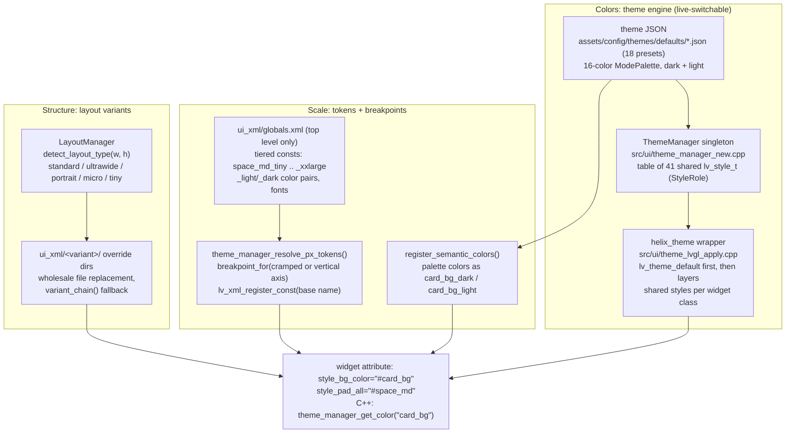
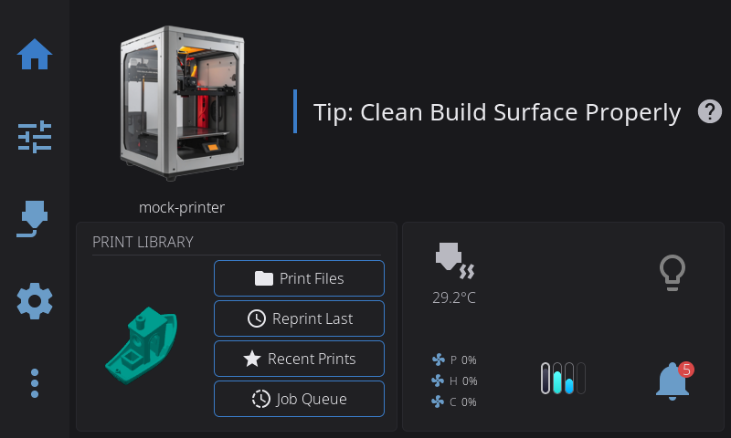
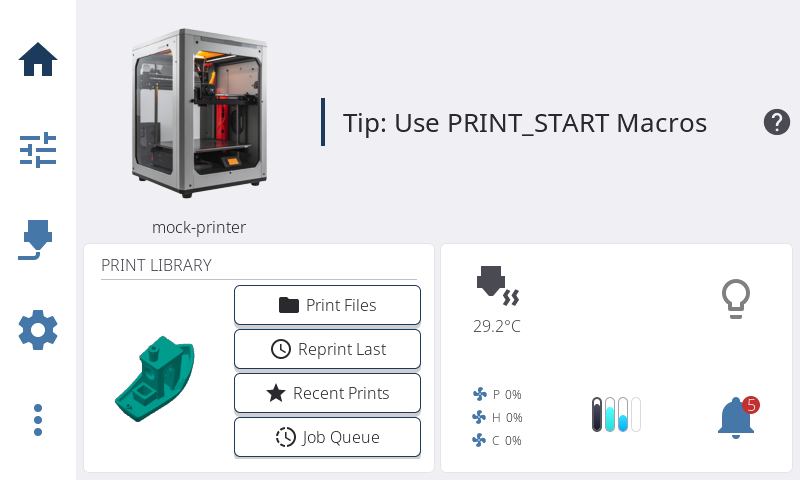

# 10 - Theme, tokens & layout

Every appearance value in HelixScreen resolves through one of two indirections: a **theme** (a named 16-color palette, switchable dark/light at runtime without recreating widgets) or a **token** (a named constant that resolves differently per screen size). A third system cuts across both: `LayoutManager` classifies the display's aspect ratio and swaps whole XML files from `ui_xml/<variant>/` directories. Themes control colors, tokens control scale, layouts control structure. The three axes combine freely, and together they are why one codebase renders acceptably from a 480x272 Ender panel to a 4K desktop window.

Counts, recounted 2026-10-09 (method included so you can re-run it):

| What | Count | Method |
|------|-------|--------|
| Theme presets shipped | 18 | `ls assets/config/themes/defaults/*.json \| wc -l` (nord, dracula, gruvbox, ...) |
| Shared styles in the theme table | 41 | `StyleRole` entries before `COUNT` (`include/theme_manager.h#StyleRole`) |
| `theme_manager_get_color()` call sites | 363 | `rg -c 'theme_manager_get_color\(' src include \| awk -F: '{s+=$2} END {print s}'` |
| Breakpoint tiers | 7 | `UiBreakpoint` (`include/ui_breakpoint.h#UiBreakpoint`): Micro..XXLarge |
| Layout variants | 7 | `LayoutType` (`include/layout_manager.h#LayoutType`): standard, ultrawide, portrait, micro, micro_portrait, tiny, tiny_portrait |
| Variant dirs with files | 3 | `micro/` (5 files), `portrait/` (2), `micro_portrait/` (1) |
| globals.xml | 1243 lines | `wc -l ui_xml/globals.xml`: tiered consts and illustration colors, no semantic palette |
| Top-level XML files the token scanner reads | 252 | `ls ui_xml/*.xml \| wc -l`: globals.xml plus 251 more, alphabetical last-wins |
| Hardcoded-color lint baseline | 33 | `HEX_BASELINE` in [`scripts/qc/design_tokens.sh`](../../../scripts/qc/design_tokens.sh) (ratchets down only) |

```mermaid
flowchart TB
    subgraph COLORS["Colors: theme engine (live-switchable)"]
        TJSON["theme JSON<br/>assets/config/themes/defaults/*.json (18 presets)<br/>16-color ModePalette, dark + light"]
        TM["ThemeManager singleton<br/>src/ui/theme_manager_new.cpp<br/>table of 41 shared lv_style_t (StyleRole)"]
        WRAP["helix_theme wrapper<br/>src/ui/theme_lvgl_apply.cpp<br/>lv_theme_default first, then layers<br/>shared styles per widget class"]
        TJSON --> TM --> WRAP
    end
    subgraph SCALE["Scale: tokens + breakpoints"]
        GXML["ui_xml/globals.xml (top level only)<br/>tiered consts: space_md_tiny .. _xxlarge<br/>_light/_dark color pairs, fonts"]
        RES["theme_manager_resolve_px_tokens()<br/>breakpoint_for(cramped or vertical axis)<br/>lv_xml_register_const(base name)"]
        GXML --> RES
        SEM["register_semantic_colors()<br/>palette colors as card_bg_dark / card_bg_light"]
        TJSON --> SEM
    end
    subgraph STRUCT["Structure: layout variants"]
        LM["LayoutManager<br/>detect_layout_type(w, h)<br/>standard / ultrawide / portrait / micro / tiny"]
        VD["ui_xml/&lt;variant&gt;/ override dirs<br/>wholesale file replacement,<br/>variant_chain() fallback"]
        LM --> VD
    end
    USE["widget attribute: style_bg_color=&quot;#card_bg&quot;<br/>style_pad_all=&quot;#space_md&quot;<br/>C++: theme_manager_get_color(&quot;card_bg&quot;)"]
    WRAP --> USE
    RES --> USE
    SEM --> USE
    VD --> USE
```

## Key files

| File | Role |
|------|------|
| [`include/theme_manager.h`](../../../include/theme_manager.h) | The public surface: `StyleRole`, `ThemeManager`, `configure_pressed_for_tier()`, `field_outline_color()`, and every `theme_manager_*` free function |
| [`src/ui/theme_manager_new.cpp`](../../../src/ui/theme_manager_new.cpp) | `ThemeManager` singleton: the shared-style table and palette state |
| [`src/ui/theme_manager.cpp`](../../../src/ui/theme_manager.cpp) | Init/deinit, `theme_manager_apply_theme()`, color lookups; process state lives in `ThemeRuntime` / `ThemeSubjects` ([`theme_manager_internal.h`](../../../src/ui/theme_manager_internal.h)). The rest is split by job: `theme_token_scan.cpp` (discovery), `theme_tokens_register.cpp` (XML consts), `theme_responsive.cpp` (breakpoints, px tokens), `theme_fonts.cpp`, `theme_lvgl_apply.cpp` (the `helix_theme` wrapper), `theme_live_recolor.cpp` (the palette walker), `theme_color_math.cpp` (contrast, outline color), `overlay_geometry.cpp` (nav width, overlay sizes) |
| [`src/ui/style_configs.cpp`](../../../src/ui/style_configs.cpp) | One `configure_*` function per `StyleRole`, writing palette colors into its style |
| [`include/ui_breakpoint.h`](../../../include/ui_breakpoint.h) | The canonical 7-tier breakpoint ladder (`Micro`..`XXLarge`) and `breakpoint_for()` |
| [`ui_xml/globals.xml`](../../../ui_xml/globals.xml) | Tiered `<px>`/`<str>`/`<color>` consts: the `globals` scope every `#token` resolves against |
| [`src/ui/theme_loader.cpp`](../../../src/ui/theme_loader.cpp) | JSON theme loading: user themes dir first, then the 18 shipped defaults |
| [`include/layout_manager.h`](../../../include/layout_manager.h) + [`src/layout_manager.cpp`](../../../src/layout_manager.cpp) | Aspect-ratio classification, `--layout` override, `resolve_xml_path()` / `variant_chain()` |
| [`assets/config/default_layout.json`](../../../assets/config/default_layout.json) | Home-grid anchor placements, keyed by layout variant then breakpoint |
| [`src/system/display_settings_manager.cpp`](../../../src/system/display_settings_manager.cpp) | Dark-mode toggle and theme selection; persists `/dark_mode` and `/display/theme` |
| [`src/generated/theme_token_table.cpp`](../../../src/generated/theme_token_table.cpp) | Compile-time token snapshot for installed builds; parity-gated by [`tests/unit/test_theme_token_table.cpp`](../../../tests/unit/test_theme_token_table.cpp) |
| [`tests/fixtures/theme_const_golden.txt`](../../../tests/fixtures/theme_const_golden.txt) | Snapshot of every XML const the theme registers, pinned by `[theme_pins]` |
| [`src/ui/ui_theme_editor_overlay.cpp`](../../../src/ui/ui_theme_editor_overlay.cpp) | Live theme editor: previews via `theme_manager_apply_theme()`, saves user theme JSONs |
| [`scripts/check_responsive_token_scope.py`](../../../scripts/check_responsive_token_scope.py) | Gate: tiered tokens must live in top-level `ui_xml/*.xml` only |
| [`scripts/check_variant_parity.py`](../../../scripts/check_variant_parity.py) | Gate: variant XML must keep the base file's widget names, bindings, callbacks |

## How it works

### Tokens: two registries and one lookup rule

XML refers to a token by name (`style_pad_all="#space_md"`, `style_bg_color="#card_bg"`), and writers and readers go through the same resolution:

- **Tiered px/str consts** (`space_md_tiny` ... `space_md_xxlarge`) live in [`ui_xml/globals.xml`](../../../ui_xml/globals.xml) and any other **top-level** `ui_xml/*.xml` file, scanned in alphabetical order with **last-wins** precedence, so [`ams_tokens.xml`](../../../ui_xml/ams_tokens.xml) (and any file sorting after globals.xml) can override a globals token by re-declaring its tiers. At startup and again on rotation, `theme_manager_resolve_px_tokens()` (`src/ui/theme_responsive.cpp#theme_manager_resolve_px_tokens`) picks the variant for the live display and registers it under the base name (`space_md`) via `lv_xml_register_const()`. C++ reads the same value with `theme_manager_get_spacing("space_md")` / `theme_manager_get_font("font_body")`.
- **Semantic palette colors** (`card_bg`, `primary`, `danger`, ...) are *not* in globals.xml. They come from the active theme JSON: `register_semantic_colors()` (`src/ui/theme_tokens_register.cpp#helix::theme_detail/register_semantic_colors`) registers each palette slot as `name`, `name_light`, and `name_dark` consts. A second pass, `register_color_pairs()`, auto-discovers hand-authored `xxx_light`/`xxx_dark` pairs from top-level XML (e.g. `filament_idle_light/dark` in globals.xml).
- **One lookup rule for C++:** `theme_manager_get_color("card_bg")` for tokens; it tries `{base}_light`/`{base}_dark` and falls back to the bare name. `theme_manager_parse_hex_color()` parses a hex *literal* only; feeding it a token name returns black. Two ratcheting gates keep the split honest: [`scripts/qc/design_tokens.sh`](../../../scripts/qc/design_tokens.sh) fails on `lv_color_hex(0x...)` above a baseline (33, exemptions for theme_manager itself and procedural renderers), and [`scripts/check_hardcoded_pixels.py`](../../../scripts/check_hardcoded_pixels.py) caps raw pixel literals (150, set in `scripts/qc/design_pixels.sh`).

The resolver's completeness rule: a token needs the full `_small`/`_medium`/`_large` triplet to register at all; anything shorter is an incomplete set, left unregistered rather than guessed at (`theme_manager_validate_constant_sets()` warns, and the unit suite fails on, these). The outer tiers (`_micro`, `_tiny`, `_xlarge`, `_xxlarge`) are optional and fall back inward toward `_small`/`_large`. One token has its own ladder: `nav_width` keys off horizontal resolution (with vertical-resolution and ultrawide exceptions) via `nav_width_suffix()`, because the nav bar's width tracks the *long* axis. Overlay geometry is *computed* from tokens at push time rather than declared: `compute_overlay_widths()` / `compute_overlay_heights()` (`src/ui/overlay_geometry.cpp#compute_overlay_widths`) spend nav-bar space and the transient gap on whichever axis the nav bar occupies.

Discovery is deliberately **top-level-only**: `theme_manager_find_xml_files()` skips subdirectories, so a responsive token declared in `ui_xml/components/` or `ui_xml/portrait/` never registers, and every `#token` referencing it silently resolves to nothing (#1211). Recursing would be worse: alphabetical last-wins would let a portrait-only `nav_width_small` shadow the base token globally. [`scripts/check_responsive_token_scope.py`](../../../scripts/check_responsive_token_scope.py) makes the constraint loud.

Follow one attribute end to end, `style_pad_all="#space_md"` on a card:

1. globals.xml declares the ladder: `space_md_tiny=6`, `space_md_small=8`, `space_md_medium=10`, `space_md_large=12`, `space_md_xlarge=16`, `space_md_xxlarge=20` (`ui_xml/globals.xml#space_md_tiny`). No bare `space_md` exists in XML; the base name is C++-registered only.
2. At startup, `theme_manager_resolve_px_tokens()` finds those suffixed names, computes the cramped-axis suffix for the live display (800x480: min dim 480, `Medium`, `"_medium"`), and registers `space_md = 10`.
3. The XML parser resolves `#space_md` against the `globals` scope at widget-creation time. An unknown const is an LV_LOG_WARN and the property is *silently skipped*, which is why typo'd token names produce unstyled widgets rather than errors.
4. On rotation the same resolver runs again with the new geometry and `lv_xml_update_const()` swaps the value in place.
5. C++ that needs the same number calls `theme_manager_get_spacing("space_md")`: same registry, same answer, never a parallel constant.

This is the token mandate from chapter 01 made concrete: colors via `theme_manager_get_color("card_bg")` (never `lv_color_hex(0x...)`), spacing via `#space_*` attributes (never raw integers), typography via the font tokens (`font_heading`/`font_body`/`font_small`, or the `<text_heading>`/`<text_body>`/`<text_small>` widgets that carry them). A hardcoded value works on the panel it was tuned on and is wrong on every other size. The exceptions are measured layout and computed fonts in C++ (`decide_nozzle_layout()`-style code that must pixel-measure at runtime); see chapter 01's structural-exceptions table.

Typography rides the same machinery with one extra indirection: font tokens are tiered `<string>` consts whose values are *font names* (`font_heading_small=noto_sans_20`, ...). `theme_manager_register_responsive_fonts()` (`src/ui/theme_fonts.cpp#theme_manager_register_responsive_fonts`) discovers them with the same required-triplet rule and registers the base name; `theme_manager_get_font("font_heading")` returns the `lv_font_t*`, and `theme_manager_size_to_font_token()` maps the xs/sm/md/lg size vocabulary onto the token names.

All of these consts live in the `globals` scope, the app-wide namespace every binding falls back to (chapter 01 covers the scope system). A token name is therefore also subject to the naming rule: one flat namespace, first-write-wins, so collisions with widget or subject names are silent.

Where `ui_xml/` is installed rather than edited, tokens are compiled in. [`src/generated/theme_token_table.cpp`](../../../src/generated/theme_token_table.cpp) is generated by [`scripts/gen_theme_tokens.py`](../../../scripts/gen_theme_tokens.py) (`make regen-tokens`) and committed; `helix::theme_tokens::enabled()` (`src/ui/theme_token_table_runtime.cpp#enabled`) turns it on for ESP32 and for cross-built release targets (`HELIX_RELEASE_BUILD`), where a live scan of every top-level file costs seconds of splash on eMMC. Native dev builds parse XML live, so editing globals.xml and relaunching adjusts tokens without a rebuild; `HELIX_TOKEN_TABLE=0` restores scanning on a device and `=1` previews the table anywhere. `[theme][tokens]` fails when the committed table drifts from what the scanner would parse, and `[theme_pins]` compares every registered const against `tests/fixtures/theme_const_golden.txt` (regenerate with `HELIX_UPDATE_GOLDEN=1` and review the diff).

### The theme engine: shared styles + the `helix_theme` wrapper

A theme is a JSON file with `dark` and/or `light` 16-color `ModePalette`s plus non-color properties (border radius/width, shadow). The 16 slots are semantic and fixed: `screen_bg`, `overlay_bg`, `card_bg`, `elevated_bg`, `border`, `text`, `text_muted`, `text_subtle`, `primary`, `secondary`, `tertiary`, `info`, `success`, `warning`, `danger`, `focus` (`include/theme_loader.h#ModePalette`), which is exactly the set `theme_manager_get_color()` can resolve. A theme cannot invent new color names; it fills the slots. [`theme_loader.cpp`](../../../src/ui/theme_loader.cpp) loads by name, the user's config dir `themes/` first, then `assets/config/themes/defaults/`. The active name comes from `/display/theme` in settings.json, overridable with the `HELIX_THEME` env var for testing and screenshots. Single-mode themes are legal; `ThemeModeSupport` records which.

Two cooperating pieces apply it, both behind [`theme_manager.h`](../../../include/theme_manager.h):

- **`ThemeManager`** ([`src/ui/theme_manager_new.cpp`](../../../src/ui/theme_manager_new.cpp)) owns a fixed table of 41 shared `lv_style_t` objects, one per `StyleRole` (`Card`, `ButtonPrimary`, `SeverityDanger`, ...), each configured by a `configure_*` function in [`style_configs.cpp`](../../../src/ui/style_configs.cpp). Widgets add these styles *by reference*; nobody copies palette colors into private styles. Unfilled input fields take their outline from `helix::field_outline_color()`, which shifts `text_subtle` just far enough to clear 3:1 against the screen, overlay, card and dialog surfaces.
- **The `helix_theme` wrapper** (`src/ui/theme_lvgl_apply.cpp#"static void helix_theme_apply(lv_theme_t* theme, lv_obj_t* obj) {"`) is the bridge into LVGL's own theming. Its apply callback runs for every widget created: it calls through to `lv_theme_default_init()`'s theme for base padding and tracks, then layers shared styles per widget class (buttons get `Button` + `Pressed` + `Focused`, textareas `InputBg`, sliders track/indicator/knob styles, dropdowns contrast-selected list styling). `theme_manager_init()` is called from `Application::init_theme()` (`src/application/application.cpp#init_theme`).

**Redraw-costly effects are tier-gated in one place.** `helix::full_style_effects_allowed(tier)` (`include/platform_capabilities.h#full_style_effects_allowed`) is the single predicate for style effects that cost a redraw per use. The pressed scale-down renders through a TRANSFORM layer on every press, so `configure_pressed_for_tier()` (declared in theme_manager.h) gives the limited tiers (BASIC, EMBEDDED) no scale; `Pressed`, `CardPressed` and `ButtonPressed` all go through it, and the card role gets a primary outline ring instead. The restyled scrollbar while scrolling redraws the whole scroller, so `helix_theme_apply` strips the `LV_STATE_SCROLLED` scrollbar style on those tiers. A new effect of that kind asks the same predicate rather than its own copy of the rule.

Live switching is the payoff, and `theme_manager_apply_theme(theme, dark)` is the single entry point (`src/ui/theme_manager.cpp#theme_manager_apply_theme`). In order:

1. Capture the old palette and build **color swap maps** (old value to new value) for the container colors, used later for widgets whose local styles C++ wrote with literal colors.
2. `theme_update_colors()` reconfigures the shared styles and both stored palettes in `ThemeManager`; `lv_obj_report_style_change()` cascades that to every widget that added one.
3. Re-register the XML consts: semantic colors, theme properties, discovered `_light`/`_dark` pairs, plus `lv_xml_update_const()` for values that differ per mode (`border_radius` from the theme's size index and breakpoint, `overlay_shadow_opa`).
4. Re-apply XML token colors: `lv_xml_reapply_style_tokens()` for named `<style>` blocks, then `lv_xml_reapply_token_styles()` over every screen and layer. helix-xml records which inline properties came from a `#token`, so an XML-authored color follows the switch exactly (#1735).
5. `theme_manager_refresh_widget_tree()` + `theme_apply_current_palette_to_tree()` walk the tree with the swap maps. The walker skips any property helix-xml reports as XML-authored and any label whose text color comes from a bound, component or C++ style, so it only repaints what nothing else owns.
6. Bump the generation counter (`theme_manager_get_changed_subject()`) so observers (the settings toggle, the editor preview) re-evaluate.

No widget is recreated. The theme editor overlay drives the same entry point for live previews. [`../THEME_SYSTEM.md`](../THEME_SYSTEM.md) has the walker's rules in full.

The same home panel under `theme_manager_apply_theme()` in both modes: identical XML, identical tokens, only the palette swapped (`--dark` / `--light` captures from the screenshot pipeline):

A few colors are *computed* from the palette rather than named by it: `theme_get_knob_color()` picks the more saturated of primary/tertiary for switch and slider handles, `theme_get_accent_color()` the more saturated of primary/secondary for icon accents, and `theme_manager_get_contrast_color(bg)` returns text from whichever palette contrasts with the given background. One rotating palette exists outside the theme: `theme_manager_get_object_palette_color(index)` cycles the fixed `object_color_1..8` consts so an excluded object keeps the same color across the map, list and 3D brackets.

The user-facing controls live in Settings > Appearance: `DisplaySettingsManager` (`src/system/display_settings_manager.cpp#set_dark_mode`) guards against requesting a mode the theme lacks, persists `/dark_mode` and `/display/theme`, and disables the toggle for single-mode themes (a dark-only theme also force-switches the mode and hides the control). It publishes `settings_dark_mode` and `settings_dark_mode_available`; `on_theme_changed()` runs once when the session services come up (`src/application/session_wiring.cpp#init_session_services`) so the toggle reflects what the loaded theme supports.

### Two responsive axes: breakpoints scale values, variants swap files

Both key off screen geometry, which makes them easy to conflate. They are independent systems:

| | Breakpoints | Layout variants |
|---|---|---|
| Keyed by | narrow-axis (or vertical) resolution | aspect ratio |
| Lives in | [`include/ui_breakpoint.h`](../../../include/ui_breakpoint.h) | [`src/layout_manager.cpp`](../../../src/layout_manager.cpp) |
| Changes | token *values*, font sizes, the `ui_breakpoint` subject | which XML *files* load, the anchor table |
| Example trigger | 800x480: `Medium`, `space_md=10` | 480x800 portrait: `ui_xml/portrait/` |
| Forced for testing | not overridable (geometry is truth) | `--layout <type>` / `/display/layout` |

**Breakpoints** are a 7-tier ladder: `Micro` up to 272, `Tiny` up to 390, `Small` up to 460, `Medium` up to 550, `Large` up to 700, `XLarge` up to 1000, `XXLarge` above. `breakpoint_for()` selects the tier from one of two scalars: `responsive_dimension()` (the *cramped* axis, `min(w,h)`) for fonts, horizontal padding and column counts, and `responsive_vertical_dimension()` for row-height tokens (#1209). On landscape and square displays the two are equal; a 480x800 portrait panel classifies its cramped axis as `Medium` for most tokens but its vertical axis as `XLarge` for height tokens, so rows get roomy while columns stay compact. Which tokens follow the vertical axis is one explicit list, `theme_manager_token_uses_vertical_axis()` (`include/theme_manager.h#theme_manager_token_uses_vertical_axis`), not a naming convention, and every registration site consults it. `theme_manager_get_breakpoint_suffix()` turns a tier into the `_small`-style suffix the resolver uses. The tier is also published as the `ui_breakpoint` int subject so XML can react structurally: `<bind_flag_if_eq subject="ui_breakpoint" flag="hidden" ref_value="0"/>` hides something at Micro only. **The enum values are the XML `ref_value` contract: do not renumber them.**

**Layout variants** classify aspect ratio into `STANDARD`, `ULTRAWIDE` (>2.5:1), `PORTRAIT` (<0.8:1), `MICRO`/`TINY` (max dim up to 480, split at min dim 272), and the `*_PORTRAIT` subclasses (`src/layout_manager.cpp#detect_layout_type`). `LayoutManager::resolve_xml_path()` returns the first `ui_xml/<variant>/<file>` that exists along `variant_chain()` (e.g. `tiny_portrait`, `portrait`, base `ui_xml/`), so a variant overrides only what genuinely differs. In the tree today `portrait/` carries `print_status_panel.xml` and `print_tune_panel.xml` (the app shell and nav bar adapt in place via `ui_is_portrait`), `micro/` carries `controls_panel.xml`, `header_bar.xml`, `material_temps_overlay.xml` and the two theme-editor overlays, and `micro_portrait/` its own `material_temps_overlay.xml`. `--layout <type>` (or `/display/layout`) forces a variant. The same `variant_chain()` also selects the home-grid anchor table, so a portrait panel cannot land on landscape anchors (#1216).

**Rotation couples the two systems, with an ordering trap.** The theme initializes at startup phase 6, but `LayoutManager` does not resolve until phase 8b, so the early orientation seed uses `detect_layout_type()` directly and `theme_manager_refresh_orientation()` re-publishes `ui_is_portrait` once the (possibly overridden) layout is known. On a resize or rotation, `theme_manager_refresh_layout_constants()` recomputes every token for the new geometry via `lv_xml_update_const()`: update, not register, because `lv_xml_register_const()` is first-write-wins and would keep the boot-time value.

### The home grid: square cells and anchors keyed by variant and breakpoint

The home panel's widget grid (chapter 09 covers the widget lifecycle) is measured in **tracks**, half a cell each (`GridLayout::TRACKS_PER_CELL`). `GridLayout::get_dimensions()` divides each axis of the container's content box by the same per-tier cell edge (`GRID_CELL`, scaled by the high-DPI UI scale) and rounds to the nearest whole cell, so the cell stays square and a rotated panel transposes its grid. [`../LAYOUT_SYSTEM.md`](../LAYOUT_SYSTEM.md) has the track math.

Default placement comes from [`assets/config/default_layout.json`](../../../assets/config/default_layout.json), authored in tracks: a base `anchors` table keyed by widget id with per-breakpoint placements (`micro` through `xxlarge`, as `col`/`row`/`colspan`/`rowspan`), a `variants` table (`ultrawide`, `portrait`) keyed like the `ui_xml/` override dirs and resolved most-specific-first through `variant_chain()`, and a `disabled` list for widgets that should start off. A placement key may also name an exact grid (`<tier>@<cols>x<rows>`), which wins within its tier. Missing tiers fall back toward the middle (`micro`, `tiny`, `small` and `xxlarge`, `xlarge`, `large`; `src/system/panel_widget_config.cpp#choose_breakpoint_key`). The placement code clamps an anchor's span to the columns that exist, so a wide anchor degrades into a full-width band rather than leaving a gap.

`PanelWidgetConfig::build_default_grid()` (`src/system/panel_widget_config.cpp#build_default_grid`) reads the file through `helix::find_readable()`, so a user's config-dir copy wins over the shipped asset. Widgets not listed are auto-placed after the anchored ones.

## Patterns & gotchas

Editing this subsystem rarely needs C++. The workflows, in increasing order of ceremony:

- **Token value**: edit the tier in [`ui_xml/globals.xml`](../../../ui_xml/globals.xml) (or the owning top-level XML), relaunch. Then `make regen-tokens` and commit the table, or installed builds keep the old value.
- **Colors of an existing theme**: edit the theme JSON (user copy in the config dir wins), or use the theme editor overlay in Settings; both apply live.
- **New theme**: copy any JSON from `assets/config/themes/defaults/` into the config dir's `themes/`, fill the 16 slots, select it in Settings > Appearance > Theme Colors. [`THEME_CONTRIBUTOR_GUIDE.md`](../THEME_CONTRIBUTOR_GUIDE.md) has the schema.
- **New token**: add the full `_small`/`_medium`/`_large` triplet (plus optional outer tiers) to a *top-level* XML file, relaunch, reference `#name`. Then `make regen-tokens` and refresh the const golden (`HELIX_UPDATE_GOLDEN=1 ./build/bin/helix-tests "[theme_pins]"`); a token missing from the committed table renders unstyled on ESP32 and release builds only, which no native run will show you.
- **New layout variant file**: create `ui_xml/<variant>/<file>`, keep every widget name, subject binding and callback the base file has (parity gate), test with `--layout <variant>`.
- **Testing across sizes**: run with `-s/--size <preset>` (`micro`, `tiny`, `small`, `medium`, `large`, `xlarge`; `include/theme_manager.h#UI_SCREEN_MICRO_W` and its neighbours); combined with `--layout` this covers the geometry matrix without hardware.

The traps, in rough order of how often they bite:

- **Never pre-declare a base token in XML.** `lv_xml_register_const()` is first-write-wins and silently ignores duplicates, so a hand-written `<px name="space_md" value="8"/>` makes the responsive registration a no-op. Declare only the tiered variants.
- **The same ordering bites styles:** globals.xml is parsed *before* `theme_manager_init()` registers base `#space_*`/color consts, so a `<style>` in globals.xml referencing one registers empty. Put such styles in `ui_xml/styles.xml` when more than one file uses them (borrowed as `styles.<name>`), otherwise in the consuming component's own `<styles>` block. See [`UI_CONTRIBUTOR_GUIDE.md` § "Shared styles"](../UI_CONTRIBUTOR_GUIDE.md#shared-styles-ui_xmlstylesxml).
- **A tiered token without the full `_small`/`_medium`/`_large` triplet never registers.** `theme_manager_validate_constant_sets()` surfaces these, and the unit suite fails on them (#1698).
- **Responsive tokens are top-level-only** (#1211); **variant overrides replace files wholesale** and must keep their wiring identical to the base ([`scripts/check_variant_parity.py`](../../../scripts/check_variant_parity.py) compares widget names, subject bindings, callbacks, api props and condition presence; [`scripts/check_variant_content_drift.py`](../../../scripts/check_variant_content_drift.py) catches a variant drifting from its base). All three gates run in [`scripts/quality-checks.sh`](../../../scripts/quality-checks.sh).
- **Tokens vs hex in C++:** `theme_manager_get_color()` resolves names; `theme_manager_parse_hex_color()` is for literal `#RRGGBB` strings only. The hex-count and hardcoded-pixel gates ratchet: never add to the baselines.
- **Token names are global and last-wins.** A tiered const re-declared in a later top-level file silently overrides globals.xml. Prefix component-specific tokens (`ams_*`, `spool_*`) the way the existing files do.
- **Never hand-roll breakpoint thresholds.** Use `breakpoint_for(res)` / `responsive_pick()` (`include/ui_breakpoint.h#breakpoint_for`) so the tier boundaries live in one place.
- **Never hand-roll a tier check for a costly effect.** Ask `full_style_effects_allowed()`; a second copy of the rule drifts until two effects disagree about which boards can afford them.
- **`ui_breakpoint` ref_values are enum ordinals.** Renumbering `UiBreakpoint` breaks every such binding invisibly.
- **Palette lookups are not cached.** `theme_manager_get_color()` does string lookups against the const registry. Fine for setup code and observers; per-frame canvas renderers read `ThemeManager::instance().current_palette()` instead.
- **Deinit order:** `theme_manager_deinit()` runs after the display (and with it `lv_xml_deinit()`) is gone, never before (`include/theme_manager.h#theme_manager_deinit`; chapter 11 has why).
- **Overlay geometry is orientation-dependent and applied at push time.** Landscape puts the nav bar on the leading edge; portrait along the bottom ([`ui_xml/navigation_bar.xml`](../../../ui_xml/navigation_bar.xml), bound to `ui_is_portrait`). `ui_set_overlay_geometry()` (`src/ui/overlay_geometry.cpp#ui_set_overlay_geometry`) is the sole writer of an overlay's width (or, in portrait, height and alignment).
- **`HELIX_THEME` overrides config at load, silently.** The settings.json value is untouched, so a test run with it set is not representative of what the device will load.
- **Colors written from C++ are the walker's problem; XML token colors are not.** An inline `#token` color or a `<style>` token re-resolves on a switch by itself. A color C++ sets with `lv_obj_set_style_*` survives only if it matches a swap-map entry, so C++ should add a shared style or bind instead of writing palette values.
- **A theme fills 16 fixed slots; it cannot add tokens.** New semantic colors mean new `ModePalette` slots in every theme JSON; reach for an explicit `_light`/`_dark` const pair in top-level XML first, which auto-registers.

## Going deeper

- [`../THEME_SYSTEM.md`](../THEME_SYSTEM.md): the theme engine in full: the `StyleRole`/configure-function pattern for new themed widgets, the editor's palette preview, and the walker's ownership rules.
- [`../THEME_CONTRIBUTOR_GUIDE.md`](../THEME_CONTRIBUTOR_GUIDE.md): creating a theme JSON, no C++ needed.
- [`../LAYOUT_SYSTEM.md`](../LAYOUT_SYSTEM.md): authoring a layout variant and the home-grid track math (`GridLayout`, half-cell tracks, square cells).
- [`../UI_CONTRIBUTOR_GUIDE.md`](../UI_CONTRIBUTOR_GUIDE.md): the contributor checklist view: which token to reach for, breakpoint behavior, overrides.
- [`09-home-widgets.md`](09-home-widgets.md): the other half of the home grid: `PanelWidget` lifecycle, gating, and the rebuild machinery that consumes these anchors.
- [`../ENVIRONMENT_VARIABLES.md`](../ENVIRONMENT_VARIABLES.md): `HELIX_THEME`, `HELIX_TOKEN_TABLE` and the other runtime knobs.

## Guided code tour

1. `include/theme_manager.h#StyleRole`: 41 roles, each a shared style. The file header states the threading and lookup rules.
2. `src/ui/theme_manager_new.cpp#init`: `ThemeManager::init()` registers style configs and applies default Nord palettes if none were set. Small file; read it whole.
3. [`src/ui/style_configs.cpp`](../../../src/ui/style_configs.cpp): `configure_pressed_for_tier()` at the top, then three or four `configure_*` functions to see palette colors become style properties.
4. `src/ui/theme_lvgl_apply.cpp#"static void helix_theme_apply(lv_theme_t* theme, lv_obj_t* obj) {"`: default theme first, the scrollbar tier strip, then shared styles per widget class.
5. `src/ui/theme_lvgl_apply.cpp#helix::theme_detail/theme_init_lvgl`: builds both palettes, sets up `ThemeManager`, calls `lv_theme_default_init()` and layers `helix_theme` on top.
6. `src/ui/theme_responsive.cpp#theme_manager_resolve_px_tokens`: the two-axis suffix choice, the `nav_width` special case, the required-triplet rule.
7. `src/ui/theme_tokens_register.cpp#helix::theme_detail/register_semantic_colors`: theme JSON palette to `card_bg`/`card_bg_light`/`card_bg_dark` consts.
8. `src/ui/theme_manager.cpp#theme_manager_apply_theme`: the whole live-switch sequence, including `reapply_xml_token_colors()` just above it.
9. [`src/ui/theme_live_recolor.cpp`](../../../src/ui/theme_live_recolor.cpp): the walker, and the authored-property and chosen-style checks that keep it off what it does not own.
10. `include/ui_breakpoint.h#UiBreakpoint`: the ladder, the narrow-axis thresholds, `breakpoint_for()`/`responsive_pick()`.
11. `ui_xml/globals.xml#space_xxs_tiny`: the `space_*` ladder in situ; note the comments documenting the register-before-parse ordering traps.
12. `src/layout_manager.cpp#detect_layout_type`, then `src/layout_manager.cpp#variant_chain`.
13. [`assets/config/default_layout.json`](../../../assets/config/default_layout.json): the anchor table and its `_comment` fields; then `src/system/panel_widget_config.cpp#build_default_grid` loading it through `variant_chain()`.
14. `src/ui/theme_loader.cpp#load_theme_from_file`: user-dir-first lookup, mode-support parsing.
15. `src/system/display_settings_manager.cpp#set_dark_mode`: the settings side and its mode-support guards.
16. [`scripts/check_responsive_token_scope.py`](../../../scripts/check_responsive_token_scope.py) and [`scripts/check_variant_parity.py`](../../../scripts/check_variant_parity.py): read both docstrings; they encode the two easiest ways to silently break this subsystem.
