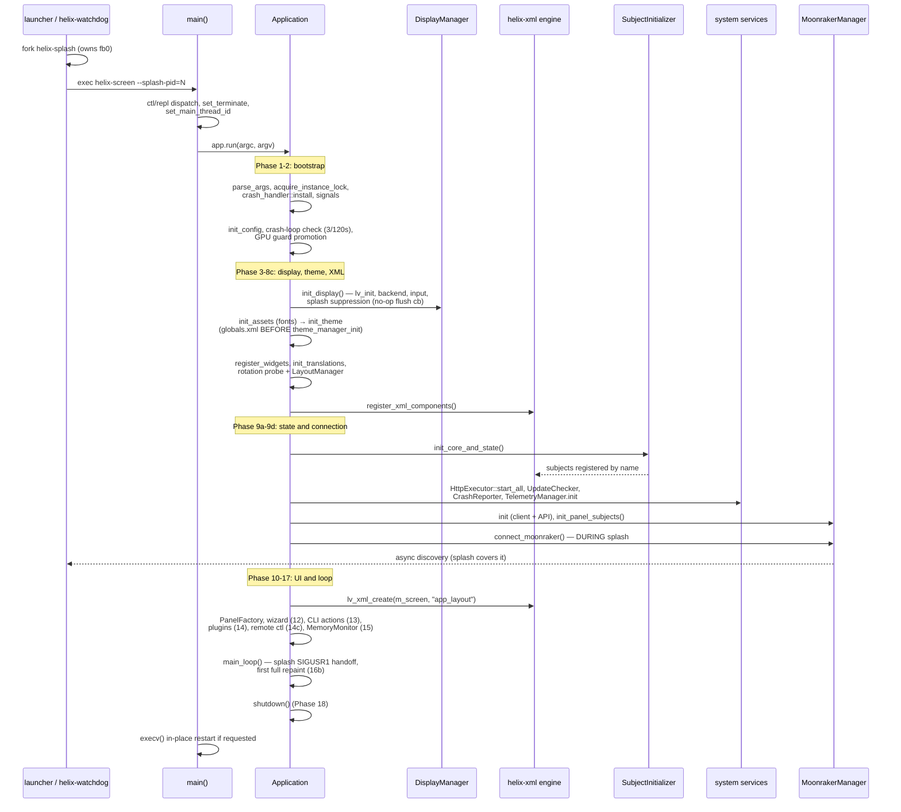

# 11 — Startup & shutdown

HelixScreen boots through a single ordered ladder in `Application::run()` — display before theme, fonts before the XML const tables that name them, components and subjects before `lv_xml_create()` builds the widget tree — and the Moonraker connection starts *before* the UI exists so the splash screen covers discovery instead of the first panel. Shutdown is the same idea in reverse: panels die first, then subjects, then LVGL, each step existing so the step after it cannot walk freed memory. Outside the app process, `helix-watchdog` supervises the whole thing and owns the crash-recovery dialog, and a separate `helix-splash` process owns the framebuffer until discovery completes — or 8 seconds, whichever comes first.

The boot ladder, numbered exactly as the phase comments in `run()` order them ([`src/application/application.cpp:518`](../../../src/application/application.cpp#L518)):

## Key files

| File | Role |
|------|------|
| [`src/main.cpp`](../../../src/main.cpp) | Process entry: client-mode dispatch, terminate handler, in-place `execv` restart |
| [`src/application/application.cpp`](../../../src/application/application.cpp) | The whole ladder — `run()` (`:517`), every `init_*` phase, `main_loop()` (`:3985`), `shutdown()` (`:5004`) |
| [`src/application/subject_initializer.cpp`](../../../src/application/subject_initializer.cpp) | The subject sweep in dependency phases: core → state → navigation → panels → observers |
| [`src/application/static_subject_registry.cpp`](../../../src/application/static_subject_registry.cpp) | LIFO registry of subject `deinit_subjects()` callbacks |
| [`src/application/static_panel_registry.cpp`](../../../src/application/static_panel_registry.cpp) | Self-registration registry for panel/overlay destruction |
| [`src/application/display_manager.cpp`](../../../src/application/display_manager.cpp) | Display/backend lifecycle; `shutdown()` (`:630`) runs `lv_deinit()` → `lv_xml_deinit()` in that order |
| [`src/xml_registration.cpp`](../../../src/xml_registration.cpp) | `helix::register_xml_components()` (`:300`): responsive consts, semantic widgets, shared callbacks, ~300 XML files |
| [`src/helix_watchdog.cpp`](../../../src/helix_watchdog.cpp) | Supervisor process: fork/supervise/restart helix-screen, crash dialog, Safe Mode |
| [`src/helix_splash.cpp`](../../../src/helix_splash.cpp) | Standalone splash process: paints fb0, self-exits on SIGUSR1 or 30s cap |
| [`include/splash_screen_manager.h`](../../../include/splash_screen_manager.h) | App-side splash handoff: 8s discovery timeout, post-splash repaint |
| [`mk/watchdog.mk`](../../../mk/watchdog.mk) | Watchdog build — embedded DRM/fbdev targets only |
| [`scripts/helix-launcher.sh`](../../../scripts/helix-launcher.sh) | Device entry point: starts watchdog (which starts splash), env setup |

## How it works

### Early boot: process entry to XML registration

Before `Application` exists, `main()` ([`src/main.cpp:121`](../../../src/main.cpp#L121)) does four things worth knowing about. `helix-screen ctl`/`repl` dispatch to the remote client and exit before any display init (`:126`). `set_main_thread_id()` records the thread id that the background-thread `LifetimeToken::expired()` detector compares against (chapter 03). `std::set_terminate()` installs a handler that writes the exception into a crash record and exits `128+SIGABRT` so the watchdog classifies the death as a crash (`:69`) — a plain `_exit(1)` here used to restart silently with no dialog. And after `run()` returns, an in-place restart (`execv`, `:160`) replaces the process image for soft restarts and printer switching — cleanup already ran, the lockfile is released, the new instance comes up clean.

Inside `run()`, the pre-phase work is all self-protection. The single-instance flock is taken *after* arg parsing so `-V`/`--help` still answer on a device where an instance is already running (`:550`). The crash handler installs before anything that can crash (`:558`); crash-loop detection counts restarts in a marker file and refuses to boot after 3 in 120s (`:594`); surviving GPU 3D/blur guard files promote to persistent config blocks so a driver that hard-faults once is never retried (`:633`). Safe Mode is consumed right after logging init (`:681`) — the watchdog wrote the marker because the last boots crashed during subscription handling, so phase 9d will skip the auto-connect.

The display/theme/XML block has three ordering constraints the code comments defend:

- **Fonts before theme.** Phase 5 (`init_assets`) registers fonts because Phase 6 (`init_theme`) then registers [`ui_xml/globals.xml`](../../../ui_xml/globals.xml) — whose const table *names* those fonts — before `theme_manager_init()` applies it (`:1616`). Register globals after theme init and every token resolves to nothing.
- **Translations before XML components.** Phase 8a loads only the current locale (~60–80 KB versus 500–700 KB for all nine languages) because `lv_tr()` must work inside the rotation probe (8b) and in every component registered in 8c (`:1811`).
- **Layout before panels.** Phase 8b runs the first-boot rotation probe (fbdev/DRM only) and resolves `LayoutManager`, so variant XML overrides and portrait orientation are known before any panel subtree exists (`:1655`).

Phase 8c (`register_xml_components`, `:1790`) calls `helix::register_xml_components()` ([`src/xml_registration.cpp:300`](../../../src/xml_registration.cpp#L300)), which registers responsive constants, the semantic text/button widgets, shared event callbacks, then 305 XML component files (`register_xml()` call sites, recounted at audit) through `LayoutManager::resolve_xml_path()` (variant-aware), yielding every 16 components on ESP32 so the idle task is not starved. If `HELIX_HOT_RELOAD` is on (default for native builds), the hot-reloader thread starts here too.

The whole ladder, one line per phase comment (all in `run()` unless noted):

| Phase | Call | Line | One-line reason it sits here |
|-------|------|------|------------------------------|
| — | `logging::init_early()`, `ensure_project_root_cwd()` | `:519`, `:536` | Logs work before anything else; `ui_xml/` resolution needs the chdir |
| 1 | `parse_args()` | `:539` | Env overrides applied inside (`HELIX_SCREEN_SIZE`, …) |
| — | `acquire_instance_lock()`, `crash_handler::install()`, signals | `:550`–`:578` | Lock after args so `-V` works; handler before anything that can crash |
| 2 | `init_config()` | `:581` | Crash-loop check + GPU-guard promotion ride along |
| 3 | `init_logging()` | `:661` | Timezone applied before the first timestamped line; `--detect-printer` one-shot exits here |
| 4 | `init_display()` | `:706` | `lv_init()`, backend, input; splash suppression armed |
| 5 | `init_assets()` | `:711` | Fonts before [`globals.xml`](../../../ui_xml/globals.xml) names them |
| 6 | `init_theme()` | `:717` | [`globals.xml`](../../../ui_xml/globals.xml) → `theme_manager_init()` → bg color |
| 7 | `register_widgets()` | `:723` | 12 custom C widgets + header-bar system |
| 8a | `init_translations()` | `:729` | Current locale only; `lv_tr()` for the probe |
| 8b | `run_rotation_probe_and_layout()` | `:737` | Rotation + `LayoutManager` before variant XML resolves |
| 8c | `register_xml_components()` | `:740` | ~300 component files + hot reloader |
| 9a | `init_core_subjects()` | `:747` | `SubjectInitializer` core/state/navigation sweep |
| 9b | `HttpExecutor::start_all()`, `init_moonraker()` | `:767`, `:768` | Pools before the API that submits to them |
| — | UpdateChecker, UpgradeBanner, CrashReporter, TelemetryManager | `:776`–`:805` | Services panels bind, plus the first heap snapshot |
| 9c | `init_panel_subjects()` | `:809` | `init_panels()` + `init_post()` — every subject exists before XML |
| 9d | `connect_moonraker()` | `:824` | Async discovery under the splash; Safe Mode skips |
| 10 | `init_ui()` | `:866` | `lv_xml_create("app_layout")`, navbar, `PanelFactory` |
| 11b–16b | recovery, wizard, CLI actions, plugins, ctl server, MemoryMonitor, repaint | `:882`–`:1130` | One try/catch: post-UI failures degrade, never exit |
| 17 | `main_loop()` | `:1155` | Splash handoff lives here (chapter 02 owns the rest) |
| 18 | `shutdown()` | `:1158` | The ladder below |

### Subjects, UI, and the connect-during-splash window

Phase 9a constructs `SubjectInitializer` and runs `init_core_and_state()` ([`src/application/subject_initializer.cpp:226`](../../../src/application/subject_initializer.cpp#L226)): core globals → `PrinterState` → AMS/sensor managers → `NavigationManager` last, *precisely so* reverse-order deinit clears NavigationManager's observers before PrinterState frees the subjects they observe. Phase 9b starts the HttpExecutor pools ([`src/application/application.cpp:777`](../../../src/application/application.cpp#L777) — the Moonraker APIs submit to them on every request) before `MoonrakerManager::init()` creates the client and API. Then come the system services the panels will need: `UpdateChecker`, `UpgradeBanner`, `CrashHistory`/`CrashReporter`, `TelemetryManager::init()` ([`src/application/application.cpp:807`](../../../src/application/application.cpp#L807)) — note the telemetry spread: init here, `record_session()` on discovery complete ([`src/application/application.cpp:3351`](../../../src/application/application.cpp#L3351)), `start_auto_send()` ([`src/application/application.cpp:3703`](../../../src/application/application.cpp#L3703)) inside `connect_moonraker()`.

Phase 9c (`init_panel_subjects`) runs the rest of the sweep — `init_panels()` then `init_post()` (observers, USB manager), EmergencyStop/AbortManager/detection wiring — so **every subject exists before any XML binding needs it**. Phase 9d then calls `connect_moonraker()` (`:3574`) *before* the UI exists: discovery runs async under the splash, and by the time `init_ui()` (Phase 10) calls `lv_xml_create(m_screen, "app_layout", nullptr)` (`:1973`) — timed in the log, it builds all six panel subtrees at once — the connection may already be complete, saving ~2s of splash time. The old startup diagram put connect *after* UI creation and `init_post()` after both; the code orders it 9c → 9d → 10, and `init_post()` runs inside 9c.

Phases 11b–16b live in one `try` block (`:882`) with a catch that degrades to a toast instead of exiting — a regression here (`HomePanel::finalize_setup()` json throw) once crash-looped real devices, so anything after UI creation is survivable by policy. In order: stale-printer recovery (11b), first-run wizard (12), CLI startup actions (13), plugins (14), WiFi availability check (14b), the remote-control server — auto-on in `--test`, opt-in via `--remote` (14c, `:1011`), memory monitor + hang detection + pressure responders (15), and the first full-screen repaint (16b, skipped while the external splash still owns the framebuffer). Then `main_loop()` (17) and `shutdown()` (18).

The main loop itself belongs to chapter 02 (notification dispatch, `lv_timer_handler`, the UpdateQueue drain inside it). What is boot-specific is the **splash handoff**: invalidation was suppressed and the flush callback swapped to a no-op in phase 4 while the splash process painted fb0; once discovery completes — or the 8s `DISCOVERY_TIMEOUT_MS` ([`include/splash_screen_manager.h:32`](../../../include/splash_screen_manager.h#L32)) fires — the loop sends SIGUSR1, restores the real flush callback, and forces one full repaint. Four timers bound the choreography, each a backstop for the one before it:

| Timer | Value | Owner | Fires when |
|-------|-------|-------|------------|
| Discovery timeout | 8s | App (`SplashScreenManager`) | Discovery incomplete — signal splash anyway |
| Invalidation failsafe | 11s | App (`main_loop`, `:4195`) | Splash handoff never happened — force rendering back on |
| Splash self-exit | 30s | Splash process ([`helix_splash.cpp:83`](../../../src/helix_splash.cpp#L83)) | No SIGUSR1 arrived — exit so it cannot pin the display forever |
| Absolute cap | 180s | Splash (`SplashLifetimePolicy`, [`include/splash_status.h:22`](../../../include/splash_status.h#L22)) | Even with heartbeats — hard backstop |

### Shutdown: the registry ladder

`Application::shutdown()` (`:5004`) is guarded by `m_shutdown_complete` (the destructor calls it again) and runs a strict ladder. Simplified to its load-bearing steps:

1. **Stop producers.** Hot reloader, remote-control server, memory monitor, then `MoonrakerClient::disconnect()` — background threads must stop delivering before anything they would touch is freed. Clear `app_globals` pointers, then `NavigationManager::shutdown()`, then the service managers (UpdateChecker, Telemetry, CrashHistory, Sound, plugins).
2. **Unregister and drain.** Timelapse/power/sensor/action-prompt callbacks come off the client, `AmsState::clear_backends()` releases subscription guards while the client's mutex is alive, `update_queue_shutdown()` drains deferred UI callbacks *before* the panels they capture die, and `lv_anim_delete_all()` stops completion callbacks firing on soon-freed widgets.
3. **`StaticPanelRegistry::destroy_all()`** (`:5146`) — every panel/overlay singleton, self-registered at creation. Destroys panel-local subjects and releases ObserverGuards while LVGL is still up.
4. **`StaticSubjectRegistry::deinit_all()`** (`:5153`) — LIFO over self-registered `deinit_subjects()` callbacks ([`src/application/static_subject_registry.cpp:54`](../../../src/application/static_subject_registry.cpp#L54) iterates a detached copy in reverse, so a callback that re-registers lands in the empty member vector).
5. **`destroy_all()` again** (`:5160`) — a sweep for panels a deinit callback lazily *resurrected* through an auto-creating `get_global_*_panel()` getter, keeping their destructors off the static-destruction path.
6. **`ObserverGuard::invalidate_all()`** ([`src/application/application.cpp:5255`](../../../src/application/application.cpp#L5255)), then destroy MoonrakerManager, stop the HttpExecutors, `m_display.reset()` → `DisplayManager::shutdown()` which runs **`lv_deinit()` then `lv_xml_deinit()`** ([`src/application/display_manager.cpp:703`](../../../src/application/display_manager.cpp#L703)), and finally `theme_manager_deinit()` dead last ([`src/application/application.cpp:5297`](../../../src/application/application.cpp#L5297)).

The *why* of steps 3→4→6 is the observer-corruption chain: `lv_deinit()` deletes widgets; widget deletion fires the `unsubscribe_on_delete_cb` that each observer registered, which calls `lv_observer_remove()` against the owning subject's `subs_ll` list. If the singleton subjects were already deinit'd, those lists are freed memory — SIGSEGV inside `lv_observer.c`. Panels die first so their observers release while both sides are alive; subjects die second; only then is LVGL allowed to delete anything. Two more orderings from the same family: `lv_xml_deinit()` must follow `lv_deinit()` because component scopes own styles the (now-deleted) widgets pointed at, and a scope with a `<subject_expr>` owns **raw** `lv_observer_t*` on app-owned theme subjects — which is why `theme_manager_deinit()` runs after both, or every `ctl shutdown` heap-use-after-frees. And `ObserverGuard::invalidate_all()` must precede `MoonrakerManager`'s destructor, whose guard members would otherwise `lv_observer_remove()` on observers that `lv_subject_deinit()` already freed.

Registration is **always self-registration**: each `init_subjects()` registers its own `deinit_subjects()` with `StaticSubjectRegistry`, never an external caller, and `StaticPanelRegistry` entries are registered by the `get_global_*()` accessors (chapter 05 has the panel-instance pattern). Because `destroy_all()` runs before `lv_deinit()`, a panel whose `cleanup()` cancels an `lv_timer_t*` must cancel it from the destructor too — the shared `cancel_*_timer()` + `lv_timer_cancel_safe()` pattern, policed by [`scripts/check_timer_destructor_cancel.py`](../../../scripts/check_timer_destructor_cancel.py) (chapter 03, gotcha 5).

Two more exits skip this ladder by design, and each encodes a policy decision rather than an oversight:

| Exit path | Trigger | Teardown | Watchdog sees |
|-----------|---------|----------|---------------|
| Full `shutdown()` | Loop exit (quit flag, timeout, runaway streak) | The whole ladder | Clean exit 0 — silent restart |
| Fast exit | SIGTERM (`:412`) | None — async-signal-safe `_exit(0)` only, crash marker cleared | Supervisor stop — watchdog exits too |
| Graceful quit | SIGINT (Ctrl+C) | Loop drains into full `shutdown()` | Clean exit 0 |
| Crash | Signal, `std::terminate`, uncaught exception | None — crash record written first | Exit `128+signum` → recovery dialog |

SIGTERM's fast path exists because teardown is fragile on the MIPS/ARM devices supervisors aggressively respawn, and persisted state is written on change. The crash path encodes `128+SIGABRT` precisely so the watchdog's translation table classifies it — a plain `_exit(1)` used to restart silently with crash.txt written and no user-visible dialog.

### Watchdog and splash: supervision outside the app process

On embedded DRM/fbdev targets the launcher ([`scripts/helix-launcher.sh`](../../../scripts/helix-launcher.sh)) does not start helix-screen directly — it execs `helix-watchdog`, a supervisor built from a separate ~1500-line TU with minimal dependencies: LVGL, a display backend, spdlog. No XML engine, no theme system, no networking, because its one job is to still work when the main app is the problem. `run_watchdog()` ([`src/helix_watchdog.cpp:1099`](../../../src/helix_watchdog.cpp#L1099)) forks (or adopts) the splash, forks the helix-screen child with the splash PID forwarded, and blocks in `waitpid`.

Death classification is the heart of it. The app's crash handler exits `128+signum`; the watchdog translates that range back to a signal so the recovery dialog reports the real crash (`:1224`). SIGTERM/SIGINT children mean a supervisor stop — the watchdog exits too. Deliberate non-zero exits (config validation, "another instance running") count against a 60s restart-loop window and give up with exit code 42, letting systemd see the failure; transient exec failures (EAGAIN/ENOMEM under memory pressure) have their own budget and cooldown in [`watchdog_restart_policy.h`](../../../include/watchdog_restart_policy.h) so a passing squeeze never becomes a black screen. Three same-signature crashes within 90s is a *crash loop*: the dialog grows a **Safe Mode** button, and choosing it writes `safe_mode.flag` — the marker phase 3 of the next boot consumes to skip the Moonraker auto-connect so the user can reach Settings.

The crash dialog itself uses raw `lv_label`/`lv_obj` calls (`create_crash_dialog`, `:875`) — the task brief and older notes describe this as "renders without LVGL", which is wrong: it renders without the *XML engine and theme system*, with hardcoded colors, because those subsystems are what crashed. It counts down to an auto-restart (default 30s, `auto_restart_sec` in settings.json, parsed with a regex because the watchdog links no JSON library) and offers Restart App / Restart System / Safe Mode. The crash *report* pipeline — crash.txt, fingerprints, the in-app dialog a healthy next boot shows, delivery — is [`CRASH_REPORTER.md`](../CRASH_REPORTER.md)'s subject.

## Patterns & gotchas

- **Phase numbers are comments in `run()`, not an enum** — "Phase 9d" only exists in a comment at [`application.cpp:824`](../../../src/application/application.cpp#L824). When you add a step, place it in the comment ladder; the logs and this chapter quote those numbers.
- **Ordering constraints with teeth**: fonts → [`globals.xml`](../../../ui_xml/globals.xml) → `theme_manager_init()`; translations → rotation probe → XML components; subjects (9a/9c) → `lv_xml_create` (10); HttpExecutor pools → MoonrakerManager. Each is guarded by a comment, not by code — the failure mode is missing fonts/tokens/bindings, i.e. silent.
- **Never move `connect_moonraker()` after `init_ui()`** back. It runs during splash deliberately (async discovery under the splash, ~2s saved), and Safe Mode's "skip connect" behavior is defined against that position.
- **Shutdown order is append-only in spirit.** New singletons must stop their threads before `MoonrakerClient::disconnect()`-adjacent teardown and register cleanup with the right registry (subjects → StaticSubjectRegistry; panels → StaticPanelRegistry via the `get_global_*` accessor). An unregistered singleton dies on the static-destruction path where LVGL and spdlog are already gone.
- **`lv_deinit()` → `lv_xml_deinit()` → `theme_manager_deinit()`** — this exact order, all five `lv_xml_deinit()` call sites in [`display_manager.cpp`](../../../src/application/display_manager.cpp) use it, and `Application::shutdown()` calls `theme_manager_deinit()` only *after* `m_display.reset()`. Reordering any pair resurrects a heap-use-after-free that fired on every `ctl shutdown`.
- **Never register a subject from outside its owner.** Self-registration is the contract; external registration breaks the LIFO guarantee silently (chapter 02 covers the macros).
- **SIGTERM is a fast exit on purpose.** Don't "fix" it to run full teardown — aggressive supervisors on MIPS/ARM made that path crash more than it cleaned up.
- **Crash-loop arithmetic lives in two places** — the app's marker (3 restarts/120s, halts boot) and the watchdog's signature window (3 crashes/90s, offers Safe Mode). Different windows, different remedies; don't merge them.
- **`--test` disables the crash machinery** — no crash handler install, no crash-loop marker, no crash dialog (unless `--mock-crash`), because test automation relaunches rapidly by design.
- **The remote-control server is phase 14c, not part of early boot** — auto-on only in `--test` or with `--remote`. Client-mode `ctl`/`repl` dispatch happens even earlier, in `main()`, before `Application` exists.

## Going deeper

- [`02-subjects-dataflow.md`](02-subjects-dataflow.md) — the main loop's ordering, the UpdateQueue drain timer, and the subject lifecycle macros this chapter's phase 9 references.
- [`03-threading-lifetime.md`](03-threading-lifetime.md) — the guard family (`AsyncLifetimeGuard`, `SubjectLifetime`, `ObserverGuard`) that shutdown steps 1–6 exist to satisfy, and the timer-destructor-cancel rule with its gate.
- [`05-printer-state.md`](05-printer-state.md) — the domain fan-out behind `PrinterState::init_subjects()` and the singleton/registry map.
- [`../CRASH_REPORTER.md`](../CRASH_REPORTER.md) — the crash record pipeline the watchdog's exit-code translation feeds: detection, fingerprints, delivery, the in-app report modal.
- [`../THREADING.md`](../THREADING.md) §7 — the registration and `deinit_subjects()` patterns, LIFO ordering, and idempotency rules this chapter summarizes.
- [`../HELIXCTL.md`](../HELIXCTL.md) — the remote-control server started at phase 14c and the client dispatched in `main()`.

## Guided code tour

Read in this order; about 30 minutes total.

1. [`src/main.cpp:121`](../../../src/main.cpp#L121) — `main()`: client dispatch, `set_terminate`, the `execv` in-place restart. 175 lines; read it whole.
2. [`src/application/application.cpp:518`](../../../src/application/application.cpp#L518) — `run()`: skim top-to-bottom once reading only the `Phase N` comments; this is the authoritative ladder.
3. [`src/application/application.cpp:1397`](../../../src/application/application.cpp#L1397) — `init_display()`: DPI forcing, and the splash suppression block at `:1576` (invalidation off + no-op flush callback).
4. [`src/application/application.cpp:1615`](../../../src/application/application.cpp#L1615) — `init_theme()`: note [`globals.xml`](../../../ui_xml/globals.xml) registered *before* `theme_manager_init()` and why.
5. [`src/xml_registration.cpp:300`](../../../src/xml_registration.cpp#L300) — `register_xml_components()`: responsive consts → semantic widgets → callbacks → XML files; the `boot_yield` cadence note at `:290`.
6. [`src/application/subject_initializer.cpp:226`](../../../src/application/subject_initializer.cpp#L226) — `init_core_and_state()`: the dependency phases, and the NavigationManager-registers-last comment.
7. [`src/application/application.cpp:3638`](../../../src/application/application.cpp#L3638) — `connect_moonraker()`: when it connects, what Safe Mode skips, where `start_auto_send` lands.
8. [`src/application/application.cpp:1978`](../../../src/application/application.cpp#L1978) — `init_ui()`: the timed `lv_xml_create`, navbar wiring, `PanelFactory` handoff.
9. [`src/application/application.cpp:4033`](../../../src/application/application.cpp#L4033) — `main_loop()`: read only the splash-handoff and 11s-failsafe blocks (`:4154`–`:4205`); chapter 02 owns the rest.
10. [`src/application/application.cpp:5053`](../../../src/application/application.cpp#L5053) — `shutdown()`: walk the ladder against the "How it works" list; the long comments at `:5158` and `:5219` are the two UAF post-mortems.
11. [`src/application/display_manager.cpp:632`](../../../src/application/display_manager.cpp#L632) — `DisplayManager::shutdown()`: `lv_deinit()` → `lv_xml_deinit()` and the style-ownership comment above them.
12. [`src/application/static_subject_registry.cpp:54`](../../../src/application/static_subject_registry.cpp#L54) — `deinit_all()`: 25 lines; the detached-copy/reverse-iteration trick.
13. [`src/helix_watchdog.cpp:1099`](../../../src/helix_watchdog.cpp#L1099) — `run_watchdog()`: fork/supervise loop, exit-code translation at `:1221`, crash-loop branch at `:1336`.
14. [`src/helix_watchdog.cpp:875`](../../../src/helix_watchdog.cpp#L875) — `create_crash_dialog()`: raw LVGL, hardcoded colors, countdown.
15. [`src/helix_splash.cpp:83`](../../../src/helix_splash.cpp#L83) — `MAX_LIFETIME_SEC` and the defense-in-depth comment; then [`include/splash_screen_manager.h:32`](../../../include/splash_screen_manager.h#L32) for the app-side 8s timeout.
16. [`scripts/helix-launcher.sh:452`](../../../scripts/helix-launcher.sh#L452) — how watchdog and splash get started on device, and the `HELIX_NO_SPLASH`/pre-started-splash branches.
