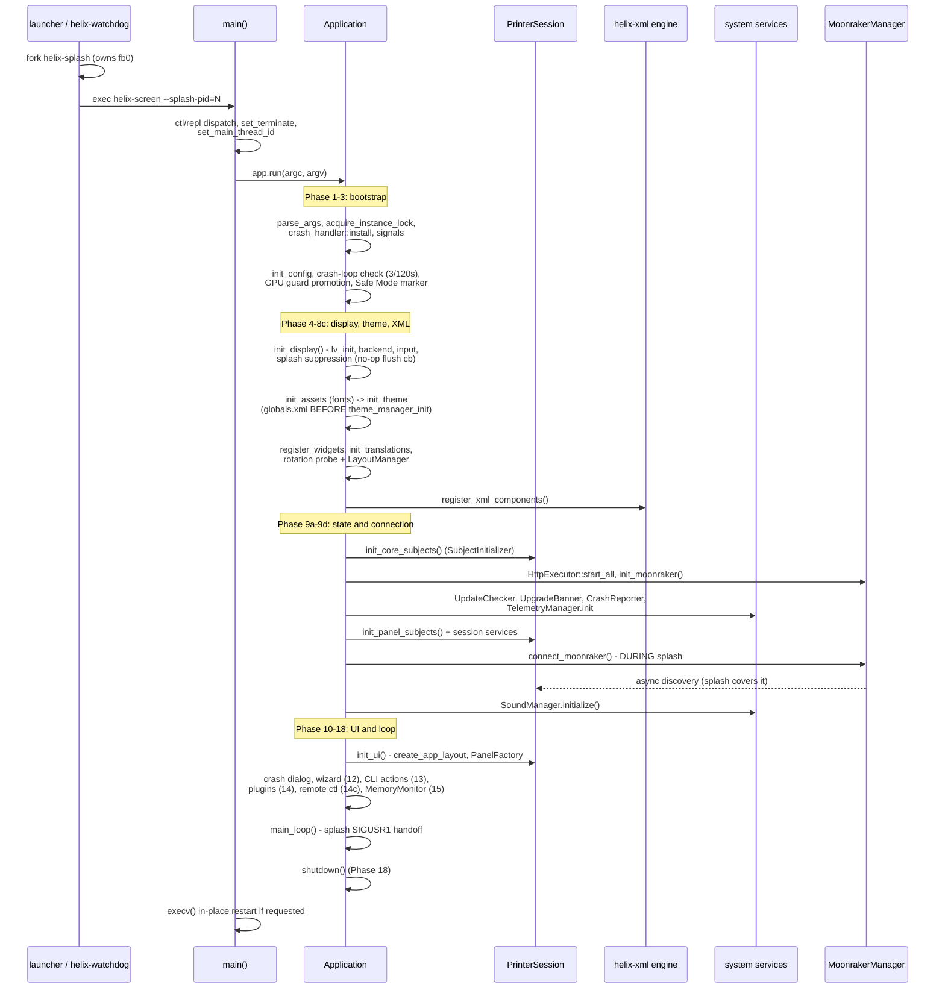

# 11 - Startup & shutdown

HelixScreen boots through a single ordered ladder in `Application::run()`: display before theme, fonts before the XML const tables that name them, components and subjects before `lv_xml_create()` builds the widget tree, and the Moonraker connection *before* the UI exists so the splash screen covers discovery instead of the first panel. Everything scoped to one printer (subjects, the Moonraker client, panels, plugins) lives in `PrinterSession`, so a printer switch tears down and rebuilds the same scope the boot built. Shutdown is the same idea in reverse: panels die first, then subjects, then LVGL, each step existing so the step after it cannot walk freed memory. Outside the app process, `helix-watchdog` supervises the whole thing and owns the crash-recovery dialog, and a separate `helix-splash` process owns the framebuffer until discovery completes or 8 seconds pass.

The boot ladder, numbered as the phase comments in `run()` order them (`src/application/application.cpp#run`):

```mermaid
sequenceDiagram
    participant WD as launcher / helix-watchdog
    participant M as main()
    participant A as Application
    participant PS as PrinterSession
    participant XML as helix-xml engine
    participant Svc as system services
    participant MM as MoonrakerManager

    WD->>WD: fork helix-splash (owns fb0)
    WD->>M: exec helix-screen --splash-pid=N
    M->>M: ctl/repl dispatch, set_terminate,<br/>set_main_thread_id
    M->>A: app.run(argc, argv)

    Note over A: Phase 1-3: bootstrap
    A->>A: parse_args, acquire_instance_lock,<br/>crash_handler::install, signals
    A->>A: init_config, crash-loop check (3/120s),<br/>GPU guard promotion, Safe Mode marker

    Note over A: Phase 4-8c: display, theme, XML
    A->>A: init_display() - lv_init, backend, input,<br/>splash suppression (no-op flush cb)
    A->>A: init_assets (fonts) -> init_theme<br/>(globals.xml BEFORE theme_manager_init)
    A->>A: register_widgets, init_translations,<br/>rotation probe + LayoutManager
    A->>XML: register_xml_components()

    Note over A: Phase 9a-9d: state and connection
    A->>PS: init_core_subjects() (SubjectInitializer)
    A->>MM: HttpExecutor::start_all, init_moonraker()
    A->>Svc: UpdateChecker, UpgradeBanner, CrashReporter,<br/>TelemetryManager.init
    A->>PS: init_panel_subjects() + session services
    A->>MM: connect_moonraker() - DURING splash
    MM-->>PS: async discovery (splash covers it)
    A->>Svc: SoundManager.initialize()

    Note over A: Phase 10-18: UI and loop
    A->>PS: init_ui() - create_app_layout, PanelFactory
    A->>A: crash dialog, wizard (12), CLI actions (13),<br/>plugins (14), remote ctl (14c), MemoryMonitor (15)
    A->>A: main_loop() - splash SIGUSR1 handoff
    A->>A: shutdown() (Phase 18)
    M->>M: execv() in-place restart if requested
```

## Key files

| File | Role |
|------|------|
| [`src/main.cpp`](../../../src/main.cpp) | Process entry: client-mode dispatch, terminate handler, in-place `execv` restart |
| [`src/application/application.cpp`](../../../src/application/application.cpp) | The ladder: `run()`, every process-level `init_*` phase, `main_loop()`, `shutdown()`. Owns `CrashReporter`, `RemoteControlServer` and `UpgradeBanner` as members |
| [`src/application/printer_session.cpp`](../../../src/application/printer_session.cpp) | `PrinterSession`: the printer scope. Subjects, Moonraker, panels, plugins, discovery wiring, and `teardown_printer_scope()` for both a switch and process exit |
| [`src/application/session_wiring.cpp`](../../../src/application/session_wiring.cpp) | What desktop and the ESP32 firmware share: `wire_discovery()`, `init_session_services()`, `create_app_layout()`, `setup_app_panels()` |
| [`src/application/discovery_steps_core.cpp`](../../../src/application/discovery_steps_core.cpp), [`discovery_steps.cpp`](../../../src/application/discovery_steps.cpp) | The ordered discovery steps each connection runs: the core table both builds compile, and desktop's tail table |
| [`src/application/subject_initializer.cpp`](../../../src/application/subject_initializer.cpp) | The subject sweep in dependency phases: core, state, navigation, panels, observers |
| [`src/application/panel_factory.cpp`](../../../src/application/panel_factory.cpp) | Panel construction; on ESP32 only Home at boot, the rest deferred, Print Files built at the first idle moment |
| [`src/application/static_subject_registry.cpp`](../../../src/application/static_subject_registry.cpp) | LIFO registry of subject `deinit_subjects()` callbacks |
| [`src/application/static_panel_registry.cpp`](../../../src/application/static_panel_registry.cpp) | Self-registration registry for panel/overlay destruction |
| [`src/application/display_manager.cpp`](../../../src/application/display_manager.cpp) | Display/backend lifecycle; `shutdown()` runs `lv_deinit()` then `lv_xml_deinit()` |
| [`src/xml_registration.cpp`](../../../src/xml_registration.cpp) | `helix::register_xml_components()`: responsive consts, semantic widgets, shared callbacks, `styles.xml`, the first-use component loader |
| [`src/helix_watchdog.cpp`](../../../src/helix_watchdog.cpp) | Supervisor process: fork/supervise/restart helix-screen, crash dialog, Safe Mode |
| [`src/helix_splash.cpp`](../../../src/helix_splash.cpp) | Standalone splash process: paints fb0, self-exits on SIGUSR1 or a 30s cap |
| [`include/splash_screen_manager.h`](../../../include/splash_screen_manager.h) | App-side splash handoff: 8s discovery timeout, post-splash repaint |
| [`include/boot_crash_guard.h`](../../../include/boot_crash_guard.h) | Which printer a boot connects to after a run of crash resets (firmware) |
| [`firmware/helixscreen-esp32/components/helixapp/app_boot.cpp`](../../../firmware/helixscreen-esp32/components/helixapp/app_boot.cpp) | The ESP32 firmware's boot: its own ordering around the shared session wiring |
| [`mk/watchdog.mk`](../../../mk/watchdog.mk) | Watchdog build, embedded DRM/fbdev targets only |
| [`scripts/helix-launcher.sh`](../../../scripts/helix-launcher.sh) | Device entry point: starts watchdog (which starts splash), env setup |

## How it works

### Early boot: process entry to XML registration

Before `Application` exists, `main()` (`src/main.cpp#main`) does four things worth knowing. `helix-screen ctl`/`repl` dispatch to the remote client and exit before any display init (`src/main.cpp#main/"remote_client_main"`). `set_main_thread_id()` records the thread id the background-thread `LifetimeToken::expired()` detector compares against (chapter 03). `std::set_terminate()` installs a handler that writes the exception into a crash record and exits `128+SIGABRT` so the watchdog classifies the death as a crash and shows the recovery dialog (`src/main.cpp#terminate_handler`). And after `run()` returns, an in-place restart (`execv`, `src/main.cpp#main/"execv(exe, new_argv)"`) replaces the process image for soft restarts: cleanup already ran, the lockfile is released, the new instance comes up clean.

Inside `run()`, the pre-phase work is self-protection. The single-instance flock is taken *after* arg parsing so `-V`/`--help` still answer on a device where an instance is running (`src/application/application.cpp#acquire_instance_lock`). The crash handler installs before anything that can crash (`src/system/crash_handler.cpp#install`). Crash-loop detection counts restarts in a marker file and, after 3 in 120s, boots that run in crash-loop safe mode: no plugins, default widget layouts, layout saves skipped and layout edits refused, cleared by the next start (`src/application/process_guards.cpp#MAX_CRASH_RESTARTS`, `RuntimeConfig::crash_loop_safe_mode`). Surviving GPU 3D/blur guard files promote to persistent config blocks so a driver that hard-faults once is never retried (`src/application/process_guards.cpp#gpu_3d_guard_path`, `src/application/process_guards.cpp#gpu_blur_guard_path`). The watchdog's Safe Mode marker is consumed right after logging init (`src/application/process_guards.cpp#consume_safe_mode_marker`), so phase 9d skips the auto-connect.

The display/theme/XML block has ordering constraints the code comments defend:

- **Fonts before theme.** Phase 5 (`init_assets`) registers fonts because Phase 6 (`init_theme`) then registers [`ui_xml/globals.xml`](../../../ui_xml/globals.xml), whose const table *names* those fonts, before `theme_manager_init()` applies it (`src/application/application.cpp#init_theme`). Register globals after theme init and every token resolves to nothing.
- **Translations before XML components.** Phase 8a loads only the current locale because `lv_tr()` must work inside the rotation probe (8b) and in every component registered in 8c (`src/application/application.cpp#init_translations`).
- **Rotation before input.** On a first boot the kernel's `panel_orientation` is decided in Phase 4 and handed to `DisplayManager::init()` as the startup rotation (`include/display_backend.h#startup_rotation`), because the backends gate the stored touch range and calibration on the display's rotation when they create the input devices (#1428). Phase 8b only persists it.
- **Layout before panels.** Phase 8b runs the first-boot rotation probe (fbdev/DRM only) and resolves `LayoutManager`, so variant XML overrides and portrait orientation are known before any panel subtree exists (`src/application/application.cpp#run_rotation_probe_and_layout`).

Phase 8c calls `helix::register_xml_components()` (`src/xml_registration.cpp#register_xml_components`), which registers responsive constants, the semantic text/button widgets, shared event callbacks, then `styles.xml`, and installs the first-use component loader (`helix::register_xml_on_first_use()`), which registers every other component through `LayoutManager::resolve_xml_path()` (variant-aware) the first time its name is looked up. Components that C++ writes responsive consts into register at boot too, and a resize or hot reload re-registers them (#1756). If `HELIX_HOT_RELOAD` is on (default for native builds), the hot-reloader thread starts here.

The whole ladder, one line per phase comment (all in `run()` unless noted):

| Phase | Call | Where | Why it sits here |
|-------|------|-------|------------------|
| - | `logging::init_early()`, `ensure_project_root_cwd()` | `src/system/logging_init.cpp#init_early`, `src/application/application.cpp#ensure_project_root_cwd` | Logs work before anything else; `ui_xml/` resolution needs the chdir |
| 1 | `parse_args()` | `src/application/application.cpp#parse_args` | Env overrides applied inside (`HELIX_SCREEN_SIZE`, ...) |
| - | `acquire_instance_lock()`, `crash_handler::install()`, signals | `src/application/application.cpp#run` | Lock after args so `-V` works; handler before anything that can crash |
| 2 | `init_config()` | `src/application/application.cpp#init_config` | Crash-loop check + GPU-guard promotion ride along |
| 3 | `init_logging()` | `src/application/application.cpp#init_logging` | Timezone applied before the first timestamped line; `--detect-printer` one-shot exits here |
| 4 | `init_display()` | `src/application/application.cpp#init_display` | `lv_init()`, backend, input; splash suppression armed |
| 5 | `init_assets()` | `src/application/application.cpp#init_assets` | Fonts before globals.xml names them |
| 6 | `init_theme()` | `src/application/application.cpp#init_theme` | globals.xml, then `theme_manager_init()`, then bg color |
| 7 | `register_widgets()` | `src/application/application.cpp#register_widgets` | 14 custom C widgets + header-bar system |
| 8a | `init_translations()` | `src/application/application.cpp#init_translations` | Current locale only; `lv_tr()` for the probe |
| 8b | `run_rotation_probe_and_layout()` | `src/application/application.cpp#run_rotation_probe_and_layout` | Rotation + `LayoutManager` before variant XML resolves |
| 8c | `register_xml_components()` | `src/application/application.cpp#register_xml_components` | `styles.xml`, component loader, hot reloader |
| 9a | `init_core_subjects()` | `src/application/printer_session.cpp#init_core_subjects` | `SubjectInitializer` core/state/navigation sweep |
| 9b | `HttpExecutor::start_all()`, `init_moonraker()` | `src/system/http_executor.cpp#start_all`, `src/application/printer_session.cpp#init_moonraker` | Pools before the API that submits to them |
| - | UpdateChecker, UpgradeBanner, CrashHistory + CrashReporter, TelemetryManager | `src/application/application.cpp#run` | Services panels bind, plus the first heap snapshot |
| 9c | `init_panel_subjects()` | `src/application/printer_session.cpp#init_panel_subjects` | `init_panels()` + `init_post()` + session services: every subject exists before XML |
| 9d | `connect_moonraker()` | `src/application/printer_session.cpp#connect_moonraker` | Async discovery under the splash; Safe Mode skips |
| - | SoundManager, strict UI checks in `--test` | `src/application/application.cpp#run` | Host audio picked before the startup tone |
| 10 | `init_ui()` | `src/application/printer_session.cpp#init_ui` | `create_app_layout()`, then `PanelFactory` |
| 11b-16b | crash dialog, recovery, wizard, CLI actions, plugins, ctl server, MemoryMonitor, repaint | `src/application/application.cpp#run` | One try/catch: post-UI failures degrade, never exit |
| 17 | `main_loop()` | `src/application/application.cpp#main_loop` | Splash handoff lives here (chapter 02 owns the rest) |
| 18 | `shutdown()` | `src/application/application.cpp#shutdown` | The ladder below |

### Subjects, UI, and the connect-during-splash window

Phase 9a runs `SubjectInitializer::init_core_and_state()` (`src/application/subject_initializer.cpp#init_core_and_state`): core globals, `PrinterState`, settings, AMS and sensor managers, then `NavigationManager` last, so reverse-order deinit clears NavigationManager's observers before PrinterState frees the subjects they observe. Phase 9b starts the HttpExecutor pools (the Moonraker APIs submit to them on every request) before `MoonrakerManager::init()` creates the client and API, and `init_moonraker()` registers the discovery callbacks through `wire_discovery()` (below). Then come the process-level services the panels bind: `UpdateChecker`, the `UpgradeBanner` and `CrashReporter` members, `CrashHistory`, and `TelemetryManager::init()`. Telemetry is spread across three points: `init()` here, `record_session()` in a discovery step (`src/application/discovery_steps.cpp#telemetry_step`), and `start_auto_send()` inside `connect_moonraker()`.

Phase 9c (`init_panel_subjects`) runs the rest of the sweep (`init_panels()` then `init_post()`), then `init_session_services()` (`src/application/session_wiring.cpp#init_session_services`: E-stop, abort, keyboard, notifications, toasts, post-op cooldown, filament consumption tracking), detection sources, and the temperature history and performance sources, so **every subject exists before any XML binding needs it**. Phase 9d calls `connect_moonraker()` *before* the UI exists: discovery runs async under the splash, and by the time `init_ui()` (Phase 10) calls `create_app_layout()` (`src/application/session_wiring.cpp#create_app_layout`, the one `lv_xml_create(screen, "app_layout", nullptr)`) the connection may already be complete, saving about 2s of splash. `setup_app_panels()` then hands the tree to `PanelFactory`.

`PanelFactory::setup_panels()` (`src/application/panel_factory.cpp#setup_panels`) builds all six panels on Linux, where the whole eager build is under a second on the slowest board. On ESP32 it builds Home only and registers the other five as deferred builders that run on first navigation; Print Files, the panel a session visits first, is built by an `IdlePrebuilder` at the first idle moment after connect (no wizard, modal or overlay up, the display idle for a while), so its first tap does not stall.

Phases 11b-16b live in one `try` block (`src/application/application.cpp#run/"Post-UI safety net"`) whose catch degrades to a toast instead of exiting, so anything after UI creation is survivable by policy. In order: the crash-report dialog for a previous crash (suppressed after an update restart, for an unparseable record, or for a duplicate fingerprint), stale-printer recovery (11b), first-run wizard (12), CLI startup actions (13), and in both of the last two paths `HomePanel::finalize_setup()`, which builds the home grid only once discovery has had its chance; plugin load (14, `src/application/printer_session.cpp#init_plugins`), the Safe Mode and crash-loop toasts, WiFi availability (14b), the remote-control server, auto-on in `--test` and opt-in via `--remote`, over a Unix socket or HTTP (14c, `src/application/application.cpp#run/"Phase 14c"`), memory monitor + hang detection + pressure responders (15), and the first full-screen repaint (16b, skipped while the external splash still owns the framebuffer). Then `main_loop()` (17) and `shutdown()` (18).

The main loop belongs to chapter 02. What is boot-specific is the **splash handoff**: invalidation was suppressed and the flush callback swapped to a no-op in phase 4 while the splash process painted fb0; once discovery completes or the 8s `DISCOVERY_TIMEOUT_MS` (`include/splash_screen_manager.h#DISCOVERY_TIMEOUT_MS`) fires, the loop sends SIGUSR1, restores the real flush callback and forces one full repaint. Four timers bound the choreography, each a backstop for the one before it:

| Timer | Value | Owner | Fires when |
|-------|-------|-------|------------|
| Discovery timeout | 8s | App (`SplashScreenManager`) | Discovery incomplete: signal splash anyway |
| Invalidation failsafe | 11s | App (`main_loop`, `src/application/application.cpp#main_loop/"Invalidation failsafe"`) | Splash handoff never happened: force rendering back on |
| Splash self-exit | 30s | Splash process (`src/helix_splash.cpp#MAX_LIFETIME_SEC`) | No SIGUSR1 arrived: exit so it cannot pin the display |
| Absolute cap | 180s | Splash (`include/splash_status.h#SplashLifetimePolicy`) | Even with heartbeats: hard backstop |

### One session wiring for desktop and firmware

The ESP32 firmware boots through its own `app_boot.cpp`, with an ordering shaped by FreeRTOS tasks and a tight internal heap, but it reaches the printer through the same functions desktop does. `wire_discovery()` (`src/application/session_wiring.cpp#wire_discovery`) registers the hardware-discovered and discovery-complete callbacks on a client; each queues its work to the UI thread and drops it when the HTTP epoch moved (the work belongs to the previous printer) or the session's `alive` hook says it is gone. Discovery-complete runs the core steps (`discovery_core_steps()`: hardware, status dispatch, printer auto-detect, safety limits, job queue, light buttons), then hands the `DiscoveryContext` to the build's `after_core` hook; desktop's runs the tail steps (`discovery_tail_steps()`) and signals the splash. `init_session_services()`, `create_app_layout()` and `setup_app_panels()` are shared the same way, so a session service added there reaches the K-Touch without a second registration.

A printer switch runs the same scope backwards and forwards: `PrinterSession::teardown_printer_scope(TeardownScope::PrinterSwitch)`, then `rebuild()`, both driven by `PrinterSwitchFlow` ([`src/application/printer_switch_flow.cpp`](../../../src/application/printer_switch_flow.cpp)), which both builds compile. [`../MULTI_PRINTER.md`](../MULTI_PRINTER.md) covers the switch itself. The firmware has no watchdog process, so it guards the boot itself: `apply_boot_crash_guard()` counts crash resets since the last healthy session and at three (`BOOT_CRASH_FALLBACK_THRESHOLD`) boots the printer the last switch came from, or, with none to go back to, holds the connection until the user picks a printer (`include/boot_crash_guard.h#choose_boot_printer`, #1750). `PrinterSwitchFlow::record_switch_away()` keeps the record that choice reads.

### Shutdown: the registry ladder

`Application::shutdown()` (`src/application/application.cpp#shutdown`) is guarded by `m_shutdown_complete` (the destructor calls it again). It stops the process-level producers (async lifetime guard, WiFi link monitor, hot reloader, the remote-control server, memory monitor), then calls `PrinterSession::teardown_printer_scope(TeardownScope::ProcessExit)` (`src/application/printer_session.cpp#teardown_printer_scope`), the same ordered function a printer switch runs as `PrinterSwitch`; steps guarded by `exiting` are the process-level ones. `shutdown()` then stops the HttpExecutors, resets the display and deinitialises the theme manager. Simplified to its load-bearing steps:

1. **Stop producers.** On exit the first-use XML loader stops; on a switch the UpdateQueue is frozen so work the WebSocket thread enqueues from here on is discarded. `MoonrakerClient::disconnect()` comes first, because background threads must stop delivering before anything they touch is freed. Clear `app_globals` pointers, then `helix::nav::shutdown()` (overlays deactivated, navigation registries cleared) and the page-scroll controllers. On exit only, the process-scoped services go: the upgrade banner (before the UpdateChecker it observes), UpdateChecker, Telemetry, CrashHistory, Sound, PostOpCooldown.
2. **Unload and unregister.** Plugins unload while subjects and the client are alive. History managers reset; the connection-scoped method handlers detach (timelapse, update checker, About print hours, Spoolman sync); power and sensor state unsubscribe; G-code routing handlers detach; `AmsState::clear_backends()` releases subscription guards while the client's mutex is alive. `update_queue_shutdown()` drains deferred UI callbacks *before* the panels they capture die, and `lv_anim_delete_all()` stops completion callbacks firing on soon-freed widgets.
3. **`destroy_panels()`** (`src/application/printer_session.cpp#teardown_printer_scope/"Destroy ALL static panel"`): every panel/overlay singleton (`StaticPanelRegistry::destroy_all()` on exit). Destroys panel-local subjects and releases ObserverGuards while LVGL is still up.
4. **`StaticSubjectRegistry::deinit_all()`** (`src/application/printer_session.cpp#teardown_printer_scope/"StaticSubjectRegistry::instance().deinit_all"`): LIFO over self-registered `deinit_subjects()` callbacks (`src/application/static_subject_registry.cpp#deinit_all` iterates a detached copy in reverse, so a callback that re-registers lands in the empty member vector).
5. **`destroy_panels()` again** (`src/application/printer_session.cpp#teardown_printer_scope/"Sweep any panel singleton"`): a sweep for panels a deinit callback lazily *resurrected* through an auto-creating `get_global_*_panel()` getter, keeping their destructors off the static-destruction path.
6. **`ObserverGuard::invalidate_all()`** (`src/application/printer_session.cpp#teardown_printer_scope/"ObserverGuard::invalidate_all(exiting);"`), then the G-code routers and MoonrakerManager are destroyed. Back in `shutdown()`: stop the HttpExecutors, `m_display.reset()` (`DisplayManager::shutdown()` runs **`lv_deinit()` then `lv_xml_deinit()`**, `src/application/display_manager.cpp#shutdown`), and `theme_manager_deinit()` dead last (`src/application/application.cpp#shutdown/"theme_manager_deinit();"`).

A switch stops after step 6 with the display alive: it resets the keyboard manager and deletes the app layout with `safe_delete_subtree()`, outside the UpdateQueue batch, ready for `rebuild()`.

The *why* of steps 3, 4 and 6 is the observer-corruption chain: `lv_deinit()` deletes widgets; widget deletion fires the `unsubscribe_on_delete_cb` each observer registered, which calls `lv_observer_remove()` against the owning subject's `subs_ll` list. If the singleton subjects were already deinit'd, those lists are freed memory and the remove faults inside `lv_observer.c`. Panels die first so their observers release while both sides are alive; subjects die second; only then may LVGL delete anything. Two more orderings from the same family: `lv_xml_deinit()` follows `lv_deinit()` because component scopes own styles the widgets point at, and a scope with a `<subject_expr>` owns **raw** `lv_observer_t*` on app-owned theme subjects, which is why `theme_manager_deinit()` runs after both. And `ObserverGuard::invalidate_all()` precedes `MoonrakerManager`'s destructor, whose guard members would otherwise `lv_observer_remove()` observers that `lv_subject_deinit()` already freed.

Registration is **always self-registration**: each `init_subjects()` registers its own `deinit_subjects()` with `StaticSubjectRegistry`, never an external caller, and `StaticPanelRegistry` entries are registered by the `get_global_*()` accessors (chapter 05 has the panel-instance pattern). Because `destroy_all()` runs before `lv_deinit()`, a panel whose `cleanup()` cancels an `lv_timer_t*` must cancel it from the destructor too: the shared `cancel_*_timer()` + `lv_timer_cancel_safe()` pattern, policed by [`scripts/check_timer_destructor_cancel.py`](../../../scripts/check_timer_destructor_cancel.py) (chapter 03).

Other exits skip this ladder by design, and each encodes a policy decision:

| Exit path | Trigger | Teardown | Watchdog sees |
|-----------|---------|----------|---------------|
| Full `shutdown()` | Loop exit (quit flag, timeout, runaway streak) | The whole ladder | Clean exit 0: silent restart |
| Fast exit | SIGTERM (`src/application/application.cpp#graceful_quit_signal_handler`) | None: async-signal-safe `_exit(0)` only, crash marker cleared | Supervisor stop: watchdog exits too |
| Graceful quit | SIGINT (Ctrl+C) | Loop drains into full `shutdown()` | Clean exit 0 |
| Crash | Signal, `std::terminate`, uncaught exception | None: crash record written first | Exit `128+signum`: recovery dialog |

SIGTERM's fast path exists because teardown is fragile on the MIPS/ARM devices supervisors aggressively respawn, and persisted state is written on change. The crash path encodes `128+SIGABRT` so the watchdog's translation table classifies it; a plain non-zero exit restarts with no user-visible dialog.

### Watchdog and splash: supervision outside the app process

On embedded DRM/fbdev targets the launcher ([`scripts/helix-launcher.sh`](../../../scripts/helix-launcher.sh)) does not start helix-screen directly: it execs `helix-watchdog`, a supervisor built from a separate ~1400-line TU with minimal dependencies (LVGL, a display backend, spdlog). No XML engine, no theme system, no networking, because its one job is to still work when the main app is the problem. `run_watchdog()` (`src/helix_watchdog.cpp#run_watchdog`) forks (or adopts) the splash, reads the saved rotation, forks the helix-screen child with the splash PID forwarded, and blocks in `waitpid`.

Death classification is the heart of it. The app's crash handler exits `128+signum`; the watchdog translates that range back to a signal so the recovery dialog reports the real crash (`src/helix_watchdog.cpp#run_watchdog/"via crash handler"`). SIGTERM/SIGINT children mean a supervisor stop and the watchdog exits too. Deliberate non-zero exits (config validation, "another instance running") count against a consecutive-failure budget of 5 (`RESTART_LOOP_MAX_FAILURES`) and give up with exit code 42, letting systemd see the failure; a launch that actually ran clears the count, and counting is never windowed ([`include/watchdog_restart_policy.h`](../../../include/watchdog_restart_policy.h)). Transient exec failures (EAGAIN/ENOMEM under memory pressure) have their own 20-strike budget with cooldown rounds so a passing squeeze never becomes a black screen. Three same-signature crashes within 90s is a *crash loop*: the dialog grows a **Safe Mode** button, and choosing it writes `safe_mode.flag`, the marker the next boot consumes to skip the Moonraker auto-connect so the user can reach Settings.

The crash dialog uses raw `lv_label`/`lv_obj` calls (`src/helix_watchdog.cpp#create_crash_dialog`): it renders without the *XML engine and theme system*, with hardcoded colors, because those subsystems are what crashed. It counts down to an auto-restart (default 30s, `auto_restart_sec` read from settings.json by a small scalar scanner, since the watchdog links no JSON library) and offers Restart App / Restart System / Safe Mode. The crash *report* pipeline (crash.txt, fingerprints, the in-app dialog a healthy next boot shows, delivery) is [`CRASH_REPORTER.md`](../CRASH_REPORTER.md)'s subject.

## Patterns & gotchas

- **Phase numbers are comments in `run()`, not an enum.** "Phase 9d" exists only as a comment in `src/application/application.cpp#run`. When you add a step, place it in the comment ladder; the logs and this chapter quote those numbers.
- **Ordering constraints with teeth**: fonts, then globals.xml, then `theme_manager_init()`; translations, then rotation probe, then XML components; subjects (9a/9c), then `create_app_layout` (10); HttpExecutor pools, then MoonrakerManager. Each is guarded by a comment, not by code, and the failure mode is missing fonts, tokens or bindings: silent.
- **Keep `connect_moonraker()` before `init_ui()`.** It runs during splash deliberately, and Safe Mode's "skip connect" behavior is defined against that position.
- **Printer-scoped state belongs in `PrinterSession`, torn down in `teardown_printer_scope()`.** That one function serves a switch and process exit; a new step that must run on only one of them goes under `exiting` or `!exiting`, never in a second copy.
- **A session service both builds need goes in `session_wiring.cpp`.** Registering it from `PrinterSession` alone leaves the K-Touch without it.
- **Shutdown order is append-only in spirit.** New singletons stop their threads before the client goes and register cleanup with the right registry (subjects: StaticSubjectRegistry; panels: StaticPanelRegistry via the `get_global_*` accessor). An unregistered singleton dies on the static-destruction path where LVGL and spdlog are already gone.
- **`lv_deinit()`, then `lv_xml_deinit()`, then `theme_manager_deinit()`**: all four `lv_xml_deinit()` call sites in [`display_manager.cpp`](../../../src/application/display_manager.cpp) use that order, and `Application::shutdown()` calls `theme_manager_deinit()` only *after* `m_display.reset()`. Reordering any pair is a heap-use-after-free on every `ctl shutdown`.
- **Never register a subject from outside its owner.** Self-registration is the contract; external registration breaks the LIFO guarantee silently (chapter 02).
- **SIGTERM is a fast exit on purpose.** Running full teardown there crashes more than it cleans up on the boards supervisors respawn.
- **Crash-loop arithmetic lives in three places**: the app's marker (3 restarts/120s, boots crash-loop safe mode without plugins or custom widget layouts), the watchdog's signature window (3 crashes/90s, offers Safe Mode, which skips the Moonraker auto-connect), and the firmware's boot-crash streak (3 crash resets, falls back to the previous printer or holds the connection). Different windows, different remedies; don't merge them.
- **`--test` disables the crash machinery**: no crash handler install, no crash-loop marker, no crash dialog (unless `--mock-crash`), because test automation relaunches rapidly by design.
- **The remote-control server is phase 14c, not early boot**: auto-on only in `--test` or with `--remote`. Client-mode `ctl`/`repl` dispatch happens in `main()`, before `Application` exists.

## Going deeper

- [`02-subjects-dataflow.md`](02-subjects-dataflow.md): the main loop's ordering, the UpdateQueue drain, and the subject lifecycle macros phase 9 references.
- [`03-threading-lifetime.md`](03-threading-lifetime.md): the guard family (`AsyncLifetimeGuard`, `SubjectLifetime`, `ObserverGuard`) the shutdown steps exist to satisfy, and the timer-destructor-cancel rule.
- [`05-printer-state.md`](05-printer-state.md): the domain fan-out behind `PrinterState::init_subjects()` and the singleton/registry map.
- [`06-discovery-capabilities.md`](06-discovery-capabilities.md): what the discovery steps do once `wire_discovery()` hands them a context.
- [`17-esp32-firmware.md`](17-esp32-firmware.md): the ESP32 firmware's own boot order, which mirrors this ladder.
- [`../MULTI_PRINTER.md`](../MULTI_PRINTER.md): printer switching and soft restart.
- [`../CRASH_REPORTER.md`](../CRASH_REPORTER.md): the crash record pipeline the watchdog's exit-code translation feeds.
- [`../THREADING.md`](../THREADING.md) §7: the registration and `deinit_subjects()` patterns, LIFO ordering, and idempotency rules.
- [`../HELIXCTL.md`](../HELIXCTL.md): the remote-control server started at phase 14c and the client dispatched in `main()`.

## Guided code tour

Read in this order; about 30 minutes total.

1. `src/main.cpp#main`: client dispatch, `set_terminate`, the `execv` in-place restart. 187 lines; read it whole.
2. `src/application/application.cpp#run`: skim top to bottom reading only the `Phase N` comments; this is the authoritative ladder.
3. `src/application/application.cpp#init_display`: DPI forcing, and the splash suppression block at `src/application/application.cpp#init_display/"Replace the flush callback with a no-op"`.
4. `src/application/application.cpp#init_theme`: globals.xml registered *before* `theme_manager_init()`, and why.
5. `src/xml_registration.cpp#register_xml_components`: responsive consts, semantic widgets, callbacks, `styles.xml`, then the first-use loader (`src/xml_registration.cpp#register_xml_on_first_use`).
6. `src/application/subject_initializer.cpp#init_core_and_state`: the dependency phases and the NavigationManager-registers-last comment.
7. `src/application/session_wiring.cpp#wire_discovery`, then `init_session_services()` and `create_app_layout()` in the same file: the half both builds share.
8. `src/application/printer_session.cpp#connect_moonraker`: when it connects, where `start_auto_send` lands; then `setup_discovery_callbacks()` above it for desktop's `after_core` hook.
9. `src/application/panel_factory.cpp#setup_panels`: the ESP32 branch with its deferred panels and idle Print Files build.
10. `src/application/application.cpp#main_loop`: only the splash-handoff and 11s-failsafe blocks (`src/application/application.cpp#main_loop/"Task C handoff repaint"` to `src/application/application.cpp#main_loop/"Invalidation failsafe triggered"`); chapter 02 owns the rest.
11. `src/application/printer_session.cpp#teardown_printer_scope`: walk the ladder against the list above; the comments at `src/application/printer_session.cpp#teardown_printer_scope/"Stop the consumption tracker BEFORE destroying overlays"` and `src/application/printer_session.cpp#teardown_printer_scope/"Invalidate all ObserverGuards so any reset()"` explain the two UAF-prone orderings. `shutdown()` (`src/application/application.cpp#shutdown`) is the prologue and epilogue around it.
12. `src/application/display_manager.cpp#shutdown`: `lv_deinit()` then `lv_xml_deinit()` and the style-ownership comment above them.
13. `src/application/static_subject_registry.cpp#deinit_all`: 25 lines; the detached-copy/reverse-iteration trick.
14. `src/helix_watchdog.cpp#run_watchdog`: fork/supervise loop, exit-code translation at `src/helix_watchdog.cpp#run_watchdog/"via crash handler"`, crash-loop branch at `src/helix_watchdog.cpp#run_watchdog/"Crash loop detected: signature"`; then `src/helix_watchdog.cpp#create_crash_dialog`.
15. `src/helix_splash.cpp#MAX_LIFETIME_SEC` and the defense-in-depth comment; then `include/splash_screen_manager.h#DISCOVERY_TIMEOUT_MS` for the app-side 8s timeout.
16. `include/boot_crash_guard.h#choose_boot_printer`: the firmware's crash-run decision as a pure function; `apply_boot_crash_guard()` in `app_boot.cpp` is its one caller.
17. [`scripts/helix-launcher.sh`](../../../scripts/helix-launcher.sh): how watchdog and splash start on device, and the `HELIX_NO_SPLASH`/pre-started-splash branches.
