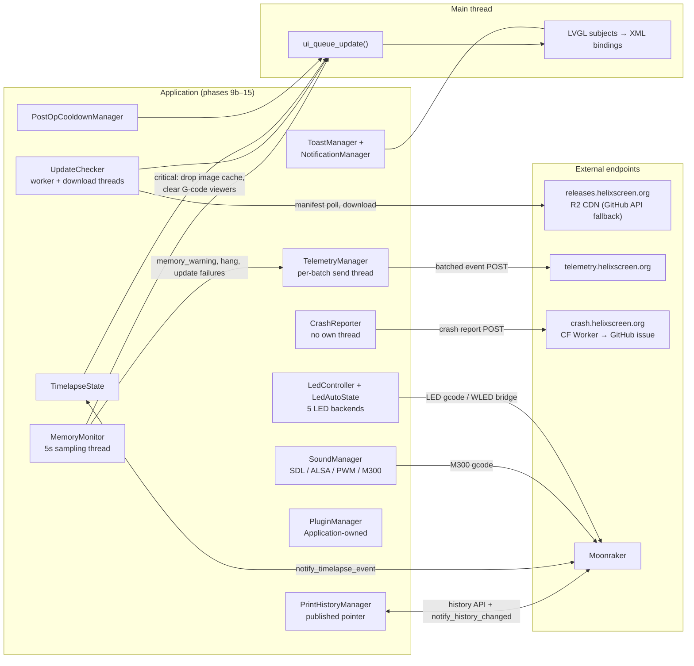

# 12 — System services

Everything in this chapter is a long-running service the UI talks to rather than a panel or a data source: updates, crash delivery, telemetry, sound, LEDs, memory pressure, cooldowns, print-history caching, timelapse state, notifications, plugins. They share one shape — started by `Application` between phases 9b and 15, mostly `::instance()` singletons, mostly reaching off the main thread for network or `/proc` and marshaling results back through `ui_queue_update()`. This is a map chapter: one summary table, four grouped tours, and a link to the deep dive for each service that has one.

## Key files

| File | Role |
|------|------|
| [`include/system/update_checker.h`](../../../include/system/update_checker.h) | UpdateChecker: channels, `Status`/`DownloadStatus` ladders, `MIN_CHECK_INTERVAL` |
| [`src/system/update_checker.cpp`](../../../src/system/update_checker.cpp) | Check/download/install pipeline, print-guard, both background threads |
| [`include/system/crash_reporter.h`](../../../include/system/crash_reporter.h) | CrashReporter: pending-crash detection, report collection, delivery |
| [`include/system/telemetry_manager.h`](../../../include/system/telemetry_manager.h) | TelemetryManager: opt-in event queue, batching, thread contract |
| [`include/sound_manager.h`](../../../include/sound_manager.h) | SoundManager: backend selection, M300 gating, priorities |
| [`src/system/sound_manager.cpp`](../../../src/system/sound_manager.cpp) | Backend auto-detection (SDL → ALSA → PWM), M300 install, device switching |
| [`include/led/led_controller.h`](../../../include/led/led_controller.h) | LedController + all five backend adapters |
| [`include/led/led_auto_state.h`](../../../include/led/led_auto_state.h) | LedAutoState: state-key computation and action mapping |
| [`include/memory_monitor.h`](../../../include/memory_monitor.h) | MemoryMonitor: pressure levels, tier-aware thresholds, responders |
| [`include/post_op_cooldown_manager.h`](../../../include/post_op_cooldown_manager.h) | PostOpCooldownManager: the whole design in ~75 documented lines |
| [`src/plugin/plugin_manager.cpp`](../../../src/plugin/plugin_manager.cpp) | PluginManager: discovery, load, core-service injection |
| [`src/print/print_history_manager.cpp`](../../../src/print/print_history_manager.cpp) | PrintHistoryManager: shared cache, Moonraker subscription |
| [`include/timelapse_state.h`](../../../include/timelapse_state.h) / [`src/printer/timelapse_state.cpp`](../../../src/printer/timelapse_state.cpp) | TimelapseState: event dispatch to subjects |
| [`include/ui_notification_manager.h`](../../../include/ui_notification_manager.h) / [`include/ui_toast_manager.h`](../../../include/ui_toast_manager.h) | Badge+history manager and transient toast stack |

Boundary of the chapter, so the map does not double as a table of contents: `Config`/`SettingsManager` persistence is chapter 05's subject; the `UpdateQueue` bridge these services all ride is chapters 02–03; the watchdog and splash processes around the app are chapter 11; the remote-control server and camera/peripherals are chapter 13. What stays here is the service roster below.

## How it works

The full roster, verified against the tree (chapter 05 has the complete singleton map; these are the service rows plus the two that are *not* singletons):

| Service | Construction | Owns subjects? | Background thread? | Deep dive |
|---------|--------------|----------------|--------------------|-----------|
| `UpdateChecker` | `::instance()` | yes (status/progress) | worker + download | [`../UPDATE_SYSTEM.md`](../UPDATE_SYSTEM.md) |
| `CrashReporter` | `::instance()` | no (modal is imperative) | no | [`../CRASH_REPORTER.md`](../CRASH_REPORTER.md) |
| `TelemetryManager` | `::instance()` | yes (enabled) | per-batch send | [`../TELEMETRY_ADMIN.md`](../TELEMETRY_ADMIN.md) |
| `SoundManager` | `::instance()` | no | sequencer (backend-owned) | [`../SOUND_SYSTEM.md`](../SOUND_SYSTEM.md) |
| `LedController` | `::instance()` | yes (per-strip RGBW) | no | [`../LED_CONTROL.md`](../LED_CONTROL.md) |
| `MemoryMonitor` | `::instance()` | no | 5s sampler | none |
| `PostOpCooldownManager` | `::instance()` | no | no (lv_timer) | none |
| `PrintHistoryManager` | Application-owned ([`application.cpp:2089`](../../../src/application/application.cpp#L2089)), published as nullable pointer ([`app_globals.h:116`](../../../include/app_globals.h#L116)) | no | no (client callbacks) | none |
| `TimelapseState` | `::instance()` | yes | no (client callbacks) | [`../TIMELAPSE.md`](../TIMELAPSE.md) |
| `ToastManager` / `NotificationManager` | `::instance()` each | yes (badge/count) | no | none |
| `PluginManager` | Application-owned `unique_ptr` ([`application.cpp:2130`](../../../src/application/application.cpp#L2130)) — **not** `::instance()` | no | plugins may spawn their own | [`../PLUGIN_DEVELOPMENT.md`](../PLUGIN_DEVELOPMENT.md) |

When each one comes up is chapter 11's ladder; the service-eye view, with the call sites to grep for:

| Boot phase | Services wired | Call sites ([`src/application/application.cpp`](../../../src/application/application.cpp)) |
|------------|----------------|--------------------------------------------------|
| 9b | UpdateChecker, UpgradeBanner, CrashHistory + CrashReporter, TelemetryManager, PrintHistoryManager | `:763`, `:769`, `:778`–`:784`, `:2089` |
| 9d follow-on | SoundManager (backend pick + startup tone), PostOpCooldownManager | `:828`, `:843` |
| 11b | CrashReportModal — only if a pending crash survives suppression | `:876`–`:903` |
| during connect | Timelapse subscription; telemetry `start_auto_send()` | `:2949`, `:3485` |
| 14 | PluginManager discover + load | `:2130` |
| 15 | MemoryMonitor sampling, hang detector, pressure responders | `:1016`–`:1091` |

### Update & recovery

**UpdateChecker** is a singleton with two joined worker threads (`worker_thread_`, [`src/system/update_checker.cpp:2452`](../../../src/system/update_checker.cpp#L2452); `download_thread_`, `:1289`). It polls a release manifest on the R2 CDN at `releases.helixscreen.org` (GitHub releases API as fallback — chapter 04 has the endpoint story) on three channels: Stable, Beta, Dev (`UpdateChannel`, [`include/system/update_checker.h:116`](../../../include/system/update_checker.h#L116)). Checks are rate-limited to `MIN_CHECK_INTERVAL = 10 minutes` ([`update_checker.h:557`](../../../include/system/update_checker.h#L557) — the old monolith's "1 check per hour" was stale); auto-check runs 15s after boot, then every 24h ([`update_checker.h:437`](../../../include/system/update_checker.h#L437)). The install ladder is the `DownloadStatus` enum ([`update_checker.h:121`](../../../include/system/update_checker.h#L121)):

| Step | What happens | Guard |
|------|--------------|-------|
| Confirming | User confirms the release-notes modal | Downgrades offered explicitly, never auto-notified (`is_downgrade`, [`update_checker.h:96`](../../../include/system/update_checker.h#L96)) |
| Downloading | `download_thread_` fetches the platform zip | Blocked while `PRINTING`/`PAUSED` (`:1246`, reported to telemetry) |
| Verifying | SHA-256 zip integrity (`:1427`) + ELF architecture check (`:1457`) | Wrong-arch or corrupt archive aborts before install |
| Installing | [`install.sh`](../../../scripts/install.sh) via fork/exec — no shell (`:414`) | Space pre-check; systemd `NoNewPrivileges` workaround (`:501`) |
| Complete → Restarting | Static restart screen, then exit for the watchdog to restart | — |

Config is read on the main thread and cached *before* the worker spawns, because Config is not thread-safe; results reach the UI only via `ui_queue_update()`.

**CrashReporter** owns no thread (chapter 03 corrected the old diagram on this). The crash handler writes `<config/crash.txt>` at death time; on the next healthy launch, phase 11b decides whether to show `CrashReportModal` ([`application.cpp:876`](../../../src/application/application.cpp#L876)–`:903`) — three guards suppress the dialog first: a crash from a post-update restart, an unparseable record (signal handler killed mid-write — OOM-killer, power loss), and duplicate fingerprints. `try_auto_send()` ([`src/system/crash_reporter.cpp:998`](../../../src/system/crash_reporter.cpp#L998)) POSTs the report JSON to a Cloudflare Worker at `crash.helixscreen.org/v1/report`, which files a GitHub issue; a failed send leaves the file so the modal can offer manual retry. Handled records are deleted to prevent re-processing ([`crash_reporter.h:233`](../../../include/system/crash_reporter.h#L233)). Delivery rides existing HTTP paths — on Android, a JNI bridge to Java's `HttpURLConnection` ([`crash_reporter.cpp:917`](../../../src/system/crash_reporter.cpp#L917)) — which is *why* it needs no thread of its own. The watchdog half of crash recovery — exit-code translation, the recovery dialog, Safe Mode — is chapter 11.

Adjacent to the updater sits **UpgradeBanner** (`::instance()`, [`include/upgrade_banner.h`](../../../include/upgrade_banner.h)), a persistent top-banner widget initialized at phase 9b ([`application.cpp:769`](../../../src/application/application.cpp#L769)) that nudges users toward a pending release with an intensity setting (`/upgrade_nudge/intensity`) that defaults to `off`. It is update *messaging*, not update *machinery* — the download pipeline never goes through it.

### Feedback channels

**SoundManager** auto-detects a host-side backend in `create_backend()` ([`src/system/sound_manager.cpp:377`](../../../src/system/sound_manager.cpp#L377)), then installs M300 separately once discovery speaks:

| Backend | Picked when | Plays via |
|---------|-------------|-----------|
| SDL | Desktop builds where SDL audio initializes | SDL audio device |
| ALSA PCM | Linux with `HELIX_HAS_ALSA`; a stale saved/env device retries `default` before falling through | ALSA PCM device (runtime-switchable) |
| PWM sysfs | Platform-gated (`HELIX_HAS_PWM_SOUND`), `/sys/class/pwm/pwmchip0` present | sysfs buzzer |
| M300 | **Lazily**, after hardware discovery confirms a speaker *and* the Klipper config defines an `M300` macro ([`sound_manager.cpp:90`](../../../src/system/sound_manager.cpp#L90)–`128`) | Klipper gcode through the injected Moonraker client |

Installing M300 eagerly on a beeper-less printer creates a feedback loop (`M300` → `!! Unknown command` → error toast → error tone → another `M300`). The Moonraker client used by M300 is injected at [`moonraker_manager.cpp:435`](../../../src/application/moonraker_manager.cpp#L435) and dropped when the client clears ([`sound_manager.cpp:54`](../../../src/system/sound_manager.cpp#L54) — switching printers must not carry M300 over to a machine without a beeper). ALSA device choice is lockable via `HELIX_ALSA_DEVICE`; alarm-priority sounds bypass muting ([`sound_manager.cpp:265`](../../../src/system/sound_manager.cpp#L265)). Sound *themes* are JSON in `assets/config/sounds/`; on printer switch the manager is shut down and re-initialized ([`application.cpp:4307`](../../../src/application/application.cpp#L4307), `:4325`) so the backend set matches the new machine.

**LED** control is `LedController` (singleton, self-registers its `deinit_subjects`, [`src/led/led_controller.cpp:78`](../../../src/led/led_controller.cpp#L78)) fronting five backends: Native (Klipper `neopixel`/`dotstar`/`led`), LedEffect (the `led_effect` plugin), WLED (network strips via Moonraker's HTTP bridge), Macro (user-configured macros), and OutputPin (brightness-only pins). `LedAutoState` ([`include/led/led_auto_state.h`](../../../include/led/led_auto_state.h)) observes klippy-state, print-state, and extruder-target subjects and computes one of six state keys with a fixed priority — `error` first, then `printing`/`paused`/`complete`, then `heating`, finally `idle` (`compute_state_key`, [`src/led/led_auto_state.cpp:112`](../../../src/led/led_auto_state.cpp#L112)) — and applies the user's per-state mapping (`color`, `brightness`, `effect`, `wled_preset`, `macro`, or `off`). `PrinterLedState` ([`include/printer_led_state.h`](../../../include/printer_led_state.h)) is the display-side sibling: per-strip RGBW subjects that feed the LED home-panel widget.

**Notifications and toasts** are two singletons with different jobs. `ToastManager` is the transient channel: toasts stack in the top-right, each with its own dismiss timer and optional action button, and the stack caps at `MAX_VISIBLE = 5` — overflow **silently drops the oldest**, no queueing ([`include/ui_toast_manager.h:30`](../../../include/ui_toast_manager.h#L30)–`35`). Roughly 56 files under `src/` call it, which is the point: any service can raise a toast without owning UI. `NotificationManager` is the persistent channel: navbar badge (unread count, severity color, pulse) plus the history panel. It registers three subjects — `notification_count`, `notification_count_text`, `notification_severity` ([`include/ui_notification_manager.h:60`](../../../include/ui_notification_manager.h#L60)–`63`) — and its ordering contract is strict: `register_callbacks()` and `init_subjects()` before `app_layout` XML is created, `init()` after (`:29`–`32`).

### Ambient monitoring

**TelemetryManager** is opt-in and **OFF by default** — it only activates after the user enables it in settings ([`include/system/telemetry_manager.h:102`](../../../include/system/telemetry_manager.h#L102)). Events (session, print outcomes, memory warnings, update failures, errors) are recorded thread-safely, persisted to disk so they survive restarts, capped at `MAX_QUEUE_SIZE` (oldest dropped), and sent as batches on a per-batch thread to `telemetry.helixscreen.org/v1/events` (chapter 04). Startup spreads three calls across the boot ladder (chapter 11): `init()` at phase 9b, `record_session()` on discovery completion, `start_auto_send()` inside `connect_moonraker()`.

**MemoryMonitor** samples `/proc/self/status` every 5 seconds ([`application.cpp:1016`](../../../src/application/application.cpp#L1016), phase 15) on its own thread and classifies pressure into four levels — `none`/`elevated`/`warning`/`critical` ([`include/memory_monitor.h:37`](../../../include/memory_monitor.h#L37)) — against device-tier thresholds with hysteresis (levels clear at 90% of the trigger, [`src/system/memory_monitor.cpp:58`](../../../src/system/memory_monitor.cpp#L58)). Its consumers, all wired in phase 15:

| Trigger | Consumer | Action |
|---------|----------|--------|
| Any threshold breach | TelemetryManager | `record_memory_warning` event |
| Main loop silent past threshold | TelemetryManager + crash breadcrumb | `record_error("ui", "main_loop_hang", …)` — detection only, by design: the UI thread is wedged, so UpdateQueue would never drain |
| `critical` | LVGL image cache | Drop decoded-image cache (re-decode on next draw beats an OOM kill) |
| `critical` | G-code viewers | Clear all live viewers; each panel's callback flips its mode subject back to thumbnail |

Both `critical` responders fire on the monitor thread and defer the actual LVGL calls through `queue_update()` ([`application.cpp:1063`](../../../src/application/application.cpp#L1063)–`1091`). Outside pressure monitoring, MemoryMonitor also takes heap snapshots at boot milestones (`log_now("after_fonts_loaded")`, etc. — [`application.cpp:1141`](../../../src/application/application.cpp#L1141)–`1856`) that anchor the memory stats panel.

**PostOpCooldownManager** is the single funnel for heater cooldown after filament operations — FilamentPanel, the AMS sidebar, and AMS backends all call `schedule()`/`cancel()` instead of owning timers. `schedule()` reads two config keys directly (`/filament/cooldown_delay_seconds`, default 120s, and the `/filament/auto_cooldown` opt-out) rather than the SettingsManager subject, because it must be callable from any thread; timer mutations defer to the main thread via `queue_update()`. At fire time it checks extruder target > 0 and print state not `PRINTING`/`PAUSED` before sending the cooldown. The header ([`include/post_op_cooldown_manager.h`](../../../include/post_op_cooldown_manager.h)) documents all of this in ~75 lines and is its own deep dive.

### Data & extension services

**PrintHistoryManager** is *not* a singleton in the `::instance()` sense: `Application` constructs it with the Moonraker API and client ([`application.cpp:2089`](../../../src/application/application.cpp#L2089)) and publishes it as a **nullable** pointer through [`app_globals.h`](../../../include/app_globals.h) (`get_print_history_manager()`). It exists to cache: one copy of job history serves two views — the raw jobs list for the history panels and a per-filename stats map (`get_filename_stats()`, success/failure counts + last status) driving the indicators in print select. Panels follow the header's recipe: register an observer in the constructor, `fetch()` on first activate, repaint from the cache afterwards, remove the observer on destruction. The manager subscribes to **two** Moonraker notifications: `notify_history_changed` (job added or history cleared) and `notify_filelist_changed` (file deleted — without it the cache keeps serving a job whose file is gone, offering "Reprint Last" for a phantom file; both subscriptions invalidate + re-fetch through a `token.defer()`, [`src/print/print_history_manager.cpp:250`](../../../src/print/print_history_manager.cpp#L250)).

**TimelapseState** is the Moonraker timelapse plugin's client-side shadow: `Application` registers `notify_timelapse_event` → `TimelapseState::handle_timelapse_event` ([`application.cpp:2949`](../../../src/application/application.cpp#L2949)), which turns `newframe` and `render` events into frame-count and render-progress subjects ([`src/printer/timelapse_state.cpp:70`](../../../src/printer/timelapse_state.cpp#L70)–`109`, subjects init'd in [`subject_initializer.cpp:378`](../../../src/application/subject_initializer.cpp#L378)) plus throttled toasts during long renders. All subject writes go through `queue_update()`; the subscription is unregistered during shutdown. The surrounding UX — install wizard ([`ui_overlay_timelapse_install.h`](../../../include/ui_overlay_timelapse_install.h)), video list ([`ui_overlay_timelapse_videos.h`](../../../include/ui_overlay_timelapse_videos.h)), print-screen toggle — is [`TIMELAPSE.md`](../TIMELAPSE.md) territory.

**PluginManager** (`helix::plugin::PluginManager`) is Application-owned — a `unique_ptr` member, **not** `::instance()` — compiled in only when `HELIX_HAS_PLUGINS=1` (default on, `Makefile:973`). `init_plugins()` (phase 14, [`application.cpp:2127`](../../../src/application/application.cpp#L2127)) injects the core services (Moonraker API, client, PrinterState, Config), reads the enabled list from `/plugins/enabled`, discovers the `plugins/` directory, and loads. A failed load surfaces as a warning toast with a **Disable** action button rather than a boot failure. Plugins receive a `PluginAPI`, inject UI at named points ([`src/plugin/injection_point_manager.cpp`](../../../src/plugin/injection_point_manager.cpp)), and may spawn their own threads under the threading rules of chapter 03.

## Patterns & gotchas

- **Nine singletons, two owned objects — do not "fix" the split.** `PluginManager` and `PrintHistoryManager` are Application-owned by design (test isolation, explicit lifetime); adding `::instance()` to them breaks both properties. `get_print_history_manager()` returns **nullptr** before phase 9c — always null-check.
- **Every service here follows the UpdateQueue rule.** UpdateChecker results, MemoryMonitor responders, Timelapse events, and PostOpCooldown timers all reach LVGL through `ui_queue_update()` / `queue_update()`; `PostOpCooldownManager::schedule()` is explicitly documented as callable from any thread. A new service that touches a subject from its own thread violates chapter 03.
- **The M300 install gate is a feedback-loop guard, not an optimization** — installing M300 without a matching Klipper macro loops error tones forever. Same class of trap: alarm-priority sounds bypass mute, so don't route user-facing chirps through `SoundPriority::ALARM`.
- **A manual update tap inside 10 minutes is a silent no-op by design** — it returns the cached result and logs at `debug` only, which reads as "the button does nothing" in bug reports.
- **UpdateChecker must cache Config on the main thread before spawning its worker** — Config is not thread-safe, and the worker must not read it.
- **NotificationManager's before/after-XML split is load-bearing**: callbacks and subjects before `lv_xml_create`, `init()` after. Reordering either half breaks bindings or the badge widget.
- **Telemetry is OFF unless opted in.** Tests that assert on telemetry events must enable it explicitly; a "telemetry is broken" report is usually "it was never turned on".
- **Subject-owning services self-register their `deinit_subjects()`** — LedController does it at the end of `init()` ([`src/led/led_controller.cpp:78`](../../../src/led/led_controller.cpp#L78)), NotificationManager exposes its own for the same reason. A new service with XML-bound subjects joins `StaticSubjectRegistry` itself; nobody registers it from outside (chapters 02 and 05 own the rule).
- **UpdateChecker's `Status`/`DownloadStatus` ordinals are XML-visible** — the update modals ([`ui_xml/update_notify_modal.xml`](../../../ui_xml/update_notify_modal.xml), [`ui_xml/update_download_modal.xml`](../../../ui_xml/update_download_modal.xml)) bind on enum values, so renumbering either enum breaks the progress UI silently. Insert new states at the end.
- **Moonraker-method subscriptions are a shutdown obligation** — `notify_timelapse_event` and `notify_history_changed` handlers are unregistered in `Application::shutdown()` ([`application.cpp:4759`](../../../src/application/application.cpp#L4759), `:5072`); a new service subscribing to a notification must add its unregister or crash teardown.
- **Services stop early in the shutdown ladder.** Step 1 (chapter 11) clears the service managers — UpdateChecker, Telemetry, CrashHistory, Sound, plugins — *before* panels and subjects die, so a service's teardown must not depend on either. `SoundManager::shutdown()` ([`application.cpp:5051`](../../../src/application/application.cpp#L5051)) joins the sequencer thread here.
- **`--test` disables the crash machinery** (chapter 11) — CrashReporter behaviors need `--mock-crash` or a real crash to test.

## Going deeper

- [`../UPDATE_SYSTEM.md`](../UPDATE_SYSTEM.md) — release channels, the R2 CDN layout, platform detection, and the updater-hiding predicates this chapter compresses.
- [`../CRASH_REPORTER.md`](../CRASH_REPORTER.md) — crash.txt format, the CF Worker payload schema, backtrace resolution, and the modal flow.
- [`../TELEMETRY_ADMIN.md`](../TELEMETRY_ADMIN.md) — the server side: worker endpoints, analytics engine, dashboard, retention.
- [`../SOUND_SYSTEM.md`](../SOUND_SYSTEM.md) — backend internals, the priority system, and the JSON theme schema.
- [`../LED_CONTROL.md`](../LED_CONTROL.md) — all five backends in detail, the control/settings overlays, and the home-panel LED widget.
- [`../TIMELAPSE.md`](../TIMELAPSE.md) — the Moonraker timelapse plugin protocol and the video-management UI.
- [`../PLUGIN_DEVELOPMENT.md`](../PLUGIN_DEVELOPMENT.md) — the plugin lifecycle, `PluginAPI` reference, UI injection, and threading rules for plugin authors.
- [`11-startup-shutdown.md`](11-startup-shutdown.md) — the exact phases where each service starts and the shutdown ladder that stops them.
- [`04-moonraker.md`](04-moonraker.md) — the network endpoints these services talk to and which of them never touch the Moonraker socket.
- [`03-threading-lifetime.md`](03-threading-lifetime.md) — the joined-worker pattern UpdateChecker and TelemetryManager follow.

## Guided code tour

Read in this order; about 30 minutes total.

1. [`include/system/update_checker.h:80`](../../../include/system/update_checker.h#L80) — the class doc plus `Status`/`UpdateChannel`/`DownloadStatus`: the whole pipeline as three enums.
2. [`src/system/update_checker.cpp:1240`](../../../src/system/update_checker.cpp#L1240) — the print-guard block and its telemetry report; then `:1289` where `download_thread_` spawns.
3. [`src/system/sound_manager.cpp:377`](../../../src/system/sound_manager.cpp#L377) — `create_backend()`: the SDL → ALSA → PWM ladder and the per-platform PWM gating comment.
4. [`src/system/sound_manager.cpp:88`](../../../src/system/sound_manager.cpp#L88) — the M300 install gate and the feedback-loop comment above it.
5. [`src/led/led_auto_state.cpp:112`](../../../src/led/led_auto_state.cpp#L112) — `compute_state_key()`: the six-key priority chain in 45 lines.
6. [`include/memory_monitor.h:37`](../../../include/memory_monitor.h#L37) — `MemoryPressureLevel` and `MemoryThresholds`: levels, tiers, hysteresis fields.
7. [`src/application/application.cpp:1016`](../../../src/application/application.cpp#L1016) — phase 15 wiring: `start(5000)`, the warning callback, hang detection, both pressure responders.
8. [`include/system/telemetry_manager.h:20`](../../../include/system/telemetry_manager.h#L20) — the block-comment architecture diagram (collect → persist → batch → POST) and the thread contract.
9. [`include/post_op_cooldown_manager.h:8`](../../../include/post_op_cooldown_manager.h#L8) — the entire header; the threading and opt-out rules are in the doc comments.
10. [`src/application/application.cpp:876`](../../../src/application/application.cpp#L876) — the crash-dialog gate: the three suppression paths (post-update, unparseable, duplicate) before `CrashReportModal`.
11. [`src/application/application.cpp:2127`](../../../src/application/application.cpp#L2127) — `init_plugins()`: owned manager, service injection, the error toast with Disable action.
12. [`src/print/print_history_manager.cpp:240`](../../../src/print/print_history_manager.cpp#L240) — the `notify_history_changed` registration and `token.defer()` invalidation.
13. [`src/printer/timelapse_state.cpp:70`](../../../src/printer/timelapse_state.cpp#L70) — `handle_timelapse_event()`: newframe/render branches and subject updates.
14. [`include/ui_toast_manager.h:30`](../../../include/ui_toast_manager.h#L30) — the stack semantics comment, then [`include/ui_notification_manager.h:29`](../../../include/ui_notification_manager.h#L29) for the before/after-XML ordering contract.
