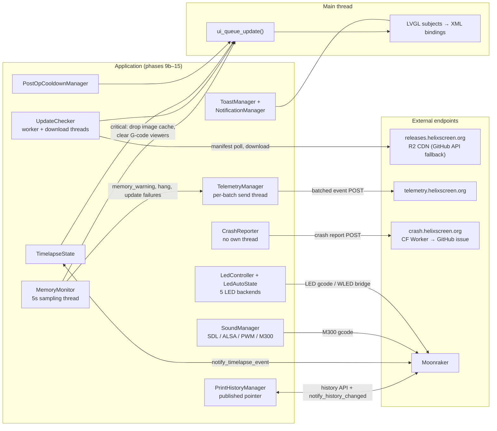

# 12 — System services

Everything in this chapter is a long-running service the UI talks to rather than a panel or a data source: updates, crash delivery, telemetry, sound, LEDs, memory pressure, cooldowns, print-history caching, timelapse state, notifications, plugins. They share one shape — started by `Application` between phases 9b and 15, mostly `::instance()` singletons, mostly reaching off the main thread for network or `/proc` and marshaling results back through `ui_queue_update()`. This is a map chapter: one summary table, four grouped tours, and a link to the deep dive for each service that has one.

```mermaid
flowchart LR
    subgraph ext["External endpoints"]
        R2["releases.helixscreen.org<br/>R2 CDN (GitHub API fallback)"]
        TEL["telemetry.helixscreen.org"]
        CRASHW["crash.helixscreen.org<br/>CF Worker → GitHub issue"]
        MR["Moonraker"]
    end

    subgraph app["Application (phases 9b–15)"]
        UC["UpdateChecker<br/>worker + download threads"]
        TLM["TelemetryManager<br/>per-batch send thread"]
        CR["CrashReporter<br/>no own thread"]
        MM["MemoryMonitor<br/>5s sampling thread"]
        SND["SoundManager<br/>SDL / ALSA / PWM / M300"]
        LED["LedController + LedAutoState<br/>5 LED backends"]
        POC["PostOpCooldownManager"]
        PH["PrintHistoryManager<br/>published pointer"]
        TS["TimelapseState"]
        NTF["ToastManager +<br/>NotificationManager"]
    end

    subgraph main["Main thread"]
        Q["ui_queue_update()"]
        SUBJ["LVGL subjects → XML bindings"]
    end

    UC -->|"manifest poll, download"| R2
    TLM -->|"batched event POST"| TEL
    CR -->|"crash report POST"| CRASHW
    PH <-->|"history API + notify_history_changed"| MR
    TS <-->|"notify_timelapse_event"| MR
    SND -->|"M300 gcode"| MR
    LED -->|"LED gcode / WLED bridge"| MR
    MM -->|"memory_warning, hang, update failures"| TLM
    MM -->|"critical: drop image cache,<br/>clear G-code viewers"| Q
    UC --> Q
    TS --> Q
    POC --> Q
    Q --> SUBJ
    NTF --- SUBJ
```

## Key files

| File | Role |
|------|------|
| [`include/system/update_checker.h`](../../../include/system/update_checker.h) | UpdateChecker: channels, `Status`/`DownloadStatus` ladders, `MIN_CHECK_INTERVAL` |
| [`src/system/update_checker.cpp`](../../../src/system/update_checker.cpp) | Check/download/install pipeline, print-guard, both background threads |
| [`include/system/crash_reporter.h`](../../../include/system/crash_reporter.h) | CrashReporter: pending-crash detection, report collection, delivery |
| [`include/system/telemetry_manager.h`](../../../include/system/telemetry_manager.h) | TelemetryManager: opt-in event queue, batching, thread contract |
| [`include/sound_manager.h`](../../../include/sound_manager.h) | SoundManager: backend selection, M300 gating, priorities |
| [`src/system/sound_manager.cpp`](../../../src/system/sound_manager.cpp) | Backend auto-detection (SDL → ALSA → PWM), M300 install, device switching |
| [`include/led/led_controller.h`](../../../include/led/led_controller.h) | LedController + all five backend adapters |
| [`include/led/led_auto_state.h`](../../../include/led/led_auto_state.h) | LedAutoState: state-key computation and action mapping |
| [`include/memory_monitor.h`](../../../include/memory_monitor.h) | MemoryMonitor: pressure levels, tier-aware thresholds, responders |
| [`include/post_op_cooldown_manager.h`](../../../include/post_op_cooldown_manager.h) | PostOpCooldownManager: the whole design in ~75 documented lines |
| [`src/print/print_history_manager.cpp`](../../../src/print/print_history_manager.cpp) | PrintHistoryManager: shared cache, Moonraker subscription |
| [`include/timelapse_state.h`](../../../include/timelapse_state.h) / [`src/printer/timelapse_state.cpp`](../../../src/printer/timelapse_state.cpp) | TimelapseState: event dispatch to subjects |
| [`include/ui_notification_manager.h`](../../../include/ui_notification_manager.h) / [`include/ui_toast_manager.h`](../../../include/ui_toast_manager.h) | Badge+history manager and transient toast stack |

Boundary of the chapter, so the map does not double as a table of contents: `Config`/`SettingsManager` persistence is chapter 05's subject; the `UpdateQueue` bridge these services all ride is chapters 02–03; the watchdog and splash processes around the app are chapter 11; the remote-control server and camera/peripherals are chapter 13. What stays here is the service roster below.

## How it works

The full roster, verified against the tree (chapter 05 has the complete singleton map; these are the service rows plus the two that are *not* singletons):

| Service | Construction | Owns subjects? | Background thread? | Deep dive |
|---------|--------------|----------------|--------------------|-----------|
| `UpdateChecker` | `::instance()` | yes (status/progress) | worker + download | [`../UPDATE_SYSTEM.md`](../UPDATE_SYSTEM.md) |
| `CrashReporter` | `::instance()` | no (modal is imperative) | no | [`../CRASH_REPORTER.md`](../CRASH_REPORTER.md) |
| `TelemetryManager` | `::instance()` | yes (enabled) | per-batch send | [`../TELEMETRY_ADMIN.md`](../TELEMETRY_ADMIN.md) |
| `SoundManager` | `::instance()` | no | sequencer (backend-owned) | [`../SOUND_SYSTEM.md`](../SOUND_SYSTEM.md) |
| `LedController` | `::instance()` | yes (per-strip RGBW) | no | [`../LED_CONTROL.md`](../LED_CONTROL.md) |
| `MemoryMonitor` | `::instance()` | no | 5s sampler | none |
| `PostOpCooldownManager` | `::instance()` | no | no (lv_timer) | none |
| `PrintHistoryManager` | Application-owned ([`src/application/printer_session.cpp#init_moonraker`](../../../src/application/application.cpp#L2154)), published as nullable pointer ([`include/app_globals.h#get_print_history_manager`](../../../include/app_globals.h#L116)) | no | no (client callbacks) | none |
| `TimelapseState` | `::instance()` | yes | no (client callbacks) | [`../TIMELAPSE.md`](../TIMELAPSE.md) |
| `ToastManager` / `NotificationManager` | `::instance()` each | yes (badge/count) | no | none |

When each one comes up is chapter 11's ladder; the service-eye view, with the call sites to grep for:

| Boot phase | Services wired | Call sites ([`src/application/application.cpp`](../../../src/application/application.cpp)) |
|------------|----------------|--------------------------------------------------|
| 9b | UpdateChecker, UpgradeBanner, CrashHistory + CrashReporter, TelemetryManager, PrintHistoryManager | `src/application/application.cpp#"UpdateChecker::instance().init()"`, `src/application/application.cpp#"UpgradeBanner::instance().init()"`, `src/application/application.cpp#"CrashHistory::instance().init"`-`src/application/application.cpp#"TelemetryManager::instance().init(user_config_dir)"`, `src/application/application.cpp#"std::make_unique<PrintHistoryManager>"` |
| 9d follow-on | SoundManager (backend pick + startup tone), PostOpCooldownManager | `src/application/application.cpp#"Initialize SoundManager (audio feedback)"`, `src/application/application.cpp#"PostOpCooldownManager::instance().init()"` |
| 11b | CrashReportModal — only if a pending crash survives suppression | `src/application/application.cpp#"bool show_crash_dialog ="`-`src/application/application.cpp#"CrashReportModal::show_owned(report)"` |
| during connect | Timelapse subscription; telemetry `start_auto_send()` | `src/application/printer_session.cpp#setup_discovery_callbacks`, `src/application/printer_session.cpp#connect_moonraker` |
| 15 | MemoryMonitor sampling, hang detector, pressure responders | `src/application/application.cpp#"Phase 15: Start memory monitoring"`-`src/application/application.cpp#"Drop all live G-code viewer state on critical pressure"` |

### Update & recovery

**UpdateChecker** is a singleton with two worker threads: `worker_thread_` ([`src/system/update_checker.cpp#check_for_updates`](../../../src/system/update_checker.cpp#L2581)), joined in the destructor, and `download_thread_` (`include/system/update_checker.h#UpdateChecker/download_thread_`), which is *not* — it is bounded-then-detached by `reap_download_thread()` (`src/system/update_checker.cpp#reap_download_thread`) because libhv's synchronous `downloadFile()` cannot be interrupted. Chapter 03 has the full reasoning. It polls a release manifest on the R2 CDN at `releases.helixscreen.org` (GitHub releases API as fallback — chapter 04 has the endpoint story) on three channels: Stable, Beta, Dev (`UpdateChannel`, [`include/system/update_checker.h#UpdateChannel`](../../../include/system/update_checker.h#L116)). Checks are rate-limited to `MIN_CHECK_INTERVAL = 10 minutes` ([`include/system/update_checker.h#MIN_CHECK_INTERVAL`](../../../include/system/update_checker.h#L590) — the old monolith's "1 check per hour" was stale); auto-check runs 15s after boot, then every 24h ([`include/system/update_checker.h#UpdateChecker`](../../../include/system/update_checker.h#L464)). The install ladder is the `DownloadStatus` enum ([`include/system/update_checker.h#DownloadStatus`](../../../include/system/update_checker.h#L121)):

| Step | What happens | Guard |
|------|--------------|-------|
| Confirming | User confirms the release-notes modal | Downgrades offered explicitly, never auto-notified (`is_downgrade`, [`include/system/update_checker.h#ReleaseInfo`](../../../include/system/update_checker.h#L96)) |
| Downloading | `download_thread_` fetches the platform zip | Blocked while `PRINTING`/`PAUSED` (`src/system/update_checker.cpp#"refuse download while a job owns the machine"`, reported to telemetry); re-entry blocked while a previous worker is alive (`src/system/update_checker.cpp#"Previous download worker still running"`) |
| Verifying | archive integrity (`src/system/update_checker.cpp#verify_zip_integrity`) + ELF architecture check (`src/system/update_checker.cpp#validate_elf_architecture`) + SHA-256 when the manifest supplies one | Wrong-arch or corrupt archive aborts before install |
| Installing | `install.sh` (bundled from [`scripts/lib/installer/`](../../../scripts/lib/installer/)) via `safe_exec()` fork/exec — no shell (`src/system/update_checker.cpp#safe_exec`) | Space pre-check; systemd `NoNewPrivileges` workaround (`src/system/update_checker.cpp#cleanup_stale_old_install`) |
| Complete → Restarting | `finish_install_and_restart()` (`src/system/update_checker.cpp#finish_install_and_restart`) holds the Complete frame 2s, publishes `Restarting`, holds 1s, then hands `::_exit(0)` to the LVGL thread via `queue_update()` | The holds exist because `report_download_status()` only *queues* its subject write — exiting straight after it left "Installing..." as the last painted frame |

Config is read on the main thread and cached *before* the worker spawns, because Config is not thread-safe; results reach the UI only via `ui_queue_update()`.

Cancel is **deferred**, and `DownloadStatus` does not model it. `cancel_download()` (`src/system/update_checker.cpp#cancel_download`) sets a flag the worker reads only after `downloadFile()` returns, while the modal resets the status to `Idle` the moment the user taps Cancel — so `Idle` can mean "a worker is still inside an hour-long blocking call". `download_in_flight()` is the authoritative answer, and `start_download()` gates re-entry on it (`src/system/update_checker.cpp#"Previous download worker still running"`), refusing with an `Error` rather than joining. Every early return from `start_download()` must report *some* non-`Idle` status: [`ui_xml/update_download_modal.xml`](../../../ui_xml/update_download_modal.xml) binds every container and every button row to a non-zero `download_status`, so a silent return renders an empty dialog with no buttons.

**CrashReporter** owns no thread; uploads run on the calling thread via `helix::ingest::post`. The crash handler writes `<config/crash.txt>` at death time; on the next healthy launch, phase 11b decides whether to show `CrashReportModal` ([`src/application/application.cpp#run`](../../../src/application/application.cpp#L900)–`src/application/application.cpp#"CrashReportModal::show_owned(report)"`) — three guards suppress the dialog first: a crash from a post-update restart, an unparseable record (signal handler killed mid-write — OOM-killer, power loss), and duplicate fingerprints. `try_auto_send()` ([`src/system/crash_reporter.cpp#try_auto_send`](../../../src/system/crash_reporter.cpp#L998)) POSTs the report JSON to a Cloudflare Worker at `crash.helixscreen.org/v1/report`, which files a GitHub issue; a failed send leaves the file so the modal can offer manual retry. Handled records are deleted to prevent re-processing ([`include/system/crash_reporter.h#CrashReporter`](../../../include/system/crash_reporter.h#L233)). Delivery goes through `helix::ingest::post` ([`src/system/ingest_client.cpp#post`](../../../src/system/ingest_client.cpp)), shared with telemetry and debug bundles (on Android, a JNI bridge to Java's `HttpURLConnection`), and runs on the calling thread, which is *why* it needs no thread of its own. The watchdog half of crash recovery — exit-code translation, the recovery dialog, Safe Mode — is chapter 11.

Adjacent to the updater sits **UpgradeBanner** (`::instance()`, [`include/upgrade_banner.h`](../../../include/upgrade_banner.h)), a persistent top-banner widget initialized at phase 9b ([`src/application/application.cpp#run`](../../../src/application/application.cpp#L793)) that nudges users toward a pending release with an intensity setting (`/upgrade_nudge/intensity`) that defaults to `off`. It is update *messaging*, not update *machinery* — the download pipeline never goes through it.

### Feedback channels

**SoundManager** auto-detects a host-side backend in `create_backend()` ([`src/system/sound_manager.cpp#create_backend`](../../../src/system/sound_manager.cpp#L402)), then installs M300 separately once discovery speaks:

| Backend | Picked when | Plays via |
|---------|-------------|-----------|
| SDL | Desktop builds where SDL audio initializes | SDL audio device |
| ALSA PCM | Linux with `HELIX_HAS_ALSA`; a stale saved/env device retries `default` before falling through | ALSA PCM device (runtime-switchable) |
| PWM sysfs | Platform-gated (`HELIX_HAS_PWM_SOUND`), `/sys/class/pwm/pwmchip0` present | sysfs buzzer |
| M300 | **Lazily**, after hardware discovery confirms a speaker *and* the Klipper config defines an `M300` macro ([`src/system/sound_manager.cpp#initialize`](../../../src/system/sound_manager.cpp#L125)–`128`) | Klipper gcode through the injected Moonraker client |

Installing M300 eagerly on a beeper-less printer creates a feedback loop (`M300` → `!! Unknown command` → error toast → error tone → another `M300`). The Moonraker client used by M300 is injected at [`src/application/moonraker_manager.cpp#create_client`](../../../src/application/moonraker_manager.cpp#L451) and dropped when the client clears ([`src/system/sound_manager.cpp#set_moonraker_client`](../../../src/system/sound_manager.cpp#L88) — switching printers must not carry M300 over to a machine without a beeper). ALSA device choice is lockable via `HELIX_ALSA_DEVICE`; alarm-priority sounds bypass muting (`src/system/sound_manager.cpp#"play(const std::string& sound_name, SoundPriority priority)"`). Sound *themes* are JSON in `assets/config/sounds/`; on printer switch the manager is shut down and re-initialized ([`src/application/application.cpp#on_enter_background`](../../../src/application/application.cpp#L4439), `src/system/sound_manager.cpp#probe_and_install_host_backend`) so the backend set matches the new machine.

**LED** control is `LedController` (singleton, self-registers its `deinit_subjects`, [`src/led/led_controller.cpp#init`](../../../src/led/led_controller.cpp#L78)) fronting five backends: Native (Klipper `neopixel`/`dotstar`/`led`), LedEffect (the `led_effect` plugin), WLED (network strips via Moonraker's HTTP bridge), Macro (user-configured macros), and OutputPin (brightness-only pins). `LedAutoState` ([`include/led/led_auto_state.h`](../../../include/led/led_auto_state.h)) observes klippy-state, print-state, and extruder-target subjects and computes one of six state keys with a fixed priority — `error` first, then `printing`/`paused`/`complete`, then `heating`, finally `idle` (`compute_state_key`, [`src/led/led_auto_state.cpp#compute_state_key`](../../../src/led/led_auto_state.cpp#L112)) — and applies the user's per-state mapping (`color`, `brightness`, `effect`, `wled_preset`, `macro`, or `off`).

**Notifications and toasts** are two singletons with different jobs. `ToastManager` is the transient channel: toasts stack in the top-right, each with its own dismiss timer and optional action button, and the stack caps at `MAX_VISIBLE = 5` — overflow **silently drops the oldest**, no queueing ([`include/ui_toast_manager.h`](../../../include/ui_toast_manager.h)–`35`). Roughly 56 files under `src/` call it, which is the point: any service can raise a toast without owning UI. `NotificationManager` is the persistent channel: navbar badge (unread count, severity color, pulse) plus the history panel. It registers three subjects — `notification_count`, `notification_count_text`, `notification_severity` ([`include/ui_notification_manager.h#NotificationManager`](../../../include/ui_notification_manager.h#L60)–`63`) — and its ordering contract is strict: `register_callbacks()` and `init_subjects()` before `app_layout` XML is created, `init()` after (`include/ui_notification_manager.h#"register_callbacks();  // Before XML creation"`–`include/ui_notification_manager.h#"init();                // After XML creation"`).

### Ambient monitoring

**TelemetryManager** is opt-in and **OFF by default** — it only activates after the user enables it in settings ([`include/system/telemetry_manager.h`](../../../include/system/telemetry_manager.h)). Events (session, print outcomes, memory warnings, update failures, errors) are recorded thread-safely, persisted to disk so they survive restarts, capped at `MAX_QUEUE_SIZE` (oldest dropped), and sent as batches on a per-batch thread to `telemetry.helixscreen.org/v1/events` (chapter 04). Startup spreads three calls across the boot ladder (chapter 11): `init()` at phase 9b, `record_session()` on discovery completion, `start_auto_send()` inside `connect_moonraker()`.

**MemoryMonitor** samples `/proc/self/status` every 5 seconds ([`src/application/application.cpp#run`](../../../src/application/application.cpp#L1038), phase 15) on its own thread and classifies pressure into four levels — `none`/`elevated`/`warning`/`critical` ([`include/memory_monitor.h#MemoryPressureLevel`](../../../include/memory_monitor.h#L37)) — against device-tier thresholds with hysteresis (levels clear at 90% of the trigger, [`src/system/memory_monitor.cpp#for_device`](../../../src/system/memory_monitor.cpp#L67)). Its consumers, all wired in phase 15:

| Trigger | Consumer | Action |
|---------|----------|--------|
| Any threshold breach | TelemetryManager | `record_memory_warning` event |
| Main loop silent past threshold | TelemetryManager + crash breadcrumb | `record_error("ui", "main_loop_hang", …)` — detection only, by design: the UI thread is wedged, so UpdateQueue would never drain |
| `critical` | LVGL image cache | Drop decoded-image cache (re-decode on next draw beats an OOM kill) |
| `critical` | G-code viewers | Clear all live viewers; each panel's callback flips its mode subject back to thumbnail |

Both `critical` responders fire on the monitor thread and defer the actual LVGL calls through `queue_update()` ([`src/application/application.cpp#run`](../../../src/application/application.cpp#L1085)–`1091`). Outside pressure monitoring, MemoryMonitor also takes heap snapshots at boot milestones (`log_now("after_fonts_loaded")`, etc. — [`src/application/application.cpp#run`](../../../src/application/application.cpp#L1163)–`1856`) that anchor the memory stats panel.

**PostOpCooldownManager** is the single funnel for heater cooldown after filament operations — FilamentPanel, the AMS sidebar, and AMS backends all call `schedule()`/`cancel()` instead of owning timers. `schedule()` reads two config keys directly (`/filament/cooldown_delay_seconds`, default 120s, and the `/filament/auto_cooldown` opt-out) rather than the SettingsManager subject, because it must be callable from any thread; timer mutations defer to the main thread via `queue_update()`. At fire time it checks extruder target > 0 and print state not `PRINTING`/`PAUSED` before sending the cooldown. The header ([`include/post_op_cooldown_manager.h`](../../../include/post_op_cooldown_manager.h)) documents all of this in ~75 lines and is its own deep dive.

### Data & extension services

**PrintHistoryManager** is *not* a singleton in the `::instance()` sense: `Application` constructs it with the Moonraker API and client ([`src/application/printer_session.cpp#init_moonraker`](../../../src/application/application.cpp#L2154)) and publishes it as a **nullable** pointer through [`app_globals.h`](../../../include/app_globals.h) (`get_print_history_manager()`). It exists to cache: one copy of job history serves two views — the raw jobs list for the history panels and a per-filename stats map (`get_filename_stats()`, success/failure counts + last status) driving the indicators in print select. Panels follow the header's recipe: register an observer in the constructor, `fetch()` on first activate, repaint from the cache afterwards, remove the observer on destruction. The manager subscribes to **two** Moonraker notifications: `notify_history_changed` (job added or history cleared) and `notify_filelist_changed` (file deleted — without it the cache keeps serving a job whose file is gone, offering "Reprint Last" for a phantom file; both subscriptions invalidate + re-fetch through a `token.defer()`, [`src/print/print_history_manager.cpp#subscribe_to_notifications`](../../../src/print/print_history_manager.cpp#L290)).

**TimelapseState** is the Moonraker timelapse plugin's client-side shadow: `Application` registers `notify_timelapse_event` → `TimelapseState::handle_timelapse_event` ([`src/application/printer_session.cpp#setup_discovery_callbacks`](../../../src/application/application.cpp#L3162)), which turns `newframe` and `render` events into frame-count and render-progress subjects ([`src/printer/timelapse_state.cpp#handle_timelapse_event`](../../../src/printer/timelapse_state.cpp#L70)–`109`, subjects init'd in [`src/application/subject_initializer.cpp#init_panel_subjects`](../../../src/application/subject_initializer.cpp#L390)) plus throttled toasts during long renders. All subject writes go through `queue_update()`; the subscription is unregistered during shutdown. The surrounding UX — install wizard ([`ui_overlay_timelapse_install.h`](../../../include/ui_overlay_timelapse_install.h)), video list ([`ui_overlay_timelapse_videos.h`](../../../include/ui_overlay_timelapse_videos.h)), print-screen toggle — is [`TIMELAPSE.md`](../TIMELAPSE.md) territory.

**Plugins** are Lua packages the printer ships: Moonraker serves them from its config root under `helixscreen/plugins/<id>/` (`kPluginRootPath`, [`include/plugin_source_app.h`](../../../include/plugin_source_app.h)), and the screen mirrors that folder into a local cache. The system is Lua rather than native code so an outside author ships a plugin with a text editor: no cross-compiling for each of MIPS, ARM and aarch64, no ABI to match, and a plugin fault unloads that one plugin instead of crashing the screen. Each plugin runs in its own `lua_State`, in-process, main thread only, so bindings call app APIs directly under the same single-thread rule as the rest of the UI (chapter 03); the ESP32 firmware image keeps `HELIX_HAS_PLUGINS=0` and excludes the plugin sources from its build ([`firmware/helixscreen-esp32/components/helixapp/app_srcs_excluded.txt`](../../../firmware/helixscreen-esp32/components/helixapp/app_srcs_excluded.txt)). `HELIX_PLUGIN_DIR=<path>` replaces the Moonraker source with a local directory, for authors; no Moonraker sync runs while it is set. `PluginHost` owns everything about a plugin once it is on disk: discovery, enable state, the memory budget, load, unload and faults ([`src/plugin/plugin_host.cpp#load_from`](../../../src/plugin/plugin_host.cpp#load_from)). It is Application-owned, not a singleton ([`src/application/printer_session.cpp#init_plugins`](../../../src/application/printer_session.cpp#init_plugins)), and everything it does stays on the main thread. A plugin directory's name must match its manifest `id`. Loading reads the config's `/plugins` block for the enable entry and granted permissions, registers the plugin's XML components (`ui/<id>__<name>.xml`), installs the bindings and runs `main.lua`; a manifest asking for permissions beyond those granted parks the plugin at *needs approval* instead of loading it. `examples/plugins/temp-spark` in the repository is the reference plugin to copy: a zero-permission heater sparkline where each plugin API it uses appears once, in the shortest honest form. `examples/plugins/led-effects` is the permissioned counterpart, on the `gcode` permission. The author-facing contract, manifest to Lua API, is [`../PLUGIN_DEVELOPMENT.md`](../PLUGIN_DEVELOPMENT.md).

The cache is per printer: `plugin_cache_dir_for` ([`include/plugin_source_app.h`](../../../include/plugin_source_app.h)) returns `get_helix_cache_dir("plugins") + "/<printer_id>"`, with every byte of the id outside `[a-z0-9_-]` mapped to `-` because the id comes from user-editable settings (`default` for an empty id), which picks the platform's persistent, non-tmpfs storage, because a Moonraker web update deletes the install directory outright. One cache per printer id, because a printer switch must not show another printer's plugins; the enable state and plugin settings stay global in the top-level `/plugins` block, whose enable entry records the consented version and the granted permissions (the input to the permission-growth check), so a plugin id enabled once is enabled on every printer that ships it, gated by the same check. `PluginSource` ([`include/plugin_source.h#PluginSource`](../../../include/plugin_source.h#PluginSource)) keeps the mirror in step: one `server.files.list` of the config root filtered to the plugin prefix, a size-and-mtime diff against the cache index, changed files downloaded into `<cache>/.staging/<id>/`, then every fully downloaded plugin swapped into place in one main-thread step, so no plugin runs Lua against a half-updated cache. Ids whose source is gone have their cache directory deleted; a failed listing (disconnected, Moonraker error) deletes nothing. A plugin over a limit is rejected whole and keeps its previous cached version: 128 files, 8 MB per plugin, 4 MB per file, 32 plugins in one listing ([`include/plugin_source.h`](../../../include/plugin_source.h)). `PluginSyncDriver` ([`include/plugin_source_app.h#PluginSyncDriver`](../../../include/plugin_source_app.h#PluginSyncDriver)) drives the syncs: every discovery completion runs one, and a `notify_filelist_changed` touching the plugin root requests one debounced by 1.5 s, so an editor saving a burst of files costs a single sync. A finished sync rescans only its changed and removed ids through `PluginHost::rescan` ([`include/plugin_host.h#rescan`](../../../include/plugin_host.h#rescan)), which reloads, adds or removes the named plugins while ids not named keep their runtime and generation. A sync that first sees a plugin id shows one toast pointing at Settings > Plugins; a new plugin is never enabled on its own.

Each plugin runs in its own `LuaRuntime` ([`include/lua_runtime.h#LuaRuntime`](../../../include/lua_runtime.h#LuaRuntime)), with one shared set of limits:

| Limit | Rule | Where |
|-------|------|-------|
| Libraries | base, string, table, math, utf8 and coroutine only; `io`, `os`, `package` and `debug` are not compiled into the binary at all | `src/plugin/lua_runtime.cpp#install_sandbox`, `Makefile#LUA_EXCLUDED` |
| Loading | text chunks only, including `require` and `load`; `dofile`, `loadfile` and `string.dump` are nil | `src/plugin/lua_runtime.cpp#lua_require` |
| Time | 50 ms per entry; once tripped, the count hook raises again on every instruction, so no depth of `pcall` can swallow it | `src/plugin/lua_runtime.cpp#budget_hook` |
| Memory, per plugin | a ceiling, not a reservation: the manifest's `memory_mb`; the allocator refuses over-cap growth only inside Lua entries, never during host-side bookkeeping (registry refs, coroutine setup, result pushes), so a push that lands over the cap faults the plugin | `src/plugin/lua_runtime.cpp#alloc` |
| Memory, all plugins | min(MemTotal / 16, 64 MB); a plugin whose `memory_mb` does not fit in what remains stays unloaded as *over memory budget* | `src/plugin/plugin_host.cpp#plugin_memory_budget` |

Async results are capped before they are pushed: a response body that would not fit between the runtime's use and its cap reaches the plugin as (nil, "response larger than the plugin memory cap") ([`include/lua_bindings.h#push_rpc_capped_body`](../../../include/lua_bindings.h#push_rpc_capped_body)), and `push_json` never raises, turning nesting deeper than 64 levels into nil. Three errors within 60 s fault the plugin as well. A faulted runtime refuses further entries, and the fault handler defers the unload through the update queue, so it runs from a later main-loop turn and never from inside the fault, marking the plugin faulted and showing a toast ([`src/plugin/plugin_host.cpp#on_fault`](../../../src/plugin/plugin_host.cpp#on_fault)). Async completions ride the same queue: `LuaRuntime::Pending::resolve` is thread-safe and resumes the waiting entry on the main thread, and a completion arriving after the runtime closed is dropped by its lifetime token, so a plugin never needs to cancel in-flight calls on unload.

Lua 5.4 is vendored as `lib/lua` and compiled as C++, so `lua_error` throws a C++ exception and a binding's destructors run; the rule that remains is that no Lua error may escape into a C frame. Every entry into Lua goes through `lua_resume` or `lua_pcall` (`LuaRuntime::invoke` and `LuaRuntime::resume`, [`include/lua_runtime.h#LuaRuntime/invoke`](../../../include/lua_runtime.h)), LVGL only ever calls C++ trampolines, and the allocator enforces the cap only inside those protected entries, so host-side setup around an entry cannot fail with a memory error and reach Lua's panic handler. Bindings take plain values and Lua callbacks and never expose C++ object identity, which is what keeps open the designed-for next step of a Lua table implementing a C++ interface behind a trampoline (a Lua-implemented capability backend, deliberately not built yet).

Bindings reach the app only through `PluginBackend` ([`include/plugin_backend.h#PluginBackend`](../../../include/plugin_backend.h#PluginBackend)): gcode, a generic Moonraker call, file upload and download, HTTP, and notify-handler registration, each a `std::function` the host supplies. That struct is the whole app surface a binding can touch, which is also what lets tests substitute a fake. LVGL event callbacks are plain function pointers and the XML engine has no way to unregister one, so plugins register none of their own: one callback, `plugin_event`, is registered once for the life of the app ([`src/plugin/plugin_host.cpp#register_plugin_event_callback`](../../../src/plugin/plugin_host.cpp#register_plugin_event_callback)), and a plugin's XML addresses events to it with user_data `<id>__<name>[:arg]`; the host runs the plugin's `helix.ui.on` handler `name` with `arg` ([`src/plugin/plugin_host.cpp#dispatch_event`](../../../src/plugin/plugin_host.cpp#dispatch_event)).

`helix.moonraker.subscribe(objects, fn)` is the one binding that changes what the app itself subscribes to. Every live subscription publishes into a process-wide registry (`publish_plugin_objects`, [`include/plugin_backend.h#publish_plugin_objects`](../../../include/plugin_backend.h#publish_plugin_objects)); the union of every plugin's objects (`plugin_objects_union`) is what `Application` installs as the client's subscription extras provider ([`include/i_moonraker_client.h#set_subscription_extras_provider`](../../../include/i_moonraker_client.h#set_subscription_extras_provider)), a function the WebSocket thread calls while the client holds an internal mutex, so it only takes the registry's own lock and returns a copy. Every `printer.objects.subscribe` the discovery sequence sends carries the app's objects merged with that union ([`include/moonraker_subscription_merge.h#merge_subscription_objects`](../../../include/moonraker_subscription_merge.h#merge_subscription_objects)): null (every field) on either side of a shared object wins, otherwise the field lists are unioned, and the app's map is never narrowed. A plugin changing its set coalesces into one `refresh_subscription()` ([`include/i_moonraker_client.h#refresh_subscription`](../../../include/i_moonraker_client.h#refresh_subscription)) per main-loop tick, which re-sends the merged subscribe and is safe from any thread. A subscribe carrying plugin objects that fails over a live socket makes the sequence re-send the app's own objects alone, so a plugin never costs the app its subscription; a refusal, unlike a transport loss, is remembered and the same extras are skipped until the plugin set changes. The union's response feeds the app's status parsers, so a plugin's callback gets its first values from one `printer.objects.query` for its own objects, then live values from the `notify_status_update` deltas. One plugin holds at most 8 subscriptions totalling 16 objects with 32 fields per object ([`src/plugin/lua_bind_moonraker.cpp#kMaxSubscriptions`](../../../src/plugin/lua_bind_moonraker.cpp#kMaxSubscriptions)).

Every name a plugin registers is `<id>__<rest>`, with a doubled underscore (`kPluginNameSeparator`, [`include/plugin_manifest.h#kPluginNameSeparator`](../../../include/plugin_manifest.h#kPluginNameSeparator)). App names share the single-underscore space (`ams_*`, `extruder_target`, `settings_*`) and no app name contains `__`, so only the double underscore proves a name is a plugin's; a lint in `tests/shell/test_code_lint.bats` keeps `__` out of app subjects, `ui_xml/` and app subject registrations. A plugin id is lowercase letters, digits and hyphens only, never an underscore ([`src/plugin/plugin_manifest.cpp#is_valid_plugin_id`](../../../src/plugin/plugin_manifest.cpp#is_valid_plugin_id)), so the split parses in both directions.

A plugin's XML passes a policy check before any of it is registered ([`src/plugin/plugin_xml_policy.cpp#check_plugin_xml`](../../../src/plugin/plugin_xml_policy.cpp#check_plugin_xml)). Elements come from a closed allowlist: `lv_*` widgets, the structural `component`/`view`/`api`/`prop`, `style`/`remove_style*`/`event_cb`/`play_timeline_event`/`bind_*`, the allowlisted app chrome (`overlay_panel`), and the plugin's own components; a `view` may extend only another allowlisted name, and `screen_load_event`/`screen_create_event` are never available. Every attribute the engine treats as a callback, subject reference, `cond`, `user_data` or object `name` goes through `check_plugin_attr`: the callback must be `plugin_event`, the subject, the handler and the object name must be names this plugin owns (so a screen-wide lookup by name never resolves a plugin object), a `$`-prop indirection is refused, and a `cond` expression may name only subjects the plugin owns, with anything outside the expression grammar a rejection rather than a guess. `subject_*_event` elements are rejected outright: they store a raw subject pointer as event user_data with no observer, so a plugin object could write into a subject its runtime already freed; `plugin_event` plus `:set()` in Lua reaches the same effect by name. One authoring limit falls out of the expression grammar: identifiers are `[A-Za-z_][A-Za-z0-9_]*`, so a hyphenated plugin id cannot appear inside a `cond` at all, and since every owned name starts with the id, a plugin with a hyphen in its id cannot use `cond` bindings.

A manifest may declare up to 8 home widgets (`kMaxWidgetsPerPlugin`), with spans in whole cells, 1 to 8 on each axis; the registry stores grid tracks, cells times `GridLayout::TRACKS_PER_CELL`, so a plugin widget gets no half-cell resolution. Each declaration becomes a runtime definition in the widget registry ([`src/ui/panel_widget_registry.cpp#register_runtime_widget_def`](../../../src/ui/panel_widget_registry.cpp#register_runtime_widget_def)): Plugins catalog category (last, the least-reached group), never enabled by default, single-instance. The factory builds a `LuaPanelWidget` ([`src/plugin/lua_panel_widget.cpp#run`](../../../src/plugin/lua_panel_widget.cpp#run)), which forwards each `PanelWidget` hook into the plugin's runtime as a `helix.widget` handler, guarded by that runtime's lifetime token. The saved layout keeps ids it has no definition for ([`src/system/panel_widget_config.cpp#parse_widget_array`](../../../src/system/panel_widget_config.cpp#parse_widget_array)), so a plugin widget's placement survives a disabled or absent plugin and returns when the definition is registered again. The registry bumps a generation counter on every runtime register and unregister ([`src/ui/panel_widget_registry.cpp#runtime_widget_generation`](../../../src/ui/panel_widget_registry.cpp#runtime_widget_generation)): a reload re-registers the same ids while the factories now build widgets bound to a different runtime, so caches keyed on the id list alone, like home's page cache, must compare it too. A catalog entry that fits nowhere on the page, even shrunk to its minimum spans, names the need in its row ("Needs 2x1 free: remove or shrink a widget first", [`src/ui/ui_widget_catalog_overlay.cpp#with_fit_hint`](../../../src/ui/ui_widget_catalog_overlay.cpp#with_fit_hint)); the catalog's predicate and the placement itself share one search ([`src/ui/grid_edit_mode.cpp#"std::optional<CatalogPlacement> find_catalog_placement(const GridLayout& occupancy"`](../../../src/ui/grid_edit_mode.cpp#L2623)), and the rule covers every widget, built-in or plugin.

**Plugin canvases** are the one place a plugin draws pixels: a retained display list, not a pixel buffer, so Lua never runs during rendering. `helix.canvas(name)` stages primitives into a pending list, and `commit` publishes that list into a registry keyed by the plugin-owned canvas name and invalidates every live instance of the name (`canvas_commit`, [`include/plugin_canvas.h#canvas_commit`](../../../include/plugin_canvas.h)); committing an empty list blanks the canvas, and the runtime closer publishes exactly that for an unloading plugin, so no drawing outlives its plugin. The `plugin_canvas` XML widget ([`src/plugin/plugin_canvas.cpp#canvas_xml_create`](../../../src/plugin/plugin_canvas.cpp)), an allowlisted element in the plugin XML policy, is an empty 100%-by-100% object with scroll and click cleared, so it cannot swallow a clickable tile's tap; every live instance replays the committed list for its name in its own `LV_EVENT_DRAW_MAIN_END` ([`src/plugin/plugin_canvas.cpp#draw_display_list`](../../../src/plugin/plugin_canvas.cpp)), resolving color and font tokens at draw time, so a theme or dark-mode switch costs one invalidate. A size change never enters Lua from the size event: the slot's listener defers through the plugin runtime's lifetime token and delivers `on_size(w, h)` on the main loop, coalesced to one call per size the handler has not been told ([`src/plugin/lua_bind_canvas.cpp#deliver_size`](../../../src/plugin/lua_bind_canvas.cpp)). Staged and committed list bytes charge the plugin's memory cap through `LuaRuntime::reserve_external` ([`include/lua_runtime.h#LuaRuntime/reserve_external`](../../../include/lua_runtime.h)); a refused call adds nothing. The binding's method surface, options and error rules are in [`../PLUGIN_DEVELOPMENT.md`](../PLUGIN_DEVELOPMENT.md) § 8.

`helix.ui.overlay(component, attrs)` opens one of the plugin's own components full-screen through `PluginOverlayHost` ([`src/plugin/plugin_overlay_host.cpp#open`](../../../src/plugin/plugin_overlay_host.cpp#open)): the host creates the component, pushes it with `NavigationManager::push_overlay`, and returns a handle whose `close()` goes through `NavigationManager::close_overlay(root)` ([`include/ui_nav_manager.h#close_overlay`](../../../include/ui_nav_manager.h#close_overlay)). An on-top overlay slides out through go_back's restore path and a buried one is dropped directly, and either way the close callback runs deferred after the slide-out, the one place deleting the root is allowed. Lua's `on_close` runs from that callback unless the plugin is unloading, when `close_all` silences it: the hook points at a Lua state that is about to close. `on_unload` itself may not open overlays or confirm dialogs (at shutdown navigation is already down), and a host destroyed with overlays still open deletes their roots, since a printer switch drops the queued closes.

A manifest's `settings` schema generates the plugin's settings screen ([`src/plugin/plugin_settings_overlay.cpp#setting_row_spec`](../../../src/plugin/plugin_settings_overlay.cpp#setting_row_spec)): each declaration becomes a typed row, Bool a toggle, Int and Float sliders (a float scaled by 100 onto the slider's integer range), Enum a dropdown, String `setting_text_row`, Action `setting_action_row`, and Info `setting_info_row`, whose `bind_value` is a subject the plugin owns. Row attributes pass the same XML policy check before creation, and accepted writes go back through `PluginHost::set_setting`. A manifest may instead name one of its own components as `settings_overlay`, which opens through the overlay host like any other plugin overlay. The manifest's `name`, `version` and `author` are single lines capped at 48, 32 and 64 bytes.

The settings panel's Plugins row appears once the host's scan finds at least one plugin directory: it binds `settings_plugins_available`, which `Application::update_plugins_row_visibility` sets from the host's plugin list, so a printer with no plugins folder shows no row. The Plugins screen ([`src/plugin/plugins_overlay.cpp#activate`](../../../src/plugin/plugins_overlay.cpp#activate)) lists each plugin directory with its status; enabling a never-approved plugin, or one whose update grew its permission set, shows the consent dialog first. Its four permission lines are approved verbatim and rewording them is a product change ([`src/plugin/plugin_consent.cpp#permission_line`](../../../src/plugin/plugin_consent.cpp#permission_line)): `gcode` reads as full control of the printer (every macro, including ones that run shell commands), `moonraker_write` names uploading, rewriting and deleting files in the printer's config folder, `http` names connecting to servers on the network and the internet, and `storage` names keeping up to 256 KB of the plugin's own data on the screen.

Unload is one path for reload, disable, removal, fault and shutdown ([`src/plugin/plugin_host.cpp#unload`](../../../src/plugin/plugin_host.cpp#unload)): the plugin's global `on_unload` if defined, then its overlays and generated settings screens closed through navigation, then its widget definitions unregistered while the runtime is still alive (the home rebuild that the change notification schedules dereferences nothing of the plugin's, and the tiles it retires are deleted deferred while their subjects still exist), then the runtime closes, its XML components unregister, and a sweep runs. Subjects retire rather than deinit: a bound widget subtree can still hold observers, and LVGL deletes a parent before its children, so no root-level delete hook can tell when a bound subtree is gone. A subject that still has observers moves to a process-lifetime retired list and is freed by the next sweep ([`src/plugin/lua_bind_ui.cpp#sweep_retired_subjects`](../../../src/plugin/lua_bind_ui.cpp#sweep_retired_subjects)); every reference a widget can hold to a plugin subject is observer-bound (XML bind records and Lua observers alike; the policy rejects the raw-pointer `subject_*_event` elements), so an empty observer list means nothing can reach the subject and freeing it is safe.

Plugins load at boot from the per-printer cache, with or without a printer connection, and unload before subjects and Moonraker are torn down on shutdown and on the restart/printer-switch teardown ([`src/application/application.cpp#shutdown`](../../../src/application/application.cpp#shutdown), [`src/application/printer_session.cpp#tear_down_printer_state`](../../../src/application/printer_session.cpp#tear_down_printer_state)); a printer switch rebuilds the host, the sync driver and the watcher against the new printer's cache. With `HELIX_PLUGIN_DIR`, a polling watcher (`PluginDirWatcher`, [`include/plugin_dir_watcher.h#PluginDirWatcher`](../../../include/plugin_dir_watcher.h#PluginDirWatcher)) fingerprints each plugin directory once a second (file count, total size, newest mtime, no file content read) and rescans the ids whose signature changed; it runs under the same `HELIX_HOT_RELOAD` default as XML hot reload ([`src/system/runtime_config.cpp#hot_reload_enabled`](../../../src/system/runtime_config.cpp#hot_reload_enabled)), so native dev builds reload on save and cross-compiled release builds do not poll. A changed plugin is always reloaded whole through `rescan`, never patched in place, so its XML passes the policy check again against the bytes that just arrived. The manifest schema, the permission list and the Lua API surface are in [`../PLUGIN_DEVELOPMENT.md`](../PLUGIN_DEVELOPMENT.md).

## Patterns & gotchas

- **Nine singletons, one owned object — do not "fix" the split.** `PrintHistoryManager` is Application-owned by design (test isolation, explicit lifetime); adding `::instance()` to it breaks both properties. `get_print_history_manager()` returns **nullptr** before phase 9c — always null-check.
- **Every service here follows the UpdateQueue rule.** UpdateChecker results, MemoryMonitor responders, Timelapse events, and PostOpCooldown timers all reach LVGL through `ui_queue_update()` / `queue_update()`; `PostOpCooldownManager::schedule()` is explicitly documented as callable from any thread. A new service that touches a subject from its own thread violates chapter 03.
- **The M300 install gate is a feedback-loop guard, not an optimization** — installing M300 without a matching Klipper macro loops error tones forever. Same class of trap: alarm-priority sounds bypass mute, so don't route user-facing chirps through `SoundPriority::ALARM`.
- **A manual update tap inside 10 minutes is a silent no-op by design** — it returns the cached result and logs at `debug` only, which reads as "the button does nothing" in bug reports.
- **UpdateChecker must cache Config on the main thread before spawning its worker** — Config is not thread-safe, and the worker must not read it.
- **NotificationManager's before/after-XML split is load-bearing**: callbacks and subjects before `lv_xml_create`, `init()` after. Reordering either half breaks bindings or the badge widget.
- **Telemetry is OFF unless opted in.** Tests that assert on telemetry events must enable it explicitly; a "telemetry is broken" report is usually "it was never turned on".
- **Subject-owning services self-register their `deinit_subjects()`** — LedController does it at the end of `init()` ([`src/led/led_controller.cpp#init`](../../../src/led/led_controller.cpp#L78)), NotificationManager exposes its own for the same reason. A new service with XML-bound subjects joins `StaticSubjectRegistry` itself; nobody registers it from outside (chapters 02 and 05 own the rule).
- **UpdateChecker's `Status`/`DownloadStatus` ordinals are XML-visible** — the update modals ([`ui_xml/update_notify_modal.xml`](../../../ui_xml/update_notify_modal.xml), [`ui_xml/update_download_modal.xml`](../../../ui_xml/update_download_modal.xml)) bind on enum values, so renumbering either enum breaks the progress UI silently. Insert new states at the end.
- **Moonraker-method subscriptions are a teardown obligation, and the unit is the handler name, not the method** - `src/application/printer_session.cpp#teardown_printer_scope` (reached from `src/application/printer_session.cpp#tear_down_printer_state` and `src/application/application.cpp#shutdown`) unregisters `timelapse_state`, `AboutOverlay_print_hours`, `external_spool_sync`, `layer_tracker` and `action_prompt_manager`; `external_update_restart` is dropped on the printer-switch path only, and that asymmetry is the rule working rather than a gap - it captures nothing and reaches only `UpdateChecker` statics and the filesystem, so it has no state to outlive. What earns a handler a place on both paths is what its body reaches: a panel destroyed by `StaticPanelRegistry::destroy_all()`, a subject deinited by `StaticSubjectRegistry::deinit_all()`, or a manager-owned pointer like the raw `IMoonrakerAPI*` `external_spool_sync` dereferences straight from the WebSocket thread. All three die well before the client is released, so a handler left registered outlives the state it touches. Disconnecting first is not a substitute: `src/api/moonraker_client.cpp#disconnect` drains in-flight callbacks on a 3s bound and then proceeds with an error log, and the `onmessage` trampoline gates on `destruction_guard_` and `is_destroying_` - neither of which `disconnect` changes - so a late dispatch can still reach a handler that is still registered. One method can carry several independently-owned handlers, so a method being unregistered somewhere is no evidence that a given handler is - `notify_history_changed` also carries `PrintHistoryManager`, released by that manager's own destructor, and `notify_gcode_response` carries `action_prompt_manager` beside `layer_tracker`. Registration is not confined to `on_discovery_complete` either: `layer_tracker` installs from `src/application/gcode_response_routing.cpp#attach`, so an audit that reads only `setup_discovery_callbacks` misses it. The enforced subset is the table in `tests/unit/application/test_moonraker_manager.cpp#handlers_requiring_teardown`.
- **Services stop early in the shutdown ladder.** Step 1 (chapter 11) clears the service managers — UpdateChecker, Telemetry, CrashHistory, Sound, plugins — *before* panels and subjects die, so a service's teardown must not depend on either. `SoundManager::shutdown()` ([`src/application/application.cpp#shutdown`](../../../src/application/application.cpp#L5163)) joins the sequencer thread here.
- **`--test` disables the crash machinery** (chapter 11) — CrashReporter behaviors need `--mock-crash` or a real crash to test.

## Going deeper

- [`../UPDATE_SYSTEM.md`](../UPDATE_SYSTEM.md) — release channels, the R2 CDN layout, platform detection, and the updater-hiding predicates this chapter compresses.
- [`../CRASH_REPORTER.md`](../CRASH_REPORTER.md) — crash.txt format, the CF Worker payload schema, backtrace resolution, and the modal flow.
- [`../TELEMETRY_ADMIN.md`](../TELEMETRY_ADMIN.md) — the server side: worker endpoints, analytics engine, dashboard, retention.
- [`../SOUND_SYSTEM.md`](../SOUND_SYSTEM.md) — backend internals, the priority system, and the JSON theme schema.
- [`../LED_CONTROL.md`](../LED_CONTROL.md) — all five backends in detail, the control/settings overlays, and the home-panel LED widget.
- [`../TIMELAPSE.md`](../TIMELAPSE.md) — the Moonraker timelapse plugin protocol and the video-management UI.
- Plugins: the Lua runtime's manifest schema, permissions and Lua API, in [`../PLUGIN_DEVELOPMENT.md`](../PLUGIN_DEVELOPMENT.md).
- [`11-startup-shutdown.md`](11-startup-shutdown.md) — the exact phases where each service starts and the shutdown ladder that stops them.
- [`04-moonraker.md`](04-moonraker.md) — the network endpoints these services talk to and which of them never touch the Moonraker socket.
- [`03-threading-lifetime.md`](03-threading-lifetime.md) — the joined-worker pattern UpdateChecker and TelemetryManager follow.

## Guided code tour

Read in this order; about 30 minutes total.

1. [`include/system/update_checker.h#UpdateChecker`](../../../include/system/update_checker.h#L80) — the class doc plus `Status`/`UpdateChannel`/`DownloadStatus`: the whole pipeline as three enums.
2. [`src/system/update_checker.cpp#start_download`](../../../src/system/update_checker.cpp#L1242) — the print-guard block and its telemetry report; then `src/system/update_checker.cpp#"download_thread_ = std::thread"` where `download_thread_` spawns and `src/system/update_checker.cpp#"Previous download worker still running"` for the re-entry guard.
3. [`src/system/sound_manager.cpp#create_backend`](../../../src/system/sound_manager.cpp#L402) — `create_backend()`: the SDL → ALSA → PWM ladder and the per-platform PWM gating comment.
4. [`src/system/sound_manager.cpp#finalize_backend_setup`](../../../src/system/sound_manager.cpp#L171) — the M300 install gate and the feedback-loop comment above it.
5. [`src/led/led_auto_state.cpp#compute_state_key`](../../../src/led/led_auto_state.cpp#L112) — `compute_state_key()`: the six-key priority chain in 45 lines.
6. [`include/memory_monitor.h#MemoryPressureLevel`](../../../include/memory_monitor.h#L37) — `MemoryPressureLevel` and `MemoryThresholds`: levels, tiers, hysteresis fields.
7. [`src/application/application.cpp#run`](../../../src/application/application.cpp#L1038) — phase 15 wiring: `start(5000)`, the warning callback, hang detection, both pressure responders.
8. [`include/system/telemetry_manager.h`](../../../include/system/telemetry_manager.h) — the block-comment architecture diagram (collect → persist → batch → POST) and the thread contract.
9. [`include/post_op_cooldown_manager.h`](../../../include/post_op_cooldown_manager.h) — the entire header; the threading and opt-out rules are in the doc comments.
10. [`src/application/application.cpp#run`](../../../src/application/application.cpp#L900) — the crash-dialog gate: the three suppression paths (post-update, unparseable, duplicate) before `CrashReportModal`.
11. [`src/print/print_history_manager.cpp#subscribe_to_notifications`](../../../src/print/print_history_manager.cpp#L290) — the `notify_history_changed` registration and `token.defer()` invalidation.
12. [`src/printer/timelapse_state.cpp#handle_timelapse_event`](../../../src/printer/timelapse_state.cpp#L70) — `handle_timelapse_event()`: newframe/render branches and subject updates.
13. [`include/ui_toast_manager.h`](../../../include/ui_toast_manager.h) — the stack semantics comment, then [`include/ui_notification_manager.h`](../../../include/ui_notification_manager.h) for the before/after-XML ordering contract.
