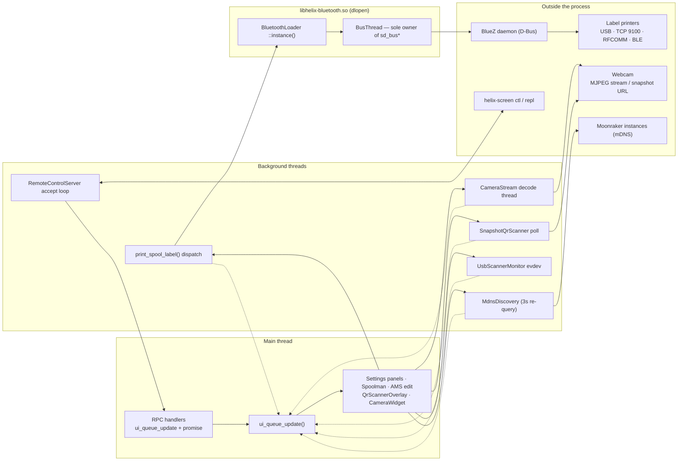

# 13 — Peripherals & remote control

This chapter is the catch-all for everything that talks to the world outside the Moonraker WebSocket: a
runtime-loaded Bluetooth plugin, thermal label printers, the webcam pipeline, barcode scanners, mDNS printer
discovery, and the helixctl remote-control server that drives the UI from a shell. The shared shape is *plugin
or peripheral owns a background thread, app-side code only ever touches a small facade, and every result crosses
back to LVGL through `ui_queue_update()`*. Each subsystem is also gated by something different — a dlopen, a
`HELIX_HAS_CAMERA` define, an `ENABLE_REMOTE_CONTROL` build flag — so "why isn't this working" often starts with
"is it even compiled in". None of these subsystems have deep-dive chapters except label printing and helixctl;
the rest live only in code, so this chapter is their map.

## Key files

| File | Role |
|------|------|
| [`src/bluetooth/bt_bus_thread.h`](../../../src/bluetooth/bt_bus_thread.h) | `BusThread` — the single-threaded owner of the BlueZ `sd_bus*` connection |
| [`src/bluetooth/bt_plugin.cpp`](../../../src/bluetooth/bt_plugin.cpp) | Plugin core: C-ABI init/deinit, pairing-agent registration, teardown ordering |
| [`src/bluetooth/bt_discovery.cpp`](../../../src/bluetooth/bt_discovery.cpp) / [`bt_pairing.cpp`](../../../src/bluetooth/bt_pairing.cpp) / [`bt_agent.cpp`](../../../src/bluetooth/bt_agent.cpp) | BlueZ device discovery, pairing/trust, and the agent that makes bonds stick |
| [`src/bluetooth/bt_ble.cpp`](../../../src/bluetooth/bt_ble.cpp) / [`bt_rfcomm.cpp`](../../../src/bluetooth/bt_rfcomm.cpp) / [`bt_sdp.cpp`](../../../src/bluetooth/bt_sdp.cpp) | The two BT data paths (GATT, RFCOMM socket) and SDP channel lookup |
| [`include/bluetooth_loader.h`](../../../include/bluetooth_loader.h) | `BluetoothLoader` — dlopen wrapper exposing the resolved C function-pointer table |
| [`src/system/label_printer_utils.cpp`](../../../src/system/label_printer_utils.cpp) | `print_spool_label()` — transport routing and printer dispatch, the one entry point |
| [`include/label_printer.h`](../../../include/label_printer.h) | `ILabelPrinter` — the interface every backend implements (`LabelSize`, `PrintCallback`) |
| [`src/system/label_renderer.cpp`](../../../src/system/label_renderer.cpp) | `LabelRenderer::render()` — spool data to a 1bpp `LabelBitmap` shared by all backends |
| [`include/label_printer_settings.h`](../../../include/label_printer_settings.h) | `LabelPrinterSettingsManager` — persisted printers, sizes, media choices |
| [`src/system/ipp_protocol.cpp`](../../../src/system/ipp_protocol.cpp) / [`sheet_label_layout.cpp`](../../../src/system/sheet_label_layout.cpp) | IPP 2.0 encoding + PWG Raster and the 10 Avery sheet templates (A4/Letter) |
| [`include/bt_discovery_utils.h`](../../../include/bt_discovery_utils.h) | Brand-detection table (name prefix → protocol family) + BLE UUID matching |
| [`include/camera_stream.h`](../../../include/camera_stream.h) / [`src/system/camera_stream.cpp`](../../../src/system/camera_stream.cpp) | `CameraStream` — MJPEG decode thread, turbojpeg dlopen, snapshot fallback |
| [`include/usb_scanner_monitor.h`](../../../include/usb_scanner_monitor.h) / [`src/system/usb_scanner_monitor.cpp`](../../../src/system/usb_scanner_monitor.cpp) | `UsbScannerMonitor` — evdev reader for HID keyboard-wedge scanners |
| [`include/snapshot_qr_scanner.h`](../../../include/snapshot_qr_scanner.h) / [`src/system/snapshot_qr_scanner.cpp`](../../../src/system/snapshot_qr_scanner.cpp) | `SnapshotQrScanner` — snapshot-polling viewfinder + QUIRC QR decode |
| [`src/ui/ui_settings_label_printer.cpp`](../../../src/ui/ui_settings_label_printer.cpp) | Integration site: BT discovery/pairing UI, printer selection, test prints |
| [`src/ui/ui_overlay_qr_scanner.cpp`](../../../src/ui/ui_overlay_qr_scanner.cpp) | The scan overlay: races all three scanner paths, converges on `on_spool_id_detected()` |
| [`include/mdns_discovery.h`](../../../include/mdns_discovery.h) / [`src/network/mdns_discovery.cpp`](../../../src/network/mdns_discovery.cpp) | `MdnsDiscovery` — LAN discovery of Moonraker servers (PIMPL + own thread) |
| [`include/remote_control_server.h`](../../../include/remote_control_server.h) / [`src/remote/remote_control_server.cpp`](../../../src/remote/remote_control_server.cpp) | JSON-RPC 2.0 server over Unix socket (or HTTP), auto-started in `--test` |
| [`src/remote/widget_resolution.cpp`](../../../src/remote/widget_resolution.cpp) | Widget-by-name lookup and value-control classification (`is_value_control`) |
| [`src/remote/remote_pointer.cpp`](../../../src/remote/remote_pointer.cpp) | `RemotePointer` — synthetic LVGL input device for gesture RPCs |
| [`src/remote/mock_scenarios.cpp`](../../../src/remote/mock_scenarios.cpp) | Named subject presets behind `ctl scenario` (sample-data screens) |
| [`src/remote/remote_client.cpp`](../../../src/remote/remote_client.cpp) | The `ctl`/`repl` client, folded into the same binary |

Boundary of the chapter: the *threading contract* these subsystems ride (`BusThread`, `HttpExecutor` lanes,
`ui_queue_update`) is chapter 03's; the Moonraker webcam config and HTTP endpoint story is chapter 04's; how
`CameraWidget` recycles a live stream across home-panel rebuilds is chapter 09's. What stays here is each
peripheral's own machinery.

## How it works

The roster, verified against the tree — one facade per subsystem, and note how differently each is gated:

| Subsystem | App-side facade | Owns a thread? | Compiled / loaded when | Deep dive |
|-----------|-----------------|----------------|------------------------|-----------|
| Bluetooth | `BluetoothLoader` (`::instance()`) | BusThread, inside the plugin | `libhelix-bluetooth.so` dlopen'd only if libsystemd + libbluetooth exist | [`../LABEL_PRINTER_SYSTEM.md`](../LABEL_PRINTER_SYSTEM.md) (BT half) |
| Label printers | `print_spool_label()` free function | per-print operation | always | [`../LABEL_PRINTER_SYSTEM.md`](../LABEL_PRINTER_SYSTEM.md) |
| Camera stream | `CameraStream` (widget-owned) | decode thread | `HELIX_HAS_CAMERA` builds only | none |
| USB/HID scanners | `UsbScannerMonitor` (overlay-owned) | monitor thread | always | none |
| Camera QR scanning | `SnapshotQrScanner` (overlay-owned) | poll thread | always | none |
| mDNS discovery | `MdnsDiscovery` (PIMPL, `IMdnsDiscovery`) | query thread | always | none |
| Remote control | `RemoteControlServer` (`::instance()`) | accept thread | `ENABLE_REMOTE_CONTROL=yes` builds; server runs in `--test`/`--remote` | [`../HELIXCTL.md`](../HELIXCTL.md) |

### Bluetooth: a runtime-loaded plugin on one bus thread

Bluetooth support is a separate shared library, `libhelix-bluetooth.so`, built from `src/bluetooth/*.cpp` by
[`mk/bluetooth.mk`](../../../mk/bluetooth.mk) (the main build filters those files out, `Makefile:419`) and linked against libsystemd
(sd-bus) and libbluetooth (RFCOMM). It is silently skipped when either library is missing, and `BluetoothLoader`
([`include/bluetooth_loader.h:13`](../../../include/bluetooth_loader.h#L13)) makes absence a non-event: `is_available()` returns false and every operation
is a no-op, so a BT-less device loads no library and starts no threads. The loader resolves a C-ABI
function-pointer table (discover, pair, trust, RFCOMM connect, BLE GATT read/write, SDP, LZO compress) and hands
out one shared context via `get_or_create_context()` — a second `init()` would register a second BlueZ agent and
conflict. Before any of that, `helix_bt_get_info()` reports an `api_version` ([`bt_plugin.cpp:38`](../../../src/bluetooth/bt_plugin.cpp#L38)) the loader
checks, so a plugin built against a different function-table generation refuses politely instead of crashing on
a stale pointer.

Inside the plugin, `BusThread` ([`src/bluetooth/bt_bus_thread.h:27`](../../../src/bluetooth/bt_bus_thread.h#L27)) is the pattern chapter 03 describes: sd-bus
is not thread-safe, so one worker thread exclusively owns the `sd_bus*` connection and every call goes through
`submit()`/`run_sync()`, woken by a pipe when work is queued. `helix_bt_init()` ([`bt_plugin.cpp:53`](../../../src/bluetooth/bt_plugin.cpp#L53)) sets a
5-second D-Bus method timeout — the 25s default froze the UI on synchronous `is_paired` checks — and registers a
pairing agent, without which "Just Works" pairing completes at the protocol level but never bonds.

Teardown is ordered, and the order is load-bearing: slot unrefs are routed through the bus thread *before*
`stop()` joins it ([`bt_plugin.cpp:92`](../../../src/bluetooth/bt_plugin.cpp#L92)–`120`), then acquired BLE fds and tracked RFCOMM fds are closed, and only
then does the bus itself flush and close.

What BT serves, concretely: all Bluetooth label-printer transports (below), plus discovery/pairing/trust for
both printers and HID barcode scanners — [`bt_scanner_discovery_utils.h`](../../../include/bt_scanner_discovery_utils.h) classifies discovered UUIDs as classic
HID (`0x1124`) or HID-over-GATT (`0x1812`) the same way [`bt_discovery_utils.h`](../../../include/bt_discovery_utils.h) classifies printer brands. The
plugin's own files split cleanly by concern: [`bt_discovery.cpp`](../../../src/bluetooth/bt_discovery.cpp) and [`bt_pairing.cpp`](../../../src/bluetooth/bt_pairing.cpp)/[`bt_agent.cpp`](../../../src/bluetooth/bt_agent.cpp) speak D-Bus
to BlueZ, [`bt_ble.cpp`](../../../src/bluetooth/bt_ble.cpp) and [`bt_rfcomm.cpp`](../../../src/bluetooth/bt_rfcomm.cpp) are the two data paths, [`bt_sdp.cpp`](../../../src/bluetooth/bt_sdp.cpp) resolves RFCOMM channels, and
[`bt_lzo.cpp`](../../../src/bluetooth/bt_lzo.cpp) wraps miniLZO (public domain, compiled into the plugin only) for the MakeID protocol. Note the
plugin logs with `fprintf(stderr)`, not spdlog — it is a standalone `.so` with no logging dependency by design.

### Label printing: one interface, six protocol families, three transports

Every spool label goes through one function: `print_spool_label(spool, callback)`
([`src/system/label_printer_utils.cpp:86`](../../../src/system/label_printer_utils.cpp#L86)), called from the Spoolman panel, the Spoolman edit modal, and the AMS
edit overlay. It renders once — `LabelRenderer::render()` produces a 1bpp `LabelBitmap`
([`include/label_renderer.h:17`](../../../include/label_renderer.h#L17)) — then dispatches on the configured printer's protocol family:

| Family | Wire protocol | Transport | Native DPI |
|--------|---------------|-----------|------------|
| Brother QL | ESC/P raster | TCP 9100 or RFCOMM | 300 |
| Brother PT | PT command stream | RFCOMM | 180 |
| Phomemo | ESC/POS raster | USB (libusb), RFCOMM, or BLE GATT | 203 |
| Niimbot | Custom BLE packets (`0x55 0x55 …`) | BLE GATT only | 203 |
| MakeID/Wewin | `0x66` frames, LZO1X-compressed | RFCOMM | 203 |
| IPP | IPP 2.0 + PWG Raster | HTTP POST (inkjet/laser sheet labels) | printer's |

Each backend implements `ILabelPrinter` ([`include/label_printer.h:44`](../../../include/label_printer.h#L44)); protocol encoding is kept in pure
functions (`*_protocol.cpp`) separate from transport. Classic-BT printers share one send helper —
`rfcomm_send()` owns the whole lifecycle (init context, connect, chunked write, 5s drain, disconnect) behind a
single mutex that serializes all RFCOMM prints ([`src/system/bt_print_utils.cpp:23`](../../../src/system/bt_print_utils.cpp#L23)). Which printers exist, which
is default, and the selected label size live in `LabelPrinterSettingsManager`
([`include/label_printer_settings.h`](../../../include/label_printer_settings.h)); the dispatch also reads detected media length at print time and falls back
to the user-selected size when the printer reports none ([`label_printer_utils.cpp:227`](../../../src/system/label_printer_utils.cpp#L227)–`237`). Device-name
prefixes map to protocol families through the `KNOWN_BRANDS` table ([`include/bt_discovery_utils.h`](../../../include/bt_discovery_utils.h)), which is
also how discovery decides whether a new printer needs BLE or RFCOMM. The two facts most likely to bite: RFCOMM
channel resolution caches SDP results per MAC (`resolve_label_printer_channel`, [`include/bt_print_utils.h:46`](../../../include/bt_print_utils.h#L46)),
and BLE connections are deliberately *persistent* — Niimbot printers print blank if reconnected without
repeating the full init sequence (1s settle + `Connect` handshake), which is why the connection outlives each
print. The IPP family is the odd one out: it targets ordinary network inkjet/laser printers, converting the same
bitmap to PWG Raster and tiling it onto Avery-style sheet templates ([`src/system/sheet_label_layout.cpp`](../../../src/system/sheet_label_layout.cpp), 10
A4/Letter layouts).

### Camera and scanners: image in, image out

**`CameraStream`** ([`include/camera_stream.h:47`](../../../include/camera_stream.h#L47), compiled only with `HELIX_HAS_CAMERA`) is the MJPEG pipeline
behind the home-panel camera widget. One background thread connects to the webcam's stream URL —
`configure_from_printer()` pulls webcam URLs from PrinterState and resolves relative ones through
`IMoonrakerAPI` ([`camera_stream.h:109`](../../../include/camera_stream.h#L109)) — then parses multipart boundaries and decodes JPEG frames through
libturbojpeg, dlopen'd at runtime ([`src/system/camera_stream.cpp:58`](../../../src/system/camera_stream.cpp#L58), so Android ships only `libturbojpeg.so` in
the APK) with stb_image as fallback. Three load-bearing details:

- **Decode-time downscaling** (`set_target_size()`): turbojpeg decodes at the smallest scaling factor that still covers the widget, so a 1920x1080 camera feeding an 800x480 tile never decodes full resolution.
- **Buffer discipline**: draw buffers use system malloc, not `lv_draw_buf_create` (lv_malloc is not thread-safe, [`camera_stream.h:221`](../../../include/camera_stream.h#L221)), frames double-buffer through front/back swap, and retired front buffers are kept until the widget stops referencing them via `lv_image_set_src`.
- **The detach contract**: if `stop()`'s timed join fails (network read wedged), the thread is detached and `was_detached()` returns true — the caller must then intentionally leak the object (`unique_ptr::release()`) because the thread still holds `this` (#624).

The widget also throttles: `set_max_fps(0)` when an overlay covers it, `2` in edit mode, the configured cap
otherwise ([`src/ui/panel_widgets/camera_widget.cpp:492`](../../../src/ui/panel_widgets/camera_widget.cpp#L492)–`518`). Flip, rotation, target size, and fps cap are all
atomics, so the widget can retune a running stream without touching the decode thread. After 3 stream failures
(`MAX_STREAM_FAILURES`) the streamer falls back to polling the snapshot URL every 2 seconds
(`SNAPSHOT_INTERVAL_MS`) and reconnects the stream opportunistically; libhv callbacks carry `AsyncLifetimeGuard`
tokens so a late HTTP event after destruction bails out before touching members.

**Scanners** come in two hardware shapes, and `QrScannerOverlay` runs both simultaneously — whichever fires
first wins. `UsbScannerMonitor` ([`include/usb_scanner_monitor.h:26`](../../../include/usb_scanner_monitor.h#L26)) reads HID keyboard-wedge scanners from
evdev: USB scanners are read passively (so their caps-lock LED workflow keeps working), BT scanners paired
through the app are grabbed exclusively with `EVIOCGRAB`. Keycodes become ASCII according to a *hardware* keymap
(QWERTY/QWERTZ/AZERTY) that the user must configure — it cannot be inferred from anything the app knows.
`SnapshotQrScanner` ([`include/snapshot_qr_scanner.h:27`](../../../include/snapshot_qr_scanner.h#L27)) is the camera-based path for platforms without
streaming: it polls the webcam snapshot URL (~2.8MB steady state), decodes with stb_image, and runs QUIRC
([`src/system/qr_decoder.cpp`](../../../src/system/qr_decoder.cpp)) on a subsampled grayscale buffer; the UI signals `frame_consumed()` after drawing,
which is the backpressure handshake pacing the next fetch.

All three paths converge on one handler: each callback defers to the main thread with a lifetime token and lands
in `on_spool_id_detected()` ([`src/ui/ui_overlay_qr_scanner.cpp:324`](../../../src/ui/ui_overlay_qr_scanner.cpp#L324), `:361`, `:386`) — the same
bg-callback-to-defer pattern chapter 03 prescribes.

### mDNS discovery and the remote-control server

**`MdnsDiscovery`** ([`include/mdns_discovery.h:76`](../../../include/mdns_discovery.h#L76)) finds Moonraker servers on the LAN: a PIMPL class with its
own thread, re-querying every 3 seconds, results marshaled back through `helix::ui::async_call()`. Consumers
hold the `IMdnsDiscovery` interface (`:39`), not the concrete. Its two consumers are the first-run connection
wizard ([`src/ui/ui_wizard_connection.cpp`](../../../src/ui/ui_wizard_connection.cpp)) and the label-printer settings screen (network Brother printers). A
socket failure on a network-less box is expected and handled gracefully — discovery just returns nothing. HTTP
*workers* are not here: all HTTP-shaped work leaves through the `HttpExecutor::fast()`/`slow()` pools that
chapters 03 and 04 own.

**`RemoteControlServer`** ([`include/remote_control_server.h:62`](../../../include/remote_control_server.h#L62)) is a JSON-RPC 2.0 server that drives the live
UI: `navigate`, `click`, `ls`/`describe_screen`, `text`, `geom`, `set_value`, `scroll`, `long_press`,
`screenshot`, `demo`, `scenario`, and more, registered in `register_builtin_handlers()`
([`remote_control_server.cpp:285`](../../../src/remote/remote_control_server.cpp#L285)). It auto-starts at boot phase 14c under `--test` (opt-in with `--remote`
elsewhere; [`application.cpp:999`](../../../src/application/application.cpp#L999)), is compiled in only when `ENABLE_REMOTE_CONTROL=yes` — default ON for the
native dev build, OFF for release/cross builds (`Makefile:465`) — and a failed start is non-fatal. The default
transport is a Unix socket; `RemoteConfig::Transport::Http` switches to a TCP listener bound loopback by default
(port 7130) for LAN control. The accept loop runs on its own thread; every UI-affecting handler posts a lambda
through `ui_queue_update()` and blocks on a `std::promise` until the main thread executes it
([`remote_control_server.cpp:248`](../../../src/remote/remote_control_server.cpp#L248)). Name-based targeting resolves through [`widget_resolution.cpp`](../../../src/remote/widget_resolution.cpp), which also
decides which widget classes accept `set_value` (`is_value_control`); synthetic gestures come from
`RemotePointer` ([`src/remote/remote_pointer.cpp`](../../../src/remote/remote_pointer.cpp)), an LVGL input device whose read callback publishes atomics
set by RPC; and [`mock_scenarios.cpp`](../../../src/remote/mock_scenarios.cpp) holds the named subject presets behind `ctl scenario`. The client is the
same binary: `helix-screen ctl` / `repl` subcommands dispatch before any app init ([`src/main.cpp:126`](../../../src/main.cpp#L126)) into
[`remote_client.cpp`](../../../src/remote/remote_client.cpp).

Socket discipline: the first instance owns `$XDG_RUNTIME_DIR/helixscreen-control.sock` (falling back to `/tmp`),
later instances take a pid-suffixed path rather than stealing it, and sockets left by crashed instances are
swept before the decision ([`remote_control_server.cpp:101`](../../../src/remote/remote_control_server.cpp#L101)–`126`). The client mirrors this: it checks
*liveness*, not existence, refuses to guess between live instances, and exits listing them
([`remote_client.cpp:193`](../../../src/remote/remote_client.cpp#L193)) — but it still targets the well-known path by default, so **always pin both sides**
(`--remote-socket` + `ctl -s`) when running parallel instances.

## Patterns & gotchas

- **All sd-bus calls happen on the BusThread** — app code reaches Bluetooth only through `BluetoothLoader`'s function table, and never waits on a `submit()` future from inside a work item (self-deadlock; same rule as `HttpExecutor::run_sync` on a single-worker lane).
- **BT absence is a designed no-op, not an error.** Gate on `is_available()`; don't add fallbacks that pretend a printer is reachable. The one built-in degradation is intentional: MakeID falls back to uncompressed frames when the plugin (and thus LZO) is unavailable.
- **Persistent BLE connections are a correctness requirement, not an optimization** — Niimbot reconnect-without-reinit produces blank labels (D110); MakeID keeps static globals + mutex with a handshake heartbeat. Don't "clean these up".
- **Camera frame callbacks fire on the stream thread.** Touching any LVGL object there violates chapter 03; route through `ui_queue_update()`. And never destroy a `CameraStream` whose `was_detached()` is true — the leak is the fix (#624).
- **`retired_bufs_` exist because LVGL may still hold a pointer** to an old front buffer via `lv_image_set_src`; freeing eagerly is a use-after-free on the next draw.
- **Scanner keymap is user configuration.** The layout lives in the scanner's firmware; inferring it from app language mis-maps keys (AZERTY 'a' arrives as `KEY_Q`). `set_active_layout()` is UI-thread-only by contract ([`usb_scanner_monitor.h:62`](../../../include/usb_scanner_monitor.h#L62)), and only one scanner runs at a time — the `s_live_instance_` static assumes it.
- **Label-print errors surface as callback text, not exceptions.** `print_spool_label()` reports through its `PrintCallback` with already-translated strings (e.g. "No Bluetooth printer selected — pick one in settings", [`label_printer_utils.cpp:313`](../../../src/system/label_printer_utils.cpp#L313)) — the UI layers just show it; don't add a parallel error channel.
- **[`remote_control_server.cpp`](../../../src/remote/remote_control_server.cpp) is imperative by charter** — it is on the declarative-UI exception list precisely because its job is reaching into an arbitrary live widget tree on command. Don't copy its patterns into feature code.
- **BT callbacks arrive on background threads — the settings screens show the pattern.** Discovery results and pairing state are marshaled with `helix::ui::queue_update()` plus a lifetime token at every consumer site ([`src/ui/ui_settings_label_printer.cpp:1117`](../../../src/ui/ui_settings_label_printer.cpp#L1117), `:1356`); a new BT-adjacent UI that skips the token is an L081-shaped bug.
- **mDNS must tolerate a dead network silently** — the wizard runs on boxes with no network stack configured yet; a hard failure there reads as "the wizard is broken".
- **The remote-control server can be compiled out entirely** — code that assumes it exists (e.g. screenshot tooling) must check `HELIX_ENABLE_REMOTE_CONTROL` or degrade gracefully, the same way `--test`-only features do. A device dev image opts in explicitly: `make PLATFORM_TARGET=pi ENABLE_REMOTE_CONTROL=yes` (`Makefile:463`).

## Going deeper

- [`../LABEL_PRINTER_SYSTEM.md`](../LABEL_PRINTER_SYSTEM.md) — per-protocol packet formats and print sequences in full, label-size tables, brand-detection helpers, and the checklist for adding a new printer family.
- [`../HELIXCTL.md`](../HELIXCTL.md) — the complete helixctl command reference: transports, `--json` output, headless/CI recipes, synthetic pointer gestures, and the isolated-second-instance workflow.
- [`03-threading-lifetime.md`](03-threading-lifetime.md) — owns the `BusThread`/`HttpExecutor` submit/run_sync contract and the detached-thread rules this chapter's peripherals follow.
- [`04-moonraker.md`](04-moonraker.md) — where webcam URLs come from, and the `HttpExecutor` lane discipline every fetch here rides.
- [`09-home-widgets.md`](09-home-widgets.md) — how `CameraWidget` recycles a live stream across home-panel rebuilds instead of restarting it.
- [`11-startup-shutdown.md`](11-startup-shutdown.md) — where phase 14c sits in the boot ladder and how the server stops during shutdown.
- [`../MOONRAKER_ARCHITECTURE.md`](../MOONRAKER_ARCHITECTURE.md) — § "HTTP Work Execution": the full HttpExecutor lane rationale.

## Guided code tour

Read in this order; about 30 minutes total.

1. [`src/bluetooth/bt_bus_thread.h:19`](../../../src/bluetooth/bt_bus_thread.h#L19) — `BusWork` and the single-thread sd-bus ownership contract, including the null-bus idle-worker defense.
2. [`src/bluetooth/bt_plugin.cpp:53`](../../../src/bluetooth/bt_plugin.cpp#L53) — `helix_bt_init()`: the 5s method timeout, BusThread start, and why the pairing agent must exist before any `Pair()`.
3. [`include/bluetooth_loader.h:13`](../../../include/bluetooth_loader.h#L13) — the C function-pointer table and `get_or_create_context()`; the whole app-side surface of Bluetooth.
4. [`src/system/label_printer_utils.cpp:86`](../../../src/system/label_printer_utils.cpp#L86) — `print_spool_label()`: media detection, size fallback, and the transport/protocol dispatch.
5. [`include/label_printer.h:44`](../../../include/label_printer.h#L44) — `ILabelPrinter`: what every backend must provide.
6. [`include/bt_print_utils.h:23`](../../../include/bt_print_utils.h#L23) — `rfcomm_send()`'s full lifecycle (connect → chunked write → drain → disconnect) and the shared mutex; then `:46` for SDP channel caching.
7. [`include/camera_stream.h:36`](../../../include/camera_stream.h#L36) — the class doc: threading contract, snapshot fallback, downscaling, and the `was_detached()` leak rule.
8. [`src/system/camera_stream.cpp:58`](../../../src/system/camera_stream.cpp#L58) — turbojpeg runtime loading; then `:190` for `stop()`'s timed-join-or-detach path.
9. [`src/ui/panel_widgets/camera_widget.cpp:492`](../../../src/ui/panel_widgets/camera_widget.cpp#L492) — the fps ladder: paused under overlays, 2fps in edit mode, configured cap otherwise.
10. [`include/usb_scanner_monitor.h:20`](../../../include/usb_scanner_monitor.h#L20) — `ScannerKeymap` rationale and the `ScannerSource` grab-vs-passive split.
11. [`src/ui/ui_overlay_qr_scanner.cpp:383`](../../../src/ui/ui_overlay_qr_scanner.cpp#L383) — the overlay racing both scanner paths (`:312` for the snapshot viewfinder, `:383` for the evdev wedge).
12. [`include/mdns_discovery.h:54`](../../../include/mdns_discovery.h#L54) — the class doc: PIMPL, threading, and callback contract.
13. [`include/remote_control_server.h:15`](../../../include/remote_control_server.h#L15) — the file doc: thread model, transports, and the `RemoteConfig` options.
14. [`src/remote/remote_control_server.cpp:248`](../../../src/remote/remote_control_server.cpp#L248) — the promise/`ui_queue_update` dispatch every UI command rides; then `:101` for socket-path resolution and the pid-suffix rule.
15. [`src/remote/remote_client.cpp:193`](../../../src/remote/remote_client.cpp#L193) — the client's mirror-image resolution and its refusal to guess among live instances.
16. [`docs/devel/HELIXCTL.md`](../HELIXCTL.md) — skim the command tables; this is the doc you'll actually use daily.
