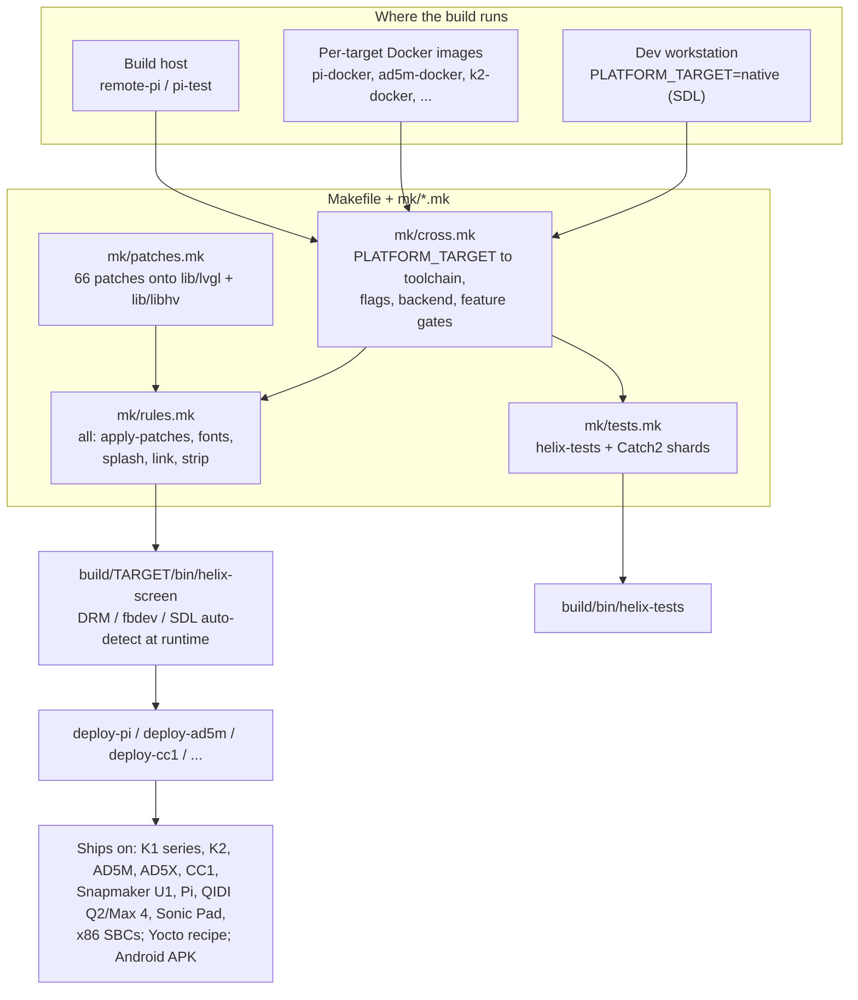

# 14 — Build & platforms

HelixScreen builds with a pure GNU Makefile — no CMake, no Ninja — split across a top-level `Makefile`
and seventeen `mk/*.mk` modules. One `PLATFORM_TARGET` variable selects everything about a build: the
cross-toolchain, the display backend, per-device asset and feature gates, and the output directory
(`build/bin/helix-screen` natively, `build/<target>/bin/` for cross builds). The same source tree produces a desktop SDL app, a static musl
binary for a MIPS Creality K1, and a DRM+GLES build for a Raspberry Pi; at runtime each binary
auto-detects its display (DRM, then fbdev, then SDL), which is why one Pi build also covers QIDI and
one armhf build covers the Sonic Pad. This chapter is the map and the matrix; [`BUILD_SYSTEM.md`](../BUILD_SYSTEM.md) is the
reference manual.

## Key files

| File | Role |
|------|------|
| `Makefile` | Top-level orchestrator: platform plumbing, feature gates (`ENABLE_REMOTE_CONTROL`, dev panels), the `.PHONY` index, `make help` |
| [`mk/cross.mk`](../../../mk/cross.mk) | The platform matrix: per-`PLATFORM_TARGET` toolchain, flags, display backend, font tiers, feature defines, plus Docker and `deploy-*` targets |
| [`mk/rules.mk`](../../../mk/rules.mk) | The `all` target: two-phase `-j` auto-fix, architecture-change auto-clean, every compile/link rule |
| [`mk/tests.mk`](../../../mk/tests.mk) | `helix-tests` build and the Catch2 sharded parallel runner |
| [`mk/patches.mk`](../../../mk/patches.mk) | Submodule patch stamp, both-directions wiring check, `reset-patches` / `reapply-patches` |
| [`mk/display-lib.mk`](../../../mk/display-lib.mk) | Which display backends compile per OS; builds `libhelix-display.a` shared by splash and app |
| [`patches/README.md`](../../../patches/README.md) | Per-patch purpose table, upstream PR status, patch-regeneration recipes |
| [`scripts/setup-worktree.sh`](../../../scripts/setup-worktree.sh) | Worktree one-shot: creates `.worktrees/<branch>`, symlinks `lib/`, configures ccache |
| [`src/api/display_backend.cpp`](../../../src/api/display_backend.cpp) | `DisplayBackend` factory and the runtime DRM→fbdev→SDL auto-detect |
| `firmware/helixscreen-esp32/` | ESP-IDF port for BTT K-Touch (ESP32-S3) — in progress, not shipping yet |

Boundary of this chapter: the deep mechanics — Dockerfile architecture, deploy-host setup, ccache
configuration, per-patch regeneration — live in [`BUILD_SYSTEM.md`](../BUILD_SYSTEM.md) and [`patches/README.md`](../../../patches/README.md). What stays
here is which platforms exist, what differs between them, and the workflow rules a contributor
actually trips on.

## How it works

### One Makefile, three build verbs

`make -j`, `make test`, and `make test-run` build disjoint artifacts. `make -j` (the default `all`
target, [`mk/rules.mk:123`](../../../mk/rules.mk#L123)) builds **only** `helix-screen`: patches, generated fonts, translations,
splash, watchdog, the binary, stripping, and the optional Bluetooth plugin. `make test`
([`mk/tests.mk:393`](../../../mk/tests.mk#L393)) builds **only** `helix-tests`; `make test-run` ([`mk/tests.mk:400`](../../../mk/tests.mk#L400)) builds it and
runs it as Catch2 shards across 3×cores processes with the `~[.] ~[slow]` filter. The split is a
speed feature and a trap: after a C++ change, rebuild the artifact you are about to use — running a
stale `helix-tests` against new code, or a stale `helix-screen` against new XML, silently verifies
nothing. XML-only changes need no rebuild at all (`ui_xml/` loads at runtime); relaunch the binary.
`make dev` builds the same program at `-O0` (libraries stay `-O2`) for roughly 2x faster compilation
during iteration, and `.DELETE_ON_ERROR` (`Makefile:29`) deletes a half-written target on failure so
a failed link can never leave a truncated binary that later looks up-to-date.

The `all` target also gates on generated assets — compiled fonts, the translations XML, the splash
binary — so a fresh clone produces a runnable binary from `make -j` alone. The generators have their
own entry points for when you change the sources: `make regen-fonts` after adding icon codepoints
([`mk/fonts.mk:179`](../../../mk/fonts.mk#L179)), `make translations` / `make translation-sync` for the YAML string pipeline
([`mk/translations.mk:84`](../../../mk/translations.mk#L84)). Hand-editing a generated artifact is wasted work; the next build
regenerates it.

Two guards in [`mk/rules.mk`](../../../mk/rules.mk) make bare `make` safe. A two-phase `all` ([`mk/rules.mk:78`](../../../mk/rules.mk#L78)) re-invokes
itself with bounded `-j$(NPROC)` when it detects unlimited `-j`, so parallelism never crushes the
machine. And a `build/.build-target` marker auto-cleans when the architecture changes
([`mk/rules.mk:49`](../../../mk/rules.mk#L49)), so you cannot mix ARM and x86 objects in the one shared native `build/` dir —
cross builds are already isolated (`build/pi/`, `build/ad5m/`, ... via `BUILD_SUBDIR`,
[`mk/cross.mk:704`](../../../mk/cross.mk#L704)). `make help` prints the target menu; `make help-all` adds the test, cross, and
remote groups.

### The platform matrix

Every target below is one `ifeq` block in [`mk/cross.mk`](../../../mk/cross.mk) that sets a toolchain triple, `TARGET_CFLAGS`
(size-tuned `-Os -flto` on the memory-constrained targets, `-O2` on roomier ones), a display backend,
font tiers, and `-DHELIX_HAS_*` / `-DHELIX_PLATFORM_*` gates that code checks at compile time.

| `PLATFORM_TARGET` | Device / arch | Backend | Notes |
|-------------------|---------------|---------|-------|
| `native` (default) | Desktop, macOS/Linux | SDL | `ENABLE_REMOTE_CONTROL` + dev panels default ON (`Makefile:464`, `:486`) |
| `pi`, `pi-fbdev`, `pi-both` | Raspberry Pi aarch64 | DRM+GLES / fbdev | `-both` compiles once, links DRM + fbdev ([`mk/pi-dual-link.mk`](../../../mk/pi-dual-link.mk)) |
| `pi32` (+`-fbdev`/`-both`) | Pi armhf, **Sonic Pad** | DRM / fbdev | Same binary serves any armhf Debian-ish box |
| `x86`, `x86-fbdev`, `x86-both` | x86_64 Debian SBCs | DRM+GLES / fbdev | Built in a Bullseye container for glibc 2.31 compat |
| `ad5m`, `ad5m-br` | FlashForge AD5M (armv7) | fbdev | Fully static; ships as a ready-made firmware image (Forge-X fork); `-br` is the buildroot variant built inside AD5M Klipper Mod ([`AD5M_KMOD_VARIANT.md`](../AD5M_KMOD_VARIANT.md)) |
| `ad5x` | FlashForge AD5X (mips32r5) | fbdev | Active testing; prebuilt binaries ship in releases; own toolchain + `Dockerfile.ad5x` |
| `cc1` | Elegoo Centauri Carbon (armv7) | fbdev | Static, tested; also the fallback binary for old-glibc armv7 boxes generally |
| `mips` / `k1`, `k1-dynamic` | Creality K1 series (MIPS32) | fbdev | Static musl, or mixed static/dynamic against glibc; K1C and K1 Max tested |
| `k2` | Creality K2 series (armv7, Tina Linux) | fbdev | Static musl on a glibc rootfs; tested on K2 Plus |
| `snapmaker-u1` | Snapmaker U1 (aarch64, Debian) | DRM | Tested; DRM keepalive holds the CRTC across stock-UI takeover |
| `yocto` | Any Yocto/BSP build (ships in OpenCentauri COSMOS) | fbdev | Bitbake supplies toolchain + all vendored libs |

What actually ships, device by device, is documented in `docs/devel/printers/*.md` (K1, K2, AD5X,
QIDI, Snapmaker U1) plus [`AD5M_KMOD_VARIANT.md`](../AD5M_KMOD_VARIANT.md); QIDI on-device (Q2, Max 4) uses the plain `pi`
binary — the installer detects the SBC — and the Sonic Pad installs the `pi32` binary under
[SonicPad-Debian](../../user/INSTALL.md) (32-bit armhf userspace on an Allwinner H616). fbdev and
evdev, which older docs called "future", are in fact the shipping path for K1/K2/AD5M/AD5X/CC1 and
the input path on every non-SDL target. Display-backend choice is compile-time *inclusion*
([`mk/display-lib.mk:23`](../../../mk/display-lib.mk#L23): fbdev+DRM always on Linux, SDL when `ENABLE_SDL`) but runtime *selection*:
`DisplayBackend::create_auto()` probes DRM, then fbdev, then SDL ([`src/api/display_backend.cpp:242`](../../../src/api/display_backend.cpp#L242)),
which is what lets one binary cover a device family.

The per-target gates are where devices differ in features, not just flags: font tiers scale the
compiled font payload from `micro tiny` (cc1, yocto — 112MB RAM) to `all` (pi, x86); sound is
compiled out entirely on K1/K2, tone-only on AD5M/AD5X, full on Pi/x86/native; the label-printer,
CFS, and IFS gates are off on AD5M ([`mk/cross.mk:240`](../../../mk/cross.mk#L240)). The ESP32 port (`firmware/helixscreen-esp32/`,
ESP-IDF on the BTT K-Touch) is a separate CMake build that compiles LVGL and `lib/helix-xml`
unmodified — verdict and budgets in [`../plans/ESP32_NATIVE_AUDIT.md`](../plans/ESP32_NATIVE_AUDIT.md); it does not ship yet.

### Patches: forked fixes, stamp-applied

The LVGL fork is pinned at v9.5.0 and libhv at a fixed commit; 66 patches in `patches/` carry our
fixes on top (NULL guards, DRM rotation, fbdev BGR/stride handling, event-stack hardening — several
submitted upstream, tracked in [`patches/README.md`](../../../patches/README.md)). [`mk/patches.mk`](../../../mk/patches.mk) applies them through a stamp
file, `build*/.patches-applied`, re-verified only when a patch file or submodule HEAD changes; every
compile rule depends on that stamp. The stamp recipe also runs a both-directions wiring check
([`mk/patches.mk:195`](../../../mk/patches.mk#L195)): a `patches/*.patch` with no apply block in [`mk/patches.mk`](../../../mk/patches.mk), or an apply block
naming a missing patch, fails the build rather than silently linking unpatched code. When a patch
conflicts after a submodule bump, `make reapply-patches` resets the patched files and re-applies.
The one exception is `lib/helix-xml/`: that submodule is ours (a MIT fork of the XML engine LVGL
removed in 9.5), so it is edited and committed directly — never patched.

### Worktrees, deployment, and packaging

For any major work, `scripts/setup-worktree.sh feature/my-branch` creates `.worktrees/<branch>` with
`lib/` submodules symlinked from the main tree (so no re-clone, no re-patch, ccache stays hot) —
BUILD_SYSTEM.md § "Git Worktrees" covers the `--unlink`/`--relink` dance git sometimes needs around
those symlinks, plus the typical create / iterate / merge / tear-down workflow. The rule of thumb:
anything bigger than a one-file fix gets a worktree — parallel sessions each get their own branch,
build dir, and ccache view instead of fighting over one `build/`. Deployment is per-device make targets: `deploy-pi` / `deploy-ad5m` / `deploy-cc1` /
`deploy-k1` / `deploy-k2` / `deploy-snapmaker-u1` (plus `-fg` foreground and `-bin` binaries-only
variants), with `pi-test` doing the full build + deploy + run cycle and `remote-pi` /
`remote-native` ([`mk/remote.mk`](../../../mk/remote.mk)) building on a fast remote host and fetching the binaries back;
Docker wrappers
(`pi-docker`, `ad5m-docker`, ...) remove the local-toolchain requirement. Beyond the Makefile three
packaging pipelines exist: a Yocto recipe in OpenCentauri COSMOS ([`YOCTO_BUILD.md`](../YOCTO_BUILD.md)), an Android build
whose CI job attaches signed APKs and an AAB to every release ([`ANDROID_PLAY_STORE.md`](../ANDROID_PLAY_STORE.md)), and the
end-user installer — modular POSIX shell with KIAUH and Moonraker-updater integration
([`INSTALLER.md`](../INSTALLER.md)).

## Patterns & gotchas

- **`make -j` and `make test` build different binaries.** Decide which one you are about to run and build exactly that; "works in the app, fails in tests" after skipping a rebuild is a stale-artifact artifact, not a bug.
- **Switching `PLATFORM_TARGET` auto-cleans the native build dir** ([`mk/rules.mk:49`](../../../mk/rules.mk#L49)). Don't be surprised by a full rebuild after toggling between `native` and a cross target; cross targets are isolated in `build/<target>/` and unaffected.
- **Remote control and dev panels are native-only by default.** A device build has no helixctl server; force it for a dev image with `make PLATFORM_TARGET=pi ENABLE_REMOTE_CONTROL=yes` (`Makefile:463`).
- **A new patch file must be wired into [`mk/patches.mk`](../../../mk/patches.mk)** — an apply block plus, if it touches new files, an entry in `LVGL_PATCHED_FILES`/`LIBHV_PATCHED_FILES`. The stamp's wiring check fails the build if you forget, which is the polite outcome; before that check existed, unwired patches silently never applied.
- **Test builds reach the patch stamp only through the PCH prerequisite** ([`mk/rules.mk:208`](../../../mk/rules.mk#L208)); the `test` target does not itself gate on `apply-patches`. After a patch red-line or submodule bump, run `make -j` or `make reapply-patches` — don't assume `make test-run` re-verified the tree (#1212).
- **Never hand-edit `lib/lvgl/` or `lib/libhv/` sources directly** — changes there belong in `patches/*.patch`, because the next `git submodule update` wipes direct edits. `lib/helix-xml` is the deliberate exception: it is our own submodule, edited and committed in place, never patched.
- **Generated assets regenerate; don't hand-edit them.** New icons mean [`include/ui_icon_codepoints.h`](../../../include/ui_icon_codepoints.h) plus `make regen-fonts` plus a rebuild; user-facing strings flow through `make translation-sync` / `make translations`. If a font or translation "won't update", you are probably editing the generated file.
- **There is no `sonicpad` target.** The Sonic Pad runs the `pi32` binary on SonicPad-Debian; QIDI runs the `pi` binary. Device support is often a release-artifact question, not a new-platform question — check what the installer auto-detects before adding a target.
- **Feature availability differs per target by design.** Before debugging "missing" sound, label printing, or a dev panel on a device build, check the target's gates in [`mk/cross.mk`](../../../mk/cross.mk) — `HELIX_HAS_SOUND`, `HELIX_HAS_LABEL_PRINTER`, `ENABLE_DEV_PANELS` and friends are compile-time, not runtime settings.
- **Embedded-only code paths are invisible on the desktop build.** `LV_USE_EVDEV` is 1 only when the display backend is fbdev or DRM ([`lv_conf.h:1152`](../../../lv_conf.h#L1152)), so an evdev (or other embedded-driver) change is never exercised by `native` — a non-SDL build such as `PLATFORM_TARGET=x86-fbdev` is the cheapest way to exercise it on a dev box.

## Going deeper

- [`../BUILD_SYSTEM.md`](../BUILD_SYSTEM.md) — the reference manual: full target specifications, Docker image architecture, deploy and logging-on-target recipes, worktree and ccache detail, GCC 7.5 compatibility notes.
- [`patches/README.md`](../../../patches/README.md) — every patch's purpose and files, upstream PR status (a patch is droppable only when its PR is *merged*), and the pristine-file method for regenerating a patch whose file is shared.
- [`../printers/CREALITY_K1_SUPPORT.md`](../printers/CREALITY_K1_SUPPORT.md) (and the K2, AD5X, QIDI, Snapmaker U1 siblings) — per-device hardware notes, firmware requirements, tested models.
- [`../AD5M_KMOD_VARIANT.md`](../AD5M_KMOD_VARIANT.md) — building HelixScreen as a native package inside the AD5M Klipper Mod firmware.
- [`../YOCTO_BUILD.md`](../YOCTO_BUILD.md), [`../ANDROID_PLAY_STORE.md`](../ANDROID_PLAY_STORE.md), [`../INSTALLER.md`](../INSTALLER.md) — the three packaging pipelines.
- [`../plans/ESP32_NATIVE_AUDIT.md`](../plans/ESP32_NATIVE_AUDIT.md) — the ESP32-S3 feasibility audit behind the `firmware/` port.
- [`../DEVELOPMENT.md`](../DEVELOPMENT.md) — fresh-checkout setup: `make check-deps` / `make install-deps`, dev environment, contributing basics.
- [`../ENVIRONMENT_VARIABLES.md`](../ENVIRONMENT_VARIABLES.md) — runtime and build-time environment variables.

## Guided code tour

Read in this order; about 25 minutes total.

1. `Makefile:1` — the header contract: always `make`, never invoke the compiler directly, and what the build system handles for you.
2. [`mk/rules.mk:78`](../../../mk/rules.mk#L78) — the two-phase `all` target: unlimited-`-j` detection and re-invocation; then `:123` for what a build actually gates on (`apply-patches` first).
3. [`mk/rules.mk:49`](../../../mk/rules.mk#L49) — the `.build-target` arch-change marker and auto-clean.
4. [`mk/tests.mk:393`](../../../mk/tests.mk#L393) — the `test` (build-only) vs `test-run` (parallel shards) split, and the `~[.] ~[slow]` filter convention.
5. [`mk/cross.mk:8`](../../../mk/cross.mk#L8) — the commented platform menu; then `:58` (pi: DRM+GLES, all font tiers) against `:216` (ad5m: `-Os -flto -static`, label-printer gate off, trimmed fonts) to see how far the knobs turn.
6. [`mk/cross.mk:644`](../../../mk/cross.mk#L644) — the `native` block: SDL backend, and why dev conveniences live here rather than in cross builds.
7. `Makefile:464` — `ENABLE_REMOTE_CONTROL`'s native-default-on / cross-default-off wiring; `:486` does the same for dev panels.
8. [`mk/display-lib.mk:23`](../../../mk/display-lib.mk#L23) — compile-time backend inclusion per OS (Darwin gets SDL only; Linux always gets fbdev+DRM).
9. [`src/api/display_backend.cpp:199`](../../../src/api/display_backend.cpp#L199) — `create_auto()`'s DRM→fbdev→SDL probe: the runtime half of the backend story.
10. [`mk/patches.mk:187`](../../../mk/patches.mk#L187) — the stamp recipe: wiring check both directions, then apply-if-needed; skim a few apply blocks to see the sentinel patterns.
11. `patches/lvgl-evdev-protocol-a.patch` — a small, real patch that ships on every evdev device and is upstream as PR #9829.
12. [`mk/cross.mk:905`](../../../mk/cross.mk#L905) — the `.PHONY` roster of convenience, Docker, and deploy targets; then `:1376` is the help text that renders the same menu for humans.
13. [`scripts/setup-worktree.sh:1`](../../../scripts/setup-worktree.sh#L1) — the worktree one-shot: symlink strategy, ccache setup, and the `--unlink`/`--relink` options.
