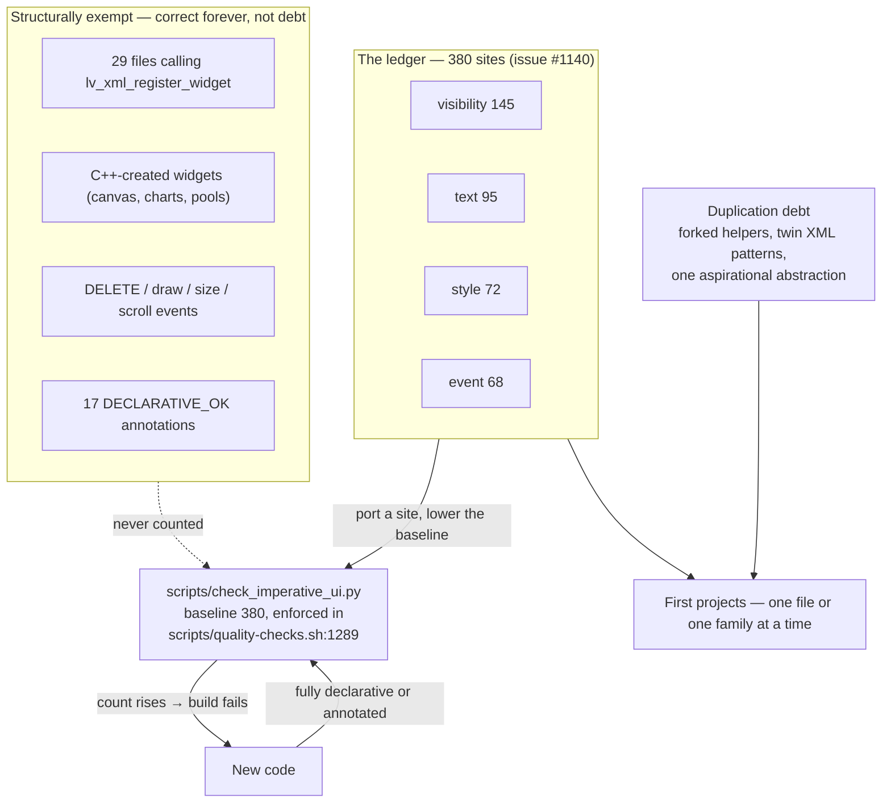

# 15 — Known debt

Every chapter before this one teaches the rules. This one maps the gap between those rules and the code you will actually read: ~380 imperative-UI sites the declarative rules would forbid, duplicated logic that AI-assisted development at this scale produced, and — so you do not mistake it for debt — the list of places where imperative C++ is the *correct* answer, permanently. Read this before copying any pattern you found in a panel, and before assuming a suspicious site is a bug: some of it is tracked, bounded, and waiting for a port.

The debt is deliberately bounded. The imperative-UI count is frozen by a ratchet gate in CI, so it can only shrink; the rest is catalogued here so refactors aim at known targets instead of rediscovering them.



## Key files

| File | Role |
|------|------|
| [`scripts/check_imperative_ui.py`](../../../scripts/check_imperative_ui.py) | The ratchet gate: counts imperative mutations of XML-owned widgets; `--list` prints every site |
| [`scripts/quality-checks.sh`](../../../scripts/quality-checks.sh) | CI entry that runs the gate with `--max-allowed 380` (`:1289`) — the number to ratchet down |
| [`docs/devel/SLOT_COMPONENT_DESIGNS.md`](../SLOT_COMPONENT_DESIGNS.md) | Unbuilt XML-deduplication proposals and the measured limits of the expression evaluator |
| [`src/ui/panel_widgets/fan_stack_widget.cpp`](../../../src/ui/panel_widgets/fan_stack_widget.cpp) | Duplication example: `bind_fan_observer()` (`:653`), one of a pair of twin helpers |
| [`src/ui/panel_widgets/led_widget.cpp`](../../../src/ui/panel_widgets/led_widget.cpp) | The other twin: `bind_led()` (`:109`) with the same workaround solved independently |
| [`include/sensor_registry.h`](../../../include/sensor_registry.h) | The aspirational central registry no production code constructs |
| [`src/printer/printer_discovery.cpp`](../../../src/printer/printer_discovery.cpp) | The direct manager wiring that bypasses that registry (`:105`–131) |
| [`ui_xml/components/panel_widget_network.xml`](../../../ui_xml/components/panel_widget_network.xml) | Duplication example: six state-mapped icons, five hidden at any moment (`:11`–31) |
| [`ui_xml/settings_hardware_overlay.xml`](../../../ui_xml/settings_hardware_overlay.xml) | Duplication example: four capability-gated wrapper rows (`:62`–93) |
| [`src/ui/ui_panel_gcode_test.cpp`](../../../src/ui/ui_panel_gcode_test.cpp) | First-project target: thirteen find-then-wire event registrations (`:391`–430) |
| [`tests/unit/test_sensor_registry.cpp`](../../../tests/unit/test_sensor_registry.cpp) | The only place `SensorRegistry` is ever constructed (15 times) |
| [`src/ui/ui_temperature_utils.cpp`](../../../src/ui/ui_temperature_utils.cpp) | The consolidation exemplar: `format_temperature_pair()` (`:61`) |
| [`01-declarative-ui.md`](01-declarative-ui.md) | The rules this ledger is measured against; the ratchet gotcha lives there too |

## How it works

Four catalogues: the ledger and its ratchet, the duplication debt, the deliberate tolerations, and the first projects that pay the debt down.

### The imperative-UI ledger: 380 sites and the ratchet

[`scripts/check_imperative_ui.py`](../../../scripts/check_imperative_ui.py) flags one specific shape: a widget fetched from an XML tree with `lv_obj_find_by_name()` and then mutated in C++ — `lv_label_set_text()` instead of `bind_text`, `lv_obj_add_flag(HIDDEN)` instead of `<bind_flag_if_eq>`, `lv_obj_set_style_*` instead of XML styles, `lv_obj_add_event_cb()` instead of `<event_cb>`. At this audit the count is **380**:

```
  event          68   → <event_cb trigger="clicked" callback="name"/> + lv_xml_register_event_cb()
  style          72   → XML style attribute (style_bg_color="#card_bg") or bind_style
  text           95   → bind_text="subject" on the XML element
  visibility    145   → <bind_flag_if_eq subject=... flag="hidden"> or <if cond=...>
  TOTAL         380
```

(verbatim from `python3 scripts/check_imperative_ui.py --summary`; regenerate any number in this section with `--list`). The count is enforced as a ratchet: [`scripts/quality-checks.sh:1289`](../../../scripts/quality-checks.sh#L1289) runs the gate with `--max-allowed 380`, so a change that adds even one site fails CI, and a port lowers both the count and the baseline. The debt is tracked in prestonbrown/helixscreen#1140. (An earlier revision of root [`AGENTS.md`](../../../AGENTS.md) said 387 — that number counted the report's own header and summary lines. The script's `TOTAL` is authoritative; root now cites it.)

Where the 380 lives, by directory:

| Area | Sites | Notes |
|------|-------|-------|
| `src/ui/` flat files | 336 | panels, overlays, wizards, services |
| `src/ui/panel_widgets/` | 24 | home-screen widgets |
| `src/ui/modals/` | 11 | modal dialogs |
| `src/ui/tour/` | 5 | first-run tour |
| `src/ui/widgets/` + `src/` root | 4 | [`power_device_widget.cpp`](../../../src/ui/widgets/power_device_widget.cpp) and [`xml_registration.cpp`](../../../src/xml_registration.cpp) |

The worst files: [`src/ui/ui_overlay_network_settings.cpp`](../../../src/ui/ui_overlay_network_settings.cpp) (19), [`src/ui/ui_panel_gcode_test.cpp`](../../../src/ui/ui_panel_gcode_test.cpp) (15), [`src/ui/ui_filament_mapping_modal.cpp`](../../../src/ui/ui_filament_mapping_modal.cpp) (15), [`src/ui/ui_panel_ams.cpp`](../../../src/ui/ui_panel_ams.cpp) and [`src/ui/temperature_service.cpp`](../../../src/ui/temperature_service.cpp) (12 each), then a trio at 11 — [`ui_spool_wizard.cpp`](../../../src/ui/ui_spool_wizard.cpp), [`ui_pin_utils.cpp`](../../../src/ui/ui_pin_utils.cpp), [`ui_fan_dial.cpp`](../../../src/ui/ui_fan_dial.cpp).

Why the sites exist: most predate the gate, written when the XML engine could not yet express what was needed — `<if>`, `<repeat>`, `<subject_expr>` and the word-form `cond` operators all shipped after chunks of this UI were built. Those were deliberate pragmatism at the time. Others are plain mistakes that got through review before the gate existed. Both are debt. **None of it is precedent**: do not imitate a nearby imperative site just because it is there, and do not port one opportunistically inside an unrelated change — the ratchet falls through dedicated, reviewable port commits.

A port looks like this. Today, [`src/ui/ui_panel_gcode_test.cpp:405`](../../../src/ui/ui_panel_gcode_test.cpp#L405) wires zoom buttons by hand:

```cpp
if (btn_zoom_in)
    lv_obj_add_event_cb(btn_zoom_in, on_zoom_clicked_static, LV_EVENT_CLICKED, this);
```

The declarative target is the shape every [`ui_xml/bed_temp_panel.xml:73`](../../../ui_xml/bed_temp_panel.xml#L73) preset button already uses — declare the callback where the button is declared ([`ui_xml/gcode_test_panel.xml:61`](../../../ui_xml/gcode_test_panel.xml#L61) defines `btn_zoom_in` today, callback-less):

```xml
<ui_button name="btn_zoom_in" flex_grow="1" text="+">
  <event_cb trigger="clicked" callback="on_gcode_zoom_in"/>
</ui_button>
```

and publish the handler by name from C++ — either a `{"name", fn}` table like [`src/ui/temperature_service.cpp:205`](../../../src/ui/temperature_service.cpp#L205) or a direct `lv_xml_register_event_cb()` as [`src/xml_registration.cpp:328`](../../../src/xml_registration.cpp#L328) does. The static wrapper, the null-check, and the ledger entry all disappear.

### Duplication debt: the honest part

AI-assisted design and build at this project's scale produced duplicated logic in places: parallel implementations of similar behavior, forked helpers where extending a near-fit would have served. Not always actively harmful, but confusing, inelegant, and a standing target for refactoring. The review rule exists because of this — *extend the near-fit helper, never fork a twin; copy-paste-modify is a red flag* — and the examples below are the concrete worst offenders the chapter audits for this series actually tripped over. No pretense of exhaustiveness; they frame the pattern.

- **Twin bind helpers in the home widgets.** `FanStackWidget::bind_fan_observer()` ([`src/ui/panel_widgets/fan_stack_widget.cpp:653`](../../../src/ui/panel_widgets/fan_stack_widget.cpp#L653)) and `LedWidget::bind_led()` ([`src/ui/panel_widgets/led_widget.cpp:109`](../../../src/ui/panel_widgets/led_widget.cpp#L109), self-bind at `:86`) each independently solve the same problem: `observe_int_sync` defers its initial fire through `ui_queue_update()`, which populate freezes — so each helper manually reads the current subject value at attach time. Same insight, two implementations, two places to fix if the freeze semantics change (chapter 09 documents the mechanism).
- **One aspirational abstraction, three parallel wirings.** `SensorRegistry` ([`include/sensor_registry.h:60`](../../../include/sensor_registry.h#L60)) was built as a central registry for the seven sensor managers. Production never constructs it — its only constructions are its own unit tests (15 in [`tests/unit/test_sensor_registry.cpp`](../../../tests/unit/test_sensor_registry.cpp)). Instead the managers are wired directly at three call sites: `PrinterDiscovery::parse_objects()` ([`src/printer/printer_discovery.cpp:105`](../../../src/printer/printer_discovery.cpp#L105)–131), the configfile discovery step ([`src/api/moonraker_discovery_sequence.cpp:741`](../../../src/api/moonraker_discovery_sequence.cpp#L741)–748), and `PrinterState::update_from_status()` ([`src/printer/printer_state.cpp:622`](../../../src/printer/printer_state.cpp#L622)–630). Chapter 06 documents the live wiring; the dead abstraction remains to be wired or deleted.
- **Six state-mapped icons in XML.** [`ui_xml/components/panel_widget_network.xml:11`](../../../ui_xml/components/panel_widget_network.xml#L11)–31: six `<icon>` elements, each with its own `bind_flag_if_not_eq` against `home_network_icon_state`, differing only in `src`, `variant`, and ref value. All six are built; five are hidden at any moment:

  ```xml
  <icon name="net_disconnected" src="wifi_off" size="#icon_size" variant="disabled">
    <bind_flag_if_not_eq subject="home_network_icon_state" flag="hidden" ref_value="0"/>
  </icon>
  <icon name="net_wifi_1" src="wifi_strength_1_alert" size="#icon_size" variant="warning">
    <bind_flag_if_not_eq subject="home_network_icon_state" flag="hidden" ref_value="1"/>
  </icon>
  <!-- four more, states 2 through 5 -->
  ```

  [`SLOT_COMPONENT_DESIGNS.md`](../SLOT_COMPONENT_DESIGNS.md) proposes a `state_icon` component (buildable today as a C++ custom widget) and records the bound-icon alternative the z-offset buttons already use.
- **Four capability-gated wrapper rows.** [`ui_xml/settings_hardware_overlay.xml:62`](../../../ui_xml/settings_hardware_overlay.xml#L62)–93: four `lv_obj` wrappers whose only job is carrying a `bind_flag_if_eq` over the real row:

  ```xml
  <lv_obj name="container_filament_sensors" width="100%" style_pad_all="0" scrollable="false">
    <bind_flag_if_eq subject="filament_sensor_count" flag="hidden" ref_value="0"/>
    <setting_action_row name="row_filament_sensors" label="Sensors" .../>
  </lv_obj>
  ```

  This one is arguably *correct* — the gates are reactive, and `<if>` builds only one branch at creation time, so `bind_flag_if_eq` is the right primitive (the caveat is spelled out in [`SLOT_COMPONENT_DESIGNS.md`](../SLOT_COMPONENT_DESIGNS.md)). The debt is that the wrapper is retyped by hand at every gated settings surface, not that it exists.
- **A family of sibling files stamped from one mold.** Five `ui_filament_*` files carry 44 ledger sites between them ([`ui_filament_mapping_modal.cpp`](../../../src/ui/ui_filament_mapping_modal.cpp) 15, [`ui_filament_mapping_card.cpp`](../../../src/ui/ui_filament_mapping_card.cpp) 10, [`ui_filament_catalog_selector.cpp`](../../../src/ui/ui_filament_catalog_selector.cpp) 10, [`ui_filament_slot_picker.cpp`](../../../src/ui/ui_filament_slot_picker.cpp) 6, [`ui_filament_catalog_picker.cpp`](../../../src/ui/ui_filament_catalog_picker.cpp) 3) — the same find-then-mutate patterns repeated across near-identical pickers.

The direction is proven: `format_temperature_pair()` ([`src/ui/ui_temperature_utils.cpp:61`](../../../src/ui/ui_temperature_utils.cpp#L61)) consolidated what were two hand-rolled current/target string subjects into one widget-owned formatter, and [`SLOT_COMPONENT_DESIGNS.md`](../SLOT_COMPONENT_DESIGNS.md) records the measured reason string formatting cannot move into XML formulas (the evaluator is integer-only). Consolidations like that are the template.

### Deliberate tolerations: C++ that is correct, not debt

The gate does not merely tolerate these cases — it excludes them structurally, so they never appear in the 380: files that call `lv_xml_register_widget` are skipped whole, widgets created with `lv_*_create` in C++ never had an XML layer, events with no declarative equivalent (`DELETE`, draw hooks, size/scroll) are not flagged, and neither are annotated lines. The table (verified against the root [`AGENTS.md`](../../../AGENTS.md) and the code — the bolded entries were spot-checked for this chapter):

| Case | Why C++ is correct |
|------|--------------------|
| **Custom XML widget implementations — the 29 files calling `lv_xml_register_widget`** | The file *is* the widget; there is no XML beneath it to bind to (counted: 29 — `rg -l 'lv_xml_register_widget' src/ include/` yields 31, two of which are the validator tool's regex references, not calls) |
| `LV_EVENT_DELETE` cleanup, draw hooks (`DRAW_MAIN`/`DRAW_POST`), `SIZE_CHANGED`, gestures/scroll | No declarative equivalent exists |
| **Measured layout and computed fonts** — `decide_nozzle_layout()` ([`src/ui/panel_widgets/nozzle_layout.h:31`](../../../src/ui/panel_widgets/nozzle_layout.h#L31)), breakpoint fonts | Depends on runtime pixel measurement |
| Widgets created in C++ (`lv_*_create`) — canvas, procedural rendering, gcode viewer | Never had an XML layer |
| **Per-item payload on generated collections** | `lv_obj_set_user_data()` on a `ui_button` overwrites the `UiButtonData*` it owns ([`src/ui/temperature_service.cpp:669`](../../../src/ui/temperature_service.cpp#L669) warns at the site) |
| `helix-screen ctl` remote control ([`src/remote/remote_control_server.cpp`](../../../src/remote/remote_control_server.cpp)) | Its job is reaching into an arbitrary live widget tree on command |
| CLI stdout ([`src/system/cli_args.cpp`](../../../src/system/cli_args.cpp), [`src/application/detect_printer_cmd.cpp`](../../../src/application/detect_printer_cmd.cpp), [`src/helix_splash.cpp`](../../../src/helix_splash.cpp)) | stdout *is* the product there; spdlog is for logging |
| Widget pool recycling, chart data, animations | Churn or per-frame data a subject would not model |

When you genuinely hit a site that cannot be declarative and fits none of these rows, annotate it `// DECLARATIVE_OK: <reason>` — the gate skips annotated lines. Census at this audit: **17** `DECLARATIVE_OK` annotations (measured layout and scroll handlers account for most — [`ui_context_menu.cpp`](../../../src/ui/ui_context_menu.cpp) alone carries four), **3** `TIMER_DTOR_OK` (timer-destructor cancellation escape hatch — two token-guarded, one singleton-mediated), and **0** `VENDOR_OK` and `RTTI_OK` — the vendor-abstraction and no-RTTI rules have held without anyone needing the hatch. Annotations are a last resort with a stated reason, not a way to silence the gate.

### Debt as first projects

Each entry verified against the tree at this audit; counts regenerate with `python3 scripts/check_imperative_ui.py --list`.

1. **Port the gcode test panel's event block** — [`src/ui/ui_panel_gcode_test.cpp:391`](../../../src/ui/ui_panel_gcode_test.cpp#L391)–430 is thirteen `lv_obj_find_by_name()` + `lv_obj_add_event_cb()` pairs. Each becomes `<event_cb trigger="..." callback="..."/>` in [`ui_xml/gcode_test_panel.xml`](../../../ui_xml/gcode_test_panel.xml) plus one registration (see the worked sketch above). Good first project because it is a self-contained developer panel (no print-state risk), purely mechanical, and exercises rule 1 end to end.
2. **Port the network settings overlay** — [`src/ui/ui_overlay_network_settings.cpp`](../../../src/ui/ui_overlay_network_settings.cpp) is the single worst file (19 sites: 9 text, 10 visibility, clustered at `:651`–791 and `:1224`–1687). Every binding is `bind_text` or `<bind_flag_if_eq>` — the cheapest vocabulary. Good because one overlay owns the whole change and the ratchet drops by 19 when it lands.
3. **Port the filament picker family** — the five `ui_filament_*` files (44 sites) share one mold; porting them in sequence is the same learning applied five times, and each file is small (the largest, the modal, is 366 lines). Good because it converts a *family* of duplicates into one declarative pattern, addressing both ledgers at once — the imperative count and the sibling-file duplication.
4. **Build `state_icon`** — the prop-based variant from [`SLOT_COMPONENT_DESIGNS.md`](../SLOT_COMPONENT_DESIGNS.md) (comma-separated `icons`/`variants` lists, built as a C++ custom widget) collapses the six network icons and every future state-mapped icon row. Good because the design work is already done and measured; it only needs building.
5. **Resolve `SensorRegistry`** — wire it into the three production call sites or delete it. Good because the decision is binary, the unit tests already exist for the wire path, and deletion alone removes a lie from the tree (chapter 06 currently has to document the bypass).

Every port verifies the same three ways:

- rebuild the binary — a stale binary renders the new XML with dead bindings, because the C++ side of the bindings must exist;
- launch with `-vv` and grep for `No subject was found` — a misspelled subject name is a WARN, not an error;
- drive the surface with `helix-screen ctl` to confirm the behavior survived the port.

## Patterns & gotchas

- **Existing imperative code is not precedent.** The 380 sites are bounded debt, not an alternative style. A nearby `lv_label_set_text()` never justifies yours.
- **No opportunistic refactors.** Do not port an imperative site as a side effect of an unrelated change — the port and the feature get reviewed separately, and the baseline drop lands in the port commit.
- **The port workflow is two edits.** Port the site, then lower the number in [`scripts/quality-checks.sh:1289`](../../../scripts/quality-checks.sh#L1289) (and root [`AGENTS.md`](../../../AGENTS.md), if you keep it in sync) in the same commit. The gate output tells you the new total.
- **A port touches both sides.** XML edits need no rebuild, but a port *removes* C++ and *adds* XML plus registrations — the binary must be rebuilt, or the new bindings silently stay dead (chapter 01's drift trap).
- **Annotate with a reason or not at all.** `DECLARATIVE_OK` without a real justification is a lint suppressant, and reviewers should treat it that way. If you cannot name the structural reason, it does not qualify.
- **Duplication review is cheap at commit time.** Each forked helper above cost one question at review — "does a near-fit already exist?" — and costs a refactoring project once merged. [`REVIEW_RUBRIC.md`](../REVIEW_RUBRIC.md) carries this.
- **The gate runs on every commit.** `.githooks/pre-commit` execs `scripts/quality-checks.sh --staged-only --auto-fix`, so a rise in the count blocks the commit locally, not just in CI — you cannot accidentally land a 381st site.
- **Counts in this chapter are a census, not constants.** Every number here has a one-command regeneration; when they disagree with the tree, the tree wins and this chapter should be updated.
- **Old plans prescribe duplicated pasts.** Several forked helpers trace to two parallel workstreams extending similar code; [`docs/devel/CLAUDE.md`](../CLAUDE.md)'s warning that `plans/` are point-in-time applies double when a plan's approach was forked rather than extended.

## Going deeper

- [`01-declarative-ui.md`](01-declarative-ui.md) — the rules, the binding vocabularies, and the ratchet gotcha; the target state every port aims at.
- [`../SLOT_COMPONENT_DESIGNS.md`](../SLOT_COMPONENT_DESIGNS.md) — the two unbuilt XML-dedup proposals, what the other two turned into, and the measured evaluator limits that keep string formatting in C++.
- [`../REVIEW_RUBRIC.md`](../REVIEW_RUBRIC.md) — what reviews flag (forked twins, vendor leaks) and what the gates already cover, so you do not re-lint by hand.
- [`../LVGL9_XML_GUIDE.md`](../LVGL9_XML_GUIDE.md) — the full target vocabulary: `<if>`, `<repeat>`, `<subject_expr>`, `event_cb`, binding elements.

## Guided code tour

Read in this order; about 25 minutes total.

1. [`scripts/check_imperative_ui.py:10`](../../../scripts/check_imperative_ui.py#L10) — the header comment: what is flagged, what is structurally exempt, and the ratchet philosophy. The whole chapter in 40 lines.
2. [`scripts/quality-checks.sh:1283`](../../../scripts/quality-checks.sh#L1283) — where the baseline 380 is enforced and how a port ratchets it down.
3. [`src/ui/ui_panel_gcode_test.cpp:391`](../../../src/ui/ui_panel_gcode_test.cpp#L391) — the archetype of the 68 event sites: find by name, add callback, null-check each. First project #1 is this block.
4. [`ui_xml/gcode_test_panel.xml:61`](../../../ui_xml/gcode_test_panel.xml#L61) — the same buttons from the XML side, callback-less today; picture the `<event_cb>` the port adds.
5. [`src/ui/ui_overlay_network_settings.cpp:651`](../../../src/ui/ui_overlay_network_settings.cpp#L651) — the text/visibility archetype (three sites within ten lines); first project #2 starts here.
6. [`src/ui/panel_widgets/fan_stack_widget.cpp:653`](../../../src/ui/panel_widgets/fan_stack_widget.cpp#L653) — `bind_fan_observer()`: the manual subject read that works around the deferred initial fire under populate's freeze.
7. [`src/ui/panel_widgets/led_widget.cpp:75`](../../../src/ui/panel_widgets/led_widget.cpp#L75) — the twin: same problem, same workaround, separately evolved. Then `:109` for `bind_led()` itself.
8. [`include/sensor_registry.h:60`](../../../include/sensor_registry.h#L60) — the registry class nothing in production constructs.
9. [`src/printer/printer_discovery.cpp:105`](../../../src/printer/printer_discovery.cpp#L105) — the direct manager wiring that makes the registry aspirational.
10. [`ui_xml/components/panel_widget_network.xml:11`](../../../ui_xml/components/panel_widget_network.xml#L11) — the six state-mapped icons; count the attributes that differ (three).
11. [`ui_xml/settings_hardware_overlay.xml:62`](../../../ui_xml/settings_hardware_overlay.xml#L62) — the four wrapper rows; note each is reactive gating, which is why this is duplication but not a bug.
12. [`src/ui/temperature_service.cpp:669`](../../../src/ui/temperature_service.cpp#L669) — the in-code warning that documents the `user_data` toleration row better than any doc could.
13. [`src/ui/ui_temperature_utils.cpp:61`](../../../src/ui/ui_temperature_utils.cpp#L61) — `format_temperature_pair()`: what consolidation done right looks like, and the endpoint of first project #3's pattern.
