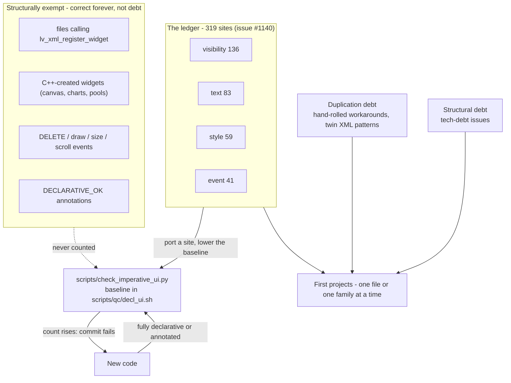

# 15 - Known debt

Every chapter before this one teaches the rules. This one maps the gap between those rules and the code you will actually read: a few hundred imperative-UI sites the declarative rules would forbid, duplicated logic that AI-assisted development at this scale produced, a short list of open correctness residue, and, so you do not mistake it for debt, the places where imperative C++ is the *correct* answer, permanently. Read this before copying any pattern you found in a panel, and before assuming a suspicious site is a bug: some of it is tracked, bounded, and waiting for a port.

The debt is deliberately bounded. The imperative-UI count is frozen by a ratchet gate, so it can only shrink; the larger structural items each have a GitHub issue; the rest is catalogued here so refactors aim at known targets instead of rediscovering them.


```mermaid
flowchart TD
    NEW["New code"] -->|"fully declarative or annotated"| GATE

    subgraph LEDGER["The ledger - 319 sites (issue #1140)"]
        V["visibility 136"]
        T["text 83"]
        S["style 59"]
        E["event 41"]
    end

    GATE["scripts/check_imperative_ui.py<br/>baseline in scripts/qc/decl_ui.sh"]
    LEDGER -->|"port a site, lower the baseline"| GATE
    GATE -->|"count rises: commit fails"| NEW

    subgraph EXEMPT["Structurally exempt - correct forever, not debt"]
        W["files calling lv_xml_register_widget"]
        C["C++-created widgets (canvas, charts, pools)"]
        H["DELETE / draw / size / scroll events"]
        A["DECLARATIVE_OK annotations"]
    end
    EXEMPT -.->|"never counted"| GATE

    DUP["Duplication debt<br/>hand-rolled workarounds, twin XML patterns"] --> PROJECTS
    ISSUES["Structural debt<br/>tech-debt issues"] --> PROJECTS
    LEDGER --> PROJECTS["First projects - one file or one family at a time"]
```

## Key files

| File | Role |
|------|------|
| [`scripts/check_imperative_ui.py`](../../../scripts/check_imperative_ui.py) | The ratchet gate: counts imperative mutations of XML-owned widgets; `--summary` prints the totals, `--list` every site |
| [`scripts/qc/decl_ui.sh`](../../../scripts/qc/decl_ui.sh) | The quality gate that runs it with `--max-allowed <baseline>` (`scripts/qc/decl_ui.sh#qc_decl_ui`): the number to ratchet down |
| [`docs/devel/SLOT_COMPONENT_DESIGNS.md`](../SLOT_COMPONENT_DESIGNS.md) | Unbuilt XML-deduplication proposals and the measured limits of the expression evaluator |
| [`src/ui/panel_widgets/fan_stack_widget.cpp`](../../../src/ui/panel_widgets/fan_stack_widget.cpp) | Duplication example: `bind_fan_observer()` (`src/ui/panel_widgets/fan_stack_widget.cpp#bind_fan_observer`) reads the subject by hand after observing it |
| [`src/ui/panel_widgets/thermistor_widget.cpp`](../../../src/ui/panel_widgets/thermistor_widget.cpp) | The same workaround solved again: `attach_carousel()` (`src/ui/panel_widgets/thermistor_widget.cpp#attach_carousel`) |
| [`ui_xml/components/panel_widget_network.xml`](../../../ui_xml/components/panel_widget_network.xml) | Duplication example: six state-mapped icons, five hidden at any moment, starting at `ui_xml/components/panel_widget_network.xml#net_disconnected` |
| [`ui_xml/settings_hardware_overlay.xml`](../../../ui_xml/settings_hardware_overlay.xml) | Duplication example: capability-gated wrapper rows, e.g. `ui_xml/settings_hardware_overlay.xml#container_fan_settings` |
| [`src/ui/ui_wizard_connection.cpp`](../../../src/ui/ui_wizard_connection.cpp) | First-project target: three find-then-wire event registrations in `src/ui/ui_wizard_connection.cpp#create` |
| [`src/ui/ui_temperature_utils.cpp`](../../../src/ui/ui_temperature_utils.cpp) | The consolidation exemplar: `format_temperature_pair()` (`src/ui/ui_temperature_utils.cpp#format_temperature_pair`) |
| [`01-declarative-ui.md`](01-declarative-ui.md) | The rules this ledger is measured against; the ratchet gotcha lives there too |

## How it works

Five catalogues: the ledger and its ratchet, the duplication debt, the open correctness residue, the structural debt tracked as issues, and the deliberate tolerations. Then the first projects that pay the debt down.

### The imperative-UI ledger and the ratchet

[`scripts/check_imperative_ui.py`](../../../scripts/check_imperative_ui.py) flags one specific shape: a widget fetched from an XML tree by name (`lv_obj_find_by_name()`, `find_required()`, `find_optional()`) and then mutated in C++: `lv_label_set_text()` instead of `bind_text`, `lv_obj_add_flag(HIDDEN)` instead of `<bind_flag_if_eq>`, `lv_obj_set_style_*` instead of XML styles, `lv_obj_add_event_cb()` instead of `<event_cb>`. At this writing the count is **319**:

```
  event          41   → <event_cb trigger="clicked" callback="name"/> + lv_xml_register_event_cb()
  style          59   → XML style attribute (style_bg_color="#card_bg") or bind_style
  text           83   → bind_text="subject" on the XML element
  visibility    136   → <bind_flag_if_eq subject=... flag="hidden"> or <if cond=...>
  TOTAL         319
```

(verbatim from `python3 scripts/check_imperative_ui.py --summary`; regenerate any number in this section with `--list`). The count is enforced as a ratchet: [`scripts/qc/decl_ui.sh#qc_decl_ui`](../../../scripts/qc/decl_ui.sh) runs the gate with `--max-allowed` set to the baseline, so a change that adds a site past it fails the commit, and a port lowers both the count and the baseline. The baseline can sit a few sites above the live count after ports land; lowering it to the count is a one-line change. The porting epic is prestonbrown/helixscreen#1140.

Where the sites live, by directory:

| Area | Sites | Notes |
|------|-------|-------|
| `src/ui/` flat files | 276 | panels, overlays, wizards, services |
| `src/ui/panel_widgets/` | 21 | home-screen widgets |
| `src/ui/modals/` | 11 | modal dialogs |
| `src/ui/tour/` | 5 | first-run tour |
| `src/ui/widgets/`, `src/xml_registration.cpp`, `src/plugin/` | 6 | two each |

The worst files: [`src/ui/ui_overlay_network_settings.cpp`](../../../src/ui/ui_overlay_network_settings.cpp) (18), [`src/ui/ui_filament_mapping_modal.cpp`](../../../src/ui/ui_filament_mapping_modal.cpp) (15), [`src/ui/ui_panel_ams.cpp`](../../../src/ui/ui_panel_ams.cpp) (12), then [`ui_pin_utils.cpp`](../../../src/ui/ui_pin_utils.cpp) and [`ui_fan_dial.cpp`](../../../src/ui/ui_fan_dial.cpp) at 11.

Why the sites exist: most were written when the XML engine could not yet express what was needed (`<if>`, `<repeat>`, `<subject_expr>` and the word-form `cond` operators came after chunks of this UI were built). Others are plain mistakes that got through review. Both are debt. **None of it is precedent**: do not imitate a nearby imperative site just because it is there, and do not port one opportunistically inside an unrelated change; the ratchet falls through dedicated, reviewable port commits.

A port looks like this. [`src/ui/ui_wizard_connection.cpp#create`](../../../src/ui/ui_wizard_connection.cpp) wires the test button by hand:

```cpp
lv_obj_t* test_btn = helix::ui::find_required(screen_root_, "btn_test_connection", get_name());
if (test_btn) {
    lv_obj_add_event_cb(test_btn, on_test_connection_clicked_static, LV_EVENT_CLICKED, this);
```

The declarative target is the shape the [`ui_xml/temp_graph_overlay.xml`](../../../ui_xml/temp_graph_overlay.xml) preset buttons already use: declare the callback where the button is declared ([`ui_xml/wizard_connection.xml#btn_test_connection`](../../../ui_xml/wizard_connection.xml) defines `btn_test_connection`, callback-less):

```xml
<ui_button name="btn_test_connection" width="200" text="Test Connection">
  <event_cb trigger="clicked" callback="on_wizard_test_connection"/>
</ui_button>
```

and publish the handler by name from C++, either in a `{"name", fn}` table like `src/ui/temperature_service.cpp#TemperatureService/"on_chamber_fault_reset_clicked"` or with a direct `lv_xml_register_event_cb()` as [`src/xml_registration.cpp#register_xml_components`](../../../src/xml_registration.cpp) does. The static wrapper, the null-check, and the ledger entry all disappear.

### Duplication debt

AI-assisted design and build at this project's scale produced duplicated logic in places: parallel implementations of similar behavior, forked helpers where extending a near-fit would have served. Not always harmful, but confusing, and a standing target for refactoring. The review rule exists because of this (*extend the near-fit helper, never fork a twin; copy-paste-modify is a red flag*), and the examples below frame the pattern without claiming to be exhaustive.

- **Hand-rolled initial reads in the home widgets.** `observe<int>` defers its initial fire through `ui_queue_update()`, and `populate_widgets()` freezes that queue, so a widget attached during populate never sees the initial value. `FanStackWidget::bind_fan_observer()` ([`src/ui/panel_widgets/fan_stack_widget.cpp#bind_fan_observer`](../../../src/ui/panel_widgets/fan_stack_widget.cpp)) reads the subject by hand after observing it, and `ThermistorWidget::attach_carousel()` ([`src/ui/panel_widgets/thermistor_widget.cpp#attach_carousel`](../../../src/ui/panel_widgets/thermistor_widget.cpp)) binds immediately for the same reason. Same insight, solved per widget, so a change to the freeze semantics has to find every copy (chapter 09 documents the mechanism).
- **Six state-mapped icons in XML.** [`ui_xml/components/panel_widget_network.xml#net_disconnected`](../../../ui_xml/components/panel_widget_network.xml) and the five icons after it: each `<icon>` carries its own `bind_flag_if_not_eq` against `home_network_icon_state`, differing only in `src`, `variant`, and ref value. All six are built; five are hidden at any moment:

  ```xml
  <icon name="net_disconnected" src="wifi_off" size="#icon_size" variant="disabled">
    <bind_flag_if_not_eq subject="home_network_icon_state" flag="hidden" ref_value="0"/>
  </icon>
  <icon name="net_wifi_1" src="wifi_strength_1_alert" size="#icon_size" variant="warning">
    <bind_flag_if_not_eq subject="home_network_icon_state" flag="hidden" ref_value="1"/>
  </icon>
  <!-- four more, states 2 through 5 -->
  ```

  [`SLOT_COMPONENT_DESIGNS.md`](../SLOT_COMPONENT_DESIGNS.md) proposes a `state_icon` component (buildable today as a C++ custom widget) and records the bound-icon alternative the z-offset buttons already use.
- **Capability-gated wrapper rows.** [`ui_xml/settings_hardware_overlay.xml#container_fan_settings`](../../../ui_xml/settings_hardware_overlay.xml) and its siblings (camera, AMS, filament sensors, LED, power devices): `lv_obj` wrappers whose only job is carrying a `bind_flag_if_eq` over the real row:

  ```xml
  <lv_obj name="container_filament_sensors" width="100%" style_pad_all="0" scrollable="false">
    <bind_flag_if_eq subject="filament_sensor_count" flag="hidden" ref_value="0"/>
    <setting_action_row name="row_filament_sensors" label="Sensors" .../>
  </lv_obj>
  ```

  This one is arguably *correct*: the gates are reactive, and `<if>` builds only one branch at creation time, so `bind_flag_if_eq` is the right primitive (the caveat is spelled out in [`SLOT_COMPONENT_DESIGNS.md`](../SLOT_COMPONENT_DESIGNS.md)). The debt is that the wrapper is retyped by hand at every gated settings surface, not that it exists.
- **A family of sibling files stamped from one mold.** Five `ui_filament_*` files carry 41 ledger sites between them ([`ui_filament_mapping_modal.cpp`](../../../src/ui/ui_filament_mapping_modal.cpp) 15, [`ui_filament_catalog_selector.cpp`](../../../src/ui/ui_filament_catalog_selector.cpp) 10, [`ui_filament_mapping_card.cpp`](../../../src/ui/ui_filament_mapping_card.cpp) 8, [`ui_filament_slot_picker.cpp`](../../../src/ui/ui_filament_slot_picker.cpp) 6, [`ui_filament_catalog_picker.cpp`](../../../src/ui/ui_filament_catalog_picker.cpp) 2): the same find-then-mutate patterns repeated across near-identical pickers, down to the same four-line warning-swatch style block in the modal and the slot picker.

The direction is proven: `format_temperature_pair()` ([`src/ui/ui_temperature_utils.cpp#format_temperature_pair`](../../../src/ui/ui_temperature_utils.cpp)) consolidated two hand-rolled current/target string subjects into one widget-owned formatter, and [`SLOT_COMPONENT_DESIGNS.md`](../SLOT_COMPONENT_DESIGNS.md) records the measured reason string formatting cannot move into XML formulas (the evaluator is integer-only). Consolidations like that are the template.

### Open correctness residue in lane identity

The lane source model (`Observation`, `LaneSources`, `resolve()`; [`07-filament-ams.md`](07-filament-ams.md) § "Lane identity by source") is supplied by every AMS backend and read by the panels. Two pieces of residue are known and have no issue of their own:

**The echo question has three hand-built answers.** `AmsBackend::own_write_expectation`
([`include/ams_backend.h#own_write_expectation`](../../../include/ams_backend.h)),
`SlotFingerprintTracker::expect_any_of`
([`include/filament_slot_override_store.h#SlotFingerprintTracker/"expect_any_of(int slot_index,"`](../../../include/filament_slot_override_store.h))
and `helix::ams::OwnWriteEchoes`
([`include/lane_echo.h#OwnWriteEchoes`](../../../include/lane_echo.h)) each suppress one
flavour of "is this reading someone else's write or the echo of my own?" for one backend
family. `Observation` ([`include/lane_observation.h#"struct Observation {"`](../../../include/lane_observation.h)) carries no field for the answer, so the source model
states which source spoke and not whose write it was. A backend that writes a user's edit to the printer and
parses it back files the echo as a `VendorCache` reading unless one of the three catches it.

**A Spoolman save that wrote part of what it was asked for leaves the lane on the pre-save identity.**
A successful save re-reads the spool through `SpoolmanManager::refresh_spool()`
([`src/printer/spoolman_manager.cpp#refresh_spool`](../../../src/printer/spoolman_manager.cpp)),
so the lane carries the server's answer before the next poll. A save that fails part way does
not: `SpoolmanSlotSaver` can repoint the spool at a new filament and then fail the weight update
([`src/spoolman/spoolman_slot_saver.cpp`](../../../src/spoolman/spoolman_slot_saver.cpp)), which changes the spool
on the server while the edit overlay reports "Couldn't save to Spoolman. Nothing changed on this
printer." and the lane keeps the identity it held until the poll comes round. Reading the spool on the
failed branch as well is the fix. What blocks it is the test side: the mock's
`set_mock_spoolman_enabled(false)`
([`include/moonraker_client_mock.h#set_mock_spoolman_enabled`](../../../include/moonraker_client_mock.h))
fails reads and writes together, so a partial write cannot be staged and the read on that
branch would ship with nothing able to pin it.

One accepted limit is documented in the code rather than here: `request_resync()` refreshes the lane but not a
backend's `overrides_` map, which is harmless only while no backend that answers
`firmware_publishes_lane_identity()` false reads `overrides_` to decide something
(`include/ams_subscription_backend.h#firmware_publishes_lane_identity`, #1629).

### Structural debt tracked as issues

The larger items are GitHub issues labelled `tech-debt` (`gh issue list --label tech-debt --state open`), and the
issue is the source of truth for scope and status. As of this writing:

| Issue | Debt |
|-------|------|
| #1328 | Tracking: debt accepted past 1.0 (god classes, a recursive mutex in `AmsState`, shutdown flag races, the `UpdateQueue` frozen-flag TOCTOU) |
| #1325, #1326, #1327 | Application bootstrap/runtime split, a `UIPanelContext` value object in place of the singleton cascade, an `INavigable` interface over `NavigationManager` |
| #1329, #1246 | Overlays allocated on push and destroyed on pop; panels and dialogs releasing their allocations on close |
| #1371, #1372 | The Moonraker consumer interfaces live in the global namespace; namespace spelling is inconsistent |
| #1363 | Comment volume: about half of every header is prose |
| #1375, #1757 | Test quality: four ratchets to burn down; tests that reach state through `TestAccess` shims instead of public APIs |
| #1279, #1293 | ASan at-exit leak baseline; remaining sanitizer findings |
| #1052 | AMS buffer and sync-feedback UI that each backend drives |
| #1158 | AFC and Happy Hare slot overrides kept in our own namespace until upstream `lane_data` carries vendor and weight (blocked upstream) |
| #1688, #1743 | LVGL 9.5 to 9.6; libhv to a pinned upstream with our patches dropped or rebased |
| #1731 | One static armv7 binary for the AD5M and the Centauri Carbon 1 |
| #1759 | ESP32 manifests excluding by directory once `src/` is reorganised |

### Deliberate tolerations: C++ that is correct, not debt

The gate does not merely tolerate these cases; it excludes them structurally, so they never appear in the ledger: files that call `lv_xml_register_widget` are skipped whole, widgets created with `lv_*_create` in C++ never had an XML layer, events with no declarative equivalent (`DELETE`, draw hooks, size/scroll) are not flagged, and neither are annotated lines.

| Case | Why C++ is correct |
|------|--------------------|
| **Custom XML widget implementations: every file calling `lv_xml_register_widget`** (37 today) | The file *is* the widget; there is no XML beneath it to bind to |
| `LV_EVENT_DELETE` cleanup, draw hooks (`DRAW_MAIN`/`DRAW_POST`), `SIZE_CHANGED`, gestures/scroll | No declarative equivalent exists |
| **Measured layout and computed fonts**: `decide_nozzle_layout()` ([`src/ui/panel_widgets/nozzle_layout.h#decide_nozzle_layout`](../../../src/ui/panel_widgets/nozzle_layout.h)), `PrintStatusLayoutFitter`, breakpoint fonts | Depends on runtime pixel measurement |
| Widgets created in C++ (`lv_*_create`): canvas, procedural rendering, gcode viewer | Never had an XML layer |
| **Per-item payload on generated collections** | `lv_obj_set_user_data()` on a `ui_button` overwrites the `UiButtonData*` it owns ([`src/ui/ui_button.cpp#UiButtonData`](../../../src/ui/ui_button.cpp) documents the hazard) |
| `helix-screen ctl` remote control ([`src/remote/remote_control_server.cpp`](../../../src/remote/remote_control_server.cpp)) | Its job is reaching into an arbitrary live widget tree on command |
| CLI stdout ([`src/system/cli_args.cpp`](../../../src/system/cli_args.cpp), [`src/application/detect_printer_cmd.cpp`](../../../src/application/detect_printer_cmd.cpp), [`src/helix_splash.cpp`](../../../src/helix_splash.cpp)) | stdout *is* the product there; spdlog is for logging |
| Widget pool recycling, chart data, animations | Churn or per-frame data a subject would not model |

When you genuinely hit a site that cannot be declarative and fits none of these rows, annotate it `// DECLARATIVE_OK: <reason>`; the gate skips annotated lines. Census at this writing (`grep -rn '// DECLARATIVE_OK:' src include`): **78** annotations, most of them measured layout and per-item styling on generated rows ([`ui_filament_mapping_card.cpp`](../../../src/ui/ui_filament_mapping_card.cpp) carries nine). The sibling escape hatches are rarer: **8** `TIMER_DTOR_OK` (each a token-guarded or owner-cancelled timer), **7** `VENDOR_OK` (the mock's simulated vendor payloads and the chamber-heater backends that are the vendor border), and **0** `RTTI_OK`. Annotations are a last resort with a stated reason, not a way to silence the gate.

### Debt as first projects

Each entry verified against the tree at this writing; counts regenerate with `python3 scripts/check_imperative_ui.py --list`.

1. **Port the connection wizard step's event block**: [`src/ui/ui_wizard_connection.cpp#create`](../../../src/ui/ui_wizard_connection.cpp) holds three `find_required()` + `lv_obj_add_event_cb()` pairs (test button, IP input, port input). Each becomes `<event_cb trigger="..." callback="..."/>` in [`ui_xml/wizard_connection.xml`](../../../ui_xml/wizard_connection.xml) plus one registration (see the worked sketch above). A good first project: one self-contained wizard step with no print-state risk, purely mechanical, and it exercises rule 1 end to end.
2. **Port the network settings overlay**: [`src/ui/ui_overlay_network_settings.cpp`](../../../src/ui/ui_overlay_network_settings.cpp) is the single worst file (18 sites: 8 text, 10 visibility, in `src/ui/ui_overlay_network_settings.cpp#build_network_list`, `show_placeholder`, `update_signal_icons`, `handle_hidden_connect_clicked` and the password modal's `handle_password_connect_clicked`). Every binding is `bind_text` or `<bind_flag_if_eq>`, the cheapest vocabulary, and one overlay owns the whole change.
3. **Port the filament picker family**: the five `ui_filament_*` files (41 sites) share one mold; porting them in sequence is the same learning applied five times, and each file is small (the largest, the modal, is about 430 lines). It converts a *family* of duplicates into one declarative pattern, addressing both ledgers at once.
4. **Build `state_icon`**: the prop-based variant from [`SLOT_COMPONENT_DESIGNS.md`](../SLOT_COMPONENT_DESIGNS.md) (comma-separated `icons`/`variants` lists, built as a C++ custom widget) collapses the six network icons and every future state-mapped icon row. The design work is already done and measured; it only needs building.

Every port verifies the same three ways:

- rebuild the binary: a stale binary renders the new XML with dead bindings, because the C++ side of the bindings must exist;
- launch with `-vv` and grep for `No subject was found`: a misspelled subject name is a WARN, not an error;
- drive the surface with `helix-screen ctl` to confirm the behavior survived the port.

## Patterns & gotchas

- **Existing imperative code is not precedent.** The ledger is bounded debt, not an alternative style. A nearby `lv_label_set_text()` never justifies yours.
- **No opportunistic refactors.** Do not port an imperative site as a side effect of an unrelated change; the port and the feature get reviewed separately, and the baseline drop lands in the port commit.
- **The port workflow is two edits.** Port the site, then lower the number in [`scripts/qc/decl_ui.sh#qc_decl_ui`](../../../scripts/qc/decl_ui.sh) in the same commit. The gate output tells you the new total.
- **A port touches both sides.** XML edits need no rebuild, but a port *removes* C++ and *adds* XML plus registrations, so the binary must be rebuilt or the new bindings silently stay dead (chapter 01's drift trap).
- **Annotate with a reason or not at all.** `DECLARATIVE_OK` without a real justification is a lint suppressant, and reviewers should treat it that way. If you cannot name the structural reason, it does not qualify.
- **Duplication review is cheap at commit time.** Each forked helper above cost one question at review ("does a near-fit already exist?") and costs a refactoring project once merged. [`REVIEW_RUBRIC.md`](../REVIEW_RUBRIC.md) carries this.
- **The gate runs on every commit.** `.githooks/pre-commit` execs `scripts/quality-checks.sh --staged-only --auto-fix`, so a rise in the count blocks the commit locally, not just in CI.
- **Counts in this chapter are a census, not constants.** Every number here has a one-command regeneration; when they disagree with the tree, the tree wins and this chapter should be updated.
- **Old plans prescribe duplicated pasts.** [`docs/devel/CLAUDE.md`](../CLAUDE.md)'s warning that `plans/` are point-in-time applies double when a plan's approach was forked rather than extended.

## Going deeper

- [`01-declarative-ui.md`](01-declarative-ui.md) - the rules, the binding vocabularies, and the ratchet gotcha; the target state every port aims at.
- [`../SLOT_COMPONENT_DESIGNS.md`](../SLOT_COMPONENT_DESIGNS.md) - the two unbuilt XML-dedup proposals, what the other two turned into, and the measured evaluator limits that keep string formatting in C++.
- [`../REVIEW_RUBRIC.md`](../REVIEW_RUBRIC.md) - what reviews flag (forked twins, vendor leaks) and what the gates already cover, so you do not re-lint by hand.
- [`../LVGL9_XML_GUIDE.md`](../LVGL9_XML_GUIDE.md) - the full target vocabulary: `<if>`, `<repeat>`, `<subject_expr>`, `event_cb`, binding elements.
- [`07-filament-ams.md`](07-filament-ams.md) - the lane source model the residue above sits in.

## Guided code tour

Read in this order; about 25 minutes total.

1. [`scripts/check_imperative_ui.py`](../../../scripts/check_imperative_ui.py) - the header comment: what is flagged, what is structurally exempt, and the ratchet philosophy.
2. [`scripts/qc/decl_ui.sh#qc_decl_ui`](../../../scripts/qc/decl_ui.sh) - where the baseline is enforced and how a port ratchets it down.
3. [`src/ui/ui_wizard_connection.cpp#create`](../../../src/ui/ui_wizard_connection.cpp) - the archetype of the event sites: find by name, add callback, null-check each. First project #1 is this block.
4. [`ui_xml/wizard_connection.xml#btn_test_connection`](../../../ui_xml/wizard_connection.xml) - the same button from the XML side, callback-less; picture the `<event_cb>` the port adds.
5. [`src/ui/ui_overlay_network_settings.cpp#build_network_list`](../../../src/ui/ui_overlay_network_settings.cpp) - the text archetype; first project #2 starts here.
6. [`src/ui/panel_widgets/fan_stack_widget.cpp#bind_fan_observer`](../../../src/ui/panel_widgets/fan_stack_widget.cpp) - the manual subject read that works around the deferred initial fire under populate's freeze.
7. [`src/ui/panel_widgets/thermistor_widget.cpp#attach_carousel`](../../../src/ui/panel_widgets/thermistor_widget.cpp) - the same problem, the same workaround, separately written.
8. [`ui_xml/components/panel_widget_network.xml#net_disconnected`](../../../ui_xml/components/panel_widget_network.xml) - the six state-mapped icons; count the attributes that differ (three).
9. [`ui_xml/settings_hardware_overlay.xml#container_fan_settings`](../../../ui_xml/settings_hardware_overlay.xml) - the wrapper rows; note each is reactive gating, which is why this is duplication but not a bug.
10. [`src/ui/ui_button.cpp#UiButtonData`](../../../src/ui/ui_button.cpp) - the in-code note that documents the `user_data` toleration row better than any doc could.
11. [`src/ui/ui_temperature_utils.cpp#format_temperature_pair`](../../../src/ui/ui_temperature_utils.cpp) - `format_temperature_pair()`: what consolidation done right looks like.
