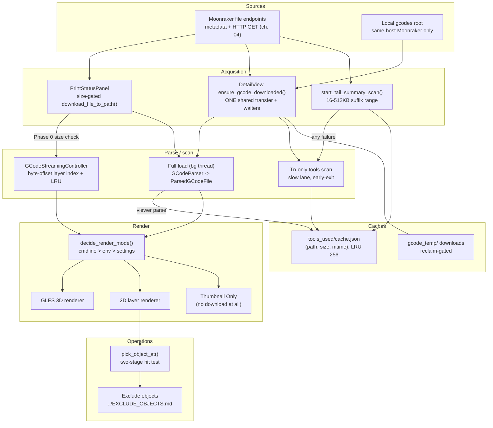
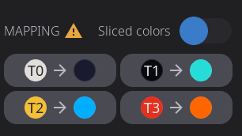

# 16 — G-code Pipeline

Everything the app shows about a print's geometry — the layer preview behind the print status panel, the per-file preview in the print-select detail view, the color chips that say which tools a file uses — comes from one pipeline: get the file onto this device, turn it into geometry (all at once, or layer by layer), cache the expensive answers, and draw them in one of three render modes. The pipeline also hosts the mid-print operations: tapping to select an object and long-pressing to exclude it are hit-tests against the same parsed geometry. This chapter is the map of that flow: the two parse paths and where each is chosen, the shared download and its local-read fast path, the footer read that answers "which tools?" without a download, the tools-used cache, the render-mode decision, and the picking algorithm the operations ride on.

Chapter 04 owns the transport these downloads ride on (`transfers()`, the `HttpExecutor` lanes); [`../EXCLUDE_OBJECTS.md`](../EXCLUDE_OBJECTS.md) owns the exclusion state machine, modal, and slicer setup; [`../GCODE_VIEWER_CONFIG.md`](../GCODE_VIEWER_CONFIG.md) owns the viewer's config knobs. This chapter stops at the edges of those.

## Key files

| File | Role |
|------|------|
| [`include/gcode_parser.h`](../../../include/gcode_parser.h) | The data model (`ToolpathSegment`, `Layer`, `GCodeObject`, `ParsedGCodeFile`) and the parser that fills it |
| [`src/rendering/gcode_parser.cpp`](../../../src/rendering/gcode_parser.cpp) | Full-file parse: motion, feature classification, object tagging, tool tracking |
| [`include/gcode_streaming_controller.h`](../../../include/gcode_streaming_controller.h) | On-demand layer loading: async index build, LRU segment cache, prefetch worker |
| [`src/rendering/gcode_layer_index.cpp`](../../../src/rendering/gcode_layer_index.cpp) | The byte-offset-per-layer index streaming seeks against |
| [`include/gcode_streaming_config.h`](../../../include/gcode_streaming_config.h) | `should_use_gcode_streaming()` — env > config > memory-based AUTO |
| [`include/ui_gcode_viewer.h`](../../../include/ui_gcode_viewer.h) | The viewer widget contract: render modes, load/parse lifecycle, pick API |
| [`src/ui/ui_gcode_viewer.cpp`](../../../src/ui/ui_gcode_viewer.cpp) | Phase 0 streaming decision, background parse, long-press/tap gesture handling |
| [`src/rendering/gcode_layer_renderer.cpp`](../../../src/rendering/gcode_layer_renderer.cpp) | 2D renderer: layer draw, selection brackets, `pick_object_at()` |
| [`include/gcode_render_mode_policy.h`](../../../include/gcode_render_mode_policy.h) | `decide_render_mode()` — pure resolution of `HELIX_GCODE_MODE` |
| [`include/ui_print_select_detail_view.h`](../../../include/ui_print_select_detail_view.h) | Detail-view acquisition contracts: shared download, tail read, scan/cache handoff |
| [`src/ui/ui_print_select_detail_view.cpp`](../../../src/ui/ui_print_select_detail_view.cpp) | `ensure_gcode_downloaded()`, local-read probe, footer fast path, cache seeding |
| [`include/gcode_footer_summary.h`](../../../include/gcode_footer_summary.h) | `parse_gcode_footer_summary()` + tail-window sizing (`16KB/64KB/512KB` bounds) |
| [`include/tools_used_cache.h`](../../../include/tools_used_cache.h) | Persistent per-file tools-used cache, LRU-bounded, JSON on disk |
| [`src/ui/ui_panel_print_status.cpp`](../../../src/ui/ui_panel_print_status.cpp) | Print-status acquisition: size gate, stream-to-disk, render-mode application |
| [`ui_xml/components/print_status_preview_card.xml`](../../../ui_xml/components/print_status_preview_card.xml) | The print-status preview card, one definition for both orientations: `btn_objects` (the skip-objects entry point, gated on `exclude_objects_available`), the view toggle, the metadata strip and the terminal-state overlays |
| [`ui_xml/components/preview_stack.xml`](../../../ui_xml/components/preview_stack.xml) | The thumbnail / 2D / 3D stack itself, shared by the print-status card and [`print_file_detail.xml`](../../../ui_xml/print_file_detail.xml); each host passes its own per-layer hide condition |

## How it works

### Two parse paths, chosen at load time

`ui_gcode_viewer_load_file_async()` decides once per file, in "Phase 0", before any UI appears ([`src/ui/ui_gcode_viewer.cpp:1504`](../../../src/ui/ui_gcode_viewer.cpp#L1504)): streaming when `should_use_gcode_streaming(file_size)` says so and the host hasn't disabled it. That predicate ([`include/gcode_streaming_config.h:71`](../../../include/gcode_streaming_config.h#L71)) resolves a three-step hierarchy — `HELIX_GCODE_STREAMING` env var, then `gcode_viewer.streaming_mode` from config, then AUTO, which compares file size against a threshold computed from available memory and a configured percentage (default 40%).

**Full load** parses the whole file into one `ParsedGCodeFile` on a background thread — `GCodeParser::parse_line()` per line with a cancellation poll woven into the loop (switching files must not block the LVGL loop for an entire parse), then `finalize()` ([`src/ui/ui_gcode_viewer.cpp:1832`](../../../src/ui/ui_gcode_viewer.cpp#L1832)). The result carries layers of `ToolpathSegment`s with interned object names, the per-object AABB map `gcode_->objects`, and `tools_used_indices`. When 3D is the active mode the budget-aware geometry build runs right there (`build_3d_geometry_in_budget()`); the 2D path skips it and builds on demand if the user switches. The result is marshaled back through `queue_update` behind a generation counter so a superseded load's callback is dropped.

**Streaming** builds a `GCodeLayerIndex` — one byte offset + length per layer — in the background (`open_file_async`), then seeks and parses individual layers on demand into an LRU cache sized adaptively from system memory (floor 1 MB), with a prefetch worker warming a radius of ~3 layers around the view ([`include/gcode_streaming_controller.h:171`](../../../include/gcode_streaming_controller.h#L171)). The trade: constant memory on huge files, but no object list — `set_streaming_controller()` clears `gcode_` ([`src/rendering/gcode_layer_renderer.cpp:136`](../../../src/rendering/gcode_layer_renderer.cpp#L136)), so there are no per-object AABBs for picking and no per-object thumbnails.

Who lands on which path: the print-status panel downloads to disk and calls `load_gcode_file()`, so Phase 0 decides per file and device memory; the print-select detail view *asks* to opt out of streaming (`streaming_disabled_`, [`src/ui/ui_gcode_viewer.cpp:393`](../../../src/ui/ui_gcode_viewer.cpp#L393)) so a 3D-preferred screen gets the full-load path — but the request is only honoured when the build actually has a 3D renderer to fall back on (`gcode_viewer_should_stream()`, [`include/gcode_streaming_config.h:119`](../../../include/gcode_streaming_config.h#L119)). On a 2D-only build the opt-out would otherwise force an unbounded whole-file parse with nothing to render into and no budget of its own: a 130 MB file on a K2 Plus grew the app to 387 MB RSS and was OOM-killed.

One consequence is easy to miss: on a streamed load there is **no `ParsedGCodeFile` at all**, so anything reaching for `ui_gcode_viewer_get_parsed_file()` comes back empty on exactly the large files streaming exists for. Callers wanting data the viewer recovered must use the mode-independent accessors, each of which reads the parsed file or the layer index depending on which holds data: `ui_gcode_viewer_get_tool_palette()` ([`include/ui_gcode_viewer.h:627`](../../../include/ui_gcode_viewer.h#L627)) for the tool color palette, and `ui_gcode_viewer_get_tools_used()` ([`include/ui_gcode_viewer.h:647`](../../../include/ui_gcode_viewer.h#L647)) for the used-tool set.

That second one is newer than the first for a reason worth remembering: the print-status panel's per-tool color path went straight to `tools_used_indices` on the parsed file, so on a true tool changer — a Snapmaker U1 has 961MB of RAM and `MemoryInfo::should_force_streaming()` forces streaming at or below 2GB — it was empty on **every** print. Streaming's used-tool set comes from `LayerIndexStats::tools_used` ([`include/gcode_layer_index.h:143`](../../../include/gcode_layer_index.h#L143)), accumulated in the index scan that already visits every line; each layer entry additionally carries `start_tool` ([`include/gcode_layer_index.h:66`](../../../include/gcode_layer_index.h#L66)), the tool active at its own byte offset, because the `Tn` that selects a layer's tool sits at the end of the *previous* layer's byte range and a per-layer parse would never see it.

### Two questions about tool colors, and which one the render asks

Coloring a preview looks like one question and is two:

1. **"What mapping SHOULD this print use?"** — match the slicer palette against what is loaded. Answered **before** the print, in `PrintSelectDetailView`, where it decides what to send to the printer.
2. **"What mapping IS in effect?"** — answered by the firmware, exactly, for a print already underway.

The live render asks (2). It used to answer it with (1)'s machinery, and that is what forced a pile of fallbacks: inference cannot resolve an N-tool print from lane state alone, so a single-tool special case (color it by the active head) grew alongside an N-tool one, and a tool-count branch decided between them. Two paths meant the N=1 case could be right for the wrong reason, which is exactly what made an A/B on hardware come back a null result.

There is now one rule, valid for any tool count:

> `color(tool N)` = the color of the lane that actually prints `N`.

`AmsState::routed_tool_colors()` resolves the applied routing and hands it to `FilamentMapper::routed_tool_colors()`. The routing comes from `AmsBackend::get_tool_mapping()` — a capability question, so the vendor knowledge stays in the backend: a Snapmaker U1 answers from `print_task_config.extruder_map_table`, AFC / Happy Hare / a plain tool changer answer from their own tool-to-slot map, and a backend with no separate routing falls through to `AmsSystemInfo::tool_to_slot_map`. Nothing above the backend names a firmware, and there is no tool count anywhere in the signature — which is what stops the special case growing back.

### Getting the file: two acquisition paths, one shared transfer each

The **print-status panel** path ([`src/ui/ui_panel_print_status.cpp:3494`](../../../src/ui/ui_panel_print_status.cpp#L3494)) checks the gates first — Thumbnail Only mode skips all downloading (`:3409`), as does `gcode_3d_enabled=false` (`:3418`) — then probes a persistent cache copy under `get_helix_cache_dir("gcode_temp")` hashed from the filename, and otherwise fetches metadata, applies the shared OOM gate `is_gcode_2d_streaming_safe(size)` (`:3494`), and streams the file to disk via `transfers().download_file_to_path()` (`:3469`).

The **detail view** has one canonical entry point, `ensure_gcode_downloaded()` ([`src/ui/ui_print_select_detail_view.cpp:619`](../../../src/ui/ui_print_select_detail_view.cpp#L619)), because two consumers need the file — the viewer preview and the tools scan — and they must not race each other into two transfers. Its order matters:

1. **In-place local read.** When Moonraker runs on this host (`is_moonraker_on_same_host()`, `:560`), the detail view resolves the `gcodes` root once via `server.files.roots` and reads Moonraker's own copy directly (`local_gcode_source()`, `:592`) — no transfer, no second copy on the same flash, guarded by a size match so a stale or partial local file falls back to HTTP. The path is deliberately never registered as a temp download: it is the user's print file, and `reclaim_download()` refuses to delete it.
2. **Join an in-flight transfer.** Checked *before* the disk probe — a partially written file must not be mistaken for a complete copy. Waiters are fanned out when the transfer resolves.
3. **Cached copy on disk**, with the same size staleness check; only then does the first caller start ONE transfer.

Every deletion of a downloaded copy goes through the single gate `is_reclaimable_download()` (`:626`) — only files we created under `gcode_temp` are reclaimable, so a mis-routed path can never delete a print file.

### The footer fast path: tools-used without a download

Before anything downloads, `start_tail_summary_scan()` ([`src/ui/ui_print_select_detail_view.cpp:1748`](../../../src/ui/ui_print_select_detail_view.cpp#L1748)) asks one suffix-range question: slicers write `filament used [g]` and the color palette *after the last move*, so the last few tens of KB answer "which tools does this file use, in what colors, at what weight?" with no whole-file download and no geometry parse. When Moonraker runs on this host the same window is read straight off its own copy (`read_file_tail()`, [`include/gcode_footer_summary.h:145`](../../../include/gcode_footer_summary.h#L145)) rather than asked for back over loopback. The window is `gcode_tail_window_bytes()` ([`include/gcode_footer_summary.h:127`](../../../include/gcode_footer_summary.h#L127)) — exactly `size - gcode_end_byte` when Moonraker's metadata reported the footer offset, clamped to `[16KB, 512KB]`, defaulting to 64KB when it didn't.

The parse itself, `parse_gcode_footer_summary()` ([`include/gcode_footer_summary.h:96`](../../../include/gcode_footer_summary.h#L96)), is a pure function run on the HTTP thread (no `this`): exact-key matching so `total filament used [g]` and `default_filament_colour` can't hijack the answer, and `usable()` requires at least one nonzero tool — an all-zero vector is slicer placeholders, not a print that extrudes nothing. What a failure falls through to depends on *what the read was for*, which `footer_read_need()` ([`include/gcode_footer_summary.h:191`](../../../include/gcode_footer_summary.h#L191)) decides up front. The footer answers three independent questions — tools, palette, grams — and `ToolsUsedCache` persists only the first, so a cache hit settles `tools` and leaves the other two exactly as unanswered as on a cold open. Only an outstanding **tools** question justifies falling through to the whole-file scan; a read issued for the palette or the grams gives up quietly instead, because reading a hundred-plus megabytes to recover a palette the render can live without is the cost streaming exists to avoid. The deferred apply also discards results that land after the selection moved to a different file.

### The tools-used cache: instant chips on re-open

`ToolsUsedCache` ([`include/tools_used_cache.h:20`](../../../include/tools_used_cache.h#L20)) persists the answer as JSON at `get_helix_cache_dir("tools_used")/cache.json`, keyed by `(path, size, mtime)` so a re-sliced file invalidates naturally, LRU-bounded to 256 entries. Three parties touch it:

- `show()` seeds from a cache hit ([`src/ui/ui_print_select_detail_view.cpp:463`](../../../src/ui/ui_print_select_detail_view.cpp#L463)) — the used-tool set is known synchronously and the headless *tools* scan is skipped, so a re-opened file can paint final chips in one frame instead of the skeleton latch. What a hit must **not** do is retire the footer read: the cache says nothing about colors or grams. Gating the whole read on it meant a re-open of a file whose Moonraker metadata carries no `filament_colors` — which is every OrcaSlicer file on a Creality K2 — never recovered a palette, and every tool rendered the neutral stand-in as though the slicer had chosen it (a grey dot pointing at the lane's real color).
- Which is why the chip latch `detail_mapping_ready` tracks **two** questions: `is_preflight_ready()` for the tool set, and `palette_settled_` for the colors. "Settled" deliberately does not mean "non-empty" — a file nothing can supply colors for still has to resolve, or the skeleton never clears.
- The scan-finish path writes through, but **only when authoritative** (`:1754`): a degraded finish (download failed) carries an empty set with no information, and persisting it would freeze "no tools" for the file — on 2D-only platforms no viewer parse ever repairs that.
- The viewer parse writes through when it produces a set (`:1311`).

The fallback full scan is itself cheap: a Tn-only line scan on the slow HTTP lane that never holds the whole file and **early-exits once every slicer-palette tool has been seen** ([`include/ui_print_select_detail_view.h:873`](../../../include/ui_print_select_detail_view.h#L873)) — once the palette is covered there is nothing left to learn.

### Render modes: Auto, 3D, 2D, Thumbnail Only

The settings surface offers four values ([`include/display_settings_manager.h:186`](../../../include/display_settings_manager.h#L186)): 0=Auto, 1=3D, 2=2D, 3=Thumbnail Only. The widget's enum is the three renderers ([`include/ui_gcode_viewer.h:35`](../../../include/ui_gcode_viewer.h#L35)) — Auto resolves at draw time to 3D when the build has the GLES renderer (`ENABLE_GLES_3D`), else 2D ([`src/ui/ui_gcode_viewer.cpp:396`](../../../src/ui/ui_gcode_viewer.cpp#L396)); Thumbnail Only is a panel-level setting that skips viewer usage entirely.

The precedence chain is **cmdline > env > settings**, applied in the panel's `on_activate` ([`src/ui/ui_panel_print_status.cpp:1097`](../../../src/ui/ui_panel_print_status.cpp#L1097)): `--render-2d`/`--render-3d` (stored in `RuntimeConfig::gcode_render_mode`) win; otherwise `HELIX_GCODE_MODE` — resolved at widget creation by the pure `decide_render_mode()` ([`include/gcode_render_mode_policy.h:44`](../../../include/gcode_render_mode_policy.h#L44)) — stands; otherwise the saved setting is applied. Two traps are load-bearing:

- The settings observer would otherwise fire once at startup with the persisted value and silently overwrite the cmdline pin ~16ms after it was applied; it now stands down when the cmdline pinned a mode ([`src/ui/ui_panel_print_status.cpp:379`](../../../src/ui/ui_panel_print_status.cpp#L379)).
- `decide_render_mode()` treats an unrecognized env value as **2D, not Auto** — a typo'd override lands on the renderer that works everywhere rather than silently behaving as unset. Only unset reaches Auto.

### Operations: picking, selection, exclusion

All object interaction hit-tests through `GCodeLayerRenderer::pick_object_at()` ([`src/rendering/gcode_layer_renderer.cpp:1568`](../../../src/rendering/gcode_layer_renderer.cpp#L1568)), a two-stage algorithm:

- **Stage 1 — projected footprints.** Each object's 3D bounding box (accumulated over its whole toolpath) is clamped to the drawn Z range — `render()` only draws up to `current_layer_`, and what is not visible must not be pickable — and its 8 corners projected to a screen-space rect, inflated by `PICK_THRESHOLD_PX` (15px, `:48` and `:1478`). Objects that haven't started printing are skipped, as are supports when supports are hidden (the fast path below never reaches the segment filter that would normally catch them). Zero candidates returns immediately; **a single candidate returns without touching a single segment** — the common case, since objects sit separated on the plate.
- **Stage 2 — segments, downward.** Only when footprints overlap: walk layers from `current_layer_` **downward**, first layer that produces a hit wins (`:1710`) — a tap over a stack picks what is visually on top of it. In streaming mode this walk is **cache-only**: `try_get_layer_segments()` (`:1724`) skips uncached layers rather than seeking and parsing, because a hit-test must never freeze the UI on a 2-core board.

The gestures on top of it ([`src/ui/ui_gcode_viewer.cpp`](../../../src/ui/ui_gcode_viewer.cpp)): a **press-and-hold of 1000ms** (`LONG_PRESS_THRESHOLD_MS`, `:825` — deliberately double the app-wide 500ms gesture timeout, because the consequence is canceling an object's print) picks the object under the initial press and fires the long-press callback into the exclusion flow; a **tap** (release with minimal movement, no pinch, long-press not already fired) toggles single-selection (`:1083`), which draws the corner-bracket wireframe via `render_selection_brackets()` ([`src/rendering/gcode_layer_renderer.cpp:1805`](../../../src/rendering/gcode_layer_renderer.cpp#L1805)). The **skip-objects button** (`btn_objects`, [`ui_xml/components/print_status_preview_card.xml:38`](../../../ui_xml/components/print_status_preview_card.xml#L38), visible when the `exclude_objects_available` subject is set) toggles the map + side-list panel (`on_objects_clicked`, [`src/ui/ui_panel_print_status.cpp:2055`](../../../src/ui/ui_panel_print_status.cpp#L2055)).

The full exclusion state machine — confirmation modal, 5s undo window, `EXCLUDE_OBJECT` send, multi-client sync — is [`../EXCLUDE_OBJECTS.md`](../EXCLUDE_OBJECTS.md)'s subject.

## Patterns & gotchas

- **Streaming and full-file are mutually exclusive by construction** — each setter nulls the other's pointer ([`gcode_layer_renderer.cpp:117`](../../../src/rendering/gcode_layer_renderer.cpp#L117) vs `:150`). Never hand a renderer both; the second call silently wins.
- **A streaming hit-test must never seek and parse.** `pick_object_at()` consults only cached layers; an uncached layer costs one unrecognized tap instead of a multi-second UI freeze.
- **The footer read may only ever be faster.** Every failure mode falls through to the full scan — keep it that way when extending the summary keys.
- **Cache writes must be authoritative.** Persisting a degraded result (empty set from a failed download) freezes a wrong answer; `finish_scan(authoritative=false)` skips the write for exactly this reason.
- **Deletes go through `is_reclaimable_download()`.** It is the single gate owning "is this a file we downloaded"; a stray `std::remove` on a wrong path is how print files die.
- **The local-read path is same-host only** — a remote printer's absolute root path names a filesystem we cannot see, and reading a local path that happens to match would read the wrong file.
- **Render-mode precedence has a race-shaped hole**: any new observer of the settings subject must respect the cmdline pin, or it will clobber `--render-2d`/`--render-3d` at startup.
- **Stage-1 skips need their own guards.** Checks that live in the segment filter (hidden supports) must be repeated in stage 1, because the single-candidate fast path returns before any segment is examined.

## Going deeper

- [`../EXCLUDE_OBJECTS.md`](../EXCLUDE_OBJECTS.md) — the exclusion feature end to end: Klipper integration, state machine, side list, per-object thumbnails, slicer setup. The chapter above only covers the hit-test it rides on.
- [`../GCODE_VIEWER_CONFIG.md`](../GCODE_VIEWER_CONFIG.md) — the viewer's configuration surface (and the state of the shading-model setting).
- [`04-moonraker.md`](04-moonraker.md) — the transport underneath every download here: `transfers()` sub-API, `HttpExecutor` fast/slow lanes, why suffix ranges and file streams never touch the WebSocket.
- [`../ENVIRONMENT_VARIABLES.md`](../ENVIRONMENT_VARIABLES.md) — `HELIX_GCODE_MODE` and `HELIX_GCODE_STREAMING`, the two env overrides this pipeline reads.
- [`02-subjects-dataflow.md`](02-subjects-dataflow.md) — how parsed results get marshaled from background threads back to widgets (`queue_update`, generation guards) as used by both parse paths.

## Guided code tour

Read in this order; about 30 minutes total.

1. [`include/gcode_parser.h:217`](../../../include/gcode_parser.h#L217) — `ToolpathSegment`, `Layer`, `GCodeObject`, then `ParsedGCodeFile` at `:244`: the interned object-name design (`object_name_table`) that picking compares with `int16_t`s.
2. [`src/ui/ui_gcode_viewer.cpp:1504`](../../../src/ui/ui_gcode_viewer.cpp#L1504) — Phase 0: the streaming decision in five lines, then the two paths diverging at [`src/ui/ui_gcode_viewer.cpp:1573`](../../../src/ui/ui_gcode_viewer.cpp#L1573) (streaming) and [`src/ui/ui_gcode_viewer.cpp:1723`](../../../src/ui/ui_gcode_viewer.cpp#L1723) (full-load).
3. [`include/gcode_streaming_config.h:11`](../../../include/gcode_streaming_config.h#L11) — the three-step config hierarchy; then `should_use_gcode_streaming()` at `:71`.
4. [`include/gcode_streaming_controller.h:169`](../../../include/gcode_streaming_controller.h#L169) — the controller: cache budget floor, prefetch radius, and `try_get_layer_segments()`'s shared_ptr contract at `:294`.
5. [`src/ui/ui_print_select_detail_view.cpp:619`](../../../src/ui/ui_print_select_detail_view.cpp#L619) — `ensure_gcode_downloaded()`: the local-read/join/disk/start order and why each precedes the next.
6. [`src/ui/ui_print_select_detail_view.cpp:574`](../../../src/ui/ui_print_select_detail_view.cpp#L574) — `local_gcode_source()`: the same-host probe and size staleness check; then `reclaim_download()` at `:627` for the delete gate.
7. [`include/gcode_footer_summary.h:23`](../../../include/gcode_footer_summary.h#L23) — the whole footer contract in one header: `GcodeFooterSummary`, the exact-key rules at `:62`, and the window bounds at `:88`.
8. [`src/ui/ui_print_select_detail_view.cpp:1748`](../../../src/ui/ui_print_select_detail_view.cpp#L1748) — `start_tail_summary_scan()`: the local-vs-HTTP tail read, pure parse off the main thread, stale-file guard, and the need-dependent fall-through.
9. [`include/tools_used_cache.h:20`](../../../include/tools_used_cache.h#L20) — the cache: keying, LRU bound, and the "empty set is legitimate" contract at `:24`. Then its three call sites in the detail view ([`src/ui/ui_print_select_detail_view.cpp:463`](../../../src/ui/ui_print_select_detail_view.cpp#L463), [`src/ui/ui_print_select_detail_view.cpp:1258`](../../../src/ui/ui_print_select_detail_view.cpp#L1258), [`src/ui/ui_print_select_detail_view.cpp:1647`](../../../src/ui/ui_print_select_detail_view.cpp#L1647)).
10. [`include/gcode_render_mode_policy.h:44`](../../../include/gcode_render_mode_policy.h#L44) — `decide_render_mode()`: case-sensitive matching and the unrecognized-is-2D asymmetry, in 60 lines.
11. [`src/ui/ui_panel_print_status.cpp:1097`](../../../src/ui/ui_panel_print_status.cpp#L1097) — the precedence chain applied; then the pinned-mode guard at `:346`.
12. [`src/rendering/gcode_layer_renderer.cpp:1568`](../../../src/rendering/gcode_layer_renderer.cpp#L1568) — `pick_object_at()` in full: stage-1 clamping and skips (`:1582-1700`), the single-candidate return (`:1679`), the downward walk (`:1711`), and the cache-only streaming branch (`:1725`).
13. [`src/ui/ui_gcode_viewer.cpp:865`](../../../src/ui/ui_gcode_viewer.cpp#L865) — the long-press constant and its comment; then the release callback's tap handling at `:1083`.
14. [`ui_xml/components/print_status_preview_card.xml:38`](../../../ui_xml/components/print_status_preview_card.xml#L38) — `btn_objects`: the `exclude_objects_available` binding and the `on_print_status_objects` callback — the whole skip-objects entry point in eight lines of XML.
