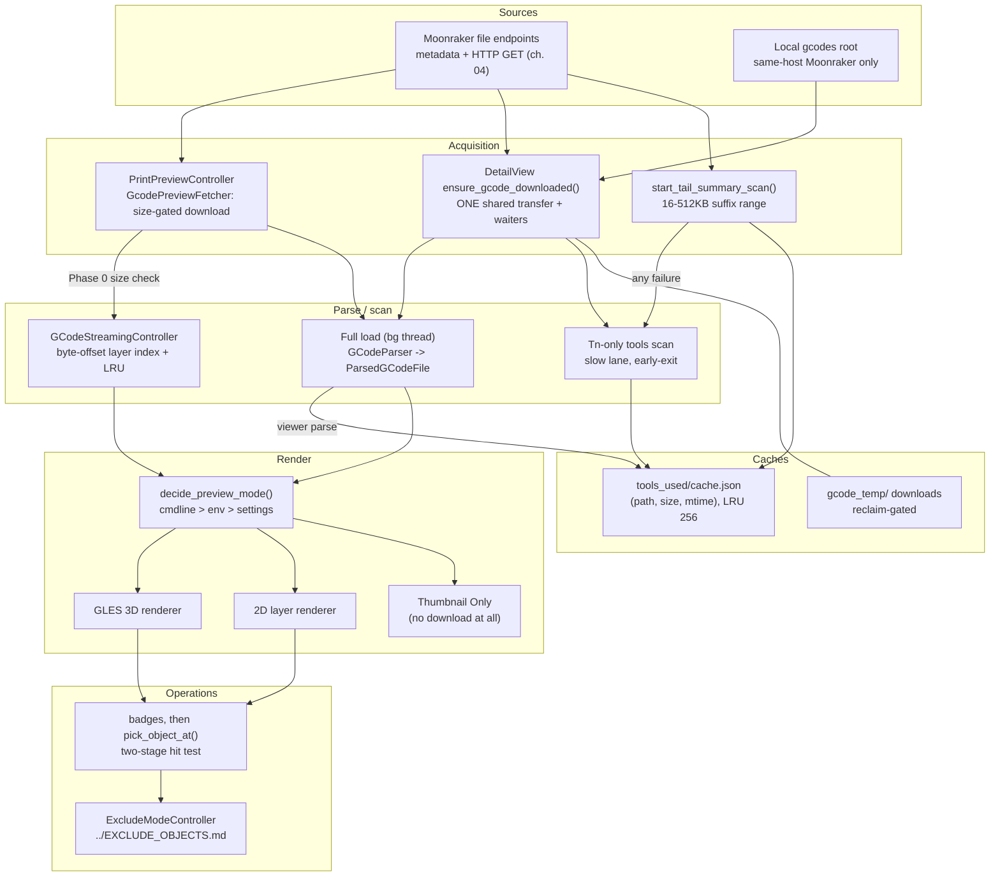
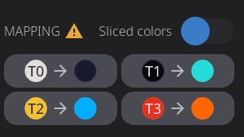

# 16 - G-code Pipeline

Everything the app shows about a print's geometry - the layer preview behind the print status panel, the per-file preview in the print-select detail view, the color chips that say which tools a file uses - comes from one pipeline: get the file onto this device, turn it into geometry (all at once, or layer by layer), cache the expensive answers, and draw them in one of three render modes. The pipeline also hosts the mid-print operations: tapping to select an object and long-pressing to exclude it are hit-tests against the same parsed geometry. This chapter is the map of that flow: the two parse paths and where each is chosen, the shared download and its local-read fast path, the thumbnail rule that stands in when no geometry is drawn, the footer read that answers "which tools?" without a download, the tools-used cache, the render-mode decision, and the picking algorithm the operations ride on.

Chapter 04 owns the transport these downloads ride on (`transfers()`, the `HttpExecutor` lanes); [`../EXCLUDE_OBJECTS.md`](../EXCLUDE_OBJECTS.md) owns the exclusion state machine, modal, and slicer setup; [`../GCODE_VIEWER_CONFIG.md`](../GCODE_VIEWER_CONFIG.md) owns the viewer's config knobs. This chapter stops at the edges of those.

```mermaid
flowchart TB
    subgraph SRC["Sources"]
        MR["Moonraker file endpoints<br/>metadata + HTTP GET (ch. 04)"]
        LOCAL["Local gcodes root<br/>same-host Moonraker only"]
    end

    subgraph ACQ["Acquisition"]
        PSD["PrintPreviewController<br/>GcodePreviewFetcher: size-gated download"]
        DVD["DetailView ensure_gcode_downloaded()<br/>ONE shared transfer + waiters"]
        TAIL["start_tail_summary_scan()<br/>16-512KB suffix range"]
    end

    subgraph PARSE["Parse / scan"]
        FULL["Full load (bg thread)<br/>GCodeParser -> ParsedGCodeFile"]
        STREAM["GCodeStreamingController<br/>byte-offset layer index + LRU"]
        TNSCAN["Tn-only tools scan<br/>slow lane, early-exit"]
    end

    subgraph CACHE["Caches"]
        TUC["tools_used/cache.json<br/>(path, size, mtime), LRU 256"]
        GTEMP["gcode_temp/ downloads<br/>reclaim-gated"]
    end

    subgraph RENDER["Render"]
        POLICY["decide_preview_mode()<br/>cmdline > env > settings"]
        R3D["GLES 3D renderer"]
        R2D["2D layer renderer"]
        THUMB["Thumbnail Only<br/>(no download at all)"]
    end

    subgraph OPS["Operations"]
        PICK["badges, then pick_object_at()<br/>two-stage hit test"]
        EXCL["ExcludeModeController<br/>../EXCLUDE_OBJECTS.md"]
    end

    MR --> PSD
    MR --> DVD
    MR --> TAIL
    LOCAL --> DVD
    PSD -->|"Phase 0 size check"| STREAM
    PSD --> FULL
    DVD --> FULL
    DVD --> TNSCAN
    TAIL -->|"any failure"| TNSCAN
    TAIL --> TUC
    TNSCAN --> TUC
    FULL -->|"viewer parse"| TUC
    DVD --- GTEMP
    FULL --> POLICY
    STREAM --> POLICY
    POLICY --> R3D
    POLICY --> R2D
    POLICY --> THUMB
    R2D --> PICK --> EXCL
    R3D --> PICK
```

## Key files

| File | Role |
|------|------|
| [`include/gcode_parser.h`](../../../include/gcode_parser.h) | The data model (`ToolpathSegment`, `Layer`, `GCodeObject`, `ParsedGCodeFile`) and the parser that fills it |
| [`src/rendering/gcode_parser.cpp`](../../../src/rendering/gcode_parser.cpp) | Full-file parse: motion, feature classification, object tagging, tool tracking |
| [`include/gcode_streaming_controller.h`](../../../include/gcode_streaming_controller.h) | On-demand layer loading: async index build, LRU segment cache, prefetch worker |
| [`src/rendering/gcode_layer_index.cpp`](../../../src/rendering/gcode_layer_index.cpp) | The byte-offset-per-layer index streaming seeks against |
| [`include/gcode_streaming_config.h`](../../../include/gcode_streaming_config.h) | `should_use_gcode_streaming()` - env > config > memory-based AUTO |
| [`include/ui_gcode_viewer.h`](../../../include/ui_gcode_viewer.h) | The viewer widget contract: render modes, load/parse lifecycle, pick API |
| [`src/ui/ui_gcode_viewer.cpp`](../../../src/ui/ui_gcode_viewer.cpp) | Widget create/delete, draw, size and watchdog, the `ui_gcode_viewer_*` API |
| [`src/ui/gcode_viewer_loader.cpp`](../../../src/ui/gcode_viewer_loader.cpp) | Phase 0 streaming decision, background parse, 3D geometry budget |
| [`src/ui/gcode_viewer_input.cpp`](../../../src/ui/gcode_viewer_input.cpp) | Long-press/tap gesture handling, object pick |
| [`src/ui/gcode_viewer_state.h`](../../../src/ui/gcode_viewer_state.h) | `GCodeViewerState`, `ViewOptions` |
| [`src/rendering/gcode_layer_renderer.cpp`](../../../src/rendering/gcode_layer_renderer.cpp) | 2D renderer: progressive solid cache, background ghost, outline pass, selection rim and brackets, `pick_object_at()` |
| [`include/gcode_projection.h`](../../../include/gcode_projection.h) | The 2D projection: view modes, `project()`, auto-fit and framing, depth shading |
| [`include/gcode_raster.h`](../../../include/gcode_raster.h) | Software line rasterizers (Bresenham, Wu) and the selection alpha tag, shared by the solid cache and the ghost worker |
| [`include/gcode_ghost_sampling.h`](../../../include/gcode_ghost_sampling.h) | `plan_ghost_sampling()`: how many layers a streamed ghost pass may visit |
| [`include/gcode_viewer_watchdog.h`](../../../include/gcode_viewer_watchdog.h) | Pure decision for the 2D stall watchdog |
| [`include/gcode_geometry_builder.h`](../../../include/gcode_geometry_builder.h) | 3D mesh build: `GeometryBuilder`, `RibbonGeometry`, quantized and packed vertex formats, object runs |
| [`src/rendering/geometry_budget_manager.cpp`](../../../src/rendering/geometry_budget_manager.cpp) | Memory budget and tier selection (tube sides, tolerance, 2D fallback) for the 3D build |
| [`include/gcode_color_palette.h`](../../../include/gcode_color_palette.h) | Slot-aligned per-tool palette the 2D renderer resolves colors through |
| [`src/rendering/gcode_gles_renderer.cpp`](../../../src/rendering/gcode_gles_renderer.cpp) | 3D renderer, compiled only where `ENABLE_GLES_3D=yes` (the `pi`/`x86` build families) |
| [`include/gcode_render_schedule.h`](../../../include/gcode_render_schedule.h) | Pure scheduling policy for the 3D renderer: slice quotas, the learned GPU rate, the moving plan, `decide_job()` |
| [`include/gcode_render_mode_policy.h`](../../../include/gcode_render_mode_policy.h) | `decide_render_mode()` (pure resolution of `HELIX_GCODE_MODE`) and `decide_preview_mode()` (the cmdline > env > settings ladder) |
| [`include/gcode_preview_setup.h`](../../../include/gcode_preview_setup.h) | `apply_preview_render_mode()` / `preview_viewer_enabled()`: the ladder applied, shared by both preview cards |
| [`include/ui_print_select_detail_view.h`](../../../include/ui_print_select_detail_view.h) | Detail-view acquisition contracts: shared download, tail read, scan/cache handoff |
| [`src/ui/ui_print_select_detail_view.cpp`](../../../src/ui/ui_print_select_detail_view.cpp) | `ensure_gcode_downloaded()`, local-read probe, footer fast path, cache seeding |
| [`include/gcode_footer_summary.h`](../../../include/gcode_footer_summary.h) | `parse_gcode_footer_summary()` + tail-window sizing (`16KB/64KB/512KB` bounds) |
| [`include/tools_used_cache.h`](../../../include/tools_used_cache.h) | Persistent per-file tools-used cache, LRU-bounded, JSON on disk |
| [`include/print_preview_controller.h`](../../../include/print_preview_controller.h) / [`src/ui/print_preview_controller.cpp`](../../../src/ui/print_preview_controller.cpp) | The print-status preview: which file to show, thumbnail vs viewer, deferred loads |
| [`include/gcode_preview_fetcher.h`](../../../include/gcode_preview_fetcher.h) / [`src/ui/gcode_preview_fetcher.cpp`](../../../src/ui/gcode_preview_fetcher.cpp) | Widget-free acquisition: gates, metadata, size gate, cached copy, one shared transfer |
| [`include/thumbnail_rules.h`](../../../include/thumbnail_rules.h) / [`include/thumbnail_cache.h`](../../../include/thumbnail_cache.h) | Thumbnail cache naming and freshness (`thumbnail_key()`, `is_fresh()`), format sniffing, and the cache itself |
| [`include/ui_exclude_mode_controller.h`](../../../include/ui_exclude_mode_controller.h) | `ExcludeModeController`: object list plus map or render badges, owned by print status and by print details |
| [`ui_xml/components/print_status_preview_card.xml`](../../../ui_xml/components/print_status_preview_card.xml) | The print-status preview card, one definition for both orientations: `btn_objects` (the skip-objects entry point, gated on `exclude_objects_available`), the view toggle, the metadata strip and the terminal-state overlays |
| [`ui_xml/components/preview_stack.xml`](../../../ui_xml/components/preview_stack.xml) | The thumbnail / 2D / 3D stack itself, shared by the print-status card and [`print_file_detail.xml`](../../../ui_xml/print_file_detail.xml); each host passes its own per-layer hide condition |

## How it works

### Two parse paths, chosen at load time

`ui_gcode_viewer_load_file_async()` decides once per file, in "Phase 0", before any UI appears ([`src/ui/gcode_viewer_loader.cpp#ui_gcode_viewer_load_file_async`](../../../src/ui/gcode_viewer_loader.cpp)): streaming when `should_use_gcode_streaming(file_size)` says so and the host hasn't disabled it. That predicate ([`include/gcode_streaming_config.h#helix`](../../../include/gcode_streaming_config.h)) resolves a three-step hierarchy: `HELIX_GCODE_STREAMING` env var, then `gcode_viewer.streaming_mode` from config (with `streaming.force_streaming` as another spelling of `on`), then AUTO, which compares file size against a threshold computed from available memory and a configured percentage (default 40%); a non-zero `streaming.threshold_mb` also streams anything above it. `GCodeFileModifier::apply()` asks the same predicate. Boards with 2 GB or less of total RAM take a smaller share instead: their percentage is capped at 15, because they usually co-host Klipper and Moonraker and their available memory keeps shrinking once a print runs (`src/rendering/gcode_streaming_config.cpp#kLowRamThresholdPercent`). On a Pi 3B (~600 MB available) the ceiling is a ~6 MB file; a Benchy full-parses, so the print-status preview can be the 3D one and follow the print, while slice-farm-sized files still stream.

**Full load** parses the whole file into one `ParsedGCodeFile` on a background thread - `GCodeParser::parse_line()` per line with a cancellation poll woven into the loop (switching files must not block the LVGL loop for an entire parse), then `finalize()` ([`src/ui/gcode_viewer_loader.cpp#ui_gcode_viewer_load_file_async`](../../../src/ui/gcode_viewer_loader.cpp)). The result carries layers of `ToolpathSegment`s with interned object names, the per-object AABB map `gcode_->objects`, and `tools_used_indices`. When 3D is the active mode the budget-aware geometry build runs right there (`build_3d_geometry_in_budget()`); the 2D path skips it and builds on demand if the user switches. The result is marshaled back through `queue_update` behind a generation counter so a superseded load's callback is dropped.

**Streaming** builds a `GCodeLayerIndex` - one byte offset + length per layer - in the background (`open_file_async`), then seeks and parses individual layers on demand into an LRU cache sized adaptively from system memory (floor 1 MB), with a prefetch worker warming a radius of ~3 layers around the view ([`include/gcode_streaming_controller.h#"/// Default prefetch radius (layers around current view to preload)"`](../../../include/gcode_streaming_controller.h)). The trade: constant memory on huge files, but no object list - `set_streaming_controller()` clears `gcode_` ([`src/rendering/gcode_layer_renderer.cpp#set_streaming_controller`](../../../src/rendering/gcode_layer_renderer.cpp)), so there are no per-object AABBs for picking and no per-object thumbnails.

Who lands on which path: the print-status panel's `PrintPreviewController` downloads to disk and loads the copy (`src/ui/print_preview_controller.cpp#load_file`), so Phase 0 decides per file and device memory; the print-select detail view *asks* to opt out of streaming (`streaming_disabled_`, [`src/ui/gcode_viewer_state.h#"bool streaming_disabled_{false};"`](../../../src/ui/gcode_viewer_state.h)) so a 3D-preferred screen gets the full-load path - but the request is only honoured when the build actually has a 3D renderer to fall back on (`gcode_viewer_should_stream()`, [`include/gcode_streaming_config.h#gcode_viewer_should_stream`](../../../include/gcode_streaming_config.h)). On a 2D-only build the opt-out would otherwise force an unbounded whole-file parse with nothing to render into and no budget of its own; a 130 MB file takes a K2 Plus to about 387 MB RSS, which the OOM killer ends.

One consequence is easy to miss: on a streamed load there is **no `ParsedGCodeFile` at all**, so anything reaching for `ui_gcode_viewer_get_parsed_file()` comes back empty on exactly the large files streaming exists for. Callers wanting data the viewer recovered must use the mode-independent accessors, each of which reads the parsed file or the layer index depending on which holds data: `ui_gcode_viewer_get_tool_palette()` ([`src/ui/ui_gcode_viewer.cpp#ui_gcode_viewer_get_tool_palette`](../../../include/ui_gcode_viewer.h)) for the tool color palette, and `ui_gcode_viewer_get_tools_used()` ([`include/ui_gcode_viewer.h#ui_gcode_viewer_get_tools_used`](../../../include/ui_gcode_viewer.h)) for the used-tool set.

The used-tool set matters most on a true tool changer: a Snapmaker U1 has 961MB of RAM, low enough that every large file streams, so reading `tools_used_indices` off the parsed file there comes back empty on **every** large print. Streaming's used-tool set comes from `LayerIndexStats::tools_used` ([`include/gcode_layer_index.h#tools_used`](../../../include/gcode_layer_index.h)), accumulated in the index scan that already visits every line; each layer entry additionally carries `start_tool` ([`include/gcode_layer_index.h#StreamingLayerEntry`](../../../include/gcode_layer_index.h)), the tool active at its own byte offset, because the `Tn` that selects a layer's tool sits at the end of the *previous* layer's byte range and a per-layer parse would never see it.

### Two questions about tool colors, and which one the render asks

Coloring a preview looks like one question and is two:

1. **"What mapping SHOULD this print use?"** - match the slicer palette against what is loaded. Answered **before** the print, in `PrintSelectDetailView`, where it decides what to send to the printer.
2. **"What mapping IS in effect?"** - answered by the firmware, exactly, for a print already underway.

The live render asks (2), and never answers it with (1)'s machinery: inference cannot resolve an N-tool print from lane state alone, so it would need a single-tool special case (color it by the active head) beside an N-tool one, and the N=1 case could then be right for the wrong reason. One rule covers any tool count:

> `color(tool N)` = the color of the lane that actually prints `N`.

`AmsState::routed_tool_colors()` resolves the applied routing and hands it to `FilamentMapper::routed_tool_colors()`. The routing comes from `AmsBackend::get_tool_mapping()` - a capability question, so the vendor knowledge stays in the backend: a Snapmaker U1 answers from `print_task_config.extruder_map_table`, AFC / Happy Hare / a plain tool changer answer from their own tool-to-slot map, and a backend with no separate routing falls through to `AmsSystemInfo::tool_to_slot_map`. Nothing above the backend names a firmware, and there is no tool count anywhere in the signature - which is what stops the special case growing back.

### Getting the file: two acquisition paths, one shared transfer each

Both paths run on `GcodePreviewFetcher` ([`include/gcode_preview_fetcher.h`](../../../include/gcode_preview_fetcher.h)), which touches no widget. The **print-status panel** calls `fetch()` through its `PrintPreviewController` (`src/ui/print_preview_controller.cpp#load_for_viewing`). `fetch()` checks the gates first: Thumbnail Only mode skips all downloading, as does `gcode_3d_enabled=false` (`src/ui/gcode_preview_fetcher.cpp#fetch`). It then fetches metadata, applies the shared OOM gate `is_gcode_2d_streaming_safe(size)` (`src/ui/gcode_preview_fetcher.cpp#stream_if_safe`), and hands the file to `ensure_local()`. A `.3mf` is a zip the viewer cannot read, so for one the fetcher looks for the plate G-code a QIDI firmware extracts into the `.temp` root and, finding none, leaves the thumbnail up (`src/ui/gcode_preview_fetcher.cpp#list_qidi_shadow`). That probes a persistent cache copy under `get_helix_cache_dir("gcode_temp")`, named from the connected printer and the file key (`cache_file_name()`), and otherwise streams the file to disk via `transfers().download_file_to_path()`. A fetch supersedes the one before it, and `cancel()` drops every fetch still waiting; a transfer already running is never started twice, whoever asks.

The **detail view** has one canonical entry point, `ensure_gcode_downloaded()` ([`src/ui/ui_print_select_detail_view.cpp#ensure_gcode_downloaded`](../../../src/ui/ui_print_select_detail_view.cpp)), because two consumers need the file - the viewer preview and the tools scan - and they must not race each other into two transfers. Its order matters:

1. **In-place local read.** A USB stick file (`PrintFileData::local_path`, passed to `show()`) is read from the stick, and a stick file that cannot be read fails without trying HTTP, since Moonraker has no copy of it. Otherwise, when Moonraker runs on this host (`is_moonraker_on_same_host()`, `src/system/host_identity.cpp#is_moonraker_on_same_host`), the detail view resolves the `gcodes` root once via `server.files.roots` and reads Moonraker's own copy directly (`local_gcode_source()`, `src/ui/ui_print_select_detail_view.cpp#local_gcode_source`): no transfer, no second copy on the same flash, guarded by a size match so a stale or partial local file falls back to HTTP. The path is deliberately never registered as a temp download: it is the user's print file, and `reclaim_download()` refuses to delete it.
2. **Join an in-flight transfer.** `ensure_local()` checks this *before* the disk probe - a partially written file must not be mistaken for a complete copy. Waiters are fanned out when the transfer resolves.
3. **Cached copy on disk**, with the same size staleness check; only then does the first caller start ONE transfer.

Steps 2 and 3 are the same `GcodePreviewFetcher::ensure_local()` the print-status panel uses.

Every deletion of a downloaded copy goes through the single gate `is_reclaimable_download()` (`include/gcode_temp_reclaim.h#is_reclaimable_download`): only files we created under `gcode_temp` are reclaimable, so a mis-routed path can never delete a print file.

### Thumbnails: one selection rule, one cache key

When no geometry is drawn (Thumbnail Only, a file still downloading, a streamed `.3mf`, every 2D-less surface such as the print-select cards and history), the slicer's embedded thumbnail is the preview. Two rules keep every consumer agreeing on which image that is:

- **Which thumbnail.** `select_and_resolve_thumbnail()` (`include/moonraker_types.h#select_and_resolve_thumbnail`) picks the smallest of a file's thumbnails that covers the consumer's box (the largest for an unmeasured box) and resolves its path against the G-code file's own directory, since Moonraker reports thumbnail paths relative to it. The print-select cards, the active print on desktop and ESP32, the history detail and the home print card all ask it.
- **Where it is cached.** [`include/thumbnail_rules.h`](../../../include/thumbnail_rules.h) owns the cache naming: `thumbnail_key(source, id, target)` names the full PNG (`{hash}.png`) or a pre-scaled LVGL bin (`{hash}_{w}x{h}_ARGB8888.bin`), the hash covers the source kind and the connected printer so a same-named file on another printer is a different entry, and `is_fresh()` is the one staleness test against the source's modified time. Writers sniff the bytes (`sniff_image_format()`), and `ensure_png()` re-encodes a JPEG, because LVGL picks its decoder by extension and a JPEG saved as `.png` renders blank.

`ThumbnailCache` (`include/thumbnail_cache.h#"class ThumbnailCache {"`) is the desktop disk cache under `helix_thumbs`; `save_prescaled()` writes the `.bin` variant, which the USB file cards draw without a decode (`src/ui/ui_print_select_usb_source.cpp`).

### The footer fast path: tools-used without a download

Before anything downloads, `start_tail_summary_scan()` ([`src/ui/ui_print_select_detail_view.cpp#start_tail_summary_scan`](../../../src/ui/ui_print_select_detail_view.cpp)) asks one suffix-range question: slicers write `filament used [g]` and the color palette *after the last move*, so the last few tens of KB answer "which tools does this file use, in what colors, at what weight?" with no whole-file download and no geometry parse. When Moonraker runs on this host the same window is read straight off its own copy (`read_file_tail()`, [`include/gcode_footer_summary.h#helix::gcode`](../../../include/gcode_footer_summary.h)) rather than asked for back over loopback. The window is `gcode_tail_window_bytes()` ([`include/gcode_footer_summary.h#helix::gcode`](../../../include/gcode_footer_summary.h)) - exactly `size - gcode_end_byte` when Moonraker's metadata reported the footer offset, clamped to `[16KB, 512KB]`, defaulting to 64KB when it didn't.

The parse itself, `parse_gcode_footer_summary()` ([`include/gcode_footer_summary.h#helix::gcode`](../../../include/gcode_footer_summary.h)), is a pure function run on the HTTP thread (no `this`): exact-key matching so `total filament used [g]` and `default_filament_colour` can't hijack the answer, and `usable()` requires at least one nonzero tool - an all-zero vector is slicer placeholders, not a print that extrudes nothing. What a failure falls through to depends on *what the read was for*, which `footer_read_need()` ([`include/gcode_footer_summary.h#footer_read_need`](../../../include/gcode_footer_summary.h)) decides up front. The footer answers three independent questions - tools, palette, grams - and `ToolsUsedCache` persists only the first, so a cache hit settles `tools` and leaves the other two exactly as unanswered as on a cold open. Only an outstanding **tools** question justifies falling through to the whole-file scan; a read issued for the palette or the grams gives up quietly instead, because reading a hundred-plus megabytes to recover a palette the render can live without is the cost streaming exists to avoid. The deferred apply also discards results that land after the selection moved to a different file.

### The tools-used cache: instant chips on re-open

`ToolsUsedCache` ([`include/tools_used_cache.h#ToolsUsedCache`](../../../include/tools_used_cache.h)) persists the answer as JSON at `get_helix_cache_dir("tools_used")/cache.json`, keyed by `(path, size, mtime)` so a re-sliced file invalidates naturally, LRU-bounded to 256 entries. Three parties touch it:

- `show()` seeds from a cache hit ([`src/ui/ui_print_select_detail_view.cpp#show`](../../../src/ui/ui_print_select_detail_view.cpp)) - the used-tool set is known synchronously and the headless *tools* scan is skipped, so a re-opened file can paint final chips in one frame instead of the skeleton latch. What a hit must **not** do is retire the footer read: the cache says nothing about colors or grams. A file whose Moonraker metadata carries no `filament_colors` (every OrcaSlicer file on a Creality K2) gets its palette only from the footer, so skipping the read on a hit would render every tool in the neutral stand-in as though the slicer had chosen it.
- Which is why the chip latch `detail_mapping_ready` tracks **two** questions: `is_preflight_ready()` for the tool set, and `palette_settled_` for the colors. "Settled" deliberately does not mean "non-empty" - a file nothing can supply colors for still has to resolve, or the skeleton never clears.
- The scan-finish path writes through, but **only when authoritative** (`src/ui/ui_print_select_detail_view.cpp#apply_scan_result/"if (authoritative) {"`): a degraded finish (download failed) carries an empty set with no information, and persisting it would freeze "no tools" for the file - on 2D-only platforms no viewer parse ever repairs that.
- The viewer parse writes through when it produces a set (`src/ui/ui_print_select_detail_view.cpp#try_extract_gcode_colors/"if (set_is_authoritative) {"`).

The fallback full scan is itself cheap: a Tn-only line scan on the slow HTTP lane that never holds the whole file and **early-exits once every slicer-palette tool has been seen** ([`include/ui_print_select_detail_view.h#PrintSelectDetailView`](../../../include/ui_print_select_detail_view.h)) - once the palette is covered there is nothing left to learn.

### Render modes: Auto, 3D, 2D, Thumbnail Only

The settings surface offers four values ([`include/display_settings_manager.h#DisplaySettingsManager`](../../../include/display_settings_manager.h)): 0=Auto, 1=3D, 2=2D, 3=Thumbnail Only. The widget's enum is the three renderers ([`include/ui_gcode_viewer.h#GcodeViewerRenderMode`](../../../include/ui_gcode_viewer.h)): Auto resolves at draw time to 3D when the build has the GLES renderer (`ENABLE_GLES_3D`), else 2D ([`src/ui/gcode_viewer_state.h#is_using_2d_mode`](../../../src/ui/gcode_viewer_state.h)). Thumbnail Only is a preview-level answer that skips the viewer entirely: no download, no layer index, no render pass.

The precedence chain is **cmdline > env > settings**, decided by the pure `decide_preview_mode()` ([`include/gcode_render_mode_policy.h#decide_preview_mode`](../../../include/gcode_render_mode_policy.h)) and applied by `apply_preview_render_mode()` ([`src/ui/gcode_preview_setup.cpp#apply_preview_render_mode`](../../../src/ui/gcode_preview_setup.cpp)), which both the print-status panel and the print-select detail view call when they set up their viewer; `preview_viewer_enabled()` asks the same ladder without a widget. `--render-2d`/`--render-3d` (stored in `RuntimeConfig::gcode_render_mode`) win; otherwise `HELIX_GCODE_MODE`, resolved at widget creation by the pure `decide_render_mode()` ([`include/gcode_render_mode_policy.h#decide_render_mode`](../../../include/gcode_render_mode_policy.h)), stands; otherwise the saved setting is applied. Two traps are load-bearing:

- The print-status settings observer would otherwise fire once at startup with the persisted value and silently overwrite a pin ~16ms after it was applied, so it asks `decide_preview_mode()` and stands down when the command line or `HELIX_GCODE_MODE` wins (`src/ui/ui_panel_print_status.cpp#"pinned above settings"`). `on_activate()` re-applies the same ladder through `apply_preview_render_mode()`.
- `decide_render_mode()` treats an unrecognized env value as **2D, not Auto** - a typo'd override lands on the renderer that works everywhere rather than silently behaving as unset. Only unset reaches Auto.

A non-GLES build (`ad5m`, `ad5x`, `cc1`, `k1-dynamic`, `k2`, `snapmaker-u1`, the `-fbdev` targets) holds no 3D renderer at all: `is_using_2d_mode()` answers 2D unconditionally there, so `--render-3d` or a persisted `gcode_render_mode: 1` carried over from a GLES build still lands on the 2D isometric view. For the fleet without GLES, the 2D view is the G-code view.

### How the viewer widget owns its renderers

`gcode_viewer` is one LVGL object whose user data is a `GCodeViewerState` (`src/ui/gcode_viewer_state.h#"class GCodeViewerState {"`). That state owns everything a preview needs: the `ParsedGCodeFile` (full load) or the `GCodeStreamingController` (streaming), the `GCodeCamera` that only the 3D path reads, the GLES renderer (constructed with the state on `ENABLE_3D_RENDERER` builds), and the 2D `GCodeLayerRenderer` (constructed lazily). The destructor resets the 2D renderer before the streaming controller (`src/ui/gcode_viewer_state.h#"~GCodeViewerState()"`): the renderer holds a raw pointer to the controller, and destroying it joins the ghost worker that may still be reading through that pointer.

Which renderer draws is decided per frame. `gcode_viewer_draw_cb` (`src/ui/ui_gcode_viewer.cpp#gcode_viewer_draw_cb`) dispatches on `is_using_2d_mode()` (`src/ui/gcode_viewer_state.h#is_using_2d_mode`), which on a GLES build answers 2D when any of four holds: a streaming controller is open (the 3D renderer needs a `ParsedGCodeFile`), the mode is `Layer2D`, `budget_forced_2d_` is set for this file, or `/display/gpu_3d_blocked` was left set by an earlier GPU driver crash.

Every non-streaming 2D renderer is made by `create_2d_renderer_for_file()` (`src/ui/ui_gcode_viewer.cpp#create_2d_renderer_for_file`): data source, then the color chain `apply_2d_renderer_colors()` (per-tool AMS overrides, else the file's own color), then `apply_view_options()` (`src/ui/ui_gcode_viewer.cpp#apply_view_options`), then `seed_2d_renderer_view()` (`src/ui/ui_gcode_viewer.cpp#seed_2d_renderer_view`: canvas size, framing, the outline and antialiasing tier, and `auto_fit()` last because it consumes the other three). Its callers are the first 2D draw, a switch to 2D through `ui_gcode_viewer_set_render_mode()`, the offscreen pump, and the 3D fallbacks below. The streaming path makes its own renderer when the index opens (`src/ui/gcode_viewer_loader.cpp#ui_gcode_viewer_load_file_async/"set_streaming_controller("`), because its colors come from `LayerIndexStats` rather than a parsed file, and ends in the same `seed_2d_renderer_view()`. A creation site that skips the seed runs the renderer's own defaults, outline and antialiasing both on, which is the cost the constrained-device tier exists to avoid.

What the viewer was told to show lives in `ViewOptions` (`src/ui/gcode_viewer_state.h#ViewOptions`): the highlighted and excluded object sets and the per-tool AMS colors. The setters write it and call `apply_view_options()`, which gives each renderer only what it has not yet been given, tracked per renderer in `applied_2d` and `applied_3d`. A renderer created later (a load, a mode switch) starts from the same options, and a repeated value never reaches the 3D renderer, where a changed color list re-uploads the VBOs.

A GLES build falls back to 2D in three places. Each sets `budget_forced_2d_`, which the next load clears, so the fallback lasts for one file:

- **The budget refuses the build at load.** `apply_budget_forced_2d()` (`src/ui/ui_gcode_viewer.cpp#apply_budget_forced_2d`) re-fits an existing 2D renderer or creates one.
- **GL fails mid-draw.** When the GLES renderer reports `render_failed()` (GL never initialised, or a draw batch returned a fatal error), the draw callback creates the 2D renderer on the spot and queues a repaint, since it cannot invalidate from inside a draw (`src/ui/ui_gcode_viewer.cpp#gcode_viewer_draw_cb/"render_failed()"`).
- **A live switch to 3D on a file loaded in 2D, refused.** The full load skips the 3D build when 2D is active, so `ui_gcode_viewer_set_render_mode()` (`src/ui/ui_gcode_viewer.cpp#"void ui_gcode_viewer_set_render_mode(lv_obj_t* obj, GcodeViewerRenderMode mode) {"`) starts `start_on_demand_3d_build()` (`src/ui/gcode_viewer_loader.cpp#start_on_demand_3d_build`) on the viewer's build thread, the same `start_build()` thread a full load parses on, and the result comes back through the UpdateQueue behind the load generation. A refusal goes through `apply_budget_forced_2d()`; the 3D mode the user picked stays set. Until the result lands the 3D view has no mesh to draw. A full load still running when the mode changes is left alone; if its parse had already passed the build step, its completion starts the on-demand build instead. Freeing the parsed file (a new load, `ui_gcode_viewer_clear()`) joins the build thread first, since the on-demand build reads that file in place, and a new load also releases the previous file's mesh so it cannot stand in for the new one.

### The 2D layer renderer

`GCodeLayerRenderer` is the preview on every non-GLES build and the fallback everywhere else. It draws with a software rasterizer into its own ARGB8888 buffers rather than through the LVGL draw API: the AD5M's draw pipeline cannot keep up with a sliced model's segment count, and the ghost pass runs on a background thread where LVGL calls are off limits (`include/gcode_raster.h`).

**Projection and framing.** The projection has three view modes (`include/gcode_projection.h#ViewMode`); the renderer always draws in `FRONT`, and only a test seam switches it to `TOP_DOWN` so the pick tests can name a click in plain XY millimetres. `FRONT` is an orthographic corner view, the same -45° azimuth and 45° elevation as OrcaSlicer's thumbnail camera and as `GCodeCamera::reset()` (`src/rendering/gcode_camera.cpp#reset`). `project()` (`src/rendering/gcode_projection.cpp#project`) rotates the model 90° about Z, then 45° horizontally, then tilts by the elevation, so a point's Z becomes part of its screen row. That makes the layers stack up the canvas, and it is why the solid cache below can be painted in layer order with no depth buffer: a later layer sits higher and further forward. `auto_fit()` (`src/rendering/gcode_layer_renderer.cpp#auto_fit`) frames the model's bounding box, taken from `global_bounding_box` on a full load or from the index scan's XY/Z bounds when streaming, with a 200x200 plate as the fallback for a file with no extruding move. The fit honours `bottom_occlusion` (the translucent metadata strip) and the `FitFraming` mode (`include/gcode_projection.h#FitFraming`): `STANDARD`, or `THUMBNAIL_PARITY`, which places the render where the slicer thumbnail it replaces was sitting.

**What a stroke looks like.** Stroke width is the file's extrusion width (else the nozzle diameter) times the fit scale, clamped to 1-8 px; a streamed file carries no width metadata and uses 0.4 mm (`src/rendering/gcode_layer_renderer.cpp#get_extrusion_pixel_width`). Each segment's color comes from the tool palette or the single extrusion color, then gets depth shading: `compute_depth_brightness()` darkens low and rear segments, and `apply_shading()` (`include/gcode_projection.h#apply_shading`) multiplies by that factor and adds a lift proportional to each channel's headroom, so a black filament still shows form. With the outline pass on, a cheap normal term adds ±12% from the segment's screen-space direction against an upper-left light. Strokes are Bresenham, or Wu antialiased when that flag is on (`include/gcode_raster.h#Aa`).

**The solid cache.** Printed layers accumulate in `cache_buf_`, a canvas-sized `lv_draw_buf_t` that is never a canvas widget, which keeps toasts and overlays on `lv_layer_top()` out of its clip area. `render()` (`src/rendering/gcode_layer_renderer.cpp#render`) targets `print_progress_layer_` during a print and the last layer in preview, and draws only the layers between `cached_up_to_layer_` and the target, then blits the buffer. Only extrusions go into it; travels never do. Moving the target backwards (a scrub, or a reprint starting at layer 1) clears the cache and rebuilds from layer 0. The first two frames after a data source is set are warm-up: they blit the ghost and draw nothing else, so panel layout settles first.

**Progressive build.** A big jump is spread over frames. Each `render()` draws at most `layers_per_frame_` layers, and `render_layers_to_cache()` (`src/rendering/gcode_layer_renderer.cpp#render_layers_to_cache`) also stops a batch once 8 ms of wall time are spent (`include/gcode_layer_renderer.h#SOLID_BATCH_BUDGET_MS`), always drawing at least one layer. That second cap exists for streaming, where a cache miss seeks and parses the layer on the calling thread. A layer the controller cannot deliver stops the batch rather than being skipped, so the next frame retries it and the cache never holds a permanent gap. While `needs_more_frames()` is true the draw callback queues another invalidate; it cannot invalidate synchronously from inside the draw. `layers_per_frame_` adapts from the last frame's render time against `adaptive_layer_target_ms` (`src/rendering/gcode_layer_renderer.cpp#adapt_layers_per_frame`): under target it moves halfway toward a value up to 2x larger (1.3x on a constrained device), so one frame grows it by at most 1.5x (1.15x), over twice the target it shrinks proportionally, slightly over it drops to 75%. It starts at 15 (5 on a constrained device) and is clamped to 1-100 (1-15 constrained). A non-zero `layers_per_frame` in config fixes it instead.

**The ghost.** The whole model, faded, sits under the solid cache in a second buffer, `ghost_buf_`, blitted at 30% opacity (`src/rendering/gcode_layer_renderer.cpp#blit_ghost_cache`). It is built once per load on a background `std::thread` into a plain heap buffer, then copied into `ghost_buf_` on the main thread (`src/rendering/gcode_layer_renderer.cpp#copy_raw_to_ghost_buf`), after which the scratch buffer is freed. The worker reads nothing from the renderer except a `GhostSnapshot` (`include/gcode_layer_renderer.h#GhostSnapshot`) captured on the main thread before the spawn, plus three atomics and its own raw buffer. Swapping the data source or the tool palette joins the worker first. Its look is fixed in `src/rendering/gcode_layer_renderer.cpp`: the base color washed 15% toward white, walls, skins, solid infill and support at full washed brightness, sparse infill at 12% so the shell reads as see-through (`src/rendering/gcode_layer_renderer.cpp#is_ghost_solid_surface`), excluded objects grey and hatched as in the solid cache. The Dimmed/Stipple ghost mode exists only on the GLES renderer. A full load visits every layer, since each is a pointer into resident memory. A streamed file would re-parse the whole file from disk, so `plan_ghost_sampling()` (`include/gcode_ghost_sampling.h#plan_ghost_sampling`) bounds the walk to about the ghost buffer's height in layers (64 to 512, evenly strided over the whole model); the worker loads through `load_layer_segments_no_prefetch()` and sleeps 2 ms between layers to leave the UI a core. The worker publishes how many of its planned layers it has drawn, and `get_ghost_build_progress()` (`src/rendering/gcode_layer_renderer.cpp#get_ghost_build_progress`) divides that by the plan's layer count (the sampled count when streaming); that fraction is the "Building preview: N%" label.

**The outline pass and antialiasing.** What the code calls SSAO is a silhouette outline: once the solid cache is complete, `apply_ssao()` (`src/rendering/gcode_layer_renderer.cpp#apply_ssao`) darkens every filled pixel that has an empty 4-neighbour to 30% of its color, in place, recording each change in an undo log. The darkening is a multiply, so the log is restored before any new geometry lands and before the pass re-runs; running it over its own output would compound. Antialiasing is a separate flag because it is the expensive half. Both are set per device tier at viewer construction, and [`../GCODE_VIEWER_CONFIG.md`](../GCODE_VIEWER_CONFIG.md) has the tier table, the `HELIX_SSAO` override and the measured costs.

**Selection in pixels.** The 2D renderer does not draw a highlight color. A highlighted object's segments draw in their own color with alpha `kSelectedAlpha` (254 instead of 255, `include/gcode_raster.h#kSelectedAlpha`) and are never antialiased, because antialiasing writes coverage into alpha and would strip the tag from exactly the edge pixels. Once the cache is complete, `stroke_selection_rim()` derives the white rim from the boundary of the tagged region, and the outline pass skips tagged pixels so the rim stays white. The rim is stamped into the cache, so a cache that has to grow while a rim is stamped is rebuilt from scratch rather than leaving the old rim inside the model. The ghost worker applies the same tag and rim. Excluded objects use the same trick with a second tag: their segments keep their shading but drain to grey (`selection::excluded_grey()`, `include/gcode_selection_style.h`) and carry `kExcludedAlpha` (253, `include/gcode_raster.h#kExcludedAlpha`), and once the cache is complete `stroke_exclusion_hatch()` stripes every tagged pixel red at 45 degrees. The 3D renderer draws the same grey and hatch from its per-object run table. `render_selection_brackets()` draws the corner brackets over everything each frame.

**Reveal.** `reveal_ready_2d()` (`include/gcode_layer_renderer.h#reveal_ready_2d`) decides when the 2D preview has real content: once the ghost has been copied in, or, with no ghost coming, once the build has finished. The viewer's first-frame callback fires on it. The print-select detail view keeps the viewer hidden under the thumbnail until then; a hidden widget is never drawn, so nothing would start the ghost worker. Its progress timer instead calls `ui_gcode_viewer_pump_offscreen_2d()` (`src/ui/ui_gcode_viewer.cpp#"bool ui_gcode_viewer_pump_offscreen_2d(lv_obj_t* obj) {"`), which runs the same start-worker and copy-result steps as `render()` without drawing (`src/rendering/gcode_layer_renderer.cpp#pump_offscreen_build`).

**The stall watchdog.** The progressive build depends on queued invalidates, and a dropped one leaves the cache stuck below the print layer while the progress text keeps moving. A 2 s timer (`src/ui/ui_gcode_viewer.cpp#gcode_viewer_watchdog_cb`) samples `cached_up_to_layer_` and the target while a print is shown in 2D; if both are unchanged with the cache behind and the viewer visible, it forces an invalidate. After 30 consecutive stalled ticks it stops, puts the viewer in the Error state, shows a toast and records telemetry, because a cache that has not moved in a minute is wedged on something external such as a full disk. The decision is the pure `watchdog_evaluate()` (`include/gcode_viewer_watchdog.h#watchdog_evaluate`).

### Building 3D geometry: tiers, tubes and vertex formats

The 3D renderer draws a prebuilt mesh. `build_3d_geometry_in_budget()` (`src/ui/gcode_viewer_loader.cpp#build_3d_geometry_in_budget`) makes it on the full-load background thread when 3D is the active mode, and on the same thread on demand for a live switch to 3D.

**Tier first.** `GeometryBudgetManager::calculate_budget()` allows 25% of available memory, capped at 256 MB (`src/rendering/geometry_budget_manager.cpp#calculate_budget`). `select_tier()` (`src/rendering/geometry_budget_manager.cpp#select_tier`) estimates bytes and triangles per drawable segment at each tube resolution and takes the finest tier that fits both the byte budget and the GPU triangle cap:

| Tier | Tube sides | Simplification tolerance | Notes |
|---|---|---|---|
| 1 | 16 | 0.01 mm | |
| 2 | 8 | 0.2 mm | 0.01 mm when the triangle cap, not memory, ruled out tier 1 |
| 3 | 4 | 1.0 mm (2.0 mm when up to twice over budget) | 0.01 mm when triangle-capped |
| 4 | none | | 2D fallback; when only the triangle cap refused tier 3, the build tries a banded still at tier 3 first |
| 5 | none | | zero budget |

The tier's tube count always replaces the `tube_sides` config key, since the builder is always handed one (`src/ui/gcode_viewer_loader.cpp#"builder.set_budget_tube_sides(budget_config.tube_sides);"`).

**What `GeometryBuilder::build()` does** (`src/rendering/gcode_geometry_builder.cpp#build`):

1. Collects every layer's segments, stamping each with its layer index and dropping auxiliary geometry (start-gcode purge, prime tower) and zero-length segments.
2. Simplifies: merges consecutive collinear segments within the tier's tolerance, never across layers or between extrusion and travel (`src/rendering/gcode_geometry_builder.cpp#simplify_segments`).
3. Skips travel moves entirely; the 3D preview does not draw them.
4. Emits one tube per extrusion (`src/rendering/gcode_geometry_builder.cpp#generate_ribbon_vertices`). With 4 sides the cross-section is a rectangle, so neighbouring solid-fill lines tile with no gaps; 8 and 16 sides give an ellipse. Width is the segment's own width when it lies in 0.1-2.0 mm, else the file's extrusion width, plus 10%; height is one layer, or a band's height for the moving mesh; the top edge sits at the path's Z. A segment that starts within half a width of the previous one's end reuses its end-cap vertices.
5. Records the per-layer strip ranges and per-layer bounding boxes the renderer culls and schedules by, and per-object vertex runs (`include/gcode_geometry_builder.h#ObjectRun`) for the 3D selection silhouette when the file carries exclude-object metadata. Past `MAX_OBJECT_RUNS` the run table is dropped and 3D selection falls back to brackets only.
6. Checks memory every 5000 segments against 90% of the budget, and system memory every 20000 (critical below 100 MB available). Either trip aborts the build and the file renders in 2D. The output buffers are reserved up front only when the projected size fits the budget, so an oversized build fails after a few megabytes instead of in one huge allocation.

**Vertex formats.** The built mesh stores `RibbonVertex`: a 16-bit quantized position (`include/gcode_geometry_builder.h#QuantizedVertex`) and an octahedral-encoded normal, 8 bytes. Color lives per strip as an index into a palette of at most 256 colors. The quantization grid comes from the model's bounding box expanded past the tube surface (`include/gcode_geometry_builder.h#tube_half_diagonal` times `kQuantBoundsSlack`), because a vertex outside the grid wraps rather than clamps. `prepare_interleaved_buffers()` then expands the strips, still on the background thread, into one buffer per layer of 12-byte `PackedVertex` (`include/gcode_geometry_builder.h#PackedVertex`: int16 position, two int8 normal components, RGBA8), which the renderer uploads as-is and dequantizes in the vertex shader. When the main mesh is larger than the moving budget at the seed GPU rate, a second, banded build becomes the moving mesh described below.

### Tool colors in each renderer

Both renderers resolve a segment's color by tool index, but at different times.

- **2D resolves at draw time.** `GCodeColorPalette` (`include/gcode_color_palette.h#GCodeColorPalette`) is slot-aligned, so index i is tool i even when the slicer named no color for a tool in the middle, and an unknown slot falls through to the single override or the extrusion color, never to a neighbour. AMS overrides overlay the slicer palette without shrinking it. The caches hold pixels, so applying AMS overrides invalidates both of them and the ghost rebuilds.
- **3D bakes colors into the mesh.** `compute_segment_color()` (`src/rendering/gcode_geometry_builder.cpp#compute_segment_color`) picks the tool's palette color, else the builder's filament color, and the build records a `tool_palette_map` from tool to palette index. `GCodeGLESRenderer::set_tool_color_overrides()` (`src/rendering/gcode_gles_renderer.cpp#set_tool_color_overrides`) rewrites those palette entries in place, keeping a copy of the slicer's palette so clearing the overrides can restore it, patches only the RGBA bytes of the prepared buffers, and re-uploads the VBOs. A single-color override (`set_extrusion_color()`) instead switches the shader from vertex colors to one uniform color. The viewer hands the build `GCodeLayerRenderer::default_extrusion_color()` (the theme's `info` color, resolved on the main thread) as the filament color, so a file with no palette, no filament color and no override renders the same color in both renderers.

### The GLES 3D render path: three frame qualities

The 3D renderer draws synchronously in the viewer's LVGL draw callback, so its frame budget is the whole UI's budget. A VideoCore IV draws about 4M triangles/s (see [`../GPU_ACCELERATION.md`](../GPU_ACCELERATION.md)), and a whole-model submission on such a GPU is multi-second and trips the kernel's GPU hang check. So no frame ever submits the whole scene on a weak GPU: the renderer draws at one of three qualities, decided per frame by the pure policy in `include/gcode_render_schedule.h` (`helix::gcode::render_schedule`, no GL, fully unit-tested), and wires GL calls to those decisions.

| Quality | When | What it draws |
|---|---|---|
| Still | camera idle, after a change or a release | full geometry, time-sliced across LVGL frames into a retained FBO, 2x supersampled, one readback at the end |
| Moving | a finger is down (rotate, pan, pinch) | full detail when the model fits the moving budget; otherwise a prebuilt "moving mesh", or every Nth layer as the fallback |
| Incremental | the print advanced a layer and the camera has not moved | only the newly finished layers, onto the retained color and depth buffers |

**Still: the slice loop.** `GCodeGLESRenderer::start_job` (`src/rendering/gcode_gles_renderer.cpp#start_job`) opens a job holding the solid and ghost layer ranges (`pass_ranges` computes them once for every path). Each LVGL frame, `run_slice` (`src/rendering/gcode_gles_renderer.cpp#run_slice`) draws layers from the job's `next_layer` until the triangle quota is spent, then `glFinish`es and records the elapsed time. The quota is `slice_quota(rate)`, the measured triangles-per-millisecond rate times a ~12 ms target, so the rest of the frame stays for the UI. The screen keeps the last finished image until the job completes (`draw_cached_to_lvgl` skips the GPU readback entirely); only the completing slice pays the ~11 ms `glReadPixels`. Still and incremental frames render into an FBO 2x the widget size (`kStillSupersample`) and come back down through a 2x2 box filter in `blit_to_lvgl`; vc4 has no multisample render-to-texture, so the supersample is what keeps sub-pixel layer bands from moireing (the vertex shader also flattens wall normals for the same reason).

**Moving.** With a finger down, `render_moving` (`src/rendering/gcode_gles_renderer.cpp#render_moving`) draws one whole frame at the detail `plan_moving` (`include/gcode_render_schedule.h#plan_moving`) picks: full detail when the whole model fits the ~25 ms moving budget at the learned rate (every fast GPU takes this branch); otherwise the moving mesh, drawn whole or at half resolution; with no mesh, every Nth layer at half resolution. The moving mesh is a small thick-band geometry built once at load (`src/ui/gcode_viewer_loader.cpp#build_3d_geometry_in_budget`): exterior shells (outer/overhang walls, skirt, brim, support; `is_band_shell_feature`) on every Nth layer counted from the first printed layer (`first_print_layer`, so a start-gcode purge layer does not shift the stride), each band N layers tall; plus, one layer tall, the whole first printed layer and the top, bottom and bridge skins on every layer (`is_surface_feature`), so the model never reads as hollow. `plan_bands` (`include/gcode_render_schedule.h#plan_bands`) gives the skins their share of the budget first and strides them with the shells only when they would take more than half of it. Around 65-90k triangles for a Benchy. Cura labels every skin `SKIN`, indistinguishable from internal solid infill, so a Cura file keeps its first layer but shows no top skins while moving. It exists because the strided fallback reads as "newspaper dither" at drag speeds; a file with no `;TYPE:` comments or a cancelled build leaves no mesh and the stride path stands in. Moving frames skip the selection rim (a still-frame nicety) and always end in a still restart on release, even for a tap that never moved the camera: `cancel_job()` inside `render_moving` clears the complete image, so `decide_job` orders a restart.

**Incremental.** The job rule is one pure function, `decide_job` (`include/gcode_render_schedule.h#decide_job`): every state change maps to Keep, Restart, Extend or Incremental. Print progress advancing over a complete, camera-matching image is Incremental: only layers (k, k'] are drawn solid, with depth writes on, onto the retained buffers, so ghost pixels the new layer covers are simply overdrawn. Progress events arriving while an incremental job runs Extend it (the end layer grows) instead of restarting, so a fast print (`--sim-speed 50`) never starves the preview. Anything but an advance restarts: a regression (a same-file reprint begins at layer 1 against a finished image with no scene change of its own, and layers cannot be un-drawn), a ghost on/off flip, any scene change (camera, colors, range, viewport, file), and any highlighted selection, which needs the full selection passes.

**The learned rate.** The renderer keeps no table of GPU names. Every finished slice and moving frame folds its triangles-per-millisecond into a smoothed session rate, `gpu_rate_tris_per_ms_`, through `update_rate` (`include/gcode_render_schedule.h#update_rate`); before anything is measured the seed rate (4k tris/ms, a VideoCore IV) plans the first slice and the first moving frame, so the weakest GPU class never gets a whole-model submission while the rate is still unknown. The vc4 triangle cap from `include/gcode_gl_fallback.h` bounds geometry size; everything else derives from the measured rate.

**One background under both renderers.** The 3D image is ARGB with coverage alpha: pixels nothing drew carry alpha 0, so the image composites over the same `preview_stack` gradient canvas the 2D preview sits on, instead of its own opaque gray.

### Operations: picking, selection, exclusion

A tap on the viewer resolves to an object name in `ui_gcode_viewer_pick_object()` (`src/ui/gcode_viewer_input.cpp#"A badge can sit over empty space"`). Numbered object badges pick first, when exclude mode has published them, in reverse paint order so the badge drawn on top wins; an excluded badge is not a target unless the host asked for it. Otherwise a 3D view asks its renderer's `pick_object()`, and a 2D view asks `GCodeLayerRenderer::pick_object_at()` ([`src/rendering/gcode_layer_renderer.cpp#pick_object_at`](../../../src/rendering/gcode_layer_renderer.cpp)), a two-stage algorithm:

- **Stage 1 - projected footprints.** Each object's 3D bounding box (accumulated over its whole toolpath) is clamped to the drawn Z range - `render()` only draws up to `current_layer_`, and what is not visible must not be pickable - and its 8 corners projected to a screen-space rect, inflated by `kPickThresholdPx` (15px, `include/gcode_selection_style.h#kPickThresholdPx` and `src/rendering/gcode_layer_renderer.cpp#pick_object_at/"click_pos.x < min_sx - selection::kPickThresholdPx"`). Objects that haven't started printing are skipped, as are supports when supports are hidden (the fast path below never reaches the segment filter that would normally catch them). Zero candidates returns immediately; **a single candidate returns without touching a single segment** - the common case, since objects sit separated on the plate.
- **Stage 2 - segments, downward.** Only when footprints overlap: walk layers from `current_layer_` **downward**, first layer that produces a hit wins (`src/rendering/gcode_layer_renderer.cpp#pick_object_at/"for (int layer_idx = current_layer_; layer_idx >= 0; --layer_idx) {"`) - a tap over a stack picks what is visually on top of it. In streaming mode this walk is **cache-only**: `try_get_layer_segments()` (`src/rendering/gcode_layer_renderer.cpp#pick_object_at/"try_get_layer_segments"`) skips uncached layers rather than seeking and parsing, because a hit-test must never freeze the UI on a 2-core board.

The gestures on top of it ([`src/ui/gcode_viewer_input.cpp`](../../../src/ui/gcode_viewer_input.cpp)): a **press-and-hold of 1000ms** (`LONG_PRESS_THRESHOLD_MS`, `src/ui/gcode_viewer_input.cpp#LONG_PRESS_THRESHOLD_MS` - deliberately double the app-wide 500ms gesture timeout, because the consequence is canceling an object's print) picks the object under the initial press and fires the long-press callback into the exclusion flow; a **tap** (release with minimal movement, no two-finger gesture, long-press not already fired) toggles single-selection (`src/ui/gcode_viewer_input.cpp#gcode_viewer_release_cb`), which draws the corner-bracket wireframe via `render_selection_brackets()` ([`src/rendering/gcode_layer_renderer.cpp#render_selection_brackets`](../../../src/rendering/gcode_layer_renderer.cpp)). On the 3D preview, a pinch zooms about the fingers and pans with them and a two-finger drag pans; in 2D and 3D alike, rotate, tap and long-press stay off from the first two-finger frame until every finger lifts. The **skip-objects button** (`btn_objects`, an `exclude_objects_button` in [`ui_xml/components/print_status_preview_card.xml#btn_objects`](../../../ui_xml/components/print_status_preview_card.xml), hidden while `exclude_objects_available` is 0) opens exclude mode (`on_print_status_objects`, [`src/ui/ui_panel_print_status.cpp#"on_print_status_objects"`](../../../src/ui/ui_panel_print_status.cpp)). Exclude mode is one `ExcludeModeController` ([`include/ui_exclude_mode_controller.h#ExcludeModeController`](../../../include/ui_exclude_mode_controller.h)) per host: print status owns one, and the print-select detail view owns another so objects can be picked to skip before a print starts. It shows the object list beside either a top-down map over the thumbnail (thumbnail mode) or numbered badges drawn on the live 2D/3D render, and routes every tap, from the list, the map or the render, to the host's callback. Both the viewer's full parse and the pre-print file scan read object definitions through one parser, `parse_exclude_object_define()` (`include/gcode_parser.h#parse_exclude_object_define`; the scan calls it through `collect_exclude_object_defines()`).

The full exclusion state machine (confirmation modal, 5s undo window, `EXCLUDE_OBJECT` send, multi-client sync) is [`../EXCLUDE_OBJECTS.md`](../EXCLUDE_OBJECTS.md)'s subject.

## Patterns & gotchas

- **Streaming and full-file are mutually exclusive by construction** - each setter nulls the other's pointer ([`src/rendering/gcode_layer_renderer.cpp#set_gcode`](../../../src/rendering/gcode_layer_renderer.cpp) vs `src/rendering/gcode_layer_renderer.cpp#set_streaming_controller`). Never hand a renderer both; the second call silently wins.
- **Badges pick before geometry.** A badge can sit over empty space (the hole of a ring), so the badge test runs first; a new pick path that skips it lets a tap on a visible badge select nothing.
- **A streaming hit-test must never seek and parse.** `pick_object_at()` consults only cached layers; an uncached layer costs one unrecognized tap instead of a multi-second UI freeze.
- **The footer read may only ever be faster.** Every failure mode falls through to the full scan - keep it that way when extending the summary keys.
- **Cache writes must be authoritative.** Persisting a degraded result (empty set from a failed download) freezes a wrong answer; `finish_scan(authoritative=false)` skips the write for exactly this reason.
- **Deletes go through `is_reclaimable_download()`.** It is the single gate owning "is this a file we downloaded"; a stray `std::remove` on a wrong path is how print files die.
- **The local-read path is same-host only** - a remote printer's absolute root path names a filesystem we cannot see, and reading a local path that happens to match would read the wrong file.
- **Render-mode precedence has a race-shaped hole**: any new observer of the settings subject must respect the cmdline pin, or it will clobber `--render-2d`/`--render-3d` at startup.
- **A 3D draw path never submits unbounded geometry.** Multi-second GPU submissions trip the kernel's hang check and reset the GPU about once a second until reboot. Any new path through `GCodeGLESRenderer` draws through the slice quota, the moving plan, or an incremental range, never a whole-scene `draw_layers` with no triangle bound.
- **Stage-1 skips need their own guards.** Checks that live in the segment filter (hidden supports) must be repeated in stage 1, because the single-candidate fast path returns before any segment is examined.

## Going deeper

- [`../EXCLUDE_OBJECTS.md`](../EXCLUDE_OBJECTS.md) - the exclusion feature end to end: Klipper integration, state machine, side list, per-object thumbnails, slicer setup. The chapter above only covers the hit-test it rides on.
- [`../GCODE_VIEWER_CONFIG.md`](../GCODE_VIEWER_CONFIG.md) - the viewer's configuration surface (and the state of the shading-model setting).
- [`04-moonraker.md`](04-moonraker.md) - the transport underneath every download here: `transfers()` sub-API, `HttpExecutor` fast/slow lanes, why suffix ranges and file streams never touch the WebSocket.
- [`../ENVIRONMENT_VARIABLES.md`](../ENVIRONMENT_VARIABLES.md) - `HELIX_GCODE_MODE` and `HELIX_GCODE_STREAMING`, the two env overrides this pipeline reads.
- [`02-subjects-dataflow.md`](02-subjects-dataflow.md) - how parsed results get marshaled from background threads back to widgets (`queue_update`, generation guards) as used by both parse paths.

## Guided code tour

Read in this order; about 30 minutes for steps 1-14, another 20 for the renderer internals in 15-19.

1. [`include/gcode_parser.h#ToolpathSegment`](../../../include/gcode_parser.h) - `ToolpathSegment`, `Layer`, `GCodeObject`, then `ParsedGCodeFile` at `include/gcode_parser.h#ParsedGCodeFile`: the interned object-name design (`object_name_table`) that picking compares with `int16_t`s.
2. [`src/ui/gcode_viewer_loader.cpp#ui_gcode_viewer_load_file_async`](../../../src/ui/gcode_viewer_loader.cpp) - Phase 0: the streaming decision in five lines (`src/ui/gcode_viewer_loader.cpp#"const bool use_streaming"`), then the two paths diverging at `src/ui/gcode_viewer_loader.cpp#"open_file_async(path_copy"` (streaming) and `src/ui/gcode_viewer_loader.cpp#"parser.parse_line(line)"` (full-load).
3. [`include/gcode_streaming_config.h#helix`](../../../include/gcode_streaming_config.h) - the three-step config hierarchy; then `should_use_gcode_streaming()` at `include/gcode_streaming_config.h#"bool should_use_gcode_streaming(size_t file_size_bytes);"`.
4. [`include/gcode_streaming_controller.h#"class GCodeStreamingController {"`](../../../include/gcode_streaming_controller.h) - the controller: cache budget floor, prefetch radius, and `try_get_layer_segments()`'s shared_ptr contract at `include/gcode_streaming_controller.h#try_get_layer_segments`.
5. [`src/ui/ui_print_select_detail_view.cpp#ensure_gcode_downloaded`](../../../src/ui/ui_print_select_detail_view.cpp) - `ensure_gcode_downloaded()`: the local-read/join/disk/start order and why each precedes the next.
6. [`src/ui/ui_print_select_detail_view.cpp#local_gcode_source`](../../../src/ui/ui_print_select_detail_view.cpp) - `local_gcode_source()`: the same-host probe and size staleness check; then `reclaim_download()` at `src/ui/ui_print_select_detail_view.cpp#reclaim_download` for the delete gate.
7. [`include/gcode_footer_summary.h#GcodeFooterSummary`](../../../include/gcode_footer_summary.h) - the whole footer contract in one header: `GcodeFooterSummary`, the exact-key rules at `include/gcode_footer_summary.h#"Recognizes exactly two keys"`, and the window bounds at `include/gcode_footer_summary.h#GCODE_TAIL_WINDOW_MIN`.
8. [`src/ui/ui_print_select_detail_view.cpp#start_tail_summary_scan`](../../../src/ui/ui_print_select_detail_view.cpp) - `start_tail_summary_scan()`: the local-vs-HTTP tail read, pure parse off the main thread, stale-file guard, and the need-dependent fall-through.
9. [`include/tools_used_cache.h#ToolsUsedCache`](../../../include/tools_used_cache.h) - the cache: keying, LRU bound, and the "empty set is legitimate" contract at `include/tools_used_cache.h#"An EMPTY set is a legitimate"`. Then its three call sites in the detail view ([`src/ui/ui_print_select_detail_view.cpp#show`](../../../src/ui/ui_print_select_detail_view.cpp), [`src/ui/ui_print_select_detail_view.cpp#try_extract_gcode_colors`](../../../src/ui/ui_print_select_detail_view.cpp), [`src/ui/ui_print_select_detail_view.cpp#apply_scan_result`](../../../src/ui/ui_print_select_detail_view.cpp)).
10. [`include/gcode_render_mode_policy.h#decide_render_mode`](../../../include/gcode_render_mode_policy.h) - `decide_render_mode()`: case-sensitive matching and the unrecognized-is-2D asymmetry, in 60 lines.
11. [`include/gcode_render_mode_policy.h#decide_preview_mode`](../../../include/gcode_render_mode_policy.h) - the precedence ladder as a pure function; then `src/ui/gcode_preview_setup.cpp#apply_preview_render_mode` where both preview cards apply it, and the print-status observer's pinned-mode guard at `src/ui/ui_panel_print_status.cpp#"pinned above settings"`.
12. [`src/rendering/gcode_layer_renderer.cpp#pick_object_at`](../../../src/rendering/gcode_layer_renderer.cpp) - `pick_object_at()` in full: stage-1 clamping and skips starting at `src/rendering/gcode_layer_renderer.cpp#pick_object_at/"Stage 1: candidate objects by projected bounding box."`, the single-candidate return (`src/rendering/gcode_layer_renderer.cpp#pick_object_at/"candidate_count == 1"`), the downward walk (`src/rendering/gcode_layer_renderer.cpp#pick_object_at/"for (int layer_idx = current_layer_; layer_idx >= 0; --layer_idx) {"`), and the cache-only streaming branch (`src/rendering/gcode_layer_renderer.cpp#pick_object_at/"try_get_layer_segments"`).
13. [`src/ui/gcode_viewer_input.cpp#LONG_PRESS_THRESHOLD_MS`](../../../src/ui/gcode_viewer_input.cpp) - the long-press constant and its comment; then the release callback's tap handling at `src/ui/gcode_viewer_input.cpp#gcode_viewer_release_cb`, and the badge-first pick at `src/ui/gcode_viewer_input.cpp#"A badge can sit over empty space"`.
14. [`ui_xml/components/print_status_preview_card.xml#btn_objects`](../../../ui_xml/components/print_status_preview_card.xml) - `btn_objects`: the `exclude_objects_available` gate and the `on_print_status_objects` callback; then [`include/ui_exclude_mode_controller.h#ExcludeModeController`](../../../include/ui_exclude_mode_controller.h) for what opening it does.
15. [`src/ui/gcode_viewer_state.h#is_using_2d_mode`](../../../src/ui/gcode_viewer_state.h) - the per-frame renderer choice; then `create_2d_renderer_for_file()` at `src/ui/ui_gcode_viewer.cpp#create_2d_renderer_for_file` and the dispatch in `src/ui/ui_gcode_viewer.cpp#gcode_viewer_draw_cb`.
16. [`src/rendering/gcode_projection.cpp#project`](../../../src/rendering/gcode_projection.cpp) - the FRONT projection in twenty lines; then `apply_shading()` at `include/gcode_projection.h#apply_shading` for why black filament still shows form.
17. [`src/rendering/gcode_layer_renderer.cpp#render`](../../../src/rendering/gcode_layer_renderer.cpp) - the FRONT branch: ghost start/copy, warm-up, the progressive solid cache, the rim, then the blits; `render_layers_to_cache()` at `src/rendering/gcode_layer_renderer.cpp#render_layers_to_cache` for the batch budget and the streaming-miss stop.
18. [`src/rendering/gcode_layer_renderer.cpp#background_ghost_render_thread`](../../../src/rendering/gcode_layer_renderer.cpp) - the ghost worker: snapshot-only reads, `plan_ghost_sampling()` for streamed files, the see-through look.
19. [`src/ui/gcode_viewer_loader.cpp#build_3d_geometry_in_budget`](../../../src/ui/gcode_viewer_loader.cpp) - tier selection and builder setup; then `GeometryBuilder::build()` at `src/rendering/gcode_geometry_builder.cpp#build` and the tube cross-section at `src/rendering/gcode_geometry_builder.cpp#generate_ribbon_vertices`.
