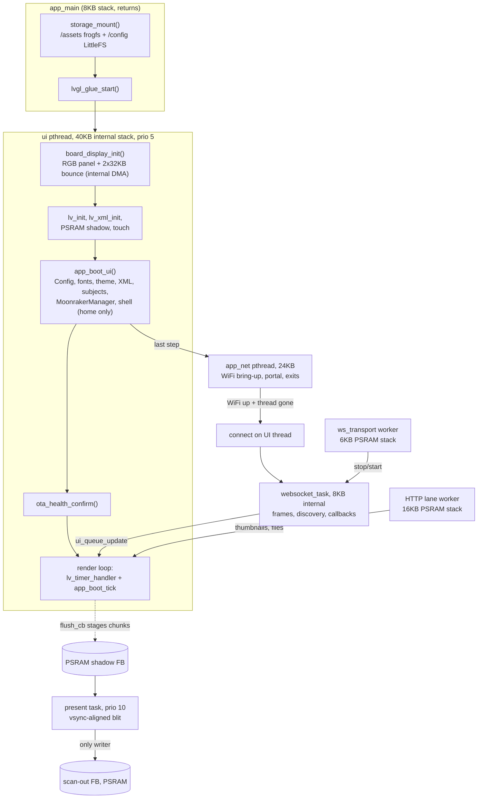

# 17 - ESP32 firmware (BTT K-Touch)

The BigTreeTech K-Touch is an ESP32-S3 panel: two Xtensa cores at 240MHz, about 512KB of on-chip SRAM, 8MB of octal
PSRAM, 16MB of flash, an 800x480 RGB panel and a GT911 touch controller. HelixScreen runs on it natively, as a
remote screen that joins WiFi and talks to a printer's Moonraker. It is not a second app. The firmware in
`firmware/helixscreen-esp32/` is an ESP-IDF (CMake) project that compiles LVGL, `lib/helix-xml`, all of `ui_xml/`
and a curated two thirds of `src/` unmodified, then adds what Linux gives the desktop app for free: a boot
sequence, a display driver, a WebSocket and HTTP transport, storage, WiFi and OTA. Nearly every design decision in
it follows from one fact: **internal SRAM is the scarce resource**, not CPU, not flash, not even PSRAM. A few KB
too much of it at the wrong moment and WiFi will not associate, the WebSocket task cannot start, or the panel boots
to black.

This chapter is the model. [`ESP32_PORT.md`](../ESP32_PORT.md) is the hands-on guide (build, flash, serial,
debugging), and [`ESP32_NATIVE_AUDIT.md`](../ESP32_NATIVE_AUDIT.md) holds the feasibility measurements that set the
feature cut. ESP32 is not built or shipped on the `release/1.0` line.

## Key files

| Path | Role |
|------|------|
| [`firmware/helixscreen-esp32/main/app_main.c`](../../../firmware/helixscreen-esp32/main/app_main.c) | Entry point: mount storage, start the UI pthread, return |
| [`firmware/helixscreen-esp32/main/lvgl_glue.c`](../../../firmware/helixscreen-esp32/main/lvgl_glue.c) | UI thread body, LVGL display and draw buffer, the PSRAM shadow and the vsync presenter, the render loop |
| [`firmware/helixscreen-esp32/main/board_display.c`](../../../firmware/helixscreen-esp32/main/board_display.c) | RGB panel config, bounce buffers, backlight; pins and timings in `boards/ktouch.h` |
| [`firmware/helixscreen-esp32/main/storage_mount.c`](../../../firmware/helixscreen-esp32/main/storage_mount.c), [`ota_health.c`](../../../firmware/helixscreen-esp32/main/ota_health.c), [`serial_snapshot.c`](../../../firmware/helixscreen-esp32/main/serial_snapshot.c), [`touch_input.c`](../../../firmware/helixscreen-esp32/main/touch_input.c) | Mounts, OTA confirm, the serial console, GT911 touch with injected taps |
| [`firmware/helixscreen-esp32/components/helixapp/app_boot.cpp`](../../../firmware/helixscreen-esp32/components/helixapp/app_boot.cpp) | The firmware's `Application`: boot phases, WiFi and connect thread, printer switch and crash fallbacks, the per-frame tick |
| [`components/helixapp/app_srcs.txt`](../../../firmware/helixscreen-esp32/components/helixapp/app_srcs.txt), [`app_srcs_excluded.txt`](../../../firmware/helixscreen-esp32/components/helixapp/app_srcs_excluded.txt) | Every `src/` file the firmware compiles, and every one it deliberately does not |
| [`components/helixapp/CMakeLists.txt`](../../../firmware/helixscreen-esp32/components/helixapp/CMakeLists.txt) | The `HELIX_HAS_*` gate set and `HELIX_PLATFORM_ESP32` |
| [`components/helixapp/helixapp_platform_stubs.cpp`](../../../firmware/helixscreen-esp32/components/helixapp/helixapp_platform_stubs.cpp), [`excluded_subsystems_stub.cpp`](../../../firmware/helixscreen-esp32/components/helixapp/excluded_subsystems_stub.cpp) | Stand-ins for excluded files: globals, null accessors, link stubs |
| [`components/helixapp/wifi_backend_esp.cpp`](../../../firmware/helixscreen-esp32/components/helixapp/wifi_backend_esp.cpp), [`provisioning_esp.cpp`](../../../firmware/helixscreen-esp32/components/helixapp/provisioning_esp.cpp), [`wall_clock_esp.cpp`](../../../firmware/helixscreen-esp32/components/helixapp/wall_clock_esp.cpp) | `WifiBackend` over `esp_wifi`, the first-boot SoftAP portal, SNTP or HTTP-Date clock |
| [`components/helixnet/esp_moonraker_client.h`](../../../firmware/helixscreen-esp32/components/helixnet/esp_moonraker_client.h) | `EspMoonrakerClient`, the `IMoonrakerClient` over `esp_websocket_client` |
| [`components/helixnet/esp_http_lane.h`](../../../firmware/helixscreen-esp32/components/helixnet/esp_http_lane.h), [`esp_rest_api.cpp`](../../../firmware/helixscreen-esp32/components/helixnet/esp_rest_api.cpp) | The one HTTP worker and the REST/file-transfer API on top of it |
| [`components/helixcore/CMakeLists.txt`](../../../firmware/helixscreen-esp32/components/helixcore/CMakeLists.txt) | LVGL + helix-xml build, per-file `-O2`, S3 SIMD blend routines, font shims |
| [`firmware/helixscreen-esp32/sdkconfig.defaults`](../../../firmware/helixscreen-esp32/sdkconfig.defaults) | Every non-default IDF option, each with its measured reason |
| [`firmware/helixscreen-esp32/partitions.csv`](../../../firmware/helixscreen-esp32/partitions.csv), [`size_budget.json`](../../../firmware/helixscreen-esp32/size_budget.json) | Flash layout; image and internal-DRAM ceilings |
| [`include/helix_psram_attr.h`](../../../include/helix_psram_attr.h), [`include/psram_thread_stack.h`](../../../include/psram_thread_stack.h) | The two ways shared code moves memory off internal SRAM |

## How it works

### One codebase, compiled as a subset

`helixapp` reads its sources from `app_srcs.txt`, one repo-relative path per line, and `app_srcs_excluded.txt`
records each file left out with its reason. What stays out is the Linux shell around the app (`Application`,
`DisplayManager`, `PrinterSession`, `main.cpp`, the libhv `MoonrakerClient`, crash handling, mDNS, Bluetooth,
remote screen and the ctl server) and the subsystems the panel cannot afford or has no hardware for. Those
subsystems compile out through the definitions in `components/helixapp/CMakeLists.txt`: `HELIX_HAS_CAMERA`,
`GCODE_VIEWER`, `BED_MESH_3D`, `LABEL_PRINTER`, `PLUGINS`, `TIMELAPSE_VIEWER`, `SOUND`, `BELT_TUNER`, `HIDPI_FONTS`
and `CJK` are 0, `HELIX_ENABLE_SCREENSAVER` is 0, and the filament backends (`CFS`, `IFS`, `ACE`, `QIDI`,
`SNAPMAKER`) are 1. Every gate is written out even when its value is the obvious one, because an undefined
`HELIX_HAS_X` reads as 0 in `#if` and would drop a feature with nobody deciding to. Shared code that needs a
firmware arm tests `HELIX_PLATFORM_ESP32`, or `ESP_PLATFORM` where an IDF header is involved.

Excluded files leave holes that kept files still reach. Three kinds of filler cover them, and the difference
matters: `helixapp_platform_stubs.cpp` and `helixapp_platform_stubs2.cpp` give real implementations of what the
firmware does differently (the `app_globals` subjects, `PrinterState`'s instance in PSRAM, the Moonraker manager
accessor, an inert `MdnsDiscovery`); `excluded_subsystems_stub.cpp` gives link-only accessors that return
references into **unconstructed** storage, so any virtual call through one is a null-vtable fault; and
`firmware/helixscreen-esp32/components/helixapp/task10_pending_stubs.cpp` holds the Moonraker sub-API methods the
firmware does not implement, which log and fail through the caller's error callback. That is why
`src/application/subject_initializer.cpp` skips `init_subjects()` on the bed-mesh, calibration and timelapse-videos
panels under `#if !defined(HELIX_PLATFORM_ESP32)`.

The image builds `-fno-exceptions -fno-rtti`
(`firmware/helixscreen-esp32/sdkconfig.defaults#"CONFIG_COMPILER_CXX_RTTI=n"`). Exceptions off removed about 1.4MB
from the image; RTTI off removed about 300KB. The cost is that a `throw` anywhere is an abort: nlohmann's
`JSON_THROW` becomes `std::abort()`, and so does libstdc++'s `__throw_*`. Firmware-compiled code therefore reads
JSON through the non-throwing readers in [`include/json_utils.h`](../../../include/json_utils.h), parses numbers
with `text_io::parse_leading`, and shares any code that must work both ways through
[`include/exception_policy.h`](../../../include/exception_policy.h). RTTI questions go through
`helix::type_tag<T>()` and virtual kind queries ([`include/helix_type_tag.h`](../../../include/helix_type_tag.h)),
which desktop uses too, so there is no per-platform divergence. `std::regex`, iostreams and `std::filesystem` are
banned from the subset because each one links libstdc++'s locale machinery; `helix::Regex`, `text_io` and
`helix::fs` replace them.

### The components

| Component | Owns |
|-----------|------|
| `helixcore` | LVGL from `lib/lvgl` (with `patches/` applied) and `lib/helix-xml`, against the firmware's own `lv_conf.h`. LVGL's draw, core, misc and layout sources and the XML engine compile at `-O2` while the image is `-Os`; the S3 PIE SIMD blend routines come from esp_lvgl_port. Fonts are zero-filled shims that the boot fills from `.bin` faces in the asset partition |
| `helixapp` | The app core from `app_srcs.txt`, plus the firmware's own boot (`app_boot.cpp`), WiFi backend, provisioning portal, wall clock, font aliases and the stubs above |
| `helixnet` | `EspMoonrakerClient`, `EspHttpLane`, `esp_rest_api.cpp`, and the spdlog / `hv/json.hpp` shims the app includes. The pure decision logic (`reconnect_backoff.h`, `http_lane_queue.h`, `transport_lifecycle.h`, `link_liveness.h`) has no IDF includes, so the desktop suite tests it (`tests/unit/test_esp32_*.cpp`) |
| `esp_websocket_client` | Espressif's client, vendored at 1.8.0 so the firmware can carry fixes to it (`VENDORED.md`) |
| `main` | Board bring-up, LVGL glue, touch, storage mount, OTA confirm, serial console, font registration |

The dependency runs one way: `main` requires `helixapp`, which requires `helixcore` and `helixnet`. When `main` has
to tell the app something (touch probe failed, here is the retained frame for scrolling) it pushes it down through
an `extern "C"` setter in `app_boot.h` rather than the app including a `main/` header.

### Memory: internal SRAM is the budget

Two pools matter. PSRAM is large and slow, and sits behind a cache that every flash operation disables, so nothing
that can run in that window may touch it. Internal SRAM is fast, DMA-capable and tiny, and it is where task stacks,
DMA buffers, the WiFi driver's working memory and every `.bss`/`.data` static land by default.
`CONFIG_SPIRAM_USE_MALLOC` sends ordinary heap allocations to PSRAM, so heap is rarely the problem. Statics and
stacks are.

What must be internal, and why:

- **The UI thread's 40KB stack** (`firmware/helixscreen-esp32/main/lvgl_glue.c#UI_THREAD_STACK_BYTES`): it writes
  settings to flash, which cannot run from a PSRAM stack.
- **The two 32KB RGB bounce buffers** and the presenter's 16KB staging band: DMA and the refill ISR read them.
- **LVGL's 38.4KB draw buffer** (`firmware/helixscreen-esp32/main/lvgl_glue.c#"static uint8_t s_draw_buf1"`),
  static so it is reserved at link time.
- **The WebSocket task's 8KB stack**
  (`firmware/helixscreen-esp32/components/helixnet/esp_moonraker_client.h#WS_TASK_STACK_BYTES`), sized from a
  measured ~6.5KB peak.
- **The WiFi driver's buffers**: `CONFIG_SPIRAM_TRY_ALLOCATE_WIFI_LWIP` moves most of WiFi and lwIP to PSRAM, and
  static TX/RX buffer counts make the rest deterministic.

Everything else is pushed out. A large static in firmware-compiled code carries `HELIX_PSRAM_BSS`
([`include/helix_psram_attr.h`](../../../include/helix_psram_attr.h)), which is `EXT_RAM_BSS_ATTR` here and empty
on every other platform: `AmsState`'s instance
(`src/printer/ams_state.cpp#"static HELIX_PSRAM_BSS AmsState instance"`), the filament path planner's scratch
(`src/ui/ui_filament_path_topology.cpp#plan_scratch`), `PrinterState`, `TelemetryManager` and `UpdateChecker`. Only
for statics first touched after boot and never reached by DMA or an ISR. A thread that does not need internal RAM
gets a PSRAM stack through `PsramThreadStackScope`
([`include/psram_thread_stack.h`](../../../include/psram_thread_stack.h)), which also bars that thread from storage
(`helix::fs::forbid_storage_on_this_thread`), because a flash operation on a PSRAM stack faults. The HTTP lane, the
WebSocket transport worker and the sound sequencer start this way. And `HttpExecutor::start()` is a no-op under
`ESP_PLATFORM` (`src/system/http_executor.cpp#start`): the desktop worker pools would take internal stacks the boot
cannot spare, so on the firmware a `submit()` to them never runs.

Two numbers in `size_budget.json` hold the line: `dram_bss_max_bytes` and `dram_data_max_bytes` cap the
`.dram0.bss` and `.dram0.data` sections at their measured size plus 2KB. The comment there is the reason: statics
come out of the same internal heap the WiFi driver starts in, and 14KB more is enough to stop it associating.

Heap telemetry follows one rule: while the panel scans out, read counters, never walk.
`heap_caps_get_largest_free_block()` on PSRAM walks every block with interrupts masked for 20-30ms, the bounce
refill misses for the whole walk, and the screen glitches. So steady-state code reads `heap_caps_get_free_size()`,
`src/system/memory_utils.cpp` reports PSRAM from counters only, and a lint test in
`tests/shell/test_code_lint.bats` ("per-event ESP32 paths read free PSRAM, never walk the heap") fails a walk in
the thumbnail, print-select and print-status paths. Largest-block walks happen only on internal RAM at discrete
milestones (`firmware/helixscreen-esp32/components/helixapp/app_boot.cpp#log_heap_milestone`) and once at 60s
steady state.

### Threads and tasks

| Task | Stack | What runs there |
|------|-------|-----------------|
| `ui` pthread | 40KB internal | LVGL, every panel, every subject, `UpdateQueue` drain, `MoonrakerManager::process_notifications()`/`process_timeouts()` |
| `present` | 4KB internal, prio 10 | The only writer of the scan-out framebuffer |
| `app_net` pthread | 24KB internal, exits | WiFi bring-up, the provisioning portal, a bounded 20s wait for association |
| `websocket_task` | 8KB internal | Frame reassembly, JSON-RPC dispatch, discovery steps, every client callback |
| `ws_transport` pthread | 6KB PSRAM | Every websocket stop, destroy, init and start, in order |
| `http_lane` pthread | 16KB PSRAM | Capped GETs for thumbnails and small files |
| `esp_timer` / `sys_evt` | 6KB / 4KB internal | Client housekeeping (timeouts, reconnect execution); WiFi events |

The desktop threading rules ([`03-threading-lifetime.md`](03-threading-lifetime.md)) apply unchanged, with the UI
pthread in the main thread's role. App code must run on a pthread, not a raw FreeRTOS task, because spdlog and the
main-thread detectors call `std::this_thread::get_id()`, which asserts on a bare task. The firmware never records a
main thread id, so code that must know it is on the LVGL thread asks `helix_on_ui_task()`
(`src/xml_registration.cpp#on_lvgl_thread`). LVGL runs with `LV_OS_NONE`: there is one LVGL thread and no locking.

`EspMoonrakerClient` keeps the contract consumers expect from the libhv client: callbacks arrive on a background
task (the websocket task), and consumers hop to the UI through `ui_queue_update()` / `tok.defer()`. Inside the
client, the rule is that no websocket task ever stops itself and the UI thread never waits on one. A disconnect on
the websocket task only records reconnect intent; the stop/start runs as a job on the `ws_transport` worker
(`TransportLifecycle`), and sends from the UI thread are bounded at 3s
(`firmware/helixscreen-esp32/components/helixnet/esp_moonraker_client.h#UI_STALL_BUDGET_MS`) so an unreachable
printer reads as slow, never frozen.

### Boot sequence, and why its order is fixed

Each internal allocation on the boot path must find a contiguous block, and every allocation that lands first
splits the heap for the next one. The order is chosen so the large, unavoidable ones come first:

1. `app_main()` mounts storage and calls `lvgl_glue_start()`
   (`firmware/helixscreen-esp32/main/app_main.c#app_main`). The UI pthread's 40KB stack is the first sizeable
   internal allocation; the log line `heap before pthread` is the gate.
2. The UI thread runs `board_display_init()`, which allocates the bounce buffers (the second gate, logged as
   `internal heap before rgb panel`), then `lv_init()` and `lv_xml_init()`, the PSRAM shadow, the staging band, the
   display, touch, and the presenter task (`firmware/helixscreen-esp32/main/lvgl_glue.c#ui_thread_main`).
3. `app_boot_ui()` mirrors the desktop ladder ([`11-startup-shutdown.md`](11-startup-shutdown.md)) with the same
   ordering constraints: asset root and Config, the boot crash guard, the `UpdateQueue`, fonts before `globals.xml`
   before `theme_manager_init()`, widgets, translations, `register_xml_components()`, core subjects,
   `MoonrakerManager` (its ESP arm builds `EspMoonrakerClient`,
   `src/application/moonraker_manager.cpp#create_client`), panel subjects, the shared session services, then the
   shell (`firmware/helixscreen-esp32/components/helixapp/app_boot.cpp#"void app_boot_ui(void) {"`). The shell and
   the discovery wiring come from `src/application/session_wiring.cpp`, the half desktop and firmware share.
4. The last step of `app_boot_ui()`, after the home panel is up, starts `app_net`
   (`firmware/helixscreen-esp32/components/helixapp/app_boot.cpp#app_net_start`). WiFi's own internal allocations
   come after every UI gate has passed, and the hardware bring-up is gated
   (`wifi_backend_esp_allow_hardware_bringup()`) so a `WiFiManager` constructed earlier by a widget cannot start
   the radio on the wrong stack.
5. Once `app_boot_ui()` returns, `ota_health_confirm()` marks the image valid
   (`firmware/helixscreen-esp32/main/ota_health.c#ota_health_confirm`) and the render loop starts.
6. The first Moonraker connect waits for **both** WiFi up and `app_net` gone (`include/boot_connect_handoff.h`):
   the WebSocket task's 8KB stack allocated while `app_net`'s 24KB is still held would split the largest block for
   the rest of the session. A 20ms UI-thread poll answers Connect once, and the connect itself runs from the
   `UpdateQueue` drain like every other.

The boot is long and synchronous on a thread that outranks the idle task, and the task watchdog watches idle.
Shared boot code calls `HELIX_BOOT_YIELD()` ([`include/boot_yield.h`](../../../include/boot_yield.h)) between units
of work, which is one `vTaskDelay(1)` here and nothing on desktop.

### Display, touch and rendering

The panel scans out one RGB565 framebuffer in PSRAM through two internal bounce buffers that an EOF ISR refills
(`firmware/helixscreen-esp32/main/board_display.c#board_display_init`). Two framebuffers with a pointer flip is
ruled out on this hardware: with bounce buffers the driver loses track of which buffer feeds scan-out and the panel
drops into its colour-cycling test pattern. Direct PSRAM scan-out without bounce buffers desyncs under redraw
bandwidth. So tearing is solved in software (`main/lvgl_glue.c`, its header comment is the full account):

- LVGL renders `PARTIAL` into the internal draw buffer. `flush_cb` copies each chunk into a full-frame PSRAM
  **shadow**, extends the cycle's dirty Y band, and returns at once; LVGL never waits on the panel.
- On the cycle's last chunk it publishes the band. The `present` task waits for vsync and copies the band from
  shadow to framebuffer, by GDMA where available (`firmware/helixscreen-esp32/main/lvgl_glue.c#dma_copy_band`),
  else through the internal band.
- The copy is slower than the beam, so it trails it: each band is written only after the bounce DMA has read it
  this frame, and must finish before the next frame reads it
  (`firmware/helixscreen-esp32/main/lvgl_glue.c#present_blit`). The UI task is suspended for the copy so its PSRAM
  traffic cannot slow it.
- A mutex gives the shadow one owner at a time, from a cycle's first chunk to its last, so a blit never copies half
  of one cycle and half of the next.

Scrolling uses the retained shadow: `include/scroll_blit.h` moves pixels already in the shadow and renders only the
strip that scrolled in. Touch is the GT911 through `esp_lcd_touch`, polled by LVGL; a failed probe leaves the panel
display-only with a startup toast instead of aborting. The render loop sleeps 5-50ms between `lv_timer_handler()`
calls and logs `slow ui cycle` and `slow refresh cycle` above 100ms, because a long cycle starves the polled touch
indev and drops taps.

The sdkconfig choices that keep rendering alive are measured and commented in place: 80MHz octal PSRAM (at 40MHz
the bounce refill misses continuously), 64-byte data cache lines, a 32KB instruction cache, QIO flash, and
`CONFIG_LCD_RGB_RESTART_IN_VSYNC` left off.

### What a limited UI looks like here

The firmware has no `/proc`, so `PlatformCapabilities::detect()` reads no RAM and no cores and classifies it
`EMBEDDED`, the lowest tier (`src/system/platform_capabilities.cpp#detect`). Everything gated on the tier follows:
no pressed-scale transforms or scrollbar restyles (`full_style_effects_allowed`), the `platform_tier` subject that
XML binds for square overlay corners, and overlays built under the "Loading..." pill
(`NavigationManager::build_under_loading_pill`). On top of that, a few firmware-only arms:

- **Deferred panels.** `ui_xml_overrides/app_layout.xml` replaces the shared layout at staging and instantiates
  only Home; the other five panels are built on first navigation
  (`src/application/panel_factory.cpp#build_deferred_panel`) under the navigation scrim
  (`src/ui/ui_nav_manager.cpp#"class NavTransitionScrim"`). Building all six at boot costs many seconds of layout.
- **Idle prebuild.** Print Files, the panel a session visits first, is built at the first idle moment once the
  printer is connected and nothing modal is open (`src/application/panel_factory.cpp#tick`).
- **Thumbnails in PSRAM, never on disk.** There is no thumbnail cache directory on a 128KB settings partition, so a
  fetched PNG is decoded once, fitted to its draw box, and kept as an RGB565A8 image in PSRAM
  (`include/esp_psram_thumbnail.h#"class EspPsramThumbnail"`). Print Files releases its card thumbnails on leaving
  the panel, and G-code header thumbnail extraction is off
  (`include/thumbnail_cache.h#gcode_thumbnail_extraction_available`).
- **A capped file list.** Print Files keeps the 50 newest files
  (`src/ui/ui_panel_print_select.cpp#"constexpr size_t ESP32_MAX_FILE_COUNT"`).

### Networking

`EspMoonrakerClient` implements `IMoonrakerClient` in full, so everything above `MoonrakerManager` is the desktop
code. Its own choices: messages above 256KB are dropped whole; at most 64 requests are in flight; a ping every 10s
with a 20s pong timeout, plus a 40s no-frame watchdog, catch a silently dead link before the 60s request timeout;
reconnects back off exponentially; and every connection attempt bumps a generation that the discovery chain checks
at each step, so a reconnect mid-discovery abandons the old chain. Discovery runs the shared core steps
(`src/application/discovery_steps_core.cpp`) but not desktop's tail (update checker, telemetry, wizard prompts,
timelapse).

HTTP has one lane: `EspHttpLane` (`firmware/helixscreen-esp32/components/helixnet/esp_http_lane.h#EspHttpLane`), a
single worker with an eight-deep queue. `submit_get()` returns false on a full queue and callers retry on their
next tick, never in a loop; every fetch is capped at 512KB and its buffer grows from the content length.
`esp_rest_api.cpp` builds `download_file_partial` (thumbnails), `download_file` (small config files, 64KB cap) and
`call_rest_get` on it. ACE and AD5X IFS, the two filament backends that poll over HTTP, are refused at runtime
unless `CONFIG_HELIX_AMS_HTTP_POLL_BACKENDS` is on (`http_poll_ams_backends_supported()` in
`src/printer/ams_backend.cpp`).

WiFi is the shared `WiFiManager` over `wifi_backend_esp.cpp`: credentials in NVS, an all-channel scan that joins
the strongest AP of the SSID, modem sleep off. With no stored SSID, `app_net` runs the SoftAP captive portal
(`firmware/helixscreen-esp32/components/helixapp/provisioning_esp.h#provisioning_run_portal`) while the not-ready
UI shows instructions. There is no mDNS: the printer address is typed into Settings, or seeded on first boot from
`CONFIG_HELIX_HIL_MOONRAKER_URL` in a git-ignored `sdkconfig.local`. The wall clock comes from SNTP, or from
Moonraker's HTTP `Date` header on a LAN with no internet (`wall_clock_esp.h`).

### Storage, settings and printers

`storage_mount()` mounts two filesystems. `/assets` is the read-only `storage` partition, a packed frogfs container
mmapped from flash: minified `ui_xml/` for every language, config JSON, a curated set of printer pictures at 200px
(`scripts/esp32_printer_images.py`), and every font face except LVGL's built-in `montserrat_14`. `/config` is the
128KB `cfg` LittleFS partition, formatted on a failed mount. `app_boot_ui()` points `set_asset_root()`,
`HELIX_DATA_DIR` and `HELIX_CONFIG_DIR` at them and injects Config storage with `ConfigFootprint::Small`
(`include/config_storage.h#ConfigFootprint`): compact JSON and no side copies, because a save must hold the old and
new documents at once. WiFi credentials live in NVS. Flashing the app or the asset image never writes `nvs` or
`cfg`, and a repartition keeps both at their offsets, so WiFi and settings survive a firmware change.

Theme tokens come from a build-time table (`include/theme_token_table.h`) instead of a scan of `ui_xml/`, and XML
components register on first use as on desktop, each a frogfs inflate plus an expat parse.

Multi-printer works as on desktop from the user's side, but there is no `PrinterSession` to tear down. A switch
retargets the one connection in place (`include/printer_retarget.h#retarget_printer_connection`) through the shared
`PrinterSwitchFlow`, keeps the shell, and rebuilds the home grid only when the layouts differ. The transport worker
starts the new WebSocket task only once the old one's stack is back
(`firmware/helixscreen-esp32/components/helixapp/app_boot.cpp#ws_stack_available`); when it is not, or discovery
does not land within 30s, the panel restarts into the selected printer
(`firmware/helixscreen-esp32/components/helixapp/app_boot.cpp#restart_into_active_printer`), at most twice per
healthy ten minutes.

### Image, flash and OTA

`partitions.csv` is the authority: two 6.5MB OTA app slots, the 2.75MB `storage` container, the 128KB `cfg`, `nvs`,
`otadata` and `phy_init`. `CONFIG_BOOTLOADER_APP_ROLLBACK_ENABLE` makes an image written to the other slot pending
until `ota_health_confirm()` runs after the shell is built, so an image that cannot reach its UI rolls back. The
firmware carries no updater of its own: updates arrive over USB or the helixscreen.org/flash web flasher
([`../../user/guide/install-esp32.md`](../../user/guide/install-esp32.md)). A partition table cannot change over
OTA; a layout change needs a USB reflash, which keeps `nvs` and `cfg` at their offsets.

Assets are a build input, not compiled in. `scripts/esp32_stage_assets.py` assembles the tree (applying
`ui_xml_overrides/` over the shared XML), `scripts/esp32_pack_assets.py` packs it and gates it on the `storage`
partition size, and `main/CMakeLists.txt` refuses to build without the packed image and fails a stale one through
`scripts/esp32_check_asset_staleness.py`.

### Crash recovery and diagnostics

There is no watchdog process and no crash dialog. `apply_boot_crash_guard()` counts panic and watchdog resets since
the last healthy session (`include/boot_crash_guard.h#choose_boot_printer`): after three it falls back to the
printer a switch came from, or holds the connection until the user picks one, and says so in a toast. Ten minutes
connected clears the streak
(`firmware/helixscreen-esp32/components/helixapp/app_boot.cpp#"void app_boot_tick(void) {"`).

The serial console is the diagnostic surface (`main/serial_snapshot.h`): `snap` streams the shadow framebuffer as
deflated, CRC-checked lines that `scripts/esp32_serial_snapshot.py` turns into a PNG, `tap X Y` injects a touch,
and `notes` prints the notification history. Logs carry the tripwires: `[scanout] underruns` (bounce refills that
missed), `[present] late blit` (a frame shown torn), `slow ui cycle`, `rx stall`, the `[heap:*]` milestones and the
`[stack:steady-60s]` watermarks for the two IDF tasks that run app code. `CONFIG_HELIX_LOG_STRIP_DEBUG` compiles
`spdlog::debug`/`trace` away by default, so a debug line you add will not print unless you turn it off.

### Mock mode

`CONFIG_HELIX_MOCK_PRINTER` replaces the connection with a firmware-local synthetic printer in `app_boot.cpp`: it
seeds READY and a printer type before the shell builds, installs `AmsBackendMock` directly, and pushes temperatures
about once a second through `dispatch_status()`, the same path a real status frame takes. The desktop
`MoonrakerClientMock` cannot be built (it derives the libhv client), so `HELIX_ENABLE_MOCKS` and
`RuntimeConfig::test_mode` are never set here.

### Gates

Nothing in the desktop build compiles the firmware, so separate gates hold the boundary: commit-time checks that
every `src/` file has a manifest decision, that no firmware-compiled file throws or pulls in `std::locale`, and
that every XML binding has a registration the firmware compiles; an Xtensa syntax check at push; and CI ceilings on
the image size and the internal-DRAM statics. The table, with what each catches, is in
[`ESP32_PORT.md`](../ESP32_PORT.md#gates).

## Patterns & gotchas

The checklist for a shared `src/` change (manifest line, no throws, banned includes, large statics, the syntax
check) is [`ESP32_PORT.md`](../ESP32_PORT.md#changing-shared-code). The architectural traps on top of it:

- **A PSRAM-stack thread never touches flash, NVS or files.** Do storage work on the UI thread and hand the bytes
  over.
- **Never `HELIX_PSRAM_BSS` a DMA or draw buffer**, or anything an ISR touches.
- **Excluded-subsystem accessors are not objects.** Gate a caller that dereferences one with
  `#if !defined(HELIX_PLATFORM_ESP32)`.
- **Desktop `HttpExecutor` work is dropped on the firmware.** Fetches go through `EspHttpLane`.
- **A long synchronous build on the UI thread needs `HELIX_BOOT_YIELD()`**, or the task watchdog fires.
- **Never walk the PSRAM heap after boot**; read the free-size counters.
- **`num_fbs = 2` and `CONFIG_LCD_RGB_RESTART_IN_VSYNC` are measured dead ends**; the comments in `board_display.c`
  and `sdkconfig.defaults` say why.

## Going deeper

- [`../ESP32_PORT.md`](../ESP32_PORT.md): build, flash, serial console, size budget, debugging recipes.
- [`../ESP32_NATIVE_AUDIT.md`](../ESP32_NATIVE_AUDIT.md): the measurements behind the feature cut.
- [`11-startup-shutdown.md`](11-startup-shutdown.md): the desktop ladder `app_boot_ui()` mirrors, and the shared
  session wiring.
- [`14-build-platforms.md`](14-build-platforms.md): where the firmware sits among the other targets.
- [`../MOONRAKER_ARCHITECTURE.md`](../MOONRAKER_ARCHITECTURE.md): the client contract `EspMoonrakerClient`
  implements.
- [`../printer-research/BTT_K_TOUCH_HARDWARE.md`](../printer-research/BTT_K_TOUCH_HARDWARE.md): the board itself.

## Guided code tour

Read in this order; about 45 minutes total.

1. `firmware/helixscreen-esp32/main/app_main.c#app_main`: the order of storage, UI thread and network.
2. `firmware/helixscreen-esp32/main/lvgl_glue.c#FB_BPP`: the shadow-and-presenter comment above it, then
   `flush_cb`, `present_blit` and `ui_thread_main` in the same file. The whole rendering model.
3. `firmware/helixscreen-esp32/main/board_display.c#board_display_init`: bounce-buffer sizing and the
   double-framebuffer warning.
4. `firmware/helixscreen-esp32/components/helixapp/app_boot.cpp#"void app_boot_ui(void) {"`: the `Phase N`
   comments, against `src/application/application.cpp#run`.
5. `firmware/helixscreen-esp32/components/helixapp/app_boot.cpp#app_net_thread_main` with
   `include/boot_connect_handoff.h#BootConnectHandoff`.
6. `firmware/helixscreen-esp32/sdkconfig.defaults`: every block carries its measurement.
7. `include/helix_psram_attr.h`, `include/psram_thread_stack.h#"class PsramThreadStackScope"`, then
   `size_budget.json` and `scripts/check_esp32_size.py#check_dram`.
8. `firmware/helixscreen-esp32/components/helixapp/CMakeLists.txt`: the gate set; then the `EXCLUDED, and why`
   header of `app_srcs.txt`.
9. `firmware/helixscreen-esp32/components/helixnet/esp_moonraker_client.h#"class EspMoonrakerClient final"`: the
   private constants are the client's design in numbers.
10. `src/application/panel_factory.cpp#setup_panels`: deferred panels and the idle Print Files build.
11. `include/esp_psram_thumbnail.h#"class EspPsramThumbnail"`: an image without a disk cache.
12. `include/boot_crash_guard.h#choose_boot_printer`, then
    `firmware/helixscreen-esp32/components/helixapp/app_boot.cpp#restart_into_active_printer`.
