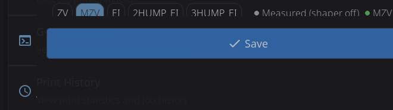
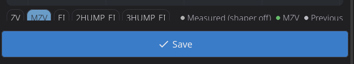

# Calibration & Tuning

HelixScreen provides built-in tools for the most common Klipper calibration tasks.

> **Looking for touchscreen calibration?** See the [Touch Calibration Guide](touch-calibration.md).

---

## Bed Mesh

The Bed Mesh panel has two parts: a 3D visualization of your bed surface on the left, and information cards on the right.

**Visualization (left):**

- **Color gradient**: Blue (low) to Red (high)
- **Touch to rotate** the 3D view
- When no mesh is loaded, the panel shows a "No mesh loaded" placeholder

**Current Mesh card (right):** shows the active profile name, mesh size (probe-point grid), highest and lowest points, and the overall Z range (variance).

**Probe a new mesh:** tap **Probe** in the panel header to run a fresh bed mesh calibration.

The visualization mode (3D, 2D, or Auto) can be changed in **Settings > Display**.

### Profile Management

The **Profiles** card on the right lists your saved mesh profiles. Each row shows the profile name and its Z range, with action icons on the right:

| Icon | Appears on | What It Does |
|------|-----------|--------------|
| **Load** (up arrow) | Inactive profiles | Loads that saved mesh, making it the active profile |
| **Rename** (pencil) | The active profile | Opens the rename dialog (see below) |
| **Delete** (trash) | Every profile | Removes that saved profile |

Tapping a row (or its Load icon) loads that profile.

**Renaming a profile:**

1. Tap the **pencil** icon on the active profile
2. The rename dialog shows the current name and a field for the new name
3. Enter a new profile name and tap **Rename**

**After renaming or deleting**, HelixScreen asks **"Save changes to persist them across restarts?"** Profile changes only live in memory until saved:

- Tap **Save** to write the change to your printer's saved configuration. This persists the change across restarts but **restarts Klipper**.
- Tap **Don't Save** to keep the change for the current session only — it will be lost when the printer reboots.

---

## Screws Tilt Adjust

Assisted manual bed leveling:

1. Navigate to **Advanced > Screws Tilt**
2. Tap **Measure** to probe all bed screw positions
3. View adjustment amounts (e.g., "CW 00:15" = clockwise 15 minutes)
4. Adjust screws and re-measure until level

**Color coding:**

- **Green**: Level (within tolerance)
- **Yellow**: Minor adjustment needed
- **Red**: Significant adjustment needed

### Sharing the Results

Next to **Done** and **Re-probe** in the results view, a **share button** (QR icon) opens a card with every screw's name, probed height, and adjustment spelled out, plus a QR code alongside. The QR encodes exactly the same results as plain text — scan it with any phone camera and the numbers appear there, ready to paste into your notes or a forum post. A printer has no clipboard to copy from, so the QR is how the values leave the screen.

The reference screw is labeled **base** (it is the one everything else is measured against), and a screw needing no adjustment shows `--`.

---

## Input Shaper

Tune vibration compensation for smoother, faster prints:

1. Navigate to **Advanced > Input Shaper**
2. Review your current shaper configuration displayed at the top
3. Pre-flight check verifies accelerometer is connected
4. Select axis to test (X or Y)
5. Tap **Calibrate** to run the resonance test. While the printer sweeps, a progress bar fills from 0 to 100%; once the sweep finishes it is replaced by a spinner with an "Analyzing data... Ns" counter while the printer's host crunches the samples. On slower printers the analysis alone can take a few minutes per axis — that wait is why the whole run gets a 10-minute timeout
6. View **frequency response chart** with interactive shaper overlay toggles
7. Review the **comparison table** showing recommended shaper and alternatives (frequency, vibration reduction, smoothing)
8. Check the **change summary** under the table: it shows what was active before the run ("ei @ 69.8 Hz -> mzv @ 53.8 Hz") and, when the chart has data, how much vibration the old setting would leave on today's measurements versus the new one ("Old setting on today's data: 8.4% residual - now: 7.8%")
9. Tap **Apply** to use for this session or **Save Config** to persist

**Chart features:**
- The chart plots **relative vibration** (see the caption above each chart): lower is less residual vibration
- The legend keys all three curve kinds: **Measured (shaper off)** is the raw vibration your printer produced during the test, the shaper chips show the vibration each shaper would leave behind, and **Previous** shows what your old setting would have left behind (only shown when a previous setting existed)
- Toggle different shaper types on/off to compare their frequency response curves
- Platform-adaptive: full interactive charts on desktop, simplified on embedded hardware
- Per-axis results shown independently

> **Creality K1/K2 note:** some Creality firmware versions overwrite the saved X-axis result with the Y-axis values when you calibrate both axes. HelixScreen detects this and shows a warning on the X results card — the X values it measured were correct, but the printer's saved config discards them. (On a Y-only run the warning appears on the Y card instead, since there is no X card to carry it.) Re-run **Calibrate X** alone and save if you want the measured X values kept.

> **Requirement:** Accelerometer must be configured in Klipper for measurements. If no accelerometer is detected, the pre-flight check will show a warning.

---

## Probe Management

View and control your Z probe from **Advanced > Probe Management**. HelixScreen auto-detects your probe type and shows the appropriate controls.

**Supported probe types:**

| Probe | Detected As | Type-Specific Controls |
|-------|-------------|----------------------|
| **Cartographer** | Cartographer | Calibrate, Touch Cal, Scan Cal |
| **Beacon** | Beacon | Calibrate, Auto-Calibrate |
| **BTT Eddy / Mellow Fly Eddy** | Eddy Current | Calibrate, Drive Current Cal |
| **BLTouch** | BLTouch | Deploy, Stow, Reset, Self-Test |
| **Voron Tap** | Voron Tap | — |
| **Klicky** | Klicky | Deploy, Dock |
| **Standard probe** | Probe | — |

**Universal actions** (all probe types):

| Button | What It Does |
|--------|--------------|
| **Accuracy Test** | Runs `PROBE_ACCURACY` to check probe repeatability |
| **Z-Offset Cal** | Opens the interactive Z-offset calibration panel |
| **Bed Mesh** | Opens the bed mesh calibration panel |

**Configuration:** Tap any config row (X/Y offset, samples, speed, retract distance, tolerance) to edit probe settings directly — changes are saved to your Klipper config with a firmware restart.

---

## Z-Offset Calibration

Interactive panel for dialing in your Z-offset when not printing. Works with all probe types — Cartographer, Beacon, BLTouch, eddy current probes, and standard probes.

1. Navigate to **Advanced > Z-Offset**, or tap **Z-Offset Cal** in the Probe Management overlay
2. Optionally enable **Warm Bed** to heat the bed before calibrating (accounts for thermal expansion)
3. Tap **Start** — the printer homes and begins the calibration sequence
4. Use the **+/−** adjustment buttons to lower the nozzle (paper test: adjust until paper drags slightly)
5. Tap **Accept** when satisfied, or **Abort** to cancel
6. The offset is saved to your Klipper config automatically

HelixScreen picks the right calibration command for your setup (`PROBE_CALIBRATE`, `Z_ENDSTOP_CALIBRATE`, or `SET_GCODE_OFFSET`) based on your printer's detected probe configuration.

> **Quick access:** A **Z Calibration** button is also available on the Controls panel for one-tap access.

---

## Belt Tension *(Beta)*

Uneven belt tension is one of the most common causes of print quality issues on CoreXY printers. Loose or mismatched belts produce visible artifacts like layer shifts, vertical fine artifacts (VFAs), and ringing/ghosting. HelixScreen's Belt Tension tool listens to each belt while **you pluck it by hand** and reports the frequency, so you can bring the two sides into agreement.

### How It Works

Every belt has a natural resonant frequency set by its free span, mass, and tension - just like a guitar string. Tighter belts ring higher. On a CoreXY printer the two front belts should ring at very nearly the same frequency, which means their tension is balanced.

The tool parks the gantry so both belts have the same free span, then streams your accelerometer live and watches for plucks. Each firm pluck is analysed on its own; the number you act on is the **median of five accepted plucks**, not a single reading. A guitar string's loudest overtone is often the octave above its fundamental, and belts are no different, so the tool identifies the fundamental from the whole harmonic series rather than from the tallest peak in the spectrum.

You measure one belt, then the other, then compare.

### Requirements

All of these are checked before the **Start Check** button becomes active. If it is greyed out, the reason is shown right above it:

| Message | What to do |
|---|---|
| *Not connected to the printer* | Wait for the connection to come back |
| *No accelerometer found in your Klipper config* | Add an `adxl345`, `lis2dw` or `mpu` section to `printer.cfg`. There is no accelerometer-free mode |
| *Belt tuning is only available on CoreXY printers* | The A/B belt-path model does not apply to bed slingers or other Cartesian machines |
| *This needs HelixScreen running on the printer itself* | The tool reads the accelerometer stream directly from Klipper's local socket. It cannot do that from a desktop or a separate tablet |
| *This display is not fast enough to analyse belt frequencies live* | Your display hardware cannot keep up with the real-time analysis. Nothing to fix - the tool is not available on that device |
| *Wait until the print finishes* | The toolhead has to be stationary. Measuring during a print would read the print, not the belt |

### Running a Belt Tension Check

1. Navigate to **Advanced > Belt Tension** (requires [beta features](beta-features.md) enabled)
2. Review the **hardware summary** card showing detected kinematics and accelerometer status. If your printer model has a measured belt-span geometry, a **Target Frequency** is shown too; if it does not, no target is shown and the tool compares the two belts against each other instead of against an absolute number
3. Tap **Start Check**. The printer homes if needed, then parks the gantry so the free span is the one the target is quoted for. If it cannot park (no bounds known, or no geometry for your model) it asks you to position the gantry yourself
4. Tap **Start Listening**
5. Hold still for a second while it learns the room's noise floor - the on-screen hint says *Hold still*
6. **Pluck the front belt on the right** (belt A) with a fingernail, near the middle of the free span, and let it ring. The live readout shows the frequency of each accepted pluck and a running median underneath
7. Repeat until the counter reads **5 / 5**. The **Next belt** button unlocks then, and not before
8. Tap **Next belt**, then do the same for **the front belt on the left** (belt B)
9. Tap **Compare**

If a pluck is not accepted, the hint tells you why:

- *Too soft - pluck harder* - the strike did not stand out enough from the background
- *That did not sound like a pluck - try again* - something rang, but it did not have the shape or the harmonic structure of a plucked string. A fan spinning up and a knock on the frame both land here

### Reading the Results

**Belt A and Belt B cards:**
- **Measured frequency** in Hz - the median of your five plucks, in whole Hz. The tool resolves about 2 Hz, so a decimal would claim precision it does not have
- **Status indicator** - Good, Needs adjustment, or Out of range. Only shown when there is a target frequency for your model; without one, an absolute verdict would be an invention

**Comparison section:**
- **Frequency Delta** - the difference between the two belts. Anything under about 2 Hz reads as *Within measurement resolution*, because that is the floor of what the instrument can tell apart
- **Match** - how closely belt B matches belt A, as a percentage. 100% is identical

**Recommendation card:**
- A specific instruction, e.g. *Belt A (front right) is tighter by 6 Hz. Tighten belt B, on the front left, or loosen belt A.* When a target frequency is known, the recommendation is written against the target rather than against matching alone - two belts can match each other perfectly and both be far too loose

### Interpreting Frequencies

The **target frequency** is a property of the *free span*, not of the printer: a 150 mm span at correct tension rings at 110 Hz on a Voron 2.4, and a shorter span rings higher. That is why the tool parks the gantry before measuring, and why it shows no target at all on a model whose span geometry has not been measured.

| Result | Meaning |
|-----------|---------|
| **Both belts match, near target** | Belt tension is balanced and correct |
| **Both belts match, but low** | Balanced but too loose - tighten both equally |
| **Both belts match, but high** | Balanced but overtightened - loosen both equally |
| **Belts differ significantly** | Unbalanced - tighten the lower-frequency belt |

### Tips

- **Run the check after any belt adjustment** to verify your changes had the desired effect
- **Tap "Start over"** during listening to go back and re-measure belt A once the flow has moved on to B
- **Belt A is the front belt on the right; belt B is the front belt on the left.** Check your printer's documentation for which tensioner adjusts which
- **Pluck in the same place on both belts.** The frequency depends on the free span, so plucking one belt near an idler and the other mid-span compares two different things
- **Turn off part-cooling and chamber fans if you can.** A fan is a steady tone in exactly the range the tool listens to; it will usually be rejected as "not a pluck", but it also raises the noise floor and makes gentle plucks harder to detect
- **Z belts cannot be measured this way.** A toolhead-mounted accelerometer is too far from them to hear anything useful
- **Temperature matters** - belt tension changes slightly with temperature. Run the check at your typical operating temperature for the most accurate results

---

## Heater Calibration (PID / MPC)

Calibrate temperature controllers for stable heating. HelixScreen supports two calibration methods:

- **PID** — Classic proportional-integral-derivative tuning. Works on all Klipper firmware.
- **MPC** *(Beta)* — Model Predictive Control. A physics-based thermal model that can provide more stable temperatures. Requires [Kalico](https://github.com/KalicoCrew/kalico) firmware (a Klipper fork with MPC support).

### PID Calibration

1. Navigate to **Advanced > Heater Calibration**
2. Select **Nozzle** or **Bed**
3. Choose a **material preset** (PLA, PETG, ABS, etc.) or enter a custom target temperature
4. Optionally set **fan speed** — calibrating with the fan on gives more accurate results for printing conditions
5. Tap **Start** to begin automatic tuning

**During calibration:**
- **Live temperature graph** shows the heater cycling in real-time
- **Progress percentage** updates as calibration proceeds
- **Abort button** available if you need to stop early
- A **20-minute timeout** acts as a safety net for stuck calibrations (slow-cooling beds can legitimately take longer than 15 minutes, so the limit sits above that)

**When complete:**
- View new PID values (Kp, Ki, Kd) with **old-to-new deltas** so you can see what changed
- Tap **Save Config** to persist the new values to your Klipper configuration

> **Tip:** Run PID tuning after any hardware change (new heater, thermistor, or hotend) and with the fan speed you typically use while printing.

### MPC Calibration (Beta — Kalico Only)

If you are running Kalico firmware and have [beta features enabled](beta-features.md), a **Method** selector appears with MPC and PID options. HelixScreen auto-detects Kalico — the selector only appears when it is detected.

1. Navigate to **Advanced > Heater Calibration**
2. Select **MPC** in the Method selector (marked with a BETA badge)
3. Select **Nozzle** or **Bed**
4. Choose a target temperature preset
5. For nozzle calibration, select a **fan calibration level**: Quick (3 points), Detailed (5 points), or Thorough (7 points) — more points improve accuracy but take longer
6. If switching from PID to MPC for the first time, enter your **heater wattage** (check your heater's rating — typically 40–60W for hotends)
7. Tap **Start**

**First-time MPC switch:** If your heater is currently configured for PID, HelixScreen will automatically update your Klipper configuration to MPC mode and restart Klipper before beginning calibration. A progress screen shows "Updating Configuration..." during this step.

**When complete:**
- View MPC model parameters: Heat Capacity, Sensor Response, Ambient Transfer, and Fan Transfer (nozzle only)
- Results are automatically saved to your Klipper configuration

---

---

## See Also

- [Motion & Positioning](motion.md) — Jog controls used during manual calibration
- [Settings: Printing](settings/printing.md) — Machine limits and Z movement configuration
- [Printing](printing.md) — Z-offset fine-tuning during active prints

---

**Next:** [Settings](settings.md) | **Prev:** [Barcode Scanner](barcode-scanner.md) | [Back to User Guide](../USER_GUIDE.md)
